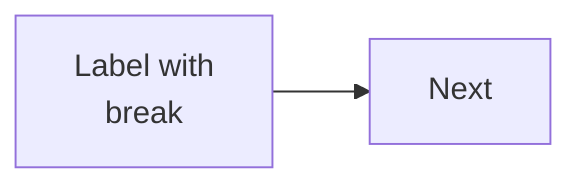

# Handbook style contract — read this fully before writing a chapter

You are writing one chapter of **The Linux, Virtualization & DevOps Handbook**, a
rebuilt-from-scratch replacement for a 326-page trainer PDF. The reader knows how
to program but is learning Linux/Cloud/DevOps from zero. The handbook must be good
enough that they *never open the original PDF again*.

Read `chapters/01-introduction-to-linux.md` first. It is the reference exemplar for
depth, tone, and structure. Match its quality; do not fall below it.

---

## Non-negotiables

1. **Nothing from the source PDF may be lost.** Every concept, command, flag,
   example, diagram, table, and end-of-chapter challenge in your assigned source
   range must appear in your chapter — improved, never dropped. If the PDF gives
   10 challenges, all 10 appear.
2. **Improve, don't summarise.** Where the PDF is thin, wrong, or assumes
   knowledge, fix it: add the missing prerequisite, add the modern equivalent,
   correct the error *and say you corrected it* in a `> [!WARNING]` callout.
3. **Teach, then define.** Intuition and analogy come before formal definitions.
   Never open a topic with a definition.
4. **Every command gets full treatment**: purpose, syntax, every important
   option in a table, multiple worked examples, real output with the output
   *explained field by field*, when professionals actually use it, common
   mistakes, related commands, and why it is preferred over alternatives.
5. **Show real output.** Use plausible, realistic terminal output — never
   `output here`. Explain what each field means.
6. **Write for exams, interviews and production simultaneously.** Every section
   should be usable in all three contexts.

---

## Required chapter structure

Front matter exactly like this (no quotes, no extra keys):

```
---
part: III
part_title: System Internals
number: 07
title: Filesystems, Mounting & the FHS
tagline: One sentence, plain English, no hype. Ends with a full stop.
source: PDF p189-215 quiz bank
minutes: 55
---
```

Then `##` sections. Number them `## 1 · Section name` (the digit, a space, a
middle dot `·`, a space). Use this canonical sequence, adapting names to fit the
topic — you may merge or add sections where the topic demands, but never skip
Big Picture, Intuition, Internal Working, Interview Corner, Common Mistakes,
Cheat Sheet or Practice:

1. **The Big Picture** — why the topic exists, the real problem it solves, where
   it is used, why companies care, where the reader will meet it. Include a
   "where you will encounter it" table.
2. **Intuition First** — simple English, one to three analogies, visual thinking.
3. **Technical Definitions** — the precise versions, with a table unpacking any
   dense definition term by term.
4. **Internal Working** — what actually happens: step-by-step, kernel
   interaction, memory/process/packet/execution flow, architecture. At least one
   `mermaid` diagram and one `diagram` (ASCII) block here.
5. **Real Examples** — beginner → intermediate → production → cloud/DevOps.
6. **Practical Demonstration** — the commands, in full (see rule 4 above).
7. **Comparison Tables** — every meaningful pairing in the topic.
8. **Memory Tricks** — mnemonics and hooks, in `> [!MEMORY]` callouts.
9. **Interview Corner** — beginner, intermediate, advanced, scenario, company
   style and HR style questions, each as a `<details>` block with a model answer.
   Minimum 10 questions.
10. **Common Mistakes** — student, beginner and professional mistakes, plus
    debugging and production failure modes, as `> [!MISTAKE]` / `> [!DANGER]`.
11. **Summary & Mind Map** — a `mermaid` mindmap plus "N sentences that carry the
    chapter".
12. **Cheat Sheet** — a single `diagram` block, one screen tall, that is the
    whole chapter compressed. This is the most-used part of the handbook.
13. **Practice** — flashcard table, 10 MCQs, fill-in-the-blanks, true/false,
    hands-on lab, and the PDF's original challenge questions. Every answer set
    goes inside a `<details><summary>Answers</summary>` block.

Close the chapter with a `> [!NOTE]` pointing to the next chapter.

---

## Markdown conventions this build understands

### Callouts — GitHub alert syntax inside a blockquote

```
> [!TIP]
> Body markdown. Blank lines inside a callout must still start with `>`.
>
> - lists work
```

Available kinds and how they render:

| Syntax | Renders as | Use for |
|---|---|---|
| `[!NOTE]` | Note | neutral asides, pointers to other chapters |
| `[!INFO]` | Background | history, context, "why it ended up this way" |
| `[!TIP]` | Tip | the better way, the shortcut professionals use |
| `[!WARNING]` | Careful | gotchas, deprecations, corrections to the source PDF |
| `[!DANGER]` | Destructive | commands that lose data or break systems |
| `[!MEMORY]` | Memory hook | mnemonics |
| `[!INTERVIEW]` | Interview | "this is the exact question they ask" |
| `[!PROD]` | In production | how it is really used on real systems |
| `[!MISTAKE]` | Common mistake | the specific wrong thing learners do |
| `[!EXAM]` | Exam watch | one-mark answers, precise phrasings to memorise |

Do not overuse callouts — roughly one every 400–600 words. Prose carries the
teaching; callouts punctuate it.

### Fenced blocks — four kinds, each rendered differently

Commands you would type (syntax-highlighted panel):

````
```bash
uname -a
```
````

A terminal transcript, i.e. command *and* its output (dark terminal panel; always
prefix the typed line with `$ `):

````
```console
$ uname -r
6.8.0-45-generic
```
````

An ASCII / box-drawing diagram (monospace panel, `overflow-x` safe). Use
`┌ ─ ┐ │ └ ┘ ├ ┤ ┬ ┴ ┼ → ← ↑ ↓` — they are in the subset font:

````
```diagram title="Optional caption"
  ┌──────────┐
  │  kernel  │
  └──────────┘
```
````

A Mermaid diagram (rendered natively by the host):

````

````

Other languages are fine and get highlighted: `yaml`, `dockerfile`, `ini`,
`python`, `text`, `diff`. Add `title="..."` to any fence for a caption.

### Mermaid rules — follow these or diagrams break

- **Always quote node labels**: `A["ext4 journal"]`, never `A[ext4 journal]`.
  Unquoted labels break on `(`, `)`, `:`, `,`, `/` and `-`.
- Use `<br/>` inside labels for line breaks, never a real newline.
- Safe diagram types: `flowchart TB|LR`, `sequenceDiagram`, `mindmap`,
  `timeline`, `stateDiagram-v2`, `erDiagram`, `gantt`, `pie`.
- In `mindmap`, wrap every node text in `("...")` and indent with two spaces.
- Do not use `classDef`/`style` with custom colours — the host theme handles it.
- Keep any single diagram under ~25 nodes. Two clear diagrams beat one dense one.

### Tables

Plain GitHub tables. They get an `overflow-x` wrapper automatically, so wide
tables are fine. Give every table a header row. Use `✔` / `⚠` / `✘` for verdict
columns.

### Collapsible questions

```
<details>
<summary><strong>Intermediate</strong> — What does the sticky bit do?</summary>

Model answer in full prose. Two or three paragraphs is normal for advanced
questions; do not answer in one line.
</details>
```

Raw HTML `<dl><dt><dd>` blocks are also supported for glossary-style passages
(see Chapter 1 section 4) — leave a blank line before and after the block.

---

## Voice

- British-leaning technical English. Plain, precise, unhurried, never breathless.
- Second person for instruction ("you"), never "we".
- No filler ("it's important to note", "in today's world", "dive deep").
- Em dashes with spaces — like this — not double hyphens.
- Bold for the term being defined, `code` for anything typed or any filename.
- Emoji: essentially never. The callouts already carry the visual signal.
- Never invent a fact you are unsure of. If a flag differs between GNU and BSD,
  say which is which. If behaviour changed by version, give both.

## Length

40–70 KB of markdown per chapter (roughly 6,000–10,000 words). A commands
chapter covering 12+ commands will be at the top of that range. Never pad; every
paragraph must teach something.

## Practical notes

- Write **only** your one file, at `chapters/NN-slug.md`. Do not touch any other
  file, do not run `tools/build.py`, do not edit the CSS or JS.
- Source text for the PDF is pre-extracted in
  `/tmp/claude-1000/-home-sravan-dev-temp/b68dee31-91d6-4af0-b3e7-6445ebfefeb6/scratchpad/`:
  `prose_A.txt` (p1–38), `prose_B.txt` (p39–113), `prose_C.txt` (p114–162),
  `prose_D.txt` (p163–188), `questions.txt` (all 495 quiz questions with page
  numbers), `pdf.txt` (everything). Read the range you were assigned.
- Verify your own markdown before finishing: balanced fences, every `mermaid`
  label quoted, every `<details>` closed, front matter present and complete.
- When done, report in 5 lines: file written, word count, PDF pages covered,
  which PDF errors you corrected, and anything you deliberately left out.
