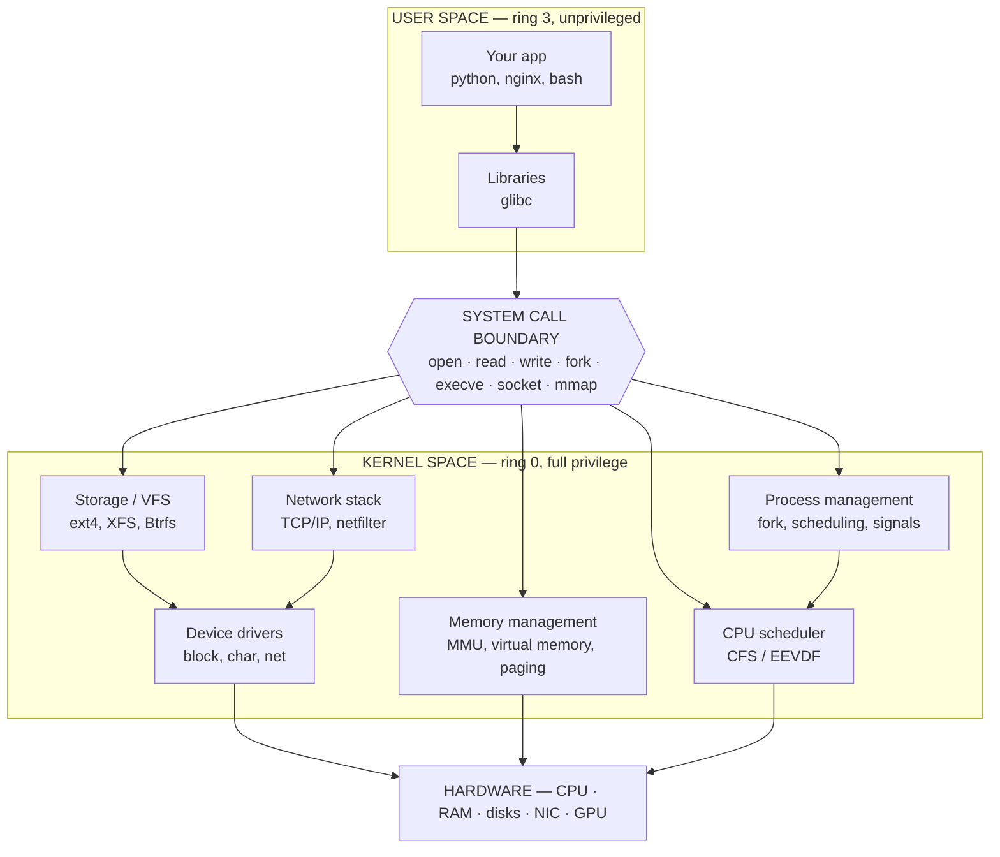
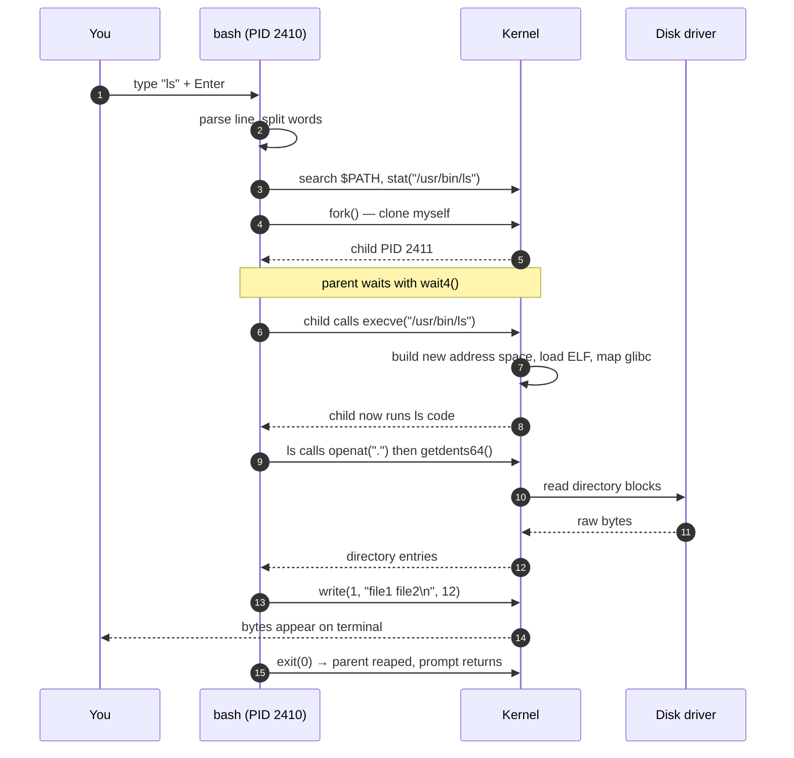
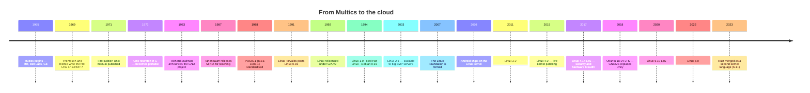
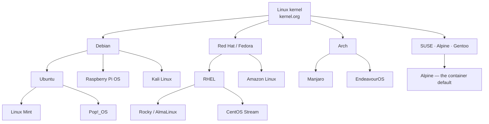
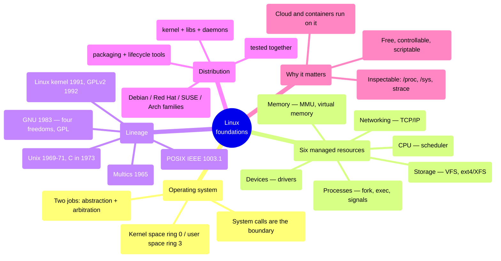

## 1 · The Big Picture

### Why this topic exists

You already know how to program. You can write a function, call an API, loop over an array. But every line of code you have ever written was executed *by something*, on *something*, and that something made thousands of decisions on your behalf: which CPU core ran your loop, where in physical memory your array lives, how your `print` reached a screen, how your HTTP request reached a network card.

That something is the **operating system**. For roughly 96% of the world's servers, ~85% of smartphones, all 500 of the world's fastest supercomputers, and effectively 100% of cloud compute, that operating system is **Linux**.

Learning Linux is not learning "another OS." It is learning the environment in which all professional software actually runs.

### The real problem it solves

Imagine you had no operating system. To write a program that saves a file, you would need to know:

- the exact model of disk controller in this machine, and its register layout
- which physical sectors are free
- how to avoid two programs writing the same sector simultaneously
- how to keep a malicious program from reading another program's data

Now ship that program to a laptop with a different disk. It breaks. An operating system solves this by inserting one layer that does two jobs, forever:

```diagram title="The two jobs of an operating system"
                     Your program says: open("/etc/passwd")
                                    │
              ┌─────────────────────┴─────────────────────┐
              │                                           │
      1. ABSTRACTION                              2. ARBITRATION
      Turn thousands of different                 Decide who gets the CPU,
      hardware devices into a few                 the memory, the disk, and
      uniform ideas: "file",                      the network — and stop
      "process", "socket".                        anyone taking it all or
                                                  reading someone else's data.
              │                                           │
              └─────────────────────┬─────────────────────┘
                                    │
                     One stable interface: the system call
```

Every operating system feature you will ever learn — permissions, processes, mounts, cgroups, namespaces, containers — is a variation on **abstraction** or **arbitration**.

### Where you will encounter it

| Context | What Linux is doing there |
|---|---|
| Any cloud VM (EC2, Compute Engine, Droplet, Azure VM) | The OS you SSH into. Amazon Linux, Ubuntu, RHEL |
| Every Docker container | Containers *are* Linux kernel features (namespaces + cgroups). No Linux, no containers |
| Kubernetes nodes | Every node is a Linux host; every pod a set of Linux processes |
| CI/CD runners | GitHub Actions `ubuntu-latest`, GitLab runners, Jenkins agents |
| Android phones | The Linux kernel with a different userspace (Bionic libc, ART, Zygote) |
| Your router, TV, car, Tesla, ISS laptops | Embedded Linux |
| Supercomputers | 100% of the TOP500 list |

### Why companies care

- **Cost** — no per-socket licence. A startup can run 200 servers for the price of the hardware.
- **Control** — source is available, so a vendor cannot end-of-life your platform out from under you.
- **Automatability** — everything is a file or a command, so everything can be scripted. This is the precondition for DevOps, Infrastructure as Code, and immutable infrastructure.
- **Talent & tooling** — the entire cloud-native ecosystem (Docker, Kubernetes, Terraform, Prometheus) is written *for* Linux first.

> [!INFO]
> **The economics that made Linux inevitable.** In 1998, a Unix licence for a commercial server OS ran into thousands of dollars per machine. Google's original architecture — thousands of cheap commodity PCs instead of a few big Sun servers — is only economically possible if the OS is free. Linux did not win because it was technically superior in 1998; it won because it was the only serious Unix you could deploy 10,000 copies of for nothing, and then improve yourself.

---

## 2 · Intuition First

Do not start with definitions. Start with a picture.

### Analogy 1: the OS as a building manager

You rent an office in a large building. You do not negotiate with the electricity grid, you do not install your own plumbing, and you cannot walk into another tenant's office.

- The **building** is the hardware: power, water, lifts, floor space.
- The **building manager** is the kernel. Small team, enormous authority.
- The **tenants** are your programs.
- **Requesting a service desk visit** is a system call: you fill a specific form (`read`, `write`, `open`), hand it over, and wait.
- **Your keycard only opens your floor** — that is memory protection and file permissions.
- **The manager decides lift priority at 9 a.m.** — that is the CPU scheduler.

Notice what the analogy predicts correctly: tenants cannot see each other's rooms (process isolation), a tenant hogging the lift is a *management* failure (scheduler), and if the building manager crashes, everything stops (kernel panic).

### Analogy 2: kernel versus distribution

This confusion costs people interview points constantly.

```diagram title="Engine vs. car"
    THE LINUX KERNEL                    A LINUX DISTRIBUTION
    (one program, ~40M lines)           (kernel + several thousand programs)

    ┌───────────────┐                   ┌──────────────────────────────────────┐
    │               │                   │  ╔════════════╗  installer, desktop, │
    │    ENGINE     │        →          │  ║   ENGINE   ║  package manager,    │
    │               │                   │  ╚════════════╝  shell, coreutils,   │
    └───────────────┘                   │  wheels, seats, dashboard, paint      │
                                        └──────────────────────────────────────┘
    You cannot drive an engine.         Ubuntu, Debian, Fedora, RHEL, Arch —
    Linus Torvalds ships this.          different cars, same kind of engine.
```

**Linux is the engine. Ubuntu is a car.** Both use the word "Linux" in conversation, and that is fine — but in an exam or interview, say precisely which one you mean.

### Analogy 3: GNU + Linux

In 1983 Richard Stallman started building a complete free operating system called **GNU**. By 1991 GNU had the compiler, the shell, the text editor, the libraries, the utilities — everything *except* a working kernel. In 1991 a Finnish student published a kernel and no userland.

Two half-systems, perfectly complementary. That is why purists insist on the name **GNU/Linux**: the commands you will type in Chapter 4 (`ls`, `cp`, `grep`) are GNU programs, not Linux ones.

> [!MEMORY]
> **"GNU brought the crew, Linus brought the engine."** The kernel talks to hardware; GNU gives you something to type.

---

## 3 · Technical Definitions

Now the precise versions.

**Operating system.** A program that manages hardware resources and provides services to application software through a defined interface. It consists of a **kernel** (privileged, always resident) plus **userspace** components (shell, libraries, daemons, utilities).

**Kernel.** The core of the OS. It is the only code that runs with full hardware privilege (on x86-64, CPU privilege *ring 0*). It owns memory management, process scheduling, device drivers, filesystems, and the network stack. Application code runs in *ring 3* and must ask the kernel for anything privileged.

**Linux.** Specifically, a **monolithic, modular, preemptive, multi-user, multitasking Unix-like kernel**, first released by Linus Torvalds in 1991, licensed under **GPLv2**. Unpack that:

| Term | Meaning | Why it matters |
|---|---|---|
| Monolithic | Drivers and filesystems run inside kernel address space | Fast (no message passing), but a bad driver can crash the machine |
| Modular | Code can be loaded/unloaded at runtime as `.ko` modules | You do not recompile the kernel to add a driver — `modprobe` |
| Preemptive | The kernel can interrupt a running task | Desktop responsiveness; real-time capability |
| Multi-user | Multiple users with separate privileges concurrently | Basis of the entire permission model (Chapter 17) |
| Unix-like | Follows Unix design and largely POSIX | Skills transfer to macOS, BSD, Solaris, AIX |

**POSIX (IEEE 1003.1).** A standard from the 1980s defining the interface between applications and a Unix-like OS: the C library, system interfaces and headers, plus a set of commands and utilities. POSIX is *why* a script written on macOS mostly runs on Linux.

**Linux distribution ("distro").** A packaged, tested, installable operating system built around the Linux kernel. Every distribution ships:

- **the Linux kernel** — hardware, processes, memory, peripherals
- **libraries** — shared code for I/O, maths, cryptography (e.g. `glibc`, `openssl`)
- **system daemons** — background services started at boot: logging, task scheduling, networking, `sshd`
- **development and packaging tools** — compilers and the package manager (`dpkg`/`apt`, `rpm`/`dnf`)
- **life-cycle management utilities** — updates, configuration, health monitoring

Crucially, these components are **tested together for compatibility and interoperability** before release. That integration testing is the actual product a distribution sells.

**Free / open-source software (the prerequisite the PDF assumes you know).** "Free" as in freedom, not price. The GNU project defines four freedoms: to **run** the program, to **study** it, to **modify** it, and to **redistribute** it (modified or not). The **GPL** enforces these with *copyleft*: if you distribute a modified version, you must also distribute the source under the same licence.

---

## 4 · Internal Working

### The six things an operating system manages

The source notes list these; here is what each one actually does.



<dl>
<dt>Memory (MMU)</dt>
<dd>Gives every process its own private illusion of a full address space. The <strong>Memory Management Unit</strong> in the CPU translates a virtual address your program uses into a physical RAM address, using page tables the kernel maintains. This is why one process cannot read another's memory — the translation simply does not exist.</dd>

<dt>Processes</dt>
<dd>Creates, tracks and destroys running programs. Each has a PID, a parent, an owner, an address space and a set of open file descriptors. Linux creates processes by <em>cloning</em> (<code>fork</code>) and then replacing the program image (<code>execve</code>).</dd>

<dt>Devices (drivers)</dt>
<dd>Translates uniform kernel requests into device-specific register writes. A driver is why <code>cat /dev/sda</code> works the same whether the disk is NVMe, SATA or virtual.</dd>

<dt>Storage</dt>
<dd>The <strong>Virtual File System (VFS)</strong> layer presents one API (<code>open/read/write/close</code>) over ext4, XFS, Btrfs, NFS, tmpfs and even <code>/proc</code>. Chapter 11 goes deep on this.</dd>

<dt>CPU (scheduling)</dt>
<dd>Decides which runnable thread gets a core, and for how long. Linux used the Completely Fair Scheduler (CFS) for years; kernel 6.6 replaced it with <strong>EEVDF</strong>. You influence it with <code>nice</code>, <code>chrt</code> and cgroup CPU shares.</dd>

<dt>Networking</dt>
<dd>Implements TCP/IP, routing, firewalling (netfilter/nftables) and sockets. Chapter 15 covers the packet path end to end.</dd>
</dl>

### What actually happens when you run `ls`

This single walkthrough explains more about Linux than any definition.



Six kernel concepts are visible in that trace: `PATH` lookup, `fork`, `execve`, file descriptors (`1` = stdout), system calls, and exit codes. You will meet all six again.

> [!TIP]
> You can watch this for real. `strace -c ls` counts every system call `ls` makes; `strace -f ls` shows them in order. Nothing teaches "what an OS does" faster than reading that output once.

### Kernel space vs user space, concretely

```diagram title="The privilege boundary"
  ┌────────────────────────────────────────────────────────────┐
  │  USER SPACE            can NOT: touch hardware directly,   │
  │  ring 3                        read other processes' RAM,  │
  │  bash, nginx, python           disable interrupts          │
  └───────────────────────────┬────────────────────────────────┘
                              │  syscall instruction
                              │  (a deliberate, checked trap)
  ┌───────────────────────────┴────────────────────────────────┐
  │  KERNEL SPACE          can do everything                   │
  │  ring 0                Crash here = kernel panic           │
  └────────────────────────────────────────────────────────────┘
```

A crash in user space kills one process. A crash in kernel space kills the machine. This is the *entire* security argument for VMs vs containers in Chapter 2 and Chapter 22 — containers share this kernel box; VMs each get their own.

---

## 5 · The History — and Why It Is Not Trivia

Interviewers ask about Unix history because the *design decisions* of 1970 explain the commands you type in 2026.



### The lineage, step by step

**I. Multics (1965–1969) — "Multiplexed Information and Computer Services."** An ambitious MIT/Bell Labs/GE time-sharing system: many users on one machine, each believing they had it to themselves. It worked, but it was enormous, late and slow. Bell Labs withdrew.

**II. Unix (1969–1971).** Ken Thompson and Dennis Ritchie built a deliberately *small* alternative on a spare PDP-7 — the name **UNICS** ("UNiplexed Information and Computing Service") was a pun on Multics. It contributed the ideas you will use every day:

- a **hierarchical file system** — one tree from `/`
- **process management** — cheap processes you can compose
- a **command-line interface** — a shell that is itself a program
- **a wide range of small utilities** — each doing one thing, chained by pipes
- (1973) **rewritten in C**, making Unix the first portable OS

**III. POSIX (1980s).** As Unix forked into many incompatible commercial variants (AIX, HP-UX, SunOS, Xenix — the "Unix wars"), the IEEE 1003.1 standard defined the language interface between application programs and the Unix OS to ensure portability: the C library, system interfaces and headers, plus commands and utilities.

**IV. GNU (1983) — "GNU's Not Unix."** Stallman's response to increasingly proprietary Unix. It promoted the Free Software concept — the freedoms to **run, study, modify and redistribute** — protected by the **GNU General Public License (GPL)**, and set out to build a complete free OS: the shell (`bash`), core utilities (`ls`, `cp`, `grep`), compilers (`gcc`) and the C library (`glibc`).

**V. The Linux kernel (1991).** Torvalds, a 21-year-old at the University of Helsinki, wanted a Unix-like system on his 386 and found MINIX too restrictively licensed. He posted:

> Hello everybody out there using minix — I'm doing a (free) operating system (just a hobby, won't be big and professional like gnu) for 386(486) AT clones.

Licensed under **GPLv2** from 1992, compiled with **GNU GCC**, it became exactly the kernel GNU was missing — giving a Unix-like OS with low cost, full control and strong community support.

> [!WARNING]
> **Two errors from the source notes, corrected.**
>
> 1. The notes state that macOS / OS X and PlayStation OS are "based on or inspired by Linux." They are not. macOS is built on **Darwin** — the XNU kernel, a hybrid of Mach and **BSD** — and PlayStation 4/5 run **Orbis OS**, derived from **FreeBSD**. Both are Unix-*like*, and macOS is even certified UNIX, but neither contains Linux code. **Android** is genuinely Linux-based.
> 2. Linux **6.0** was released in **October 2022**, not 2023. The 2023 milestone worth knowing is **Rust** landing as a second in-kernel language (from 6.1).

### Why the history shows up in your daily work

| 1970s decision | What you type in 2026 |
|---|---|
| Everything is a file | `cat /proc/cpuinfo`, `echo 1 > /sys/...`, `/dev/null` |
| Small tools, composed by pipes | `ps aux \| grep nginx \| awk '{print $2}'` |
| Text as the universal interface | Config in `/etc/*.conf`; logs greppable |
| Multi-user from day one | `chmod`, `chown`, `sudo`, UID/GID |
| Hierarchical single tree | Mounting a disk *into* a path, not a drive letter |

---

## 6 · Why Learn Linux — the Honest Version

The source notes give seven reasons. Here they are with the evidence a hiring manager would want.

1. **Three decades of consistent growth.** Linux is not a legacy skill or a fad; it has been the default server OS for over 20 years, and cloud made that dominance near-total.
2. **Extraordinary versatility.** Web servers, supercomputers (all of the TOP500), IoT devices, in-car systems including Tesla, and Android phones. Many other systems are Unix-like relatives, which makes the skills transferable.
3. **Vast hardware support.** One kernel spans a €4 microcontroller board to a 256-core server, thanks to a huge driver tree and a stable driver model.
4. **Rich software availability.** A deep native ecosystem, plus most major Windows/macOS applications either ported or replaced by equivalents.
5. **Customisability.** Open source and modular: strip it to 8 MB for an embedded device, or tune it for 10-million-packet-per-second networking.
6. **A strong community and ecosystem.** Forums, documentation, tools, conferences, and a genuinely searchable body of knowledge — when something breaks at 2 a.m., someone has already written it down.
7. **Cost-effectiveness — especially for startups.** Run websites, databases and applications with no licence fees, and easy installation, upgrade, deployment and maintenance.

To that list, add the two reasons that matter most for *your* career:

8. **Linux is the substrate of DevOps.** Docker, Kubernetes, Terraform, Ansible, Prometheus and every CI runner assume Linux. You cannot debug a `CrashLoopBackOff` without understanding processes, exit codes and file permissions.
9. **It is the only environment you can fully inspect.** `/proc`, `/sys`, `strace`, `perf`, `bpftrace` — you can watch the OS think. That builds the mental model that makes you senior.

---

## 7 · Understanding a Linux Distribution

A distribution is an *integration product*. Same engine, wildly different assembly decisions.



### The distributions named in the syllabus

| Distribution | Family | Package manager | Known for | Where you meet it |
|---|---|---|---|---|
| **Ubuntu** | Debian | `apt` / `.deb` | User-friendly; the standard beginner recommendation | Cloud default image, CI runners, laptops |
| **Debian** | — | `apt` / `.deb` | Renowned stability; the base for Ubuntu | Long-lived servers, base container images |
| **Fedora** | Red Hat | `dnf` / `.rpm` | Cutting-edge; sponsored by Red Hat; upstream of RHEL | Developer workstations |
| **openSUSE** | — | `zypper` / `.rpm` | Robust and versatile, server *and* desktop; YaST admin tool | European enterprise, SAP shops |
| **Cumulus Linux** | Debian | `apt` | A specialised distro for **networking hardware** — a real Linux on a switch | Data-centre switches (NVIDIA/Mellanox) |
| RHEL / Rocky / Alma | Red Hat | `dnf` | Certified, supported, 10-year lifecycle | Banks, telcos, regulated industries |
| Alpine | — | `apk` | ~5 MB, musl libc + BusyBox | Container base images (Chapter 22) |
| Arch | — | `pacman` | Rolling release, build-it-yourself | Enthusiast desktops |

> [!TIP]
> **Pick two, not ten.** Learn **Ubuntu/Debian** (`apt`, `.deb`) and **RHEL-family** (`dnf`, `.rpm`). Between them they cover the overwhelming majority of production Linux, and every exam question about package management is really asking "do you know both families?"

### What "release model" means for you

| Model | Meaning | Examples | Trade-off |
|---|---|---|---|
| **LTS / point release** | Frozen versions, security patches for 5–10 years | Ubuntu 24.04 LTS, RHEL 9, Debian 12 | Boring and stable; software is older |
| **Rolling** | Continuous updates, no versions | Arch, openSUSE Tumbleweed | Newest software; you are the QA team |
| **Semi-rolling / stream** | Tracks slightly ahead of a stable base | Fedora, CentOS Stream | Middle ground |
| **Immutable** | Read-only root, atomic updates, rollback | Fedora Silverblue, Talos, Flatcar | Excellent for fleets; unusual workflow |

> [!EXAM]
> A distribution = **kernel + libraries + system daemons + development/packaging tools + life-cycle utilities**, all *tested together for compatibility and interoperability*. Memorise those five components and the phrase "tested together" — it is the classic one-mark answer.

---

## 8 · Practical Demonstration

Everything below is safe to run on any Linux machine, including a VM you just built. Type each one; do not read passively.

### Identify the kernel: `uname`

```bash
uname -a
```

```console
$ uname -a
Linux web-prod-01 6.8.0-45-generic #45-Ubuntu SMP PREEMPT_DYNAMIC Fri Aug 30 12:02:04 UTC 2024 x86_64 x86_64 x86_64 GNU/Linux
```

Read the output field by field — this is exactly what an interviewer means by "can you read a command's output?"

| Field | Value | Meaning |
|---|---|---|
| Kernel name | `Linux` | `uname -s` |
| Node name | `web-prod-01` | Hostname (`uname -n`) |
| Kernel release | `6.8.0-45-generic` | `uname -r` — **the one you usually want**. `6`=major, `8`=minor, `0`=patch, `-45`=distro build, `generic`=flavour |
| Kernel version | `#45-Ubuntu SMP PREEMPT_DYNAMIC ...` | Build number, build date, and that it is SMP (multi-processor) and preemptible |
| Machine | `x86_64` | `uname -m` — CPU architecture. `aarch64` on Graviton/Apple silicon |
| OS | `GNU/Linux` | `uname -o` |

Every option:

| Option | Long form | Prints |
|---|---|---|
| `-a` | `--all` | Everything below, in order |
| `-s` | `--kernel-name` | `Linux` (the default if no option is given) |
| `-n` | `--nodename` | Network hostname |
| `-r` | `--kernel-release` | `6.8.0-45-generic` |
| `-v` | `--kernel-version` | Build string and date |
| `-m` | `--machine` | Hardware architecture |
| `-p` | `--processor` | Processor type — often `unknown` on Linux |
| `-i` | `--hardware-platform` | Hardware platform — often `unknown` |
| `-o` | `--operating-system` | `GNU/Linux` |

> [!PROD]
> `uname -r` is one of the most-used commands in real operations. You need it to install matching kernel headers (`apt install linux-headers-$(uname -r)`), to check whether a reboot is pending after a kernel update, to decide if a CVE applies, and to confirm an architecture before pulling a container image.

> [!MISTAKE]
> `uname -p` and `uname -i` return `unknown` on most Linux systems, because Linux does not populate those fields the way other Unixes do. Beginners use them, get `unknown`, and conclude the machine is broken. **Use `-m` for architecture**, or `lscpu` for detail.

### Identify the distribution: `/etc/os-release`

The kernel does not know which distribution it is part of. You have to ask userspace.

```bash
cat /etc/os-release
```

```console
$ cat /etc/os-release
PRETTY_NAME="Ubuntu 24.04.1 LTS"
NAME="Ubuntu"
VERSION_ID="24.04"
VERSION="24.04.1 LTS (Noble Numbat)"
VERSION_CODENAME=noble
ID=ubuntu
ID_LIKE=debian
HOME_URL="https://www.ubuntu.com/"
SUPPORT_URL="https://help.ubuntu.com/"
UBUNTU_CODENAME=noble
```

Why this file and not the alternatives:

| Approach | Verdict |
|---|---|
| `cat /etc/os-release` | ✔ **Preferred.** A standard, machine-parseable file present on every systemd-era distro |
| `. /etc/os-release; echo "$ID $VERSION_ID"` | ✔ Best in scripts — it is valid shell, so you can source it |
| `lsb_release -a` | ⚠ Works, but `lsb_release` is often not installed (it drags in Python) |
| `cat /etc/issue` | ⚠ Cosmetic login banner; may be edited or contain escape codes |
| `cat /etc/redhat-release`, `/etc/debian_version` | ⚠ Family-specific; fine as a fallback, not as your first choice |
| `hostnamectl` | ✔ Nice human summary: hostname, OS, kernel, architecture, virtualisation |

```bash
# The idiom to memorise for scripts that must behave differently per family
. /etc/os-release
case "$ID_LIKE$ID" in
  *debian*) sudo apt-get install -y "$1" ;;
  *rhel*|*fedora*) sudo dnf install -y "$1" ;;
  *) echo "unsupported distro: $ID" >&2; exit 1 ;;
esac
```

### Confirm you are on a VM or a container

You will need this constantly, because "why is this file missing?" is often "because you are not where you think you are."

```console
$ hostnamectl
 Static hostname: web-prod-01
       Icon name: computer-vm
         Chassis: vm 🖳
      Machine ID: 9f2c1e4b7a8d4f1e9c3b5a6d7e8f9012
         Boot ID: 4a1b2c3d4e5f6789abcdef0123456789
  Virtualization: kvm
Operating System: Ubuntu 24.04.1 LTS
          Kernel: Linux 6.8.0-45-generic
    Architecture: x86-64
```

`Virtualization: kvm` is the giveaway. Other quick checks:

```bash
systemd-detect-virt          # prints kvm, vmware, oracle, docker, lxc — or "none" on bare metal
cat /sys/class/dmi/id/product_name   # "VirtualBox", "VMware Virtual Platform", "Standard PC (Q35 ...)"
grep -c ^processor /proc/cpuinfo     # how many logical CPUs the OS can see
```

### Read the machine's vital signs

```console
$ uptime
 21:34:52 up 43 days,  2:11,  3 users,  load average: 0.42, 0.55, 0.61
```

- `up 43 days` — uptime. A *very* long uptime on a server is not a badge of honour; it usually means unpatched kernels.
- `3 users` — logged-in sessions.
- `load average: 0.42, 0.55, 0.61` — runnable+waiting tasks averaged over 1, 5 and 15 minutes. **Compare it to your core count**: load 4.0 on 4 cores is fully busy; load 4.0 on 32 cores is idle. Get the core count from `nproc`.

```console
$ free -h
               total        used        free      shared  buff/cache   available
Mem:           7.7Gi       2.1Gi       0.9Gi        84Mi       4.7Gi       5.3Gi
Swap:          2.0Gi          0B       2.0Gi
```

> [!MISTAKE]
> **"Only 0.9 Gi free — we are out of memory!"** No. Linux deliberately uses spare RAM as disk cache (`buff/cache`), and hands it back instantly when a program needs it. **The column that matters is `available`** (5.3 Gi here). Judging Linux memory by `free` is the single most common beginner misreading of a command output.

```bash
lscpu | head -15        # architecture, cores, sockets, model, virtualization flags
nproc                   # just the number of usable logical CPUs
cat /proc/version       # kernel + compiler used to build it
ls /boot/vmlinuz-*      # the actual kernel images installed
```

### Prove that "everything is a file"

```console
$ cat /proc/uptime
3729055.34 8912304.11

$ cat /proc/sys/kernel/hostname
web-prod-01

$ ls -l /proc/self/fd
lrwx------ 1 dev dev 64 Jul 31 21:09 0 -> /dev/pts/3
lrwx------ 1 dev dev 64 Jul 31 21:09 1 -> /dev/pts/3
lrwx------ 1 dev dev 64 Jul 31 21:09 2 -> /dev/pts/3
```

`/proc` is not a real directory on a disk — it is a *virtual filesystem* the kernel generates on read. You just read live kernel state with `cat`. That is the Unix philosophy made concrete, and it is why shell scripts can monitor a machine without any special API.

> [!DANGER]
> `/proc/sys/**` and `/sys/**` are **writable** on many paths, and writing to them changes live kernel behaviour immediately with no confirmation. `echo 1 > /proc/sys/vm/drop_caches` or `echo 0 > /proc/sys/net/ipv4/ip_forward` will do exactly what they say on a production host. Read freely; write only when you know what the tunable does.

---

## 9 · Comparison Tables

### Linux vs Unix

The single most common opening interview question in this syllabus.

| Dimension | UNIX | Linux |
|---|---|---|
| What it is | A family of proprietary OSes descended from AT&T Bell Labs code, plus a trademark/certification | A kernel (1991) plus GNU userland; a Unix-*like* reimplementation sharing **no** AT&T code |
| Origin | Thompson & Ritchie, Bell Labs, 1969–71 | Linus Torvalds, Helsinki, 1991 |
| Licence | Proprietary, per-vendor (some BSD-derived variants are open) | GPLv2 — free and copyleft |
| Examples | AIX (IBM), HP-UX, Solaris, macOS (certified UNIX) | Ubuntu, RHEL, Debian, Android, Alpine |
| Hardware | Typically tied to vendor hardware (POWER, SPARC, PA-RISC) | Runs on almost anything, from microcontrollers to supercomputers |
| Development | Closed, vendor-controlled | Open, ~15,000 contributors per release cycle |
| Cost | Licence + support contract | Free; you may pay for support (RHEL, Ubuntu Pro) |
| Standard | Often formally POSIX/SUS-certified | Largely POSIX-compliant, rarely certified |
| Interview answer in one line | *"Unix is the ancestor and a certification; Linux is an independent, GPL-licensed, Unix-like kernel that behaves like Unix without containing its code."* | |

### Linux vs Windows Server

| Dimension | Linux | Windows Server |
|---|---|---|
| Licensing cost | Free kernel + distro; optional support | Per-core licensing plus CALs |
| Primary interface | CLI first, GUI optional | GUI first, PowerShell increasingly first-class |
| Configuration | Plain-text files in `/etc` | Registry + GUI + PowerShell/DSC |
| Package management | Built in (`apt`, `dnf`) | `winget`/MSI; historically manual installers |
| Path separator / case | `/`, case-**sensitive** | `\`, case-insensitive |
| Remote administration | SSH (built in, tiny, scriptable) | RDP / WinRM |
| Server market share | Overwhelming majority | Strong in AD, Exchange, .NET-legacy estates |
| Reboots for updates | Often avoidable; live patching exists | Frequently required |
| Container support | Native — containers are Linux features | Windows containers exist; Linux containers via WSL2/Hyper-V |

### Kernel vs distribution vs GNU

| | Linux kernel | GNU userland | Distribution |
|---|---|---|---|
| What it is | One program managing hardware | Shell, coreutils, compiler, libc | Kernel + userland + packaging + testing |
| Who ships it | kernel.org, Linus Torvalds | GNU project (FSF) | Canonical, Red Hat, Debian project, SUSE |
| Example artefact | `/boot/vmlinuz-6.8.0-45` | `/bin/bash`, `/bin/ls`, `/lib/libc.so.6` | `ubuntu-24.04.1-live-server-amd64.iso` |
| Can you run just this? | No — it needs a userland to be useful | No — it needs a kernel | Yes |
| Version you quote | `uname -r` | `bash --version` | `/etc/os-release` |

### Free software licences you will be asked about

| Licence | Type | Obligation when you distribute a modified version | Typical use |
|---|---|---|---|
| **GPLv2** | Strong copyleft | Publish your source under GPLv2 | Linux kernel, `git` |
| **GPLv3** | Strong copyleft | GPLv2 + patent and anti-tivoisation clauses | `bash`, GCC |
| **LGPL** | Weak copyleft | Only library changes must be shared; you may link proprietary code | `glibc` |
| **Apache 2.0** | Permissive | Keep notices; grants patent rights | Kubernetes, Terraform (pre-2023) |
| **MIT / BSD** | Permissive | Keep the copyright notice | React, nginx (BSD-like) |
| **AGPLv3** | Strong copyleft + network | Providing it *as a service* triggers source disclosure | MongoDB (pre-2018), Grafana |

> [!EXAM]
> **"What is the significance of the GPL for Linux?"** It guarantees the four freedoms and, crucially, is *copyleft*: anyone shipping a modified kernel must release their source under GPLv2 too. This is why vendors (Red Hat, Google, NVIDIA) contribute improvements upstream instead of forking privately, and it is the legal mechanism behind three decades of shared development.

---

## 10 · Interview Corner

<details>
<summary><strong>Beginner</strong> — What is an operating system, in one sentence?</summary>

Software that manages hardware resources and exposes them to applications through a stable interface — concretely, it manages memory, processes, devices, storage, CPU scheduling and networking, and it enforces isolation between users and programs.
</details>

<details>
<summary><strong>Beginner</strong> — What is the difference between Linux and a Linux distribution?</summary>

Linux is the kernel: one program that talks to hardware and schedules work. A distribution is a complete, installable operating system built around that kernel — adding GNU libraries and utilities, system daemons, a package manager, an installer and life-cycle tools, all tested together. Analogy: Linux is the engine, Ubuntu is the car.
</details>

<details>
<summary><strong>Beginner</strong> — Which command tells you the kernel version, and which tells you the distribution?</summary>

`uname -r` gives the kernel release (e.g. `6.8.0-45-generic`). The distribution comes from userspace: `cat /etc/os-release` (or `hostnamectl` for a human summary). This is a deliberate trap — the kernel genuinely does not know it is "Ubuntu."
</details>

<details>
<summary><strong>Intermediate</strong> — Is Linux the same as Unix? Explain the relationship.</summary>

No. Unix is a family of proprietary operating systems descending from AT&T Bell Labs code (1969), and also a certification/trademark. Linux is an independent kernel written from scratch by Linus Torvalds in 1991 that *behaves* like Unix — it follows Unix design principles and is largely POSIX-compliant — but contains no AT&T source code. This distinction was legally significant: it is why Linux survived the SCO litigation and why "Unix-like" is the accurate term. Interestingly, macOS *is* certified UNIX while Linux is not.
</details>

<details>
<summary><strong>Intermediate</strong> — Why is Linux called a monolithic kernel, and what would the alternative be?</summary>

Monolithic means device drivers, filesystems and the network stack all run inside the kernel's address space at full privilege. The upside is speed: a filesystem calling a driver is a function call, not an inter-process message. The downside is blast radius — a buggy driver can panic the machine. The alternative is a microkernel (MINIX, QNX, seL4, and Mach in the hybrid XNU), which runs drivers as user-space servers: more robust and more isolated, but slower due to message passing. Linux is monolithic *and modular*: `.ko` modules can be loaded and unloaded at runtime, giving some of the flexibility without the IPC cost.
</details>

<details>
<summary><strong>Intermediate</strong> — Are all Linux distributions free?</summary>

The software is nearly always free and open source, but the *product* need not be. Red Hat Enterprise Linux requires a paid subscription for supported binaries, certification and a 10-year lifecycle — you pay for support, QA, certified hardware/software compatibility and legal indemnity, not for the code. SUSE Linux Enterprise is the same model. Rocky Linux and AlmaLinux exist precisely to offer RHEL-compatible binaries free of charge. Ubuntu is free with optional paid Ubuntu Pro. The key distinction to state: **free as in freedom, not necessarily free as in support.**
</details>

<details>
<summary><strong>Advanced</strong> — Walk me through what happens between pressing Enter on <code>ls</code> and seeing output.</summary>

The shell parses the line into words, resolves `ls` by searching `$PATH` and `stat`ing candidates, then calls `fork()` to clone itself. The child calls `execve("/usr/bin/ls")`; the kernel tears down the child's address space, maps the ELF binary and its shared libraries (`glibc`) via the dynamic loader, and jumps to the entry point. `ls` calls `openat()` on the directory and `getdents64()` to read entries, which goes through the VFS layer to the concrete filesystem (ext4), which asks the block layer, which asks the driver, which talks to the device. Results come back up, `ls` formats them and calls `write(1, ...)` to file descriptor 1, which the terminal driver renders. `ls` calls `exit_group(0)`; the parent, blocked in `wait4()`, reaps the child, stores the exit status in `$?`, and prints the prompt.
</details>

<details>
<summary><strong>Advanced</strong> — What is the practical difference between user space and kernel space, and why do you care as a DevOps engineer?</summary>

Kernel space runs at CPU ring 0 with unrestricted access to hardware and all memory; user space runs at ring 3 and must request privileged operations via system calls, which the kernel validates. Practically: a segfault in user space kills one process, while a bug in kernel space panics the host. That boundary is the entire basis of the container-vs-VM security argument — containers on one host share a single kernel, so a kernel-level escape affects every container, whereas each VM has its own kernel behind a hypervisor. It is also why "unprivileged containers", `seccomp` and dropping capabilities matter: they narrow which system calls a workload may make.
</details>

<details>
<summary><strong>Advanced</strong> — Why did Linux succeed where GNU Hurd and commercial Unix did not?</summary>

Three reasons. Technically, Torvalds chose a pragmatic monolithic design that worked in 1991, while GNU's Hurd pursued a more elegant microkernel that never stabilised. Legally, GPLv2 forced improvements back into the commons, so competing vendors' work compounded instead of fragmenting — the opposite of the Unix wars. Economically, commodity x86 plus a zero-cost OS enabled scale-out architectures (Google, Amazon) that per-socket Unix licensing made unaffordable. Distribution mattered too: Red Hat and Debian turned a kernel into something an enterprise could actually buy and support.
</details>

<details>
<summary><strong>Scenario</strong> — You SSH into a server you have never seen. Name the first five commands you run and why.</summary>

1. `hostnamectl` or `cat /etc/os-release` + `uname -r` — which distro, which kernel, is it virtualised. Everything else depends on this.
2. `uptime` and `nproc` — load average interpreted against core count; how long since the last reboot.
3. `df -hT` — is any filesystem full? A full `/` or `/var` explains an enormous share of "the app is broken" tickets.
4. `free -h` — memory pressure and whether swap is in use, reading the `available` column.
5. `systemctl --failed` then `journalctl -p err -b` — which units failed and what the kernel/services complained about this boot.

Follow-up: `ss -tulpn` for listening ports, and `ps aux --sort=-%mem | head` for the heaviest processes.
</details>

<details>
<summary><strong>Scenario</strong> — A developer says "it works on my machine but not on the server." How does your Linux knowledge help?</summary>

Enumerate the differences the OS makes visible: distribution and version (`/etc/os-release`), kernel (`uname -r`), architecture (`uname -m` — an x86-64 binary or image will not run on Graviton), library versions (`ldd ./app`), locale and timezone, filesystem case sensitivity (macOS is case-insensitive, Linux is not, so `require('./Utils')` breaks), file permissions and ownership after a `git clone` or `COPY`, environment variables, and whether the process runs as root locally but as an unprivileged user in production. The structural fix is to remove the difference: containerise, so the same image runs in both places (Chapter 22).
</details>

<details>
<summary><strong>Company style</strong> — Why do cloud providers standardise on Linux?</summary>

Cost at scale (no per-instance licence across millions of hosts), modifiability (AWS ships its own kernel patches and builds Amazon Linux; Google runs a heavily customised kernel), automatability (the entire control plane provisions machines by script and API, which requires a headless, text-configurable OS), the kernel features cloud is built on (KVM for virtualisation, namespaces and cgroups for containers, eBPF for observability and networking), and the ecosystem — every cloud-native tool targets Linux first.
</details>

<details>
<summary><strong>HR style</strong> — How do you keep up with Linux and DevOps?</summary>

Answer with specifics and a system, not enthusiasm: release notes for the tools you actually run (kernel, distro LTS announcements, Kubernetes changelogs), one or two high-signal newsletters, and — most convincingly — a home lab. "I run a three-VM cluster on my laptop with VirtualBox, I break it deliberately and practise recovery, and I keep my notes and scripts in a Git repo" is a far stronger answer than naming five websites. Mention how you verify: you read `man` pages and official docs before Stack Overflow answers.
</details>

<details>
<summary><strong>HR style</strong> — Tell me about a time you broke something.</summary>

Use a real, small, honest story with a systems lesson: you ran `rm -rf` with a variable that was empty, or `chmod -R 777 /`, or filled `/var` with logs and the database stopped accepting writes. Then tell the recovery and the *change you made afterwards* — snapshot before risky operations, `set -u` in scripts, `--dry-run` first, log rotation configured, alerting on disk usage at 80%. Interviewers are testing whether you learn systematically, not whether you have a spotless record.
</details>

---

## 11 · Common Mistakes

> [!MISTAKE]
> **Saying "Linux" when you mean "Ubuntu."** Fine in conversation, costly in interviews and bug reports. If a command fails, the first question is *which distribution and version* — because `apt` vs `dnf`, `/etc/network/interfaces` vs `netplan` vs `NetworkManager`, and default firewall behaviour all differ.

> [!MISTAKE]
> **Thinking `free` "low free memory" means trouble.** Read the `available` column. Linux caching RAM is the system working correctly.

> [!MISTAKE]
> **Ignoring case sensitivity.** `File.txt`, `file.txt` and `FILE.TXT` are three different files. Code that worked on macOS or Windows fails on Linux for exactly this reason — usually in an import path or a Dockerfile `COPY`.

> [!MISTAKE]
> **Assuming the GUI exists.** A cloud server has no desktop. Learn to do everything through a shell over SSH; installing a desktop on a production server to "make it easier" wastes RAM and widens the attack surface.

> [!MISTAKE]
> **Learning commands without the model.** Memorising 60 commands without understanding processes, file descriptors and permissions produces someone who can type but cannot debug. The commands in Chapters 4–9 are only useful on top of this chapter's mental model.

> [!MISTAKE]
> **Practising on something that matters.** Do not learn on a machine you cannot destroy. Build the VM in Chapter 2, snapshot it, and break it freely.

> [!DANGER]
> **The classics that will end your day.** `rm -rf /` and its cousin `rm -rf $VAR/` when `$VAR` is unset; `chmod -R 777 /` (breaks SSH, `sudo` and the whole permission model); `dd if=... of=/dev/sda` pointed at the wrong disk; `> file` when you meant `>> file`. Every one of these is a *correct* command doing exactly what you asked. Linux has no undo and no recycle bin.

---

## 12 · Summary & Mind Map



**Ten sentences that carry the chapter.**

1. An OS abstracts hardware and arbitrates access to it; every Linux feature is one of those two things.
2. The kernel is the privileged core; everything else is userspace, and the system call is the border crossing.
3. Linux is a monolithic, modular, preemptive, multi-user, Unix-like kernel under GPLv2, first released in 1991.
4. A distribution is kernel + libraries + daemons + packaging/dev tools + lifecycle utilities, tested together.
5. GNU supplied the userland; Linux supplied the kernel; together they made a complete free OS.
6. POSIX is why Unix skills transfer between Linux, macOS and BSD.
7. `uname -r` is the kernel; `/etc/os-release` is the distribution; the kernel does not know its own distro.
8. Judge memory by `available`, and load average against core count.
9. `/proc` and `/sys` are the kernel exposed as files — the purest form of "everything is a file."
10. The GPL's copyleft is the legal reason three decades of competing vendors improved one shared kernel.

---

## 13 · Cheat Sheet

```diagram title="Chapter 01 — one-page revision"
IDENTIFY THE SYSTEM                      READ ITS STATE
  uname -r        kernel release           uptime          load + how long up
  uname -m        architecture             nproc           usable CPU count
  uname -a        everything               free -h         memory (read AVAILABLE)
  cat /etc/os-release   distro (script)    df -hT          disk usage + fs type
  hostnamectl     human summary            lscpu           CPU detail
  systemd-detect-virt   vm? container?     ps aux          process snapshot
  cat /proc/version     kernel + gcc       systemctl --failed   broken units

THE SIX THINGS AN OS MANAGES     Memory (MMU) · Processes · Devices (drivers)
                                 Storage (VFS) · CPU (scheduling) · Networking

PRIVILEGE                        user space = ring 3  →  syscall  →  kernel = ring 0
                                 user crash = one process ends
                                 kernel crash = the machine ends (panic)

TIMELINE   Multics 1965 → Unix 1969/71 → C 1973 → GNU 1983 → MINIX 1987
           → POSIX 1988 → Linux 0.01 1991 → GPLv2 1992 → 1.0 + Red Hat 1994
           → 2.6 in 2003 → Foundation 2007 → Android 2008 → 3.0 2011
           → 4.0 live patching 2015 → 5.10 LTS 2020 → 6.0 in 2022 → Rust 6.1

FIVE PARTS OF A DISTRO   kernel · libraries · system daemons ·
                         dev + packaging tools · lifecycle utilities
                         ...all TESTED TOGETHER  (classic exam answer)

FAMILIES   Debian/Ubuntu → apt, .deb        Red Hat/Fedora/RHEL → dnf, .rpm
           SUSE → zypper, .rpm              Arch → pacman       Alpine → apk

ONE-LINERS THAT WIN INTERVIEWS
  "Linux is the engine; Ubuntu is the car."
  "Unix is the ancestor and a certification; Linux is a GPL-licensed
   Unix-like kernel that shares its behaviour but not its code."
  "The kernel doesn't know it's Ubuntu — that's a userspace fact."
```

---

## 14 · Practice

### Flashcards

| Prompt | Answer |
|---|---|
| Who wrote the first Unix, and when? | Ken Thompson and Dennis Ritchie at Bell Labs, 1969; first-edition manual 1971 |
| What does GNU stand for? | GNU's Not Unix |
| What licence covers the Linux kernel? | GPLv2 |
| What year was Linux 0.01 released, and by whom? | 1991, Linus Torvalds |
| What is POSIX's formal name? | IEEE 1003.1 |
| Which OS inspired Linus, and who wrote it? | MINIX, by Andrew S. Tanenbaum (1987) |
| Which command reveals the distribution? | `cat /etc/os-release` |
| Name the four software freedoms | Run, study, modify, redistribute |
| Which CPU ring does the kernel run in? | Ring 0 |
| What are the two system calls behind starting a program? | `fork()` then `execve()` |
| Which `free` column shows usable memory? | `available` |
| Which distro is designed for network switches? | Cumulus Linux |
| Which distro is the container default, and why? | Alpine — ~5 MB, musl libc + BusyBox |
| What made Unix portable in 1973? | Being rewritten in C |

### Multiple choice

1. Which is **not** one of the six resources an OS manages, as listed in the syllabus? **(a)** Memory **(b)** Processes **(c)** Compilation **(d)** Networking
2. `uname -r` prints: **(a)** the distribution name **(b)** the kernel release **(c)** the CPU architecture **(d)** the hostname
3. The Linux kernel is licensed under: **(a)** MIT **(b)** Apache 2.0 **(c)** GPLv2 **(d)** GPLv3
4. Which is a *Debian*-family distribution? **(a)** Fedora **(b)** openSUSE **(c)** Ubuntu **(d)** Rocky Linux
5. Which statement is true? **(a)** macOS is based on the Linux kernel **(b)** Android is based on the Linux kernel **(c)** PlayStation OS is based on Linux **(d)** Windows uses a Linux kernel
6. POSIX exists to: **(a)** speed up the kernel **(b)** standardise the application/OS interface for portability **(c)** manage packages **(d)** license free software
7. A crash in kernel space: **(a)** kills one process **(b)** kills the machine **(c)** is caught by the shell **(d)** restarts the process
8. Which command shows whether you are inside a VM? **(a)** `uname -p` **(b)** `systemd-detect-virt` **(c)** `nproc` **(d)** `history`
9. Load average `4.00` is *healthy* on a host with: **(a)** 1 core **(b)** 2 cores **(c)** 32 cores **(d)** load average is unrelated to cores
10. "Monolithic kernel" means: **(a)** it cannot be extended **(b)** drivers run in kernel address space **(c)** it is one single file on disk **(d)** it supports one user

<details>
<summary>Answers</summary>

1. (c) — compilation is a userspace tool's job.
2. (b).
3. (c) GPLv2 — deliberately *not* v3, a detail interviewers like.
4. (c) Ubuntu.
5. (b) Android.
6. (b).
7. (b) — a kernel panic.
8. (b).
9. (c) 32 cores — load must always be read against core count.
10. (b) — and Linux is monolithic *and* modular.
</details>

### Fill in the blanks

1. The kernel runs in ring ______ ; applications run in ring ______ .
2. The interface applications use to request privileged operations is the ______ ______ .
3. GNU was founded in ______ by ______ ______ .
4. Linux was relicensed under the GPL in ______ .
5. `______ ______` is the standard file to read to identify the distribution.
6. The unit that translates virtual addresses to physical ones is the ______ .
7. The layer presenting one API over many filesystems is the ______ .
8. A Linux distribution's five components are kernel, ______ , system ______ , development/packaging tools and ______ -cycle utilities.

<details>
<summary>Answers</summary>

1. 0 ; 3 — 2. system call — 3. 1983, Richard Stallman — 4. 1992 — 5. `/etc/os-release` — 6. MMU (Memory Management Unit) — 7. VFS (Virtual File System) — 8. libraries ; daemons ; life
</details>

### True or false

1. Linux contains original AT&T Unix source code.
2. `uname` can tell you which distribution you are running.
3. Every Linux distribution is free of charge.
4. Android is built on the Linux kernel.
5. A distribution's main value is its integration and testing of components.
6. `/proc` is stored on your disk.
7. macOS is a certified UNIX; Linux generally is not.
8. Adding a driver to Linux always requires recompiling the kernel.

<details>
<summary>Answers</summary>

1. **False** — it is an independent, Unix-*like* reimplementation.
2. **False** — the distro is a userspace fact; read `/etc/os-release`.
3. **False** — RHEL and SLES require paid subscriptions for supported binaries; the *software* is free, the *product* need not be.
4. **True**.
5. **True**.
6. **False** — it is a virtual filesystem generated by the kernel on read.
7. **True** — a satisfying piece of trivia.
8. **False** — loadable kernel modules (`modprobe`, `.ko`) exist precisely to avoid that.
</details>

### Hands-on lab

Do these on a throwaway VM (build one in Chapter 2 first if you have not).

1. **Fingerprint your machine.** Record kernel release, architecture, distribution and version, virtualisation type, core count, total RAM and root filesystem type — one command each. Put the results in a file called `fingerprint.txt`.
2. **Read live kernel state as files.** `cat` five different files under `/proc` and explain in one line each what they told you. Include `/proc/uptime`, `/proc/meminfo`, `/proc/cpuinfo`, `/proc/loadavg` and `/proc/self/status`.
3. **Watch a program talk to the kernel.** Install `strace`, then run `strace -c ls` and `strace -f -e trace=openat ls`. Identify the `execve`, the `openat` calls for shared libraries, and the final `write` to fd 1.
4. **Prove case sensitivity.** Create `file.txt` and `File.txt` in one directory, put different text in each, and `cat` both. Explain why this breaks code ported from macOS or Windows.
5. **Compare two package families.** Without installing anything, work out and write down the command to install `nginx`, remove it, search for it, and list installed packages — once for `apt`, once for `dnf`.
6. **Read a distribution's identity in a script.** Write a five-line shell script that sources `/etc/os-release` and prints `Detected: <NAME> <VERSION_ID> (family: <ID_LIKE>)`.

### Challenge problems

1. Explain, without notes, the difference between a Linux distribution and the Linux kernel, and how they interact within the overall system.
2. Find three trustworthy sources for downloading Linux distributions, and explain how you would verify an ISO you downloaded is genuine (research `sha256sum` and GPG signature verification).
3. Investigate whether Linux is the same as UNIX: histories, similarities, differences, and the reason Linux was created rather than a Unix being adopted.
4. Determine whether all Linux distributions are free. Compare pricing models, professional support, additional services and enterprise features for Ubuntu, RHEL and Rocky Linux.
5. Investigate how well Linux runs on varied hardware, and list the key considerations before installing it on an unfamiliar device (firmware type, drivers, architecture, secure boot).
6. Map the Linux community and ecosystem: where the resources, forums, tutorials and documentation you would actually rely on live, ranked by trustworthiness.
7. Explain the significance of the GPL and how it affects using, modifying and redistributing Linux. Contrast it with a permissive licence like MIT.
8. Enumerate Linux's security features and how each maintains system security: user/group permissions, `sudo`, file ownership, SELinux/AppArmor, `seccomp`, capabilities, namespaces, ASLR, signed kernel modules.
9. List the basic commands every Linux user should know and group them by purpose. Compare your list against Chapters 4–9 afterwards and note what you missed.
10. Compare Ubuntu, Fedora and Arch Linux on installation ease, package management, community support and target audience. Recommend one for a beginner and defend the choice.

> [!NOTE]
> **Where to go next.** Chapter 2 gives you the lab: virtualisation, hypervisors, VM networking and the command-line tools for VirtualBox, VMware and KVM — so that every exercise from here on has a machine you are free to destroy.
