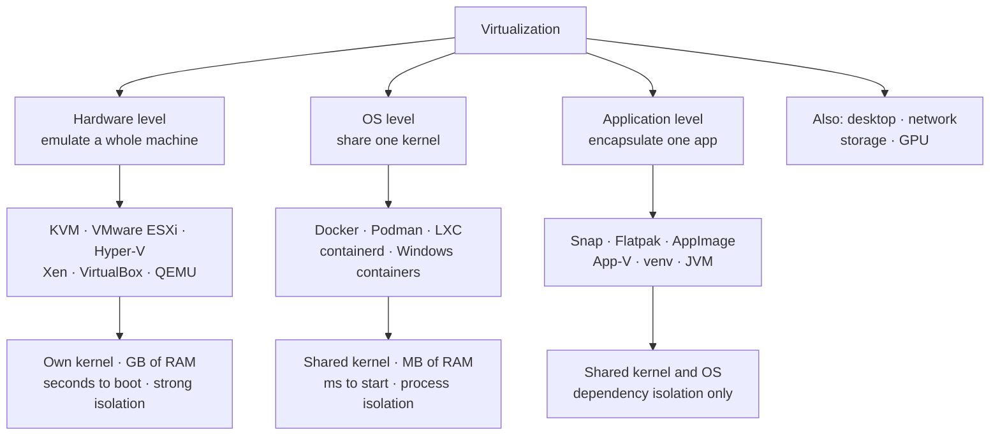
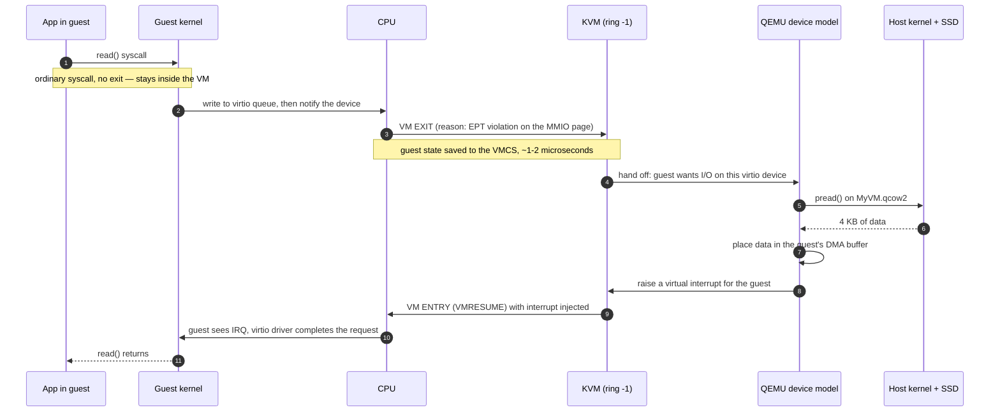
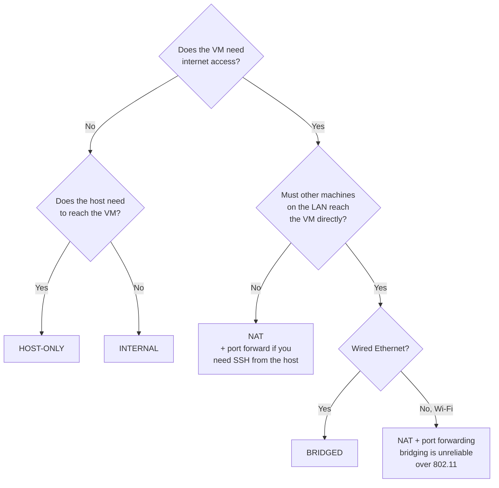
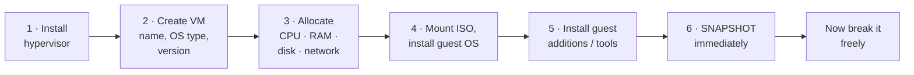
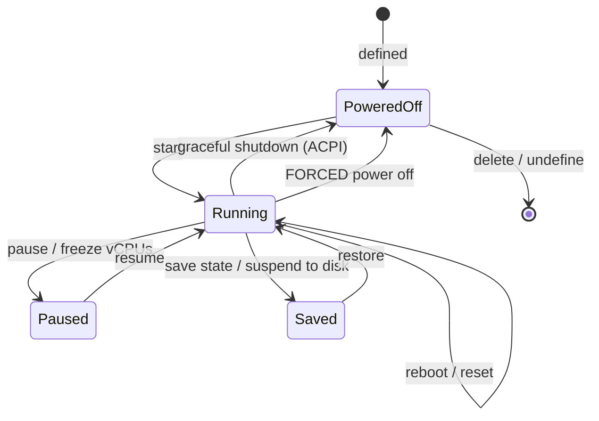

## 1 · The Big Picture

### Why this topic exists

In 2001, a typical corporate data centre looked like this: a rack of servers, each one running exactly one application, each one averaging **5 to 15 percent CPU utilisation**. The mail server was idle at night. The payroll server was idle for 29 days a month. The web server needed twelve cores at 11 a.m. and none at 3 a.m. Every one of those machines drew power, occupied rack space, required cooling, and had to be bought, patched and eventually replaced.

The reason for one-app-per-server was not stupidity. It was **blast radius**. If the mail server and the payroll database shared a machine, a memory leak in one starved the other; a security compromise in one exposed the other; a required reboot for one took down both. Operations teams bought isolation the only way they knew how — with separate hardware.

Virtualization broke that trade-off. It lets you keep the isolation *and* stop wasting the hardware, by inserting a layer that hands each workload a convincing, private, complete-looking computer that does not actually exist.

That is the whole idea. Everything else in this chapter is mechanism.

### The real problem it solves

```diagram title="The problem virtualization solved"
  BEFORE                                    AFTER

  ┌────────┐ ┌────────┐ ┌────────┐          ┌───────────────────────────┐
  │ mail   │ │ payroll│ │  web   │          │  ┌─────┐ ┌─────┐ ┌─────┐  │
  │  8%    │ │   3%   │ │  11%   │          │  │mail │ │pay  │ │ web │  │
  │  used  │ │  used  │ │  used  │          │  └─────┘ └─────┘ └─────┘  │
  ├────────┤ ├────────┤ ├────────┤          │  ┌─────┐ ┌─────┐ ┌─────┐  │
  │ 1 CPU  │ │ 1 CPU  │ │ 1 CPU  │          │  │ ci  │ │test │ │stage│  │
  │ 1 PSU  │ │ 1 PSU  │ │ 1 PSU  │          │  └─────┘ └─────┘ └─────┘  │
  │ 1 rack │ │ 1 rack │ │ 1 rack │          ├───────────────────────────┤
  │  slot  │ │  slot  │ │  slot  │          │      HYPERVISOR           │
  └────────┘ └────────┘ └────────┘          ├───────────────────────────┤
                                            │  ONE machine · 78% used   │
  3 machines · 92% of the money             └───────────────────────────┘
  spent on idle silicon
                                            Same isolation. One third of
                                            the power, space and capital.
```

Three separate wins fall out of that single move, and it is worth naming them separately because interviewers ask for them separately:

- **Consolidation** — many logical machines on one physical machine, so you stop paying for idle silicon.
- **Decoupling** — the operating system no longer knows or cares what hardware it is on, so a machine becomes a *file* you can copy, snapshot, move and version.
- **Isolation** — a crash, a kernel panic, a rogue process or a compromised service is contained inside one VM.

The second one is the quiet revolution. Once a server is a file, everything DevOps does becomes possible: reproducible environments, immutable infrastructure, golden images, automated provisioning, disaster recovery that is a `restore` rather than a purchase order. Amazon Web Services is, at its foundation, a very large business built on the observation that a computer can be an API call.

### Where you will encounter it

| Context | What virtualization is doing there |
|---|---|
| Any cloud instance — EC2, Compute Engine, Azure VM, Droplet | The "instance" *is* a VM. Your `t3.medium` is a slice of a much larger physical host |
| Your own laptop lab | VirtualBox / VMware / UTM / Hyper-V running the Linux you practise on |
| CI/CD runners | GitHub Actions `ubuntu-latest` is a freshly created VM, destroyed after your job |
| Docker on macOS or Windows | Docker Desktop runs a *Linux VM* and puts your containers inside it — there are no Linux containers without a Linux kernel |
| Kubernetes nodes | Almost always VMs (EKS/GKE/AKS node groups are managed VM fleets) |
| Corporate desktops (VDI) | Citrix / Horizon / AVD — your "PC" is a VM in a data centre |
| Enterprise data centres | VMware vSphere, Proxmox VE, Nutanix, Hyper-V clusters |
| Security work | Malware analysis in a disposable, network-isolated VM |
| Legacy systems | The 2003 accounting application that only runs on Windows Server 2003, kept alive inside a VM long after that hardware died |
| Android and iOS development | Emulators and simulators — related technology, and the Android emulator uses KVM/HAXM/Hypervisor.framework for speed |

### Why companies care

- **Capital and operating cost.** Consolidation ratios of 10:1 to 30:1 are routine. Fewer machines means less power, less cooling, less rack space, fewer support contracts.
- **Speed of provisioning.** A physical server takes weeks — quote, purchase, ship, rack, cable, install. A VM takes 90 seconds. That difference is why "just spin up a test environment" is a sentence that exists.
- **Disaster recovery.** A VM is a directory of files plus a description. Replicate those to another site and you have a recovery plan that can be *tested* without buying a second data centre.
- **Hardware independence.** A VM configured with a virtual `virtio` disk and a virtual NIC boots on any host, regardless of whether the physical disk is SAS, SATA or NVMe. You can replace a whole generation of hardware underneath a running estate.
- **Consolidated maintenance.** Live migration moves running VMs off a host so you can patch its firmware at 2 p.m. on a Tuesday instead of 3 a.m. on a Sunday.

> [!INFO]
> **The idea is older than you think.** IBM shipped CP-40 and then CP-67/CMS in the late 1960s, giving each user of a System/360 mainframe a complete virtual machine — the term "hypervisor" comes from that era, because the mainframe's control program was called the *supervisor*, so the thing above it had to be the *hyper*visor. In 1974, Popek and Goldberg published the formal criteria a virtual machine monitor must satisfy: **equivalence** (software behaves as it would on real hardware), **resource control** (the VMM keeps control of all resources), and **efficiency** (most instructions run without VMM intervention). Everything in this chapter is a strategy for satisfying all three on x86, an architecture that — unlike the mainframe — was not designed to allow it.

---

## 2 · Intuition First

### Analogy 1: the subdivided building

Chapter 1 used a building manager for the operating system. Extend the same building.

You own a large warehouse. You could let one tenant have all of it — that is a bare-metal server. Instead, you build internal walls, run separate electricity meters, fit separate locks, and let out six units. Each tenant:

- believes they have "a building" — their own front door, their own meter, their own space
- cannot walk into another unit
- shares the roof, the foundations and the electricity supply, whether they know it or not
- can be evicted, and their unit re-let, without touching anyone else

The **hypervisor is the landlord**: it decides how much floor space and power each unit gets, enforces the locks, and is the only party who can see the whole floor plan. The VM's operating system is a tenant who has never seen the outside of the building.

The analogy predicts real behaviour. If the landlord promises 8 units of power each but the supply only delivers 30, everyone is fine until they all switch on the kettle at once — that is **memory and CPU overcommitment**, and section 9 covers what happens next. If someone drills through a wall, the isolation was never as absolute as the tenants believed — that is a **VM escape**, and section 17 covers it.

### Analogy 2: the flight simulator

A flight simulator presents a pilot with a cockpit: throttle, yoke, instruments, the view out of the window. Every control is real to the touch, and every instrument reacts correctly. Nothing behind the panel is an aircraft.

A **full virtualization** hypervisor does exactly this to an operating system. When Windows asks the hard disk controller for sector 40,000, something answers, and it answers the way an Intel AHCI controller would — but it is software, and the sector lives inside a `.vdi` file on your laptop's SSD. Windows never finds out.

Now imagine a simulator where the pilot *knows* it is a simulator, and instead of moving a physical throttle they type `set_thrust(0.8)`. Far less machinery to build, far more efficient, but it only works with a pilot trained for that interface. That is **paravirtualization**: the guest knows, cooperates, and calls the hypervisor directly.

### Analogy 3: the house, the flat and the hot-desk

This one settles the VM-versus-container question that Chapter 19 will formalise.

```diagram title="Three degrees of sharing"
  DETACHED HOUSE           BLOCK OF FLATS           HOT-DESK OFFICE
  = physical server        = virtual machines       = containers

  Your own foundations     Shared foundations,      Shared everything:
  Your own plumbing        shared roof              one kitchen, one
  Your own roof            YOUR OWN kitchen,        bathroom, one set
  Your own everything      bathroom, front door     of plumbing.
                                                    You get a desk and
  Expensive.               Each flat has its        a locker.
  Total isolation.         OWN KERNEL.
                                                    Every container
                           A fire in flat 3         SHARES THE HOST
                           is contained by          KERNEL.
                           concrete.
                                                    Cheap, instant,
                           Boots in 30 s,           dense. Boots in
                           costs ~1 GB RAM          0.1 s, costs ~10 MB.
                           of overhead.
                                                    A plumbing failure
                                                    affects everyone.
```

The single sentence to remember: **a VM virtualizes hardware, a container virtualizes an operating system**. A VM has its own kernel; a container borrows the host's.

> [!MEMORY]
> **"VMs fake the hardware. Containers fake the OS. Emulators fake the CPU."** Three layers, three costs, three isolation strengths — in that order, heaviest first.

---

## 3 · Technical Definitions

Now the precise versions.

<dl>
<dt>Virtual machine (VM)</dt>
<dd>A software-based representation of a physical computer. It emulates the hardware components a real machine has — <strong>CPU, memory, storage devices and network interfaces</strong> — presenting them to a guest operating system that runs unmodified and, in general, unaware. A VM is defined by two things on disk: a <em>configuration</em> (how much RAM, which devices) and one or more <em>virtual disk images</em>.</dd>

<dt>Virtualization</dt>
<dd>The technique of creating those software-based representations of physical resources, so that one physical resource can be presented as many logical ones (or, less commonly, many as one — that is <em>aggregation</em>, as in a storage pool).</dd>

<dt>Hypervisor (Virtual Machine Monitor, VMM)</dt>
<dd>The software layer that creates, runs and manages virtual machines. It allocates physical resources to VMs, schedules their virtual CPUs onto real cores, mediates their I/O, and enforces isolation between them. It is the only component that sees all VMs.</dd>

<dt>Host</dt>
<dd>The physical machine, and (for a Type 2 hypervisor) the operating system running directly on it.</dd>

<dt>Guest</dt>
<dd>The operating system running <em>inside</em> a VM. "Guest OS", "guest kernel", "guest additions" all refer to this side of the boundary.</dd>

<dt>vCPU</dt>
<dd>A virtual CPU: from the guest's point of view a processor core, from the host's point of view a thread that the hypervisor schedules onto a real logical CPU. vCPUs are <em>time-shared</em>, which is why 40 vCPUs can exist on a 16-thread host.</dd>

<dt>Virtual disk image</dt>
<dd>A file (or set of files, or a block device) that the guest sees as a hard disk. Formats: <code>.vdi</code> (VirtualBox), <code>.vmdk</code> (VMware), <code>.qcow2</code> and raw (QEMU/KVM), <code>.vhdx</code> (Hyper-V).</dd>

<dt>Guest additions / guest tools</dt>
<dd>Drivers and daemons installed <em>inside</em> the guest that let it cooperate with the hypervisor: paravirtualized device drivers, clipboard and drag-and-drop, shared folders, dynamic screen resize, time synchronisation, graceful-shutdown handling, and reporting the guest's IP address back to the host.</dd>

<dt>Snapshot</dt>
<dd>A captured point-in-time state of a VM — disk contents, and optionally RAM and CPU state — that you can revert to. Implemented by freezing the current disk read-only and writing all subsequent changes to a new <em>delta</em> or <em>differencing</em> file.</dd>
</dl>

### Unpacking the dense definition

The sentence "a hypervisor multiplexes physical resources among isolated guests while retaining control" hides five distinct jobs. Interviewers like to pull them apart.

| Job | What it actually means | Mechanism |
|---|---|---|
| **CPU multiplexing** | Many vCPUs time-share fewer physical threads | Hypervisor scheduler; VMCS/VMCB state save-restore on every switch |
| **Memory partitioning** | Each guest gets a private "physical" address space | A second layer of page tables: guest-physical → host-physical, in hardware (EPT/NPT) |
| **Device mediation** | Guests must not touch real hardware directly | Emulated devices, paravirtualized devices, or assigned devices via IOMMU |
| **Interrupt routing** | Real interrupts must reach the right guest | Virtual APIC, posted interrupts |
| **Retaining control** | The guest must never be able to seize the machine | Guest runs in a de-privileged mode; every sensitive operation causes an exit to the hypervisor |

> [!EXAM]
> One-mark phrasing to memorise: **"A virtual machine is a software-based representation of a physical computer that emulates CPU, memory, storage and network interfaces, allowing a guest operating system to run in isolation on shared physical hardware."** Note the four emulated components — they are frequently the fill-in-the-blank.

### Virtualization is not emulation, and not simulation

These three get used interchangeably in conversation and must not be in an exam.

| | Emulation | Virtualization | Simulation |
|---|---|---|---|
| What it does | Reproduces a *different* instruction set in software | Partitions the *same* instruction set, running guest code natively | Models behaviour without reproducing mechanism |
| Guest CPU code | Interpreted or recompiled instruction by instruction | Executes directly on the physical CPU | Not executed at all |
| Speed | 10–100× slower than native | 2–10% slower than native | Irrelevant — different purpose |
| Example | QEMU running an ARM Raspberry Pi image on an x86 laptop; a SNES emulator | KVM running Ubuntu on an x86 host; VMware ESXi | A network simulator predicting latency; a flight training model |
| Can run a different architecture? | ✔ Yes — that is the point | ✘ No (guest and host share an ISA) | n/a |

QEMU is the confusing one, because it does both: `qemu-system-aarch64` on an x86 host is *emulation*, while `qemu-system-x86_64 -enable-kvm` on an x86 host is *virtualization* with QEMU acting only as the device model. Apple's Rosetta 2 and Microsoft's x86-on-ARM layer are emulation (specifically, binary translation) at the application rather than machine level.

> [!MISTAKE]
> **"I'll just run an x86 Docker image on my M-series Mac, it's all Linux."** It is all Linux, but it is not all x86. That image runs under QEMU emulation inside the Docker Desktop VM, and it will be roughly an order of magnitude slower and occasionally subtly broken. Build multi-arch images (`docker buildx --platform linux/amd64,linux/arm64`) instead. This is an emulation-versus-virtualization problem wearing a container costume.

---

## 4 · Types of Virtualization

Virtualization comes in several forms, each solving a different scope of problem. The three the syllabus names are the three you must be able to distinguish instantly, because the boundary between the first two *is* the VM-versus-container question.

### Hardware-level virtualization

Emulating an entire physical machine's hardware: CPU, memory, storage, firmware, buses, network interfaces. Because the illusion is complete, **an unmodified operating system runs on it**. The guest boots its own bootloader, loads its own kernel, initialises its own drivers, and manages its own memory — all against virtual hardware.

This is what "a VM" means in ordinary usage, and it is what the rest of this chapter is mostly about.

Its defining use case is running software that requires a *specific hardware or OS environment* you do not have. If you have an application that only runs on Windows but your machine runs Linux, hardware-level virtualization lets you create a VM presenting a complete PC, install Windows in it, and run the application — on the same laptop, at the same time, with no dual-boot and no reboot.

**A popular example of hardware-level virtualization is KVM — the Kernel-based Virtual Machine — which transforms the Linux kernel itself into a hypervisor, allowing multiple virtual machines to run unmodified Linux or Windows images.** Section 13 goes through it properly; note the phrasing now, because "name an example of hardware-level virtualization" is a one-mark question and "KVM" is the expected answer.

### Operating-system-level virtualization (containerization)

Instead of faking hardware, fake the *operating system*. Multiple isolated user-space instances — **containers** — run on a single shared host kernel. Each container gets its own view of the filesystem, process table, network stack, hostname and user IDs, but there is exactly one kernel on the machine, and every container's system calls go into it.

On Linux this is built from two kernel features you will meet again in Chapter 19:

- **namespaces** — per-container views of the filesystem mount table, PIDs, network interfaces, hostname, users and IPC. Isolation of *what you can see*.
- **cgroups** — per-container limits and accounting for CPU, memory, block I/O and process count. Isolation of *what you can use*.

Because there is no second kernel, no firmware, no boot process and no duplicated OS in memory, containers are dramatically lighter than VMs: tens of megabytes rather than gigabytes, and start times measured in tens of milliseconds. That efficiency and density is precisely why containers won for **microservices and horizontally scalable applications**, where you may want 300 instances of a small service on one host.

The cost is the shared kernel. Containers isolate at the *application* level, not the hardware level. A kernel vulnerability is a shared vulnerability, and you cannot run a Windows container on a Linux kernel — or a different kernel version — no matter how much you want to.

### Application virtualization

Separate a single *application* from the operating system beneath it, so that it runs in a self-contained environment carrying its own dependencies.

The problem it solves is dependency conflict. Application A needs version 1.8 of a runtime; application B needs 2.4; the OS ships 2.0. Rather than virtualizing a machine or an OS, encapsulate each application with the exact libraries and runtime it expects, so it neither affects nor is affected by the rest of the system.

Real examples, most of which you have used without labelling them this way:

| Technology | Platform | How it isolates |
|---|---|---|
| **Snap**, **Flatpak**, **AppImage** | Linux | Bundled runtimes; Snap and Flatpak add namespace-based sandboxing |
| **Microsoft App-V**, **MSIX** | Windows | Virtualized registry and filesystem layers per application |
| **Citrix Virtual Apps** | Windows, remote | The application runs on a server; only screen and input travel |
| **Python venv / virtualenv**, **Node `node_modules`**, **Ruby bundler** | Any | Per-project dependency trees — the same idea, at library scope |
| **Java JVM / .NET CLR** | Any | A virtual *machine* for bytecode: portability rather than isolation |

> [!NOTE]
> The JVM is called a "virtual machine" and belongs in this family, not the first one. It virtualizes an *abstract instruction set* so that compiled bytecode runs anywhere, which is a different goal from partitioning a physical host. If an interviewer asks "is the JVM a hypervisor?", the answer is no: it provides a portable execution environment for one application, it does not multiplex hardware among operating systems.

### The other types worth naming

The syllabus stops at three. Production estates use four more, and mentioning them signals breadth.

| Type | What is virtualized | Examples |
|---|---|---|
| **Desktop virtualization (VDI)** | An end-user desktop, delivered remotely | Citrix DaaS, VMware Horizon, Azure Virtual Desktop |
| **Network virtualization** | Switches, routers, whole L2/L3 topologies in software | VLANs, VXLAN, Open vSwitch, VMware NSX, AWS VPC |
| **Storage virtualization** | Pools of physical disks presented as logical volumes | LVM (Chapter 12), SAN LUNs, Ceph, ZFS zvols, EBS |
| **GPU virtualization** | A physical GPU shared or partitioned | NVIDIA vGPU, MIG on A100/H100, SR-IOV |



> [!EXAM]
> The three-way distinction, in the exact words that score: hardware-level virtualization **emulates hardware so an unmodified OS can run**; OS-level virtualization **shares the host kernel and isolates user space into containers**; application virtualization **decouples a single application from the OS to resolve compatibility and dependency conflicts**.

---

## 5 · Internal Working — how a hypervisor actually does it

This section is the one the source notes skip entirely, and it is the one that separates someone who has *used* VirtualBox from someone who can be trusted with a hypervisor estate. It answers a single question: **if the guest kernel thinks it owns the machine, what stops it?**

### The problem: x86 was not built for this

Recall the privilege rings from Chapter 1. A normal OS kernel runs in **ring 0** and applications in **ring 3**. Ring 0 code may load page tables, mask interrupts, halt the CPU and talk to devices.

Now put two kernels on one machine. Both were written expecting ring 0. Only one thing can actually be in charge. So the hypervisor takes ring 0 and pushes the guest kernel down — historically into ring 1 or ring 3, a trick called **ring deprivileging**. The guest kernel is now running at a privilege level it was never compiled for.

For a *classically virtualizable* architecture, that is fine: every privileged instruction the guest attempts would **trap** — raise an exception the hypervisor catches — and the hypervisor emulates the intended effect. That is **trap-and-emulate**, and it is the 1974 Popek–Goldberg model.

x86 broke it. In 2000, Robin and Irvine catalogued **17 sensitive but unprivileged instructions** on x86: instructions whose behaviour depends on the current privilege level but which *fail silently* instead of trapping when executed with insufficient privilege. The textbook case is `POPF`: it pops flags off the stack, and one of those flags is the interrupt-enable flag `IF`. Executed in ring 0, it changes interrupt masking. Executed in ring 1 or 3, it silently ignores that bit and carries on. No trap, no error — the guest kernel believes it has disabled interrupts and it has not.

Other symptoms of the same disease: `PUSHF` reveals the real flags, so the guest can *see* it is deprivileged; `SGDT`/`SIDT`/`SLDT` read descriptor-table registers and leak the hypervisor's values; `LAR`/`LSL` and `PUSH CS` reveal the true current ring. Collectively: **ring aliasing**, **address-space compression** and **non-faulting access to privileged state**.

So x86 offered three escape routes, and all three matter historically.

### Technique 1 — trap-and-emulate

The clean model, and still the mechanism underneath the modern one.

```diagram title="Trap-and-emulate"
  Guest kernel (deprivileged)                Hypervisor (ring 0)
  ───────────────────────────                ───────────────────
   mov eax, 1
   add ebx, eax          ← runs natively, full speed
   mov cr3, edx          ← PRIVILEGED
        │
        │ CPU raises #GP  ─────────────────►  1. catch the fault
        │                                     2. decode the instruction
        │                                     3. update the SHADOW page
        │                                        tables to match
        │ ◄─────────────── resume at next ──   4. return to guest
        │                   instruction
   jmp continue           ← guest never knew
```

**Verdict:** correct and elegant. On x86 it is *incomplete*, because the 17 sensitive-unprivileged instructions never generate the fault in step 1.

### Technique 2 — binary translation

VMware's answer in 1999, and the reason VMware existed as a company before Intel and AMD caught up.

The hypervisor does not run guest kernel code directly. It **reads guest kernel instructions, translates them into a safe equivalent sequence, caches the translation, and runs the translation instead.** Guest *user-space* code (ring 3) still runs natively at full speed, because it is already unprivileged and harmless. Only ring-0 guest code goes through the translator.

```diagram title="Binary translation (dynamic recompilation)"
  GUEST RING 3 code  ────────────────────────►  runs NATIVELY, untouched
  (your app, ~99% of cycles)

  GUEST RING 0 code
  ┌──────────────┐    ┌──────────────────┐    ┌───────────────────────┐
  │ cli          │    │  TRANSLATOR      │    │  TRANSLATION CACHE    │
  │ popf         │───►│  scan basic block│───►│  vcpu->flags.if = 0   │
  │ mov cr3, edx │    │  rewrite unsafe  │    │  vcpu->flags = ...    │
  │ ret          │    │  instrs into      │    │  call shadow_pt_set  │
  └──────────────┘    │  hypervisor calls│    │  ret                  │
                      └──────────────────┘    └───────────┬───────────┘
                        translate ONCE                    │ execute
                        execute MANY times      ◄──────────┘  many times
```

Because a basic block is translated once and executed thousands of times, the amortised cost is far lower than interpretation. It works on *any* x86 CPU, including pre-2005 hardware, with an unmodified guest — the guest genuinely cannot tell. The cost is enormous engineering complexity, plus real overhead on system-call-heavy and page-table-heavy workloads.

> [!INFO]
> Binary translation is not dead — it moved. QEMU's TCG (Tiny Code Generator), Apple's Rosetta 2, Microsoft's x86-on-ARM64 layer and every serious console emulator are all dynamic binary translators. What changed is that nobody uses it for *same-architecture* virtualization any more, because the hardware now does it properly.

### Technique 3 — hardware-assisted virtualization (the one you actually use)

In 2005–2006 Intel shipped **VT-x** (project name Vanderpool) and AMD shipped **AMD-V** (project name Pacifica). Both solve the problem the same way: rather than squeezing two kernels into four rings, **add a whole new dimension of privilege**.

The CPU gains two modes of operation:

- **VMX root mode** — where the hypervisor runs. It has rings 0–3 of its own.
- **VMX non-root mode** — where guests run. *Also* has rings 0–3 of its own.

So the guest kernel runs in **ring 0 of non-root mode**. It is genuinely in ring 0; `POPF` behaves; `PUSHF` shows what the guest expects; no deprivileging, no translation, no lying. But the CPU is configured so that a list of specified operations cause a **VM exit**: an atomic, hardware-assisted transition into the hypervisor with all guest state saved.

The informal name for the hypervisor's new privilege level is **"ring −1"**. It is not an architectural term — Intel's manuals say *VMX root operation* and AMD's say *host mode* — but it is the phrase interviewers use, and it captures the idea exactly: a level of privilege beneath ring 0.

```diagram title="Ring -1: hardware-assisted virtualization"
   ┌─────────────────────────────────────────────────────────────┐
   │ VMX NON-ROOT OPERATION  (the guest's own private world)      │
   │                                                              │
   │   ring 3   guest applications        nginx, bash, notepad    │
   │   ring 0   GUEST KERNEL — genuinely ring 0, unmodified       │
   └───────────────────────────┬─────────────────────────────────┘
                               │  VM EXIT      ▲  VM ENTRY
                               │  (hardware,   │  (VMLAUNCH /
                               │   atomic,     │   VMRESUME)
                               ▼   ~1-2 µs)    │
   ┌───────────────────────────┴─────────────────────────────────┐
   │ VMX ROOT OPERATION — informally "RING -1"                    │
   │   ring 0   HYPERVISOR (KVM module / ESXi vmkernel / Hyper-V) │
   │   Owns the VMCS: which events exit, and the saved guest state│
   └───────────────────────────┬─────────────────────────────────┘
   ┌───────────────────────────┴─────────────────────────────────┐
   │ PHYSICAL CPU · RAM · devices                                 │
   └─────────────────────────────────────────────────────────────┘
```

The control block that stores all of this is the **VMCS** (Virtual Machine Control Structure) on Intel, or the **VMCB** (Virtual Machine Control Block) on AMD. It is a 4 KB region per vCPU holding the guest's saved register state, the host's saved state, and — critically — the *exit controls*: bitmaps saying which instructions, exceptions, I/O ports and MSR accesses should cause an exit. Tuning those bitmaps to exit as rarely as possible is what hypervisor performance engineering largely consists of.

New instructions came with it: `VMXON`/`VMXOFF` to enter and leave root operation, `VMLAUNCH`/`VMRESUME` to run a guest, `VMREAD`/`VMWRITE` to manipulate the VMCS, and `VMCALL` — the hypercall instruction a cooperating guest uses to *deliberately* call the hypervisor. AMD's equivalents are `VMRUN`, `VMLOAD`/`VMSAVE` and `VMMCALL`.

### The second half: virtualizing memory with EPT and NPT

Solving the CPU was only half the problem. Memory was arguably worse.

A normal OS maintains page tables mapping **virtual → physical**. A guest OS does the same, but its idea of "physical" is a fiction — guest-physical address 0 is not host-physical address 0. So there are two translations needed:

```
  guest virtual  ──(guest page tables)──►  guest physical
                                                │
                                     ──(hypervisor mapping)──►  host physical
```

Before hardware support, hypervisors used **shadow page tables**: the hypervisor secretly built a *third* set of page tables collapsing both steps into one guest-virtual → host-physical map, and pointed the real `CR3` at that. It works, but the hypervisor must intercept **every** guest page-table modification to keep the shadow in sync. On a fork-heavy or memory-mapping-heavy workload, that is thousands of VM exits per second, and shadow tables consume real memory per process per VM.

The second generation of hardware assist fixed it:

- **Intel EPT** — Extended Page Tables (Nehalem, 2008)
- **AMD NPT / RVI** — Nested Page Tables, marketed as Rapid Virtualization Indexing (Barcelona, 2007)

The MMU now walks **two** page-table hierarchies in hardware. The guest's own `CR3` and page tables handle guest-virtual → guest-physical; a second, hypervisor-owned hierarchy handles guest-physical → host-physical. The guest can rewrite its page tables as often as it likes with **no exits at all**.

| | Shadow page tables | EPT / NPT |
|---|---|---|
| Who translates guest-physical → host-physical | Hypervisor software | The MMU, in hardware |
| Exit on guest page-table write | ✔ Every time | ✘ Never |
| Memory overhead | One shadow table per guest process per VM | One nested table per VM |
| TLB miss cost | Normal walk | Longer walk (up to 24 memory refs) — mitigated by large pages |
| Verdict for 2026 | Legacy fallback only | ✔ Always on; **use 2 MB/1 GB huge pages** to shorten the nested walk |

> [!TIP]
> This is why huge pages matter so much more inside a VM than on bare metal. A nested page walk can touch up to 4 levels × 2 hierarchies = 24 memory references on a TLB miss. Backing guest RAM with 2 MB huge pages removes a level from each hierarchy and measurably improves memory-heavy guests — typically 5–20% on databases. In KVM you configure it with `hugepages` in the domain XML; in ESXi it is automatic for large-memory VMs.

Two more hardware pieces complete the picture, both worth naming:

- **IOMMU** — Intel VT-d, AMD-Vi. Translates *device* DMA addresses the way the MMU translates CPU addresses. It is what makes **PCI passthrough** safe: without it, giving a VM direct control of a NIC or GPU would let that VM's device DMA anywhere in host memory. Required for GPU passthrough, SR-IOV and secure device assignment.
- **SR-IOV** — Single Root I/O Virtualization. A physical NIC advertises multiple lightweight *virtual functions*, each assignable straight to a VM. Near-native network performance with no hypervisor in the data path. This is a large part of how AWS delivers 100 Gbit networking to instances.

### What a VM exit looks like, end to end

Trace one disk read from a guest to physical hardware. This single walkthrough explains more about hypervisors than any definition.



Three lessons live in that trace, and each is a real interview answer:

1. **Compute is nearly free; I/O is where the overhead is.** Steps for arithmetic, branches and even system calls inside the guest never leave non-root mode. The exit happens at the device boundary. This is why CPU-bound workloads run at 97–99% of native speed while naive I/O can be far worse.
2. **The hypervisor is often two pieces.** KVM does the CPU and memory virtualization inside the kernel; QEMU, a userspace process, emulates the devices. That split is why `ps aux` on a KVM host shows one `qemu-system-x86_64` process per VM.
3. **Reducing exits is the whole game.** VirtIO, vhost-net (moving the network datapath into the host kernel), vhost-user with DPDK, SR-IOV and device passthrough are all strategies for making step 3 happen less often, or not at all.

### Checking whether your CPU can do this

Everything above requires hardware support. Any x86 CPU sold since roughly 2008 has it, but it is frequently **disabled in firmware**, and this is the single most common reason a beginner's first VM refuses to start or crawls.

```bash
# 1. Does the CPU report the extension at all?
#    vmx = Intel VT-x    svm = AMD-V
grep -Eoc '(vmx|svm)' /proc/cpuinfo
```

```console
$ grep -Eoc '(vmx|svm)' /proc/cpuinfo
16
```

That `16` is the number of lines in `/proc/cpuinfo` whose CPU flags contain `vmx` or `svm` — in other words, one per logical CPU on a 16-thread machine. **The number itself does not matter. Any value greater than 0 means the extension is present and enabled; `0` means it is absent or switched off in firmware.**

```bash
# Variants worth knowing
grep -E --color '(vmx|svm)' /proc/cpuinfo | head -1   # see the whole flags line
lscpu | grep -i virtual                               # cleaner, summarised
```

```console
$ lscpu | grep -i virtual
Virtualization:                       VT-x
Virtualization type:                  full
```

| Line | Meaning |
|---|---|
| `Virtualization: VT-x` | Intel hardware assist is available. `AMD-V` on AMD parts |
| `Virtualization type: full` | You are on bare metal, offering full virtualization to guests |
| `Hypervisor vendor: KVM` (appears instead) | **You are already inside a VM.** `lscpu` reports the hypervisor it detected |
| `Virtualization type: para` | You are a paravirtualized guest — classic Xen PV |

```bash
# 2. The friendliest check on Debian/Ubuntu
sudo apt install cpu-checker
sudo kvm-ok
```

```console
$ sudo kvm-ok
INFO: /dev/kvm exists
KVM acceleration can be used
```

Versus the failure you must be able to diagnose:

```console
$ sudo kvm-ok
INFO: /dev/kvm does not exist
HINT:   sudo modprobe kvm_intel
INFO: Your CPU supports KVM extensions
INFO: KVM (vmx) is disabled by your BIOS
HINT: Enter your BIOS setup and enable Virtualization Technology (VT),
      and then hard poweroff/poweron your system
KVM acceleration can NOT be used
```

Read those two outputs carefully — they are different failures. "CPU does not support KVM extensions" means the silicon lacks it (very old, or a low-end Atom/Celeron). "Disabled by your BIOS" means you can fix it.

```bash
# 3. Are the kernel modules loaded, and does the device node exist?
lsmod | grep -E '^kvm'
ls -l /dev/kvm
cat /sys/module/kvm_intel/parameters/nested   # Y if nested virtualisation is on
```

```console
$ lsmod | grep -E '^kvm'
kvm_intel             376832  6
kvm                  1146880  1 kvm_intel

$ ls -l /dev/kvm
crw-rw----+ 1 root kvm 10, 232 Jul 31 09:14 /dev/kvm
```

`/dev/kvm` is a character device owned by group `kvm`. If your user is not in that group, libvirt and QEMU will fall back to slow emulation or refuse outright — `sudo usermod -aG kvm,libvirt $USER`, then log out and back in.

> [!WARNING]
> **What to do when the check returns 0.** In order:
>
> 1. **Reboot into BIOS/UEFI setup** (usually `F2`, `F10`, `Del` or `Esc` during POST) and enable the setting. It is called **Intel Virtualization Technology** or **VT-x** on Intel boards, and **SVM Mode** or **AMD-V** on AMD boards — commonly under *Advanced*, *CPU Configuration*, or *Overclocking → CPU Features* on MSI/ASUS. While you are there, enable **VT-d / AMD-Vi (IOMMU)** too.
> 2. **Power off completely, do not just reboot.** VT-x is latched at power-on on some platforms; a warm reboot may not pick up the change.
> 3. **On Windows: expect a fight with Hyper-V.** If Hyper-V, WSL2, Windows Sandbox, Virtual Machine Platform, **Memory Integrity (HVCI)** or **Credential Guard** is enabled, Windows itself is running as a privileged guest under the Microsoft hypervisor, and it holds VT-x root mode. VirtualBox and VMware then either refuse to start hardware acceleration or fall back to the much slower Windows Hypervisor Platform API — the classic symptom is a VM that boots at a tenth of normal speed, or the "VT-x is not available (VERR_VMX_NO_VMX)" error. Either accept the slow path, or disable the Windows hypervisor with `bcdedit /set hypervisorlaunchtype off` (as Administrator), turn off *Virtual Machine Platform* and *Windows Hypervisor Platform* in **Turn Windows features on or off**, disable **Core Isolation → Memory Integrity** in Windows Security, and reboot. Note that this also disables WSL2 and Docker Desktop — you cannot have both stacks at full speed.
> 4. **In a cloud VM or another VM:** you need **nested virtualization** enabled by the platform. See section 9.
> 5. **On Apple silicon:** there is no VT-x. Virtualization uses Apple's `Hypervisor.framework` with ARM's own extensions, and you can only run **ARM64 guests** at native speed. VirtualBox does not support Apple silicon; use UTM, Parallels, VMware Fusion or `multipass`.

### Full virtualization

With the mechanisms understood, the two named technologies in the syllabus make sense.

**Full virtualization completely emulates the underlying hardware, allowing unmodified guest operating systems to run in isolation.** The hypervisor traps and emulates privileged instructions from the guest OS, ensuring complete isolation and security. The guest operates as if it were running on actual hardware, entirely unaware that it is in a virtual environment.

```diagram title="Full virtualization — the guest does not know"
  ┌────────────────┐  ┌────────────────┐  ┌────────────────┐
  │   GUEST OS A   │  │   GUEST OS B   │  │   GUEST OS C   │
  │  Windows 11    │  │ Ubuntu 24.04   │  │    RHEL 9      │
  │  UNMODIFIED    │  │  UNMODIFIED    │  │  UNMODIFIED    │
  │                │  │                │  │                │
  │ sees: Intel    │  │ sees: Intel    │  │ sees: Intel    │
  │  AHCI disk,    │  │  AHCI disk,    │  │  AHCI disk,    │
  │  e1000 NIC,    │  │  e1000 NIC,    │  │  e1000 NIC,    │
  │  PS/2 mouse,   │  │  PS/2 mouse,   │  │  PS/2 mouse,   │
  │  PIIX3 chipset │  │  PIIX3 chipset │  │  PIIX3 chipset │
  └───────┬────────┘  └───────┬────────┘  └───────┬────────┘
          │                   │                   │
     privileged instruction / device access
     is TRAPPED and EMULATED — the guest is never told
          │                   │                   │
  ┌───────┴───────────────────┴───────────────────┴────────┐
  │  HYPERVISOR + device model                             │
  │  Presents a complete, believable virtual machine:      │
  │  vCPU · vRAM · virtual BIOS/UEFI · virtual PCI bus ·   │
  │  virtual disk controller · virtual NIC · virtual VGA   │
  └────────────────────────┬───────────────────────────────┘
  ┌────────────────────────┴───────────────────────────────┐
  │  PHYSICAL HARDWARE   CPU · RAM · SSD · NIC · GPU       │
  └────────────────────────────────────────────────────────┘

  ✔ Maximum compatibility — install any OS from its normal ISO
  ⚠ Emulation layer costs performance, mostly on I/O
```

**Provides maximum compatibility, but can incur performance overhead due to the emulation layer.** That is the trade-off in one line. Examples: VMware ESXi and Workstation, KVM/QEMU, VirtualBox, Hyper-V, Xen in HVM mode.

### Paravirtualization

**Paravirtualization provides a software interface similar to the underlying hardware but not identical.** The guest operating system is *modified* to be aware it is virtualized, and interacts with the hypervisor through special **hypercalls** rather than by pretending to poke hardware. Reducing the complexity of hardware emulation reduces overhead — but it **requires modifying the guest OS, which is not always feasible**.

```diagram title="Paravirtualization — the guest cooperates"
  ┌──────────────────────────┐  ┌──────────────────────────┐
  │      GUEST OS A          │  │      GUEST OS B          │
  │   MODIFIED kernel        │  │   MODIFIED kernel        │
  │   + paravirtual drivers  │  │   + paravirtual drivers  │
  │                          │  │                          │
  │  knows it is a VM.       │  │  knows it is a VM.       │
  │  Does NOT pretend to     │  │  Does NOT pretend to     │
  │  write to a disk         │  │  write to a disk         │
  │  controller register.    │  │  controller register.    │
  └────────────┬─────────────┘  └────────────┬─────────────┘
               │                              │
   HYPERCALL: a deliberate, direct call into the hypervisor
   "map this page"          "here is a ring buffer of packets"
   "yield my timeslice"     "block me until this event fires"
               │                              │
   No trap. No instruction decoding. No fake hardware to emulate.
               │                              │
  ┌────────────┴──────────────────────────────┴─────────────┐
  │  HYPERVISOR — exposes an API, not imitation hardware     │
  │  Shared memory ring buffers · event channels · grant     │
  │  tables (Xen) or virtqueues (VirtIO)                     │
  └────────────────────────┬────────────────────────────────┘
  ┌────────────────────────┴────────────────────────────────┐
  │  PHYSICAL HARDWARE                                      │
  └─────────────────────────────────────────────────────────┘

  ✔ Much less overhead — batching replaces per-register traps
  ⚠ Guest kernel must be ported. Closed-source guests need vendor buy-in
```

### Why paravirtualization mattered — and where it went

This is the piece the source notes leave out, and it is the piece that makes the two technologies stop feeling arbitrary.

**Before VT-x, paravirtualization was the only way to get good x86 performance without VMware's binary translator.** Xen, released from Cambridge in 2003, took exactly that route: it modified the Linux kernel to run as a **Xen PV guest**, replacing every privileged operation with a hypercall. The results were startling for the time — within a few percent of native, at a moment when trap-and-emulate was impossible and binary translation was proprietary. Amazon EC2 launched in 2006 on Xen, and ran on it for over a decade.

The catch was structural: **you cannot paravirtualize a guest you cannot modify.** Xen PV could run Linux, NetBSD and Solaris. It could not run Windows, because Microsoft was not going to port the NT kernel to Xen's hypercall interface.

VT-x and AMD-V removed the reason for whole-kernel paravirtualization. With hardware assist, an unmodified guest runs in real ring 0 at near-native speed, so the enormous effort of porting a kernel bought you very little on the *CPU* side. Xen added HVM mode; the industry moved to hardware-assisted full virtualization; Amazon migrated EC2 from Xen PV to Xen HVM and then to the KVM-derived Nitro hypervisor.

**But paravirtualization did not die — it retreated to exactly where it still wins: I/O.** Hardware assist made privileged *instructions* cheap. It did nothing to make *emulating an Intel e1000 network card* cheap, and emulating a NIC is genuinely awful: for every packet, the guest driver writes several device registers, each write is an exit, and the hypervisor must reconstruct the intent from a sequence of register pokes designed for a chip that does not exist.

So the modern arrangement is a **hybrid**, and this is the sentence to give in an interview:

> Modern virtualization is hardware-assisted full virtualization for CPU and memory, with paravirtualized drivers for I/O.

Those paravirtualized drivers are **VirtIO** — designed by Rusty Russell in 2007 and now the standard across KVM, and supported by Xen, VirtualBox, Hyper-V guests on Linux and cloud providers generally. A VirtIO device is not an imitation of any real chip. It is a documented, minimal contract: shared-memory **virtqueues** into which the guest places descriptors, and a single notification to say "there is work". One exit can carry hundreds of packets or many disk requests.

| Device | Emulated (full virtualization) | Paravirtualized (VirtIO) |
|---|---|---|
| Disk | `ide`, `sata`/AHCI, `lsilogic` SCSI | `virtio-blk`, `virtio-scsi` |
| Network | `e1000`, `rtl8139`, `pcnet` | `virtio-net` (plus `vhost-net` in-kernel) |
| Console | emulated serial UART 16550A | `virtio-console` |
| Memory | — | `virtio-balloon` (see section 9) |
| Random | emulated | `virtio-rng` — matters, guests starve for entropy |
| Filesystem | 9p over emulated transport | `virtio-fs` |
| GPU | emulated VGA/VMSVGA | `virtio-gpu`, `venus`/`virgl` |
| Typical throughput | ~1 Gbit/s, high CPU | 10–100 Gbit/s, far lower CPU |

> [!PROD]
> Every cloud image you launch already has VirtIO drivers compiled in — that is a large part of what makes an image "cloud-ready". Where you meet this in practice is **migrating a physical or VMware machine into KVM**: the Windows guest has no `virtio-blk` driver, so it boots to `INACCESSIBLE_BOOT_DEVICE`. The fix is to attach the `virtio-win` driver ISO, add a second dummy `virtio` disk so Windows installs the driver while it can still boot from IDE, then switch the boot disk over. Linux guests need the module in the initramfs: `dracut --add-drivers "virtio_blk virtio_net" -f` or the Debian/Ubuntu equivalent via `/etc/initramfs-tools/modules` and `update-initramfs -u`.

### The three techniques side by side

| | Trap-and-emulate | Binary translation | Paravirtualization | Hardware-assisted |
|---|---|---|---|---|
| Era | 1970s mainframes; theory for x86 | 1999–2006 | 2003–2010 | 2006 → today |
| Guest kernel modified? | ✘ No | ✘ No | ✔ **Yes** | ✘ No |
| How privileged ops are handled | CPU traps, VMM emulates | Rewritten before execution | Guest calls hypercalls voluntarily | VM exit into ring −1 |
| Works on plain x86? | ✘ Incomplete — the 17 instructions | ✔ Yes | ✔ Yes | Needs VT-x / AMD-V |
| Can run Windows? | n/a | ✔ Yes | ✘ Not with PV kernel | ✔ Yes |
| Performance | Good where it works | Moderate; complex | Very good | Excellent |
| Survives today as | The model VT-x implements properly | QEMU TCG, Rosetta 2, emulators | **VirtIO drivers**, KVM PV clock, PV spinlocks, Hyper-V enlightenments | KVM, ESXi, Hyper-V, Xen HVM, Nitro |

> [!MEMORY]
> **T-B-P-H, in order of history and of preference:** **T**rap (pure but broken on x86) → **B**inary translation (clever but heavy) → **P**aravirtualization (fast but needs a modified guest) → **H**ardware-assisted (fast *and* unmodified — and it won). And the coda: *paravirtualization survives in the drivers, not in the kernel.*

---

## 6 · Understanding Hypervisors

At the heart of virtualization lies the **hypervisor**: the software layer that enables the creation and management of virtual machines, allocates physical resources to them, and ensures isolation between them. Hypervisors are traditionally sorted into two types by **what sits underneath them**.

### Type 1 — bare-metal hypervisors

A Type 1 hypervisor **runs directly on the host's hardware**. There is no general-purpose operating system beneath it; the hypervisor *is* the operating system, specialised for one job — running VMs. It boots from firmware, initialises the hardware itself, and everything else on the machine is a guest.

```diagram title="Type 1 — bare-metal hypervisor"
  ┌─────────┐ ┌─────────┐ ┌─────────┐ ┌─────────┐ ┌─────────┐
  │  VM 1   │ │  VM 2   │ │  VM 3   │ │  VM 4   │ │  VM 5   │
  │ ┌─────┐ │ │ ┌─────┐ │ │ ┌─────┐ │ │ ┌─────┐ │ │ ┌─────┐ │
  │ │ app │ │ │ │ app │ │ │ │ app │ │ │ │ app │ │ │ │ app │ │
  │ ├─────┤ │ │ ├─────┤ │ │ ├─────┤ │ │ ├─────┤ │ │ ├─────┤ │
  │ │guest│ │ │ │guest│ │ │ │guest│ │ │ │guest│ │ │ │guest│ │
  │ │ OS  │ │ │ │ OS  │ │ │ │ OS  │ │ │ │ OS  │ │ │ │ OS  │ │
  │ └─────┘ │ │ └─────┘ │ │ └─────┘ │ │ └─────┘ │ │ └─────┘ │
  └────┬────┘ └────┬────┘ └────┬────┘ └────┬────┘ └────┬────┘
       │           │           │           │           │
  ┌────┴───────────┴───────────┴───────────┴───────────┴─────┐
  │              H Y P E R V I S O R                          │
  │   VMware ESXi · Microsoft Hyper-V · Xen · KVM/Proxmox     │
  │   Nutanix AHV · Citrix Hypervisor · AWS Nitro             │
  │                                                            │
  │   ← THERE IS NO HOST OS. This layer boots from firmware.   │
  │     It owns the hardware, the drivers and the scheduler.    │
  └───────────────────────────┬───────────────────────────────┘
  ┌───────────────────────────┴───────────────────────────────┐
  │   P H Y S I C A L   H A R D W A R E                        │
  │   CPU (VT-x/AMD-V) · RAM · NVMe · NIC · IOMMU             │
  └───────────────────────────────────────────────────────────┘

  Thin privileged layer → high efficiency, small attack surface.
  No desktop, no browser, no package manager, nothing to distract it.
```

Because they interact directly with the hardware, Type 1 hypervisors **offer better performance and are considered more secure, due to the minimal software layer between the hardware and the VMs**. They are what **enterprise environments and data centres** use, where performance, density and scalability are critical.

Concretely, what makes them enterprise-grade is not just speed:

- **NUMA awareness** — pinning a VM's vCPUs and memory to the same CPU socket so memory access stays local.
- **Live migration** and **high availability** — moving running VMs, and restarting them elsewhere automatically when a host dies.
- **Distributed resource scheduling** — automatically rebalancing VMs across a cluster.
- **Clustered storage** — shared datastores (vSAN, Ceph, NFS, iSCSI) so any host can run any VM.
- **A tiny footprint** — ESXi installs in about 150 MB and can boot from an SD card or USB stick.

### Type 2 — hosted hypervisors

A Type 2 hypervisor **runs on top of a host operating system, functioning as an application.** You install it the way you install a browser. It asks the host OS for memory, for file access, for network access, and for CPU time, like any other process — with the addition of a kernel driver (`vboxdrv`, `vmmon`) that lets it enter VMX root mode.

```diagram title="Type 2 — hosted hypervisor"
  ┌─────────┐ ┌─────────┐                ┌──────────────────────┐
  │  VM 1   │ │  VM 2   │                │  ORDINARY HOST APPS  │
  │ ┌─────┐ │ │ ┌─────┐ │                │                      │
  │ │ app │ │ │ │ app │ │                │  Firefox             │
  │ ├─────┤ │ │ ├─────┤ │                │  VS Code             │
  │ │guest│ │ │ │guest│ │                │  Slack               │
  │ │ OS  │ │ │ │ OS  │ │                │  Spotify             │
  │ └─────┘ │ │ └─────┘ │                │                      │
  └────┬────┘ └────┬────┘                └──────────┬───────────┘
       │           │                                │
  ┌────┴───────────┴──────────────┐                 │
  │  H Y P E R V I S O R          │                 │
  │  as an ORDINARY APPLICATION   │  ← same         │
  │  VirtualBox · VMware           │    privilege    │
  │  Workstation/Fusion ·          │    level as     │
  │  Parallels Desktop · QEMU      │    Spotify      │
  │  (+ a kernel driver for VT-x)  │                 │
  └───────────────┬───────────────┘                 │
  ┌───────────────┴─────────────────────────────────┴─────────┐
  │  H O S T   O P E R A T I N G   S Y S T E M                 │
  │  Windows · macOS · Linux — with its own scheduler,          │
  │  its own memory manager, its own drivers, its own updates   │
  └───────────────────────────┬───────────────────────────────┘
  ┌───────────────────────────┴───────────────────────────────┐
  │  P H Y S I C A L   H A R D W A R E                         │
  └───────────────────────────────────────────────────────────┘

  Two schedulers stacked, two memory managers stacked.
  Convenient to install; extra latency; host OS can swap your VM out.
```

Type 2 hypervisors are **generally easier to set up and suitable for desktop virtualization and development environments**. Their weakness is structural: the extra layer of the host OS **introduces additional latency, making them less suitable for performance-intensive applications**.

The reason is worth understanding rather than memorising. There are now **two schedulers in series**. The guest kernel decides which of its processes should run, then the host kernel decides whether the hypervisor process should run at all. If you open forty browser tabs, the host may preempt your VM's vCPU thread mid-timeslice — the guest experiences that as a stalled CPU, and its own scheduler has no idea why. The same doubling applies to memory: the host can page your VM's "physical" RAM out to swap, so a guest memory access that should take 80 nanoseconds takes 8 milliseconds.

### The trap: KVM is not cleanly either

The Type 1 / Type 2 dichotomy is a teaching device from the 1970s. It survives because it is useful, but **KVM breaks it**, and asking about that is a favourite interview move.

KVM is a **Linux kernel module** (`kvm.ko` plus `kvm_intel.ko` or `kvm_amd.ko`). Loading it does not create a new operating system — it *converts the running Linux kernel into a hypervisor*. Afterwards, that Linux kernel is simultaneously:

- a **Type 1 hypervisor**: it runs on bare metal, it owns the hardware directly, guests execute in VMX non-root mode with no OS layer between them and the silicon, and every VM exit lands in kernel code
- a **general-purpose operating system**: still running `sshd`, `bash`, `nginx`, `cron`, `apt` and your text editor as ordinary processes, with all its usual drivers, filesystems and scheduler

```diagram title="Where does KVM sit?"
  ┌──────────┐ ┌──────────┐        ┌────────────────────────┐
  │   VM 1   │ │   VM 2   │        │ nginx · sshd · bash    │
  │ guest OS │ │ guest OS │        │ cron · your editor     │
  └────┬─────┘ └────┬─────┘        └───────────┬────────────┘
       │            │                          │
  ┌────┴────┐  ┌────┴────┐                     │  ordinary
  │ qemu-   │  │ qemu-   │  ← userspace         │  syscalls
  │ system  │  │ system  │    processes!        │
  │ (device │  │ (device │    ioctl(/dev/kvm)   │
  │  model) │  │  model) │                      │
  └────┬────┘  └────┬────┘                      │
  ┌────┴────────────┴──────────────────────────┴────────────┐
  │  L I N U X   K E R N E L                                 │
  │  ┌───────────────────┐                                   │
  │  │ kvm.ko            │  ← the hypervisor lives INSIDE    │
  │  │ kvm_intel.ko      │    a general-purpose kernel        │
  │  └───────────────────┘                                   │
  │  scheduler · MM · VFS · ext4 · TCP/IP · drivers          │
  └────────────────────────┬────────────────────────────────┘
  ┌────────────────────────┴────────────────────────────────┐
  │  P H Y S I C A L   H A R D W A R E                       │
  └─────────────────────────────────────────────────────────┘

  Type 1?  Yes — no OS between guest and hardware; exits land in ring 0.
  Type 2?  Yes — it is a module inside an OS that also runs normal apps.
  Correct answer: "Type 1 with a Type 2 heritage — the taxonomy predates it."
```

> [!INTERVIEW]
> **"Is KVM a Type 1 or a Type 2 hypervisor?"** The trap is answering confidently either way. The answer that gets you the job:
>
> *"Both classifications are defensible, which is why the question is interesting. KVM is a kernel module that turns the Linux kernel itself into a hypervisor, so guests run directly on hardware with nothing between them and the CPU — that is Type 1 behaviour, and it is why every major cloud provider uses it in production. But it lives inside a general-purpose OS that also runs ordinary processes, which looks like Type 2. Red Hat, Canonical and the KVM maintainers call it Type 1. The honest framing is that the Type 1/Type 2 taxonomy comes from the 1970s and does not cleanly describe a hypervisor implemented as a kernel module. The distinction that actually matters in practice is: is there a general-purpose OS competing with my guests for resources, and how large is the privileged code base?"*

The same fuzziness catches other products, and knowing this is a genuine differentiator:

| Product | Usually called | The complication |
|---|---|---|
| **KVM** | Type 1 | It is a module inside a general-purpose kernel |
| **Microsoft Hyper-V** | Type 1 | It *looks* like a Windows feature you tick a box for, but enabling it inserts the hypervisor beneath Windows — your Windows install becomes the privileged "root partition", i.e. a guest. This is exactly why it fights VirtualBox |
| **Xen** | Type 1 | Requires a privileged Linux guest (**dom0**) to provide drivers and management. The hypervisor alone cannot talk to your disk |
| **VMware ESXi** | Type 1 | The cleanest example — `vmkernel` is a purpose-built OS |
| **VirtualBox** | Type 2 | Uninterestingly clear-cut |
| **AWS Nitro** | Type 1 | KVM-derived, with device emulation offloaded to dedicated hardware cards rather than software |
| **WSL2** | — | A managed Hyper-V VM running a real Linux kernel, presented as a Windows feature |

### Type 1 versus Type 2

| Dimension | Type 1 (bare-metal) | Type 2 (hosted) |
|---|---|---|
| Runs on | Hardware directly | A host operating system |
| Host OS required | ✘ None | ✔ Windows, macOS or Linux |
| Performance | Near-native; one scheduler | Lower; two stacked schedulers and memory managers |
| Latency and jitter | Low and predictable | Higher, and dependent on host load |
| Boot | Firmware → hypervisor | Firmware → host OS → launch an application |
| Attack surface | Small — a thin, purpose-built layer | Large — the entire host OS plus its applications |
| Setup difficulty | Dedicated machine, some planning | Double-click an installer |
| Guest device support | Server-focused; limited USB and 3D | Excellent USB, audio, webcam, 3D, shared folders |
| Density | Dozens to hundreds of VMs per host | A handful before the host struggles |
| Live migration / HA / clustering | ✔ Core feature | ✘ Essentially absent |
| Cost model | Licensed per socket/core, or free (Proxmox, KVM) | Often free for personal use |
| Examples | ESXi, Hyper-V, Xen, KVM, Proxmox VE, Nutanix AHV, Nitro | VirtualBox, VMware Workstation/Fusion, Parallels, QEMU, UTM |
| Use when | Production, data centre, cloud, anything with an SLA | Learning, development, testing, a laptop lab, one-off legacy apps |

> [!MEMORY]
> **"Type 1 sits on metal; Type 2 sits on an OS."** Then the sanity check: *count the operating systems below your guest.* Zero → Type 1. One → Type 2. And the number of layers is also the ranking for performance, for security, and inversely for convenience.

> [!EXAM]
> Advantages/disadvantages, in the phrasing exams reward. **Type 1:** better performance and efficiency, greater security due to a minimal software layer, suited to enterprise and data centre workloads; disadvantages are dedicated hardware, narrower device support and higher setup complexity. **Type 2:** easy to install and use, excellent desktop device support, ideal for development and testing; disadvantages are extra latency from the host OS layer, lower density and dependence on host stability.

---

## 7 · Networking Methods

Networking in virtualization is pivotal: it is what lets VMs talk to each other, to the host, and to the outside world. The hypervisor gives the guest a **virtual NIC** and then attaches that NIC to a **virtual switch** whose wiring you choose. Different wiring gives you very different degrees of connectivity and isolation — and picking wrongly is the single most common cause of "my VM has no internet" and "I can't SSH into my VM".

Four modes matter. Learn them as a spectrum from *connected* to *sealed*.

### Network Address Translation (NAT)

NAT allows VMs to access external networks **using the host's IP address**. The host acts as a middleman, translating requests from the VM to the outside world and vice versa. It is simple to set up — it is the default in VirtualBox, VMware and libvirt — and it provides a layer of security by **hiding the VM's IP address from external networks**.

```diagram title="NAT — the VM borrows the host's identity"
                                                ┌───────────────┐
  ┌───────────────────────────────────────┐     │   INTERNET    │
  │  HOST      LAN address 192.168.1.10   │     │               │
  │                                        │     └───────▲───────┘
  │   ┌────────────────────────────────┐  │             │
  │   │  NAT engine inside the         │  │   packets leave with
  │   │  hypervisor:                   │  │   SOURCE = 192.168.1.10
  │   │   · gateway     10.0.2.2       │──┼─────────────┘
  │   │   · DNS proxy   10.0.2.3       │  │   (the host's address —
  │   │   · DHCP server 10.0.2.x       │  │    the world never sees
  │   │   · rewrites src IP + port     │  │    10.0.2.15)
  │   └───────────────▲────────────────┘  │
  │                   │                    │
  │        ┌──────────┴──────────┐        │
  │        │  VM   10.0.2.15     │        │
  │        │  gw    10.0.2.2     │        │
  │        └─────────────────────┘        │
  └───────────────────────────────────────┘

  OUTBOUND  ✔ apt update, git clone, curl — always works, zero config
  INBOUND   ✘ nothing on the LAN can initiate a connection to the VM
              …unless you add a PORT FORWARD on the host
  VM ↔ HOST ✔ (reach the host at 10.0.2.2)
  VM ↔ VM   ⚠ each VM gets its OWN private NAT — they cannot see each
              other. VirtualBox's separate "NAT Network" mode fixes this
```

Exactly as with your home router, **NAT complicates incoming connections, because port forwarding must be configured to allow external access.** That is the price of the isolation, and section 15 sets up the one port forward you will actually use: host port 2222 to guest port 22, so you can SSH in.

> [!NOTE]
> VirtualBox has two distinct NAT modes and confusing them wastes an afternoon. **NAT** gives each VM its own private, isolated NAT stack — VMs cannot see each other, and every VM gets `10.0.2.15`. **NAT Network** creates a named, shared NAT network that several VMs join, so they *can* talk to each other while still sharing the host's outbound identity. For a multi-VM lab, you want NAT Network (or host-only in addition to NAT).

### Bridged networking

Bridged networking **connects the VM directly to the host's physical network**. The virtual NIC is joined to a software bridge that also contains the host's physical interface, so guest frames go out on the wire with the guest's own MAC address. The VM **obtains its own IP address from the network's DHCP server, or via static configuration, making it appear as a separate physical device on the network**.

```diagram title="Bridged — the VM is a real machine on your LAN"
     ┌──────────── LAN / switch — 192.168.1.0/24 ─────────────┐
     │            │                │                  │
  ┌──┴────┐  ┌────┴─────┐   ┌──────┴───────┐   ┌──────┴───────┐
  │ROUTER │  │  HOST    │   │ VM (bridged) │   │  Colleague's │
  │  .1   │  │  .10     │   │     .21      │   │  laptop  .30 │
  │ DHCP  │  │ 6a:1f:.. │   │  08:00:27:.. │   │  b4:2e:99:.. │
  └───────┘  └────┬─────┘   └──────▲───────┘   └──────────────┘
                  │                 │
                  └── software bridge inside the host ──┘
                      (host NIC in promiscuous mode)

  The VM has its OWN MAC and its OWN DHCP lease from the router.
  VM ↔ HOST      ✔    VM ↔ VM        ✔
  VM ↔ INTERNET  ✔    LAN → VM       ✔  ssh 192.168.1.21 just works
```

**This method allows full network functionality but exposes the VM to the same security risks as any other network device.** That sentence deserves emphasis: a bridged VM is on your office or home network with no firewall between it and everything else. If you bridge a deliberately vulnerable practice VM, you have put a vulnerable machine on a network you do not control. Bridge for realism; do not bridge for malware analysis.

> [!WARNING]
> **Bridged networking often fails on Wi-Fi, and the reason is not your configuration.** 802.11 associates a single MAC address per client with the access point, so frames bearing a *second* MAC (the guest's) are frequently dropped by the AP. Hypervisors work around it by rewriting MAC addresses, which breaks anything MAC-dependent, and fails entirely with 802.1X/enterprise Wi-Fi. Symptoms: DHCP never completes, or the VM gets an address and can reach nothing. **On Wi-Fi, use NAT with port forwarding, or NAT plus a host-only adapter.** Bridging is reliable on wired Ethernet.

### Host-only networking

Host-only networking **creates a private network between the host and the VMs**. The hypervisor creates a virtual interface on the host (`vboxnet0`, `vmnet1`, `virbr1`) and a virtual switch that only VMs and the host are attached to. **The VMs cannot access external networks, nor can external devices access the VMs.** It is ideal for **testing and development environments where internet access is unnecessary**.

```diagram title="Host-only — a private wire between host and VMs"
                    ┌───────────────┐
                    │   INTERNET    │        ✘ no route out
                    └───────▲───────┘
                            │  ╳ blocked
  ┌─────────────────────────┴───────────────────────────────┐
  │  HOST                                                    │
  │    eth0     192.168.1.10   ──── to the real LAN          │
  │                                                           │
  │    vboxnet0 192.168.56.1   ──┐  a virtual interface       │
  └──────────────────────────────┼───────────────────────────┘
                                 │   virtual switch
           ┌─────────────────────┼─────────────────────┐
           │                     │                     │
   ┌───────┴────────┐   ┌────────┴───────┐   ┌─────────┴──────┐
   │ VM 1           │   │ VM 2           │   │ VM 3           │
   │ 192.168.56.101 │   │ 192.168.56.102 │   │ 192.168.56.103 │
   └────────────────┘   └────────────────┘   └────────────────┘

  VM ↔ HOST      ✔  ssh 192.168.56.101 straight from the host
  VM ↔ VM        ✔  build a cluster
  VM ↔ INTERNET  ✘  no apt update
  LAN → VM       ✘  invisible to everything else
```

**This configuration enhances security by isolating VMs, but limits connectivity.**

> [!TIP]
> **The professional lab pattern is two adapters, not one.** Give every lab VM `adapter 1 = NAT` (so `apt install` works) and `adapter 2 = host-only` (so you get a stable, predictable address you can SSH to and that VMs can use to reach each other). You get internet *and* clean addressing, with no port forwarding and no bridging problems on Wi-Fi. This is how nearly every multi-node Kubernetes or Ansible lab on a laptop is wired.

### Internal networking

Internal networking allows VMs to **communicate with each other on a private network, but not with the host or external networks**. It is the strictest mode: a virtual switch that the host itself has no interface on. Useful when you need VMs to interact **without exposing them externally at all**.

```diagram title="Internal — VMs only, host excluded"
  ┌───────────────────────────────────────────────────────────┐
  │  HOST — has NO interface on this switch.                   │
  │         Cannot ping the VMs. Cannot be pinged by them.     │
  └───────────────────────────────────────────────────────────┘

      ┌──────── virtual switch  "intnet-lab"  ────────┐
      │                    │                    │
 ┌────┴──────┐      ┌──────┴─────┐       ┌──────┴──────┐
 │ VM  app   │      │ VM  db     │       │ VM  target  │
 │ 10.10.0.2 │      │ 10.10.0.3  │       │ 10.10.0.4   │
 └───────────┘      └────────────┘       └─────────────┘

  VM ↔ VM  ✔ everything else ✘
  No DHCP server exists on this switch unless you run one yourself,
  so configure static addresses (or put a DHCP server in one VM).

  Use for: malware analysis · penetration-testing ranges ·
           air-gapped multi-tier application labs ·
           reproducing a network fault with zero risk
```

### Comparison of networking methods

This is the source table, corrected in one place and expanded with the rows that matter in practice.

| Feature | NAT | Bridged | Host-Only | Internal |
|---|---|---|---|---|
| **VM → Host communication** | ✔ Yes (host is the gateway, `10.0.2.2`) | ✔ Yes | ✔ Yes | ✘ No |
| **VM → VM communication** | ⚠ Yes *through NAT* only if VMs share a NAT **Network**; plain per-VM NAT isolates them | ✔ Yes | ✔ Yes | ✔ Yes |
| **VM → External network** | ✔ Yes (via NAT, using the host's IP) | ✔ Yes (its own IP) | ✘ No | ✘ No |
| **External → VM communication** | ⚠ No, without port forwarding | ✔ Yes | ✘ No | ✘ No |
| **Isolation level** | Moderate | Low | High | Very high |
| **Use case** | **Safe internet access** — the default | **Full network integration** | **Secure testing** | **VM interaction only** |
| VM gets its own LAN IP | ✘ No — private `10.0.2.x`, invisible outside | ✔ Yes, from your LAN's DHCP | ✘ No — private `192.168.56.x` | ✘ No — whatever you set |
| Needs a DHCP server | ✔ Built into the hypervisor | Your existing router provides it | ✔ Built in (usually) | ✘ You provide one, or use static IPs |
| Works reliably over Wi-Fi | ✔ Yes | ⚠ Often not — see the warning above | ✔ Yes | ✔ Yes |
| Survives moving to a different network | ✔ Yes — addresses never change | ✘ No — new subnet, new lease | ✔ Yes | ✔ Yes |
| Guest visible to LAN security scans | ✘ No | ✔ Yes | ✘ No | ✘ No |
| Typical host-side interface | `vboxnet`/NAT engine (no bridge) | `br0`, `bridge0`, `vmnet0` | `vboxnet0`, `vmnet1`, `virbr1` | none |
| Cloud analogue | A private-subnet instance behind a NAT gateway | An instance with a public IP in a public subnet | A private subnet with no NAT gateway | An isolated VPC with no gateways at all |
| Choose it when | You just want the VM online — 90% of labs | The VM must be a server others reach | Host↔VM only; clean, stable addressing | Malware, exploit practice, air-gapped labs |

> [!WARNING]
> **One correction to the source table.** It lists "VM to VM communication: Yes (through NAT)" for NAT without qualification. In VirtualBox's default **NAT** mode each VM receives its *own* independent NAT stack, so two VMs both believe they are `10.0.2.15` and **cannot reach each other at all**. VM-to-VM traffic over NAT requires VirtualBox's distinct **NAT Network** mode, VMware's shared `vmnet8`, or libvirt's default `virbr0` network — all of which put several VMs on one shared NAT segment. If your two-VM lab cannot ping across, this is almost always why.

> [!MEMORY]
> **N-B-H-I: "Nat Borrows, Bridge Belongs, Host-only Hides, Internal Isolates."** Then remember the isolation ladder runs in the same order, weakest to strongest: NAT → Bridged is the exception (bridged is the *least* isolated), so the precise ladder is **Bridged < NAT < Host-only < Internal**.



---

## 8 · Creating Virtual Machines

Setting up a VM involves five steps. Each matters, and each has a decision inside it that beginners get wrong.

### I. Install a hypervisor

Choose and install a hypervisor **compatible with your host operating system and hardware**. For beginners, Type 2 hypervisors like **VirtualBox** or **VMware Workstation** are user-friendly and widely supported.

| Your host | Recommended | Why |
|---|---|---|
| Windows or Linux laptop, x86-64 | **VirtualBox** | Free, cross-platform, identical UI everywhere, excellent CLI. What this chapter assumes |
| Linux laptop or workstation | **KVM + virt-manager** | Native, faster than VirtualBox, and it is what production uses |
| Windows with Docker/WSL2 already | **Hyper-V** | You already have the hypervisor; adding a second one causes the conflict in section 5 |
| Apple silicon Mac | **UTM** (free) or **Parallels**/**VMware Fusion** | No VT-x on ARM; VirtualBox is unsupported. ARM64 guests only |
| A spare machine you can dedicate | **Proxmox VE** or **ESXi** | Type 1, a real lab, live migration and clustering |

Before you install anything, run the checks in section 5. Hardware virtualization must be enabled.

### II. Create a new VM

Use the hypervisor's interface to create a new VM. You typically provide a **name**, select the **guest operating system type**, and choose the **version**.

That OS-type selection is not cosmetic. It sets defaults for the whole machine: chipset, firmware (BIOS or UEFI), default disk controller, default NIC model, whether the RTC runs in UTC or local time, pointing-device type, and how much RAM and disk to suggest. Choosing "Other/Unknown" when you meant "Ubuntu (64-bit)" produces a VM that boots to a black screen or fails to see its disk, and the error message will not tell you why.

> [!MISTAKE]
> **Picking the 32-bit OS type for a 64-bit ISO.** If the list only *offers* 32-bit variants, hardware virtualization is disabled in your firmware — VirtualBox hides 64-bit guest types when VT-x/AMD-V is unavailable. Do not work around it by downloading a 32-bit ISO. Go and enable the extension.

### III. Allocate resources

Assign hardware to the VM:

- **CPU** — decide the number of processor cores.
- **Memory** — allocate RAM based on the guest OS requirements.
- **Storage** — create or assign a virtual hard disk.
- **Network** — choose a networking mode (NAT, bridged, host-only, internal).

**It is important to balance the resources to avoid overloading the host system.** Concrete rules for a laptop:

| Resource | Rule | Reasoning |
|---|---|---|
| **vCPUs** | Start with **2**. Never exceed *half* your host's logical CPUs for one VM | The host needs cores too. A VM with more vCPUs than it uses is *slower*, not faster — see co-scheduling below |
| **RAM** | Ubuntu Server: 2 GB. Ubuntu Desktop: 4 GB. Windows 11: 8 GB minimum. Never allocate more than ~50–60% of host RAM in total | Host swapping guest memory is catastrophic for performance |
| **Disk** | 25 GB for a server, 60 GB for a desktop, **dynamically allocated** | Dynamic disks grow on demand, so 25 GB costs ~3 GB on your SSD until you fill it |
| **Video memory** | 128 MB for a graphical desktop; the minimum for a server | Irrelevant headless; too little causes a blank screen on a desktop guest |
| **Network** | NAT for adapter 1. Add host-only as adapter 2 for lab work | Section 7 |

> [!WARNING]
> **More vCPUs is not more speed.** Some hypervisors (notably ESXi historically, and to a degree all of them) prefer to run a multi-vCPU VM's vCPUs *together*, so a 8-vCPU VM must wait for 8 free physical threads before it runs at all. On a busy 4-core laptop, giving a VM 8 vCPUs can make it dramatically *slower* than giving it 2, because it spends its life queueing. Size vCPUs to what the workload actually uses, and grow later — the VM's settings are editable.

> [!DANGER]
> **Do not tick "fixed size" for a 100 GB disk on a laptop.** A fixed (pre-allocated) disk writes the full 100 GB immediately, which is slow, fills your SSD, and cannot be undone without deleting and recreating the disk. Fixed disks are marginally faster and are appropriate on a server with a dedicated array. For a lab, always **dynamically allocated**.

### IV. Install the guest operating system

**Mount the installation media** — an ISO file or physical disk — **and boot the VM. Follow the standard installation process of the chosen operating system.** Practical notes the PDF omits:

- Download the ISO from the vendor and **verify its checksum**: `sha256sum ubuntu-24.04.1-live-server-amd64.iso` compared against the published `SHA256SUMS`. A corrupted ISO produces installer failures that look like hardware problems.
- Choose **Ubuntu Server**, not Desktop, for Linux practice. No GUI means less RAM, faster boot, and you learn the shell rather than avoiding it.
- **Install and enable OpenSSH during setup.** On the Ubuntu Server installer this is one checkbox, and skipping it means your first task is enabling SSH from a console you find awkward.
- Keep the username and password simple and memorable. This machine is disposable.

### V. Install hypervisor tools

After installing the OS, **install the hypervisor's guest additions or tools. These enhance performance and enable features like shared folders, clipboard sharing and better graphics support.**

What they actually install, so you know what you lose without them:

| Component | Effect |
|---|---|
| Paravirtualized device drivers | The performance jump — VirtIO/VMware SVGA/vboxvideo rather than emulated hardware |
| Dynamic screen resizing | The guest desktop follows the window size |
| Shared clipboard, drag and drop | Copy text and files between host and guest |
| Shared folders | Mount a host directory inside the guest |
| Seamless mouse integration | No more "capture/release the pointer" |
| Time synchronisation | Guests drift badly when paused or migrated; the tools fix the clock |
| Graceful shutdown handling | The host's "power button" reaches the guest's init system, so `acpipowerbutton` works |
| Guest property reporting | The host can query the guest's IP address — required for `VBoxManage guestproperty get` |

```bash
# VirtualBox on an Ubuntu guest — the reliable route
sudo apt update
sudo apt install -y build-essential dkms linux-headers-$(uname -r)
# then: Devices → Insert Guest Additions CD image…
sudo mount /dev/cdrom /mnt
sudo /mnt/VBoxLinuxAdditions.run
sudo reboot
```

```bash
# Or, from the distro packages — simpler, slightly older
sudo apt install -y virtualbox-guest-utils          # headless server
sudo apt install -y virtualbox-guest-x11            # graphical desktop

# VMware
sudo apt install -y open-vm-tools                   # server
sudo apt install -y open-vm-tools-desktop           # desktop

# KVM — VirtIO drivers are already in the Linux kernel; add the agent
sudo apt install -y qemu-guest-agent
sudo systemctl enable --now qemu-guest-agent
```

> [!TIP]
> `open-vm-tools` (in every distro's repositories, maintained by VMware as open source) has replaced the old bundled VMware Tools installer for Linux guests, and `qemu-guest-agent` is what makes `virsh shutdown`, `virsh domifaddr --source agent` and filesystem-quiescing snapshots work on KVM. **Install the agent on every Linux guest you build** — it costs nothing and its absence causes confusing failures later.



Step 6 is not in the source notes and is the most valuable step in the list. Section 15 explains why.

---

## 9 · Managing Virtual Machines

Effective VM management ensures optimal performance and resource utilisation. Six activities cover it.

### Lifecycle management

You can **start, pause, resume and stop** VMs as needed. **Pausing a VM saves its state, allowing you to resume later without rebooting.**

The distinction between the several ways to "stop" a VM is a real interview question and a real production hazard.



| Operation | What happens to RAM | Guest OS involvement | Data loss risk | Time to resume |
|---|---|---|---|---|
| **Pause / freeze** | Stays in host RAM | None — vCPUs simply stop being scheduled | None, but the guest's clock is now wrong | Instant |
| **Save state / suspend** | Written to a file on disk, host RAM released | None | None | Seconds, and host RAM is freed meanwhile |
| **Graceful shutdown (ACPI)** | Discarded after the guest flushes | ✔ Guest runs its shutdown sequence, flushes buffers, closes databases | None | Full boot |
| **Reset / reboot** | Reinitialised | Hard reset — like the reset button | ⚠ Unflushed writes lost | Full boot |
| **Power off (force)** | Discarded immediately | ✘ None — equivalent to pulling the plug | ⚠⚠ **Filesystem and database corruption** | Full boot, possibly with `fsck` |

> [!DANGER]
> **"Power off" is pulling the cord out.** VirtualBox's `controlvm poweroff`, VMware's `vmrun stop ... hard`, and `virsh destroy` all yank power instantly. Use them when the guest is hung, never as a routine shutdown. On a database VM this produces exactly the corruption you would get from an unexpected power cut. The graceful equivalents are `controlvm acpipowerbutton`, `vmrun stop ... soft` and `virsh shutdown` — note that all three require the guest to be *listening* for the ACPI event, which usually means the guest additions or an ACPI daemon is installed.

### Snapshots

**Snapshots capture the VM's state at a specific point in time. They are invaluable for testing or before making significant changes.** Before installing new software, take a snapshot; if something goes wrong, revert to the previous state.

How they work is the part that predicts every problem they cause:

```diagram title="What a snapshot actually does"
  BEFORE the snapshot
  ┌────────────────────────────┐
  │  MyVM.vdi   (read-write)   │ ← guest writes go here
  └────────────────────────────┘

  AFTER taking snapshot "clean-install"
  ┌────────────────────────────┐
  │  MyVM.vdi   READ-ONLY      │ ← frozen. This IS the snapshot.
  │  (the base image)          │
  └─────────────┬──────────────┘
                │ backing / parent
  ┌─────────────┴──────────────┐
  │  {uuid}.vdi  (read-write)  │ ← every NEW write goes here.
  │  DELTA / differencing disk │   Reads check here first, then
  │  starts at 0 bytes         │   fall back to the parent.
  └────────────────────────────┘

  AFTER two more snapshots — a CHAIN
  base (RO) ──► delta1 (RO) ──► delta2 (RO) ──► delta3 (RW, live)

  Reading one block may now traverse FOUR files.
  Reverting = throw away the deltas after the chosen point.
```

Consequences of that design, all of which you will meet:

- **Taking a snapshot is instant.** Nothing is copied; a file is frozen and a new empty one created.
- **Deleting a snapshot is slow.** The delta must be merged back into its parent — gigabytes of I/O.
- **Reverting discards everything after it**, silently and permanently.
- **Performance degrades with chain depth.** Each read may walk the chain. Four or five snapshots deep, a VM feels noticeably sluggish; twenty deep, it is unusable.
- **Deltas grow without limit.** A snapshot on a busy database VM can grow larger than the original disk within days, because every changed block is stored again.

> [!DANGER]
> **Snapshots are NOT backups.** This is the most consequential misconception in this chapter, and it has taken down real production systems. Five independent reasons:
>
> 1. **Same storage, same fate.** The snapshot lives on the same datastore, in the same array, in the same building as the original. A failed LUN, a corrupted filesystem, a ransomware encryption pass or a deleted VM folder destroys the snapshot along with the disk it depends on. A backup is a *copy somewhere else*; a snapshot is a *pointer to earlier state in the same place*.
> 2. **The chain is a dependency, not a copy.** A snapshot is meaningless without its parent. Corrupt or lose the base image and every snapshot on top of it is worthless. Backups are self-contained.
> 3. **Performance decays continuously.** Every extra layer adds read latency and write amplification. A backup has zero effect on the running VM after it completes.
> 4. **Deltas grow until the datastore fills.** And this is the classic incident: an engineer snapshots a production VM "just in case" before a change, the change succeeds, nobody removes the snapshot. Weeks later the delta has grown to hundreds of gigabytes, the shared datastore hits 100%, and **every VM on that datastore freezes at once** — not just the one with the snapshot. The outage is far larger than the change ever was. Every mature operations team has an alert for "snapshot older than 72 hours" precisely because of this.
> 5. **No retention, no verification, no granularity.** You cannot restore a single file from a VM snapshot, you have no offsite copy, no immutability against ransomware, and nothing tests that the snapshot is restorable.
>
> **Use snapshots as an undo button for a change you are making in the next few hours, then delete them.** Use a real backup tool — Veeam, Proxmox Backup Server, `virt-backup`, restic to object storage, or your cloud provider's snapshot-to-object-storage service — for anything you would be sad to lose.

> [!MISTAKE]
> **Snapshotting a running database or a member of a distributed cluster.** A disk-only snapshot of a running MySQL or etcd instance is a *crash-consistent* image, equivalent to pulling the power — recovery may work, or may not. Worse, reverting one node of a three-node cluster to an earlier state, while its peers moved on, corrupts the cluster's consensus state. Either include memory in the snapshot, or quiesce the application first (`FLUSH TABLES WITH READ LOCK`, or a pre-freeze hook via `qemu-guest-agent`/VMware Tools), or take an application-level backup instead.

### Cloning

**Cloning creates an exact copy of a VM. It is useful when deploying multiple VMs with the same configuration.** Two kinds, and picking wrongly costs either disk space or reliability:

| | Full clone | Linked clone (VMware) / linked clone (VirtualBox) |
|---|---|---|
| Disk usage | Full copy — 25 GB VM costs 25 GB | A delta on top of the original — starts near zero |
| Creation time | Minutes | Seconds |
| Independent of the source? | ✔ Yes — delete the original freely | ✘ **No.** Deleting or altering the source destroys the clone |
| Performance | Native | Chain-walk penalty, like a snapshot |
| Use for | Anything you will keep; production templates | Twenty short-lived test VMs from one base |

Whichever you choose, **regenerate the machine's identity afterwards** — the step that catches everyone:

```bash
# VirtualBox: --mode machine copies the current state only,
# and this flag is essential
VBoxManage clonevm "MyVM" --name "MyVM-clone" --register \
  --mode machine --options keepdisknames=off

# The MAC address must be new, or two clones fight on the network.
# VirtualBox reassigns MACs on clone by default; verify:
VBoxManage showvminfo "MyVM-clone" | grep -i "NIC 1"
```

```bash
# Inside a cloned Linux guest, reset the things that must be unique
sudo hostnamectl set-hostname web-02
sudo truncate -s0 /etc/machine-id && sudo systemd-machine-id-setup
sudo rm -f /etc/ssh/ssh_host_*                # then:
sudo dpkg-reconfigure openssh-server          # regenerate host keys
sudo rm -f /etc/netplan/*.yaml.orig
```

> [!MISTAKE]
> **Cloning a VM and forgetting `/etc/machine-id` and the SSH host keys.** Two consequences that will waste hours. First, identical `machine-id` values confuse systemd's journal, DHCP clients (which derive DUIDs from it) and monitoring agents that use it as a unique key — two hosts appear as one in your dashboard. Second, identical SSH host keys mean an attacker who compromises one clone can impersonate every other. This is exactly what `cloud-init` and Sysprep exist to handle automatically, and why you should build *templates* rather than clone running machines.

### Migration

**VMs can be moved between hosts, sometimes even while running — live migration. This facilitates load balancing and hardware maintenance without downtime.**

| Type | VM state during the move | Downtime | Requirements |
|---|---|---|---|
| **Cold migration** | Powered off | The whole move | Almost none |
| **Warm / suspend migration** | Suspended, state file moved, resumed | Seconds to minutes | Compatible CPUs |
| **Live migration** | Running throughout | Milliseconds — often unnoticeable | Shared storage (or storage migration too), a fast dedicated network, compatible CPU features |
| **Storage migration** | Running; the *disk* moves | None | Hypervisor support (vMotion Storage, `virsh migrate --copy-storage-all`) |

Live migration is worth understanding because it sounds impossible:

1. The destination host creates an empty VM shell with the same configuration.
2. The hypervisor copies the source VM's memory pages to the destination **while the VM keeps running**.
3. Pages the guest modifies during the copy are marked dirty and re-sent. This repeats, converging as the dirty rate falls below the transfer rate.
4. When the remaining dirty set is small enough to move in a few milliseconds, the source VM is **paused**, the final pages, CPU registers and device state are transferred, and the destination is resumed.
5. An ARP/RARP announcement tells the network switch that this MAC address now lives on a different port. Existing TCP connections survive; a ping may lose one packet.

```bash
# KVM/libvirt live migration, one command
virsh migrate --live --persistent --undefinesource \
  MyVM qemu+ssh://host02.example.com/system
```

> [!PROD]
> Live migration is how cloud providers patch hypervisor firmware without telling you, and it is why an EC2 instance can occasionally show a one-second network blip and a jumped clock. It also has failure modes worth knowing: a VM that dirties memory faster than the link can carry it **never converges** — the fix is `virsh migrate-setmaxdowntime` or auto-converge/post-copy migration, which throttles the guest's vCPUs to force convergence. And migrating between a Skylake and a Zen 4 host fails unless you mask CPU features to a common baseline (`<cpu mode='custom'>` in libvirt, EVC in vSphere), because a guest that has already detected AVX-512 will crash if it disappears mid-flight.

### Configuration adjustments

You can modify VM settings after creation:

- **Increase memory** — allocate more RAM if the guest OS needs it.
- **Add storage** — expand the virtual disk or add new ones.
- **Change networking** — switch between NAT, bridged or host-only.

Almost all of these require the VM to be powered off in a Type 2 hypervisor. Enterprise hypervisors support **hot-add** of CPU and memory (and hot-plug of disks and NICs) if the guest OS supports it — Linux does, and Windows Server does for memory. Note that hot-*removal* is much harder than hot-add and is often unsupported.

Growing a disk is a two-stage operation and forgetting the second stage is a classic:

```bash
# 1. Grow the virtual disk (hypervisor side)
VBoxManage modifymedium disk "/home/user/VirtualBox VMs/MyVM/MyVM.vdi" --resize 40000
# or:  qemu-img resize /var/lib/libvirt/images/MyVM.qcow2 +20G

# 2. THEN, inside the guest, grow the partition and the filesystem
sudo growpart /dev/sda 3          # extend partition 3 to fill the disk
sudo resize2fs /dev/sda3          # ext4 — or: xfs_growfs /
# with LVM (the Ubuntu Server default):
sudo pvresize /dev/sda3
sudo lvextend -l +100%FREE /dev/ubuntu-vg/ubuntu-lv
sudo resize2fs /dev/ubuntu-vg/ubuntu-lv
```

> [!MISTAKE]
> **"I resized the disk but `df -h` shows the same size."** Of course it does — you gave the guest a bigger *disk*, not a bigger *filesystem*. The partition table and the filesystem inside it still describe the old size. Chapter 12 covers LVM properly; for now, remember the three layers: **disk → partition → filesystem**, and each must be grown in turn.

### Monitoring

**Regularly monitor VM performance using tools provided by the hypervisor. Keep an eye on CPU usage, memory consumption and disk I/O to detect and resolve bottlenecks.**

The crucial idea, and the one the source notes miss: **the guest's own metrics lie about the host.** A guest at "100% CPU" may be waiting on a contended physical core; a guest reporting plenty of free RAM may be having its pages swapped out by the host. You must look from both sides.

| From inside the guest | From the host / hypervisor |
|---|---|
| `top`, `htop` — including the `%st` steal column | `virt-top`, `virsh domstats MyVM` |
| `vmstat 1`, `iostat -x 1` | `esxtop` (ESXi), `virsh cpu-stats` |
| `free -h`, `/proc/pressure/*` (PSI) | Host `free -h`, `vmstat` — is the *host* swapping? |
| `systemd-detect-virt` — confirm where you are | `VBoxManage metrics query` |
| `dmesg` for balloon-driver and virtio messages | Datastore free space — see the snapshot warning |

### Resource overcommitment: the thing that actually bites

You may allocate more resources to VMs than the host physically has. That is not a bug — it is the point, because most VMs are idle most of the time. It is also how you turn a working host into a stalled one.

**Memory overcommit and ballooning.** The hypervisor promises 4 GB each to ten VMs on a 32 GB host. As long as the guests do not all use their full allocation, everyone is fine. When they do, the hypervisor must reclaim, and it has four increasingly unpleasant tools:

1. **Ballooning** — a `virtio-balloon` (or VMware Tools balloon) driver inside the guest is asked to *inflate*: it allocates guest memory and pins it, which makes the guest's own kernel evict its caches and page out its least-used data through its own, well-informed reclaim logic. The hypervisor then takes those physical pages back. This is the good option, because the guest chooses what to give up.
2. **Page sharing / KSM** — Kernel Samepage Merging scans for identical pages across VMs and collapses them to one copy-on-write page. Excellent when you run twenty identical Ubuntu VMs; costs CPU to scan, and has known side-channel implications, so it is off by default in some distributions.
3. **Compression** — compress cold guest pages rather than writing them out.
4. **Host swapping** — the hypervisor pages guest "physical" memory to host disk. **This is the disaster case.** The guest has no idea; from inside, memory access latency jumps from ~80 ns to milliseconds at random, and the guest's own tuning is worthless because it cannot see what is happening. A guest whose memory is being host-swapped looks *inexplicably* slow.

```bash
# Balloon a running KVM guest down from 4 GB to 2 GB
virsh setmem MyVM 2G --live
virsh dommemstat MyVM
```

```console
$ virsh dommemstat MyVM
actual 2097152
swap_in 0
swap_out 0
major_fault 137
minor_fault 8842119
unused 421356
available 2043912
usable 1201884
last_update 1753951200
rss 2103296
```

| Field | Meaning |
|---|---|
| `actual` | Current balloon target in KiB — what the guest is allowed |
| `available` | Total memory the guest kernel sees |
| `unused` / `usable` | Free, and reclaimable-without-pain, from the guest's own view |
| `rss` | How much host physical memory this VM is actually consuming — **the number the host cares about** |
| `swap_in`/`swap_out` | Guest-side swapping. Non-zero and rising means the balloon is too tight |
| `major_fault` | Faults requiring disk I/O — the guest is thrashing |

**CPU overcommit and steal time.** vCPUs are time-shared, so 60 vCPUs on 16 threads is legal. What the guest experiences when it loses that race is **steal time**: the `%st` column in `top`.

```console
$ top
top - 14:22:09 up 12 days,  4:31,  1 user,  load average: 3.91, 3.72, 3.55
Tasks: 148 total,   4 running, 144 sleeping,   0 stopped,   0 zombie
%Cpu(s): 41.2 us,  6.1 sy,  0.0 ni, 24.7 id,  0.3 wa,  0.0 hi,  0.4 si, 27.3 st
MiB Mem :   3908.4 total,    204.1 free,   2611.7 used,   1092.6 buff/cache
```

`27.3 st` means **27% of the time this vCPU was ready to run and the hypervisor gave the physical CPU to somebody else.** Read that carefully, because of what it implies:

- It is **not** your workload's fault, and no amount of application tuning will fix it.
- It is measured *from inside the guest*, and it is your only window onto host contention.
- The other 27% of your CPU is being spent by someone else — a noisy neighbour on a shared cloud host, or your own overcommitted hypervisor.

| `%st` | Interpretation | Action |
|---|---|---|
| 0% | No contention, or you are on a dedicated/bare-metal instance | None |
| 1–5% | Normal on shared cloud instances | None |
| 5–15% | Meaningful contention | Watch it; consider a larger or dedicated instance type |
| >15% sustained | Serious. Your application is being starved | Move the VM, stop the overcommit, or change instance type/family |
| Rising sawtooth on a `t3`/burstable instance | CPU credits exhausted — you are being throttled | Switch to unlimited mode, or a non-burstable family |

> [!PROD]
> Steal time is the single most useful metric a cloud engineer can learn to read, because it distinguishes "my code is slow" from "my neighbour is loud". If p99 latency degrades and `%st` rises in lockstep, stop profiling your application. `vmstat 1` shows the same column as `st`, and `/proc/stat`'s eighth field carries the raw counter, which is what Prometheus's `node_cpu_seconds_total{mode="steal"}` reports.

> [!MEMORY]
> **"Ballooning is polite; host swapping is not."** The balloon *asks* the guest to give memory back, so the guest chooses its worst pages. Host swapping *takes* it, and the guest never finds out. And for CPU: **steal time is the bill for someone else's usage.**

### Nested virtualization

**Nested virtualization** is running a hypervisor *inside* a VM — an L1 guest that is itself a hypervisor for L2 guests. It requires the physical CPU's virtualization extensions to be *exposed* to the L1 guest, which the hypervisor must explicitly permit.

```diagram title="Nested virtualization"
  ┌──────────────────────────────────────────────────────────┐
  │  L0 — PHYSICAL HOST                    KVM / ESXi / Nitro│
  │  ┌────────────────────────────────────────────────────┐  │
  │  │  L1 — GUEST that is ALSO a hypervisor              │  │
  │  │       sees vmx/svm in /proc/cpuinfo                │  │
  │  │  ┌──────────────┐  ┌──────────────┐                │  │
  │  │  │ L2 guest     │  │ L2 guest     │                │  │
  │  │  │ (a container │  │ (a Windows   │                │  │
  │  │  │  runtime VM, │  │  test VM)    │                │  │
  │  │  │  a K8s node) │  │              │                │  │
  │  │  └──────────────┘  └──────────────┘                │  │
  │  └────────────────────────────────────────────────────┘  │
  └──────────────────────────────────────────────────────────┘
   Every L2 VM exit must be handled by L1, which itself exits
   to L0. Overhead compounds — expect a real performance cost.
```

When you actually need it:

- **Running Docker Desktop, WSL2 or Hyper-V inside a Windows VM** — because those *are* hypervisors.
- **CI runners in the cloud that build or test VM images**, run `minikube`/`kind` with a VM driver, or execute integration tests against a full VM.
- **Kubernetes on VMs where the container runtime uses microVMs** — Kata Containers, Firecracker, gVisor with a VM platform.
- **Training and demonstration environments** — teaching virtualization on cloud instances.
- **Android emulators inside a cloud VM**, which need KVM to be usable.

How to enable it:

```bash
# --- Check whether you have it (inside the L1 guest) ---
grep -Eoc '(vmx|svm)' /proc/cpuinfo      # non-zero → nesting is exposed
systemd-detect-virt                       # confirms you are in a VM at all

# --- KVM host (L0): expose VMX/SVM to guests ---
cat /sys/module/kvm_intel/parameters/nested        # want: Y or 1
echo "options kvm_intel nested=1" | sudo tee /etc/modprobe.d/kvm-nested.conf
# AMD: options kvm_amd nested=1
sudo modprobe -r kvm_intel && sudo modprobe kvm_intel

# Then give the guest a host-passthrough CPU model:
virsh edit MyVM      #   <cpu mode='host-passthrough'/>
# or with virt-install:  --cpu host-passthrough
```

```bash
# --- VirtualBox (6.1+) ---
VBoxManage modifyvm "MyVM" --nested-hw-virt on

# --- VMware Workstation/Fusion ---
# VM settings → Processors → "Virtualize Intel VT-x/EPT or AMD-V/RVI"
# or add to the .vmx:   vhv.enable = "TRUE"
```

| Platform | Nested virtualization support |
|---|---|
| KVM on Intel/AMD | ✔ `nested=1`, default-on in recent kernels |
| VirtualBox 6.1+ | ✔ `--nested-hw-virt on` (AMD from 6.0, Intel from 6.1) |
| VMware Workstation/ESXi | ✔ `vhv.enable = "TRUE"` |
| Hyper-V | ✔ `Set-VMProcessor -ExposeVirtualizationExtensions $true` |
| **AWS EC2** | ⚠ Only on **bare-metal** instance types (`*.metal`) — regular instances do not expose it |
| **Google Compute Engine** | ✔ Supported on Intel Haswell+ with a licence flag on the image |
| **Azure** | ✔ Supported on most `Dv3`/`Ev3`-and-later series |

> [!WARNING]
> **AWS is the exception that trips people up.** You cannot run KVM or nested Hyper-V inside an ordinary EC2 instance — only `*.metal` types expose the extensions. This is why "run minikube with the KVM driver on a `t3.medium`" fails, and why the standard answer on EC2 is to use the `docker` driver (containers, not VMs) or a `.metal` instance. GCP and Azure both permit nesting on standard instance types, which is a genuine differentiator worth knowing in an interview.

---

## 10 · Benefits — and the Honest Costs

Virtual machines offer numerous advantages that make them indispensable in modern computing. The five the syllabus names, each with the mechanism that delivers it and the caveat nobody mentions.

### Isolation

**Each VM operates independently, ensuring that crashes or security breaches in one VM do not affect others or the host system.** The mechanism is real and hardware-enforced: separate kernels, separate address spaces enforced by EPT/NPT, and separate virtual device sets. A kernel panic in one VM is a panic in *that* VM; the host and its siblings never notice.

*Caveat:* isolation of *fault*, not of *resource*. A VM that saturates the shared disk or the shared NIC degrades every VM on the host — the "noisy neighbour" problem. And isolation is not absolute; see section 17.

### Efficient resource utilisation

**By running multiple VMs on a single physical machine, you maximise hardware usage, reducing costs and energy consumption.** A host at 70% utilisation instead of 8% is roughly nine machines' worth of work done by one. Overcommit (section 9) pushes this further by exploiting the fact that VMs are idle at different times.

*Caveat:* virtualization has real overhead — roughly 2–5% CPU, more on I/O-heavy workloads — and each guest duplicates a full OS in memory. You trade a little efficiency per workload for an enormous gain in aggregate.

### Flexibility

**VMs can be easily cloned, moved or backed up. This flexibility simplifies testing, development and disaster recovery processes.** This is the *decoupling* win: because a VM is a file plus a description, everything you can do to a file you can do to a server.

*Caveat:* flexibility invites sprawl. "VM sprawl" — hundreds of forgotten VMs consuming licences, patching effort and storage — is a genuine operational disease. Tag everything with an owner and an expiry date.

### Scalability

**Adding more VMs to handle increased workloads is straightforward. Cloud providers leverage this to offer scalable services.** Autoscaling groups, managed instance groups and Kubernetes node pools are all "create more VMs from a template, automatically".

*Caveat:* scalability is bounded by the host. Vertical scaling stops at one machine's capacity, and horizontal scaling requires the application to tolerate it.

### Legacy software support

**Run outdated or unsupported software within a VM without affecting the host system.** This is one of virtualization's most valuable and least glamorous uses: the 2004 manufacturing control application whose vendor no longer exists, running on Windows Server 2003 in a VM, on hardware that did not exist when it was written, because the virtual hardware it sees has not changed.

*Caveat:* an unpatched legacy OS is an unpatched legacy OS. Put it on an isolated network segment (host-only or internal, or a locked-down VLAN) and treat it as compromised by default.

### The benefits the syllabus omits

| Benefit | Why it matters |
|---|---|
| **Hardware abstraction** | A VM boots on any host regardless of the physical disk controller or NIC. You can replace a whole hardware generation under a live estate |
| **Snapshots and rapid rollback** | Test destructive changes in seconds, and undo them in seconds |
| **Reproducibility** | A golden image plus `cloud-init` gives byte-identical machines. The foundation of immutable infrastructure |
| **Multiple OSes on one machine** | Develop on Linux, test on Windows, all at once, no reboot |
| **Safe experimentation** | Detonate malware, run `rm -rf /`, corrupt a filesystem deliberately — then revert |
| **Testing across versions** | Verify your software on Ubuntu 20.04, 22.04 and 24.04 simultaneously |
| **Density and cost in the cloud** | The reason a cloud instance costs cents per hour |

### And the honest costs

An answer that lists only benefits is a weak answer. Name the trade-offs:

| Cost | Detail |
|---|---|
| **Performance overhead** | 2–5% CPU typically; more for I/O without paravirtualized drivers; latency-sensitive and real-time workloads suffer |
| **Memory duplication** | Every guest runs a full kernel and userland. Ten VMs means ten copies of `systemd`. KSM helps; it does not eliminate it |
| **Boot time** | Seconds to minutes, versus milliseconds for a container |
| **Licensing complexity** | Per-socket, per-core, per-VM licensing for both hypervisors and guest OSes. This is a real budget line |
| **Single point of failure** | Consolidating thirty workloads onto one host means one host failure takes down thirty things. Clustering and HA exist to fix this, and they cost money |
| **Operational complexity** | You now have a hypervisor estate to patch, monitor, capacity-plan and back up, in addition to the guests |
| **The noisy neighbour** | Shared disk and network bandwidth is genuinely shared |
| **New attack surface** | The hypervisor itself — section 17 |

---

## 11 · Practical Demonstration — VirtualBox

**VirtualBox is a free and open-source hypervisor developed by Oracle. It is popular for its ease of use and cross-platform support** — the same product, the same interface and the same command line on Windows, macOS, Linux and Solaris hosts. It is the right first hypervisor, and it is what section 15 builds your lab with.

### Features of VirtualBox

- **Supports multiple guest OSes** — run Windows, Linux, macOS, BSD, Solaris and others.
- **Snapshots and cloning** — easily save VM states and duplicate VMs.
- **Shared folders and clipboard** — seamless file sharing between host and VM.
- **Extensive networking options** — configure NAT, NAT Network, bridged, host-only and internal networks.

Worth adding to that list:

- **`VBoxManage`** — a complete command-line interface. Every GUI action has a CLI equivalent, which means every VM operation is scriptable.
- **Headless mode** — run VMs with no window at all, controlled entirely over SSH or RDP.
- **Guest Additions** — the driver and integration package described in section 8.
- **Seamless mode and shared clipboard** — genuine desktop integration.
- **The Extension Pack** — USB 2.0/3.0 passthrough, VirtualBox RDP, disk encryption, PXE boot. Note the licensing: the base product is GPLv2, but the **Extension Pack is under the PUEL licence and is free only for personal, educational and evaluation use.** Commercial use requires a licence. This has caught real companies out in audits.

### Networking in VirtualBox

VirtualBox offers flexible networking options to suit different needs, and **by default VMs use NAT networking, allowing internet access through the host.**

#### Setting up port forwarding (GUI)

To reach a service inside a NAT'd VM from the host, add a port-forwarding rule:

1. Open **VM settings**.
2. Go to the **Network** section.
3. Click on **Advanced**.
4. Set up **port forwarding** rules.

In the Port Forwarding dialog, each rule has five fields, and understanding them removes all the guesswork:

| Field | What to enter | Example |
|---|---|---|
| **Name** | Any label | `ssh` |
| **Protocol** | TCP or UDP | `TCP` |
| **Host IP** | *Leave blank* to listen on all host interfaces; `127.0.0.1` to accept only local connections | `127.0.0.1` |
| **Host Port** | The port *on your host* you will connect to. Must be unused, and >1024 to avoid needing root | `2222` |
| **Guest IP** | *Leave blank* — VirtualBox resolves it | *(blank)* |
| **Guest Port** | The port the service listens on *inside the VM* | `22` |

> [!TIP]
> **Set Host IP to `127.0.0.1` unless you have a reason not to.** Leaving it blank makes the forwarded port reachable from your entire LAN, which means anyone on the coffee-shop Wi-Fi can attempt to SSH into your practice VM. `127.0.0.1` restricts it to your own machine.

Everything in that dialog is one CLI command, which is why professionals never open it:

```bash
VBoxManage modifyvm "MyVM" --natpf1 "ssh,tcp,127.0.0.1,2222,,22"
#                            ^      ^   ^         ^    ^ ^
#                            name  proto hostIP  hostPort│guestPort
#                                                    guestIP (blank)
```

```bash
# List the rules currently configured
VBoxManage showvminfo "MyVM" --machinereadable | grep -i natpf

# Remove a rule
VBoxManage modifyvm "MyVM" --natpf1 delete "ssh"
```

```console
$ VBoxManage showvminfo "MyVM" --machinereadable | grep -i natpf
Forwarding(0)="ssh,tcp,127.0.0.1,2222,,22"
```

`--natpf1` refers to **adapter 1**. For a rule on adapter 2 use `--natpf2`, and so on.

#### Retrieving the VM's IP address

You can obtain the IP address of a running VM using:

```bash
VBoxManage guestproperty get "MyVM" "/VirtualBox/GuestInfo/Net/0/V4/IP"
```

```console
$ VBoxManage guestproperty get "MyVM" "/VirtualBox/GuestInfo/Net/0/V4/IP"
Value: 10.0.2.15
```

**The VM named "MyVM" has an IP address of `10.0.2.15` on its first network interface.** Reading that output precisely:

| Part | Meaning |
|---|---|
| `Value:` | The property exists and has been reported by the guest |
| `10.0.2.15` | The address. **`10.0.2.15` is VirtualBox's standard NAT address** — if you see it, adapter 1 is NAT'd and this VM is not directly reachable from your LAN |
| `/VirtualBox/GuestInfo/Net/0/V4/IP` | `Net/0` is adapter 1 (zero-indexed); `V4` is IPv4. Adapter 2 is `Net/1` |

> [!WARNING]
> **This command only works if Guest Additions are installed and running in the guest** — the source notes do not say so, and this is the number one reason it appears "broken". Without the additions there is no `VBoxService` daemon inside the guest to report the property, and you get:
>
> ```
> No value set!
> ```
>
> That is not an error in your command. Install the Guest Additions (section 8), or get the address from inside the guest with `ip addr show` instead.

```bash
# See every guest property the additions report — genuinely useful
VBoxManage guestproperty enumerate "MyVM"
```

```console
$ VBoxManage guestproperty enumerate "MyVM"
Name: /VirtualBox/GuestInfo/OS/Product, value: Linux, timestamp: 1753949100123, flags:
Name: /VirtualBox/GuestInfo/OS/Release, value: 6.8.0-45-generic, timestamp: ...
Name: /VirtualBox/GuestInfo/Net/Count, value: 2, timestamp: ...
Name: /VirtualBox/GuestInfo/Net/0/V4/IP, value: 10.0.2.15, timestamp: ...
Name: /VirtualBox/GuestInfo/Net/1/V4/IP, value: 192.168.56.101, timestamp: ...
Name: /VirtualBox/GuestInfo/Net/0/MAC, value: 080027A1B2C3, timestamp: ...
Name: /VirtualBox/GuestInfo/OS/LoggedInUsers, value: 1, timestamp: ...
```

That output shows the two-adapter lab pattern from section 7: `Net/0` is the NAT address, `Net/1` is the host-only address you would actually SSH to.

#### Changing networking mode

Set adapter 1 to bridged networking:

```bash
VBoxManage modifyvm "MyVM" --nic1 bridged --bridgeadapter1 eth0
```

**The first network adapter of "MyVM" is now bridged to the host's `eth0` interface.** No output is produced; silence means success.

Every value `--nicN` accepts:

| Value | Mode | Companion option |
|---|---|---|
| `nat` | NAT (per-VM, isolated) | `--natpfN` for port forwarding |
| `natnetwork` | Shared NAT Network | `--nat-network1 "LabNet"` |
| `bridged` | Bridged | `--bridgeadapter1 <host-if>` — **required** |
| `hostonly` | Host-only | `--hostonlyadapter1 vboxnet0` |
| `intnet` | Internal | `--intnet1 "intnet-lab"` |
| `none` | Adapter present but unplugged | — |
| `null` | No adapter at all | — |

```bash
# What host interfaces can I bridge to? Do not guess the name.
VBoxManage list bridgedifs | grep -E '^(Name|Status)'
```

```console
$ VBoxManage list bridgedifs | grep -E '^(Name|Status)'
Name:            enp0s31f6
Status:          Up
Name:            wlp2s0
Status:          Up
```

> [!WARNING]
> **`eth0` probably does not exist on your host.** The source notes use it, but since systemd v197 Linux uses *predictable network interface names* — `enp0s31f6` for onboard Ethernet, `wlp2s0` for Wi-Fi, `ens5` on cloud instances. Run `VBoxManage list bridgedifs` or `ip -brief link` and use the real name. Bridging to a nonexistent interface produces a VM whose network silently does not work.
>
> Also note: **VirtualBox 7 introduced hyphenated aliases** for many `VBoxManage` options — `--bridge-adapter1`, `--host-only-adapter1`, `--nic-type1`. The older unhyphenated forms shown here still work and remain in wide use; both are correct.

### Managing VMs with VBoxManage

**`VBoxManage` is the command-line utility for controlling VirtualBox.** Everything the GUI does, it does — and it is how you script, automate and work over SSH. What follows builds a complete VM from nothing, in the order you would actually run it.

#### Creating a VM

```bash
VBoxManage createvm --name "MyVM" --register
```

```console
$ VBoxManage createvm --name "MyVM" --register
Virtual machine 'MyVM' is created and registered.
UUID: 12345678-1234-1234-1234-123456789abc
Settings file: '/home/user/VirtualBox VMs/MyVM/MyVM.vbox'
```

**A VM named "MyVM" is created and ready for configuration.** Three things in that output, each worth understanding:

| Output line | Meaning |
|---|---|
| `is created and registered` | Two separate things happened. The VM was *created* (a directory and `.vbox` file), and *registered* — added to VirtualBox's inventory so the GUI and other commands can see it. **Without `--register` the VM exists on disk but VirtualBox does not know about it**, and every later command fails with "Could not find a registered machine named 'MyVM'" |
| `UUID: 12345678-…` | The machine's permanent unique identifier. You may use it in place of the name in any command — useful in scripts, because names can be changed and can collide |
| `Settings file: '…/MyVM/MyVM.vbox'` | The VM's definition: an XML file listing every device, setting and attached disk. **This file plus the `.vdi` disk beside it *is* the virtual machine.** Copy both to another host and the VM moves. It also means you can diff a VM's configuration in Git |

```bash
# Better practice: declare the OS type at creation so sane defaults apply
VBoxManage list ostypes | grep -i ubuntu
VBoxManage createvm --name "MyVM" --ostype "Ubuntu_64" --register
```

#### Modifying VM settings

Allocate memory and CPUs:

```bash
VBoxManage modifyvm "MyVM" --memory 2048 --cpus 2
```

**No output is returned for this command, indicating success.** That silence is the Unix convention — Chapter 1's "no news is good news". A failure would print a `VBoxManage: error:` line and set a non-zero exit code, which is what you check in scripts (`if ! VBoxManage modifyvm …; then`).

`--memory` is in **megabytes**, so `2048` is 2 GB. Writing `--memory 2` gives the VM 2 MB and it will not boot.

The options you will actually use:

| Option | Purpose | Example |
|---|---|---|
| `--memory <MB>` | RAM in megabytes | `--memory 4096` |
| `--cpus <n>` | Number of vCPUs | `--cpus 2` |
| `--vram <MB>` | Video memory | `--vram 128` |
| `--ostype <id>` | Guest OS type (see `list ostypes`) | `--ostype Ubuntu_64` |
| `--boot1 dvd --boot2 disk` | Boot order | install from ISO first |
| `--nic1 <mode>` | Networking mode for adapter 1 | `--nic1 nat` |
| `--natpf1 <rule>` | NAT port-forward rule | `"ssh,tcp,127.0.0.1,2222,,22"` |
| `--audio none` | Disable audio | Saves resources on a server |
| `--graphicscontroller vmsvga` | Graphics adapter | `vboxsvga`/`vmsvga`/`none` |
| `--firmware efi` | Use UEFI instead of BIOS | Needed for some modern guests |
| `--nested-hw-virt on` | Expose VT-x to the guest | For Docker/K8s inside the VM |
| `--clipboard-mode bidirectional` | Shared clipboard | Requires Guest Additions |
| `--rtcuseutc on` | Hardware clock in UTC | Correct for Linux guests |
| `--cpu-profile "host"` | Expose host CPU features | Performance |

#### Attaching storage

Create a virtual hard disk:

```bash
VBoxManage createhd --filename "/home/user/VirtualBox VMs/MyVM/MyVM.vdi" --size 20000
```

```console
$ VBoxManage createhd --filename "/home/user/VirtualBox VMs/MyVM/MyVM.vdi" --size 20000
0%...10%...20%...30%...40%...50%...60%...70%...80%...90%...100%
Medium created. UUID: 8f3c1a72-4b9e-4d2a-9f1c-6a7b8c9d0e1f
Disk image created: /home/user/VirtualBox VMs/MyVM/MyVM.vdi
```

**A 20 GB virtual disk is created for "MyVM".** Two details:

- `--size` is in **megabytes**, so `20000` is roughly 20 GB (19.5 GiB, precisely). A common error is `--size 20`, producing a 20 MB disk.
- The `0%...100%` progress indicator appears even for a dynamically allocated disk, because VirtualBox still writes the image header and metadata. For a *fixed-size* disk (`--variant Fixed`) that progress bar is the full 20 GB being zeroed, and it takes minutes.

```bash
# Explicitly dynamic (the default) — grows on demand
VBoxManage createhd --filename ".../MyVM.vdi" --size 20000 --variant Standard

# In VirtualBox 6+ the modern spelling is `createmedium`;
# `createhd` remains as a supported alias
VBoxManage createmedium disk --filename ".../MyVM.vdi" --size 20000
```

Attach the disk to the VM. This is two steps, because a disk needs a *controller* to plug into:

```bash
VBoxManage storagectl "MyVM" --name "SATA Controller" --add sata --controller IntelAHCI

VBoxManage storageattach "MyVM" --storagectl "SATA Controller" \
  --port 0 --device 0 --type hdd \
  --medium "/home/user/VirtualBox VMs/MyVM/MyVM.vdi"
```

| Step | What it does |
|---|---|
| `storagectl --add sata` | Adds a virtual **SATA controller** to the VM's virtual PCI bus, named `"SATA Controller"`. The name is arbitrary but you must reuse it exactly in `storageattach` |
| `--controller IntelAHCI` | Which chip to emulate. `IntelAHCI` is standard SATA and every modern OS has the driver |
| `storageattach --port 0 --device 0` | Which connector on that controller. Think of `port` as the SATA cable number. SATA uses `--device 0` always; IDE uses device 0/1 for master/slave |
| `--type hdd` | This medium is a hard disk |
| `--medium <path>` | The `.vdi` file to plug in |

Attach an ISO for OS installation:

```bash
VBoxManage storageattach "MyVM" --storagectl "SATA Controller" \
  --port 1 --device 0 --type dvddrive \
  --medium "/path/to/os.iso"
```

Note the two differences from the disk attachment: **`--type dvddrive`** instead of `hdd`, and **`--port 1`** so it does not collide with the hard disk on port 0.

```bash
# Eject the ISO after installation — otherwise the VM may boot the
# installer again instead of the system you just installed
VBoxManage storageattach "MyVM" --storagectl "SATA Controller" \
  --port 1 --device 0 --type dvddrive --medium none
```

> [!MISTAKE]
> **`VBoxManage: error: Medium '…' is already attached to a different port`, or two disks on port 0.** Every `--medium` needs a unique `--port`/`--device` pair on its controller. Check what is attached with `VBoxManage showvminfo "MyVM" | grep -A5 "Storage Controller"`. And a second classic: attaching the *same* `.vdi` file to two VMs simultaneously. VirtualBox refuses, because two independent operating systems writing to one filesystem destroys it — which is exactly the right behaviour.

#### Starting the VM

```bash
VBoxManage startvm "MyVM" --type headless
```

```console
$ VBoxManage startvm "MyVM" --type headless
Waiting for VM "MyVM" to power on...
VM "MyVM" has been successfully started.
```

**"MyVM" is now running in headless mode (without a GUI).** Reading it:

- `Waiting for VM "MyVM" to power on...` — `VBoxManage` has asked the VirtualBox service to start the VM and is blocking until the VM process reports that it reached the running state. If this line appears and then hangs or errors, the failure is in the VM's configuration or in VT-x availability, not in your command.
- `has been successfully started` — the VM process is alive and the virtual power button has been pressed. It does **not** mean the guest OS has booted; that takes another 10–30 seconds.

`--type` values:

| Value | Behaviour |
|---|---|
| `gui` | Opens a window with the VM's console. The default |
| `headless` | **No window at all.** The VM runs as a background process. This is how servers run VMs, and how you run a lab you access over SSH |
| `sdl` | A minimal window with no VirtualBox chrome |
| `separate` | GUI in a separate process from the VM |

```bash
# Headless does not mean inaccessible. Options for getting in:
ssh -p 2222 user@127.0.0.1                    # via the NAT port forward
VBoxManage controlvm "MyVM" screenshotpng /tmp/vm.png   # look at the console
VBoxManage startvm "MyVM" --type separate     # attach a window later
```

#### Stopping the VM

```bash
VBoxManage controlvm "MyVM" acpipowerbutton
```

**No output is returned; the VM will begin a graceful shutdown.** What actually happens: VirtualBox signals an ACPI power-button event to the guest's virtual chipset. The guest's ACPI daemon (`systemd-logind` on modern Linux, or the Windows power service) receives it and runs a normal shutdown — unmounting filesystems, stopping services, flushing buffers. It is the software equivalent of briefly pressing the power button on a physical machine.

**This only works if the guest is listening for ACPI events.** A guest with no ACPI support, sitting at a BIOS prompt, or hung in a kernel panic will ignore it entirely and stay running.

Every `controlvm` power state, in order of increasing violence:

| Command | Effect | Data safe? |
|---|---|---|
| `pause` | Freeze the vCPUs. RAM stays in host memory | ✔ |
| `resume` | Unfreeze | ✔ |
| `savestate` | Write RAM and CPU state to disk, stop the VM. Restart resumes exactly where it was | ✔ |
| `acpipowerbutton` | **Graceful shutdown request** — the correct way to stop a VM | ✔ |
| `acpisleepbutton` | Suspend request to the guest | ✔ |
| `reset` | Hard reset — the reset button | ⚠ Unflushed writes lost |
| `poweroff` | **Pull the plug.** Instant, no guest involvement | ⚠⚠ Corruption risk |

```bash
# Wait for a graceful shutdown to complete, with a fallback.
# The pattern to use in scripts.
VBoxManage controlvm "MyVM" acpipowerbutton
for i in $(seq 1 30); do
  VBoxManage showvminfo "MyVM" --machinereadable | grep -q 'VMState="poweroff"' && break
  sleep 2
done
VBoxManage showvminfo "MyVM" --machinereadable | grep -q 'VMState="poweroff"' \
  || VBoxManage controlvm "MyVM" poweroff
```

#### The rest of the VBoxManage vocabulary

```bash
# --- Inventory ---
VBoxManage list vms                      # all registered VMs, with UUIDs
VBoxManage list runningvms               # only the running ones
VBoxManage list ostypes                  # valid --ostype identifiers
VBoxManage list hostonlyifs              # host-only networks available
VBoxManage list bridgedifs               # host interfaces you can bridge to
VBoxManage showvminfo "MyVM"             # everything about one VM
VBoxManage showvminfo "MyVM" --machinereadable   # the same, greppable

# --- Snapshots ---
VBoxManage snapshot "MyVM" take "clean-install" --description "OS + additions, nothing else"
VBoxManage snapshot "MyVM" list --details
VBoxManage snapshot "MyVM" restore "clean-install"     # VM must be powered off
VBoxManage snapshot "MyVM" restorecurrent
VBoxManage snapshot "MyVM" delete "clean-install"      # merges the delta back

# --- Cloning ---
VBoxManage clonevm "MyVM" --name "MyVM-clone" --register --mode machine

# --- Import / export (OVF/OVA — the portable, cross-hypervisor format) ---
VBoxManage export "MyVM" -o MyVM.ova
VBoxManage import MyVM.ova

# --- Disks ---
VBoxManage list hdds
VBoxManage modifymedium disk "/path/MyVM.vdi" --resize 40000      # in MB
VBoxManage closemedium disk "/path/old.vdi" --delete

# --- Guest control (needs Guest Additions) ---
VBoxManage guestcontrol "MyVM" run --exe /bin/systemctl \
  --username user --password secret -- systemctl is-system-running
```

> [!TIP]
> **`VBoxManage showvminfo "MyVM" --machinereadable` is the one to memorise.** The human-readable output is pleasant to read and miserable to parse; the machine-readable form emits `key="value"` lines that `grep`, `cut` and `awk` handle trivially. `VMState="running"`, `Forwarding(0)="ssh,tcp,…"`, `memory=2048`. Every automation script around VirtualBox uses it.

> [!PROD]
> Nobody drives VirtualBox by hand in a professional workflow — they drive it through **Vagrant** (section 14), which wraps all of the above in a single declarative file. Learn `VBoxManage` anyway: when Vagrant fails, the error is a `VBoxManage` error, and you need to be able to read it.

---

## 12 · Practical Demonstration — VMware

**VMware provides robust virtualization solutions suitable for both desktop and enterprise environments.** It is worth being precise about the product family, because they are very different things sharing a brand:

| Product | Type | What it is |
|---|---|---|
| **VMware Workstation Pro** (Windows/Linux) | Type 2 | The desktop hypervisor. What `vmrun` drives |
| **VMware Fusion** (macOS) | Type 2 | The same product for Mac, including Apple silicon |
| **VMware ESXi** | Type 1 | The bare-metal hypervisor. `vmkernel`, managed by `esxcli` |
| **VMware vSphere / vCenter** | Management | Clusters ESXi hosts; provides vMotion, HA and DRS |
| **VMware Player** | Type 2 | The cut-down free version; largely superseded |

> [!INFO]
> **Licensing changed substantially after Broadcom acquired VMware in late 2023.** Workstation Pro and Fusion Pro were made free for personal use in May 2024, and free for commercial use later that year, while the perpetual licences for the enterprise vSphere products were replaced by subscription bundles. This drove a visible migration of small and mid-size shops toward **Proxmox VE** and plain **KVM**. If an interviewer asks why KVM knowledge matters more than it did in 2020, this is the answer.

### Features of VMware

- **High performance** — optimised for efficient resource utilisation.
- **Advanced networking** — supports complex network configurations.
- **Snapshot and cloning** — easy VM state management.
- **Cross-platform support** — run various guest OSes.

In practice, what VMware is genuinely best at: mature and reliable **snapshot management**, the best **3D/graphics acceleration** among desktop hypervisors, **Unity/seamless mode**, and — at the enterprise tier — **vMotion**, the live migration implementation that made the technique mainstream.

### Networking in VMware

VMware offers flexible networking similar to VirtualBox, implemented as named virtual switches on the host:

| Mode | VMware switch | Behaviour |
|---|---|---|
| **NAT** | `vmnet8` | **Allows VMs to access external networks through the host's IP.** Shared across VMs, so VMs on `vmnet8` *can* see each other — unlike VirtualBox's plain NAT |
| **Bridged** | `vmnet0` | **Connects VMs directly to the physical network.** The VM gets its own address from your LAN's DHCP |
| **Host-only** | `vmnet1` | Private network between host and VMs |
| **Custom** | `vmnet2`–`vmnet7` | User-defined switches, optionally with no host interface — VMware's equivalent of internal networking |

```bash
# Linux host: inspect and configure VMware's virtual networks
ip -brief addr show | grep vmnet
sudo vmware-netcfg               # the GUI network editor
```

### Managing VMs in VMware Workstation

**VMware Workstation provides a GUI for VM management, but command-line tools are also available.**

#### Starting a VM

Use the `vmrun` command:

```bash
vmrun start "/path/to/MyVM.vmx"
```

```console
$ vmrun start "/path/to/MyVM.vmx"
Started VM successfully
```

**"MyVM" has started successfully.**

Note what `vmrun` is addressed by: **the path to the `.vmx` file**, not a VM name. The `.vmx` *is* the VM's identity as far as VMware is concerned — a plain text file listing every setting. This differs fundamentally from VirtualBox (which keeps a registry of named VMs) and libvirt (which keeps named *domains*), and it is why `vmrun` commands are always long.

```bash
# You will often need -T to say which VMware product to talk to
vmrun -T ws start "/path/to/MyVM.vmx"          # Workstation on Linux/Windows
vmrun -T fusion start "/path/to/MyVM.vmx"      # Fusion on macOS
vmrun -T player start "/path/to/MyVM.vmx"      # Player

# Start with no window — the equivalent of VirtualBox's --type headless
vmrun -T ws start "/path/to/MyVM.vmx" nogui

# What is running right now?
vmrun list
```

```console
$ vmrun list
Total running VMs: 2
/home/user/vmware/ubuntu-24.04/ubuntu-24.04.vmx
/home/user/vmware/win11-test/win11-test.vmx
```

#### Stopping a VM

```bash
vmrun stop "/path/to/MyVM.vmx" soft
```

```console
$ vmrun stop "/path/to/MyVM.vmx" soft
Stopped VM successfully
```

**"MyVM" is shutting down gracefully.**

The `soft` argument is doing the important work here, and the source notes do not explain it:

| Argument | Effect | Requirement |
|---|---|---|
| `soft` | Asks the guest OS to shut down cleanly, via VMware Tools | **VMware Tools / `open-vm-tools` must be installed and running in the guest** |
| `hard` | Immediate power off — pulls the virtual plug | None |
| *(omitted)* | **Defaults to `hard`** on most versions | None |

> [!WARNING]
> **`vmrun stop` without an argument is a hard power-off.** This is a genuine footgun: `vmrun stop myvm.vmx` looks like a polite request and is not. **Always write `soft` explicitly** when you want a clean shutdown, and understand that `soft` silently degrades to failure if `open-vm-tools` is not installed — the command returns an error rather than shutting the VM down, which is at least honest.

```bash
# The rest of the vmrun vocabulary
vmrun suspend "/path/to/MyVM.vmx" soft        # save state to disk
vmrun reset   "/path/to/MyVM.vmx" soft        # restart
vmrun pause   "/path/to/MyVM.vmx"
vmrun unpause "/path/to/MyVM.vmx"

vmrun snapshot     "/path/to/MyVM.vmx" "clean-install"
vmrun listSnapshots "/path/to/MyVM.vmx"
vmrun revertToSnapshot "/path/to/MyVM.vmx" "clean-install"
vmrun deleteSnapshot   "/path/to/MyVM.vmx" "clean-install"

vmrun clone "/path/to/MyVM.vmx" "/path/to/Clone.vmx" full -cloneName="Clone"
vmrun clone "/path/to/MyVM.vmx" "/path/to/Linked.vmx" linked -snapshot="clean-install"

vmrun getGuestIPAddress "/path/to/MyVM.vmx" -wait    # ← the good one
vmrun runProgramInGuest "/path/to/MyVM.vmx" /bin/uname -a
vmrun copyFileFromHostToGuest "/path/to/MyVM.vmx" ./setup.sh /tmp/setup.sh
```

#### Changing VM settings

**Modifying memory and CPUs typically requires editing the VM's `.vmx` file or using the GUI.** Example `.vmx` configuration changes:

```ini
memsize = "4096"
numvcpus = "2"
```

Reading those two lines:

| Key | Value | Meaning |
|---|---|---|
| `memsize` | `"4096"` | RAM in **megabytes** — so 4 GB. Always quoted; the `.vmx` format is `key = "value"` |
| `numvcpus` | `"2"` | Total virtual CPUs. Pairs with `cpuid.coresPerSocket` if you care how they are presented as sockets versus cores |

> [!DANGER]
> **Power the VM off before editing the `.vmx`.** VMware holds the file open and rewrites it on state changes, so edits made to a running or suspended VM are silently overwritten — or, worse, produce an inconsistent configuration that prevents the VM from starting. Power off, edit, save, start. And take a copy of the file first: a typo in `.vmx` can make the VM unbootable, and the error messages are unhelpful.

A `.vmx` is worth seeing in full, because it makes the "a VM is just a file" point concretely:

```ini title="A minimal MyVM.vmx"
.encoding = "UTF-8"
config.version = "8"
virtualHW.version = "21"
displayName = "MyVM"
guestOS = "ubuntu-64"

memsize = "4096"
numvcpus = "2"
cpuid.coresPerSocket = "2"

scsi0.present = "TRUE"
scsi0.virtualDev = "pvscsi"
scsi0:0.present = "TRUE"
scsi0:0.fileName = "MyVM.vmdk"

ethernet0.present = "TRUE"
ethernet0.connectionType = "nat"          # nat | bridged | hostonly | custom
ethernet0.virtualDev = "vmxnet3"
ethernet0.addressType = "generated"

ide1:0.present = "TRUE"
ide1:0.deviceType = "cdrom-image"
ide1:0.fileName = "/isos/ubuntu-24.04.1-live-server-amd64.iso"

vhv.enable = "TRUE"                        # nested virtualization
tools.syncTime = "TRUE"
```

| Key | Why it matters |
|---|---|
| `scsi0.virtualDev = "pvscsi"` | **`pvscsi` is VMware's paravirtualized SCSI adapter** — the VMware equivalent of `virtio-blk`. `lsilogic` is the emulated fallback |
| `ethernet0.virtualDev = "vmxnet3"` | **`vmxnet3` is VMware's paravirtualized NIC.** `e1000e` is the emulated fallback. Always prefer `vmxnet3` — it is the difference between 1 Gbit and 10+ Gbit |
| `virtualHW.version` | The virtual hardware generation. Determines maximum RAM/vCPU and which features exist. Raising it can prevent the VM opening on older hosts |
| `ethernet0.connectionType` | Where section 7's networking choice is actually stored |
| `vhv.enable` | Nested virtualization |

#### Retrieving the VM's IP address

Inside the VM, use:

```bash
ifconfig
```

```console
$ ifconfig
eth0: flags=4163<UP,BROADCAST,RUNNING,MULTICAST>  mtu 1500
        inet 192.168.1.20  netmask 255.255.255.0  broadcast 192.168.1.255
        inet6 fe80::20c:29ff:fe4b:8a1c  prefixlen 64  scopeid 0x20<link>
        ether 00:0c:29:4b:8a:1c  txqueuelen 1000  (Ethernet)
        RX packets 18422  bytes 21094883 (21.0 MB)
        TX packets 9137   bytes 1204411 (1.2 MB)
```

**The VM's IP address is `192.168.1.20`.** Read the whole output field by field, because you will see it constantly:

| Field | Value | Meaning |
|---|---|---|
| `eth0` | — | Interface name. On a modern distro this would more likely be `ens33` (VMware) or `enp0s3` (VirtualBox) |
| `flags=4163<UP,BROADCAST,RUNNING,MULTICAST>` | — | `UP` = administratively enabled; **`RUNNING` = the link is actually up**. An interface that is `UP` but not `RUNNING` has no carrier — in a VM that usually means the virtual cable is "unplugged" in the hypervisor settings |
| `mtu 1500` | — | Maximum transmission unit. Standard Ethernet |
| `inet 192.168.1.20` | ✔ | **The IPv4 address.** `192.168.1.20` is a normal LAN address, so this VM is on **bridged** networking — a NAT'd VMware guest would show `192.168.x.x` from `vmnet8`'s own subnet, and a NAT'd VirtualBox guest would show `10.0.2.15` |
| `netmask 255.255.255.0` | — | `/24` — 254 usable addresses on this subnet |
| `broadcast 192.168.1.255` | — | The subnet's broadcast address |
| `inet6 fe80::…` | — | Link-local IPv6, auto-generated. Not routable off the link |
| `ether 00:0c:29:4b:8a:1c` | — | The MAC address. **`00:0c:29` is a VMware OUI** — a dead giveaway that this is a VMware VM. `08:00:27` is VirtualBox; `52:54:00` is QEMU/KVM |
| `RX/TX packets` | — | Counters since boot. Zero RX on a "working" interface means nothing is reaching it |

> [!TIP]
> **You can identify a hypervisor from a MAC address.** `00:05:69`, `00:0c:29`, `00:1c:14` and `00:50:56` are VMware; `08:00:27` is VirtualBox; `52:54:00` is QEMU/KVM; `00:15:5d` is Hyper-V; `02:42:ac` is a Docker container's veth. This is genuinely useful when you are handed a network capture or an unfamiliar host and asked what it is running.

> [!WARNING]
> **`ifconfig` is deprecated — see section 13.** It comes from `net-tools`, which has been unmaintained since 2001 and is **not installed by default** on Ubuntu 18.04+, RHEL 8+, Debian 10+ or any modern container image. Running it on a fresh cloud VM gives you `bash: ifconfig: command not found`. The modern replacement is `ip addr show`. The source notes use `ifconfig` throughout; the next section gives the full translation table.

```bash
# Better ways to find a VMware guest's address
vmrun getGuestIPAddress "/path/to/MyVM.vmx" -wait   # from the HOST, via VMware Tools
ip -brief addr show                                  # from inside the guest, modern
hostname -I                                          # from inside, quickest
```

---

## 13 · Summary & Mind Map

### The virtualization ecosystem

```
                              ╔════════════════════════════╗
                              ║   VIRTUALIZATION           ║
                              ║   One physical machine     ║
                              ║   becomes many logical     ║
                              ╚════════════╤═══════════════╝
                                           │
                ┌──────────────────────────┼──────────────────────────┐
                │                          │                          │
        ┌───────▼────────┐      ┌──────────▼──────────┐     ┌────────▼─────────┐
        │  HYPERVISORS   │      │   NETWORKING       │     │  VM MANAGEMENT   │
        └───────┬────────┘      └──────────┬──────────┘     └────────┬─────────┘
                │                          │                         │
        ┌───────┴────────────┐    ┌────────┴────────────┐   ┌───────┴──────────┐
        │                    │    │                     │   │                  │
    ┌───▼──┐            ┌───▼──┐ │  NAT               │  Create & Config   Snapshots
    │Type1 │            │Type2 │ │  ├─ Port forward   │  ├─ CPU, RAM, Disk  ├─ Point-in-time
    │ Bare │            │Host  │ │  └─ Private 10.x   │  ├─ Network attach  └─ Revert & test
    │metal │            │ed OS │ │                    │  └─ BIOS/UEFI      
    └───┬──┘            └───┬──┘ │  Bridged           │                     
        │                   │    │  ├─ Own LAN IP     │  Cloning            Monitoring
        │                   │    │  └─ Full access    │  ├─ Full clone      ├─ CPU %st
  ESXi  │  Proxmox   KVM   │    │                    │  └─ Linked clone    ├─ RAM %used
  Hyper-V│ Nutanix  Xen    │    │  Host-only         │                     ├─ Disk I/O
        │                   │    │  ├─ Isolated 192.x │  Migration          └─ Network
  Performance│ VirtualBox   │    │  └─ Lab networks   │  ├─ Cold            
  Density│ VMware WS       │    │                    │  ├─ Live            
        │ UTM              │    │  Internal          │  └─ Storage         
        │                  │    │  ├─ VM-to-VM only  │                     
        └──────────────────┘    │  └─ Air-gapped     │                     
                                │                    │                     
                                └────────────────────┘                     
```

### Virtualization in context

**Virtualization is the foundational technology of modern infrastructure.** It solves one core problem: **isolation without waste**. Before virtualization, you bought physical hardware isolation at massive cost. After virtualization, you buy logical isolation at a tenth the price, while still running the same hardware at high utilization.

The three types of virtualization each solve a different scope problem:

- **Hardware-level virtualization** — complete emulation of a machine, allowing unmodified guest OSes to run in isolation. The foundation of cloud computing. Examples: KVM, ESXi, Hyper-V, Xen HVM.
- **OS-level virtualization** — sharing one kernel with isolated user-space views via namespaces and cgroups. Lightweight, dense, fast. Examples: Docker, Podman, LXC.
- **Application virtualization** — bundling a single app with its dependencies. Solves dependency conflicts. Examples: venv, Snap, Flatpak, the JVM.

**The key distinction that predicts everything else:** VMs have their own kernel; containers share the host's. This is why containers boot in milliseconds and VMs in seconds, why a container escape compromises the host while a VM escape does not, and why you cannot run Windows containers on a Linux kernel.

At the technical level, virtualization on x86 required hardware assistance after 2005 (Intel VT-x, AMD-V). Without it, the CPU was fundamentally broken for virtualization — **17 sensitive but unprivileged instructions** would fail silently instead of trapping to the hypervisor. VT-x and AMD-V introduced a whole new privilege level — "ring −1" — where the hypervisor sits, while guests run in a de-privileged ring 0. This solved the CPU problem. Memory was solved separately via **EPT (Extended Page Tables) and NPT (Nested Page Tables)**, allowing the MMU to walk two page-table hierarchies in hardware instead of the hypervisor doing it in software.

**The production pattern is hybrid:** hardware-assisted full virtualization for CPU and memory, with **paravirtualized I/O drivers (VirtIO)** for performance. That split exists because emulating a network card or disk controller is expensive — every register write traps to the hypervisor. A paravirtualized device is a simpler contract: a shared-memory ring buffer, a single notification, and the hypervisor handles the I/O. That one change moves network throughput from ~1 Gbit/s to 10–100 Gbit/s.

### Why it matters for the rest of this handbook

Every cloud instance you will ever launch is a virtual machine. Every Docker container on macOS or Windows runs inside a Linux VM. Kubernetes nodes are almost always VMs. CI/CD runners are VMs created on demand and destroyed when the job finishes. Understanding virtualization is understanding the foundation that everything else in this handbook sits on.

The practitioner's insight: **virtualization is nearly free in the CPU and memory sense, but I/O is where you feel it.** CPU-bound workloads run at 97–99% of native speed inside a VM. Naive disk I/O can be an order of magnitude slower because every operation exits the VM to the hypervisor. That is why paravirtualized drivers matter so much, why `virtio-blk` and `virtio-net` are standard on every cloud image, and why a production hypervisor estate spends more time optimizing I/O paths than anything else.

---

## 14 · Cheat Sheet

### Hypervisor selection quick reference

| Use Case | Hypervisor | Why |
|---|---|---|
| **Linux laptop, learning** | **KVM + virt-manager** | Native performance, what production uses, free |
| **Windows/macOS laptop, learning** | **VirtualBox** | Cross-platform, same UI everywhere, excellent CLI (`VBoxManage`) |
| **Apple silicon Mac** | **UTM** (free) or Parallels/Fusion | ARM guests only; no VirtualBox support |
| **Dedicated lab machine** | **Proxmox VE** | Type 1, clustering, live migration, free, excellent CLI |
| **Enterprise data centre** | **VMware ESXi + vCenter** | Mature, vMotion, performance, but now subscription-only after Broadcom acquisition |
| **Cloud** | **KVM (most providers)**, AWS Nitro | Density, performance, Linux-native |
| **Nested virtualization needed** | **KVM** (.nested=1), Hyper-V, Parallels | AWS regular instances do NOT support nesting |

### VM creation workflow (VirtualBox)

```bash
# 1. Create the VM shell
VBoxManage createvm --name "MyVM" --ostype "Ubuntu_64" --register

# 2. Allocate resources
VBoxManage modifyvm "MyVM" --memory 2048 --cpus 2 --vram 128

# 3. Create the virtual disk (20 GB, dynamic)
VBoxManage createmedium disk --filename "/path/MyVM.vdi" --size 20000

# 4. Attach storage controller
VBoxManage storagectl "MyVM" --name "SATA" --add sata --controller IntelAHCI

# 5. Attach the disk
VBoxManage storageattach "MyVM" --storagectl "SATA" \
  --port 0 --device 0 --type hdd --medium "/path/MyVM.vdi"

# 6. Attach the ISO
VBoxManage storageattach "MyVM" --storagectl "SATA" \
  --port 1 --device 0 --type dvddrive --medium "/path/ubuntu-24.04.iso"

# 7. Configure networking (two adapters: NAT + host-only)
VBoxManage modifyvm "MyVM" --nic1 nat --nic2 hostonly --hostonlyadapter2 vboxnet0

# 8. Add SSH port forwarding on NAT adapter
VBoxManage modifyvm "MyVM" --natpf1 "ssh,tcp,127.0.0.1,2222,,22"

# 9. Start the VM
VBoxManage startvm "MyVM" --type headless

# 10. Boot, install OS, install guest additions, snapshot
VBoxManage snapshot "MyVM" take "clean-install" --description "OS + additions"
```

### VM lifecycle — the precise terms

| Command | What it does | Data safe? | Guest involved? |
|---|---|---|---|
| **start** | Power on the VM | ✔ | ✘ No |
| **pause** | Freeze vCPUs; RAM in memory | ✔ | ✘ No |
| **resume** | Unfreeze | ✔ | ✘ No |
| **savestate** | Write RAM to disk, release memory | ✔ | ✘ No (instant) |
| **restore** | Resume from saved state | ✔ | ✘ No (instant) |
| **acpipowerbutton** | **Graceful shutdown** | ✔ | ✔ Yes (OS runs shutdown) |
| **reset** | Hard reboot | ⚠ | ✘ No (instant) |
| **poweroff** | **Pull the plug** | ⚠⚠ | ✘ No (instant) |
| **reboot** | Restart the guest | ⚠ | ✔ Yes (OS reboots) |

> **The rule:** use `acpipowerbutton` for normal shutdown; use `poweroff` only if the guest is hung. Use `pause` when you need to freeze a VM instantly; use `savestate` when you want to release host memory.

### Networking modes quick decision tree

```
Does the VM need internet access?
├─ NO
│  └─ Does the HOST need to reach the VM?
│     ├─ YES → HOST-ONLY (clean addressing, 192.168.56.x)
│     └─ NO  → INTERNAL (maximum isolation, VMs only)
│
└─ YES
   └─ Must other machines on the LAN reach it directly?
      ├─ NO (it reaches them, not vice versa)
      │  └─ NAT (default, simple, + port fwd if needed)
      │
      └─ YES (it must be a "real" server)
         └─ Wired Ethernet?
            ├─ YES → BRIDGED (gets own LAN IP)
            └─ NO (Wi-Fi) → NAT + port forward (bridging unreliable)
```

### Common guest additions commands

```bash
# === VirtualBox ===
sudo apt update
sudo apt install -y build-essential dkms linux-headers-$(uname -r)
# Then: Devices → Insert Guest Additions CD image… (GUI)
sudo mount /dev/cdrom /mnt && sudo /mnt/VBoxLinuxAdditions.run
# Or from repos (simpler):
sudo apt install -y virtualbox-guest-utils virtualbox-guest-x11

# === VMware (open-vm-tools, maintained by VMware) ===
sudo apt install -y open-vm-tools open-vm-tools-desktop

# === KVM (QEMU Guest Agent) ===
sudo apt install -y qemu-guest-agent
sudo systemctl enable --now qemu-guest-agent
```

### Disk sizing quick reference

| Guest | RAM | Disk | Notes |
|---|---|---|---|
| **Ubuntu Server** | 1–2 GB | 20 GB | Minimal, good for labs |
| **Ubuntu Desktop** | 4–6 GB | 30–50 GB | GUI overhead |
| **Windows Server 2019/2022** | 4–8 GB | 30 GB | System drive only |
| **Windows 10/11** | 8 GB minimum | 60 GB | 4 GB RAM → very slow |
| **CentOS/RHEL** | 2–4 GB | 20–30 GB | Similar to Ubuntu |

> **Always use dynamically allocated disks on a laptop.** A "20 GB" dynamic disk costs ~3 GB on your SSD until you fill it. Fixed disks pre-allocate the full size and are slow to create.

### Snapshots: when to use, when to avoid

| Scenario | Use snapshots? | Why |
|---|---|---|
| **Testing a package update** | ✔ Yes | Undo in seconds if it breaks |
| **Before a configuration change** | ✔ Yes | Safe to experiment |
| **Long-term backups** | ✘ NO | Not backups — same storage, same fate |
| **Replacing a production database** | ✘ NO | Chain decay kills performance; use real backups |
| **Development VM, old snapshots** | ✔ Delete them | Deltas grow, VMs slow down, datastore fills |

> **The rule:** snapshots are undo buttons for the next few hours. **Delete them after.** Snapshot chains deeper than 5 layers degrade performance visibly. Snapshots older than 72 hours in production trigger alert pages for a reason.

### Live migration requirements (KVM example)

```bash
# Requires: shared storage, compatible CPU features, fast network
# Single command:
virsh migrate --live --persistent --undefinesource \
  MyVM qemu+ssh://dest-host.example.com/system

# Gotchas:
# 1. CPU features must be compatible (EVC / <cpu mode='custom'>)
# 2. If guest dirties memory faster than the link can carry,
#    it won't converge — use:
virsh migrate-setmaxdowntime MyVM 30000
# 3. Watch for "post-copy" mode if available — trades
#    a small downtime for guaranteed convergence
```

### Performance tuning flags (by hypervisor)

| Feature | KVM | VMware | VirtualBox | Effect |
|---|---|---|---|---|
| **Huge pages** | `hugepages` in domain XML | ESXi: auto for >1 GB VMs | `--large-pages` on Windows | 5–20% memory perf on DB workloads |
| **CPU pinning** | `vcpupin` to lock vCPU→pCPU | Host Affinity rules | Limited | Reduces context switch overhead |
| **Nested virt** | `nested=1` (nested=Y) | `vhv.enable = "TRUE"` | `--nested-hw-virt on` | Required for Docker/K8s inside VM |
| **Device passthrough** | `hostdev` for GPU/NIC | `pciPassthru0` | Extension Pack only | Near-native performance for devices |
| **vhost acceleration** | `vhost-net`, `vhost-user` | — | — | High-speed I/O bypass |

### Troubleshooting matrix

| Symptom | Likely cause | Fix |
|---|---|---|
| **"KVM extensions not available"** | VT-x/AMD-V disabled in BIOS | Reboot, enable in UEFI setup, power-cycle |
| **VM boots at 10× normal speed** | Hyper-V / WSL2 holding VT-x on Windows | Disable Hyper-V or use WSL2's built-in Docker |
| **"My VM has no internet"** | Wrong networking mode, or DHCP not getting lease | Check `ip addr show`; bridge often fails on Wi-Fi |
| **"Bridged networking doesn't work"** | Wi-Fi — MAC filtering by AP | Use NAT + port forward instead |
| **VM is slow after 5–10 snapshots** | Snapshot chain degradation | Snapshot deep learning revert and delete the chain |
| **Cannot SSH to VM** | Guest additions not installed, or wrong port forwarding | Install additions; check `natpf` rule with `VBoxManage showvminfo --machinereadable` |
| **Cloned VM's SSH keys all identical** | Didn't reset machine-id and SSH host keys | Run `truncate -s0 /etc/machine-id && systemd-machine-id-setup` and regenerate SSH keys |
| **Guest RAM is free but everything is slow** | Host swapping guest memory | Check `virsh dommemstat` or `VBoxManage metrics query`; reduce balloon or allocated RAM |

### File locations and paths

| Hypervisor | Default VM location | Config file format | Command line |
|---|---|---|---|
| **VirtualBox** | `~/VirtualBox VMs/` | XML (`*.vbox`) | `VBoxManage` |
| **VMware Workstation** | User-defined (usually `~/vmware/`) | INI (`*.vmx`) | `vmrun` |
| **KVM/libvirt** | `/var/lib/libvirt/images/` | XML (libvirt domain) | `virsh` |
| **Proxmox** | `/var/lib/vz/` | QEMU config | `qm` |
| **Hyper-V** | `C:\ProgramData\Microsoft\Windows\Hyper-V\` (Windows) | Binary (WMI) | `Hyper-V` PowerShell |

### Essential CLI one-liners

```bash
# === Inventory ===
VBoxManage list vms                                    # all registered VMs
virsh list --all                                       # all libvirt domains
vmrun list                                             # running VMware VMs

# === Snapshots ===
VBoxManage snapshot "MyVM" take "name"                 # create snapshot
VBoxManage snapshot "MyVM" restore "name"              # revert (power off first)
virsh snapshot-create-as MyVM name --disk-only         # KVM disk snapshot

# === Networking ===
VBoxManage showvminfo "MyVM" --machinereadable | grep -i natpf     # show port forwards
virsh domiflist MyVM                                   # guest interfaces in libvirt
VBoxManage guestproperty enumerate "MyVM"              # all guest properties (requires additions)

# === Disk management ===
VBoxManage modifymedium disk "MyVM.vdi" --resize 40000 # resize in MB
VBoxManage list hdds                                   # all registered disks
qemu-img info /var/lib/libvirt/images/MyVM.qcow2       # QEMU/KVM disk info

# === Graceful shutdown (always prefer over poweroff) ===
VBoxManage controlvm "MyVM" acpipowerbutton
vmrun stop "/path/MyVM.vmx" soft
virsh shutdown MyVM

# === Performance check ===
top                                                    # look for `%st` (steal time) ≤5%
virsh dommemstat MyVM                                  # memory balloon state
VBoxManage metrics query "MyVM" CPU/Load/Average       # CPU metrics
```

> **Remember:** the first place to troubleshoot a slow VM is the **host**, not the guest. Check `top` for steal time, `free -h` for host swapping, and datastore space for snapshot decay. The VM's `top` output lies about what the hypervisor is doing to it.
