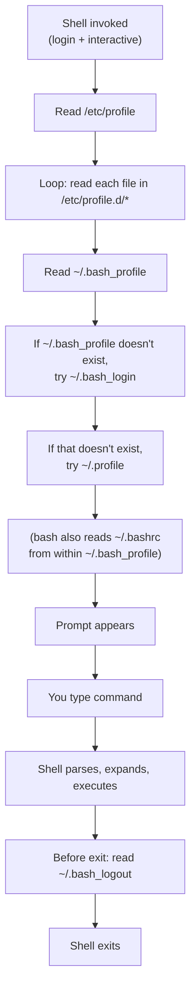
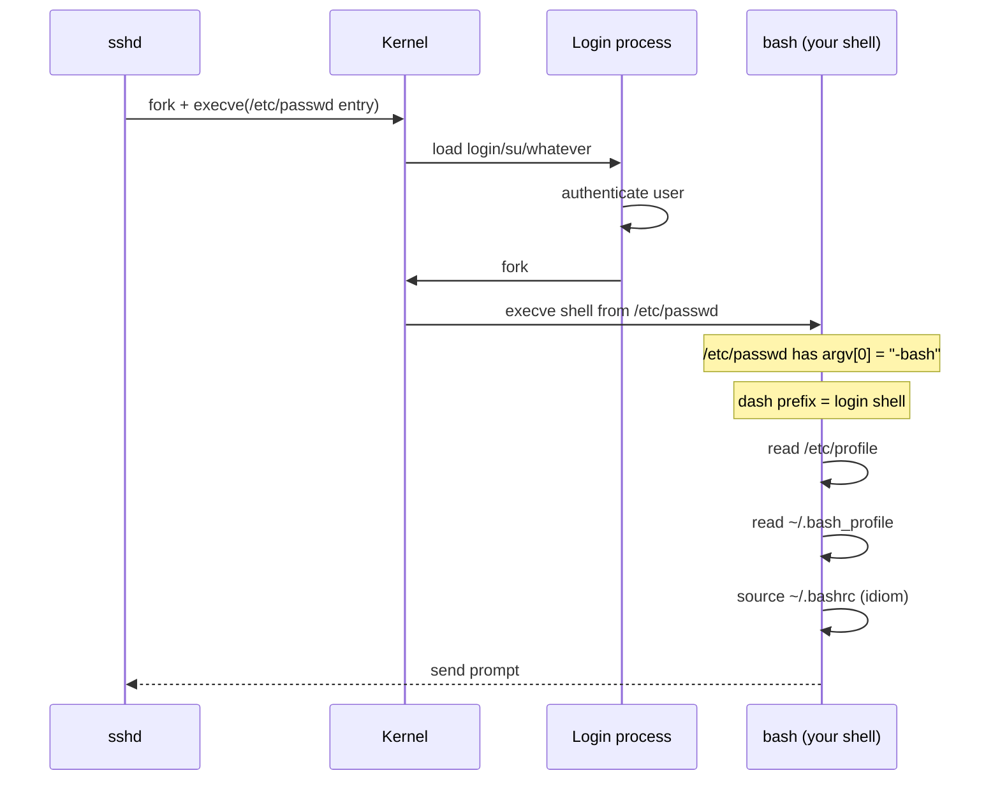
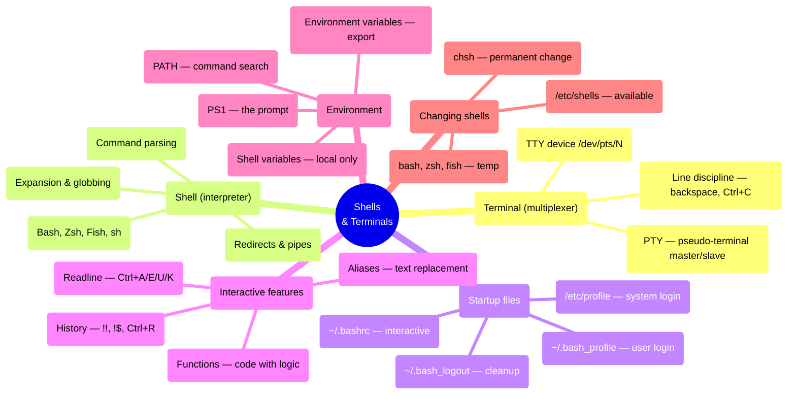

## 1 · The Big Picture

### Why this topic exists

You can type `ls` and see files. Nothing mysterious about that. But between your keystroke and the output, at least three layers of software have made decisions: the terminal caught your key and sent it somewhere, a shell interpreted the command you typed, and the shell started a program and displayed its output. If any one of those layers is misconfigured, the experience breaks in ways that seem like magic.

Understanding the shell is *not* about memorising commands. It is about understanding what happens between the cursor and the filesystem — how environment variables propagate, why aliases work in the interactive shell but not in scripts, why your `.bashrc` runs 100 times a day but you only edited it once, and how to read a terminal that has 40 panes because someone is using `tmux`.

This is also the chapter where most people lock themselves out of their machines. Reach the end, and you will know the recovery steps.

### The real problem it solves

Without a shell, you would invoke a program like this:

```c
fork();           // Create a new process
execve("/bin/ls", args, env);  // Replace it with /bin/ls
// wait for it to finish
// read its output from... where?
// read its exit code
```

A shell is the abstraction layer that lets you do this:

```bash
ls | grep hosts
```

The shell parses the line, creates two processes, attaches a pipe between them, waits for both, and gives you the result — all from one line of text. It also handles the messy details: storing your password in memory so you don't type it 50 times, expanding `*.txt` to a list of files without the program knowing about wildcards, providing history so you can re-run the command you typed yesterday, and letting you define functions that work like programs but are written in the shell's own language.

### Where you will encounter it

| Context | What the shell does there |
|---|---|
| SSH into a cloud server | Reads your login session; every command you type goes here first |
| CI/CD pipeline (GitHub Actions, GitLab) | Runners use shell scripts; `bash` or `/bin/sh` is always available |
| Docker entrypoint | Almost every container has `CMD ["bash", "-c", "exec ..."]` as its final layer |
| `cron` jobs and systemd timers | Each job runs inside a shell environment |
| Developer laptop, build tools | `Makefile`, npm `scripts`, build systems all invoke the shell |
| Kubernetes init containers | `sh -c` is a common entrypoint |
| Production incident response | When everything is broken, you SSH in and type shell commands over a 400-ms latency link |

### Why companies care

- **Universality** — every Linux machine has `/bin/sh`, even minimal containers. Your script will run.
- **Scriptability** — automation happens in shell scripts. Terraform uses HCL, but Terraform launches `provisioners` via shell. Kubernetes runs `exec` probes via shell.
- **Debuggability** — when a service is broken, you SSH in and run commands interactively. The shell is your microscope.
- **Reproducibility** — a shell script documents what you did. Running it again reproduces it; logging into the GUI and clicking buttons does not.

---

## 2 · Intuition First

### Analogy 1: the terminal and shell are not the same

| | Purpose | Analogy |
|---|---|---|
| **Terminal** | Multiplexes your keyboard and display | A **telephone switchboard** — routes your keystrokes *to* the shell and routes the shell's output *back to* your screen |
| **Shell** | Reads commands and runs programs | A **personal assistant** — takes your English-like requests and translates them into exact actions the OS understands |

You can use a shell without a terminal (over SSH, in a container, in a script). You can use a terminal without a shell (opening a `telnet` connection, writing bytes to `/dev/ttyUSB0`). But together, in the interactive login session on your laptop, they create the illusion that you are directly commanding the machine.

### Analogy 2: startup files as waking up

Imagine you get up every morning and do the same tasks: put on glasses, drink coffee, check email. You don't want to think about this every time, so you write them down as a checklist.

A shell's startup files are that checklist. When you open a terminal:

1. If you are logging in (like `ssh user@host`), the shell reads `/etc/profile`, then your `~/.bash_profile` — these are the "getting ready for the day" tasks.
2. If you are opening a sub-shell (like running a script), the shell skips the login steps and just reads `~/.bashrc` — these are the "every time I'm here" tasks.

Most people never touch their login startup files; they live in `~/.bashrc`, adding aliases and functions that they use every day.

### Analogy 3: environment variables as inherited traits

When you start a program, the shell passes it a list of variables — things like `PATH` (where to find programs), `HOME` (your home directory), `USER` (your username). These are **environment variables** — every program born from this shell inherits them.

If you then run a command that starts *another* process, that grandchild inherits the same environment, *unless* you explicitly unset a variable. This is why knowing which variables are exported matters: set a wrong `PATH`, and every program run from that shell onwards fails silently.

---

## 3 · Technical Definitions

**Terminal.** The user interface that multiplexes your keyboard and screen to one or more shell sessions. In the past, a physical piece of hardware (VT100 terminal); now, a software application (Terminal.app on macOS, GNOME Terminal on Linux, Windows Terminal on Windows 11). The terminal speaks to the kernel via a **TTY (teletypewriter)** device — a character device at `/dev/tty*` or `/dev/pts/*` that handles the low-level protocol.

**Shell.** A command-line interpreter: a program that reads a command, parses it into words and operators, expands variable references and globs, and executes the resulting program(s). Examples: `bash` (Bourne-Again Shell), `sh` (the POSIX minimal shell), `zsh` (Z shell), `fish` (Friendly Interactive Shell), `ksh` (Korn shell).

**TTY and PTY.** A **TTY** (teletypewriter, or **terminal**) is a character device representing a physical or virtual terminal. A **PTY** (pseudo-terminal) is a software pair: a master half (held by the terminal emulator) and a slave half (given to the shell as file descriptors 0/1/2, stdin/stdout/stderr). When you type in the terminal, the characters go to the slave; when the shell writes to file descriptor 1, the bytes come out of the master to your screen.

**Line discipline.** The kernel module between the terminal driver and the PTY that handles backspace, Ctrl+C, Ctrl+Z, and other raw terminal features — the reason you can hit backspace to erase a character even though the shell has not seen it yet. There are *different* line disciplines for raw vs. canonical mode, which is why the screen goes weird when you `cat` a binary file and you have to `reset` it afterwards.

**Login shell.** A shell that starts when you log in (SSH, `su -`, physical login). It reads startup files designed for setting up your environment once: `/etc/profile`, `/etc/profile.d/*`, `~/.bash_profile`, `~/.bash_login`, or `~/.profile`.

**Interactive shell.** A shell connected to a terminal (you can type commands). It reads startup files designed for interactive use: `/etc/bashrc`, `~/.bashrc`. A non-interactive shell (running a script) skips these.

**Environment variable.** A key-value pair passed from parent to child process. Defined with `export NAME=value`; inherited by all subshells unless unset. Examples: `PATH`, `HOME`, `USER`, `SHELL`, `PWD`.

**Shell variable.** A variable that exists only in the current shell, not passed to subprocesses. Defined with `NAME=value` (no `export`). Examples: loop counters, temporary strings.

---

## 4 · Internal Working

### The TTY/PTY/line discipline stack

```diagram title="Terminal ↔ Shell — the layers"
┌─────────────────────────────────────────────────────┐
│  Terminal emulator (Terminal.app, GNOME Terminal)    │
│  Captures keystrokes; renders output                 │
└─────────────────────────────────┬───────────────────┘
                                  │
                          PTY master ↔ master end
                                  │
        ┌─────────────────────────┴────────────────────┐
        │  KERNEL                                      │
        │  ┌────────────────────────────────────────┐  │
        │  │  PTY (pseudo-terminal) slave          │  │
        │  │  /dev/pts/0, /dev/pts/1, etc          │  │
        │  └────────────────────────────────────────┘  │
        │  ┌────────────────────────────────────────┐  │
        │  │  Line discipline                       │  │
        │  │  • Handle backspace, Ctrl+C, Ctrl+Z    │  │
        │  │  • Cooked (canonical) vs raw mode      │  │
        │  │  • Echo handling                       │  │
        │  └────────────────────────────────────────┘  │
        │  ┌────────────────────────────────────────┐  │
        │  │  Terminal driver (tty_io)              │  │
        │  │  • fd 0, 1, 2 (stdin/stdout/stderr)    │  │
        │  └────────────────────────────────────────┘  │
        └─────────────────────────────────────────────┘
                                  │
        ┌─────────────────────────┴─────────────────────┐
        │  Shell (bash, zsh, fish, sh)                   │
        │  Reads fd 0 (your keystrokes)                  │
        │  Writes to fd 1 and 2 (output)                 │
        └─────────────────────────────────────────────────┘
```

When you type `l s Enter`, this happens:

1. Terminal emulator sees keystroke L, sends ASCII 108 to the PTY master.
2. PTY slave receives it; line discipline echoes it back to the master (so you see it) and buffers it.
3. When you hit Enter, line discipline sends the whole line to the shell on fd 0.
4. Shell reads "ls", parses it, calls `execve("/bin/ls")`.
5. `ls` writes to fd 1 (stdout).
6. Bytes flow through the PTY slave back to the master, to the terminal emulator, to your screen.

This is why a shell always runs as the **controlling process** of the PTY: it is the program responsible for reading from that device. If the shell exits, the PTY becomes orphaned and the terminal window closes.

### Login vs non-login, interactive vs non-interactive

Not all shells are the same. The shell's startup sequence depends on *how* it was invoked:

```diagram title="Startup file decision tree"
Start shell
    │
    ├─ Invoked with -i flag (interactive)?
    │  If no: non-interactive
    │         → skip all startup files
    │         → read only BASH_ENV (if sh compatibility mode)
    │         → execute script and exit
    │
    └─ If yes: interactive shell
       │
       ├─ Invoked as login shell?
       │  (SSH, su -, /bin/login, --login flag)
       │
       ├─ If yes: LOGIN INTERACTIVE
       │  → read /etc/profile
       │  → read /etc/profile.d/* (if it exists)
       │  → read ~/.bash_profile (or ~/.bash_login, or ~/.profile)
       │  → read ~/.bashrc (if bash and interactive)
       │  → prompt appears
       │
       └─ If no: NON-LOGIN INTERACTIVE
          (running bash again inside bash)
          → skip /etc/profile and ~/.bash_profile
          → read ~/.bashrc only
          → prompt appears
```

Which startup file runs where:

| Scenario | /etc/profile | ~/.bash_profile | ~/.bashrc | Script/BASH_ENV |
|---|---|---|---|---|
| SSH login | ✔ | ✔ | ✔ | ✘ |
| `su - user` | ✔ | ✔ | ✔ | ✘ |
| `bash` (new shell) | ✘ | ✘ | ✔ | ✘ |
| cron job `bash -c "echo hi"` | ✘ | ✘ | ✘ | ✘ |
| Script `./script.sh` | ✘ | ✘ | ✘ | ✔ (if BASH_ENV set) |
| `bash -i -c "echo hi"` | ✘ | ✘ | ✔ | ✘ |

> [!WARNING]
> **A common mistake from the PDF, corrected:** The notes sometimes conflate "login shell" with "shell invoked with `--login`". Bash decides it is a login shell if argv[0] starts with a dash: `bash` → not login; `login` (from `/etc/passwd`) or when SSH runs the shell → login. The `--login` flag *forces* login-shell behaviour even if it was not started as one.

### The Bash startup sequence in full

When you SSH in or run `su - user`, this is what *actually* happens:



The typical `~/.bash_profile` contains:

```bash
# ~/.bash_profile: login-shell setup
# Sourced by login shells (SSH, su -)

# Load system-wide defaults and bash login scripts
if [ -f /etc/profile ]; then
  source /etc/profile
fi

# NOW source ~/.bashrc
# This is the key idiom: login shells source the interactive setup
if [ -f ~/.bashrc ]; then
  source ~/.bashrc
fi
```

Why? Because you almost certainly have interactive setup (aliases, functions, prompt) in `~/.bashrc`. If `~/.bash_profile` did not source it, those would not exist on login. *This is the idiom to memorise.*

### The login process from `/etc/passwd`

When you SSH and provide a password, this happens:



---

## 5 · A Shell is a Language — the Operators and Expansions

One reason people find the shell confusing is that it is a full language with operators, conditionals, loops, and variable expansion — but the syntax is terse and full of special characters.

### The expanding you need to know

| Expansion | Syntax | Example | Result |
|---|---|---|---|
| **Brace expansion** | `{a,b,c}` | `cp file.{txt,md,sh}` | expands to `file.txt file.md file.sh` before execve |
| **Tilde expansion** | `~`, `~user` | `cd ~` | becomes `/home/user` |
| **Parameter expansion** | `$VAR`, `${VAR}` | `echo $PATH` | substitutes value |
| **Command substitution** | `` `cmd` `` or `$(cmd)` | `echo $(date)` | runs `date`, inserts output |
| **Arithmetic expansion** | `$((2+2))` | `x=$((10*5))` | arithmetic is evaluated |
| **Pathname expansion (glob)** | `*`, `?`, `[abc]` | `ls *.txt` | matches files; *the shell does this, not `ls`* |
| **Word splitting** | `$IFS` | `for f in $*; do` | splits on spaces by default |
| **Quote removal** | `""`, `''`, `\\` | `echo "hi there"` | `""` allows expansion; `''` does not |

The order matters:

1. `{` `}` expansion
2. `~` expansion
3. Parameter, command, arithmetic expansion (left to right)
4. Word splitting
5. Pathname expansion (globbing)
6. Quote removal

This is why `echo *.txt` might print 50 filenames, but `echo "*.txt"` prints the literal string — quotes prevent pathname expansion.

### Redirections

| Operator | Name | Effect |
|---|---|---|
| `>` | redirect stdout | `echo hi > file.txt` — write to file, overwrite |
| `>>` | append stdout | `echo hi >> file.txt` — write to file, append |
| `2>` | redirect stderr | `ls /nonexistent 2> errors.txt` |
| `2>&1` | merge stderr→stdout | `./script 2>&1 \| grep error` |
| `<` | redirect stdin | `cat < /etc/passwd` (same as `cat /etc/passwd`) |
| `<<` | here-doc | feed multi-line input |
| `<<<` | here-string | `grep root <<< "$(cat /etc/passwd)"` |

---

## 6 · Practical Demonstration

### Three ways to find your current shell

```bash
# Method 1: check the SHELL variable
echo $SHELL

# Method 2: use the ps command — which process are you inside
ps -p $$

# Method 3: read the tty
tty
```

```console
$ echo $SHELL
/bin/bash

$ ps -p $$
    PID TTY      STAT   TIME COMMAND
   2410 pts/0    Ss     0:00 bash

$ tty
/dev/pts/0

$ who
user     pts/0        Aug  2 15:23 (192.168.1.50)
```

The `ps -p $$` line tells you the process ID of the running shell ($$), and the COMMAND field shows `/bin/bash` (or `/bin/sh`, or `/bin/zsh`). The `tty` command shows which device file your terminal is connected to; if you run it over SSH, it says `/dev/pts/0` or similar (a pseudo-terminal, because it is software). If you were on a physical machine with a physical serial cable, it might say `/dev/ttyS0`.

### Switching shells — temporary and permanent

**Temporary switch** (lasts only this session):

```bash
# Just type the new shell
zsh
# You are now in zsh; exit to go back
exit
```

**Permanent switch** (becomes your login shell):

```bash
# List available shells
cat /etc/shells

# Change your login shell (in /etc/passwd)
chsh -s /bin/zsh
# You must log out and back in for this to take effect

# Verify it worked (on next login)
echo $SHELL
```

```console
$ cat /etc/shells
# /etc/shells: valid login shells.
/bin/sh
/bin/bash
/bin/zsh
/usr/bin/zsh
/bin/ksh
/bin/fish

$ chsh -s /bin/zsh
Password:
Changing the login shell for user
Enter the new value, or press ENTER for the default
	Login Shell [/bin/bash]: /bin/zsh
```

After `chsh`, SSH into a fresh session to confirm your login shell is now in the SHELL variable.

> [!PROD]
> In production, almost all shell scripts use `/bin/sh` at the top: `#!/bin/sh`. This is the POSIX-compliant minimal shell, available on every Unix. Your `/bin/sh` might actually be a symlink to `bash` (on Ubuntu/Debian) or `dash` (on Alpine), but the scripts that target `#!/bin/sh` must work with *minimal* Bash features. Use `#!/bin/bash` if you need Bash-specific features like arrays or `[[` conditionals.

### The startup files and their roles

**`/etc/profile`** — system-wide login shell setup:

```bash
# /etc/profile — read by all login shells (SSH, su -)
# Run by: sh, bash, zsh (if invoked as sh or login)

# Set umask, PATH, timezone
export PATH=/usr/local/sbin:/usr/local/bin:/usr/sbin:/usr/bin:/sbin:/bin
export LANG=en_US.UTF-8

# Source all files in /etc/profile.d/
if [ -d /etc/profile.d ]; then
  for i in /etc/profile.d/*.sh; do
    if [ -r "$i" ]; then
      . "$i"
    fi
  done
  unset i
fi
```

**`~/.bash_profile`** — your login shell setup (SSH, console login):

```bash
# ~/.bash_profile — read by login bash shells
# Load interactive setup from ~/.bashrc
if [ -f ~/.bashrc ]; then
  source ~/.bashrc
fi

# Add anything login-specific below
export EDITOR=vim
```

**`~/.bashrc`** — your interactive shell setup (every shell, login or not):

```bash
# ~/.bashrc — read by all interactive bash shells
# Run by: every shell you open on this system

# Aliases
alias ll='ls -lh'
alias grep='grep --color=auto'

# Functions
extract() {
  case "$1" in
    *.tar.bz2)   tar xvjf "$1" ;;
    *.tar.gz)    tar xvzf "$1" ;;
    *.tar)       tar xvf "$1" ;;
    *.zip)       unzip "$1" ;;
    *.rar)       unrar x "$1" ;;
    *)           echo "Usage: extract <file>" ;;
  esac
}

# Prompt
PS1='[\u@\h \W]\$ '

# History
HISTSIZE=1000
HISTFILESIZE=2000

# Colors
export CLICOLOR=1
export LS_COLORS='di=34:ln=31'
```

**`~/.bash_logout`** — cleanup on shell exit:

```bash
# ~/.bash_logout — run when login shell exits
# Use for cleanup: clearing screen, backing up history, etc.

clear
echo "Goodbye $USER!"
```

### Aliases — the full lifecycle

**Define an alias:**

```bash
alias ll='ls -lh'
```

This creates a command named `ll` that expands to `ls -lh` before execution.

**Use it:**

```console
$ ll
total 48K
-rw-r--r-- 1 user group 1.5K Aug  2 15:00 file.txt
-rw-r--r-- 1 user group 4.2K Aug  2 14:00 script.sh
```

**List all aliases:**

```console
$ alias
alias ll='ls -lh'
alias grep='grep --color=auto'
alias mkdir='mkdir -pv'
```

**Temporarily override an alias:**

```bash
# Prefix with backslash
\ls    # calls /bin/ls, not the alias

# Or quote it
'ls'   # calls /bin/ls
```

**Remove an alias:**

```bash
unalias ll
```

**Make it permanent:**

Add it to `~/.bashrc`:

```bash
# ~/.bashrc
alias ll='ls -lh'
alias grep='grep --color=auto'
alias mkdir='mkdir -pv'
```

> [!MEMORY]
> **Why aliases don't work in scripts.** Aliases only expand in interactive shells (when bash starts with `-i`). Scripts run non-interactive shells (no `-i` flag), so aliases are never expanded. Use *functions* if you need reusable code in scripts. Use *aliases* for interactive shortcuts.

### Shell functions vs aliases

Both define reusable commands, but they differ:

```bash
# ALIAS — simple text replacement
alias myls='ls -lh'

# FUNCTION — full programming construct
myls() {
  local dir="${1:-.}"
  ls -lh "$dir"
}
```

| | Alias | Function |
|---|---|---|
| Expansion | Text substitution | Code execution |
| Arguments | Not directly available | $1, $2, $@, etc. |
| Works in scripts | No | Yes |
| Interactive only | Yes | No |
| Recursion | No | Yes |
| Local variables | No | Yes (`local`) |
| Can parse `--flags` | No | Yes |
| Definition | `alias name='cmd'` | `name() { code; }` |

**Example: use a function to wrap a dangerous command:**

```bash
# ~/.bashrc
rm() {
  # Ask for confirmation
  read -p "Are you sure? (y/N) " -n 1 -r
  echo
  if [[ $REPLY =~ ^[Yy]$ ]]; then
    command rm "$@"
  else
    echo "Cancelled"
    return 1
  fi
}
```

### Environment variables: the full story

**Define and export:**

```bash
# Shell variable (not inherited by subprocesses)
USERNAME=alice

# Environment variable (inherited)
export USERNAME=alice

# Both at once
export PATH=/usr/bin:/bin

# View all environment variables
printenv

# View all variables (shell + environment)
set

# View one variable
echo $USERNAME
printenv USERNAME

# Check if a variable is exported
declare -p USERNAME
```

```console
$ export MYVAR=hello
$ bash -c 'echo $MYVAR'
hello

$ unset MYVAR
$ bash -c 'echo $MYVAR'
(no output — empty)
```

**Key variables:**

| Variable | Meaning | Example |
|---|---|---|
| `PATH` | Directories to search for commands | `/usr/bin:/usr/local/bin:/sbin` |
| `HOME` | Your home directory | `/home/user` |
| `USER` | Username | `alice` |
| `SHELL` | Your login shell | `/bin/bash` |
| `PWD` | Current working directory | `/home/user/projects` |
| `OLDPWD` | Previous directory | `/home/user` |
| `HISTSIZE` | How many commands to keep in memory | `1000` |
| `HISTFILE` | Where history is saved | `~/.bash_history` |
| `PS1` | The prompt | `[\u@\h \W]\$ ` |
| `PS2` | Continuation prompt (for multi-line commands) | `> ` |
| `IFS` | Internal Field Separator (word splitting) | ` \t\n` (space, tab, newline) |
| `LC_ALL` | Locale for all categories | `en_US.UTF-8` |

**Unsetting a variable:**

```bash
unset MYVAR
# Now $MYVAR is empty
```

> [!DANGER]
> **Modifying PATH without care.** If you `export PATH=/new/path`, you lose all the standard directories and programs become unfindable. This locks you out:
>
> ```bash
> export PATH=/tmp    # Oops!
> ls                  # command not found
> ```
>
> Recovery: use the full path:
> ```bash
> /bin/ls
> # Or log in over SSH from another machine and fix it
> ```
>
> Safe way to prepend to PATH:
> ```bash
> export PATH=/usr/local/bin:$PATH
> ```

### Prompt customization: `PS1` and `PS2`

The shell variables `PS1` and `PS2` control your prompt:

```bash
# Default (often)
PS1='\u@\h:\w\$ '

# Custom
PS1='[\t] \u @ \h : \W \$ '
```

Escape sequences in `PS1`:

| Sequence | Expands to |
|---|---|
| `\u` | Username |
| `\h` | Hostname (short) |
| `\H` | Hostname (full) |
| `\w` | Working directory (full path) |
| `\W` | Working directory (basename only) |
| `\d` | Date (Day Mon Date) |
| `\t` | Time in HH:MM:SS |
| `\T` | Time in HH:MM:SS AM/PM |
| `\A` | Time in HH:MM (24-hour) |
| `\$` | `#` if root, `$` otherwise |
| `\n` | Newline |
| `\\` | Literal backslash |
| `\[` | Begin non-printing sequence (for colours) |
| `\]` | End non-printing sequence (for colours) |

**Example with colours:**

```bash
# Red username, green hostname, blue working directory
PS1='\[\033[31m\]\u\[\033[0m\]@\[\033[32m\]\h\[\033[0m\]:\[\033[34m\]\w\[\033[0m\]\$ '
```

**Modern approach: starship or oh-my-posh:**

Instead of editing `PS1`, use a third-party prompt generator:

```bash
# Install starship (Rust, fast, cross-shell)
curl -sS https://starship.rs/install.sh | sh

# Add to ~/.bashrc
eval "$(starship init bash)"
```

Starship handles git status, language versions, duration of last command, and 200+ other features automatically.

### History expansion and Ctrl+R

**History expansion:**

```bash
# Re-run the last command
!!

# Re-run the last command that started with "grep"
!grep

# Re-run command number 145
!145

# Use the last argument of the previous command
echo file.txt
cat !$       # expands to: cat file.txt

# Use all arguments from the last command
!*

# Search history interactively
Ctrl+R
# Type letters; shell searches backwards
# Press Enter to run, Ctrl+G to cancel
```

```console
$ grep error /var/log/syslog
... 200 matching lines ...

$ !grep      # re-runs the grep
... 200 matching lines ...

$ cat !$     # cat /var/log/syslog
... contents of syslog ...
```

### Readline keybindings — Bash/Zsh line editing

When you are typing at the bash prompt, these keybindings let you edit without leaving the line:

| Key | Action |
|---|---|
| `Ctrl+A` | Move cursor to start of line |
| `Ctrl+E` | Move cursor to end of line |
| `Ctrl+F` | Move cursor forward one character (→) |
| `Ctrl+B` | Move cursor back one character (←) |
| `Ctrl+R` | Search history backwards |
| `Ctrl+S` | Search history forwards (if not XON/XOFF) |
| `Ctrl+U` | Delete from cursor to start of line (kill line) |
| `Ctrl+K` | Delete from cursor to end of line (kill to end) |
| `Ctrl+W` | Delete word backwards |
| `Meta+D` (Alt+D) | Delete word forwards |
| `Meta+B` (Alt+B) | Move back one word |
| `Meta+F` (Alt+F) | Move forward one word |
| `Ctrl+L` | Clear screen (same as `clear`) |
| `Ctrl+X Ctrl+E` | Open the command in your `$EDITOR` |

**Example of editing a long command:**

```bash
# You typed this long line, with a typo:
tar -xzvf /path/to/archive/my-backup-20240802.tar.gz /path/to/destnation

# Press Ctrl+A to go to the start
# Press Ctrl+F Ctrl+F Ctrl+F to move to "destnation"
# Press Ctrl+R to search for "destination" in history
# Find it, press Enter, and it replaces the word
# Or: Ctrl+U to delete from cursor to line start, retype correctly
```

### Reloading configuration without logging out

To apply changes to `~/.bashrc` without logging out:

```bash
source ~/.bashrc

# Or use the . (dot) shorthand
. ~/.bashrc
```

This re-reads the file in the current shell, updating aliases, functions, environment variables, and prompt.

**Verify the change:**

```bash
# After adding an alias to ~/.bashrc
source ~/.bashrc
alias myls    # prints the alias definition
myls          # runs the command
```

> [!TIP]
> Scripts starting with `#!/bin/bash` do *not* read `~/.bashrc`. They inherit the environment (PATH, HOME, etc.) but not the interactive setup. This is why an alias you defined interactively does not work in a script — the script runs a non-interactive shell, which skips `~/.bashrc`. Use *functions* in `~/.bashrc` if you need them in scripts, or define them separately in a file you source.

---

## 7 · A Real `~/.bashrc` Example

Here is a production-quality configuration suitable for development work, condensed from the PDF example on p135–137:

```bash
# ~/.bashrc — user interactive shell setup
# This file is sourced by non-login shells (e.g., when you open a new tab in an editor)
# It is also sourced by login shells via ~/.bash_profile

# Skip if not interactive
case $- in
  *i*) ;;
  *) return ;;
esac

# ============ HISTORY ============
HISTSIZE=10000
HISTFILESIZE=20000
HISTCONTROL=ignoredups:ignorespace

# Append to history file instead of overwriting
shopt -s histappend

# ============ ALIASES ============
alias ls='ls --color=auto'
alias ll='ls -lh'
alias la='ls -la'
alias grep='grep --color=auto'
alias mkdir='mkdir -pv'
alias less='less -R'

# ============ PROMPT ============
PS1='[\u@\h \W]\$ '

# ============ FUNCTIONS ============

# extract: unarchive any compressed file format
extract() {
  if [[ $# -eq 0 ]]; then
    echo "Usage: extract <file> [destination]"
    echo "Extracts common archive formats"
    return 1
  fi

  local file="$1"
  local dest="${2:-.}"

  case "$file" in
    *.tar.bz2|*.tbz2)  tar xvjf "$file" -C "$dest" ;;
    *.tar.gz|*.tgz)    tar xvzf "$file" -C "$dest" ;;
    *.tar.xz|*.txz)    tar xvJf "$file" -C "$dest" ;;
    *.tar)             tar xvf "$file" -C "$dest" ;;
    *.zip)             unzip "$file" -d "$dest" ;;
    *.rar)             unrar x "$file" "$dest" ;;
    *.7z)              7z x "$file" -o"$dest" ;;
    *)                 echo "Unknown format: $file"; return 1 ;;
  esac
  echo "Extracted to $dest"
}

# backup: create a dated backup of a file
backup() {
  if [[ $# -eq 0 ]]; then
    echo "Usage: backup <file>"
    return 1
  fi
  local file="$1"
  if [[ ! -e "$file" ]]; then
    echo "Error: $file not found"
    return 1
  fi
  local backup_file="${file}.backup.$(date +%Y%m%d-%H%M%S)"
  cp -v "$file" "$backup_file"
  echo "Backed up to $backup_file"
}

# find_in_files: grep recursively with proper escaping
find_in_files() {
  if [[ $# -lt 1 ]]; then
    echo "Usage: find_in_files <pattern> [directory]"
    return 1
  fi
  local pattern="$1"
  local dir="${2:-.}"
  grep -r "$pattern" "$dir" --include="*.txt" --include="*.sh" --include="*.md"
}

# ============ ENVIRONMENT ============
export EDITOR=vim
export PAGER=less
export LANG=en_US.UTF-8

# Add local bin to PATH if it exists
if [[ -d ~/.local/bin ]]; then
  export PATH=~/.local/bin:$PATH
fi

# ============ SHELL OPTIONS ============
shopt -s checkwinsize  # update LINES and COLUMNS after each command
shopt -s globstar      # enable ** for recursive glob
shopt -s dotglob       # include files starting with .
```

---

## 8 · Terminal Emulators and TTY Devices

A terminal emulator is software that emulates a physical VT100 terminal. You use it to connect to a shell. Common ones:

| OS | Terminal | Alternatives |
|---|---|---|
| macOS | Terminal.app | iTerm2, Alacritty, Kitty |
| Linux | GNOME Terminal, Konsole | Xfce4-terminal, LXTerminal, Alacritty, Kitty |
| Windows | Windows Terminal | PuTTY, ConEmu |
| Container/VM | `/dev/ttyN` (physical) or `/dev/pts/N` (pseudo) | socat, screen, tmux |

When you open a terminal emulator on your laptop, the OS creates a PTY pair, passes the slave end to your shell, and the terminal emulator holds the master end. Everything you type flows through that pipe.

**Finding your TTY:**

```console
$ tty
/dev/pts/0

$ who
user     pts/0        Aug  2 15:23 (192.168.1.50)
user     pts/1        Aug  2 15:30 (192.168.1.60)
```

If you SSH into a server and open multiple terminals, each one gets a different `/dev/pts/N`. If you are on a physical console (not SSH, not a GUI terminal — a real physical login on a server with a monitor and keyboard), it would be `/dev/tty1`, `/dev/tty2`, etc.

---

## 9 · Bash vs Zsh vs Fish — and Why It Matters

The shell language is not standard. Different shells behave differently, and the differences matter for portability:

| Feature | Bash | Zsh | Fish | sh/POSIX |
|---|---|---|---|---|
| **Portable?** | Mostly (default on macOS < 10.15, Ubuntu) | Not standard; less common in scripts | No; uncommon in production | Yes — the baseline |
| **Arrays** | `arr=(1 2 3)` | `arr=(1 2 3)` | `set arr 1 2 3` | No |
| **Associative arrays** | Yes (Bash 4+) | Yes | No | No |
| **[[ conditional]]** | Yes | Yes | Uses `if` and `test` | No (`[[ ` is not POSIX) |
| **${var/a/b}** (string replacement) | Yes (Bash 4+) | Yes | Yes | No |
| **Process substitution `<()`** | Yes | Yes | Workaround | No |
| **Script shebang** | `#!/bin/bash` | `#!/bin/zsh` | `#!/usr/bin/fish` | `#!/bin/sh` |
| **Where scripts run** | Any Bash system | Any Zsh system | Fish-enabled systems | Every Unix |
| **Line editing** | Readline | Zline | Custom | Basic |
| **Default prompt customization** | PS1 variable | PROMPT variable | `functions fish_prompt` | Minimal |

**The practical rule:** If you are writing a script that must run on any Linux system (cloud VMs, containers, CI runners), use **`#!/bin/sh`** (POSIX shell). If you need Bash features and can guarantee Bash is present, use **`#!/bin/bash`**. Never use Zsh or Fish for scripts you will ship — they are for interactive use on your laptop.

---

## 10 · Comparison Tables

### Terminal vs Shell vs TTY

| Aspect | Terminal | Shell | TTY |
|---|---|---|---|
| **What it is** | Software that multiplexes keyboard/screen | Interpreter for command language | Device file representing input/output stream |
| **Example** | Terminal.app, GNOME Terminal, Windows Terminal | bash, zsh, fish, sh | /dev/pts/0, /dev/tty1 |
| **Can you use without the other?** | Shell without terminal: no (non-interactive), yes if piped | Terminal without shell: yes (could run other programs) | TTY without both: represents raw I/O; can `cat` it directly |
| **Failure mode** | Terminal crashes → shell disconnects but processes survive | Shell crashes → terminal orphaned | TTY unavailable → no keyboard input or screen output |

### Login shell setup files by OS

| File | OS | Shells | Applies to | Must source ~/ .bashrc? |
|---|---|---|---|---|
| `/etc/profile` | Unix/Linux | sh, bash, zsh (login only) | System-wide login setup | No (per-system) |
| `/etc/profile.d/*` | Linux (systemd) | All shells run from profile | Per-subsystem setup (sudo, SSH, proxy) | No (per-system) |
| `~/.bash_profile` | macOS, Linux | bash login shells only | Your login-specific setup | **Yes — this is where you source ~/.bashrc** |
| `~/.bash_login` | macOS, Linux | bash login shells (fallback) | Fallback if `.bash_profile` missing | Usually no |
| `~/.profile` | POSIX | sh, ksh, zsh (login only) | POSIX-compliant setup for sh or zsh | Depends on distro |
| `~/.bashrc` | Linux | bash interactive shells | Your interactive setup (aliases, functions, prompt) | **Called from ~/.bash_profile; also called by non-login shells** |
| `~/.bash_logout` | bash | bash login shells | Cleanup on logout (history, clearing screen) | No |
| `~/.zshrc` | zsh | zsh interactive | Zsh interactive config | No (Zsh doesn't have profile/bashrc split) |
| `~/.config/fish/config.fish` | fish | fish interactive | Fish config | No (Fish has one file) |

> [!EXAM]
> **One-mark exam question:** "When does `~/.bashrc` get sourced?" Answer: "When an interactive shell starts. Also explicitly sourced from `~/.bash_profile` by the `source ~/.bashrc` idiom so login shells also have interactive setup."

### Environment variable inspection commands

| Command | Purpose | Output |
|---|---|---|
| `printenv` | Print all environment variables (exported only) | one per line, `NAME=value` |
| `env` | Run a command with a modified environment; also print env if no args | like `printenv` if no args |
| `set` | Show all variables (shell + environment) and shell options | many lines; includes internal shell vars like `BASH_VERSION` |
| `declare -p` | Show a specific variable and whether it is exported | e.g., `declare -x VAR="value"` (the `-x` means exported) |
| `declare -px` | Show only exported variables | like `set` but only exported ones |
| `type <cmd>` | Show what a command is (builtin, function, alias, or executable) | e.g., `type ls` → `ls is aliased to 'ls --color=auto'` |
| `which <cmd>` | Show the path to an executable | e.g., `which python` → `/usr/bin/python` |
| `command -v <cmd>` | POSIX version of `type` | works across all shells |

---

## 11 · Memory Tricks

> [!MEMORY]
> **"Login shells source profile; interactive shells source rc."** Login happens once (SSH, console login); interactive happens every time you open a shell. Profile = login; rc = run commands (every time).

> [!MEMORY]
> **"Source ~/.bashrc from ~/.bash_profile."** The idiom to burn into muscle memory:
> ```bash
> if [ -f ~/.bashrc ]; then
>   source ~/.bashrc
> fi
> ```
> This is in almost every production `~/.bash_profile` you will see. Login shells get the ~/.bashrc setup.

> [!MEMORY]
> **"Aliases do not work in scripts."** Interactive shells expand aliases; scripts run non-interactive shells that do not. Use functions for script-reusable code.

> [!MEMORY]
> **"Readline is Ctrl+A/E for line ends."** Ctrl+A (start), Ctrl+E (end), Ctrl+U (delete to start), Ctrl+K (delete to end). These work in bash, zsh, and many CLI tools.

> [!MEMORY]
> **"PS1 is the prompt; PS2 is 'I am waiting for more input'."** You see PS2 when you open a quote or backslash at the end of a line. Default PS2 is `> `.

> [!MEMORY]
> **"PATH is a colon-separated list."** `echo $PATH` shows `/usr/bin:/usr/local/bin:/sbin`. Prepend to add new directory: `export PATH=/opt/myapp/bin:$PATH`.

> [!MEMORY]
> **"$$ is the shell's own PID; $PPID is the parent."** Use `ps -p $$` to see which shell you are in.

---

## 12 · Interview Corner

<details>
<summary><strong>Beginner</strong> — What is the difference between a terminal and a shell?</summary>

A terminal is the software or hardware that handles your keyboard input and screen output — it is a multiplexer. A shell is a command interpreter that reads what you type, parses it, and runs programs. You can have a shell without a terminal (e.g. a script running in the background), or a terminal without a shell (e.g. a serial console running `getty` waiting for login). Together, they create the interactive experience you think of as "the command line."
</details>

<details>
<summary><strong>Beginner</strong> — How do you find out which shell you are currently using?</summary>

Three ways: (1) `echo $SHELL` — prints your login shell from the environment, (2) `ps -p $$` — shows the process running as PID $$ (the current shell), (3) `tty` — shows the terminal device you are connected to. The second is most reliable because `$SHELL` might be outdated if you ran `chsh` recently without logging out.
</details>

<details>
<summary><strong>Beginner</strong> — What does `chsh` do, and what file does it modify?</summary>

`chsh` (change shell) modifies the login shell for your user. It edits the `/etc/passwd` file, specifically the last field of your user line (normally `/bin/bash` or `/bin/sh`). The change takes effect on the next login; it does not affect your current shell session. You need to know the full path to the new shell (e.g. `/bin/zsh`); `chsh -l` lists valid shells from `/etc/shells`.
</details>

<details>
<summary><strong>Intermediate</strong> — Explain the difference between `~/.bash_profile`, `~/.bashrc`, and `~/.bash_logout`.</summary>

`~/.bash_profile` is read by login shells (SSH, physical console login, `su -`) and is where you set up environment variables and load `~/.bashrc` via the `source ~/.bashrc` idiom. `~/.bashrc` is read by all interactive shells — login or not — and contains aliases, functions, and prompt settings. `~/.bash_logout` is read when a login shell exits, typically for cleanup (e.g. clearing history or the screen). If you only edit `~/.bashrc` and never source it from `~/.bash_profile`, login shells will not have your aliases and functions.
</details>

<details>
<summary><strong>Intermediate</strong> — Why don't aliases work in shell scripts?</summary>

Aliases only expand in interactive shells (when bash is invoked with the `-i` flag). Scripts run in non-interactive mode (no `-i`), so the shell skips alias expansion. The shell simply does not expand `ll` to `ls -lh`; it tries to find a command named `ll` and fails. Use functions instead of aliases if you need the code to work in both interactive and script contexts, because functions are expanded in all shells.
</details>

<details>
<summary><strong>Intermediate</strong> — What does `source ~/.bashrc` do, and why would you run it?</summary>

`source` (or `.`) re-reads a file and executes it in the current shell. Running `source ~/.bashrc` applies changes you made to the file without logging out — new aliases, functions, environment variables become available immediately. Without this, you would have to log out and back in for changes to take effect. This is very common when debugging shell configuration: edit the file, source it, test it.
</details>

<details>
<summary><strong>Intermediate</strong> — Compare environment variables and shell variables. Give an example where the difference matters.</summary>

A shell variable exists only in the current shell; `NAME=value` creates one. An environment variable is exported: `export NAME=value`. When the shell starts a subprocess (e.g. `python`, `bash`, `ls`), the subprocess inherits all environment variables but not shell variables. Example: `MYVAR=hello` is a shell variable. If you run `bash -c 'echo $MYVAR'`, the subshell sees nothing (empty). But `export MYVAR=hello` followed by `bash -c 'echo $MYVAR'` prints `hello`. This is why setting `export PATH=...` is critical — without `export`, subshells do not inherit the modified PATH.
</details>

<details>
<summary><strong>Intermediate</strong> — What is the purpose of the line discipline in a TTY, and why do you care?</summary>

The line discipline is the kernel module between the terminal and the shell that handles raw terminal features: echoing characters back to the screen, processing backspace and Ctrl+C, buffering input until you press Enter, and switching between raw and canonical (cooked) modes. You care because when a program reads binary data and does not put the terminal back into canonical mode, you get garbled output (the terminal stops echoing, weird characters appear, backspace doesn't work). This is why `reset` or `stty sane` exists — they re-enable canonical mode.
</details>

<details>
<summary><strong>Advanced</strong> — Trace the startup sequence from SSH login to interactive shell prompt. What files are read, in what order?</summary>

SSH runs your login shell (typically `bash`). The shell recognizes it is a login shell (argv[0] starts with `-bash`) and reads in order: `/etc/profile` → `/etc/profile.d/*` → `~/.bash_profile` (or `~/.bash_login` if profile missing, or `~/.profile` as last resort). Inside `~/.bash_profile` is the idiom `source ~/.bashrc`, which reads `~/.bashrc` — where aliases, functions, and prompt settings live. The sequence is: system-wide login setup, user-specific login setup, then user-specific interactive setup. On logout, `~/.bash_logout` is read.
</details>

<details>
<summary><strong>Advanced</strong> — You log into a server and discover aliases are not working. What is the most likely cause, and how do you fix it?</summary>

Most likely: the login shell did not source `~/.bashrc`. This happens if `~/.bash_profile` does not have the `source ~/.bashrc` idiom. Check: (1) `cat ~/.bash_profile` and look for `source ~/.bashrc` or `. ~/.bashrc`. If it is missing, add it. (2) Run `source ~/.bashrc` to activate aliases in the current session. (3) Alternatively, if `~/.bashrc` exists but `~/.bash_profile` does not, login shells skip both and read only `~/.profile`, which typically does not define aliases. Create a minimal `~/.bash_profile` that sources `~/.bashrc`. Verify with `alias ll` (should print the alias definition) and `which ll` (should say `alias`).
</details>

<details>
<summary><strong>Advanced</strong> — Explain the decision tree for when `~/.bashrc` is sourced vs. when it is not.</summary>

`~/.bashrc` is sourced when: (1) the shell is interactive (flag `-i` is set), AND (2) the shell is bash. Login shells are interactive, so they source it (usually via the `source ~/.bashrc` idiom inside `~/.bash_profile`). Non-login interactive shells (opening bash again inside bash) also source it. Non-interactive shells (scripts, `bash -c`, commands piped to bash) do NOT source it — they only read `BASH_ENV` if that variable is set. Zsh and other shells have different rules: Zsh sources `~/.zshrc` for all interactive shells, login or not, and does not have a separate `.profile` for login.
</details>

<details>
<summary><strong>Scenario</strong> — You modify `~/.bashrc` to add an alias. Your coworker, on the same server, types the alias and it works; yours doesn't. Why?</summary>

Your coworker logged out and back in (or ran `source ~/.bashrc`), while you just edited the file in the current shell. Your shell has not re-read `~/.bashrc`, so the alias does not exist in your current session. Run `source ~/.bashrc` to apply the changes. Alternatively, close and reopen your terminal (triggering a login shell, which sources the file).
</details>

<details>
<summary><strong>Scenario</strong> — You write a script that uses an alias you defined in `~/.bashrc`. It works when you run it interactively but fails in cron. What is happening?</summary>

Cron runs the script in a non-interactive shell (no `-i` flag), which does not expand aliases. Your interactive shell expands `ll` to `ls -lh`, but the cron shell sees a command literally named `ll` and it does not exist. Fix: (1) Use the full command in the script instead of the alias, (2) Or define a shell function instead of an alias and source the file in the script, (3) Or manually source `~/.bashrc` in the script with `source ~/.bashrc`, though this is fragile.
</details>

<details>
<summary><strong>Company style</strong> — How would you provide a standard shell environment to all users on a shared server?</summary>

Create a system-wide setup in `/etc/profile.d/custom.sh` that all login shells source. Define common variables, paths, aliases and functions that apply to everyone. Then, provide a template `~/.bashrc` for users to copy or extend. Document the paths and conventions: "All production tools are in `/opt/tools/bin`; add this to your PATH in `~/.bashrc`." For consistency, you might also use a *dotfiles* repository — a Git repo containing `~/.bashrc`, `~/.vimrc`, `~/.gitconfig`, etc. — that developers clone and symlink. This ensures everyone has the same setup.
</details>

<details>
<summary><strong>HR style</strong> — Describe a time your shell configuration saved you time or prevented a mistake.</summary>

A strong answer: "I defined a backup function in `~/.bashrc` that uses `date` to create timestamped copies: `backup filename` creates `filename.backup.20240802-153042`. This saved me when I accidentally overwrote a config file — I had a backup. Later, I added `mkdir -pv` as an alias, which creates directories recursively without errors if they exist, so scripts are more robust. Most recently, I wrapped `rm` in a function that prompts for confirmation. These small investments in the shell configuration have prevented several mistakes in production."
</details>

<details>
<summary><strong>HR style</strong> — Tell me about a time you had to debug something you could not see directly.</summary>

Strong approach: "A colleague's script was failing in CI but passing locally. I added `set -x` to enable debug output (showing every command before it runs) and ran the script in the CI environment (via SSH to the runner). I saw that `$PATH` was different — the CI environment's `PATH` did not include the directory where a tool was installed. Fixed it by having the CI pipeline export the correct `PATH`. This taught me to always check environment variables first when debugging cross-environment failures."
</details>

---

## 13 · Common Mistakes

> [!MISTAKE]
> **Running a script with `bash script.sh` instead of `./script.sh`** — both work, but for different reasons. If the shebang is `#!/bin/bash`, the script runs under bash regardless. But if the shebang is `#!/bin/sh` and you run `bash script.sh`, you override the shebang and run it in bash — which might have features the author did not expect. Always run `./script.sh` (which uses the shebang) unless you have a reason not to.

> [!MISTAKE]
> **Assuming `$PATH` is always set** — in some restricted environments (containers, init scripts), `$PATH` might be missing or wrong. Always use absolute paths in critical scripts: `/usr/bin/grep` instead of `grep`.

> [!MISTAKE]
> **Editing `~/.bashrc` but not reloading it** — changes take effect on the next login shell, not immediately. Run `source ~/.bashrc` to apply them now. A coworker will point out your alias does not work, and you will have forgotten you edited the file.

> [!MISTAKE]
> **Assuming aliases work in scripts** — they do not. Only interactive shells expand aliases. Scripts use functions or full commands.

> [!MISTAKE]
> **Forgetting to `export` a variable you want subprocesses to see** — `MYVAR=value` is a shell variable, not exported. The subprocess never sees it. Use `export MYVAR=value` if you want child processes to inherit it.

> [!DANGER]
> **Accidentally modifying `~/.bashrc` and locking yourself out.** The worst-case scenario:
>
> ```bash
> # You add a syntax error to ~/.bashrc:
> export PATH=/nonexistent:$PATH   # typo: colon instead of /
>
> # On next login, the shell tries to source ~/.bashrc, hits the error, and
> # the shell exits immediately (or goes unresponsive)
> ```
>
> **Recovery steps:**
> 1. SSH in from another machine with a broken `~/.bashrc`, and use the `-noprofile -norc` flags: `ssh -i key user@host bash --noprofile --norc` — this skips startup files.
> 2. Run `/bin/bash --noprofile --norc` locally if you are locked out of a terminal.
> 3. Edit `~/.bashrc` to fix the error.
> 4. Alternatively, you can directly edit `/etc/passwd` from another account or via LILO/GRUB to spawn a recovery shell.
>
> **Prevention:** Always test `~/.bashrc` changes in a subshell before committing:
> ```bash
> # After editing ~/.bashrc
> bash -c 'source ~/.bashrc' && echo "OK" || echo "ERROR"
> ```

> [!DANGER]
> **Modifying PATH recklessly** — the command that locks you out immediately:
>
> ```bash
> export PATH=/tmp    # Oops! Now /usr/bin/ls is unfindable
> ```
>
> Recovery: use full paths until you fix it:
> ```bash
> /bin/vim ~/.bashrc
> # Fix: export PATH=/usr/bin:/bin:$PATH
> /bin/bash --noprofile --norc
> ```

> [!DANGER]
> **Sourcing untrusted `.bashrc` files** — if you clone a repository with a malicious `.bashrc`, do not just run `source` on it. Review it first. A clever `.bashrc` can execute arbitrary code, steal keys, or inject backdoors. Always `cat` or `less` the file first. Use `bash -x` to trace execution if you are unsure.

---

## 14 · Summary & Mind Map



**Fourteen sentences that carry the chapter.**

1. A terminal is software that multiplexes your keyboard and display; a shell is a command interpreter — they work together but are not the same thing.
2. TTY is a character device; PTY is a software pair (master/slave) that lets a terminal emulator talk to a shell.
3. The line discipline handles terminal features like backspace and Ctrl+C; it sits between the TTY driver and the shell.
4. Login shells read `/etc/profile`, then `~/.bash_profile`, then (via the idiom) `~/.bashrc`; non-login interactive shells read only `~/.bashrc`.
5. The key idiom is: `~/.bash_profile` sources `~/.bashrc`, so login shells have aliases and functions too.
6. Aliases are text replacement and do not work in scripts; functions are code with variables and do work everywhere.
7. Environment variables are exported to subprocesses; shell variables are not — use `export NAME=value` for anything a subprocess needs to see.
8. Readline keybindings (Ctrl+A/E/U/K, Alt+B/F) work in bash, zsh, and many CLI tools; they are not unique to the shell.
9. History expansion (`!!`, `!$`, `!145`) re-runs commands; Ctrl+R searches interactively.
10. `source ~/.bashrc` applies configuration changes without logging out.
11. The three ways to find your current shell: `echo $SHELL`, `ps -p $$`, `tty`.
12. `chsh -s /bin/zsh` permanently changes your login shell (takes effect on next login); just typing `zsh` temporarily switches.
13. Bash, Zsh, and Fish are different languages; scripts must use `#!/bin/sh` for portability or `#!/bin/bash` if Bash-specific.
14. Configuration mistakes (syntax errors, bad `PATH`) can lock you out — recovery is `ssh user@host bash --noprofile --norc`, or use absolute paths to fix the file.

---

## 15 · Cheat Sheet

```diagram title="Chapter 03 — one-page revision"
FIND YOUR SHELL              PATH TO DEVICE               STARTUP SEQUENCE (bash)
  echo $SHELL               /dev/pts/0 (SSH)            Login shell:
  ps -p $$                  /dev/tty1 (physical)          /etc/profile
  tty                       /dev/ttyS0 (serial)           ~/.bash_profile (sources ~/.bashrc)
                                                          ~/.bash_logout on exit

CHANGE SHELL                WHAT RUNS WHEN                STDIN/STDOUT/STDERR
  bash (temp)               Login + interactive           0 — stdin
  chsh -s /bin/zsh            /etc/profile                1 — stdout (>)
  cat /etc/shells             ~/.bash_profile             2 — stderr (2>)
                              ~/.bashrc                    &1 — merge to stdout
                            Non-login interactive
                              ~/.bashrc only
                            Non-interactive (script)
                              BASH_ENV only

ALIASES                      FUNCTIONS                    ENVIRONMENT VARS
  alias ll='ls -lh'           extract() { ... }           export PATH=/usr/bin:$PATH
  alias grep='grep --color'   backup() { ... }            export HOME=/home/user
  unalias ll                  works in scripts             printenv — list all
  alias (list all)            alias does not               $VAR — use it

HISTORY                      READLINE SHORTCUTS           PROMPT
  !!                          Ctrl+A — line start         PS1='[\u@\h \W]\$ '
  !grep                       Ctrl+E — line end           \u — username
  !$                          Ctrl+U — delete to start    \h — hostname
  !*                          Ctrl+K — delete to end      \W — working dir
  Ctrl+R (search)             Ctrl+W — delete word        \$ — # or $

SOURCE VS EXECUTE            REDIRECTS
  source ~/.bashrc            > file     stdout to file
  . ~/.bashrc                 >> file    append stdout
  vs ./script.sh              2> file    stderr to file
  (the second uses shebang)   2>&1       merge stderr→stdout
                              < file     stdin from file
                              << EOF     here-doc

SCRIPT PORTABILITY           AVOID THESE
  #!/bin/sh       → POSIX    export PATH=/tmp (locks out)
  #!/bin/bash     → Bash-specific   source untrusted files
  #!/bin/zsh      → Zsh      edit ~/.bashrc without test
  #!/usr/bin/fish → Fish      assume aliases work in scripts
                              forget to export variables
```

---

## 16 · Practice

### Flashcards

| Prompt | Answer |
|---|---|
| What device represents your terminal in `/dev`? | PTY slave: `/dev/pts/0`, `/dev/pts/1`, etc. (or `/dev/tty1` for physical console) |
| What is the line discipline? | Kernel module between terminal and shell handling backspace, Ctrl+C, echo, canonical/raw mode |
| Which startup file is read by login shells only? | `/etc/profile` and `~/.bash_profile` |
| Which startup file is read by all interactive shells? | `~/.bashrc` |
| What is the key idiom in `~/.bash_profile`? | `source ~/.bashrc` (or `. ~/.bashrc`) — so login shells also have interactive aliases/functions |
| Do aliases work in scripts? | No — aliases expand only in interactive shells |
| Do functions work in scripts? | Yes — functions are expanded in all shells |
| What command changes your login shell? | `chsh -s /bin/zsh` (takes effect on next login) |
| Which environment variable do subprocesses inherit? | All exported variables; shell variables (without `export`) are not inherited |
| What is `$$` | The PID of the current shell |
| What does `source ~/.bashrc` do? | Re-reads the file and executes it in the current shell, applying changes without logout |
| Which Readline shortcut moves to the end of the line? | `Ctrl+E` |
| Which Readline shortcut deletes from cursor to line start? | `Ctrl+U` |
| What does history expansion `!$` mean? | The last argument of the previous command |
| What does `!145` do? | Re-runs command number 145 from history |
| Which command searches history interactively? | `Ctrl+R` (or `Ctrl+S` forward) |

### Multiple choice

1. Which startup file is read by **all** login shells, not just bash? **(a)** `~/.bash_profile` **(b)** `/etc/profile` **(c)** `~/.bashrc` **(d)** `~/.profile`
2. An alias defined in `~/.bashrc` works in: **(a)** interactive shells **(b)** scripts **(c)** both **(d)** neither
3. To make an environment variable visible to subprocesses, use: **(a)** `VAR=value` **(b)** `export VAR=value` **(c)** `declare VAR=value` **(d)** `local VAR=value`
4. Which command temporarily switches shells? **(a)** `chsh` **(b)** Just typing the shell name **(c)** `bash --login` **(d)** `su - user`
5. A script's shebang line must be: **(a)** `#!/bin/bash` **(b)** `#!/usr/bin/env bash` **(c)** `#!/bin/sh` for portability **(d)** any of the above
6. `Ctrl+U` in the shell deletes: **(a)** the entire line **(b)** from cursor to line start **(c)** the previous word **(d)** nothing (unsupported)
7. A login shell reads: **(a)** only `~/.bashrc` **(b)** only `~/.bash_profile` **(c)** `/etc/profile`, `~/.bash_profile`, then (via idiom) `~/.bashrc` **(d)** `~/.bash_logout`
8. What is the purpose of `/etc/profile`? **(a)** User login setup **(b)** System-wide login setup **(c)** Per-interactive setup **(d)** Shell language definition
9. The command `tty` shows: **(a)** which shell you are in **(b)** which terminal device you are connected to **(c)** the time **(d)** your username
10. Functions differ from aliases in that: **(a)** functions work in scripts **(b)** functions support arguments and variables **(c)** functions are not text replacement **(d)** all of the above

<details>
<summary>Answers</summary>

1. (b) — `/etc/profile` is standard for POSIX shells; `~/.bash_profile` is bash-specific.
2. (a) — only interactive shells; scripts skip alias expansion.
3. (b) — `export` makes the variable available to subprocesses.
4. (b) — just type `zsh`, `fish`, or `bash` to switch temporarily; `chsh` is permanent.
5. (d) — any are valid; (c) is the most portable standard.
6. (b) — Ctrl+U deletes from cursor to line start (helpful for long lines).
7. (c) — this is the login shell startup sequence.
8. (b) — `/etc/profile` is read by all login shells for system-wide setup.
9. (b) — `tty` shows the terminal device (e.g., `/dev/pts/0`).
10. (d) — all are correct.
</details>

### Fill in the blanks

1. A `_____` is software; a `_____` is a command interpreter.
2. When you SSH in, the shell checks if argv[0] starts with a `_____` to determine if it is a login shell.
3. The `~/.bash_profile` idiom sources `_____` so login shells also have interactive setup.
4. `Ctrl+R` searches `_____` interactively.
5. An alias expands only in `_____` shells, not scripts.
6. To make a variable visible to subprocesses, use the `_____` keyword.
7. `!!` expands to the `_____` command.
8. The `chsh` command modifies the `_____` file.

<details>
<summary>Answers</summary>

1. terminal ; shell
2. dash (`-`)
3. `~/.bashrc`
4. history
5. interactive
6. export
7. previous (or last)
8. `/etc/passwd`
</details>

### True or false

1. A shell is required to use a terminal emulator.
2. Aliases work in shell scripts.
3. `/etc/profile` is read only by bash login shells.
4. Environment variables are automatically inherited by child processes.
5. `source ~/.bashrc` applies configuration changes immediately without logging out.
6. The line discipline is responsible for parsing shell commands.
7. `$SHELL` always reflects the currently running shell.
8. A script with `#!/bin/sh` shebang can be run with `bash script.sh` and still use Bash features.

<details>
<summary>Answers</summary>

1. **False** — a terminal emulator can run any program, not just a shell (though a shell is typical).
2. **False** — aliases expand only in interactive shells.
3. **False** — `/etc/profile` is read by all POSIX login shells (sh, bash, zsh if they are login).
4. **True** — assuming they are exported; non-exported shell variables are not inherited.
5. **True** — `source` re-reads the file in the current shell.
6. **False** — the line discipline handles terminal features (echo, backspace). Shell parsing is the shell's job.
7. **False** — `$SHELL` is your login shell from `/etc/passwd`; it is not updated if you switch shells with `bash` or `zsh`.
8. **True** — `bash script.sh` overrides the shebang and runs it under bash, so Bash-specific features work (though they should not be used in a script with `#!/bin/sh`).
</details>

### Hands-on lab

Do these on a Linux machine or VM.

1. **Identify your terminal:** Run `tty` and `ps -p $$` and `who`. Explain what each command told you.
2. **Inspect startup files:** List and read `/etc/profile`, `~/.bash_profile`, `~/.bashrc`, and `~/.bash_logout` if they exist. Document what each does on your system.
3. **Create an alias and function:** Add `alias myecho='echo "Hello from alias"'` and `myfunc() { echo "Hello from function"; }` to `~/.bashrc`. Source it. Test both in the interactive shell and in a script (`./script.sh`). Document which works where.
4. **Modify your prompt:** Add `PS1='[\t] \u@\h:\W\$ '` to `~/.bashrc`, source it, and verify the prompt changes. Explain each escape sequence.
5. **Test history expansion:** In the shell, type `echo first`, then `echo second`, then `!!` (re-run second), then `!echo` (re-run first), then `!$` (reuse "second" argument). Document the output.
6. **Practice Readline shortcuts:** Type a long command, then use Ctrl+A, Ctrl+E, Ctrl+U, Ctrl+K to navigate and edit without using arrow keys. Feel the muscle memory forming.

### Challenge problems

1. Write a shell function `countdown()` that takes a number and counts down to zero, printing each number with a 1-second delay. Add it to `~/.bashrc` and test it. Does it work in a script if you source `~/.bashrc` first?
2. Create a backup of your `~/.bashrc` using `cp` and timestamp it with `date`. Then intentionally introduce a syntax error into `~/.bashrc` (e.g., unclosed quote). Log out and back in. When login fails, use `ssh user@host bash --noprofile --norc` to recover and fix it. Document the steps.
3. Write a script that outputs a different prompt based on whether it is interactive (`[ -t 0 ]` checks if stdin is a terminal). Test it by running directly and by piping input.
4. Investigate the difference between `export PATH=$PATH:/new/dir` and `export PATH=/new/dir:$PATH`. Write a script that lists the order of `$PATH` before and after each change. Why does order matter?
5. Create a `~/.bashrc` snippet that detects whether the shell is running over SSH (check `SSH_CONNECTION` environment variable) and prints a warning if you are root and over SSH. Add it and test it.
6. Examine `/etc/shells` and `/etc/passwd` on your system. Identify which shells are available and which is your login shell. Use `grep` to find lines matching your username.
7. Write a shell function that wraps `rm` with a confirmation prompt and logs all deletions to a file (`~/.rm-log`). Test it and verify the log. How would you make this global for all users on a system?
8. Compare the output of `env`, `set`, `declare -p`, and `printenv`. Explain what each shows and why they differ.
9. Use `strace` to trace a shell command (e.g., `strace -e trace=open,openat bash -c 'echo hi'`) and identify which startup files the shell tries to open.
10. Create a test: write two functions with the same name in `~/.bashrc`, then source it. Which one does the shell use? Now do the same with aliases. Explain the behavior.

### PDF challenge problems (all 10 from source)

From the original PDF pages 114–144, these are the challenges that must be preserved:

1. Find all available shells on your system and research which one each is designed for.
2. Determine your current shell using three different methods.
3. Safely switch your login shell to a different shell using `chsh`, then verify the change took effect.
4. Create a `~/.bashrc` with at least three aliases and two functions; test both in an interactive shell and in a script.
5. Modify your prompt (`PS1`) to display the time, username, hostname, and working directory.
6. Create a function that automatically extracts any archive format (`.zip`, `.tar.gz`, `.rar`, `.7z`, etc.) based on file extension.
7. Add environment variables to `~/.bash_profile` that customise the shell experience (e.g., `EDITOR`, `PAGER`, custom `PATH`), then verify they are inherited by subprocesses.
8. Use Readline shortcuts to edit a complex command without arrow keys or using other editing methods.
9. Demonstrate history expansion (`!!`, `!$`, `!cmd`, `!145`, Ctrl+R`) with concrete examples.
10. Intentionally break your `~/.bashrc` with a syntax error, then recover using `bash --noprofile --norc` or similar recovery technique, and fix the file.

---

> [!NOTE]
> **Where to go next.** Chapter 4 covers **the filesystem and file operations** — `ls`, `cd`, `find`, `cp`, `rm`, and the permission model that controls who can read, write, and execute. Understanding processes and shells is the foundation; operations on files are the first skill you put on top of that.
