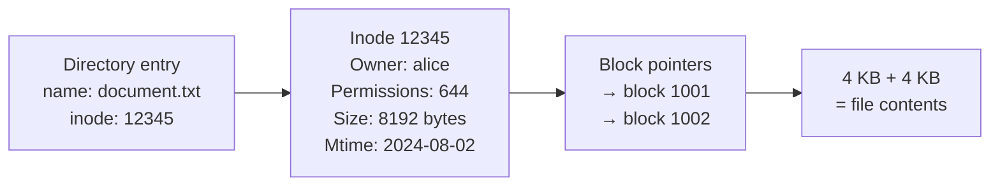
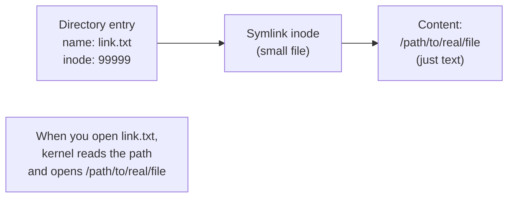
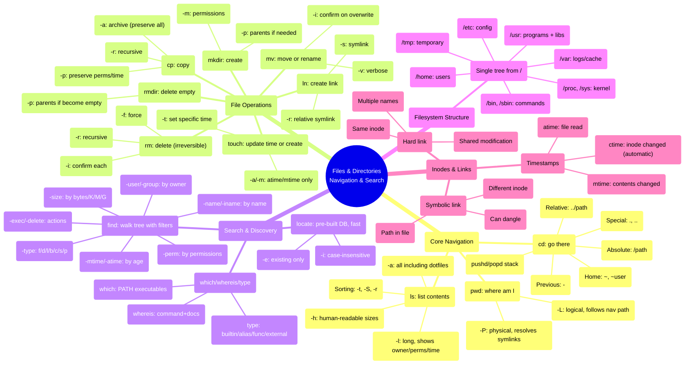

## 1 · The Big Picture

Everything in Unix — and therefore Linux — is arranged in a single **hierarchical filesystem tree**. There is no such thing as a "D: drive" or separate drive letters. Instead, every file, directory, and device is reachable as a path starting from the root `/`. A USB drive, a disk partition, even `/dev/null`, all hang from that same tree, mounted at a point you choose.

This design was radical in 1970 and remains one of Unix's greatest gifts to the world. A script that works on your laptop — navigating by paths, redirecting to files, composing commands — will work identically on a 1,000-node cloud cluster, because the tree is always there, always the same shape.

That tree has two ways to address a file:

- **Absolute paths** start with `/` and describe a route from the root to your target: `/home/alice/documents/budget.txt`.
- **Relative paths** describe a route from where you are now: `documents/budget.txt` if you are in `/home/alice`, or `../bob/notes.txt` to reach a sibling's directory.

These 13 commands are your hands in that tree. You will run them hundreds of times a day.

### Where you will encounter it

| Context | What this chapter covers |
|---|---|
| Any daily shell work | `ls`, `cd`, `pwd` for navigation and inspection |
| Scripting and automation | `find` (the workhorse), `mkdir -p`, `rm -rf` with guards |
| DevOps and configuration | `cp` across systems, `touch` to reset file timestamps, `ln` for configuration management |
| Forensics and debugging | `find` with size/age/permission filters, `locate` for speed, `file` to inspect contents |
| Container and VCS workflows | `find` with `-exec`, careful `rm`, symlinks to manage aliases |
| System administration | `mkdir -m`, `rmdir` cleanup, `cd -` recovery from wrong directories |

### Why this topic exists

Without these commands, you cannot:
- navigate the filesystem at all
- understand where your application's files live
- script bulk operations on hundreds of files
- diagnose why a disk is full (find by size)
- manage symlinks for configuration
- avoid accidentally destroying production data (`rm -rf /` is a keystroke away)

Master these commands and you can operate any Unix system confidently. Botch them — especially `rm` — and you can destroy a system before SSH saves your keystrokes.

---

## 2 · Intuition First

### The filesystem tree: a single, rooted hierarchy

The Unix filesystem is *one tree*, not a forest of drives.

```diagram title="The single filesystem tree"
                    /
                    │
        ┌───────────┼───────────┐
        │           │           │
       bin         home        var
        │           │           │
        ├─ ls       ├─ alice    ├─ log
        ├─ cp       └─ bob      └─ lib
        │
    (/bin/ls means "ls in the bin folder in the root")


    A USB stick or new disk MOUNTS INTO a path:
                        /
                        │
            ┌───────────┼───────────┐
            │           │           │
           bin         home       mnt
            │           │          │
            │           │       ┌──┴──┐
            │           │       │ usb ←── Mount point
            │           │       │      (one of the tree)
            │           │    [files on the USB are here]
            │           │
        When you unmount, /mnt/usb vanishes from the tree,
        but the files on the USB are unharmed.
```

There are no drive letters. A path is *always* a tree traversal from some point (`/`, `.`, or `~`).

### Analogy 1: the filesystem as a library

Imagine a library with no Dewey Decimal System, where books are just piled on shelves. Chaos.

- The **tree** is the organisation system: floors, sections, shelves, stack order.
- **Absolute paths** (`/reference/history/world-war-2.txt`) are like a catalogue number you can hand to anyone, anywhere, and they will find the same book.
- **Relative paths** (`../history/...` when you are in `reference/biography`) are like saying "go left one shelf."
- **Symlinks** are like catalogue cards that say "see also `../history/...", redirecting you without copying the actual book.
- **`cd`** is you walking to a new section and standing there; from there, everything is relative to where you stand.

### Analogy 2: the `..` and `.` shortcuts

Every directory contains two hidden entries that are not real files:

- **`.`** means "this directory" — the spot you are standing in.
- **`..`** means "one level up" — the parent directory.

These are not unique to this chapter; they appear in every path you type. `cd ..` means "go to the parent and make it current." `find . -name "*.log"` means "in this directory and below, find files ending in `.log`."

Think of `.` as "here" and `..` as "up one level."

---

## 3 · Technical Definitions

**Filesystem.** A hierarchical tree of files, directories, and device special files, rooted at `/`. Every object (file, directory, socket, pipe, device) is a path reachable from root.

**Path.** A string describing a location in the tree, made of segments separated by `/`. An absolute path (starting with `/`) is unambiguous anywhere; a relative path (starting with `.`, `..`, or a name) is interpreted from the current working directory.

**Current working directory (pwd).** The directory the shell is currently in. When you type a relative path or a command name without a directory, the shell resolves it from here.

**Hidden file.** A file or directory whose name starts with `.` (dot). Not special to the kernel; the convention is simply to hide them from default directory listings. Pronounced "dotfile."

**Inode.** The kernel's internal record of a file: its owner, permissions, size, timestamps, and where its data blocks live on disk. Every file has one. The inode number uniquely identifies it within a filesystem. Hard links share one inode; symlinks do not.

**Hard link.** A directory entry pointing directly to an inode. Multiple names can point to the same inode; deleting one leaves the others intact as long as the reference count does not drop to zero.

**Symbolic link (symlink).** A special file containing a path (text) rather than data. When you open a symlink, the kernel follows the path inside and opens that target instead. Breaking the link does not delete the target. A symlink can point across filesystems and to targets that do not exist yet.

**FHS (Filesystem Hierarchy Standard).** A standard defining what conventionally lives where in the tree: `/bin` for userspace executables, `/etc` for configuration, `/home` for user home directories, etc. Not enforced by the kernel; followed by all distributions.

---

## 4 · Internal Working

### The filesystem tree: where everything lives

Linux distributions adhere to the **Filesystem Hierarchy Standard (FHS)**. Below is the essential layout and what each top-level directory contains.

```diagram title="FHS directories and their purpose"
/
│
├── bin ──────── Essential userspace commands (ls, cp, grep, cat, sh)
├── sbin ─────── System commands requiring root (fdisk, ifconfig, iptables)
├── boot ─────── Kernel images and bootloader (vmlinuz-*, grub/)
├── dev ──────── Device special files (/dev/sda, /dev/null, /dev/urandom)
├── etc ──────── System configuration files (passwd, shadow, fstab)
├── home ─────── User home directories (/home/alice, /home/bob)
├── lib ──────── Shared libraries needed by /bin and /sbin (.so files)
├── lib64 ────── 64-bit libraries on some systems
├── opt ──────── Optional third-party software (/opt/java, /opt/mysql)
├── proc ─────── Virtual fs with kernel state (/proc/cpuinfo, /proc/self/fd)
├── root ─────── Root user's home directory (~ for root)
├── run ──────── Runtime state cleared on reboot (/run/systemd)
├── sys ──────── Virtual fs with device and kernel parameters
├── tmp ──────── Temporary files, world-writable, cleared on reboot
├── usr ──────── User programs and libraries
│   ├── bin ──── Non-essential commands (/usr/bin/python, /usr/bin/env)
│   ├── sbin ─── Non-essential system commands
│   ├── lib ──── Libraries for /usr/bin
│   ├── local/── Locally-compiled or admin-installed software
│   └── share/─ Architecture-independent data (man pages, docs)
├── var ──────── Variable data: logs, caches, databases
│   ├── log ──── Log files (syslog, auth.log, apache2/)
│   ├── cache/─ Cache files (apt, package manager caches)
│   ├── lib ──── Variable state (mysql data, dpkg state)
│   └── tmp ──── Alternative temp location for large files
├── mnt ──────── Mount points for temporary mounts (/mnt/usb, /mnt/share)
├── media ────── Mount points for removable media (/media/cdrom)
└── srv ──────── Service data (web roots, FTP data)
```

Each directory above is reachable from your shell as a path: `/etc/passwd`, `/var/log/syslog`, `/home/alice/.ssh/config`.

### How files are stored: inodes and blocks

When you create a file, the kernel does not allocate one huge block. It allocates many small chunks called **data blocks** (usually 4 KB), and it creates an **inode** to track them:



**Hard links** work by creating a new directory entry pointing to the same inode. **Symlinks** work differently — they are small files containing a path as text:



The critical difference: deleting a symlink breaks the link but leaves the target. Deleting a hard link decrements the reference count; when it hits zero, the inode is freed.

### Opening a file: the kernel's job

When you run `ls /home/alice/documents`, the kernel:

1. Looks up the inode for `/home/alice/documents` by walking the tree: start at `/`, find `home` inode, look inside that, find `alice` inode, and so on.
2. Reads the inode and checks permissions — does your user have `r` (read) permission on this directory?
3. Reads the directory's data blocks to find all entries (`documents`, `notes.txt`, etc.) and their inode numbers.
4. For each entry, reads its inode to get size, permissions, timestamps, and displays them.

That walk-the-tree lookup — called a **directory traversal** — is why `ls /very/long/deep/path` can be slow on a filesystem with millions of files and deep trees.

### Filenames: what is allowed

A filename in Linux can contain almost any byte except `/` and the null byte (`\0`). This means:

- **Spaces, tabs, newlines are legal** — but they wreak havoc in scripts because the shell interprets them as delimiters. Never name a file `my document.txt` in production; use `my_document.txt` or `my-document.txt`.
- **Case-sensitive** — `File.txt`, `file.txt`, and `FILE.TXT` are three different files. A port from macOS or Windows often breaks because of this.
- **Newlines in filenames** — legal, bizarre, and present in real-world broken systems. `find` handles them with `-print0` piping to `xargs -0`.
- **Leading dashes** — `ls -l` is a flag; `ls -- -my-file` treats `-my-file` as a filename (the `--` stops flag parsing). Always be careful when passing user input to commands.

---

## 5 · Real Examples

### Scenario 1: a fresh developer exploring the codebase

You are on a server running a legacy Java application. You need to find where logs go.

```console
$ pwd
/home/alice

$ cd /var/log
$ pwd
/var/log

$ ls -l | head -10
total 1024
-rw-r--r--  1 root root   12345 Aug  2 14:22 syslog
-rw-r--r--  1 root root   45678 Aug  2 13:11 auth.log
drwxr-xr-x  2 tomcat tomcat  4096 Aug  2 14:25 tomcat/
drwxr-xr-x  2 nginx  nginx   4096 Aug  2 12:01 nginx/

$ find . -name "*.log" -type f -mmin -30
./auth.log
./syslog
./tomcat/catalina.2024-08-02.log

$ file ./tomcat/catalina.2024-08-02.log
./tomcat/catalina.2024-08-02.log: ASCII text

$ tail -20 ./tomcat/catalina.2024-08-02.log
2024-08-02 14:25:33.123 INFO  [main] org.apache.catalina.startup.Catalina.start Server startup in 2431 ms
```

### Scenario 2: batch operations on files

You need to rename all `.jpg` files to `.jpeg`, back them up first.

```console
$ pwd
/home/alice/photos

$ ls *.jpg
vacation-001.jpg
vacation-002.jpg
vacation-003.jpg

$ # Back them all up first
$ mkdir -p backup
$ cp -v *.jpg backup/
vacation-001.jpg -> backup/vacation-001.jpg
vacation-002.jpg -> backup/vacation-002.jpg
vacation-003.jpg -> backup/vacation-003.jpg

$ # Now rename them using find + move
$ find . -maxdepth 1 -name "*.jpg" -type f | while read f; do
    mv "$f" "${f%.jpg}.jpeg"
  done

$ ls *.jpeg
vacation-001.jpeg
vacation-002.jpeg
vacation-003.jpeg
```

### Scenario 3: find all modified files in production and back them up

You suspect someone modified application files. You want to find anything changed in the last hour.

```console
$ find /var/www/app -type f -mmin -60 -print0 | xargs -0 cp -v --parents -t /backup/app/

/var/www/app/config/database.yml -> /backup/app/var/www/app/config/database.yml
/var/www/app/app.js -> /backup/app/var/www/app/app.js

$ # Check what changed
$ find /var/www/app -type f -mmin -60 -exec ls -lh {} \;
-rw-r--r-- 1 www-data www-data 2.3K Aug  2 15:22 /var/www/app/config/database.yml
-rw-r--r-- 1 www-data www-data  18K Aug  2 15:11 /var/www/app/app.js
```

---

## 6 · Practical Demonstration

Everything below is essential to typing competently in a shell. Do each one; do not read passively. Changes in this section are your production-safety practice.

### The three directions: pwd, cd, ls

**`pwd` — Print Working Directory.** Shows where you are.

```bash
pwd
```

```console
$ pwd
/home/alice
```

Every option:

| Option | Meaning |
|---|---|
| `-L` | Logical: show the path as you navigated to it, even if symlinks were involved. **This is the default.** |
| `-P` | Physical: resolve all symlinks and show the real path. |

**Practical use:** Symlinks can confuse you. If you are in `/var/www` (which is a symlink to `/srv/www`), `pwd` shows `/var/www` by default, but `pwd -P` shows `/srv/www`. On production systems with many symlinks, use `-P` to know the real location.

```console
$ # Example: /home/alice/current is a symlink to /home/alice/project-2024-08
$ cd /home/alice/current
$ pwd
/home/alice/current
$ pwd -P
/home/alice/project-2024-08
```

---

**`cd` — Change Directory.** Move to a different directory. Does not take input from stdin; you must provide a path on the command line.

```bash
cd <path>
```

Forms of `<path>`:

| Path | Meaning | Example |
|---|---|---|
| `<dir>` | Relative to current directory | `cd documents` (if you are in `/home/alice`, you go to `/home/alice/documents`) |
| `/dir` | Absolute path | `cd /var/log` (you go to `/var/log` from anywhere) |
| `~` | Your home directory (from `/etc/passwd` or `$HOME`) | `cd ~` → `/home/alice` |
| `~user` | Another user's home directory | `cd ~bob` → `/home/bob` |
| `-` | The previous directory you were in (tracked in `$OLDPWD`) | `cd /var/log`, then `cd /tmp`, then `cd -` → back to `/var/log` |
| `..` | Parent directory | `cd ..` goes up one level |
| `.` | Current directory | `cd .` does nothing (rarely useful) |

**CDPATH.** An environment variable (like `$PATH`) that lists directories to search when you type `cd dirname`. If `dirname` is not in the current directory and not an absolute path, the shell searches `$CDPATH` in order. Setting `CDPATH="/home:/var"` means `cd log` from anywhere will find `/var/log` if it exists.

```console
$ CDPATH=/home:/var
$ cd log
$ pwd
/var/log
```

> [!TIP]
> `CDPATH` is a beginner trap; it makes scripts non-portable because `cd dirname` behaves differently on your machine than someone else's. Best practice in production: **always use absolute paths or explicit relative paths** (`./dirname`, `../dirname`, `../../dirname`).

**`pushd` and `popd`.** Directory stack navigation.

- **`pushd <dir>`** — change to `<dir>` *and* push the current directory onto a stack.
- **`popd`** — pop a directory off the stack and go there.
- **`dirs`** — show the entire stack.

```console
$ pwd
/home/alice

$ pushd /var/log
/var/log /home/alice

$ pwd
/var/log

$ pushd /tmp
/tmp /var/log /home/alice

$ dirs
/tmp /var/log /home/alice

$ popd
/var/log /home/alice

$ pwd
/var/log

$ popd
/home/alice

$ pwd
/home/alice
```

When you exit the shell, the stack is forgotten. Use `pushd` and `popd` in interactive shells to avoid losing your place; use explicit paths in scripts.

---

**`ls` — List Directory.** The command you will type thousands of times. Show the contents of a directory.

```bash
ls [options] [path ...]
```

All critical options:

| Option | Meaning |
|---|---|
| `-l` | Long format. Shows inode entry count in the first column (`total`), then for each file: permissions, link count, owner, group, size, mtime, name. This is what you usually want. |
| `-a` | Show all entries, including dotfiles (hidden files starting with `.`). By default, `.` and `..` and dotfiles are hidden. |
| `-A` | Show all entries except `.` and `..` (the "dot dot" is usually not useful in listings). |
| `-h` | Human-readable sizes: use K, M, G instead of bytes. Only meaningful with `-l`. |
| `-R` | Recursive. List directories and all files inside them, recursively. Can be verbose; usually you want `find` instead. |
| `-t` | Sort by modification time (newest first). Combine with `-r` to sort oldest first. |
| `-S` | Sort by file size (largest first). |
| `-r` | Reverse sort order (applies to `-t`, `-S`, or alphabetical). |
| `-i` | Show inode numbers. Useful when debugging hard links. |
| `-d` | List the directory itself, not its contents. `ls -d /tmp` shows `/tmp`'s metadata, not what is inside. |
| `-1` | One entry per line (always; `ls` uses multiple columns if the terminal is wide). |

**The `ls -l` line, field by field:**

```console
$ ls -l /home/alice/document.txt
-rw-r--r-- 1 alice wheel 8192 Aug  2 14:22 document.txt
```

| Field | Value | Meaning |
|---|---|---|
| File type + perms | `-rw-r--r--` | First character: `-` = regular file, `d` = directory, `l` = symlink, `b` = block device, `c` = character device, `s` = socket, `p` = pipe. Then 9 characters of permissions (Chapter 17). |
| Link count | `1` | Number of hard links to this inode. A file starts at 1. A directory starts at 2 (one for its entry in the parent, one for `.` inside itself). When you hard-link a file, this count increases. |
| Owner | `alice` | User (UID) that owns the file. |
| Group | `wheel` | Group (GID) that owns the file. |
| Size | `8192` | Bytes. Note: this is the logical size, not the on-disk size (which may be larger due to fragmentation or block size). |
| Mtime | `Aug  2 14:22` | Last modification time. If the file is > 6 months old, shows year instead of time. |
| Name | `document.txt` | The filename. |

**The `total` line:**

```console
$ ls -l /home/alice
total 48
drwxr-xr-x 2 alice wheel 4096 Aug  2 14:01 documents/
-rw-r--r-- 1 alice wheel 8192 Aug  2 14:22 document.txt
```

The `total 48` line shows the number of **512-byte blocks** used by the *directory inode itself*, not the files inside. It is informational and often misread as "total size of files." Do not use it to calculate disk usage; use `du -sh` for that.

**When `ls` is lying about hidden files:**

```console
$ ls -l /home/alice
-rw-r--r-- 1 alice wheel 8192 Aug  2 14:22 document.txt

$ ls -la /home/alice
-rw-r--r-- 1 alice wheel 8192 Aug  2 14:22 document.txt
-rw------- 1 alice wheel  512 Aug  2 14:01 .ssh/
drwxr-xr-x 5 alice wheel 4096 Aug  2 13:54 .config/
drwxr-xr-x 2 alice wheel 4096 Aug  2 12:00 .local/
```

Scripts often break because `ls` hides dotfiles by default. Always use `ls -a` or `ls -A` when scripting.

---

### Directory creation and removal

**`mkdir` — Make Directory.** Create a new directory.

```bash
mkdir [options] <dirname> [<dirname2> ...]
```

All important options:

| Option | Meaning |
|---|---|
| `-p` | Create parent directories if needed. `mkdir -p /home/alice/documents/work/2024` creates the entire path even if `/home/alice/documents` does not exist. **Use this in scripts.** |
| `-m <mode>` | Set permissions on the new directory. `mkdir -m 700 /home/alice/.ssh` creates it with owner-only read/write/execute, preventing others from listing it. |
| `-v` | Verbose: print each directory as it is created. |

Brace expansion — a shell feature, not a `mkdir` feature — lets you create many directories at once:

```console
$ mkdir project-{2023,2024,2025}
$ ls -d project-*
project-2023/ project-2024/ project-2025/

$ mkdir -p website/{assets/{css,js,images},pages}
$ tree website/
website/
├── assets/
│   ├── css/
│   ├── images/
│   └── js/
└── pages/
```

---

**`rmdir` — Remove Directory.** Delete an *empty* directory.

```bash
rmdir [options] <dirname> [<dirname2> ...]
```

**Options:**

| Option | Meaning |
|---|---|
| `-p` | Remove parent directories if they become empty. `rmdir -p /home/alice/documents/work/2024` removes 2024, then work (if empty), then documents (if empty), and so on up. |
| `-v` | Verbose: print each directory as it is removed. |

**Critical gotcha:** `rmdir` only works on *empty* directories. If you try `rmdir /var/log` when it contains files, it fails.

```console
$ mkdir empty_dir
$ rmdir empty_dir
$ rmdir empty_dir
rmdir: failed to remove 'empty_dir': No such file or directory

$ mkdir has_content
$ touch has_content/file.txt
$ rmdir has_content
rmdir: failed to remove 'has_content': Directory not empty
$ rm has_content/file.txt
$ rmdir has_content
```

> [!WARNING]
> **PDF error corrected:** The source PDF repeats the `mkdir` text verbatim in the `rmdir` section. That is wrong. `rmdir` only removes *empty* directories. For directories with content, use `rm -rf` (with extreme caution — see below).

---

### Deleting files and directories: `rm`

**`rm` — Remove (Delete).** Permanently delete files and directories. **No undo. No recycle bin. Use with extreme caution.**

```bash
rm [options] <file> [<file2> ...]
```

All critical options:

| Option | Meaning |
|---|---|
| `-f` | Force: do not prompt for confirmation, and do not fail if a file does not exist. Silently deletes anything you have permission to delete. **Dangerous with wildcards or unset variables.** |
| `-i` | Interactive: ask for confirmation before deleting each file. Good for learning or risky scripts. |
| `-I` | Prompt once before deleting more than 3 files or a directory recursively. A middle ground between `-i` and no option. |
| `-r` | Recursive: delete directories and everything inside them. **The nuclear option.** `rm -rf /` with accidentally expanded `/` will destroy the system. |
| `-v` | Verbose: print each file as it is deleted. |
| `-d` | Remove empty directories (like `rmdir`). Without `-r`, `-d` fails on non-empty directories. |

**The deadliest command in Unix:**

```bash
rm -rf /
```

This recursively deletes everything starting from `/`, the root. A typo like `rm -rf / tmp` (with a space) instead of `rm -rf /tmp` has ended careers. **Every production system has a war story about this command.**

Safer patterns:

```bash
# Always use quotes around variables
rm -f "$file"

# Do not use unset variables
set -u  # bash: exit if any undefined variable is used
rm -rf $VAR/

# Preview what will be deleted before actually deleting
find . -name "*.log" -type f
# if satisfied:
find . -name "*.log" -type f -delete

# Use a separate step to check: list, then delete
files=$(find . -name "*.log")
echo "Will delete: $files"
read -p "Press enter to continue..."
echo "$files" | xargs rm -f
```

**Recovering deleted files:** If a process still has the file open, you can sometimes recover it.

```console
$ rm /var/log/app.log
$ # But the app is still writing to it

$ lsof +L1  # Show deleted files still open
COMMAND   PID      USER   FD   TYPE DEVICE SIZE/OFF NLINK NAME
java     1234  appuser   23w  REG 10,1    8388608     0 /var/log/app.log (deleted)

$ # Copy from the file descriptor
$ cp /proc/1234/fd/23 /var/log/app.log.recovered
```

This works because Linux keeps the file's data blocks alive as long as at least one process holds them open.

---

### Copying files: `cp`

**`cp` — Copy.** Copy a file or directory tree to a new location.

```bash
cp [options] <source> <destination>
cp [options] <source> [<source2> ...] <destination_dir>
```

All important options:

| Option | Meaning |
|---|---|
| `-r` | Recursive: copy directories and all files inside them. Without this, `cp` fails on directories. |
| `-a` | Archive mode: `-r` plus preserve permissions, ownership, timestamps, and symlinks. **Use this for backups.** Equivalent to `-dR --preserve=all`. |
| `-i` | Interactive: ask before overwriting. Good for production. |
| `-n` | No-clobber: do not overwrite existing files. Silently skip. |
| `-v` | Verbose: print each file as it is copied. |
| `-u` | Update: only copy if source is newer or destination missing. Useful for incremental backups. |
| `-p` | Preserve: keep permissions, ownership, and timestamps. **Important for config files.** |
| `--preserve=all` | Preserve permissions, ownership, timestamps, context (SELinux), and other attributes. Best for production copying. |
| `-L` | Follow symlinks: if source is a symlink, copy the target, not the link itself. |
| `-P` | Do not follow symlinks: copy symlinks as symlinks (the default). |

**The trailing-slash trap:**

```console
$ mkdir /tmp/dir1 /tmp/dir2
$ touch /tmp/dir1/file.txt

$ # Without trailing slash: copies the directory itself
$ cp -r /tmp/dir1 /tmp/dir2
$ ls -R /tmp/dir2
/tmp/dir2:
dir1

/tmp/dir2/dir1:
file.txt

$ # With trailing slash: copies the *contents* of the directory
$ cp -r /tmp/dir1/ /tmp/dir2/
$ ls /tmp/dir2
file.txt
```

In production scripts, this mistake is common and expensive. **Use `--preserve=all` and explicit paths; test your backup logic before deploying it.**

---

### Moving and renaming: `mv`

**`mv` — Move or Rename.** Move a file to a new location or rename it. Both operations use the same command because renaming is just moving within the same directory.

```bash
mv [options] <source> <destination>
mv [options] <source> [<source2> ...] <destination_dir>
```

Options:

| Option | Meaning |
|---|---|
| `-i` | Interactive: ask before overwriting. |
| `-n` | No-clobber: do not overwrite; silently fail. |
| `-v` | Verbose: print each move. |
| `-f` | Force: overwrite without asking. |
| `-u` | Update: only move if source is newer or destination missing. |

**Within the same filesystem:** `mv` is instant — the kernel just updates directory entries (inodes stay in place).

**Across filesystems:** `mv` must copy the file (slow) and then delete the source. This is automatic; `mv` detects the filesystem boundary.

```console
$ # Within /home: instant (same filesystem)
$ mv /home/alice/file.txt /home/bob/file.txt

$ # /home to /tmp: copy + delete (different filesystems; slow for large files)
$ time mv /home/alice/large-video.mp4 /tmp/
real    0m12.456s   # Had to copy 8 GB
```

**Glob handling:** `mv` behaves differently when the shell expands globs:

```console
$ # Single destination — renames
$ mv file1.txt file1.txt.backup

$ # Multiple sources, directory destination — moves all into the directory
$ mv *.log /var/log/archive/

$ # Dangerous: if glob expands to nothing, fails silently in some shells
$ shopt -s nullglob  # bash: prevent empty glob expansion
$ mv *.xyz /tmp/  # If no .xyz files exist, does nothing
```

In production scripts, use `find` with `-exec` or `xargs` instead of globbing:

```bash
# Do not do this:
mv $LOG_DIR/*.log /archive/

# Do this instead:
find "$LOG_DIR" -maxdepth 1 -name "*.log" -type f -print0 | \
  xargs -0 mv -t /archive/
```

---

### Changing file timestamps: `touch`

**`touch` — Update File Timestamps (or Create Empty File).** Change access time, modification time, or creation-related times. If the file does not exist, creates an empty file.

```bash
touch [options] <file> [<file2> ...]
```

All important options:

| Option | Meaning |
|---|---|
| `-a` | Update only access time (atime). |
| `-m` | Update only modification time (mtime). |
| `-c` | Do not create the file if it does not exist; only update timestamps if it does. |
| `-t <timestamp>` | Set to a specific time. Format: `[[CC]YY]MMDDhhmm[.ss]`. Example: `touch -t 202408021422 file.txt` sets to 2024-08-02 14:22. |
| `-d <date>` | Set to a date string the system can parse. `touch -d "2024-08-02 14:22:00" file.txt`. |
| `-r <ref_file>` | Set timestamps to match another file. `touch -r template.txt newfile.txt`. |

**The three timestamps on every file:**

Every file has three timestamps:

| Timestamp | Command to view | Command to update | Meaning |
|---|---|---|---|
| **mtime** (modification time) | `ls -l`, `stat` | `touch -m` | When the file's *contents* were last changed. What `ls -l` shows by default. |
| **atime** (access time) | `ls -u`, `stat` | `touch -a` | When the file was last *read*. Often disabled for performance (reading should not require a disk write). |
| **ctime** (change time) | `stat` | **Cannot be set** | When the file's *inode* was last changed (permissions, ownership, size). **Not the same as creation time.** |

```console
$ touch myfile.txt
$ stat myfile.txt | grep -i time
Access: 2024-08-02 14:22:00.000000000 +0000
Modify: 2024-08-02 14:22:00.000000000 +0000
Change: 2024-08-02 14:22:00.000000000 +0000

$ sleep 2
$ cat myfile.txt
$ stat myfile.txt | grep Access
Access: 2024-08-02 14:22:02.000000000 +0000

$ touch -m -t 202401010000 myfile.txt
$ stat myfile.txt | grep Modify
Modify: 2024-01-01 00:00:00.000000000 +0000
```

---

### Inspecting file types: `file`

**`file` — Determine File Type.** Reads the first few bytes of a file and guesses its type based on "magic numbers" — standard byte sequences at the start of known formats.

```bash
file [options] <file> [<file2> ...]
```

Options:

| Option | Meaning |
|---|---|
| `-b` | Brief: omit the filename; just print the type. |
| `-i` | MIME type: print the `application/octet-stream`-style type instead of English. |
| `-L` | Follow symlinks: if argument is a symlink, inspect the target, not the link itself. |
| `-k` | Keep going: continue scanning even if a match is found. Prints *all* matched types. **Not "additional info" as some docs claim — it is specifically "keep scanning on match."** |

> [!WARNING]
> **PDF error corrected:** The source PDF states that `-k` provides "additional info." It does not. The `-k` flag means "keep going after the first match." This is a common source of confusion.

```console
$ file /bin/bash
/bin/bash: ELF 64-bit LSB executable, x86-64, version 1 (SYSV), dynamically linked, for GNU/Linux 3.2.0, BuildID[sha1]=..., stripped

$ file /etc/passwd
/etc/passwd: ASCII text

$ file /dev/sda
/dev/sda: block special (8/0)

$ file -i /bin/bash
/bin/bash: application/x-executable; charset=binary

$ file /home/alice/docs/contract.pdf
/home/alice/docs/contract.pdf: PDF document, version 1.4
```

The magic number database is in `/usr/share/misc/magic`. You can add custom types; see `man magic`.

---

### Creating and managing symlinks: `ln`

**`ln` — Create Hard or Symbolic Links.** Create an additional name for a file (hard link) or a reference to a path (symlink).

```bash
ln [options] <target> <link_name>
ln [options] <target> [<target2> ...] <directory>
```

Options:

| Option | Meaning |
|---|---|
| `-s` | Symbolic link. Without this, creates a hard link (a second directory entry pointing to the same inode). |
| `-f` | Force: unlink the destination if it exists, then create the link. |
| `-v` | Verbose: print the result. |
| `-r` | Relative symlinks: instead of storing the absolute path in the symlink, store a relative path. `ln -sr /var/log/app.log /home/alice/applog` creates a symlink containing `../../var/log/app.log` instead of an absolute path. Useful for portable backups. |

**Hard links vs symbolic links — the crucial difference:**

```diagram title="Inode diagram: hard link vs symlink"
HARD LINK:
    directory entry      inode        data
    file1.txt     ──→  [12345]  ──→  "contents"
    file1.bak     ──→  [12345]  ──→  (same)
    
    Deleting file1.txt leaves file1.bak intact
    Modifying file1.bak changes file1.txt too
    (same file, two names)

SYMBOLIC LINK:
    directory entry      inode        inode        data
    link.txt      ──→  [99999]  ──→  path text  ──→  
                         (small)    "/path/to/file"     (real inode)
    
    Deleting the target breaks the symlink
    Modifying through link.txt modifies the target
    (different files, link contains a path)
```

**Examples:**

```console
$ # Hard link: two names, one inode
$ echo "original" > file.txt
$ ln file.txt file.bak
$ ls -i
12345 file.txt
12345 file.bak

$ cat file.bak
original

$ rm file.txt
$ cat file.bak
original

$ # Symlink: separate inodes, link contains path
$ ln -s /var/log/app.log ./applog
$ ls -li applog
54321 applog -> /var/log/app.log

$ cat applog
(contents of /var/log/app.log)

$ rm /var/log/app.log
$ cat applog
cat: applog: No such file or directory

$ # Link still exists; it just points nowhere
$ ls -li applog
54321 applog -> /var/log/app.log  (dangling)
```

**Hard links: key limits.**

- Cannot cross filesystems (hard links must point to the same inode, which is filesystem-local).
- Cannot link directories (would create loops in the tree).
- If the source is a symlink, `ln` creates a link to the symlink, not the target (unless you use `ln -L` to follow the symlink first).

**Symlinks: practical uses.**

- Configuration management: `/etc/nginx/sites-enabled/default` is often a symlink to `/etc/nginx/sites-available/default-real`, so you enable/disable sites by creating/removing symlinks.
- Version management: `/opt/java` is a symlink to `/opt/java-11.0.12`; upgrading means updating the symlink, leaving old versions in place for rollback.
- Personal shortcuts: `~/.bashrc` often sources `~/.bashrc-work` or `~/.bashrc-personal` for role-based configuration.

---

### Finding files by name: `locate`

**`locate` — Find a File by Name (Fast).** Searches a pre-built database of filenames instead of walking the tree. Extremely fast but only as current as the database.

```bash
locate [options] <pattern>
```

Options:

| Option | Meaning |
|---|---|
| `-i` | Case-insensitive search. |
| `-r` | Treat pattern as a regular expression (POSIX ERE). |
| `-n <count>` | Limit results to count matches. |
| `-c` | Count: print number of matches, not the filenames. |
| `-e` | Existing files only: exclude results where the file no longer exists (the database is stale). |

The database is updated by `updatedb`, usually via a cron job nightly. On some systems, `locate` may not know about files created in the last 24 hours.

```console
$ # Create a file
$ touch /tmp/myfile.txt

$ # locate might not find it yet
$ locate myfile.txt
(no result)

$ # Force an update
$ sudo updatedb

$ locate myfile.txt
/tmp/myfile.txt

$ # Case-insensitive
$ locate -i MYFILE
/tmp/myfile.txt

$ # Count
$ locate -c "*.log"
1247
```

**When to use `locate` vs `find`:**

- `locate` for quick interactive searches on whole system: `locate nginx.conf`.
- `find` for precise, complex searches with filters: `find /var/www -name "*.php" -type f -newer /tmp/marker`.

---

### Finding files: `find` — the workhorse

**`find` — Search for Files.** Walk a directory tree and filter by name, type, size, age, permissions, owner, and more. Execute commands on matches. The most powerful and widely-used file search in Unix.

```bash
find [path] [options] [expression]
```

If `path` is omitted, defaults to `.` (current directory).

**Essential options and predicates:**

| Predicate | Meaning |
|---|---|
| `-name <pattern>` | Match by filename, shell glob pattern: `*`, `?`, `[abc]`. |
| `-iname <pattern>` | Case-insensitive `-name`. |
| `-path <pattern>` | Match by full path (from the starting point). `find /home -path "*/.git/*" -prune` skips `.git` directories. |
| `-regex <regex>` | Match by full path using POSIX ERE regex. |
| `-type <type>` | Filter by file type: `f` (regular file), `d` (directory), `l` (symlink), `b` (block device), `c` (character device), `s` (socket), `p` (pipe). |
| `-size <size>` | Match by size: `+100k` (larger than 100 KiB), `-10M` (smaller than 10 MiB), `5G` (exactly 5 GiB). Suffix: `c` (bytes), `k` (KiB), `M` (MiB), `G` (GiB). |
| `-mtime <days>` | Modified time: `+30` (older than 30 days), `-7` (modified in the last 7 days), `0` (modified today). |
| `-mmin <minutes>` | Modified time in minutes: `-60` (modified in the last 60 minutes). |
| `-atime <days>` | Access time (last read): `+7` (not accessed for 7+ days). |
| `-ctime <days>` | Change time (inode modified). |
| `-newer <file>` | Files modified more recently than `<file>`. |
| `-user <user>` | Match by owner. `find /home -user alice`. |
| `-group <group>` | Match by group. |
| `-uid <uid>` | Match by numeric UID. Useful for finding files owned by deleted users (UID exists, name does not). |
| `-perm <perms>` | Match by permissions. `-perm 644` (exactly 644), `-perm -644` (has all these bits set), `-perm /644` (has any of these bits set). |
| `-empty` | Match empty files or directories. |
| `-maxdepth <depth>` | Do not search deeper than depth levels. `find /home -maxdepth 1` lists only files directly in `/home`, not subdirectories. |
| `-mindepth <depth>` | Do not process anything shallower than depth levels. Rarely needed. |
| `-prune` | Skip this directory; do not descend into it. `find / -path /proc -prune -o -name "pattern" -print`. |

**Actions:**

| Action | Meaning |
|---|---|
| `-print` | Print matching path (the default). |
| `-print0` | Print paths null-separated, not newline-separated. For piping to `xargs -0` (safe with spaces/newlines in filenames). |
| `-delete` | Delete matching files. **Use with caution.** Equivalent to `rm -f`. |
| `-exec <command> {} \;` | Execute command on each match. `{}` is replaced by the filename. Must end with `;` (escaped as `\;` in the shell). `find /var/log -name "*.old" -exec rm {} \;`. |
| `-exec <command> {} +` | Execute command with many filenames at once (more efficient than `\;`). `find /tmp -type f -exec ls -lh {} +`. |
| `-execdir <command> {} \;` | Like `-exec`, but changes to the directory containing the file first. Prevents `{}` from containing paths; useful for avoiding argument-too-long errors. |

**Production one-liners:**

```bash
# 1. Find and delete old logs (older than 30 days)
find /var/log -name "*.log" -type f -mtime +30 -delete

# 2. Find files larger than 1 GB and list them
find / -type f -size +1G -exec ls -lh {} \; 2>/dev/null | awk '{print $5, $9}'

# 3. Find files modified in the last hour, safe for newlines in names
find /var/www -type f -mmin -60 -print0 | xargs -0 ls -lh

# 4. Find all world-writable files (security risk)
find / -type f -perm /002 2>/dev/null

# 5. Find and tar a directory structure, excluding certain paths
find /home/alice -path "*/.git" -prune -o -path "*/node_modules" -prune -o -type f -print0 | \
  xargs -0 tar czf backup.tar.gz

# 6. Find files owned by a deleted user (UID 1000, but user gone)
find / -uid 1000 -type f 2>/dev/null
```

---

### Comparing search methods

When should you use `find`, `locate`, `which`, `whereis`, or `type`? Each has a purpose.

| Tool | What it searches | Speed | When to use | Example |
|---|---|---|---|---|
| **`find`** | Any directory tree, with filters | Slow (walks tree) | Complex searches: size, age, type, permissions | `find /var -name "*.log" -mtime +30` |
| **`locate`** | System-wide database | Fast (pre-built) | Quick interactive searches, "where is this file?" | `locate nginx.conf` |
| **`which`** | `$PATH` for executables | Very fast | Find a command in your `$PATH` | `which python` → `/usr/bin/python` |
| **`whereis`** | Command + source + man pages | Fast | Find a command and related files | `whereis nginx` → `/usr/sbin/nginx /etc/nginx /usr/share/man/man8/nginx.8` |
| **`type`** | Built-in shell command resolution | Very fast | Find what a command *is* (builtin, alias, function, external) | `type cd` → `cd is a shell builtin` |

---

## 7 · Comparison Tables

### `cd` variants

| Command | Where you go | Use case |
|---|---|---|
| `cd /absolute/path` | Absolute path | Jump anywhere from anywhere |
| `cd relative/path` | Relative to current directory | Move within a known subtree |
| `cd ..` | Parent directory | Go up one level |
| `cd ../..` | Grandparent directory | Go up two levels |
| `cd ~` | Your home directory | Quick escape anywhere |
| `cd ~user` | Another user's home | Access a colleague's files |
| `cd -` | Previous directory (in `$OLDPWD`) | Toggle between two locations |
| `cd` (no argument) | Your home directory | Same as `cd ~` |

### Permission-related `find` patterns

| Pattern | Matches |
|---|---|
| `-perm 644` | Exactly 644 |
| `-perm -644` | Has *at least* 644 (could be 755, 777, etc.) |
| `-perm /644` | Has *any* of those bits set |
| `-perm /002` | World-writable (dangerous) |
| `-perm /006` | Writable by group or world (risky) |

### File type characters in `ls -l`

| Character | Meaning |
|---|---|
| `-` | Regular file |
| `d` | Directory |
| `l` | Symbolic link |
| `b` | Block device (`/dev/sda`) |
| `c` | Character device (`/dev/null`) |
| `s` | Socket (`/var/run/docker.sock`) |
| `p` | Named pipe (FIFO) |

---

## 8 · Memory Tricks

> [!MEMORY]
> **"ls -l shows Link count, Owner, Group."** The command is `-l` for "long", but remember the three things it emphasises: the link count (hard links), owner, and group. Everything else (size, time, permissions) follows naturally.

> [!MEMORY]
> **"dot means here, dotdot means up."** Anywhere you see `.` or `..`, remember: `.` is shorthand for "current directory", `..` is shorthand for "parent." `ls .` is "list here", `cd ..` is "go up", `rm -rf ./` is "delete everything here."

> [!MEMORY]
> **"absolute starts with slash, relative doesn't."** If a path starts with `/`, you can type it from anywhere and it is correct. If it does not, it is relative to where you are now.

> [!MEMORY]
> **"find is for complex, locate is for quick."** `find` is slow but powerful; `locate` is fast but dumb. `find` if you need filters, `locate` if you just want to know where something is.

> [!MEMORY]
> **"Hard link = second name, symlink = path in a file."** Hard links are just additional names for the same inode. Symlinks are files containing a path; deleting the target breaks the link.

> [!MEMORY]
> **"rm -rf / is how your resume ends."** Never type `rm -rf` with a variable or glob unless you have previewed exactly what will be deleted.

> [!MEMORY]
> **"`-print0` and `xargs -0` are your friends when filenames have spaces or newlines."** Every production script that processes filenames should use this pattern.

---

## 9 · Interview Corner

<details>
<summary><strong>Beginner</strong> — What does `pwd` do?</summary>

Print the current working directory — the absolute path you are in. Useful when you are lost in a deeply nested directory tree and need to see where you are. `pwd -P` resolves symlinks and shows the physical location; `pwd -L` (the default) shows the path as you navigated to it.
</details>

<details>
<summary><strong>Beginner</strong> — Explain the difference between `cd ~` and `cd /root`.</summary>

`cd ~` takes you to the user's home directory, which comes from the shell's `$HOME` environment variable or the user's entry in `/etc/passwd`. `cd /root` is the literal directory `/root`. For a regular user, `~` is `/home/username`; for the root user, `~` is `/root`. They are the same if you are root, but different if you are not.
</details>

<details>
<summary><strong>Beginner</strong> — What does `ls -l` show you, field by field?</summary>

From left to right: file type + permissions (10 characters), link count, owner, group, size (in bytes), modification time, and filename. The first character of the permissions field tells you the file type: `-` is a regular file, `d` is a directory, `l` is a symlink, `b` or `c` is a device.
</details>

<details>
<summary><strong>Beginner</strong> — When would you use `mkdir -p`?</summary>

When you want to create a directory and its parents if needed. Without `-p`, `mkdir /home/alice/documents/work` fails if `/home/alice/documents` does not exist. With `-p`, it succeeds. Always use `-p` in scripts because you cannot assume the parent exists.
</details>

<details>
<summary><strong>Beginner</strong> — What is the difference between `cp` and `mv`?</summary>

`cp` creates a copy; the original remains. `mv` moves (or renames) the file; the original is gone. Within the same filesystem, `mv` is instant. Across filesystems, `mv` must copy (slow) and then delete (so it is safe — if the copy fails, the original stays).
</details>

<details>
<summary><strong>Intermediate</strong> — Explain hard links vs symbolic links.</summary>

A hard link is another directory entry pointing to the same inode. Deleting one hard link does not affect the others; the file is deleted only when the link count drops to zero. A symbolic link is a special file containing a path (text). Deleting the symlink does not touch the target, but if the target is deleted, the symlink becomes broken (dangling). Hard links cannot cross filesystems or point to directories; symlinks can do both.
</details>

<details>
<summary><strong>Intermediate</strong> — What does `find . -name "*.log" -type f -mtime +7 -delete` do?</summary>

Finds all regular files (not directories) in the current directory and below whose name ends in `.log` and which were modified more than 7 days ago, then deletes them. The `-type f` ensures only files are deleted, not directories. The `-delete` action runs `unlink()` on each match, so they are gone immediately — no recovery without a backup.
</details>

<details>
<summary><strong>Intermediate</strong> — When should you use `touch`?</summary>

To create an empty file (if it does not exist) or update its modification time to now. Commonly used in scripts to mark a milestone: `touch /tmp/app_started` sets the mtime to now, which downstream scripts can check with `find ... -newer /tmp/app_started`. Also used to test whether a directory is writable: `touch /var/log/test.tmp && rm /var/log/test.tmp`.
</details>

<details>
<summary><strong>Intermediate</strong> — Why is `CDPATH` rarely used in production?</summary>

Because it breaks portability and predictability. A script that does `cd log` on your machine (where `CDPATH=/home:/var`) will go to `/var/log`, but on another machine without `CDPATH` set, it will fail. Best practice: always use explicit paths in scripts.
</details>

<details>
<summary><strong>Advanced</strong> — You need to find and delete all files in `/tmp` owned by user `nobody` and not accessed in the last 30 days. Write the `find` command.</summary>

```bash
find /tmp -user nobody -atime +30 -type f -delete
```

Explanation: `-user nobody` matches files owned by the user `nobody`; `-atime +30` matches files not accessed in the last 30 days (older than 30 days); `-type f` ensures only regular files, not directories; `-delete` removes them. Test first without `-delete` to preview: `find /tmp -user nobody -atime +30 -type f`.
</details>

<details>
<summary><strong>Advanced</strong> — What is the difference between `atime`, `mtime`, and `ctime`? How would you use them to detect tampering?</summary>

`mtime` is modification time (when the file's *contents* changed); `atime` is access time (when it was last read); `ctime` is change time (when the inode changed — permissions, ownership, size). To detect tampering: check `mtime` and `ctime` against a known baseline. If `mtime` is recent but the file should not have changed, or if `ctime` is recent but `mtime` is old (inode changed without contents changing), the file may have been tampered with. `ctime` cannot be set; it is maintained automatically.
</details>

<details>
<summary><strong>Advanced</strong> — You have a directory with millions of files. `ls` is very slow. What are three ways to get a quick count?</summary>

1. **`find /path -type f -printf '.' | wc -c`** — find outputs one dot per file and wc counts them.
2. **`find /path -type f | wc -l`** — count lines of output from find.
3. **`locale | grep "^LC_ALL"`** — no, that is wrong. Instead: **`ls -q /path | wc -l`** — `ls -q` lists one per line and suppresses special chars.

The fastest is usually `find /path -type f | wc -l` because find can be optimized for counting, and piping to `wc` is fast.
</details>

<details>
<summary><strong>Scenario</strong> — You suspect someone deleted critical logs from `/var/log`. The process that writes them is still running. How do you recover the file?</summary>

The kernel keeps file data alive as long as a process has it open. Use `lsof +L1` to find deleted files still held open:

```bash
lsof +L1 | grep syslog
syslogd  1234  syslog  3w  REG ...  /var/log/syslog (deleted)

cp /proc/1234/fd/3 /var/log/syslog.recovered
```

The process has the file open on file descriptor 3, so we copy `/proc/1234/fd/3` to recover it.
</details>

<details>
<summary><strong>Company style</strong> — How would you script a bulk backup of all `.conf` files on a system, preserving structure?</summary>

```bash
find /etc -name "*.conf" -type f -print0 | \
  xargs -0 tar --null -czf /backup/configs-$(date +%Y%m%d).tar.gz
```

Or safer, with explicit exclusions:

```bash
find /etc -path "*/node_modules" -prune -o -name "*.conf" -type f -print0 | \
  tar --null --exclude-from=- -czf /backup/configs.tar.gz /etc
```

The `-print0` ensures newlines in filenames do not break the pipeline; `xargs -0` (or `tar --null`) reads null-separated input.
</details>

<details>
<summary><strong>HR style</strong> — Tell me about a time you misused `rm` or `find` and what you learned.</summary>

An honest story: "I once ran `rm -rf $BACKUP_DIR/*` when the script intended to clean up a temporary directory, but `$BACKUP_DIR` was empty (unset). The command became `rm -rf /*`, deleting from the root. I did not run it as root, so it failed quickly with permission denied, but I learned three lessons: (1) Always `set -u` in scripts to error on undefined variables; (2) Always `set -e` to exit on errors; (3) Always run dangerous operations with `--dry-run` first or `find` without `-delete` to preview. Now I always check with `find ... -type f` before adding `-delete`."
</details>

<details>
<summary><strong>HR style</strong> — You are managing a large system with many symlinks. How do you ensure they are correct?</summary>

A systematic approach: (1) Document the symlink structure in a config file or script; (2) Regularly audit with `find -type l -exec test ! -e {} \; -print` to find dangling symlinks; (3) Use `ls -L` to follow symlinks and check that targets are where expected; (4) In deployment, recreate symlinks rather than trusting they exist — `rm -f /etc/nginx/sites-enabled/default && ln -s /etc/nginx/sites-available/default-real /etc/nginx/sites-enabled/default`. This makes deployments idempotent.
</details>

---

## 10 · Common Mistakes

> [!MISTAKE]
> **Forgetting that `.` means current directory.** A beginner writes `rm myfile.txt` when they mean `rm ./myfile.txt`, thinking the names are different. They are not. Without a path prefix, the shell searches `$PATH` if it is a command, but for arguments, `myfile.txt` means "in the current directory."

> [!MISTAKE]
> **Using `ls` to parse filenames in scripts.** `ls` output is meant for humans. If filenames have spaces or special characters, the parsing breaks. Always use `find` or `find ... | while read -r line; do ... done` instead.

> [!MISTAKE]
> **Expanding globs when `$VAR` might be unset.** Writing `rm -f $FILES/*.log` when `$FILES` is empty expands to `rm -f *.log` in the current directory (wrong place). Always quote and use `set -u`: `rm -f "$FILES"/*.log` or `set -u; rm -f ${FILES:?FILES not set}/*.log`.

> [!MISTAKE]
> **Mixing up trailing slashes in `cp`.** `cp -r /source/dir /dest` copies the directory itself as a subdirectory; `cp -r /source/dir/ /dest/` copies the *contents*. In production backups, test this; it is a common source of restore failures.

> [!MISTAKE]
> **Assuming `locate` is always current.** `locate` searches a pre-built database, not the live filesystem. If a file was created in the last 24 hours, `locate` will not find it. Use `find` for fresh files.

> [!DANGER]
> **Running `rm -rf` without preview.** A single typo — `rm -rf /tmp` vs `rm -rf /tm` — has destroyed production systems. Always:
> 1. Write the command without `-delete` or `-f` first.
> 2. Check the output.
> 3. Add `-delete` or `-f` and run again.
>
> Or use: `find /path -name "*.log" | tee /tmp/files_to_delete.txt | xargs rm -f` so you have a log of what was deleted.

> [!DANGER]
> **Assuming hard links are copies.** Modifying a hard link modifies the original. If you create a hard link thinking it is a backup (`ln original backup`), then modify backup, the original changes too. Use `cp` for true copies.

> [!PROD]
> **Symlinks in production deployments.** A common pattern is to keep multiple versioned directories (`/opt/app-1.0`, `/opt/app-1.1`) and symlink `/opt/app` to the active version. Deployment becomes: create new version, test it, then `ln -sfn /opt/app-1.1 /opt/app`. The `-fn` flags force an overwrite and follow existing symlinks, making the operation atomic (mostly).

> [!MISTAKE]
> **Forgetting that `cd` with no argument goes home.** Some beginners think `cd` does nothing or resets to `/`. In fact, `cd` with no argument is equivalent to `cd ~` and takes you to your home directory. A leftover from old shells; just remember it.

---

## 11 · Summary & Mind Map



**Eleven sentences that carry the chapter.**

1. Unix has one filesystem tree, rooted at `/`, with no drive letters; every file is reachable as a path.
2. Absolute paths start with `/`; relative paths do not. `.` means here, `..` means parent.
3. `pwd` shows where you are; `cd` moves you there; `ls` lists what is there.
4. Hidden files start with `.` (a convention, not enforced by the kernel).
5. `mkdir -p` creates directories and parents; `rmdir` removes empty directories; `rm -rf` recursively deletes (use with extreme caution).
6. `cp` copies; `mv` moves or renames; both have options to preserve timestamps and permissions.
7. Hard links are multiple names for the same inode; symlinks are files containing a path and can dangle.
8. `touch` updates timestamps or creates empty files; `atime`, `mtime`, and `ctime` track different events.
9. `find` walks the tree with filters (`-name`, `-type`, `-size`, `-mtime`, `-exec`); `locate` is fast but needs a fresh database.
10. The FHS standard defines where things live: `/bin` for commands, `/etc` for config, `/home` for users, `/var` for logs and state.
11. Recover deleted files still held open by a process with `lsof +L1` and `cp /proc/PID/fd/N`.

---

## 12 · Cheat Sheet

```diagram title="Chapter 04 — one-page revision"
NAVIGATION                          INSPECTION
  pwd [-L|-P]      current dir        ls [-lah]      list directory
  cd <path>        go there           ls -i          show inode numbers
  cd ~, cd .., cd -  shortcuts        file <file>    magic number type
  pushd/popd/dirs  stack ops          stat <file>    full inode details

CREATION & DELETION                 COPYING & MOVING
  mkdir [-pm] <dir>      create        cp [-aipv] <src> <dst>      copy
  mkdir -p parent/child/  whole tree    cp -r <dir> <dir2>         recursive
  rmdir <dir>            empty only    mv [-ifv] <src> <dst>       move/rename
  rm [-rf] <file>        delete        touch [-amt] <file>        timestamp
  rm -rf $VAR/*          DANGEROUS     ln [-sfv] <target> <link>   symlink

FIND (THE WORKHORSE)
  find <path> -name <pattern>           by filename (glob)
  find <path> -type f -size +10M        files larger than 10 MiB
  find <path> -mtime +7                 modified > 7 days ago
  find <path> -user <uid> -delete       delete files owned by user
  find <path> -name "*.log" -exec rm {} \;   run command on each match
  find <path> -print0 | xargs -0 rm     safe for spaces/newlines

LOCATE & SEARCH HIERARCHY
  locate <file>          search database (fast, may be stale)
  which <command>        find in $PATH
  whereis <command>      command + docs + source
  type <command>         builtin? alias? external?

SYMLINKS vs HARD LINKS          FILESYSTEM HIERARCHY
  ln <file> <link>     hard     /bin, /sbin  — commands
  ln -s <src> <link>   symlink  /etc         — config
  ls -l | grep "^l"    list     /home        — users
  ls -L                follow   /var         — logs + state
                                /usr         — programs + libs
                                /tmp         — temporary
                                /proc, /sys  — kernel state

FILE TIMESTAMPS (man 2 stat)      FIND PREDICATES
  mtime = contents changed         -name PATTERN        shell glob
  atime = file read (often off)    -path PATTERN        full path
  ctime = inode changed (auto)     -type f|d|l|b|c|s|p file type
                                   -size ±<bytes>       by size
  touch -t 202408021422 <file>     -mtime +7 or -7      by age
  touch -r <ref> <file>            -user <uid>          by owner
                                   -perm <mode>         by perms
                                   -exec <cmd> {} \;    run cmd
```

---

## 13 · Practice

### Flashcards

| Prompt | Answer |
|---|---|
| What does `pwd -P` do? | Resolves symlinks and shows the physical path (vs logical path navigated) |
| What is the link count in `ls -l`? | The number of hard links to that inode (starts at 1 for a file, 2 for a directory) |
| What does `mkdir -p` do that plain `mkdir` does not? | Creates parent directories if needed, instead of failing |
| What is the difference between `rm` and `rmdir`? | `rmdir` only removes empty directories; `rm -r` removes anything recursively |
| What does `cp -a` do? | Archive mode: recursive copy preserving permissions, ownership, timestamps, and symlinks |
| When would `mv` be slow? | When moving across filesystems (must copy + delete instead of just updating inode pointers) |
| What are the three timestamps on a file? | mtime (modification — contents changed), atime (access — file read), ctime (change — inode changed) |
| Can you set a file's `ctime` manually? | No. ctime is maintained automatically by the kernel when the inode changes |
| What does `ln -s /var/log/app.log mylink` create? | A symbolic link named `mylink` containing the path `/var/log/app.log` (the link will break if that target is deleted) |
| What does `find /var -name "*.log" -type f -mtime +30 -delete` do? | Finds regular files in `/var` ending in `.log` modified more than 30 days ago and deletes them permanently |
| When should you use `touch`? | To create an empty file, or to update a file's modification time to now (useful as a marker for `find -newer`) |
| What is the `file` command's `-k` flag? | Keep going: continue scanning even after the first match (not "additional info" as some claim) |
| What does `CDPATH` do? | Tells the shell to search those directories if `cd dirname` is not a path and not found in the current directory |
| Why is `locate` sometimes wrong? | It searches a pre-built database that is updated nightly; files created today may not be found |
| What does `find ... -print0 | xargs -0` accomplish? | Safely processes filenames with spaces or newlines by using null separators instead of newlines |

### Multiple choice

1. What does `cd ~` do? **(a)** Go to `/root` **(b)** Go to the user's home directory from `$HOME` **(c)** Go to `/home` **(d)** Go to the previous directory
   
2. The first character of `ls -l` output tells you: **(a)** file size **(b)** file type (file, directory, symlink, etc.) **(c)** owner name **(d)** permissions

3. What does `mkdir -m 700 /tmp/secret` do? **(a)** Creates a directory readable by all **(b)** Creates a directory readable/writable only by the owner **(c)** Creates a directory in `/tmp` and `/secret` **(d)** Creates a directory with 700 hard links

4. Which command copies a file and its directory structure? **(a)** `cp` **(b)** `cp -r` **(c)** `cp -a` **(d)** both (b) and (c)

5. What happens when you `rm` a file that is still open by a process? **(a)** The process crashes **(b)** The file is immediately deleted **(c)** The file's inode is marked for deletion but data kept until the process closes it **(d)** Permission denied

6. A hard link to a file means: **(a)** a copy of the file **(b)** another name for the same inode **(c)** a symlink **(d)** a backup

7. What does `find /var -size +1G -type f -print0 | xargs -0 ls -lh` do? **(a)** Lists all files larger than 1 GB with human-readable sizes **(b)** Searches only in `/var` **(c)** Handles filenames with spaces correctly **(d)** all of the above

8. When you run `rm -rf /var/log/*`, the `*` is expanded by: **(a)** `rm` itself **(b)** the kernel **(c)** the shell (bash/zsh) **(d)** the filesystem

9. What is the risk with `touch -t 202401010000 myfile`? **(a)** It deletes the file **(b)** It makes the file read-only **(c)** It changes the modification time, which may break build systems relying on file age **(d)** It creates a symlink

10. `locate nginx.conf` is fast because: **(a)** `locate` uses a pre-built database **(b)** it is a shell builtin **(c)** it only searches `/usr/bin` **(d)** it uses `find` internally but caches results

<details>
<summary>Answers</summary>

1. (b) — `cd ~` expands to `$HOME` (e.g., `/home/alice`).
2. (b) — the first character: `-` for regular file, `d` for directory, `l` for symlink, `b`/`c` for devices.
3. (b) — `-m 700` sets permissions to 700 (owner only, no group/other access).
4. (d) — both `cp -r` and `cp -a` copy recursively; `-a` also preserves attributes.
5. (c) — the inode is marked for deletion but kept alive by the kernel while the process holds it open.
6. (b) — a hard link is another directory entry pointing to the same inode.
7. (d) — it finds large files, prints them null-separated (safe for spaces), and lists them in long format.
8. (c) — the shell expands `*` to a list of matching files before `rm` sees them.
9. (c) — changing the mtime retroactively may fool build systems into thinking nothing changed.
10. (a) — `locate` searches a pre-built database (usually `/var/lib/mlocate/mlocate.db`), not the live filesystem.
</details>

### Fill in the blanks

1. The command `cd -` takes you to the directory stored in the `$________` environment variable.
2. The `ls -l` output field that shows how many names point to the same inode is the ________ ________ .
3. To safely delete a large directory tree in a script, preview first with `find ... -type f` and only add ________ after confirming.
4. A symbolic link broken by a deleted target is called a ________ symlink (also ________ link).
5. The FHS directory `/var` is meant for ________-type data: logs, caches, temporary state.
6. `find /path -type f -exec rm {} \;` runs the `rm` command on each file; to run it more efficiently on many files at once, end with ________ instead.
7. The `file` command determines file type by reading ________ ________ at the start of the file.
8. To copy a file but preserve its owner, group, permissions, and timestamps, use `cp` with the ________ flag.

<details>
<summary>Answers</summary>

1. OLDPWD — 2. link count — 3. -delete — 4. dangling (also broken) — 5. variable — 6. `\+` (or `+`) — 7. magic numbers (or magic bytes) — 8. `-a` (or `-p` for just timestamps and permissions, or `--preserve=all` for everything)
</details>

### True or false

1. `pwd` always returns an absolute path starting with `/`.
2. `cd ..` is the same as `cd ../`.
3. `ls` hides dotfiles by default.
4. Hard links can span filesystems.
5. `touch` creates a file with size 0 if it does not exist.
6. `ctime` can be manually set with `touch -t`.
7. `locate` searches the live filesystem.
8. `find -type l` matches symbolic links.
9. `rm -rf` can be recovered with undo if you are fast.
10. A symlink is slower to follow than a hard link.

<details>
<summary>Answers</summary>

1. **True** — `pwd` returns an absolute path (unless using `-L` with symlinks navigated, but the path is still absolute).
2. **False** — `cd ..` and `cd ../` are the same destination but the shell syntax is different; both work.
3. **True** — by default, `ls` hides files starting with `.` unless you use `-a` or `-A`.
4. **False** — hard links must point to an inode in the same filesystem. Use symlinks to cross filesystems.
5. **True** — `touch` creates a zero-byte file (unless it exists, then updates timestamps).
6. **False** — ctime is set by the kernel automatically; you cannot manually change it.
7. **False** — `locate` searches a pre-built database (updated nightly); it is not live.
8. **True** — `-type l` in `find` matches symbolic links.
9. **False** — `rm` does not have an undo. Data may be recoverable from disk backups, but there is no Linux-level recovery once the inode is freed.
10. **True** — following a symlink requires reading the link file (which contains the path) and then opening the target; a hard link is a direct inode reference.
</details>

### Hands-on lab

Do these on a throwaway VM or in a dedicated `/tmp` directory.

1. **Navigate the tree.** Create `/tmp/lab/deep/nested/path` with `mkdir -p`, then use `cd`, `pwd`, `cd ..`, and `cd -` to navigate between levels and prove each one works.

2. **List and inspect.** Create five files with `touch`: `file1.txt`, `file2.txt`, `.hidden`, `file_large` (write 1 MB to it), and `symlink_to_file1 -> file1.txt`. Run `ls`, `ls -a`, `ls -i`, `ls -lh`, `ls -t`, and explain each output field.

3. **Hard vs symbolic links.** Create a file, make a hard link and a symlink to it, modify the original, delete it, and show that the hard link still works but the symlink is broken. Use `ls -i` to show inode numbers.

4. **Copy and move.** Create a directory `backup/`, copy some files into it with `cp -a` to preserve timestamps, then move them out with `mv`.

5. **Find one-liners.** Write and test these:
   - Find all files ending in `.txt` in the current directory and below.
   - Find all files owned by your user modified in the last hour.
   - Find all empty files and directories.
   - Find all world-writable files (security risk).
   - Find all files larger than 100 MB and list them by size.

6. **Touch and timestamps.** Create a file, use `touch -t` to set its mtime to a week ago, then use `find -mtime +7` to confirm it is found.

7. **Recover deleted file.** (Advanced) Open a file for writing in one terminal, delete it in another, and use `lsof +L1` to find and recover it using `/proc/PID/fd/N`.

### Challenge problems

1. Write a bash script that safely backs up all `.conf` files in `/etc`, preserving directory structure, excluding certain paths, and handling filenames with spaces and newlines. Use `find`, `-print0`, and `tar`.

2. Investigate the FHS on your system. Create a map showing which directories are on which filesystems (use `df /etc`, `df /var`, etc.) and which are symlinks (use `ls -ld /bin`, `ls -ld /sbin`). Many systems now symlink `/bin` to `/usr/bin`.

3. Profile file access on your system. Use `find` with `-atime`, `-mtime`, and `-ctime` to categorize files by age. Identify candidates for archival or deletion (e.g., logs older than 90 days, cache files not accessed in a year).

4. Create a scenario with hard links, symlinks, and regular copies of a file. For each, show: storage used (`du`), whether modifications affect the other, and the behavior when the original is deleted.

5. Write a find command (or series of commands) to identify security issues on your system:
   - World-writable files (`-perm /002`).
   - Setuid binaries (`-perm /4000`).
   - Files owned by a deleted user (UID exists, user does not).
   - Symlinks pointing to `/etc/passwd` or other sensitive files.

6. Compare `locate`, `find`, and `which` performance on your system. Search for a known file using each and time them. Explain why `find` is slower but more flexible, and why `locate` can be wrong.

7. Build a script that monitors a directory for changes using `find` and `mtime`. Run it hourly via cron to detect unexpected modifications to production config files. Log the changes to a file.

8. Demonstrate how `cd -` (with `$OLDPWD`) saves time in workflows. Write a shell session (typed commands) showing you toggle between two directories repeatedly using `cd -`.

9. Explore inode exhaustion. On a filesystem with many small files (e.g., Node modules), use `find | wc -l` to count files and `df -i` to check inode usage. Show what happens when you hit 100% inode usage (even if space remains).

10. Reverse-engineer a legacy directory structure. Given an existing tree with many symlinks and hard links, write a report describing:
    - Which files are actually duplicated vs linked.
    - Which symlinks are dangling.
    - Which directories could be cleaned up or reorganised.
    - Recommendations for improving FHS compliance.

> [!NOTE]
> **Where to go next.** Chapter 5 covers permissions and ownership — the `chmod`, `chown`, `umask` commands that determine who can read, write, and execute every file and directory on the system. Understanding Chapter 4 (how to find and navigate files) makes Chapter 5 (how to control access to them) immediately practical.
