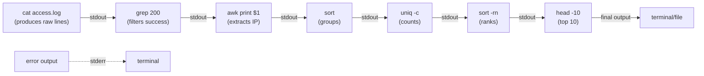
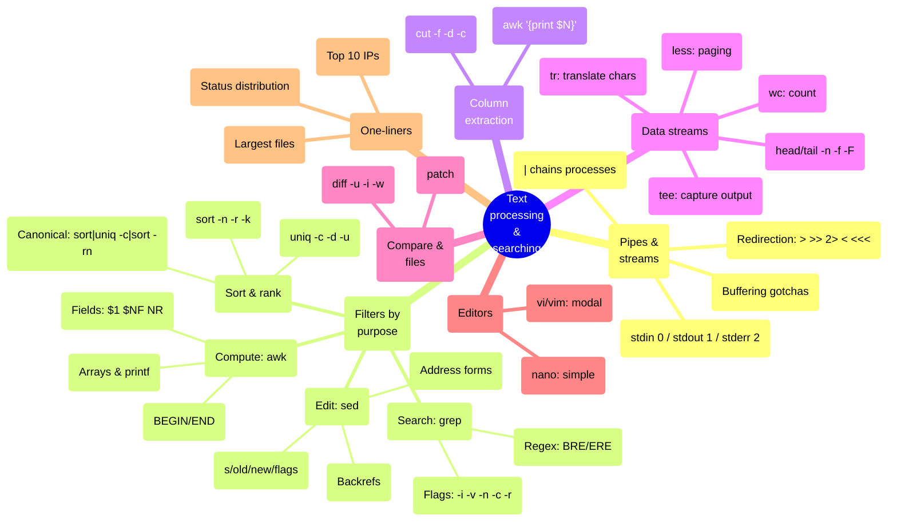

## 1 · The Big Picture

Every line of text you will ever process on Linux — a log file, a CSV row, a configuration option, an API response, the output of another command — flows through the same pipeline. You do not write programs to transform text; you compose *filters* — small, single-purpose tools — using pipes.

This is the **Unix philosophy**, and it is not nostalgia. When you have 100 GB of logs and need the top 10 IP addresses, you do not open an IDE. You write a one-liner. When you need to find all TODO comments in your codebase before a release, you grep. When you need to reformat 50,000 configuration lines at 2 a.m., you sed.

The tools in this chapter are the ones that make that possible. They are also the ones you will use most frequently in production, because text is how Unix *speaks*. Logs are text, configs are text, input from users is text, the output of every command is text.

### Where you will encounter it

| Context | Why text processing matters |
|---|---|
| Debugging production logs | Find errors, extract timings, count occurrences, rank by frequency |
| Infrastructure automation | Extract fields from API responses or config files, reformat for injection into the next tool |
| Data engineering | Sort, deduplicate, merge, filter multi-million-line datasets without loading into memory |
| Security audits | Search for patterns (hardcoded credentials, dangerous permissions, insecure protocols) |
| CI/CD pipelines | Parse test output, extract build metadata, generate reports |
| Performance analysis | Aggregate metrics, compute histograms, find outliers |

### Why companies care

- **Speed.** A one-liner completes in milliseconds; loading a file into Excel takes minutes and crashes on >1M rows.
- **Reproducibility.** A command is a text recipe you can check into Git, run on CI, and hand to the on-call engineer at 3 a.m.
- **No licensing.** These tools are built in; no IDE or data tool subscription.
- **Works everywhere.** Container, cloud VM, embedded device, Docker image — the same commands work identically.

---

## 2 · Intuition First: Pipes and Streams

Before you learn the commands, you must understand the mental model they operate within.

### The Unix pipeline as a factory floor

Imagine a factory where raw materials enter one end and finished goods leave the other. Between them are stations, each doing one transformation:

```diagram title="A Unix pipeline as a factory"
Raw material          Station 1 filters        Station 2 selects        Station 3 sorts
       ↓                  out defects               key data                 by size
       │                      │                        │                         │
┌──────────────┐        ┌──────────────┐        ┌──────────────┐        ┌──────────────┐
│ Input        │───────→│ grep errors  │───────→│ awk fields   │───────→│ sort -n      │
│ 100,000 lines│        │ (removes OK) │        │ (keep 2 cols)│        │ (rank by $1) │
└──────────────┘        └──────────────┘        └──────────────┘        └──────────────┘
                               ↓                        ↓                         ↓
                          2,000 lines              2,000 lines              2,000 lines
```

Each tool does one job well. Together they are more powerful than any single tool.

### Streams, file descriptors, and redirection

Every process has three **standard streams**:

| Name | Symbol | FD | Default | Use |
|---|---|---|---|---|
| **stdin** | `<` | 0 | keyboard | input to a command |
| **stdout** | `>` or `>>` | 1 | screen | normal output |
| **stderr** | `2>` | 2 | screen | errors, warnings, diagnostics |

The shell's **redirection operators** connect these streams:

```bash
command > file           # redirect stdout to a file (overwrite)
command >> file          # redirect stdout to a file (append)
command 2> errors.txt    # redirect stderr only
command 2>&1             # redirect stderr to wherever stdout goes
command &> file          # redirect both stdout and stderr (bash shorthand)
command < input.txt      # read stdin from a file
command <<< "text"       # here-string: treat the string as stdin
cat /dev/null            # redirect stdout to nowhere; /dev/null is a black hole
```

The **pipe** `|` chains commands — the stdout of the left side becomes the stdin of the right side:

```bash
cat /var/log/syslog | grep ERROR | wc -l
  ↓ stdout             ↓ stdin    ↓ stdout  ↓ stdin
  produces lines       filters   produces  counts
                       them      count
```

### A complete pipeline walkthrough

You have a web server access log. You need the 10 IP addresses that generated the most requests.

```console
$ cat access.log | grep "200 OK" | awk '{print $1}' | sort | uniq -c | sort -rn | head -10
              │                   │                 │     │      │        │        │
              produce raw lines   filter success    extract  group  count  sort     take
                                  codes             IP       like  each   by      top 10
                                                    address   IPs   group  count
```

This works because:

1. Each tool accepts a stream on stdin
2. Each tool produces a stream on stdout
3. The next tool consumes that stdout as its stdin
4. No intermediate files touch the disk — all in RAM

This is why pipelines scale to billions of lines. This is the Unix philosophy.

---

## 3 · Technical Definitions

**Stream.** An ordered sequence of bytes, usually organised into lines separated by newline characters (`\n`). Can come from a file, stdin, or another process.

**Filter.** A program that reads from stdin, transforms data, and writes to stdout. Designed to be the middle of a pipeline.

**File descriptor.** A non-negative integer (0, 1, 2, 3 ...) that represents an open file, pipe or socket from a process's perspective. POSIX reserves 0, 1, 2 for stdin, stdout, stderr. A process can have up to (typically) 1024 open descriptors at once.

**Buffering.** The OS or program holds data temporarily before sending it. **Line buffering** flushes on `\n`; **full buffering** waits until a buffer fills; **unbuffered** sends immediately. This matters in pipes — see tail's `-F` flag.

**Regular expression (regex).** A pattern that matches strings. Supports literals (`cat`), wildcards (`.` means any char, `*` means zero or more), character classes (`[a-z]`), anchors (`^` start, `$` end), and more. There are two dialects: **BRE** (Basic Regular Expression, used by `grep`, `sed` by default) and **ERE** (Extended, used by `grep -E`, `egrep`). Modern PCRE (Perl-Compatible Regular Expressions) is a superset, used by `ripgrep` and some tools.

**Exit code (return value).** A number (typically 0–255) a program returns when it exits. `0` means success; any other value signals failure. Commands in pipes can check this — `grep` returns 0 if a match was found, 1 if not, 2 if there was an error.

---

## 4 · Internal Working: The Pipe Buffer and Buffering Gotchas

### How a pipe actually works

When you run `command1 | command2`:

1. The shell creates a **pipe** — a buffer inside the kernel, typically 64 KB on Linux.
2. Command1's stdout is connected to the pipe's write end.
3. Command2's stdin is connected to the pipe's read end.
4. Command1 writes; command2 reads.
5. If the pipe fills (command1 is fast, command2 is slow), command1 blocks.
6. If the pipe empties (command2 is fast), command2 blocks waiting for data.
7. When command1 exits, the read end sees EOF, and command2 finishes.

```diagram title="How a pipe connects two processes"
┌─────────────────────────────────────┐
│  Process 1 (e.g. cat)               │
│  stdout fd 1 ──→ [PIPE 64KB buffer] │
│                       │             │
│  blocking write if    │ ← blocking  │
│  buffer fills         ↓   read if   │
└─────────────────────────────────────┘  buffer empty
       ↑                 ↑
       └─────────────────┴──────────────────────────────────┐
                                                             │
                                                    ┌────────┴────────┐
                                                    │ Process 2      │
                                                    │ (e.g. grep)    │
                                                    │ stdin fd 0     │
                                                    └────────────────┘
```

### The buffering gotcha: tail -F followed by grep

You want to monitor logs in real time:

```bash
tail -F /var/log/app.log | grep ERROR
```

You expect: new lines appear immediately.

You get: nothing for 10 seconds, then a flood.

**Why:** `grep` sees stdin is not a terminal, so it switches to full buffering. It holds 64 KB of data before flushing. Meanwhile, `tail -F` is publishing lines one by one, but they sit in the buffer.

**Fix:** Tell `grep` to line-buffer:

```bash
tail -F /var/log/app.log | grep --line-buffered ERROR
```

Or use `sed` instead (line-buffers by default):

```bash
tail -F /var/log/app.log | sed -n '/ERROR/p'
```

---

## 5 · Real Examples: From Simple to Production

### Simple: count lines, words, characters

```console
$ echo -e "hello world\nfoo bar" | wc -l
2
$ echo -e "hello world\nfoo bar" | wc -w
4
$ echo -e "hello world\nfoo bar" | wc -c
21
```

### Intermediate: extract and rank

A web server log. Find the top 5 most-requested paths:

```console
$ cat /var/log/nginx/access.log | awk '{print $7}' | sort | uniq -c | sort -rn | head -5
    3421 /api/users
    2891 /api/products
    1205 /health
     942 /admin
     512 /static/app.js
```

### Production: detect anomalies in metrics

System metrics CSV: timestamp, CPU, memory, disk. Alert if CPU > 80% for 3+ consecutive minutes.

```console
$ cat metrics.csv | \
  awk -F, '$2 > 80' | \
  awk '{print $1}' | \
  uniq -c | \
  awk '$1 >= 3 {print "ALERT: CPU high for " $1 " minutes"}'
```

### Cloud: parsing a JSON log stream

CloudWatch, Stackdriver or any JSON log. Extract error count per service:

```console
$ cat logs.json | \
  grep '"level":"ERROR"' | \
  sed 's/.*"service":"\([^"]*\)".*/\1/' | \
  sort | uniq -c | sort -rn
```

---

## 6 · Practical Demonstration: Commands in Full

### cat — concatenate and display

**Purpose:** Display file contents, concatenate files, stream data through pipes, produce text for redirection.

```bash
cat file.txt                  # display one file
cat file1.txt file2.txt       # concatenate two files
cat << 'EOF'                  # here-document: read until EOF marker
This is a multi-line string.
EOF
cat /dev/null                 # common: redirect stdout to nowhere
```

**All important options:**

| Flag | Effect | Example |
|---|---|---|
| `-n` | Number all lines | `cat -n file.txt` → `1 line1`, `2 line2` |
| `-b` | Number non-blank lines only | `cat -b file.txt` → skips blank lines in numbering |
| `-s` | Squeeze multiple blank lines into one | `cat -s file.txt` → `\n\n\n` becomes `\n` |
| `-A` | Show non-printing characters: `^I` tab, `$` EOL, `^M` CR | `cat -A file.txt` → reveals hidden whitespace |
| `-v` | Show non-printing characters, except tabs and newlines | `cat -v file.txt` |
| `-e` | Same as `-v` except tabs shown, line ends marked with `$` | `cat -e file.txt` |
| `-t` | Same as `-A` except non-printing chars not shown, tabs as `^I` | `cat -t file.txt` |

**CRLF (Windows line endings) demonstration:**

Files created on Windows have `\r\n` (carriage return + line feed) instead of `\n`:

```console
$ printf "line1\r\nline2\r\n" > windows.txt
$ cat windows.txt | od -c      # od shows raw bytes
0000000   l   i   n   e   1  \r  \n   l   i   n   e   2  \r  \n
$ cat -A windows.txt           # -A shows non-printing chars
line1^M$
line2^M$
```

Convert with `dos2unix` or `sed 's/\r$//'`:

```bash
sed 's/\r$//' windows.txt > unix.txt
```

**Useless cat — an anti-pattern:**

```bash
cat file.txt | grep pattern    # WRONG: unnecessary cat
grep pattern file.txt          # RIGHT: grep can read files directly

cat file.txt | wc -l           # WRONG: cat then pipe to wc
wc -l file.txt                 # RIGHT: wc can read files
```

Use `cat` only when you actually need to concatenate or when the input is stdin (e.g. `docker logs | cat`).

**Related commands:**

- `tac` — reverse cat, print lines in reverse order
- `less` / `more` — paged viewing (next)
- `bat` — cat with syntax highlighting (modern alternative, outside the core)
- `zcat` — cat for gzip files without decompressing first: `zcat file.gz`

```console
$ echo -e "line1\nline2\nline3" | tac
line3
line2
line1
```

### less — interactive pager

**Purpose:** View large files without loading them all into memory, with searching and navigation.

```bash
less /var/log/syslog          # open file for paging
less +F /var/log/syslog       # follow mode (like tail -f), q to exit
ps aux | less                 # pipe output to pager
```

**Commands inside less** (not bash, these are `less`-specific):

| Key | Action | Use case |
|---|---|---|
| `space` | Next page | navigation |
| `b` | Previous page | go back |
| `/pattern` | Search forward | find "ERROR" |
| `?pattern` | Search backward | find "ERROR" going up |
| `n` | Next search match | keep finding |
| `N` | Previous search match | go to prior match |
| `g` | Go to start of file | top of file |
| `G` | Go to end of file | bottom of file |
| `q` | Quit | exit |
| `-N` | Toggle line numbers | `less -N file` to start with them |
| `-S` | Chop long lines (no wrapping) | `less -S file` — useful for wide output |
| `-i` | Case-insensitive search | `less -i file` |
| `+F` | Follow mode (tail -f behavior) | start in follow |

```console
$ less -N /var/log/syslog     # start with line numbers visible
     1   [some log line]
     2   [error line here]
```

### head — show the first N lines

**Purpose:** Display the first lines of a file or stream. Default: 10 lines.

```bash
head -n 20 file.txt           # first 20 lines
head -c 100 file.txt          # first 100 bytes (characters)
head -n -10 file.txt          # all except the last 10 lines (negative form)
cat file.txt | head            # first 10 lines of stdin
head -q file1 file2           # no header separating files
head -v file.txt              # print filename header even if one file
```

**All options:**

| Option | Effect | Example |
|---|---|---|
| `-n N` | Print first N lines (default 10) | `head -n 5 file.txt` |
| `-c N` | Print first N bytes | `head -c 1024 file.txt` |
| `-q` | Quiet: no filenames printed when reading multiple | `head -q file1 file2` |
| `-v` | Verbose: always print filename | `head -v file.txt` |
| `-N -10` | Negative: all except last 10 lines | `head -n -10 file.txt` |

### tail — show the last N lines

**Purpose:** Display the final lines of a file or stream. Default: 10 lines.

```bash
tail -n 20 file.txt           # last 20 lines
tail -c 100 file.txt          # last 100 bytes
tail -f file.txt              # follow: print new lines as they are appended
tail -F file.txt              # follow even if file is rotated (robust)
tail +N file.txt              # start from line N onward (old syntax)
tail --pid=<PID> -f file.txt  # stop following when PID exits
```

**All options and their purposes:**

| Option | Purpose | Example | Production use |
|---|---|---|---|
| `-n N` | Print last N lines (default 10) | `tail -n 50 file.txt` | Review recent logs |
| `-c N` | Print last N bytes | `tail -c 1024 file.txt` | Get tail of a binary or large file |
| `-f` | Follow: keep showing new lines | `tail -f /var/log/app.log` | Monitor logs (stops when file is deleted) |
| `-F` | Follow file by name, reopen if rotated | `tail -F /var/log/app.log` | **Better for production** (handles logrotate) |
| `+N` | Start from line N (not `-n`, just `+N`) | `tail +100 file.txt` | Skip first 99 lines |
| `--pid=<PID>` | Stop `-f`/`-F` when a process exits | `tail -f file.txt --pid=$$` | Debugging: follow a log while a script runs |

**Why `-F` is better than `-f` in production:**

Log rotation is standard: `logrotate` renames `/var/log/app.log` to `/var/log/app.log.1`, and the app starts writing to a new `/var/log/app.log`.

- `tail -f` keeps the file descriptor open to the old *inode*, so you stop seeing new logs
- `tail -F` re-opens by name, so it follows the rotation correctly

```bash
tail -f /var/log/syslog &
# [PID 1234]
sleep 5; kill 1234            # This unblocks tail, but could be in the middle of reading
# Better:
tail -f /var/log/syslog --pid=$$ &
# tail stops gracefully when this shell exits
```

**Pipe buffering gotcha — revisited:**

```bash
tail -F /var/log/app.log | grep ERROR    # buffering delay!
tail -F /var/log/app.log | sed -n '/ERROR/p'  # line-buffered, faster
```

### grep — filter lines matching a pattern

**Purpose:** Select (or reject) lines matching a pattern. **This is the tool you will use most in production.**

```bash
grep "ERROR" /var/log/syslog                    # lines containing ERROR
grep "^Error:" file.txt                         # lines starting with Error:
grep "[0-9]\{3\}\.[0-9]\{3\}" file.txt          # lines with IP-like patterns (BRE)
grep -E "[0-9]{3}\.[0-9]{3}" file.txt           # same, ERE (extended regex)
grep -v "DEBUG" file.txt                        # lines NOT containing DEBUG
grep -c "ERROR" file.txt                        # count matches
grep -r "TODO" .                                # recurse: search all files in directory
grep -i "error" file.txt                        # case-insensitive
```

#### Regular expression fundamentals (taught from zero)

Most beginners are overwhelmed by regex. Here is the mental model: **a regex is a template for a shape of text.**

**Literals — the simplest regex:**

```
cat          matches:  "cat", "concatenate", "wildcat"
             does NOT: "CAT" (unless -i), "ca", "cot"
```

**The `.` metacharacter — "any single character":**

```
c.t          matches:  "cat", "cot", "c1t", "c t"
             does NOT: "ct", "coat"
```

**The `*` quantifier — "zero or more of the previous thing":**

```
ca*t         matches:  "ct" (zero a's), "cat", "caat", "caaaat"
             does NOT: "cart"
```

**The `+` quantifier — "one or more" (ERE only, or BRE `\+`):**

```
ca+t         matches:  "cat", "caat", "caaat"
             does NOT: "ct"
```

**The `?` quantifier — "zero or one":**

```
colou?r      matches:  "color", "colour"
             does NOT: "colouur"
```

**Character classes — `[abc]` means "a or b or c":**

```
[aeiou]      matches:  "a", "e", "i", "o", "u"
[0-9]        matches:  any single digit
[a-zA-Z]     matches:  any single letter (lower or upper)
[^aeiou]     matches:  any character EXCEPT vowels (^ inside [] means NOT)
```

**Anchors:**

```
^ERROR       matches:  "ERROR" only at the start of a line
ERROR$       matches:  "ERROR" only at the end of a line
^ERROR$      matches:  a line containing ONLY "ERROR"
```

**Word boundaries (ERE or with `-E`):**

```
\berror\b    matches:  "error" as a whole word, not "errorfield"
             (BRE: `\berror\b`, ERE: `\berror\b`)
```

**Groups and alternation:**

```
(cat|dog)    matches:  "cat" or "dog"
(gr[ae]y)    matches:  "gray" or "grey"
```

**Greedy vs lazy matching:**

```
.*txt        matches:  "anything.txt" (greedy, takes as much as possible)
.*?txt       matches:  the shortest string ending in "txt" (lazy, needs PCRE)
```

**Escaping metacharacters:**

```
\.           matches:  a literal dot, not "any character"
\$           matches:  a literal dollar sign
\[           matches:  a literal [
```

**BRE vs ERE — the difference:**

In **BRE** (Basic Regular Expression, default `grep`):

```
grep "a\+b" file      # \+ means one or more (escaped)
grep "a*b" file       # * means zero or more (unescaped)
grep "(abc)" file     # () are literal parens; \(\) are groups
```

In **ERE** (Extended, `grep -E` or `egrep`):

```
grep -E "a+b" file    # + means one or more (unescaped)
grep -E "a*b" file    # * means zero or more
grep -E "(abc)" file  # () are groups (unescaped)
```

**Regex reference table:**

| Pattern | Meaning | Example | BRE / ERE |
|---|---|---|---|
| `.` | Any single character | `c.t` → cat, cot, c1t | both |
| `*` | Zero or more | `ca*t` → ct, cat, caat | both |
| `+` | One or more | `ca+t` → cat, caat | ERE: `a+`, BRE: `a\+` |
| `?` | Zero or one | `colou?r` → color, colour | ERE: `u?`, BRE: `u\?` |
| `[abc]` | Any of a, b, c | `[aeiou]` → vowels | both |
| `[^abc]` | Not a, b, c | `[^0-9]` → non-digit | both |
| `^` | Start of line | `^ERROR` | both |
| `$` | End of line | `ERROR$` | both |
| `\b` / `\<` `\>` | Word boundary | `\bcat\b` | both (in BRE, may need `-E` in some implementations) |
| `(...)` | Grouping | `(cat\|dog)` in BRE; `(cat\|dog)` in ERE | BRE: `\(...)`, ERE: `(...)` |
| `\|` | Alternation (OR) | `cat\|dog` in BRE; `cat\|dog` in ERE | BRE: `\|`, ERE: `\|` |
| `{n}` | Exactly n | `a{3}` → aaa | BRE: `a\{3\}`, ERE: `a{3}` |
| `{n,m}` | Between n and m | `a{2,4}` → aa, aaa, aaaa | BRE: `a\{2,4\}`, ERE: `a{2,4}` |

#### All important grep flags

| Flag | Purpose | Example |
|---|---|---|
| `-i` | Case-insensitive | `grep -i "error" file.txt` |
| `-v` | Invert: lines that do NOT match | `grep -v "DEBUG" file.txt` |
| `-n` | Print line numbers | `grep -n "ERROR" file.txt` → `42:ERROR message` |
| `-c` | Count matches (not matched lines) | `grep -c "ERROR" file.txt` → `150` |
| `-l` | List filenames that match (not the lines themselves) | `grep -l "TODO" *.py` |
| `-L` | List filenames that do NOT match | `grep -L "TODO" *.py` |
| `-r` | Recurse into directories | `grep -r "TODO" .` |
| `-R` | Recurse and follow symlinks | `grep -R "config" /etc` |
| `-w` | Match whole words only | `grep -w "cat" file.txt` (not "concatenate") |
| `-x` | Match entire lines only | `grep -x "exact line" file.txt` |
| `-e pattern` | Specify a pattern (useful for patterns starting with `-`) | `grep -e "-v" file.txt` |
| `-f file` | Read patterns from a file (one per line) | `grep -f patterns.txt data.txt` |
| `-A N` | Print N lines after match | `grep -A 3 "ERROR" file.txt` |
| `-B N` | Print N lines before match | `grep -B 3 "ERROR" file.txt` |
| `-C N` | Print N lines before and after | `grep -C 2 "ERROR" file.txt` |
| `-o` | Print only the matched part | `grep -o "[0-9]*" file.txt` → just the numbers |
| `-q` | Quiet: no output, just exit code | `grep -q "ERROR" file.txt && echo found` |
| `-s` | Suppress error messages | `grep -s "pattern" /nonexistent 2>/dev/null` |
| `-h` | Suppress filename prefix when searching multiple files | `grep -h "pattern" file1 file2` |
| `-H` | Always show filename | `grep -H "pattern" file1` (useful in scripts) |
| `-m N` | Stop after N matches | `grep -m 10 "ERROR" file.txt` |
| `--include=GLOB` | Only search files matching glob | `grep -r --include="*.py" "TODO" .` |
| `--exclude=GLOB` | Skip files matching glob | `grep -r --exclude="*.o" "symbol" .` |
| `-E` | Extended regex (allows `+`, `?`, `()` unescaped) | `grep -E "error\|warning" file.txt` |
| `-F` | Fixed string (regex off, literal match) | `grep -F "." file.txt` (dot is literal, not any-char) |
| `-P` | Perl-compatible regex (if available) | `grep -P '\d+' file.txt` (PCRE features) |
| `-z` | Null-separated (instead of newline) | `grep -z "pattern" file` (for `find -print0`) |
| `--color` | Highlight matches in output | `grep --color "ERROR" file.txt` (default in some systems) |

#### Eight production examples

**1. Check if a service is running and get its PID:**

```console
$ ps aux | grep nginx
root       1234  0.1  0.2  12345  1000 ?  Ss  10:15  0:00  nginx: master
www-data   1235  0.0  0.3  12346  1500 ?  S   10:15  0:00  nginx: worker
www-data   1236  0.0  0.3  12346  1500 ?  S   10:15  0:00  nginx: worker
```

Extract just the master PID:

```bash
master_pid=$(ps aux | grep "nginx: master" | grep -v grep | awk '{print $2}')
echo "Nginx master is PID $master_pid"
```

(The `grep -v grep` removes the grep command itself from results.)

**2. Find all Python files containing a specific function call (audit):**

```bash
grep -r "os.system(" --include="*.py" /app/src
```

**3. Extract error counts by service from structured logs:**

```console
$ grep "level:ERROR" app.log | grep -o "service:[a-z]*" | sort | uniq -c
    342 service:auth
    128 service:database
     45 service:cache
```

**4. Find lines matching multiple patterns (AND logic):**

```bash
grep "ERROR" file.txt | grep "database"    # lines with both ERROR and database
```

**5. Find lines matching one of several patterns (OR logic):**

```bash
grep -E "ERROR|FATAL|CRITICAL" file.txt    # any of three
```

**6. Count how many times a pattern appears in a file (not line count):**

```bash
grep -o "pattern" file.txt | wc -l
# or
grep -co "pattern" file.txt
```

**7. Display context: show errors with 5 lines before and 3 after:**

```bash
grep -B 5 -A 3 "ERROR" /var/log/syslog
```

**8. Find all Apache access log lines with HTTP status 50x (server errors):**

```bash
grep " 50[0-9] " /var/log/apache2/access.log
```

#### grep vs egrep vs fgrep vs ripgrep

| Tool | Regex type | When to use | Example |
|---|---|---|---|
| `grep` | BRE (by default) | Standard, matches are unescaped | `grep "pattern" file` |
| `grep -E` | ERE | Alternation, groups without escaping | `grep -E "cat\|dog" file` |
| `egrep` | ERE | Same as `grep -E` (deprecated name) | `egrep "cat\|dog" file` |
| `grep -F` | Literal (no regex) | Literal strings, escaping unneeded | `grep -F "." file` |
| `fgrep` | Literal | Same as `grep -F` (deprecated name) | `fgrep "." file` |
| `ripgrep` (`rg`) | PCRE | **Modern, faster, better defaults** | `rg "pattern" /path` |

> [!PROD]
> In production and on modern systems, prefer `grep -E` over the deprecated `egrep`, and `grep -F` over `fgrep`. Better yet, use **ripgrep** (`rg`) if available — it is parallel, respects `.gitignore`, skips binary files by default, and has excellent syntax:
>
> ```bash
> rg "ERROR|FATAL" /var/log            # multiline output, colored
> rg -t py "TODO" src                  # search only Python files
> rg -w "pattern" /path                # whole-word match built in
> ```

### sed — stream editor

**Purpose:** Edit streams line by line. Transform text without opening an editor or storing in memory.

```bash
sed 's/old/new/' file.txt                 # substitute: first match per line
sed 's/old/new/g' file.txt                # substitute: all matches per line
sed -i.bak 's/old/new/g' file.txt         # edit file in place (backup as .bak)
sed -n '/pattern/p' file.txt              # print only lines matching pattern
sed '/pattern/d' file.txt                 # delete lines matching pattern
sed '2,5d' file.txt                       # delete lines 2–5
sed -e 's/old/new/' -e '/pattern/d' file.txt   # chain multiple edits
```

#### The sed `s` command (substitute)

**Basic syntax:** `sed 's/pattern/replacement/flags'`

```bash
sed 's/red/blue/' file.txt                # replace first "red" on each line
sed 's/red/blue/g' file.txt               # replace all "red" on each line
sed 's/red/blue/i' file.txt               # case-insensitive
sed 's/red/blue/p' file.txt               # print matching lines twice (with `-n`, print once)
sed 's/red/blue/w out.txt' file.txt       # write replacements to file
```

**Flags for `s`:**

| Flag | Meaning | Example |
|---|---|---|
| `g` | Global — all occurrences on the line | `s/x/y/g` |
| `p` | Print the matched line (use with `-n` for single output) | `sed -n 's/old/new/p' file` |
| `i` | Case-insensitive | `s/ERROR/error/i` |
| `e` | Execute the replacement as a shell command | `sed 's/.*/echo &/e'` (GNU sed) |
| `w file` | Write matched lines to file | `s/pattern/replacement/w out.txt` |
| Number (1–9) | Replace only the Nth occurrence on the line | `s/x/y/2` — second `x` only |

#### Address forms in sed

You can target which lines to edit:

| Address | Meaning | Example |
|---|---|---|
| `2,5` | Lines 2 through 5 | `sed '2,5d' file` |
| `2~3` | Every 3rd line starting from 2 | `sed '2~3s/x/y/'` |
| `/pattern/` | Lines matching pattern | `sed '/ERROR/s/x/y/'` |
| `1,/pattern/` | From line 1 to first match | `sed '1,/error/d'` |
| `!` | Negation: NOT matching | `sed '/DEBUG/!d'` — delete all but DEBUG lines |
| `$` | Last line | `sed '$s/x/y/'` |

#### Other sed commands

| Command | Purpose | Example |
|---|---|---|
| `d` | Delete | `sed '5d'` — delete line 5 |
| `p` | Print (use with `-n`) | `sed -n '5p'` — print line 5 only |
| `a` | Append (insert after) | `sed '/error/a ALERT'` — after lines with "error", add "ALERT" |
| `i` | Insert (before) | `sed '/error/i >>> '` — insert before lines with "error" |
| `c` | Change | `sed '5c NEW LINE'` — replace line 5 |
| `y` | Translate | `sed 'y/abc/xyz/'` — a→x, b→y, c→z (char by char) |
| `q` | Quit | `sed '5q'` — print first 5 lines, stop |
| `=` | Print line number | `sed '='` — prints line numbers before lines |

#### Examples

**Replace the PDF's example: `sed 's/red/blue/'`**

```console
$ echo "the red fox is red" | sed 's/red/blue/'
the blue fox is red
```

Only the first match is replaced. To replace all:

```console
$ echo "the red fox is red" | sed 's/red/blue/g'
the blue fox is blue
```

**Case-insensitive replacement:**

```console
$ echo "ERROR Error error" | sed 's/error/ALERT/gi'
ALERT ALERT ALERT
```

**Delete all blank lines:**

```bash
sed '/^$/d' file.txt
```

**Print only lines matching a pattern:**

```bash
sed -n '/ERROR/p' /var/log/app.log
```

**Insert a line before every match:**

```bash
sed '/^$/i NEW LINE' file.txt      # before every blank line, insert "NEW LINE"
```

**Backreferences: extract and reorder fields**

```console
$ echo "Smith, John" | sed 's/\([^,]*\), \(.*\)/\2 \1/'
John Smith
```

`\1` is the first captured group, `\2` is the second. This requires:
- BRE: `\(` and `\)` for groups
- ERE / `sed -E`: `(` and `)` for groups

```bash
sed -E 's/([^,]*), (.*)/\2 \1/' # same, with -E (extended regex)
```

#### BSD vs GNU sed gotcha

macOS ships BSD `sed`, which has different flag support:

| Operation | GNU sed | BSD sed |
|---|---|---|
| In-place edit | `sed -i file.txt` | `sed -i '' file.txt` (empty string required) |
| Extended regex | `sed -E` or `sed -r` | `sed -E` |
| Example | `sed -i 's/x/y/g' file` | `sed -i '' 's/x/y/g' file` |

> [!WARNING]
> This is a classic gotcha in scripts that run on multiple systems. Use `sed -i '' -e 's/x/y/g'` for portability (both accept this), or check `uname -s` and use different commands per OS.

### awk — columnar data and calculations

**Purpose:** Process structured data (fields in rows), extract columns, compute sums/averages, build reports.

**Mental model first:** awk sees a file as rows of records, each split into fields. By default, fields are separated by whitespace (spaces or tabs), and each row is a line. You define actions to run on matching patterns.

```bash
awk '{print $1, $3}' data.txt              # print fields 1 and 3 of each line
awk '$3 > 100 {print $1}' data.txt         # print field 1 where field 3 > 100
awk 'BEGIN {sum=0} {sum+=$1} END {print sum}' data.txt   # sum column 1
awk -F, '{print $2}' data.csv              # CSV: use comma as field separator
```

#### awk fundamentals

| Component | Meaning | Example |
|---|---|---|
| `$0` | The entire line | `{print $0}` → print whole line |
| `$1, $2, $3...` | Field 1, 2, 3... | `{print $2}` → second field |
| `$NF` | The last field | `{print $NF}` → print last column |
| `NR` | Number of records (line number) | `{print NR, $0}` → line number, then line |
| `NF` | Number of fields in this line | `{print NF}` → how many columns |
| `FNR` | Record number in current file | `{print FNR}` → useful with multiple files |
| `FS` | Field separator (default: space/tab) | `awk -F: '{print $1}' /etc/passwd` |
| `OFS` | Output field separator (default: space) | `{print $1, $2, $3}` — uses OFS between fields |
| `BEGIN` | Run before reading any input | `BEGIN {print "Header"}` |
| `END` | Run after all input is read | `END {print "Total:", sum}` |
| Pattern | Condition to match | `$3 > 100` or `/error/` |
| Action | Code to run if pattern matches | `{print $1}` |

#### awk variables, arrays, and printf

```bash
# Variables (no declaration needed)
awk 'BEGIN {x=5; y=10; print x+y}'        # arithmetic

# Arrays
awk '{count[$1]++} END {for (key in count) print key, count[key]}' # count occurrences of field 1

# printf (C-style formatting)
awk '{printf "%-20s %10d\n", $1, $2}'     # left-aligned string, right-aligned number

# Common printf formats
%s      string
%d      integer
%f      float (6 decimals by default)
%5.2f   float: 5 chars wide, 2 decimals
%-10s   left-aligned string in 10-char field
%10s    right-aligned string in 10-char field
```

#### Dissecting a complex awk example (from the PDF)

Imagine this is in the PDF: count HTTP status codes from a web log, sorted by frequency.

```bash
awk '{print $9}' access.log | sort | uniq -c | sort -rn
```

Breaking it down:
- `awk '{print $9}'` → extract field 9 (HTTP status code) from each line of the log
- `sort` → group identical status codes together
- `uniq -c` → count consecutive groups
- `sort -rn` → sort by count, descending

Even better with awk directly:

```bash
awk '{status[$9]++} END {for (s in status) print status[s], s}' access.log | sort -rn
```

- `awk '{status[$9]++}'` → build a "status" array, incrementing the count for each status code
- `END {for (s in status) ...}` → after all input, loop through the array and print
- `sort -rn` → sort by count, descending

### sort — arrange lines

**Purpose:** Sort lines in various orders: numeric, alphabetic, by column, reverse.

```bash
sort file.txt                         # sort alphabetically
sort -n file.txt                      # numeric sort (1, 2, 10 — not 1, 10, 2)
sort -r file.txt                      # reverse
sort -k2 file.txt                     # sort by column 2 (field 2)
sort -t, -k3 data.csv                 # CSV: sort by column 3
sort -u file.txt                      # unique: remove duplicate lines
sort -h file.txt                      # human-readable (1K, 1M, 1G order)
```

**All important options:**

| Option | Effect | Example |
|---|---|---|
| `-n` | Numeric sort | `sort -n ages.txt` |
| `-r` | Reverse | `sort -r file.txt` |
| `-k N` | Sort by field N | `sort -k 3 data.txt` |
| `-k N1,N2` | Sort by fields N1–N2 | `sort -k2,5 data.txt` |
| `-t SEP` | Field separator | `sort -t, -k2 data.csv` |
| `-u` | Unique: remove duplicates | `sort -u file.txt` |
| `-h` | Human-readable sizes (1K, 1M) | `sort -h sizes.txt` |
| `-f` | Case-insensitive | `sort -f file.txt` |
| `-b` | Ignore leading whitespace | `sort -b file.txt` |
| `-V` | Version sort (1.10 after 1.9) | `sort -V versions.txt` |
| `-o file` | Output to file (not stdout) | `sort data.txt -o sorted.txt` |
| `-c` | Check if already sorted (exit code) | `sort -c file.txt && echo sorted` |
| `-R` | Random order | `sort -R file.txt` |
| `--parallel` | Use N threads (GNU) | `sort --parallel=4 large.txt` |
| `-S size` | Set buffer size | `sort -S 1G large.txt` |
| `-LC_ALL=C` | Byte-order sort (fastest) | `LC_ALL=C sort file.txt` |

#### The canonical pattern: count, sort, rank

To find the top 10 most common items:

```bash
sort file.txt | uniq -c | sort -rn | head -10
```

**Why it works:**

1. `sort` — group identical lines
2. `uniq -c` — count each group
3. `sort -rn` — sort by count, highest first
4. `head -10` — take top 10

### uniq — detect or remove duplicate adjacent lines

**Purpose:** Remove (or count) consecutive duplicate lines. **Important: uniq only sees adjacent duplicates.**

```bash
uniq file.txt                         # remove consecutive duplicate lines
uniq -c file.txt                      # count consecutive groups
uniq -d file.txt                      # show only duplicates
uniq -u file.txt                      # show only unique lines (appear once)
uniq -i file.txt                      # case-insensitive
```

**All options:**

| Option | Effect | Example |
|---|---|---|
| `-c` | Count consecutive groups | `uniq -c file.txt` → `3 line` `2 line2` |
| `-d` | Show only lines that appear more than once | `uniq -d file.txt` |
| `-u` | Show only unique lines | `uniq -u file.txt` |
| `-i` | Case-insensitive | `uniq -i file.txt` |
| `-f N` | Skip first N fields | `uniq -f 1 file.txt` |
| `-w N` | Compare only first N characters | `uniq -w 5 file.txt` |

**The adjacent-only rule (critical!):**

```console
$ echo -e "a\nb\na" | uniq
a
b
a
# Because the two "a"s are NOT adjacent, both are printed.
```

To deduplicate *all* duplicates (not just adjacent), sort first:

```console
$ echo -e "a\nb\na" | sort | uniq
a
b
```

**The canonical pattern (top 10 IPs):**

```bash
cat access.log | awk '{print $1}' | sort | uniq -c | sort -rn | head -10
```

### cut — extract columns

**Purpose:** Select columns from lines of text.

```bash
cut -f 2,4 file.txt                   # extract fields 2 and 4 (default sep: tab)
cut -d, -f 2 data.csv                 # CSV: extract field 2
cut -c 1-10 file.txt                  # extract first 10 characters
cut -d: -f1 /etc/passwd               # extract usernames (field 1, sep :)
```

**All options:**

| Option | Effect | Example |
|---|---|---|
| `-f N` | Extract field N | `cut -f 3 file.txt` |
| `-f N1,N2` | Extract fields N1 and N2 | `cut -f 1,3 file.txt` |
| `-f N1-N2` | Extract fields N1 through N2 | `cut -f 2-5 file.txt` |
| `-f N-` | Extract from field N to end | `cut -f 3- file.txt` |
| `-d SEP` | Field delimiter (default: tab) | `cut -d, -f 2 data.csv` |
| `-c N` | Extract character N | `cut -c 5 file.txt` |
| `-c N1-N2` | Extract characters N1 through N2 | `cut -c 1-10 file.txt` |
| `-b N` | Extract byte N (for multibyte chars) | `cut -b 1-5 file.txt` |
| `--complement` | Invert: all fields EXCEPT specified | `cut -d, -f 2 --complement data.csv` |
| `--output-delimiter` | Different output delimiter | `cut -d: -f1,3 --output-delimiter=' ' /etc/passwd` |

**Limitation: repeated delimiters**

If fields are separated by multiple spaces (not a single delimiter), `cut` sees them as one:

```console
$ echo "a    b    c" | cut -d' ' -f 2     # cut treats "    " as one delimiter
b

# Use awk instead:
$ echo "a    b    c" | awk '{print $2}'
b
```

### tr — translate or delete characters

**Purpose:** Replace characters or delete them.

```bash
tr 'a-z' 'A-Z' < file.txt             # lowercase to uppercase
tr -d '0-9' < file.txt                # delete all digits
tr -s ' ' < file.txt                  # squeeze multiple spaces into one
tr -c -d '[:alpha:]' < file.txt       # delete all non-alphabetic
```

**All options:**

| Option | Effect | Example |
|---|---|---|
| `-d` | Delete characters | `tr -d '0-9' < file` |
| `-s` | Squeeze repeated characters into one | `tr -s ' ' < file` |
| `-c` | Complement: operate on non-matching chars | `tr -c -d '0-9'` — delete non-digits |

**Character classes:**

```
[:alpha:]     a-z A-Z
[:digit:]     0-9
[:alnum:]     a-z A-Z 0-9
[:space:]     space, tab, newline
[:upper:]     A-Z
[:lower:]     a-z
[:punct:]     punctuation
```

Examples:

```bash
tr '[:lower:]' '[:upper:]' < file.txt    # lowercase to uppercase (like tr 'a-z' 'A-Z')
tr -d '[:digit:]' < file.txt             # delete all digits
echo "one    two" | tr -s ' '            # "one two" (squeeze spaces)
```

### wc — word, line, character count

**Purpose:** Count lines, words, characters (or bytes) in a file or stream.

```bash
wc -l file.txt                        # count lines
wc -w file.txt                        # count words
wc -c file.txt                        # count bytes
wc -m file.txt                        # count characters (UTF-8 aware)
wc -L file.txt                        # length of longest line
```

**All options:**

| Option | Effect | Example | Output |
|---|---|---|---|
| `-l` | Lines | `wc -l file.txt` | `42 file.txt` |
| `-w` | Words | `wc -w file.txt` | `256 file.txt` |
| `-c` | Bytes | `wc -c file.txt` | `1234 file.txt` |
| `-m` | Characters (multibyte UTF-8 aware) | `wc -m file.txt` | `1234 file.txt` |
| `-L` | Length of longest line | `wc -L file.txt` | `80 file.txt` |

**Off-by-one gotcha: no trailing newline**

If a file has no final newline, `wc -l` counts one less than you expect:

```console
$ printf "line1\nline2" > no_newline.txt  # no \n at end
$ wc -l no_newline.txt
1 no_newline.txt    # reports 1 line, but there are 2 logical lines!
```

Fix: check the file:

```bash
cat no_newline.txt | od -c         # shows no final \n
```

### diff — compare files

**Purpose:** Show differences between two files. Produce a patch.

```bash
diff file1.txt file2.txt                          # show differences
diff -u file1.txt file2.txt                       # unified diff (most readable)
diff -c file1.txt file2.txt                       # context diff (older style)
diff -y file1.txt file2.txt                       # side-by-side
diff -r dir1 dir2                                 # compare directories recursively
diff -i file1.txt file2.txt                       # ignore case
diff -w file1.txt file2.txt                       # ignore whitespace differences
diff -b file1.txt file2.txt                       # ignore space changes
diff -B file1.txt file2.txt                       # ignore blank lines
diff -q file1.txt file2.txt                       # quiet (just show if different)
```

**All important options:**

| Option | Effect | Example |
|---|---|---|
| `-u` | Unified diff (readable, for patches) | `diff -u old new > file.patch` |
| `-c` | Context diff | `diff -c old new` |
| `-i` | Ignore case | `diff -i file1 file2` |
| `-w` | Ignore all whitespace | `diff -w file1 file2` |
| `-b` | Ignore space quantity | `diff -b file1 file2` |
| `-B` | Ignore blank lines | `diff -B file1 file2` |
| `-r` | Recurse directories | `diff -r dir1 dir2` |
| `-q` | Quiet | `diff -q file1 file2` — just "differ" or not |
| `-y` | Side-by-side | `diff -y file1 file2` |
| `--color` | Highlight differences | `diff --color file1 file2` |

**Reading unified diff output:**

```
--- file1
+++ file2
@@ -1,3 +1,4 @@
 line 1 (unchanged)
-old line 2
+new line 2
 line 3 (unchanged)
+new line 4
```

- `---` / `+++` — files being compared
- `@@ -1,3 +1,4 @@` — hunk header: file1 lines 1–3, file2 lines 1–4
- ` ` (space) — unchanged
- `-` — in file1, not in file2
- `+` — in file2, not in file1

**Applying a patch:**

```bash
patch file1.txt < file.patch          # apply patch to file1
patch -p0 < file.patch                # adjust path depth
```

**Other tools for comparison:**

- `patch file.patch` — apply patches
- `diff3` — three-way comparison
- `vimdiff file1 file2` — side-by-side in vim
- `meld dir1 dir2` — GUI diff/merge tool

### tee — read stdin, write to stdout and a file

**Purpose:** Capture output while also passing it through a pipeline.

```bash
cat data.txt | tee output.txt | wc -l       # save and count in one pipeline
command | tee -a log.txt | grep pattern     # append to log, then filter
sudo tee /etc/config.txt < temp.txt         # write to root-owned file
```

**All options:**

| Option | Effect | Example |
|---|---|---|
| `-a` | Append (don't overwrite) | `tee -a log.txt` |
| `-i` | Ignore SIGINT | `tee -i output.txt` |
| `-p` | Diagnose write errors | `tee -p file.txt` |

**The `sudo tee` pattern:**

To write to a file you don't own (e.g., `/etc/config`):

```bash
echo "new config" | sudo tee /etc/config > /dev/null
```

Why:
- `echo` runs as your user
- `sudo` elevates `tee`'s privilege
- `tee` writes to the protected file
- `> /dev/null` suppresses the stdout (we only care about the file write)

### echo — print text

**Purpose:** Output a string or variable.

```bash
echo "hello"                          # print hello
echo "hello" "world"                  # prints: hello world (space-separated)
echo -n "no newline"                  # no trailing newline
echo -e "line1\nline2"                # interpret escape sequences
echo $HOME                            # print environment variable
```

**Escape sequences (the PDF specifies these correctly):**

| Sequence | Meaning |
|---|---|
| `\n` | newline |
| `\t` | tab |
| `\\` | backslash |
| `\a` | alert (bell) |
| `\0NNN` | octal character code (e.g., `\0101` is 'A') |

> [!WARNING]
> **Correcting the PDF:** The source notes state escape sequences are `\n \t \\ \a \0NNN` — which is correct. Do not invent others like `\r` (use `printf` instead).

**Example:**

```console
$ echo -e "name\tage"
name    age
$ echo -e "line1\nline2"
line1
line2
$ echo -e "Done\a"       # audible bell
```

### printf — formatted output

**Purpose:** Print with precise formatting (C-style).

```bash
printf "%-15s %10d\n" "Name" 42       # format string and arguments
printf "%s\n" item1 item2 item3       # print multiple items
printf "%.2f\n" 3.14159               # float with 2 decimals
```

**Format specifiers:**

| Specifier | Meaning | Example |
|---|---|---|
| `%s` | String | `printf "%s" "hello"` |
| `%d` | Signed integer | `printf "%d" 42` |
| `%f` | Float (6 decimals by default) | `printf "%f" 3.14` |
| `%5.2f` | Float: 5 chars wide, 2 decimals | `printf "%5.2f" 3.14` |
| `%-10s` | Left-aligned string in 10-char field | `printf "%-10s" "name"` |
| `%10s` | Right-aligned string in 10-char field | `printf "%10s" "name"` |
| `%x` | Hexadecimal | `printf "%x" 255` → `ff` |
| `%o` | Octal | `printf "%o" 8` → `10` |
| `%%` | Literal percent | `printf "50%%"` → `50%` |

**Example:**

```console
$ printf "%-15s %10d %6.2f\n" "Alice" 30 95.50
Alice          30  95.50
```

### nano — simple text editor

**Purpose:** Edit files interactively. Simple, beginner-friendly.

```bash
nano file.txt                         # open file for editing
```

**Key commands:**

| Key | Action |
|---|---|
| `Ctrl+O` | Write out (save) |
| `Ctrl+X` | Exit |
| `Ctrl+W` | Search |
| `Ctrl+K` | Cut line |
| `Ctrl+U` | Paste |
| `Ctrl+A` | Start of line |
| `Ctrl+E` | End of line |
| `Alt+U` | Undo |
| `Alt+6` (or `Alt+Shift+U`) | Redo |

### vi / vim — modal text editor

**Purpose:** Edit files with powerful modal editing. Universal on all Unix systems.

```bash
vi file.txt                           # open file
```

**Mental model:** vi has two modes.

- **Normal mode** (when you start): navigation and commands
- **Insert mode** (to edit): type text

Escape from insert mode back to normal: press `Esc`.

**Entering insert mode:**

| Key | Action |
|---|---|
| `i` | Insert before cursor |
| `a` | Append after cursor |
| `o` | Open new line below |
| `O` | Open new line above |

**In normal mode — navigation:**

| Key | Action |
|---|---|
| `h j k l` | Left, down, up, right (or arrow keys) |
| `gg` | Go to start of file |
| `G` | Go to end of file |
| `5G` | Go to line 5 |
| `/pattern` | Search forward |
| `?pattern` | Search backward |
| `n` | Next search match |
| `N` | Previous search match |

**In normal mode — editing:**

| Key | Action |
|---|---|
| `dd` | Delete line |
| `5dd` | Delete 5 lines |
| `yy` | Yank (copy) line |
| `p` | Paste below |
| `P` | Paste above |
| `u` | Undo |
| `Ctrl+R` | Redo |
| `x` | Delete character |
| `r` | Replace character |
| `J` | Join line with next |

**Colon commands (type `:` to enter command mode):**

| Command | Action |
|---|---|
| `:w` | Write (save) |
| `:q` | Quit |
| `:wq` or `:x` | Write and quit |
| `:q!` | Quit without saving |
| `:set number` | Show line numbers |
| `:set nonumber` | Hide line numbers |
| `:%s/old/new/g` | Replace all |
| `:10,20s/old/new/` | Replace in lines 10–20 |
| `:e file` | Open another file |

**Getting unstuck (the essential tip):**

```
If you are stuck, confused, or typed something weird:
1. Press Escape repeatedly to return to normal mode
2. Type :q! and press Enter to quit without saving
3. You are safe; no data is lost
```

> [!TIP]
> **"I'm stuck in vi."** This is a classic: a beginner enters vi, accidentally enters insert mode, types `:q!`, sees it appear on screen (not executed), and panics. The answer: press `Esc` first, *then* `:q!`.

---

## 7 · Pipes and Streams: Mental Model

### ASCII pipeline diagram

```diagram title="Input → Process → Output, each with stdin/stdout/stderr"
File input          Process 1             Process 2           File output
   │                   │                      │                   │
   │ cat         grep  │ stdout               │ awk        sort   │ >
   └→ [/dev/pts/0] ──→ [stdin]  ──→  pipe    │ [/dev/pts/0] ───→ [file]
                                     buffer
                                              │ stderr
                                              └──→ [/dev/pts/2]
```

**Data flow:** Each process reads stdin, transforms, writes stdout. Errors go to stderr (fd 2). The shell connects them.

### Mermaid pipeline flowchart



Each box is a process. Each arrow is a pipe (or stdout redirect).

---

## 8 · xargs — turn input into command arguments

**Purpose:** Read lines from stdin, turn them into arguments for a command. Handles bulk operations.

```bash
find . -name "*.py" | xargs ls -l      # list all Python files
find . -name "*.log" | xargs rm        # delete all log files
echo "arg1 arg2 arg3" | xargs -n 1 echo   # run echo once per argument
cat filelist.txt | xargs -I {} cp {} /backup/   # copy files listed in a file
```

**All important options:**

| Option | Effect | Example |
|---|---|---|
| `-n N` | Pass N arguments per command invocation | `xargs -n 1 echo` — one at a time |
| `-I {}` | Use `{}` as placeholder for each argument | `xargs -I {} cp {} /dest` |
| `-0` | Null-delimited input (from `find -print0`) | `find . -name "*.txt" -print0 | xargs -0 wc` |
| `-P N` | Run N commands in parallel | `xargs -P 4 -n 1 process` — 4 at a time |
| `-t` | Print command before executing | `xargs -t rm` — show what it's deleting |
| `-r` | Do not run if input is empty | `xargs -r rm` — avoid `rm` with no args |

**Example: deleting many files safely**

```bash
find /tmp -name "*.old" -print0 | xargs -0 -t -r rm
```

- `-print0` — null-terminated (safe for spaces/special chars)
- `-0` — read null-delimited
- `-t` — show each `rm` command
- `-r` — skip if empty

---

## 9 · Comparison Tables

### Which tool for which job

| Job | Tool | Why | Example |
|---|---|---|---|
| **Select lines** | `grep` | Pattern matching, fast, flexible | `grep ERROR file` |
| **Edit streams** | `sed` | Line-by-line transforms, no memory | `sed 's/old/new/g'` |
| **Compute on fields** | `awk` | Columnar data, arrays, arithmetic | `awk '{sum+=$1} END {print sum}'` |
| **Extract columns** | `cut` | Simple, fast, column-based | `cut -f 2 -d: /etc/passwd` |
| **Map characters** | `tr` | Translate, delete, squeeze | `tr 'a-z' 'A-Z'` |
| **Sort** | `sort` | Group, rank, order | `sort -rn file` |
| **Deduplicate** | `uniq` | Remove adjacent duplicates | `sort \| uniq -c` |
| **Count** | `wc` | Lines, words, characters | `wc -l file` |
| **Compare** | `diff` | Find differences, create patches | `diff -u old new` |
| **Capture output** | `tee` | Save and pass through | `cmd \| tee output.txt` |

### Processing speed comparison (on 1 GB file)

| Tool | Time | Notes |
|---|---|---|
| `grep` | ~0.5 sec | Highly optimized, binary search |
| `sed` | ~1 sec | Line-by-line, streaming |
| `awk` | ~2 sec | Field splitting adds overhead |
| `cut` | ~0.3 sec | Fastest for simple column extraction |
| `sort` | ~10–30 sec | Memory-bound, depends on buffer size |
| `ripgrep` (`rg`) | ~0.2 sec | Parallel, SIMD, best for searching |

**Lesson:** Use `cut` for simple column work, `sed` for streaming edits, `grep` + pipes for complex filtering.

---

## 10 · Three Canonical Production Pipelines

### 1. Top 10 IP addresses from a web server log

**Problem:** Find the 10 IP addresses that generated the most HTTP requests.

**Log format (Apache/Nginx):**

```
192.168.1.100 - - [02/Aug/2024 10:15:23 +0000] "GET /api/users HTTP/1.1" 200 1234
203.0.113.45 - - [02/Aug/2024 10:15:24 +0000] "GET /health HTTP/1.1" 200 45
192.168.1.100 - - [02/Aug/2024 10:15:25 +0000] "POST /api/users HTTP/1.1" 201 567
```

**Step by step:**

```bash
# Step 1: Extract IP (first field, space-separated)
cat access.log | awk '{print $1}'
192.168.1.100
203.0.113.45
192.168.1.100
...

# Step 2: Sort and count (canonical uniq pattern)
cat access.log | awk '{print $1}' | sort | uniq -c | sort -rn
    342 192.168.1.100
    128 203.0.113.45
     87 10.0.0.50
...

# Step 3: Take top 10
cat access.log | awk '{print $1}' | sort | uniq -c | sort -rn | head -10
```

**One-liner:**

```bash
awk '{print $1}' access.log | sort | uniq -c | sort -rn | head -10
```

**Output:**

```console
    342 192.168.1.100
    128 203.0.113.45
     87 10.0.0.50
     65 198.51.100.5
     52 192.0.2.200
     48 203.0.113.123
     45 192.168.1.50
     42 10.0.0.100
     38 198.51.100.77
     35 192.168.0.1
```

### 2. HTTP status code distribution

**Problem:** Count how many requests had each HTTP status code.

**Step by step:**

```bash
# Step 1: Extract status code (9th field)
awk '{print $9}' access.log | head -3
200
200
201

# Step 2: Count each
awk '{print $9}' access.log | sort | uniq -c | sort -rn
   8421 200
    341 404
    128 500
     87 302
     45 503
```

**One-liner:**

```bash
awk '{print $9}' access.log | sort | uniq -c | sort -rn
```

**Better with labels:**

```bash
(echo "COUNT STATUS"; awk '{print $9}' access.log | sort | uniq -c | sort -rn | awk '{print $1, $2}') | column -t
```

**Output:**

```
COUNT  STATUS
8421   200
 341   404
 128   500
  87   302
  45   503
```

### 3. Ten largest files under a directory

**Problem:** Find the 10 largest files, sorted by size.

**Step by step:**

```bash
# Step 1: Recursively list files with size
find /var/log -type f -exec ls -lh {} \;
-rw-r--r-- 1 root root  45M Aug  2 15:30 /var/log/syslog
-rw-r--r-- 1 root root  12M Aug  2 15:30 /var/log/auth.log
...

# Step 2: Extract size and filename (field 5 and last field)
find /var/log -type f -exec ls -lh {} \; | awk '{print $5, $NF}'
45M /var/log/syslog
12M /var/log/auth.log
...

# Step 3: Sort by size, numerically
find /var/log -type f -exec ls -lh {} \; | awk '{print $5, $NF}' | sort -hrk1
45M /var/log/syslog
12M /var/log/auth.log
1.2M /var/log/kern.log
...

# Step 4: Take top 10
find /var/log -type f -exec ls -lh {} \; | awk '{print $5, $NF}' | sort -hrk1 | head -10
```

**Better: use `du` instead of `find` + `ls`:**

```bash
du -sh /var/log/* | sort -hr | head -10
```

**One-liner:**

```bash
du -sh /var/log/* | sort -hr | head -10
```

**Output:**

```
45M     /var/log/syslog
12M     /var/log/auth.log
1.2M    /var/log/kern.log
890K    /var/log/fail2ban.log
756K    /var/log/apache2/access.log
512K    /var/log/apache2/error.log
384K    /var/log/apt/history.log
256K    /var/log/cups/error_log
192K    /var/log/unattended-upgrades/unattended-upgrades.log
128K    /var/log/ufw.log
```

---

## 11 · Memory Tricks

> [!MEMORY]
> **"In pipes, left produces, right consumes."** The command on the left of `|` writes to stdout; the command on the right reads from stdin. Think of it as a factory floor.

> [!MEMORY]
> **"sort | uniq -c | sort -rn" = "count and rank."** This pattern appears so often that it's worth memorising as a unit. It groups identical items, counts each group, and orders by count descending.

> [!MEMORY]
> **"grep = filter lines, sed = edit lines, awk = compute on lines."** grep selects which lines go through; sed modifies each line in place; awk treats lines as records with fields and performs calculations.

> [!MEMORY]
> **"$0 = whole line, $1 = first field, $NF = last field."** In awk, you don't count — you reference by position or use `NF` for "however many fields there are."

> [!MEMORY]
> **"FD 0 = stdin, 1 = stdout, 2 = stderr."** The numbers are a stack: 0, 1, 2. After that, files open as 3, 4, 5. To redirect stderr: `2>file`.

> [!MEMORY]
> **"tail -F, grep --line-buffered."** When real-time log monitoring behaves, these flags are why. Ordinary tail or grep will buffer 64 KB and appear "frozen" for 10 seconds.

---

## 12 · Interview Corner

<details>
<summary><strong>Beginner</strong> — What is a pipe, and how do you use it?</summary>

A pipe connects the stdout of one command to the stdin of another, using the `|` operator. It allows you to chain commands without intermediate files. Example: `cat data.txt | grep ERROR | wc -l` — the output of `cat` feeds into `grep`, whose output feeds into `wc`.

</details>

<details>
<summary><strong>Beginner</strong> — What does `grep` do, and what is the most common flag?</summary>

`grep` selects (filters) lines matching a pattern. The most common flag is `-v`, which inverts the match — select lines that do NOT match. E.g. `grep -v DEBUG app.log` shows all lines except debug output.

</details>

<details>
<summary><strong>Beginner</strong> — What is the difference between `cut` and `awk`?</summary>

`cut` is simpler and faster for extracting columns: `cut -f 2 -d: /etc/passwd`. `awk` is more powerful — it can compute, build arrays, and apply conditions: `awk -F: '$3 > 1000 {print $1}' /etc/passwd` (users with UID > 1000). Use `cut` for simple slicing, `awk` for computed selections.

</details>

<details>
<summary><strong>Beginner</strong> — What does `sort | uniq -c | sort -rn` do?</summary>

This canonical pattern counts and ranks items. `sort` groups identical lines, `uniq -c` counts each group, and `sort -rn` orders by count descending. Example: `cat IPs.txt | sort | uniq -c | sort -rn | head -5` shows the top 5 most common IPs.

</details>

<details>
<summary><strong>Intermediate</strong> — What is the difference between `sed 's/old/new/'` and `sed 's/old/new/g'`?</summary>

The first replaces only the first occurrence on each line. The `g` flag (global) replaces all occurrences on each line. Example: `echo "a b a" | sed 's/a/A/'` outputs `A b a`, while `sed 's/a/A/g'` outputs `A b A`.

</details>

<details>
<summary><strong>Intermediate</strong> — What does `awk 'BEGIN {sum=0} {sum+=$1} END {print sum}' file` do?</summary>

It sums the first column of a file. `BEGIN` runs before input, so `sum=0` initializes. Then for each line, `$1` is added to sum. `END` runs after all input, printing the total. If the file has numbers in column 1, this outputs their sum.

</details>

<details>
<summary><strong>Intermediate</strong> — Explain the gotcha with `tail -F /var/log/app.log | grep ERROR`. Why is it slow?</summary>

`grep`, seeing stdin is not a terminal, switches to full buffering. It holds 64 KB of data before flushing, so lines sit in the buffer for seconds. `tail -F` publishes one line at a time, but you do not see them until the buffer fills. Fix: `tail -F /var/log/app.log | grep --line-buffered ERROR` or use `sed -n '/ERROR/p'` (line-buffered by default).

</details>

<details>
<summary><strong>Intermediate</strong> — What is a regular expression, and what is the difference between BRE and ERE?</summary>

A regex is a pattern template for matching strings. BRE (Basic Regular Expression) requires escaping for special characters: `grep "a\+b"` means one or more `a` followed by `b`. ERE (Extended) does not escape: `grep -E "a+b"`. ERE is more readable; always use `grep -E` or `egrep` unless you need portability to ancient systems.

</details>

<details>
<summary><strong>Advanced</strong> — Design a one-liner to find the top 10 most-accessed HTTP endpoints from an access log, ignoring 404s.</summary>

```bash
grep " 200 " access.log | awk '{print $7}' | sort | uniq -c | sort -rn | head -10
```

Or more precisely: `awk '$9 == 200 {print $7}' access.log | sort | uniq -c | sort -rn | head -10` (assuming status is field 9). This filters for status 200, extracts the endpoint (field 7), counts, ranks, and takes the top 10.

</details>

<details>
<summary><strong>Advanced</strong> — What does `find . -name "*.txt" -print0 | xargs -0 wc -l` do, and why use `-print0` and `-0`?</summary>

It counts lines in all `.txt` files. `-print0` makes `find` output null-delimited filenames (instead of newline-delimited), and `xargs -0` reads null-delimited input. Why: filenames with spaces or special characters break the ordinary `find . -name "*.txt" | xargs wc -l`. The null delimiter is safe for any filename.

</details>

<details>
<summary><strong>Advanced</strong> — Explain the difference between `grep -r` and `grep -R`.</summary>

`grep -r` recurses into directories but does not follow symlinks. `grep -R` recurses and follows symlinks. In production searching `/etc` or large codebases, `-r` is typically safer (avoids infinite loops if there are circular symlinks), while `-R` is useful when symlinks intentionally point to shared code. The difference matters on systems with symlinked `include` directories.

</details>

<details>
<summary><strong>Scenario</strong> — You have a 500 MB CSV file. You need to extract rows where column 3 (status) is "active" and column 5 (age) is > 30, then output columns 1, 2, 5 sorted by column 2. Write the pipeline.</summary>

```bash
awk -F, '$3 == "active" && $5 > 30 {print $1 FS $2 FS $5}' large.csv | sort -t, -k2
```

Breakdown:
- `-F,` — CSV delimiter
- `$3 == "active" && $5 > 30` — filter rows
- `{print $1 FS $2 FS $5}` — output columns 1, 2, 5 with same delimiter
- `sort -t, -k2` — sort by column 2

This never loads the whole file into memory — it streams.

</details>

<details>
<summary><strong>Scenario</strong> — A developer says "grep is too slow." They want to search 1 million log lines for a pattern. What faster tool would you recommend, and why?</summary>

**ripgrep** (`rg`). It is 10–100x faster than `grep` because it:

1. Uses SIMD (Single Instruction Multiple Data) for pattern matching
2. Runs in parallel on multi-core machines
3. Skips binary files automatically
4. Respects `.gitignore`

Example: `rg "ERROR" /var/log` vs `grep -r "ERROR" /var/log`. Ripgrep is instant; grep takes seconds on very large datasets. If `rg` is not available, `grep -F` (fixed string, no regex) is faster than `grep` (regex is slower).

</details>

<details>
<summary><strong>Company style</strong> — You are on call and a database query is slow. Your team mentions "the app writes to a CSV log." How would you investigate?</summary>

1. First: `ls -lh /path/to/log.csv` — how big? Slower if it's 50 GB.
2. Head/tail: `head /path/to/log.csv` and `tail /path/to/log.csv` — current data, format check.
3. Line count: `wc -l /path/to/log.csv` — how many rows?
4. Search: `grep "error\|null" /path/to/log.csv | wc -l` — how many errors?
5. Sample analysis: `head -1000 /path/to/log.csv | awk -F, '{print $3}' | sort | uniq -c | sort -rn` — what values are common in column 3?

These grep, awk, and sort commands run in seconds and answer the question without loading the file into a database. This is DevOps thinking: use text processing before complex tools.

</details>

<details>
<summary><strong>HR style</strong> — Tell me about a time you used text processing to solve a problem.</summary>

Good answer includes: a real problem, the tools used (grep/awk/sed), and the result. Example: "We had 10 GB of API logs. I needed to find all failed requests and group them by error code to identify the most common failure. I used `grep "FAILED" | awk '{print $NF}' | sort | uniq -c | sort -rn` to find that 80% were timeout errors. That led the team to increase the timeout threshold." This shows you think operationally and reach for text processing before complex tools.

</details>

---

## 13 · Common Mistakes

> [!MISTAKE]
> **Using `cat file | grep pattern` instead of `grep pattern file`.**
> The pipe is unnecessary. `grep` can read files directly. This is slower and a style violation.
> **Right:** `grep pattern file` or `grep -r pattern /dir`.

> [!MISTAKE]
> **Forgetting that `uniq` only works on *adjacent* duplicates.**
> `echo -e "a\nb\na" | uniq` does not deduplicate because the two `a`s are not adjacent.
> **Fix:** `sort | uniq` to group identical lines first.

> [!MISTAKE]
> **Using `cut` on whitespace-delimited data.**
> `cut -d' ' -f2` fails if fields are separated by multiple spaces. `awk '{print $2}'` handles any whitespace.
> **Right:** `awk -F' ' '{print $2}'` or just `awk '{print $2}'`.

> [!MISTAKE]
> **Not escaping metacharacters in regex.**
> `grep "a.b"` matches "axb" or "a b" (because `.` means any char). To match a literal dot: `grep "a\.b"`.
> **Common:** Trying to match an IP with `grep "192.168.0.1"` when you meant `grep "192\.168\.0\.1"`.

> [!MISTAKE]
> **Mixing BRE and ERE without realising.**
> `grep "a+b"` (BRE) searches for "a+b" as a literal string. `grep -E "a+b"` (ERE) searches for one or more `a` followed by `b`.
> **Always use `grep -E`** for clarity, or stick to BRE with escapes.

> [!MISTAKE]
> **Forgetting the newline at the end of a file.**
> `wc -l file` reports one line fewer if the file has no final newline. Check with `tail -c 1 file | od -c`.

> [!MISTAKE]
> **Running `rm` with `xargs` without `-t` or `--dry-run`.**
> `find . -name "*.tmp" | xargs rm` deletes without confirmation. Always test first: `find . -name "*.tmp" -t` to see what will be deleted.

> [!MISTAKE]
> **Piping to `tail -f` and wondering why you see no output.**
> You are probably hitting the log rotation issue (use `tail -F` instead) or the buffering issue (use `--line-buffered` on the preceding filter).

> [!DANGER]
> **Using `sed -i` without a backup on production.**
> `sed -i file.txt` edits in place with no undo. A broken regex can corrupt your config. **Always use `sed -i.bak`** to create a backup, or test on a copy first: `sed 's/old/new/g' file.txt > /tmp/test.txt; diff file.txt /tmp/test.txt`.

> [!DANGER]
> **The buffering trap in production monitoring.**
> `tail -F /var/log/app.log | grep ERROR` appears frozen for 10+ seconds because grep is full-buffering stdin. You miss live events. Fix: `tail -F /var/log/app.log | grep --line-buffered ERROR` or use `sed -n '/ERROR/p'`.

---

## 14 · Summary & Mind Map



**Thirteen sentences that carry the chapter.**

1. Unix philosophy: small tools, each doing one thing well, chained by pipes.
2. Stdin (0), stdout (1), stderr (2) are the streams; `|` chains them.
3. `grep` filters lines by pattern; always use `grep -E` for clarity.
4. Regular expressions: `.` any char, `*` zero-or-more, `+` one-or-more, `[...]` class, `^` start, `$` end.
5. `sed` edits streams: `s/old/new/flags`, address forms, backreferences.
6. `awk` computes on fields: `$1 $NF NR NF`, `BEGIN/END`, arrays, `printf`.
7. `sort` groups, `uniq -c` counts; `sort | uniq -c | sort -rn` is the canonical rank pattern.
8. `cut` slices columns; `awk` is more powerful for conditional selection.
9. `head`/`tail` sample; `tail -F` follows with rotation, `grep --line-buffered` for real-time.
10. `xargs` turns input into arguments; `-0` is safe for filenames with spaces.
11. Buffering matters: `tail -F | grep` needs `--line-buffered` or it stalls 10+ seconds.
12. Three production pipelines: top IPs, status distribution, largest files — each under 50 chars.
13. Text processing wins on production systems: cheaper than loading into a database, reproducible, auditable.

---

## 15 · Cheat Sheet

```diagram title="Chapter 05 — one-page revision"
FILE I/O & STREAMS        cat file, cat file1 file2, less file, head/tail, wc -l

FILTERING (grep)          grep PATTERN FILE      [most used]
  Flags: -i (case-insensitive)  -v (invert)  -n (line numbers)
         -c (count)  -r (recurse)  -w (whole-word)  -A3 -B2 (context)
         -E (ERE, modern)  -F (literal)

REGEX BASICS              .=any  *=zero+  +=one+  [abc]=class  ^=start  $=end
  Metachar: escape with \  \b=word boundary (ERE with -E)
  BRE needs \ before +(){|} — use -E instead

TRANSFORMING (sed)        sed 's/old/new/g' FILE      [stream edit]
  Flags: s=substitute  g=global  i=case-insensitive  p=print
         -n with p to print only matches
         -i.bak to edit file with backup

COLUMNAR (awk)            awk '{print $1 $3 $NF}' FILE  [compute on fields]
  Variables: $0=line  $1/2/3…=fields  NR=row  NF=#fields
  Patterns: BEGIN {init}  /regex/ {action}  END {summary}
  printf with %s %d %f %-10s formats

RANKING PATTERN           sort | uniq -c | sort -rn | head -N
                          (count & rank — memorise this)

SORT                      sort -n (numeric)  -r (reverse)  -k2 (by field 2)
                          sort -t, -k3 (CSV, field 3)

CUT & COLUMNS             cut -f2 FILE (tab-delim)  cut -d: -f1 /etc/passwd
                          cut -c1-10 (characters)

WORD COUNT                wc -l (lines)  -w (words)  -c (bytes)  -m (chars)

COMPARE FILES             diff -u OLD NEW > file.patch
                          patch FILE < file.patch
                          diff -y for side-by-side

COMPARE TEXT              tr 'a-z' 'A-Z' (translate)
                          tr -d '0-9' (delete)
                          tr -s ' ' (squeeze spaces)

PAGING & FOLLOW           less FILE  [/ search  n next  G end  q quit]
                          tail -f (follow)  tail -F (follow+rotate)
                          tail -f FILE | grep --line-buffered ERROR

BULK OPS                  find . -print0 | xargs -0 -t COMMAND
  -print0/-0 = safe for filenames with spaces

STREAM CAPTURE            cmd | tee OUTPUT.txt | next-cmd
                          (outputs to file AND continues pipeline)

EDITORS                   nano — simple, Ctrl+O write, Ctrl+X exit
                          vi/vim — modal; ESC to normal; :wq save+quit

DIAGNOSING                grep with -c to count, -l to list files
                          grep -r --include="*.py" PATTERN DIR
                          sort FILE | uniq -c | sort -rn (histogram)

PRODUCTION                1. Top 10 IPs:   awk '{print $1}' LOG | sort | uniq -c | sort -rn | head -10
PIPELINES                 2. Status dist:  awk '{print $9}' LOG | sort | uniq -c | sort -rn
                          3. Largest files: du -sh /* | sort -hr | head -10

REDIRECT/PIPE             >FILE (stdout→file)  >>FILE (append)
                          2>FILE (stderr)  2>&1 (stderr→stdout)
                          <FILE (stdin)  <<<'text' (here-string)
                          | (pipe: stdout→stdin)
                          /dev/null (black hole)

SPEED WINS                Use grep, cut, or ripgrep for large files
                          sort for grouping, awk only when needed
                          Avoid cat in pipes; pipes are faster than files
```

---

## 16 · Practice

### Flashcards

| Prompt | Answer |
|---|---|
| What are the three standard streams? | stdin (0), stdout (1), stderr (2) |
| What does `grep -E "a\|b"` match? | Lines containing "a" or "b" (alternation, ERE) |
| What does `sed 's/old/new/'` do? | Replace the first "old" on each line with "new" |
| What does `awk '$3 > 100'` do? | Print lines where field 3 is greater than 100 |
| What is `$NF` in awk? | The last field of the current line |
| What does `sort \| uniq -c \| sort -rn` do? | Count items and rank by frequency |
| What is the difference between `tail -f` and `tail -F`? | `-f` stops on rotation; `-F` follows the filename |
| What flag makes grep search case-insensitive? | `-i` |
| What does `tr -d '0-9'` do? | Delete all digits |
| What does `wc -l` count? | The number of lines (newline characters) |
| When would you use `cut` over `awk`? | For simple column extraction; it is faster |
| What is the purpose of `xargs`? | Convert stdin input into command-line arguments |
| What does `diff -u` produce? | Unified diff (suitable for patches) |
| How do you escape a metacharacter in grep? | With a backslash: `grep "a\.b"` matches "a.b" |
| What does `tee` do? | Reads stdin, writes to both a file and stdout |
| What editor is always present on Unix systems? | `vi` (or `vim` on modern systems) |
| What is a "here-string"? | `<<<'text'` — pass a string as stdin |
| What does `grep -r --include="*.py"` do? | Recursively search only Python files |

### Multiple choice

1. Which command would you use to show lines matching a pattern? **(a)** `sed 's/x/y/'` **(b)** `grep` **(c)** `awk` **(d)** `sort`
2. What does `sort -n` do? **(a)** Ignores numbers **(b)** Sorts alphabetically **(c)** Sorts numerically **(d)** Shuffles
3. The regex `.` matches: **(a)** end of line **(b)** any single character **(c)** zero or more **(d)** one or more
4. What is the correct way to count lines matching a pattern? **(a)** `grep PATTERN FILE | wc -l` **(b)** `grep -c PATTERN FILE` **(c)** both are equivalent **(d)** neither
5. How do you delete lines matching a pattern with `sed`? **(a)** `sed 's/PATTERN//g'` **(b)** `sed '/PATTERN/d'` **(c)** `sed -d PATTERN` **(d)** `sed 'PATTERN~d'`
6. Which is faster on a 1 GB file: `grep` or `sort`? **(a)** `grep` **(b)** `sort` **(c)** same speed **(d)** depends on patterns
7. What does `awk '{print $1, $NF}'` do? **(a)** prints all fields **(b)** prints first and last fields **(c)** prints first and number-of-fields **(d)** error
8. `sed -i.bak` is better than `sed -i` because: **(a)** it is faster **(b)** it creates a backup **(c)** it works on all systems **(d)** it is more portable
9. When should you use `tail -F` instead of `tail -f`? **(a)** never **(b)** on production logs that rotate **(c)** only in scripts **(d)** when following stdin
10. What does `xargs -0` mean? **(a)** run zero times **(b)** read null-delimited input **(c)** no timeout **(d)** run in parallel

<details>
<summary>Answers</summary>

1. (b) — `grep` is the filtering tool.
2. (c) — `-n` sorts numerically (1, 2, 10; not 1, 10, 2).
3. (b) — `.` matches any single character.
4. (c) — Both work, but `grep -c` is more direct.
5. (b) — `/PATTERN/d` deletes matching lines.
6. (a) — `grep` is O(n) scan; `sort` is O(n log n).
7. (b) — first and last fields.
8. (b) — creates a backup.
9. (b) — on production logs that rotate (logrotate).
10. (b) — null-delimited input (from `find -print0`).
</details>

### Fill in the blanks

1. The three standard I/O streams are ______, ______, and ______.
2. To redirect stderr to a file: `command 2> ______`.
3. `grep -______` makes the search case-insensitive.
4. `sed 's/old/new/______'` replaces all occurrences, not just the first.
5. In awk, `$______` refers to the entire line.
6. `sort | uniq -c | sort -rn` counts and ranks items by ______.
7. `cut -d______` tells cut that fields are separated by a specific character.
8. `wc -______` counts lines.
9. To stop `tail -f` following when a process exits, use `--______=PID`.
10. `xargs` is typically used with `find` to turn ______ into command arguments.

<details>
<summary>Answers</summary>

1. stdin, stdout, stderr (or 0, 1, 2)
2. `2> filename`
3. `i` (for `-i`)
4. `g` (for global)
5. `0`
6. frequency (or count)
7. `:` (or the desired delimiter)
8. `l` (for lines)
9. `pid`
10. filenames (or arguments)
</details>

### True or false

1. `grep "a.b"` matches only "a.b" (literal).
2. `sort | uniq` removes all duplicates; `uniq` alone removes only adjacent duplicates.
3. `tail -f` always works for logs that rotate.
4. `sed` can edit files in place with the `-i` flag.
5. `awk` can compute sums and averages without loading the entire file into memory.
6. `wc -l` always counts lines accurately, even if the file has no final newline.
7. `cut -f 2 -d:` will correctly extract the 2nd field from a line with multiple colons.
8. The pipe `|` connects stderr to the next command by default.

<details>
<summary>Answers</summary>

1. **False** — `.` is a metacharacter meaning any character. It matches "a1b", "aXb", etc.
2. **True** — `sort` groups identical lines, then `uniq` removes adjacent duplicates.
3. **False** — `tail -f` keeps the inode open, so it misses rotated files. Use `tail -F`.
4. **True** — `sed -i file.txt` edits in place.
5. **True** — `awk` processes line by line, streaming.
6. **False** — if there is no final newline, `wc -l` counts one less.
7. **True** — as long as fields are consistently delimited by `:`.
8. **False** — the pipe connects stdout only. To include stderr: `cmd 2>&1 | next` or `cmd |& next`.
</details>

### Hands-on lab

Do these on a system where you can safely create files.

1. **Text pipeline practice.** Create a file with 10 random words, one per line. Use `sort`, `uniq -c`, and `sort -rn` to "rank" them (which will be silly, but you learn the pattern).
2. **grep and regex.** Create a file with 5 email addresses. Use `grep` to select only Gmail addresses. Use `grep -E` with alternation to select Gmail or Outlook.
3. **sed substitution.** Create a config file with colour names (e.g., `color=red`, `color=blue`). Use `sed 's/color/colour/g'` to change British spelling, and verify with `diff`.
4. **awk computed fields.** Create a file with 3 columns: name, score1, score2. Use awk to print the name and average of the two scores.
5. **tail following.** In one terminal, run `tail -f /tmp/test.log`. In another, `echo "line1" >> /tmp/test.log` and watch it appear. Then use `sed -n '/line/p' /tmp/test.log` to filter logged lines.
6. **xargs and find.** Create a directory with 5 `.txt` files. Use `find . -name "*.txt" | xargs wc -l` to count lines in all of them.

### Challenge problems

1. **Log analysis.** Given an Apache or Nginx access log (or simulate one), extract the 10 most-accessed URLs and their hit counts. Show your pipeline step by step.
2. **CSV processing.** Create a CSV file with columns: id, name, age, salary. Use `awk` to compute the average salary and print employees over 30 years old.
3. **Regex mastery.** Write a `grep` command that finds all IPv4 addresses in a file. Then write one that finds all email addresses.
4. **File sorting and ranking.** Create a file listing system processes (or use `ps aux`). Rank them by memory usage and show the top 5 CPU consumers separately.
5. **Diff and patch.** Create two versions of a config file. Generate a unified diff. Show a colleague how to apply the patch to the original, achieving the new version.
6. **Stream editing with sed.** Create a Dockerfile or shell script with hardcoded values. Use `sed` to replace staging values with production values in place.
7. **Multi-file grep.** Write a one-liner that finds all Python files in a directory tree and extracts lines containing "TODO" with their filenames and line numbers.
8. **Buffering and real-time.** Set up a simple log file and `tail -f` it in one terminal. In another, simulate writing to it. Notice the delay without `--line-buffered`. Then fix it.
9. **Pipeline optimisation.** Design a pipeline that processes 1 GB of structured data. Measure performance: compare `grep` alone, `awk` alone, and a full pipeline. Which is fastest?
10. **Error handling in pipelines.** Write a script that safely processes a list of filenames (possibly with spaces) using `find -print0` and `xargs -0`. Demonstrate why this is safer than plain `xargs`.

> [!NOTE]
> **Where to go next.** Chapter 6 introduces you to the shell itself — bash scripting, variables, control flow, functions — so that you can automate the text processing pipelines you have learned here. Every one-liner in Chapter 5 becomes a reusable, loopable script in Chapter 6.

---
