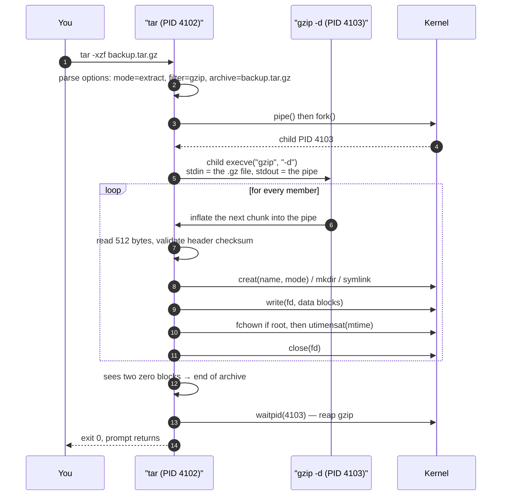
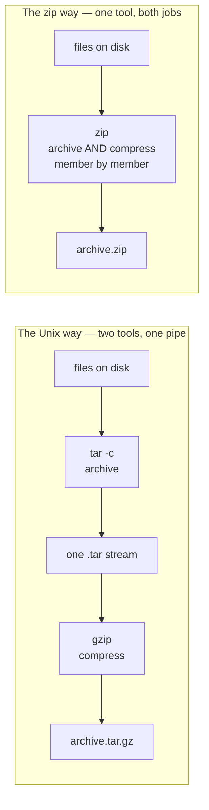

## 1 · The Big Picture

### Why this topic exists

You have 14,000 files in a project directory. You need to get them onto another machine, or into a backup, or up to an S3 bucket. Copying 14,000 files one at a time is slow — not because of the bytes, but because every single file costs a round trip: an `open`, a `write`, a `close`, and over a network, a handshake. Ten thousand small files can take longer to transfer than one large file of the same total size, by an order of magnitude.

So you want to turn many files into *one* file. That is **archiving**.

Separately, those bytes are compressible. Text, source code, JSON, logs and configuration files are enormously redundant — the word `function` appears 4,000 times in your JavaScript, `2026-07-31` appears on every line of the log. Squeezing that redundancy out means fewer bytes to store and fewer to ship. That is **compression**.

These are two different problems, solved by two different kinds of program, and the single most useful thing this chapter can teach you is to stop thinking of them as one thing. The Windows world taught everybody that "zipping" is one operation. On Unix it is two, and knowing that is the difference between using `tar` confidently and copying incantations off Stack Overflow forever.

### The real problem it solves

```diagram title="Two independent problems, two independent tools"
  PROBLEM 1: many files → one file          PROBLEM 2: one file → smaller file
  ─────────────────────────────────         ─────────────────────────────────
  Also must remember, for each file:        Must be reversible bit for bit:
    · its path and name                       · no data may be lost
    · its permissions (rwx)                   · must work on any byte stream,
    · its owner and group                       not just on files
    · its timestamps                          · knows nothing about names,
    · whether it is a symlink,                  permissions or directories
      a hard link, a device node,
      a FIFO, a sparse file

           SOLVED BY: tar, cpio, ar               SOLVED BY: gzip, bzip2,
           (archivers)                            xz, zstd (compressors)

                        └────────── compose with a pipe ──────────┘

                          tar -cf - dir | gzip > dir.tar.gz
```

Windows conflated the two: a `.zip` file is an archive *and* each member inside it is compressed, by one program, in one format, defined by one specification. That is genuinely convenient, and it buys a real technical advantage we will come to. But it also means that when a better compression algorithm arrives, the *archive format itself* has to change, every implementation has to be updated, and old tools cannot read new files.

Unix's separation means `zstd` — invented in 2016, twenty-something years after `tar`'s format was standardised — worked with `tar` on day one. Nothing about `tar` had to change. That is what "small tools composed by pipes" buys you.

### Where you will encounter it

| Context | What archiving or compression is doing there |
|---|---|
| Downloading source code | `linux-6.6.tar.xz` from kernel.org, `v1.2.3.tar.gz` from a GitHub release |
| Docker and OCI images | Every image layer **is** a gzip- or zstd-compressed tar stream. `docker save` writes a `.tar` |
| Package managers (Ch. 14) | `.deb` is an `ar` archive containing tar archives; `.rpm` carries a cpio payload; Alpine `.apk` is a `tar.gz` |
| Nightly backups | `tar -czf` to local disk or object storage, often with `--listed-incremental` |
| Log rotation | `logrotate` gzips yesterday's log; you then read it with `zgrep`, never by decompressing first |
| CI/CD | Build artefacts and dependency caches shipped as `.tar.zst` because restore speed dominates |
| Kubernetes | Helm charts are `.tgz`; `kubectl cp` is literally `tar` streamed through the API server |
| Language ecosystems | Python `sdist` is `.tar.gz`; `npm pack` produces `.tgz`; a Java `.jar` and an Android `.apk` are zips |
| Boot | `initramfs` is a compressed **cpio** archive the kernel unpacks into a tmpfs before mounting the real root |
| Office documents | `.docx`, `.xlsx`, `.odt`, `.epub` are all zip files with XML inside. Rename one to `.zip` and open it |

### Why companies care

- **Egress is billed.** Cloud providers charge for bytes leaving their network. Compressing a 400 GB nightly database dump at 5:1 is a direct line-item saving, every night, forever.
- **Storage is billed.** Backup retention of 90 days at 4:1 compression is 90 days at a quarter of the price.
- **Backup windows are finite.** A backup that takes nine hours does not fit in a six-hour window. Which compressor you choose is a real capacity-planning decision, not a preference.
- **Restore time is an SLA.** Recovery Time Objective is measured in minutes. `bzip2` decompresses at roughly a tenth the speed of `zstd`; on a 200 GB restore that is the difference between a coffee and an afternoon.
- **Image pull latency multiplies.** A Kubernetes cluster scaling from 10 to 400 pods pulls the same image 390 times. This is exactly why the container ecosystem moved from gzip to zstd layers.

> [!INFO]
> **`tar` stands for *tape archive*, and that explains almost everything odd about it.** It was designed in 1979 to write to a nine-track magnetic tape drive. A tape has no directory, no index, and no ability to seek cheaply — you can only stream forwards. Every design decision follows: fixed-size blocks, headers interleaved with data, no index at the end, and a format that can be produced without knowing the total size in advance. Half the things that confuse people about `tar` are tape artefacts that turned out, by accident, to be exactly what you want for piping over a network.

---

## 2 · Intuition First

### Analogy 1: moving house

You are moving flat. Two separate things happen.

**You pack boxes.** Objects that were spread across shelves and drawers go into a small number of boxes. On the side of each box you write what is inside and — crucially — *which room it came from*, because when you arrive you need the kitchen things back in the kitchen. You also note "fragile", "this end up", and who owns it.

That is archiving. The box is the archive. The writing on the side is the **metadata**: path, permissions, owner, timestamps. An archiver that forgot which room a thing came from would be useless.

**You vacuum-seal the duvet.** Same duvet, same fibres, a third of the volume, and it springs back to full size when you open the bag. Nothing was thrown away.

That is lossless compression. Notice that the vacuum bag knows nothing about duvets. It would work on jumpers. It works on anything squashy.

You can vacuum-seal a *box* — compress the archive — and that is exactly what `.tar.gz` is. But the box and the vacuum bag remain two separate inventions.

### Analogy 2: cassette tape versus compact disc

This one is not decoration. It is precisely the technical difference, and it will let you answer the hardest interview question in this chapter.

```diagram title="Sequential media vs indexed media"
  A .tar ARCHIVE = A CASSETTE TAPE            A .zip ARCHIVE = A CD
  ────────────────────────────────            ─────────────────────
  Songs recorded one after another.           Tracks recorded anywhere on
  To reach track 7 you must physically        the disc, plus a TABLE OF
  wind past tracks 1-6.                       CONTENTS that says exactly
                                              where each track starts.
  There is no table of contents. To
  know what is on the tape you play           Want track 7? Read the index,
  the whole thing.                            jump straight to it.

  Cheap to record: just start recording,       Needs to write the index, so
  you never need to know how long              needs to know where things
  the album will be.                           ended up. Harder to stream.
```

And now the practical consequence, which is the thing people get wrong: to pull one small file out of the middle of a 40 GB `.tar.gz`, the machine must **decompress everything in front of it**. There is no shortcut. Whereas `unzip` reads the index at the end of the `.zip`, seeks directly to that one member, and decompresses that member alone.

> [!MEMORY]
> **"Tar is a tape, zip is a disc."** Tape = sequential, no index, streamable, better ratio. Disc = indexed, random access, worse ratio. Every difference between the two formats falls out of that one sentence.

### Analogy 3: why a `.zip` compresses *worse*

Say you archive 500 nearly identical HTML files. Each one shares the same `<head>`, the same navigation bar, the same footer.

- `tar` glues them into one continuous stream, and then `gzip` compresses that stream *as a whole*. When gzip reaches file 300 and sees the navigation bar again, it can say "the same 800 bytes I saw 4 KB ago" — because as far as gzip is concerned, this is one long document. Compressors exploiting redundancy *across* members like this produce what is called a **solid** archive.
- `zip` compresses each member **independently**, because that is the price of the index: each member must be decompressible on its own, so it cannot refer back to a neighbour. File 300 starts from a blank slate.

On many small similar files, `.tar.gz` routinely beats `.zip` substantially. On one large file, the difference vanishes. That trade — ratio versus random access — is not a flaw in either format. It is the choice each one made.

---

## 3 · Technical Definitions

Now the precise versions.

**Archiving.** Combining multiple files and directories into a single file (an **archive**), together with the metadata needed to restore them faithfully: relative path, permission bits, numeric and symbolic owner and group, modification time, file type (regular, directory, symbolic link, hard link, character device, block device, FIFO), and link targets. Archiving **does not necessarily reduce size** — a plain `.tar` is usually slightly *larger* than the sum of its inputs, because of headers and padding.

**Compression.** Encoding a byte stream so it occupies fewer bytes, in a way that a matching decoder can reverse.

<dl>
<dt>Lossless</dt>
<dd>The output of decompression is <em>bit for bit identical</em> to the input. Mandatory for code, documents, databases and archives. Everything in this chapter is lossless.</dd>

<dt>Lossy</dt>
<dd>Information is deliberately discarded because a human will not notice — JPEG, MP3, H.264. Never appropriate for a tarball. Mentioned only so you can say the word "lossless" and mean something by it.</dd>
</dl>

**Compression ratio.** Original size ÷ compressed size. A ratio of `4:1` means the output is 25% of the input. Some tools report the inverse as a *percentage saved* (`gzip -l` says `-0.0%`), so always check which convention you are reading.

**Filter.** A program that reads a byte stream on standard input and writes a transformed byte stream on standard output. `gzip`, `bzip2`, `xz` and `zstd` are all filters first and file-manglers second, which is why `tar` can invoke them without any special integration.

**`tar`.** A utility that creates, lists, appends to and extracts from archives in the tar format. Unpack that definition:

| Term in the definition | What it actually means |
|---|---|
| "the tar format" | A sequence of 512-byte blocks: one header block per member, followed by that member's data padded up to a 512-byte boundary |
| "creates" | Mode `-c`. Reads files from disk, writes an archive |
| "lists" | Mode `-t`. Walks the headers and prints them — the archive's table of contents |
| "appends to" | Mode `-r` (add at the end) and `-u` (add only if newer). Only possible on an *uncompressed* archive |
| "extracts" | Mode `-x`. Reads the archive, recreates files and metadata on disk |
| what it is *not* | A compressor. `tar` compresses nothing by itself; `-z`, `-j`, `-J` and `--zstd` shell out to `gzip`, `bzip2`, `xz` and `zstd` |

**`zip` / `unzip`.** Implementations (the Info-ZIP ones on Linux) of the PKZIP `.zip` format, which is simultaneously an archive format and a compression container: each member is individually compressed — normally with **DEFLATE**, the same algorithm gzip uses — and an index called the **central directory** is written at the end of the file.

**Solid vs non-solid archive.** In a *solid* archive the compressor sees all members as one continuous stream and can exploit redundancy between them (`.tar.gz`, `.7z` by default). In a *non-solid* archive each member is compressed independently (`.zip`). Solid compresses better; non-solid allows random access and localises corruption.

> [!EXAM]
> The one-mark answer they want: **archiving bundles many files into one while preserving metadata; compression makes a stream smaller. `tar` archives, `gzip` compresses, and `.tar.gz` is both applied in that order. `zip` does both at once.**

---

## 4 · Internal Working

### Inside a `.tar`

A tar archive is nothing but 512-byte blocks. There is no header at the front of the file, no index at the back, no magic number at offset 0 identifying the whole file. There is only: header, data, header, data, …, and then two blocks of zeros to say "that is the end".

```diagram title="A tar stream, block by block (every block is exactly 512 bytes)"
  offset
  0      ┌────────────────────────────────────────────┐
         │ HEADER BLOCK  "html/index.html"            │  1 block
         │ mode 0644 · uid/gid · size=1841 · mtime    │
         │ typeflag='0' (regular file) · chksum       │
  512    ├────────────────────────────────────────────┤
         │ DATA  <the 1841 bytes of index.html>       │  4 blocks
         │       ...then 207 bytes of NUL padding     │  (1841 → 2048)
  2560   ├────────────────────────────────────────────┤
         │ HEADER BLOCK  "html/style.css"             │  1 block
         │ mode 0644 · size=20480 · typeflag='0'      │
  3072   ├────────────────────────────────────────────┤
         │ DATA  <20480 bytes, exactly 40 blocks>     │  40 blocks
  23552  ├────────────────────────────────────────────┤
         │ HEADER BLOCK  "html/current"               │  1 block
         │ typeflag='2' (symlink) · size=0            │
         │ linkname="releases/2026-07-20"             │  ← NO data block:
  24064  ├────────────────────────────────────────────┤     the target is
         │ HEADER BLOCK  "html/logs/"                 │     inside the header
         │ typeflag='5' (directory) · size=0          │
  24576  ├────────────────────────────────────────────┤
         │ 000000000000 …  END-OF-ARCHIVE             │  2 zero blocks
         │ 000000000000 …                             │
  25600  └────────────────────────────────────────────┘
              ↑
         No index. Anywhere. To find "html/logs/app.log" you read
         header 1, skip 4 blocks, read header 2, skip 40 blocks, …
```

Two immediate consequences you can now reason about instead of memorising:

1. **A tar archive is append-friendly.** "End of archive" is just two zero blocks; `tar -r` seeks to them, overwrites them, and carries on. That is why `-r` exists and why it cannot work on a compressed archive — you cannot seek into the middle of a gzip stream and resume writing valid output.
2. **A tar archive is streamable.** Nothing in a header refers to anything later in the file, so `tar` can start emitting bytes before it knows how big the archive will be. This is the property that makes `tar -cf - dir | ssh host …` possible, and it is why Docker layers are tar streams.

The header itself is the POSIX **ustar** layout, 500 used bytes of the 512:

| Offset | Length | Field | Notes |
|---|---|---|---|
| 0 | 100 | `name` | Path, as stored. Historically limited to 100 characters |
| 100 | 8 | `mode` | Permission bits, in ASCII **octal** |
| 108 | 8 | `uid` | Numeric user ID, octal |
| 116 | 8 | `gid` | Numeric group ID, octal |
| 124 | 12 | `size` | Size in bytes, octal. Classic limit: 8 GiB |
| 136 | 12 | `mtime` | Modification time as an octal Unix timestamp |
| 148 | 8 | `chksum` | Simple sum of the header's bytes — an integrity check on the *header*, not the data |
| 156 | 1 | `typeflag` | `0` file · `1` hard link · `2` symlink · `3` chardev · `4` blockdev · `5` directory · `6` FIFO |
| 157 | 100 | `linkname` | Target, for link types |
| 257 | 8 | `magic` + `version` | `ustar\0` then `00` — how a tool recognises a tar header at all |
| 265 | 32 | `uname` | Owner **name** as text, e.g. `deploy` |
| 297 | 32 | `gname` | Group name as text |
| 329 | 16 | `devmajor`, `devminor` | Device numbers, for device nodes |
| 345 | 155 | `prefix` | Prepended to `name`, raising the practical path limit to ~255 |

Two details in that table earn their keep in interviews. First, there is **a checksum per header but none over the file data** — tar has no way of telling you a member's contents were corrupted, which is why you keep a `sha256sum` alongside the tarball. Second, ownership is stored **twice**: numerically *and* by name. On extraction `tar` prefers the *name*, looks it up in `/etc/passwd` on the restoring machine, and uses whatever UID that maps to. If you are restoring onto a different host where `deploy` happens to be UID 1004 instead of 1001, that is what you want. If you are restoring a container root filesystem, it is emphatically not — which is exactly what `--numeric-owner` is for.

Modern GNU tar escapes the 100-character and 8 GiB limits with extra pseudo-members: GNU `L`/`K` blocks for long names, or POSIX **pax extended headers** (`typeflag` `x`), which carry arbitrary `key=value` metadata — sub-second timestamps, huge sizes, extended attributes, SELinux labels. Check with `tar --show-defaults`; GNU tar 1.35 still defaults to `--format=gnu`.

### Inside a `.zip`

```diagram title="A zip file: per-member headers, plus a real index at the end"
  ┌──────────────────────────────────────────────────────┐
  │ PK\x03\x04  LOCAL FILE HEADER  "dist/index.html"     │
  │ method=8 (deflate) · crc32 · csize · usize · name    │
  ├──────────────────────────────────────────────────────┤
  │ <deflate-compressed bytes of index.html>             │  compressed
  ├──────────────────────────────────────────────────────┤  ON ITS OWN
  │ PK\x03\x04  LOCAL FILE HEADER  "dist/app.js"         │
  ├──────────────────────────────────────────────────────┤
  │ <deflate-compressed bytes of app.js>                 │
  ├══════════════════════════════════════════════════════┤
  │ PK\x01\x02  CENTRAL DIRECTORY ENTRY  "dist/index…"   │
  │   …everything above, PLUS: external attributes       │
  │      (Unix mode lives here) and, critically,         │
  │      OFFSET OF THE LOCAL HEADER  ────────────────┐   │
  ├──────────────────────────────────────────────────┼───┤
  │ PK\x01\x02  CENTRAL DIRECTORY ENTRY  "dist/app…" │   │
  ├──────────────────────────────────────────────────┼───┤
  │ PK\x05\x06  END OF CENTRAL DIRECTORY (EOCD)      │   │
  │   entry count · size of central dir ·            │   │
  │   OFFSET WHERE THE CENTRAL DIRECTORY STARTS ─────┘   │
  └──────────────────────────────────────────────────────┘
       ↑ unzip reads the file BACKWARDS: find EOCD at the tail,
         jump to the central directory, jump to one member. Done.
```

Because a zip is located from its **tail**, you can stick a zip on the end of *any other file* and it still parses. That is not a curiosity: it is how self-extracting `.exe` archives work, and it is why `.jar`, `.apk`, `.docx`, `.xlsx`, `.odt` and `.epub` are all zip files — the format tolerates a prologue.

It is also, for the same reason, why the zip format has an awkward relationship with streaming: to write a local header you must state the compressed size and CRC-32 *before* the data, which you cannot know until you have compressed it. The format's workaround is a "data descriptor" written afterwards with a flag bit set, but support for it has always been patchy. Tar has no such problem.

### What actually happens when you run `tar -xzf backup.tar.gz`



Six things in that trace are worth holding on to. `tar` runs the compressor as a **separate process connected by a pipe** — which is why a corrupt `.gz` produces a `gzip:` error message and `tar: Child returned status 1`, two programs complaining in sequence. Metadata is applied **after** the data is written, and `mtime` is applied last, because writing to a file would otherwise update it. `chown` only happens **if you are root**, since an ordinary user cannot give a file away. And the whole thing is a single forward pass — no seeking, no index, exactly as the tape demanded.



---

## 5 · Practical Demonstration I — `tar` in Full

`tar` deserves the most space in this chapter because it is the one you will type every week for the rest of your career, and because its option syntax is genuinely peculiar.

### Purpose and syntax

`tar` creates, extracts and manages archive files that bundle multiple files and directories together with their metadata.

```bash
tar [options] tar_file_name file1 file2
```

That is the syntax the source notes give, and it is worth pausing on because it is *misleading in a way that has destroyed real people's work*. `tar` does not take the archive name positionally. The archive name is the argument to `-f`. Everything else is a member. The syntax as usually written is:

```bash
tar <exactly-one-mode> [modifiers] -f ARCHIVE [members...]
```

### The three syntaxes, and why a leading dash is optional

```bash
tar czf archive.tar.gz mydir          # old style ("key" argument) — no dash
tar -czf archive.tar.gz mydir         # short options, bundled
tar -c -z -f archive.tar.gz mydir     # short options, separate
tar --create --gzip --file=archive.tar.gz mydir   # long options
```

All four do the same thing. `tar` is one of a tiny handful of Unix commands where the **first argument may omit its leading dash** — a survival from 1979, before `getopt` existed, when the first argument was called the *key* and was simply a string of mode letters. `ps aux` and `ar rcs` are the other two you will meet.

> [!WARNING]
> In old style the bundled letters must come **first** and the arguments they consume are taken in order. `tar cfz archive.tar.gz mydir` and `tar czf archive.tar.gz mydir` are **not** the same: in the first, `f` comes before `z`, so `f` claims `archive.tar.gz`, and it happens to still work — but `tar cfvz` style ordering bites people constantly. Use `-czf` with the dash and keep `f` last among the letters that take a value. It is the form the whole world writes for a reason.

### Operation modes — you must pick exactly one

| Mode | Long form | What it does |
|---|---|---|
| `-c` | `--create` | Create a new archive from the named files |
| `-x` | `--extract`, `--get` | Extract members out of an archive onto disk |
| `-t` | `--list` | List the table of contents without extracting anything |
| `-r` | `--append` | Append files to the **end** of an existing archive |
| `-u` | `--update` | Append, but only files newer than the copy already in the archive |
| `-A` | `--concatenate`, `--catenate` | Append the *members of another tar archive* to this one |
| `--delete` | — | Remove named members from an archive |
| `-d` | `--diff`, `--compare` | Report differences between the archive and the filesystem |

> [!MISTAKE]
> **Giving no mode, or two.** `tar -zf archive.tar.gz` gets you `tar: You must specify one of the '-Acdtrux', '--delete' or '--test-label' options`. `tar -cxf …` gets you `tar: You may not specify more than one '-Acdtrux' …`. Both messages are unusually clear; read them rather than retyping randomly.

> [!DANGER]
> **`-r`, `-u`, `-A` and `--delete` do not work on compressed archives.** They need to seek inside the file, and a gzip stream cannot be seeked into or partially rewritten.
> ```console
> $ tar -rf backup.tar.gz extra.txt
> tar: Cannot update compressed archives
> tar: Error is not recoverable: exiting now
> ```
> To add one file to a `.tar.gz` you must decompress, append, recompress: `gunzip backup.tar.gz && tar -rf backup.tar extra.txt && gzip backup.tar`. If you find yourself doing this often, you want the wrong tool — you want `rsync` (Chapter 12) or a real backup system.

### `-f`, and what happens if you forget it

`-f FILE` names the archive. `-f -` means standard input (when extracting or listing) or standard output (when creating).

Modern GNU tar's *default* archive is `-`, which you can prove:

```console
$ tar --show-defaults
--format=gnu -f- -b20 --quoting-style=escape --rmt-command=/usr/lib/tar/rmt
```

So omitting `-f` does not error — it writes to, or reads from, your terminal. Creating without `-f` at an interactive prompt is caught for you:

```console
$ tar -cz mydir
tar: Refusing to write archive contents to terminal (missing -f option?)
tar: Error is not recoverable: exiting now
```

But **in a pipeline the guard does not fire**, and you get raw binary sprayed into the pipe. And extracting without `-f` is worse: `tar -xz` silently reads standard input, so it just hangs, and every beginner concludes the archive is enormous.

> [!MEMORY]
> **`f` for *file*, and it eats the very next word.** Whatever token follows `-f` becomes the archive, no matter what you meant. That is the whole mental model, and it is what makes the disaster in the next callout possible.

> [!DANGER]
> **The argument-order disaster.** `-f` claims the next argument as the archive and *creates it, truncating whatever is there*.
> ```bash
> tar -czf mydir backup.tar.gz     # WRONG — and destructive
> ```
> This does not create `backup.tar.gz` from `mydir`. It creates an archive **named `mydir`**, overwriting your directory's name in the filesystem, containing the file `backup.tar.gz`. People lose an afternoon's work to this. Say the command out loud as you type it: *"create, gzip, file — `output.tar.gz` — from — `mydir`."* The archive name always comes **immediately** after `-f`.

### Compression filters

| Option | Long form | Program | Extension | Reach for it when |
|---|---|---|---|---|
| `-z` | `--gzip` | `gzip` | `.tar.gz`, `.tgz` | Default choice. Universally readable, fast enough, everywhere |
| `-j` | `--bzip2` | `bzip2` | `.tar.bz2`, `.tbz2`, `.tbz` | Legacy archives. Do not choose it for new work |
| `-J` | `--xz` | `xz` | `.tar.xz`, `.txz` | Distribution artefacts: compress once, download a million times |
| `--zstd` | — | `zstd` | `.tar.zst` | Backups and CI caches at scale — best speed-to-ratio by a wide margin |
| `--lzma` | — | `lzma` | `.tar.lzma` | Legacy pre-`xz` format. Read-only in practice |
| `-Z` | `--compress` | `compress` | `.tar.Z` | 1980s archives only |
| `-a` | `--auto-compress` | inferred | any | Create mode: pick the filter from the **name you gave `-f`** |
| *(none)* | — | detected | any | **Extract/list mode: GNU tar sniffs the format for you** |

Two of those rows change how you should type `tar` day to day.

```bash
tar -acf artefacts.tar.zst dist/      # -a reads ".zst" and calls zstd. No flag to remember
tar -acf artefacts.tar.xz  dist/      # same command, different suffix, different compressor
```

And on the way back out:

```bash
tar -xf anything.tar.gz               # works
tar -xf anything.tar.bz2              # works
tar -xf anything.tar.zst              # works
tar -tf anything.tar.xz               # works
```

Since GNU tar 1.15, **extract and list auto-detect compression**. You never need `-z` to unpack anything. Worse, specifying the wrong one *breaks a command that would otherwise have worked*:

```console
$ tar -xzf lab.tbz2

gzip: stdin: not in gzip format
tar: Child returned status 1
tar: Error is not recoverable: exiting now
```

> [!TIP]
> **Learn two commands, not twelve.** `tar -tf X` to look inside anything. `tar -xf X` to unpack anything. Compression flags are only needed when **creating** — and even then `-a` will infer them from the filename. The `-xzf` you see everywhere is a habit from tar versions that are now twenty years old.

### Everything else worth knowing

| Option | What it does | Why you care |
|---|---|---|
| `-v` | Verbose: list members as they are processed. `-vv` adds `ls -l`-style detail | Combine with `-t` to get a long listing |
| `-C DIR` | **Change directory to `DIR` before the next operand** | The single most important tar option. See below |
| `-p`, `--preserve-permissions` | Restore permission bits exactly, ignoring your umask. Default when root | Needed to restore a system faithfully |
| `--numeric-owner` | Store and restore UID/GID as **numbers**, ignoring user *names* | Mandatory for container images and cross-host restores |
| `--same-owner` / `--no-same-owner` | Restore ownership, or do not. Root defaults to `--same-owner`; everyone else to `--no-same-owner` | Explains "why is everything owned by me after the restore?" |
| `--exclude=PATTERN` | Skip members matching a glob. Unanchored, so it matches at any depth | Repeatable. Put it **before** the directory |
| `--exclude-from=FILE` | Read exclusion patterns from a file, one per line | How real backup scripts stay readable |
| `--exclude-vcs` | Skip `.git`, `.svn`, `.hg`, `.bzr` and friends | One flag instead of five |
| `--exclude-caches` | Skip any directory containing a `CACHEDIR.TAG` file | The standards-compliant way; most caches do not tag themselves |
| `--strip-components=N` | On extract, remove the first `N` path components from every member | Unpacking `foo-1.2.3/` straight into place |
| `-h`, `--dereference` | Archive the **file a symlink points to**, not the link | Turns links into real copies. Bigger archive, fewer surprises for non-Unix consumers |
| `--hard-dereference` | Store each hard link as a full separate copy | Same idea, for hard links |
| `-P`, `--absolute-names` | Do **not** strip leading `/`, and allow `..` | Dangerous. See the callout below |
| `--wildcards` / `--no-wildcards` | Treat member names on the command line as globs (or not) | GNU tar globs `--exclude` by default, but matches `-x`/`-t` member names literally |
| `--anchored` / `--no-anchored` | Whether a pattern must match from the start of the name | Occasionally the difference between excluding everything and nothing |
| `-k`, `--keep-old-files` | Refuse to overwrite existing files on extract | Safety net for extracting into a populated directory |
| `--overwrite` | Overwrite without complaint | The opposite. `--skip-old-files` is the quiet middle ground |
| `--remove-files` | **Delete each file from disk after it has been added to the archive** | "Archive and clean up" in one step. See the danger callout |
| `-W`, `--verify` | After writing, re-read the archive and compare it against the filesystem | Cannot be used with compression. Worth it on tape and flaky disks |
| `--totals` | Print bytes written and throughput when finished | Free instrumentation for backup scripts |
| `--checkpoint=N` | Emit a progress record every `N` blocks | Pair with `--checkpoint-action=` |
| `--checkpoint-action=ACTION` | `dot`, `echo`, `ttyout=…`, `exec=…` | Progress output on a job that runs for hours |
| `-T FILE`, `--files-from` | Read the list of members from a file (`-` for stdin) | Feed it from `find`. Add `--null` for `find -print0` |
| `-O`, `--to-stdout` | Write extracted members to standard output instead of disk | Peek at one file without unpacking |
| `--one-file-system` | Do not cross mount points | Stops a `/` backup from descending into `/proc`, `/sys` and NFS mounts |
| `-S`, `--sparse` | Detect and store holes in sparse files efficiently | VM disk images, database files |
| `--owner=NAME`, `--group=NAME` | Force ownership of every member as stored | Reproducible builds: `--owner=0 --group=0` |
| `--mtime=DATE`, `--sort=name` | Force timestamps; emit members in a deterministic order | The other half of a byte-reproducible tarball |
| `--transform=EXPR` | Rewrite member names with a sed expression | Renaming a whole tree on the fly |
| `-b N`, `--blocking-factor` | Blocks per record; default 20, i.e. 10 KiB records | Tape-era tuning. You will never change it |
| `--one-top-level[=DIR]` | On extract, create a containing directory and put everything in it | The modern tarbomb defence. GNU tar 1.28+ |

### `-C` — the option everyone underexplains

`-C DIR` makes `tar` `chdir()` into `DIR`. What people miss is that it applies **positionally**: it affects only the operands that come *after* it, and you may use it more than once.

Consider archiving `/var/www/html`. The naive command:

```console
$ tar -czf site.tar.gz /var/www/html
tar: Removing leading `/' from member names
$ tar -tzf site.tar.gz | head -3
var/www/html/
var/www/html/index.html
var/www/html/style.css
```

Every member is now `var/www/html/…`. Extract that anywhere and you get a four-level directory tree you did not ask for. With `-C` the archive is *rooted where you want it*:

```console
$ tar -czf site.tar.gz -C /var/www html
$ tar -tzf site.tar.gz | head -3
html/
html/index.html
html/style.css
```

Read it as: *"go to `/var/www`, then archive the thing called `html`."* Now the archive is portable — `tar -xzf site.tar.gz -C /srv/newsite` drops a clean `html/` wherever you like.

Used more than once, `-C` lets you gather files from several places into one flat archive:

```bash
tar -czf config-bundle.tar.gz \
  -C /etc/nginx nginx.conf sites-available \
  -C /etc/ssl/certs site.pem \
  -C /opt/app config.yaml
```

And on extraction it is simply "unpack into here":

```bash
tar -xzf site.tar.gz -C /srv/newsite
```

> [!MEMORY]
> **`-C` means "cd first".** In create mode it controls *what the paths inside the archive look like*. In extract mode it controls *where the files land*. Same option, two jobs, one idea.

### The mnemonics for the option soup

> [!MEMORY]
> **`tar -czf` — "*c*reate *z*e *f*ile."** Say it in a cartoon French accent; it sticks, and the letters come out in the right order.
>
> **`tar -xzf` — "e*x*tract *z*e *f*ile."**
>
> **`tar -tf` — "*t*able of contents."** `-t` is not "test" and not "tar" — it is the table of contents, which is why `tar -tf` is what you run before you ever run `tar -xf`.
>
> And one more for the whole family: **`tar` = *T*ape *AR*chive**, so **`-r` = *r*ecord more onto the end**, and there is no index because tapes have none.

### Naming conventions

| Written as | Also written as | Contents |
|---|---|---|
| `.tar` | — | A plain, uncompressed archive. A "tarball" strictly speaking |
| `.tar.gz` | `.tgz` | tar, gzip-compressed. The default of the Unix world |
| `.tar.bz2` | `.tbz2`, `.tbz`, `.tb2` | tar, bzip2-compressed |
| `.tar.xz` | `.txz` | tar, xz-compressed. Kernel and distribution source releases |
| `.tar.zst` | `.tzst` | tar, zstd-compressed. Backups, CI caches, modern container layers |
| `.tar.lz4` | — | tar, lz4-compressed. Speed above all else |
| `.tar.Z` | `.taz` | tar, `compress`-compressed. Historical |

The short forms exist because MS-DOS allowed only three characters after the dot. They mean exactly the same thing as the long forms, and `tar -a` understands both.

### Reading the output of `tar -tvzf`, field by field

This is the command you run before *every* extraction, so learn to read it properly. It deliberately looks like `ls -l`, because it is showing you the same metadata out of the tar headers.

```console
$ tar -tvzf site-backup-2026-07-28.tar.gz
drwxr-xr-x deploy/deploy         0 2026-07-28 11:04 html/
-rw-r--r-- deploy/deploy      1841 2026-07-28 11:04 html/index.html
-rw-r--r-- deploy/deploy     20480 2026-07-26 09:12 html/style.css
-rwxr-xr-x deploy/deploy      3512 2026-07-26 09:12 html/deploy.sh
lrwxrwxrwx root/root             0 2026-07-20 08:00 html/current -> releases/2026-07-20
drwxr-x--- www-data/www-data     0 2026-07-28 10:59 html/logs/
-rw-r----- www-data/www-data 5242880 2026-07-28 10:59 html/logs/access.log
hrw-r--r-- deploy/deploy         0 2026-07-26 09:12 html/backup.html link to html/index.html
```

| Column | Example | What it is |
|---|---|---|
| 1st character | `d`, `-`, `l`, `h`, `c`, `b`, `p` | The `typeflag` from the header: directory, regular file, symlink, hard link, char device, block device, FIFO |
| Rest of field 1 | `rwxr-xr-x` | The `mode` field, rendered as owner/group/other. `html/logs/` at `drwxr-x---` means group members can read it, nobody else can enter it |
| Field 2 | `deploy/deploy` | `uname/gname` — owner **name** slash group **name**, not numbers. With `--numeric-owner` you would see `1001/1001` |
| Field 3 | `5242880` | Size in bytes, from the header. **Uncompressed size.** Directories and symlinks are `0` |
| Field 4 | `2026-07-28 11:04` | `mtime`, the modification time as stored |
| Field 5 | `html/logs/access.log` | The member name, exactly as stored. Trailing `/` marks a directory |
| Suffix | `-> releases/2026-07-20` | For a symlink, the `linkname` field: where it points |
| Suffix | `link to html/index.html` | For a hard link, the earlier member it shares an inode with |

Three things this listing tells you before you extract anything, which is precisely why you run it:

- **Every path is relative and every path starts with `html/`.** This is not a tarbomb. Extracting it creates exactly one directory.
- **`html/current` is a symlink into `releases/`,** which is not in the archive. The restore will produce a dangling link, and your web server will 404. Worth knowing at 3 a.m.
- **`access.log` is 5 MiB and mode `0640` owned by `www-data`.** If you extract as an ordinary user, that ownership is silently dropped and the log ends up owned by you.

### Worked examples, beginner to production

**Create a plain archive of a directory.** The quiz-bank question, answered:

```console
$ tar -cvf archive.tar docs
docs/
docs/readme.md
docs/design.md
docs/img/
docs/img/diagram.png
```

No `-z`, so no compression: `archive.tar` will be *larger* than `docs` by the size of the headers and padding. That is normal and correct.

**Create a gzip-compressed archive — the source example, exactly as given:**

```bash
tar -czf archive.tar.gz file1.txt file2.txt
```

Creates a compressed archive `archive.tar.gz` containing `file1.txt` and `file2.txt`, bundling them and reducing size in a single command. `-c` creates, `-z` filters through gzip, `-f` names the output.

**Create a bzip2-compressed archive of a directory:**

```bash
tar -cjf archive.tar.bz2 mydir
```

`-j` is bzip2. Note the pattern: the *flag* determines the compression, and the *filename* is a promise you are making to whoever receives it. `tar -czf archive.tar.bz2 mydir` will happily produce a gzip file with a lying name, and the person who receives it will curse you. This is what `-a` exists to prevent.

**List a compressed archive without extracting:**

```bash
tar -tzvf backup.tar.gz          # or, better, just: tar -tvf backup.tar.gz
```

**Extract, verbosely, with progress:**

```console
$ tar -xvf files.tar
docs/
docs/readme.md
docs/design.md
```

**Extract exactly one file.** The path must match the stored name *exactly*, which is why you list first:

```console
$ tar -tzf archive.tar.gz | grep subfile
dir/subfile.txt
$ tar -xzf archive.tar.gz dir/subfile.txt
$ find . -name subfile.txt
./dir/subfile.txt
```

Note what happened: the file arrived at `./dir/subfile.txt`, *not* `./subfile.txt`, because tar recreates the stored path. If you want it bare in the current directory, strip the leading component:

```bash
tar -xzf archive.tar.gz --strip-components=1 dir/subfile.txt
```

And to read it without writing anything to disk at all:

```console
$ tar -xzOf archive.tar.gz dir/subfile.txt | head -5
# subfile
the first five lines only
```

**Extract by pattern.** Member names on the command line are matched literally unless you say otherwise:

```bash
tar -xzf logs.tar.gz --wildcards '*/nginx/*.log'
```

**Strip a version directory.** Source tarballs conventionally contain one top directory named after the release. To put its *contents* somewhere directly:

```console
$ tar -tzf linux-6.6.1.tar.gz | head -2
linux-6.6.1/
linux-6.6.1/.clang-format
$ sudo tar -xzf linux-6.6.1.tar.gz --strip-components=1 -C /usr/src/linux
$ ls /usr/src/linux | head -3
Documentation
Kbuild
Makefile
```

**Exclude what you do not want.** Verified behaviour: `--exclude` is unanchored, so one pattern catches every depth.

```console
$ tar -czf app.tar.gz --exclude=node_modules --exclude=.git app
$ tar -tzf app.tar.gz
app/
app/.env
app/sub/
app/src/
app/src/a.js
```

Both `app/node_modules` and `app/sub/node_modules` are gone, and so is `app/.git`. For anything beyond two or three patterns, use a file:

```text title="/etc/backup/exclude.txt"
node_modules
.git
__pycache__
*.pyc
.venv
target
.terraform
*.log
.cache
tmp
```

```bash
tar -czf app.tar.gz --exclude-from=/etc/backup/exclude.txt app
```

> [!WARNING]
> **`--exclude-vcs` is narrower than it sounds, and `--exclude-caches` narrower still.** `--exclude-vcs` skips version-control *metadata* directories (`.git`, `.svn`, `.hg`, `.bzr`, `CVS`) and nothing else — it will not skip `node_modules`. `--exclude-caches` only skips directories containing a literal `CACHEDIR.TAG` file, which almost nothing writes. Neither is a substitute for an explicit exclude list.

**Archive and delete the originals** — the quiz-bank `--remove-files` question:

```bash
tar -czf logs-2026-07.tar.gz --remove-files /var/log/app/2026-07-*.log
```

> [!DANGER]
> **`--remove-files` deletes source files from disk as soon as each one is written into the archive.** If the archive is being written to a filesystem that fills up halfway, or to a network path that drops, you have deleted files into a truncated archive. Never use it on data you cannot regenerate. The safe pattern is two steps with a verification between them:
> ```bash
> tar -czf logs.tar.gz /var/log/app/2026-07-*.log \
>   && tar -tzf logs.tar.gz > /dev/null \
>   && rm -f /var/log/app/2026-07-*.log
> ```

**Instrument a long-running backup:**

```console
$ tar -czf /backup/data.tar.gz --totals --checkpoint=2000 --checkpoint-action=dot /srv/data
...................................
Total bytes written: 4823040 (4.6MiB, 12MiB/s)
```

One dot per 2,000 blocks (20 MB of input), then a throughput summary. `--checkpoint-action=echo` prints a line instead; `--checkpoint-action=exec=/usr/local/bin/notify` runs a command, which is how you drive a progress bar from a cron job.

**Verify what you wrote:**

```bash
tar -cWf /backup/data.tar /srv/data          # note: no -z; -W cannot be used with a compressor
```

`-W` re-reads the finished archive and compares every member against the filesystem. It roughly doubles the I/O, so it is for tape drives and dubious USB disks, not for routine backups. For a compressed archive the equivalent is a checksum, covered in section 8.

### The two mistakes that actually happen

> [!DANGER]
> **Mistake 1: `tar -cf archive.tar *`.** Two independent failures in one short command.
>
> **It silently misses your dotfiles.** The `*` is expanded by the *shell*, not by `tar`, and the shell does not match names beginning with a dot. Verified:
> ```console
> $ ls -a
> .  ..  .env  node_modules  src  sub
> $ tar -czf ../t3.tgz *
> $ tar -tzf ../t3.tgz
> node_modules/
> src/
> src/a.js
> sub/
> ```
> `.env` is not there. Neither would `.git`, `.htaccess`, `.gitignore`, `.dockerignore` or `.ssh` be. This is how people discover that their "complete backup" was missing every credential file, months later.
>
> **It can also embed absolute paths.** `tar -cf archive.tar /etc/nginx/*` expands to absolute paths, tar strips the leading `/` and warns, and you get `etc/nginx/...` inside the archive.
>
> **The fix, both problems at once:** never glob. Archive the *directory*, or archive `.` from inside it via `-C`:
> ```bash
> tar -czf app.tar.gz app                 # names the directory — includes dotfiles
> tar -czf app.tar.gz -C app .            # archives "." — includes dotfiles, no wrapper dir
> ```

> [!DANGER]
> **Mistake 2: the tarbomb.** A well-behaved archive contains exactly one top-level directory, so extracting it creates one tidy folder. A **tarbomb** contains loose files at the top level, so extracting it detonates dozens or thousands of files directly into your current directory — mixed in with whatever was already there, silently overwriting anything with a matching name. There is no undo, and cleaning up by hand means diffing a listing against your directory.
>
> ```console
> $ tar -tf suspicious.tar
> README
> Makefile
> src/main.c
> config
> install.sh
> ```
> No common prefix. That is a bomb.
>
> **Three defences, in increasing order of how much you should like them:**
> ```bash
> tar -tf suspicious.tar | head -20        # 1. ALWAYS look first. Costs two seconds
> mkdir unpack && tar -xf suspicious.tar -C unpack   # 2. Extract into a fresh directory
> tar -xf suspicious.tar --one-top-level             # 3. GNU tar 1.28+ does it for you
> ```
> `--one-top-level` creates a directory named after the archive (or after `=NAME` if you give one) and puts everything inside it. It is the right default and there is no reason not to alias it.
>
> The malicious version of this is worse: combine loose top-level files with `..` components or absolute paths and an archive can write *outside* the extraction directory entirely. GNU tar strips leading `/` and refuses `..` members by default, which is why the next callout matters.

> [!WARNING]
> **The `Removing leading '/' from member names` message is tar protecting you, not complaining.** When you archive an absolute path, tar stores it relative:
> ```console
> $ tar -czf lab3.tgz /srv/lab
> tar: Removing leading `/' from member names
> ```
> This is deliberate: it guarantees that extracting the archive cannot overwrite `/etc/passwd` or `/bin/sh` on the extracting machine, no matter where the archive came from. You suppress it with `-P` / `--absolute-names`, which stores and restores real absolute paths. **Do not use `-P` on archives you did not create**, and think hard before using it on ones you did: a `-P` archive of `/etc` extracted by mistake overwrites the live `/etc` regardless of your current directory.

### Production patterns

**A timestamped backup.** The idiom, and note the `-C`:

```bash
tar -czf backup-$(date +%F).tar.gz -C /var/www html
```

`date +%F` is ISO `YYYY-MM-DD`, so the files sort chronologically in `ls` and lexicographic sort order equals date order. Use `+%F-%H%M` if you take more than one a day. Never use `%d-%m-%Y`; it sorts by day of the month.

**Exclude caches and version control from an application backup:**

```bash
tar -czf /backup/app-$(date +%F).tar.gz \
  --exclude-vcs \
  --exclude=node_modules \
  --exclude=__pycache__ \
  --exclude='*.log' \
  --exclude=.terraform \
  --one-file-system \
  --totals \
  -C /srv myapp
```

`--one-file-system` is the quiet hero: it stops the backup descending into anything mounted underneath, which on a real server means `/proc`, `/sys`, `/dev`, tmpfs mounts and NFS shares. Without it, a backup of `/` tries to archive `/proc/kcore` — a file the kernel reports as the size of your address space — and never finishes.

**Stream a backup over SSH with no temporary file:**

```bash
tar -czf - /data | ssh backup-host 'cat > /backup/data.tgz'
```

Read it as a pipeline: `-f -` means "write the archive to stdout", `|` hands the bytes to `ssh`, and `cat >` on the far side writes them to a file. **No temporary file is created on either machine**, which matters enormously when `/data` is 400 GB and neither host has 400 GB spare.

The variations are all the same shape:

```bash
# Pull instead of push
ssh web-01 'tar -czf - /var/www' > web-01-www.tgz

# Copy a tree between hosts, unpacking on arrival, preserving all metadata
tar -czf - -C /var/www html | ssh web-02 'tar -xzf - -C /var/www'

# Copy locally, preserving ownership, permissions, links and sparseness
tar -cf - -C /src . | sudo tar -xpf - -C /dst

# Compress on the far side instead, if the source host is CPU-starved
tar -cf - /data | ssh backup-host 'zstd -T0 -3 > /backup/data.tar.zst'

# Straight into object storage, never touching local disk
tar -czf - -C /var/www html | aws s3 cp - s3://acme-backups/www-$(date +%F).tgz
```

> [!PROD]
> `tar -cf - src | tar -xf - -C dst` is the classic answer to "how do I copy a directory tree and keep everything?" — permissions, ownership, timestamps, symlinks as symlinks, hard links as hard links, sparse files still sparse. Plain `cp -r` gets none of that right; `cp -a` gets most of it. On modern systems reach for `rsync -aHAX` (Chapter 12) first, but know the tar pipeline: it needs nothing installed on the far side but `tar` and a shell, which is exactly the situation you are in inside a minimal container or a rescue shell.

**Incremental backups with `--listed-incremental`.** GNU tar can keep a *snapshot file* recording the state of every file it archived. On the next run it compares against that snapshot and archives only what changed.

```bash
SNAR=/var/backups/www.snar

# Sunday: force a full (level 0) backup and start a fresh snapshot
tar -czf /backup/www-full-$(date +%F).tar.gz \
    --listed-incremental="$SNAR" --level=0 \
    -C /var/www html

# Monday to Saturday: only what changed since the snapshot was last updated
tar -czf /backup/www-incr-$(date +%F).tar.gz \
    --listed-incremental="$SNAR" \
    -C /var/www html
```

```console
$ ls -la /backup/
-rw-r--r-- 1 root root 412839424 Jul 26 02:00 www-full-2026-07-26.tar.gz
-rw-r--r-- 1 root root   3117056 Jul 27 02:00 www-incr-2026-07-27.tar.gz
-rw-r--r-- 1 root root   1884160 Jul 28 02:00 www-incr-2026-07-28.tar.gz
```

Restore by replaying **the full archive and then every incremental in order**, with `--incremental` so tar honours the delete records:

```bash
tar -xzf www-full-2026-07-26.tar.gz --incremental -C /restore
tar -xzf www-incr-2026-07-27.tar.gz --incremental -C /restore
tar -xzf www-incr-2026-07-28.tar.gz --incremental -C /restore
```

> [!DANGER]
> **The snapshot file is part of your backup.** Lose `www.snar` and every future run silently becomes a full backup — annoying but safe. *Corrupt or restore an old copy of it* and future incrementals will skip files that genuinely changed — a backup that appears to succeed and cannot be restored from. Back the `.snar` up with the archives, and test a full restore into a scratch directory on a schedule. An untested backup is not a backup.

> [!TIP]
> `--listed-incremental` is real and works, and interviewers like it. In production in 2026, though, reach for a tool built for the job — `restic`, `borg`, `bup` — which give deduplication, encryption, integrity verification and pruning that `tar` never will. Know the tar mechanism, deploy the purpose-built tool.

---

## 6 · Practical Demonstration II — the Compression Tools

Every tool in this section is a **filter**. Each one reads bytes and writes smaller bytes, knows nothing about directories, and can be used with or without `tar`. They differ in exactly three ways: how much they shrink, how long they take, and how much memory they need.

### The one behaviour that surprises everybody

```console
$ ls
report.csv
$ gzip report.csv
$ ls
report.csv.gz
```

`report.csv` is **gone**. `gzip`, `bzip2` and `xz` all *replace* the input file with the compressed version by default — they are not "make a copy", they are "convert in place". Everyone loses a file to this once.

```console
$ gzip file1 file2
$ ls
file1.gz  file2.gz
```

Both originals replaced, both `.gz` files created. That is the quiz-bank question, and the answer is `file1.gz, file2.gz`.

The cure is `-k` / `--keep`:

```bash
gzip -k log.txt        # produces log.txt.gz AND keeps log.txt
bzip2 -k data.sql
xz -k firmware.bin
```

Or use the tool as a pure filter, which never touches the input at all:

```bash
gzip -c log.txt > log.txt.gz
```

> [!WARNING]
> **`zstd` is the exception, and it is the *opposite* way round.** `zstd` **keeps** the input file by default; you must pass `--rm` to delete it. So a habit built on `gzip` produces surprise leftovers with `zstd`, and a habit built on `zstd` produces data loss with `gzip`. Verified:
> ```console
> $ zstd -q style.css
> $ ls style.css*
> style.css  style.css.zst
> ```
> If you remember one asymmetry from this chapter, make it this one.

### `gzip`, `gunzip`, `zcat`

`gzip` implements **DEFLATE** — LZ77 sliding-window matching (a 32 KiB window) followed by Huffman coding. It is the universal default: every language, every OS, every HTTP client and every tar on earth can read a `.gz`.

```bash
gzip [options] file...
gunzip [options] file.gz...      # identical to gzip -d
zcat file.gz                     # identical to gzip -dc
```

| Option | Long form | What it does |
|---|---|---|
| `-1` … `-9` | `--fast` … `--best` | Compression level. `-1` fastest/largest, `-9` slowest/smallest, **default `-6`** |
| `-d` | `--decompress`, `--uncompress` | Decompress. Same as calling `gunzip` |
| `-k` | `--keep` | Keep the input file. Added in gzip 1.6 (2012) |
| `-c` | `--stdout`, `--to-stdout` | Write to stdout, leave the input alone. The filter mode |
| `-l` | `--list` | Show compressed size, uncompressed size and ratio without decompressing |
| `-t` | `--test` | Verify integrity (checks the stored CRC-32) and say nothing if fine |
| `-r` | `--recursive` | Walk a directory and compress **each file individually** |
| `-f` | `--force` | Overwrite an existing output file; compress links and terminals |
| `-v` | `--verbose` | Print the name and ratio of each file |
| `-n` | `--no-name` | Do not store the original name and timestamp — needed for reproducible output |
| `-N` | `--name` | Do store and restore them (default when compressing) |
| `-S .suf` | `--suffix` | Use a suffix other than `.gz` |
| `-#` on a `.gz` | — | Recompressing: `gzip -9 data.gz` decompresses and recompresses harder |

```console
$ gzip -v -9 access.log
access.log:      88.2% -- replaced with access.log.gz

$ gzip -l style.css.gz
         compressed        uncompressed  ratio uncompressed_name
              20513               20480  -0.0% style.css
```

Read that second output carefully, because it is teaching you something real: `style.css` was random bytes, so gzip made it *bigger* — 20,513 from 20,480 — and reports a **negative** ratio. Compression cannot shrink incompressible data; it can only add its own header and framing. Never gzip a JPEG, an MP4, a `.gz` or an encrypted blob.

> [!WARNING]
> **`gzip -l` lies about files over 4 GiB.** The uncompressed size is stored in the gzip trailer as a **32-bit** field, so it wraps modulo 2³². A 5 GiB file reports as roughly 0.7 GiB. There is no fix in the format; use `zcat file.gz | wc -c` if you truly need the number, or switch to `xz`/`zstd`, which store a 64-bit size.

> [!MISTAKE]
> **`gzip -r logs/` does not create `logs.gz`.** It descends into `logs/` and replaces *every file* with its own `.gz`, leaving the directory structure exactly as it was. If you wanted one file, you wanted `tar -czf logs.tar.gz logs`. This is the single clearest demonstration that gzip has no idea what a directory is.

**Recompressing harder** — the quiz-bank question. `gzip -9 data.gz` works: gzip notices the input is already compressed, decompresses it and recompresses at level 9. `gzip data.gz` without a level gives you `data.gz already has .gz suffix -- unchanged`.

### `bzip2`, `bunzip2`, `bzcat`

`bzip2` uses a completely different approach: the **Burrows–Wheeler transform** (sort all rotations of a block, which clusters similar characters together), then move-to-front coding, then Huffman. It works on blocks of 100–900 KB, set by the level.

```bash
bzip2 -9 dump.sql          # → dump.sql.bz2, original gone
bunzip2 dump.sql.bz2
bzcat dump.sql.bz2 | head
```

Options mirror gzip's: `-1`…`-9` (**default `-9`**, unlike gzip — and here the number selects the *block size*, 100 KB × N, not just effort), `-d`, `-k`, `-c`, `-t`, `-f`, `-v`, plus `-s` for a small-memory mode.

> [!INFO]
> **bzip2's real historical importance.** It appeared in 1996, when `compress` was patent-encumbered and gzip was the only free alternative. bzip2 beat gzip's ratio by 10–15% and became the standard for source releases through the 2000s. It was then squeezed out from both sides: `xz` compresses better, `zstd` is far faster, and bzip2 is slow at *both* ends. Its one remaining advantage — the block structure makes a corrupt archive partially recoverable with `bzip2recover` — is rarely the deciding factor. You will still meet `.tar.bz2` in the wild; you should not create new ones.

### `xz`, `unxz`, `xzcat`

`xz` implements **LZMA2**: LZ77 with an enormous dictionary (64 MiB at `-9`) plus range coding. It is the ratio champion of the traditional tools, and the reason the Linux kernel, most distributions' source packages and many `.rpm`/`.deb` payloads use it.

```bash
xz -9 linux-6.6.1.tar
unxz linux-6.6.1.tar.xz
xzcat linux-6.6.1.tar.xz | tar -tf -
```

| Option | What it does |
|---|---|
| `-0` … `-9` | Preset. **Default `-6`.** Higher means bigger dictionary and much more memory |
| `-e`, `--extreme` | Try harder at the same memory cost. Slower, typically 1–3% smaller |
| `-T N`, `--threads=N` | Use `N` threads. **`-T0` means "one per CPU core"** |
| `--block-size=N` | Split the input into `N`-byte blocks. Required for good parallelism, and enables threaded *decompression* |
| `-k`, `-c`, `-d`, `-t`, `-f`, `-v`, `-q` | As gzip |
| `-l`, `--list` | Detailed per-stream and per-block report, including the memory needed to decompress |
| `--format=lzma` | Write the legacy `.lzma` format |
| `--check=sha256` | Use SHA-256 instead of the default CRC-64 integrity check |
| `-M`, `--memlimit` | Cap memory use, degrading the preset if necessary |

> [!DANGER]
> **`xz` memory use at high presets is a real operational hazard.** At `-9` the compressor needs roughly **674 MiB** and the *decompressor* about **65 MiB**; at the `-6` default it is roughly 94 MiB and 9 MiB. That decompression figure is the one that bites: an embedded device, a small container, or an initramfs unpacking routine with a 64 MiB budget will fail to decompress a `-9e` archive that compressed perfectly well on your 64 GB workstation. Check before you ship with `xz --info-memory` and `xz -l --verbose file.xz`. Under `-T0`, multiply compression memory by the thread count.

> [!INFO]
> **The 2024 `xz-utils` backdoor (CVE-2024-3094).** A maintainer spent two years building trust in the `xz` project and then landed an obfuscated backdoor, hidden in test fixtures, into releases 5.6.0 and 5.6.1. It hooked `RSA_public_decrypt` via `liblzma` in `sshd` builds that linked it through systemd, giving remote unauthenticated code execution. It was caught by chance, days before shipping in stable distributions, by a Postgres developer investigating a 500 ms SSH login delay. Nothing about the *format* is unsafe and `xz` remains the right tool for distribution artefacts, but this is the supply-chain story of the decade and every interviewer in infrastructure has an opinion about it.

### `zstd` — the modern default

**Zstandard**, from Facebook/Meta in 2016: LZ77 matching paired with finite-state-entropy and Huffman coding. Its achievement is not a better ratio but a fundamentally better *curve* — at any given speed it compresses better than the alternatives, and at any given ratio it is faster.

```bash
zstd -3 dump.sql              # → dump.sql.zst, and dump.sql is KEPT
zstd -19 -T0 --rm dump.sql    # maximum practical level, all cores, delete the input
unzstd dump.sql.zst
zstdcat dump.sql.zst | head
```

| Option | What it does |
|---|---|
| `-1` … `-19` | Level. **Default `-3`.** `-1` is astonishingly fast; `-19` rivals `xz` |
| `--ultra -20` … `-22` | Levels beyond 19, unlocked only with `--ultra`. Large memory cost |
| `--fast[=N]` | Levels *below* 1, for when throughput is everything |
| `-T N`, `-T0` | Threads; `-T0` uses every core. Multi-threading is **built in**, no separate binary |
| `--long[=windowLog]` | Long-range matching, up to a 2 GiB window. Excellent on VM images and repeated data |
| `--rm` | **Delete the input after success.** Not the default |
| `-k`, `-c`, `-d`, `-t`, `-f`, `-v`, `-q` | As gzip |
| `--adapt` | Adjust the level on the fly to keep a pipe or network link saturated |
| `--train` / `-D dict` | Build and use a **dictionary** — transformative for many small similar files |
| `-l`, `--list` | Show frame information |
| `--format=gzip\|lz4\|xz` | Build-dependent: `zstd` can emit and read other formats |

> [!PROD]
> **Where zstd has already won.** Btrfs and ZFS transparent compression, Linux kernel and initramfs compression, Fedora and Arch package payloads, Ubuntu `.deb` `data.tar.zst`, PostgreSQL WAL compression, RocksDB, Kafka message compression, and OCI/Docker image layers. If you are choosing a compressor for something new and internal, `zstd -3` (or `-9` if the data is stored a long time) is the correct default and the burden of proof is on anything else.

> [!TIP]
> **`--train` is the trick nobody uses and everybody should.** Compressing ten million 400-byte JSON documents individually is hopeless — there is no room for a compressor to learn anything inside 400 bytes. Train a dictionary on a sample and every tiny document compresses as if it had context: `zstd --train samples/*.json -o api.dict`, then `zstd -D api.dict payload.json`. Ratios of 5–10× on records that gzip cannot touch.

### `compress` — the one you need to recognise, not use

`compress` implements **LZW** and produces `.Z`. It was the Unix standard until the early 1990s, when Unisys began enforcing a patent on LZW — which is precisely why `gzip` was written and why it uses the unencumbered DEFLATE. The patent expired in 2003; the tool never recovered. It is not installed by default on modern distributions (Debian/Ubuntu ship it in `ncompress`).

```bash
compress bigfile        # → bigfile.Z
uncompress bigfile.Z
zcat bigfile.Z          # gzip's zcat reads .Z too
tar -xZf archive.tar.Z  # or just: tar -xf archive.tar.Z
```

You need it for exactly one reason: recognising `.Z` and `.tar.Z` on an ancient FTP mirror and knowing that `gunzip` can read them.

### `lz4` — when only latency matters

`lz4` compresses and decompresses at multiple gigabytes per second with a modest ratio (~2:1 on text). Used where compression must be effectively free: ZFS `compression=lz4`, kernel zram/zswap, Kafka, database page compression. `zstd --fast` now covers most of the same ground with a better ratio, but `lz4` is still the floor of the latency scale.

### Measured comparison

One run, one machine — 83 MiB of mixed real text (documentation, Python source, man pages), on a 12-core x86-64 box with the file already in page cache. **Your absolute numbers will differ; the ordering will not.**

| Tool & level | Output size | Ratio | Compress time | Decompress time |
|---|---|---|---|---|
| *(uncompressed)* | 83.1 MiB | 1.00× | — | — |
| `zstd -3` (default) | 17.2 MiB | **4.82×** | **0.16 s** | **0.10 s** |
| `gzip -6` (default) | 17.2 MiB | 4.82× | 2.36 s | 0.24 s |
| `gzip -9` | 17.0 MiB | 4.88× | 8.20 s | 0.24 s |
| `bzip2 -9` (default) | 13.8 MiB | 6.01× | 5.72 s | 2.49 s |
| `zstd -19` | 11.8 MiB | 7.03× | 15.84 s | 0.11 s |
| `xz -6` (default) | 11.7 MiB | **7.09×** | 12.47 s | 0.17 s |

Four conclusions worth internalising, all of them visible in that table:

1. **`zstd -3` matched `gzip -6`'s size in one fifteenth of the time.** There is no trade-off being made here; it is simply better. This is why the whole industry migrated.
2. **`gzip -9` bought 1.2% for 3.5× the CPU.** Almost never worth it. `gzip -6` is the default because the curve flattens hard after it.
3. **`bzip2` is beaten on both axes.** `zstd -19` is smaller *and* decompresses 22× faster; `xz -6` is smaller and decompresses 15× faster. There is no workload in 2026 for which bzip2 is the right answer.
4. **Decompression asymmetry is the number that matters in production.** You compress a backup once and restore it under pressure. `zstd` decompresses at ~800 MiB/s here, `bzip2` at ~33 MiB/s.

### The full comparison table

| | `gzip` | `bzip2` | `xz` | `zstd` | `compress` | `lz4` |
|---|---|---|---|---|---|---|
| **Algorithm** | DEFLATE (LZ77 + Huffman) | Burrows–Wheeler + MTF + Huffman | LZMA2 (LZ77 + range coding) | LZ77 + FSE/Huffman | LZW | LZ77, no entropy stage |
| **Typical ratio on text** | ~4–5× | ~5–6× | ~7× | ~4.8× at `-3`, ~7× at `-19` | ~2.5× | ~2× |
| **Compression speed** | Moderate | Slow | Very slow | **Very fast** to slow, by level | Fast | Extremely fast |
| **Decompression speed** | Fast | **Slow** | Fast | **Extremely fast** | Fast | Extremely fast |
| **Memory (compress)** | ~1 MiB | ~8 MiB at `-9` | ~94 MiB at `-6`, ~674 MiB at `-9` | ~10–100 MiB by level | tiny | tiny |
| **Memory (decompress)** | ~1 MiB | ~4 MiB | ~9 MiB at `-6`, ~65 MiB at `-9` | modest | tiny | tiny |
| **Parallel version** | `pigz` | `pbzip2`, `lbzip2` | **built in: `xz -T0`**, or `pixz` | **built in: `zstd -T0`** | none | `lz4 -T0` |
| **Extension** | `.gz` | `.bz2` | `.xz` | `.zst` | `.Z` | `.lz4` |
| **`tar` flag** | `-z` | `-j` | `-J` | `--zstd` | `-Z` | via `-I lz4` |
| **Deletes input by default** | Yes | Yes | Yes | **No** (`--rm`) | Yes | No |
| **Integrity check** | CRC-32 | CRC-32 per block | CRC-64 (or SHA-256) | XXH64 | none | XXH32 |
| **Default level** | `-6` | `-9` | `-6` | `-3` | n/a | `-1` |
| **A professional picks it when…** | Compatibility is non-negotiable, or the consumer is unknown | Never, for new work | Compressing **once**, downloading **many** times: releases, ISOs, source tarballs | Almost always: backups, CI caches, logs, container layers, streaming | Never, except reading old media | Compression must cost nothing at all: swap, in-memory, hot database pages |

> [!TIP]
> **The parallel variants are drop-in replacements and easily 8× faster.** `pigz` ("parallel implementation of gzip") produces bit-compatible `.gz` output that any gzip reads, using every core. Wire it into `tar` with `-I` / `--use-compress-program`:
> ```bash
> tar -cf backup.tar.gz -I pigz /srv/data
> tar -cf backup.tar.xz -I 'xz -T0 -6' /srv/data
> tar -cf backup.tar.zst -I 'zstd -T0 -9' /srv/data
> tar -xf backup.tar.gz -I pigz -C /restore
> ```
> On a 16-core backup host this turns a two-hour job into a fifteen-minute one for the price of `apt install pigz`. Note that `pigz` parallelises *compression* only; gzip decompression is inherently serial (`pigz -d` still helps a little by threading the I/O and CRC).

### Level selection, honestly

| Situation | Use |
|---|---|
| Nightly backup you keep for 30 days | `zstd -9 -T0` — good ratio, still fast |
| Backup you keep for 7 years | `zstd -19 -T0` or `xz -9 -T0` — CPU once, storage forever |
| CI cache restored on every build | `zstd -1` or `zstd -3` — restore time dominates, ratio barely matters |
| Public release tarball | `xz -9` — you pay once, users download for years |
| Something a stranger must open | `gzip -6` inside a `.tar.gz`, or a `.zip` |
| Log rotation | `zstd -9` if `logrotate` supports it locally, `gzip -6` otherwise; you rarely read old logs |
| Piping between two hosts on a fast LAN | `zstd -1` or `--adapt`; on a slow WAN, `zstd -9` |
| Already-compressed data (JPEG, MP4, `.gz`, encrypted) | **Nothing.** You will make it larger and waste the CPU |

---

## 12 · Cheat Sheet

### The two-tool Unix way

```
tar -czf archive.tar.gz mydir        Create, archive and compress
tar -xzf archive.tar.gz              Extract
tar -tzf archive.tar.gz              List contents (always verify first)

Remember: tar archives, gzip compresses. Two tools, one pipe.
```

### tar: Core commands

| Command | What it does |
|---|---|
| `tar -cf archive.tar files...` | Create plain (uncompressed) archive |
| `tar -czf archive.tar.gz files...` | Create and gzip-compress |
| `tar -cjf archive.tar.bz2 files...` | Create and bzip2-compress |
| `tar -cJf archive.tar.xz files...` | Create and xz-compress |
| `tar --zstd -cf archive.tar.zst files...` | Create and zstd-compress |
| `tar -xf archive.tar*` | Extract anything (auto-detects compression) |
| `tar -tf archive.tar*` | List contents without extracting |
| `tar -tvf archive.tar*` | List with `ls -l` detail (verify before extracting!) |

### tar: Essential options

| Option | What it does | Example |
|---|---|---|
| `-v` | Verbose: print each member as processed | `tar -xvf archive.tar` |
| `-C DIR` | `cd` to directory first; controls paths and destination | `tar -czf out.tar.gz -C /var/www html` |
| `-p` | Preserve exact permissions (needed when root) | `tar -xpf archive.tar` |
| `--numeric-owner` | Store/restore UID/GID as numbers, not names | `tar -czf backup.tar.gz --numeric-owner /etc` |
| `--exclude=PATTERN` | Skip members matching a glob (unanchored, repeatable) | `tar -czf app.tar.gz --exclude=node_modules app` |
| `--exclude-from=FILE` | Read exclusion patterns from a file, one per line | `tar -czf app.tar.gz --exclude-from=.tarignore app` |
| `--exclude-vcs` | Skip `.git`, `.svn`, `.hg`, `.bzr` | `tar -czf app.tar.gz --exclude-vcs app` |
| `--strip-components=N` | Remove first N path components on extract | `tar -xf app-1.0.tar.gz --strip-components=1` |
| `-O` | Write extracted member to stdout instead of disk | `tar -xOf archive.tar.gz path/file \| head -5` |
| `--one-top-level` | Create containing directory on extract (tarbomb defence) | `tar -xf suspicious.tar --one-top-level` |
| `--remove-files` | Delete source files after archiving (verify first!) | `tar -czf logs.tar.gz --remove-files /var/log/*.log` |
| `-T FILE` | Read member list from file (use with `find -print0`) | `find . -type f -print0 \| tar -cz --null -T - > archive.tar.gz` |

### tar: Dangerous mistakes

| Mistake | What happens | Fix |
|---|---|---|
| `tar -czf backup.tar.gz *` | Misses dotfiles; shell expands `*` before tar sees it | `tar -czf backup.tar.gz mydir` — archive the directory |
| `tar -czf mydir backup.tar.gz` | Creates archive *named* `mydir`, overwrites your directory | Put `-f` argument right after the flag: `-f backup.tar.gz` |
| `tar -xf tarbomb.tar` in current dir | Loose top-level files spray everywhere | Always: `tar -tf tarbomb.tar \| head`, then `tar -xf --one-top-level` |
| `tar -rf backup.tar.gz extra.txt` | Fails: `-r` cannot work on compressed archives | Decompress first: `gunzip backup.tar.gz && tar -rf backup.tar extra.txt && gzip backup.tar` |
| `tar -xzf lab.tbz2` (wrong compressor) | Decompression fails; gzip complains it is not gzip | Omit the flag: `tar -xf lab.tbz2` auto-detects |

### Compression tools: One-line reference

| Tool | Syntax | Speed | Ratio | Memory | When | Deletes original? |
|---|---|---|---|---|---|---|
| **gzip** | `gzip -6 file` → `file.gz` | ⚡⚡ Moderate | ⭐⭐⭐⭐ 4–5× | Tiny | Default; universal | **Yes** |
| **bzip2** | `bzip2 -9 file` → `file.bz2` | ⚡ Slow | ⭐⭐⭐⭐⭐ 5–6× | Modest | Legacy archives only | **Yes** |
| **xz** | `xz -6 file` → `file.xz` | ⚡ Slow | ⭐⭐⭐⭐⭐⭐⭐ 7× | Big | Distribution artefacts, 7-year backups | **Yes** |
| **zstd** | `zstd -3 file` → `file.zst` | ⚡⚡⚡ Fast | ⭐⭐⭐⭐ ~5× at `-3`, ~7× at `-19` | Modest | **Default for everything new** | **No** (`--rm` to delete) |
| **lz4** | `lz4 -1 file` → `file.lz4` | ⚡⚡⚡⚡ Extreme | ⭐⭐ 2× | Tiny | When latency matters absolutely; VM swap | No |

### tar extensions and what they mean

| Extension | Means | Compression time | Decompress time | Use when |
|---|---|---|---|---|
| `.tar` | Plain, no compression | — | — | No size constraint; need to append members later |
| `.tar.gz` / `.tgz` | tar + gzip (DEFLATE) | Slow | Fast | Universal compatibility needed |
| `.tar.bz2` / `.tbz2` | tar + bzip2 | Very slow | Very slow | Reading old archives; never create new ones |
| `.tar.xz` / `.txz` | tar + xz (LZMA2) | Very slow | Fast | Distribution source, huge files (kernel, ISOs) |
| `.tar.zst` / `.tzst` | tar + zstd | Fast | Extremely fast | **New backups, CI caches, modern default** |
| `.zip` | Both archive and compress, per-member | Medium | Fast-ish | Random access needed; cross-platform; Office docs |

### Comparing tar vs zip

| Property | `.tar` (serial) | `.zip` (indexed) |
|---|---|---|
| **Table of contents** | At *end*, must read sequentially | At *end*, can index and seek instantly |
| **Compression ratio** | Solid: exploits redundancy *across* files | Per-member: each file independent, lower ratio |
| **Random access** | Must decompress everything before it | Can seek to one file and decompress that only |
| **Streaming** | Perfect: produce bytes before knowing total size | Awkward: need data size before writing header |
| **Appending** | Easy: just rewrite the final two zero blocks | Impossible: index is at the end, cannot change structure |
| **Corruption** | One corrupt file ruins everything after | One corrupt member is localised; rest readable |
| **Typical use** | Backups, source code releases, Docker layers | Microsoft Office, macOS, compatibility if unsure |
| **When tar wins** | Storing many small similar files | When you need to pull one file without unpacking |

### Compression levels: Which number to use

| Level | Speed | Size | Use case |
|---|---|---|---|
| `zstd -1` | Extremely fast | Modest | CI caches, logs, on-the-fly backups |
| `zstd -3` (default) | Very fast | Good | Default for most work; backups, exports |
| `zstd -9` | Moderate | Very good | Nightly backups kept 30 days; storage is a constraint |
| `zstd -19` | Slow | Excellent | Long-term archives (7+ years); CPU runs once, storage forever |
| `gzip -6` (default) | Slow | Good | When universality matters more than speed |
| `gzip -9` | Very slow | ~1.2% better | Almost never worth it; curve flattens hard |
| `xz -6` (default) | Very slow | Excellent | Public releases; compress once, download a million times |
| `xz -9` | Extremely slow | Slightly better | Only if you have a 24-hour window and storage is precious |

### Practical tar recipes

```bash
# Compress and time it
tar -czf backup-$(date +%F).tar.gz -C /var/www html

# Extract with progress
tar -xvf large.tar.gz | head -20

# List what is inside before extracting (ALWAYS DO THIS)
tar -tvf archive.tar.gz | head -20

# Extract one file without unpacking everything
tar -xzOf archive.tar.gz path/to/file | head

# Archive while excluding patterns
tar -czf app.tar.gz \
  --exclude=node_modules \
  --exclude=.git \
  --exclude='*.log' \
  app/

# Read exclusions from a file
tar -czf backup.tar.gz --exclude-from=/etc/backup/exclude.txt /srv/app

# Copy a tree between hosts, preserving everything
tar -czf - -C /src . | ssh remote 'tar -xzf - -C /dst'

# Stream to object storage
tar -czf - /data | aws s3 cp - s3://bucket/backup-$(date +%F).tar.gz

# Incremental backup: full on Sunday, incrementals Mon–Sat
SNAR=/var/backups/app.snar
tar -czf backup-full-$(date +%F).tar.gz --listed-incremental="$SNAR" -C /srv app

# Restore an incremental chain
tar -xzf full.tar.gz --incremental -C /restore
tar -xzf incr-2.tar.gz --incremental -C /restore
tar -xzf incr-3.tar.gz --incremental -C /restore
```

### Practical compression recipes

```bash
# Compress with best ratio (but slower)
zstd -19 -T0 bigfile

# Compress a directory: use tar, not gzip -r
gzip -r logs/          # Wrong: leaves directory, compresses each file alone
tar -czf logs.tar.gz logs      # Right: one solid archive

# Recompress harder (works with gzip, bzip2, xz)
gzip -9 file.gz        # Decompresses and recompresses at level 9

# Parallel compression
tar -cf backup.tar.zst -I 'zstd -T0 -9' /srv/data
tar -xf backup.tar.zst -I 'zstd -T0' -C /restore

# Keep the original file
gzip -k report.csv     # Produces report.csv.gz AND keeps report.csv
zstd -k --rm dump.sql  # zstd keeps by default, use --rm to delete

# Check what is inside a `.gz` without decompressing
gzip -l backup.tar.gz

# Read a compressed file without unpacking
zcat backup.log.gz | grep ERROR | head
bzcat backup.log.bz2 | tail -100
xzcat backup.log.xz | wc -l
```

### Archive integrity and verification

| Task | Command |
|---|---|
| Verify a `.tar` without extracting | `tar -tzf archive.tar.gz > /dev/null && echo OK` |
| Checksum a tarball (gzip can truncate files over 4 GiB) | `sha256sum archive.tar.gz` |
| List with machine-readable output | `tar -tvf archive.tar.gz --to-stdout` |
| Test integrity of compression only | `gzip -t archive.gz` / `xz -t archive.xz` / `zstd -t archive.zst` |
| Verify before archiving (if no compression) | `tar -cWf archive.tar /data` |

### When to use each format

| Format | Reach for it when |
|---|---|
| **`.tar.zst`** | Backups, CI caches, container layers, anything new. Default in 2026. |
| **`.tar.gz`** | Consumer/stranger must open; you do not know their tools; universal compatibility |
| **`.tar.xz`** | Distribution source tarballs, ISOs, huge files (compress once, download forever) |
| **`.tar`** | Need to append files later with `tar -r`, or streaming without size known upfront |
| **`.tar.bz2`** | Reading old archives; almost never for new work (replaced by xz and zstd) |
| **`.zip`** | Need random access to one member; Office/macOS/Windows compatibility; when unsure |
| **`.gz` file (not tar)** | Single large file only (`gzip log.txt`); for multiple files use tar first |

### The mnemonics

- **`tar -czf`** — *"create, zip, file."* Say it in a French accent; it sticks.
- **`tar -xzf`** — *"extract, zip, file."*
- **`tar -tzf`** — *"table of contents."*
- **`tar` = *Tape ARchive*** — hence `-r` = *record* more, and there is no index.
- **`-C` means "cd first"** — controls what paths look like in create mode, where files land in extract mode.
- **`-f` for *file*, eats the next word** — whatever follows `-f` becomes the archive name, *immediately*.
- **`gzip` *replaces* the input by default** — use `-k` to keep, or `-c` to use as a filter.
- **`zstd` *keeps* the input by default** — opposite of gzip; use `--rm` to delete.
- **Solid archive** (tar + compressor) beats **per-member** (zip) on ratio; zip wins on random access.
