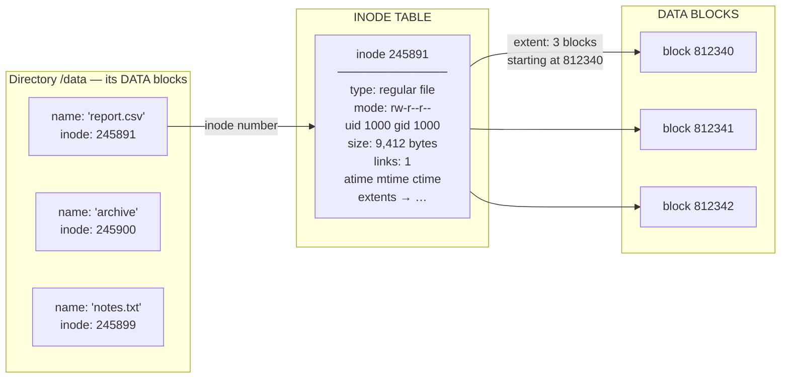
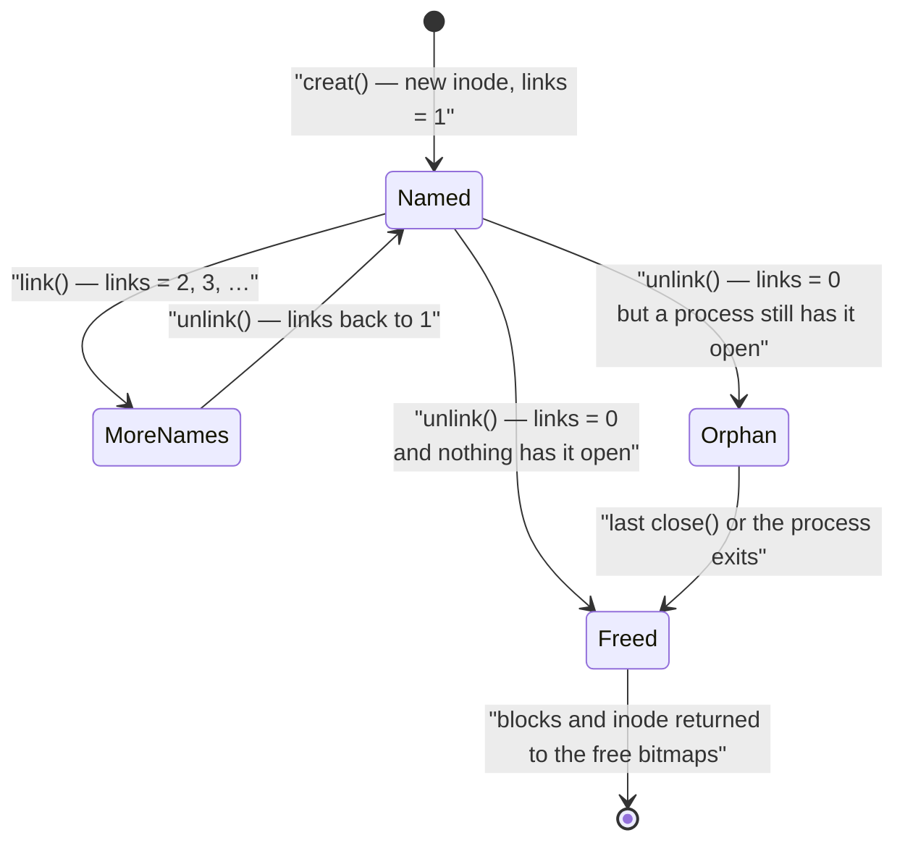
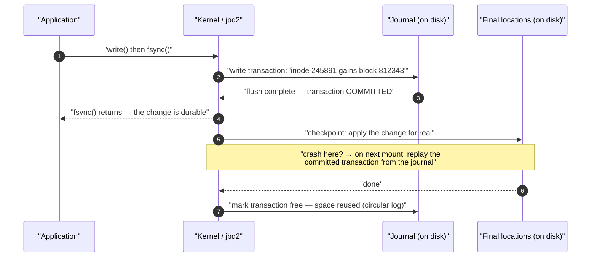
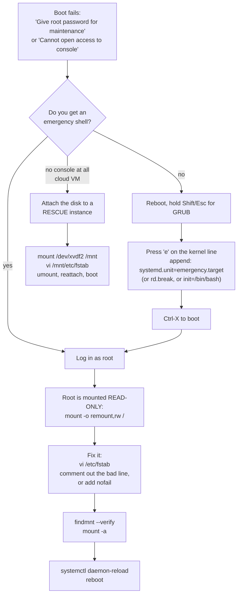

## 1 · The Big Picture

### Why this topic exists

A disk knows nothing about files. A 500 GB SSD is a numbered array of fixed-size blocks — block 0, block 1, block 122,070,311 — and it will happily hand you any one of them. It has no idea which blocks belong to `/etc/passwd`, who owns them, when they were last written, or whether they are in use at all.

A **filesystem** is the data structure that invents all of that on top of a flat array of blocks. It is the difference between "sector 4,192,301" and `open("/var/log/nginx/access.log")`.

And then there is a second problem, which is the one that trips up everybody arriving from Windows. Once you have a filesystem on a device, *where does it appear?* Windows answers with a letter: this volume is `D:`, that one is `E:`, and each gets its own separate tree. Linux answers differently and more strangely: there is exactly **one** tree, rooted at `/`, and a filesystem is **grafted into a directory** inside that tree. That grafting operation is called **mounting**, and it is the single most consequential operation in Linux system administration, because a mistake in it can make a server refuse to boot.

This chapter is about both halves: what is inside a filesystem, and how you attach one to the tree without destroying the machine.

### The real problem it solves

Suppose there were no filesystem layer. To append a line to a log file your program would need to:

- find which blocks currently hold the file, in order
- find a free block if the last one is full, and record that it is no longer free
- update the file's length somewhere durable
- do all of that without another process simultaneously claiming the same free block
- survive a power cut in the middle without corrupting the whole disk

Every one of those responsibilities lives in the filesystem. And because Linux puts a **Virtual File System (VFS)** layer above all filesystems, your program does not even need to know *which* one — the same `open`/`read`/`write`/`close` calls work on ext4, XFS, a USB stick formatted FAT32, an NFS share three racks away, and `/proc`, which is not on a disk at all.

```diagram title="Where a filesystem sits"
   your code            open("/data/report.csv")
        │
        ▼
  ┌──────────────────────────────────────────────────────────┐
  │  VFS — one API over every filesystem                      │
  │  (path walking, dentry cache, inode cache, page cache)    │
  └───┬──────────┬──────────┬───────────┬──────────┬─────────┘
      │          │          │           │          │
   ┌──▼──┐   ┌──▼──┐   ┌───▼───┐   ┌───▼────┐  ┌──▼────┐
   │ext4 │   │ XFS │   │ vfat  │   │  nfs   │  │ proc  │
   └──┬──┘   └──┬──┘   └───┬───┘   └───┬────┘  └───────┘
      └─────────┴──────────┘           │        no device —
             block layer               │        generated by
      (I/O scheduler, dm, md)          │        the kernel
                │                      │
          ┌─────▼─────┐          ┌─────▼──────┐
          │ /dev/sda1 │          │  network   │
          └───────────┘          └────────────┘
```

### Where you will encounter it

| Context | What filesystems and mounting are doing there |
|---|---|
| Provisioning any cloud VM | You attach a block volume, `mkfs` it, and add a UUID entry to `/etc/fstab` so it survives reboot |
| A server that will not boot | Nine times out of ten the cause is `/etc/fstab`: a wrong UUID, a missing device, a missing `nofail` |
| "Disk full" at 3 a.m. | `df -h`, `df -i`, `du -h --max-depth=1`, `lsof +L1` — the whole triage sequence is in this chapter |
| Every Docker container | Its writable layer is **overlayfs**; every `-v` flag is a **bind mount**; its isolation is a **mount namespace** |
| Kubernetes | `PersistentVolume` → `PersistentVolumeClaim` → a mount inside a pod; `emptyDir` is often tmpfs |
| CI runners | Caches are bind mounts; `/tmp` is frequently tmpfs, which is why builds die with "no space left on device" and `df` shows RAM |
| Hardening / compliance benchmarks | CIS requires `/tmp`, `/var/tmp` and `/dev/shm` mounted `noexec,nosuid,nodev` |
| Database performance tuning | `noatime`, journal mode, block size, and whether the WAL is on its own filesystem |
| Backup and DR | Snapshots (Btrfs/ZFS/LVM), `dump`/`fsck` passes, and knowing that XFS cannot shrink |

### Why companies care

- **Availability.** A filesystem that fills up or corrupts takes an application down, and an fstab error takes a whole host down. This is the most common self-inflicted outage in Linux estates.
- **Cost.** Storage is metered in the cloud. Knowing the difference between *apparent size* and *allocated blocks*, and being able to find the 40 GB of deleted-but-open log files, is directly money.
- **Compliance.** Encryption at rest (LUKS), mount hardening, and per-user quotas are audit line items.
- **Portability.** Containers only work because of overlayfs and bind mounts. An engineer who does not understand mounting cannot debug a volume that appears empty inside a pod.

> [!INFO]
> **Why one tree and not drive letters.** The single-root design comes straight from Unix in 1969. The reasoning was that a *path* should be a stable name for a resource, independent of which physical device happens to hold it. If `/usr` moves from one disk to another, no program changes, because no program ever encoded "disk 2" in a filename. Drive letters bake the hardware into every path — which is exactly why moving a Windows install to a bigger disk historically broke shortcuts, and why `C:\Program Files` is a permanent fixture. Linux paid for that flexibility with a harder concept to learn: mounting.

---

## 2 · Intuition First

### Analogy 1: the library

Think of a blank disk as an empty warehouse full of identical numbered shelves.

A **filesystem** is the library system you impose on it:

- The **card catalogue** is the *inode table*: one card per book, recording its size, who donated it, when it was last read, and which shelves hold it. **The card does not contain the book's title.**
- The **shelf labels on the wall** — "Fiction / Aisle 3" — are *directories*: lists that map a human-readable name to a catalogue card number.
- The **books themselves** are the *data blocks*.
- The **noticeboard by the entrance**, listing how big the library is, how many cards exist, how many shelves are free and whether the library was closed properly last night, is the *superblock*.
- The **day-book at the front desk**, where a librarian writes "about to move book #4471 from aisle 3 to aisle 9" *before* doing it, is the *journal*. If the lights go out mid-move, the next librarian reads the day-book and finishes or undoes the job.

That one analogy predicts almost every behaviour in this chapter. Two shelf labels can point at the same catalogue card — that is a **hard link**. Removing a shelf label does not destroy the book; the book is only pulped when the last label referring to its card is gone. You can run out of catalogue cards while shelves are still empty — that is **inode exhaustion**, and it is a real production outage.

### Analogy 2: mounting is grafting

```diagram title="Mounting: two trees become one"
   BEFORE                                     AFTER
                                              mount /dev/sdb1 /data
   /                    /dev/sdb1             /
   ├── etc              (a formatted          ├── etc
   ├── home             filesystem,           ├── home
   ├── var              nobody can            ├── var
   └── data  ← empty    reach it yet)         └── data   ← the root of sdb1
       (on /dev/sda2)   ┌─────────────┐           ├── reports/
                        │ reports/    │           ├── archive/
                        │ archive/    │           └── notes.txt
                        │ notes.txt   │
                        └─────────────┘       one tree, two devices,
                                              and no path says "sdb1"
```

The directory you mount onto is the **mount point**. After mounting, `/data` no longer means "that empty directory on the root filesystem" — it means "the root of the filesystem on `/dev/sdb1`". Anything that was inside `/data` beforehand is still there on the root filesystem, but it is *hidden* until you unmount. That shadowing behaviour is the cause of one of the classic "df says full, du says empty" mysteries later in this chapter.

### Analogy 3: a symbolic link is a sticky note

A **hard link** is a second shelf label pointing at the same catalogue card. Both labels are equally real; neither is "the original".

A **symbolic link** is a sticky note that says *"the book you want is in Aisle 7, Shelf 4."* The note is a real object with its own catalogue card, but its entire content is a piece of text — a path. If the book moves or is destroyed, the note still exists and still says Aisle 7; following it just fails.

> [!MEMORY]
> **"Hard links share a soul; symlinks share an address."** A hard link is another name for the same inode. A symlink is a tiny file whose *data* is a path string.

---

## 3 · Technical Definitions

Now the precise versions.

<dl>
<dt>Block (or logical block)</dt>
<dd>The smallest unit of space a filesystem will allocate, chosen when the filesystem is created. On ext4 the default is <strong>4096 bytes (4 KiB)</strong>. Underneath it, the disk exposes 512-byte or 4096-byte hardware <em>sectors</em>; the filesystem block is a multiple of those. A one-byte file still consumes a whole block.</dd>

<dt>Superblock</dt>
<dd>A fixed structure holding metadata <em>about the filesystem itself</em>: total size, block size, block and inode counts, free counts, the UUID and label, feature flags, mount count, last-mounted time, last-checked time, and the clean/dirty state. On ext filesystems the primary superblock sits 1024 bytes from the start of the device, and <strong>backup copies</strong> are scattered through the volume so a damaged primary can be recovered.</dd>

<dt>Inode (index node)</dt>
<dd>The per-file metadata record: file type and permission bits, owner UID, group GID, size in bytes, link count, timestamps, and pointers (or extents) locating the file's data blocks. Every file, directory, symlink, device node, socket and FIFO has exactly one inode, identified by an <strong>inode number</strong> unique within that filesystem. An inode does <strong>not</strong> contain the filename.</dd>

<dt>Directory entry (dentry)</dt>
<dd>A record inside a directory's data that maps a <strong>name</strong> to an <strong>inode number</strong>. A directory is therefore just a file whose contents are a list of such records. Names live here, not in inodes.</dd>

<dt>Journal</dt>
<dd>An on-disk circular log of intended changes, written and flushed <em>before</em> the changes are applied to their final locations. After a crash, the filesystem replays or discards incomplete transactions, restoring metadata consistency in seconds rather than hours.</dd>

<dt>Mounting</dt>
<dd>Attaching a filesystem's root directory to an existing directory in the running tree, so its contents become reachable through that path. Performed by the <code>mount(2)</code> system call, exposed as the <code>mount</code> command and driven at boot from <code>/etc/fstab</code>.</dd>

<dt>Mount point</dt>
<dd>The directory at which a filesystem is attached. It must exist. Its previous contents are hidden while something is mounted over it.</dd>

<dt>Block device</dt>
<dd>A device file (in <code>/dev</code>) representing storage addressable in fixed-size blocks with random access and kernel buffering — <code>/dev/sda</code>, <code>/dev/sdb1</code>, <code>/dev/nvme0n1p2</code>, <code>/dev/mapper/vg0-lv_data</code>. Contrast a <strong>character device</strong> (<code>/dev/tty</code>, <code>/dev/random</code>), which is a byte stream with no block addressing.</dd>

<dt>Filesystem Hierarchy Standard (FHS)</dt>
<dd>The specification (currently FHS 3.0, maintained by the Linux Foundation) that defines what belongs in each top-level directory, so that software and administrators can rely on a predictable layout across distributions.</dd>
</dl>

> [!EXAM]
> Three one-mark answers that appear constantly:
>
> - **An inode is a data structure that stores a file's metadata — permissions, owner, group, size, timestamps and pointers to its data blocks — but not its name.**
> - **The superblock stores metadata about the filesystem as a whole** (size, block size, inode count, free space, state, UUID), and has **backup copies**.
> - **The default ext4 block size is 4096 bytes (4 KiB).**

---

## 4 · The Single Tree and the FHS

### The tree

```diagram title="A Linux root filesystem, FHS 3.0"
/                        the root of everything. One tree, always.
├── bin  → usr/bin       essential user commands (ls, cp, cat, bash)
├── sbin → usr/sbin      essential system commands (fsck, ip, mount)
├── lib  → usr/lib       essential shared libraries + kernel modules
├── lib64 → usr/lib64    64-bit libraries (on multilib distros)
│
├── boot                 kernel (vmlinuz-*), initramfs, GRUB config
│   └── efi              the EFI System Partition, vfat, mounted here
│
├── etc                  ALL host-specific configuration. Text files.
│   ├── fstab            what to mount at boot          ← this chapter
│   ├── mtab → /proc/self/mounts   what IS mounted now
│   ├── exports          NFS shares this host offers
│   ├── crypttab         LUKS volumes to unlock at boot
│   └── systemd/, ssh/, nginx/, ...        NO binaries live in /etc
│
├── home                 ordinary users' home directories
│   ├── alice
│   └── bob
├── root                 the root user's home. NOT /home/root.
│
├── usr                  shareable, read-only program data ("the OS")
│   ├── bin              nearly every executable on a modern system
│   ├── sbin             system executables
│   ├── lib, lib64       libraries, /usr/lib/modules/<kver>/
│   ├── share            architecture-independent data: man pages,
│   │                    icons, locales, /usr/share/doc
│   ├── include          C headers
│   ├── src              kernel and library source
│   └── local            software YOU installed, not the package
│       ├── bin          manager. Same layout again, one level down.
│       ├── lib          `make install` defaults here (/usr/local).
│       └── share        Package managers never touch it.
│
├── var                  VARIABLE data that grows while running
│   ├── log              logs — journald, syslog, nginx, app logs
│   ├── lib              application state: databases, dpkg, docker
│   ├── cache            regenerable caches (apt archives)
│   ├── spool            queues: mail, cron, print
│   ├── tmp              temp files that MUST survive a reboot
│   └── www              (Debian tradition) web content
│
├── tmp                  scratch space. World-writable + sticky bit
│                        (1777). Cleared at boot; often tmpfs = RAM.
│
├── opt                  self-contained third-party packages, each in
│                        its own /opt/<vendor> or /opt/<product> dir
├── srv                  data this server SERVES: /srv/www, /srv/ftp
│
├── mnt                  a spare hook for YOU to mount things by hand
├── media                where the desktop auto-mounts removable media
│                        (/media/alice/USB-STICK)
│
├── dev                  device files. devtmpfs, kernel-populated.
│   ├── sda, sda1, nvme0n1p1     block devices
│   ├── null, zero, random       character devices
│   ├── shm                      tmpfs for POSIX shared memory
│   └── disk/by-uuid/…           stable symlinks    ← this chapter
├── proc                 procfs. Processes + kernel state as files.
│   ├── mounts → self/mounts     the kernel's real mount table
│   ├── swaps                    active swap areas
│   └── 1/, 2410/, …             one directory per PID
├── sys                  sysfs. Kernel objects, devices, tunables.
│   └── block/sda/size, /sys/fs/ext4/…
├── run                  tmpfs. Runtime state since boot: PID files,
│                        sockets. Replaces the old /var/run.
│
└── lost+found           per-filesystem. fsck puts recovered files
                         with no directory entry here.
```

### What actually belongs where — and the tests that catch people out

| Path | Contents | The distinguishing rule |
|---|---|---|
| `/` | The root filesystem | Must contain everything needed to boot and repair the system before other filesystems are mounted |
| `/bin`, `/sbin`, `/lib` | Essential commands and libraries | Historically had to work before `/usr` was mounted. On modern distros these are **symlinks into `/usr`** |
| `/usr` | The operating system's programs and data | Shareable and treated as read-only at runtime. Nothing host-specific |
| `/usr/bin` vs `/bin` | Same directory now | The `/usr` merge — see below |
| `/usr/local` | Software *you* installed by hand or from source | The package manager must never write here. `./configure` defaults to `--prefix=/usr/local` |
| `/etc` | Host-specific configuration, plain text | **No binaries.** If two machines differ, the difference is almost always in `/etc` |
| `/home` | User data | Frequently its own filesystem or an NFS mount so it survives a reinstall |
| `/root` | root's home directory | Deliberately on `/`, not `/home`, so root can log in when `/home` fails to mount |
| `/var` | Data that changes as the system runs | The filesystem most likely to fill up. Give it its own volume on servers |
| `/var/log` | Logs | Where the 3 a.m. disk-full page comes from |
| `/var/tmp` | Temporary files that **must survive a reboot** | Contrast `/tmp` |
| `/tmp` | Temporary files that need not survive | Cleared at boot (or is tmpfs). Mode `1777` — sticky bit, so users cannot delete each other's files (Chapter 13) |
| `/opt` | Add-on application packages | Self-contained vendor trees: `/opt/google/chrome`, `/opt/splunk`. Not FHS-managed internally |
| `/srv` | Data served *by* this host | `/srv/www`, `/srv/git`. Rarely used on Debian/Ubuntu, which prefer `/var/www` |
| `/mnt` | Temporary manual mounts | For an administrator, right now, by hand |
| `/media` | Removable media | Automatic mounts by the desktop: `/media/<user>/<label>` |
| `/dev` | Device nodes | A `devtmpfs`, populated by the kernel and managed by `udev`. Nothing here is on disk |
| `/proc` | Process and kernel information | A `procfs`. Generated on read. `df` reports it as 0 bytes |
| `/sys` | Kernel object model | A `sysfs`. Where you read and write device and kernel tunables |
| `/run` | Runtime state since boot | A `tmpfs` — **RAM**. Empty at every boot by design |
| `/boot` | Kernel, initramfs, bootloader | Often a small separate partition; `/boot/efi` is the vfat EFI System Partition |
| `/lost+found` | Orphaned inodes after a repair | **One per ext filesystem**, at its root — so `/lost+found`, `/home/lost+found`, `/var/lost+found` all exist if those are separate ext filesystems |

> [!INFO]
> **The `/usr` merge.** Originally `/bin` held the handful of tools needed to boot and repair a machine before `/usr` (potentially a separate or network-mounted disk) was available, and `/usr/bin` held everything else. Initramfs made that split pointless: the initramfs now contains everything needed to reach the point where all local filesystems are mounted. So distributions merged them — Fedora from version 17 (2012), Arch in 2013, Debian from 11 and mandatory from 12, Ubuntu from 19.04. Today `/bin` is a symlink to `usr/bin`, `/sbin` to `usr/sbin`, `/lib` to `usr/lib`. Verify it yourself:
>
> ```console
> $ ls -ld /bin /sbin /lib
> lrwxrwxrwx 1 root root 7 Apr 22 09:14 /bin -> usr/bin
> lrwxrwxrwx 1 root root 8 Apr 22 09:14 /sbin -> usr/sbin
> lrwxrwxrwx 1 root root 7 Apr 22 09:14 /lib -> usr/lib
> ```
>
> The consequence: `/usr` can no longer be a separate filesystem mounted late, because the whole OS lives there. It must be on the root filesystem or mounted from the initramfs.

> [!MEMORY]
> **Three temporary directories, three lifetimes.** `/tmp` = gone at reboot (often RAM). `/var/tmp` = survives reboot. `/run` = RAM, gone at reboot, for *runtime state* (sockets, PID files) rather than user scratch.

> [!MISTAKE]
> **Installing software into `/usr/bin` by hand.** The package manager owns that directory and will overwrite or conflict with your file on the next upgrade. Hand-installed software goes in `/usr/local/bin` (or `/opt`), which is exactly why `/usr/local` exists and why it is in your `PATH` ahead of `/usr/bin` on most distributions.

---

## 5 · Internal Working — What a Filesystem Actually Is

This section is the heart of the chapter. Everything about links, deletion, permissions and mysterious full disks falls out of it.

### The layout of an ext4 filesystem

```diagram title="On-disk layout (ext4, simplified)"
byte 0                                                        end of device
├──────┬───────────────────────┬───────────────────────┬─────────────────┤
│ boot │   BLOCK GROUP 0       │   BLOCK GROUP 1       │  BLOCK GROUP n  │
│ 1 KiB│                       │                       │                 │
└──────┴───────────────────────┴───────────────────────┴─────────────────┘
          │
          ▼  inside one block group
  ┌────────────┬──────────────┬────────┬────────┬──────────────┬────────────┐
  │ SUPERBLOCK │  group       │ block  │ inode  │ INODE TABLE  │ DATA       │
  │ (or backup)│  descriptors │ bitmap │ bitmap │ n × 256 bytes│ BLOCKS     │
  └────────────┴──────────────┴────────┴────────┴──────────────┴────────────┘
    "how big am    where every    which    which     one record     the file
     I, how many   structure      blocks   inodes    per file       contents
     inodes, am    lives          are      are
     I clean?"                    free     free

  Plus, somewhere in the data area: the JOURNAL (a hidden file, inode 8,
  up to ~128 MiB on a large filesystem).
  Reserved inodes: 2 = the root directory "/",  8 = journal,  11 = lost+found
```

Two structures do the heavy lifting, and they are the two the quiz bank asks about.

**The superblock** answers "what kind of filesystem is this, and is it healthy?" It is small, it is read at mount time, and if it is destroyed the kernel cannot mount the filesystem at all. Which is why ext filesystems keep backups — `mkfs.ext4` prints their locations:

```console
$ sudo mkfs.ext4 /dev/sdb1
mke2fs 1.47.0 (5-Feb-2023)
Creating filesystem with 26214144 4k blocks and 6553600 inodes
Filesystem UUID: 9e8d7c6b-5a4f-3e2d-1c0b-9a8b7c6d5e4f
Superblock backups stored on blocks:
        32768, 98304, 163840, 229376, 294912, 819200, 884736, 1605632,
        2654208, 4096000, 7962624, 11239424, 20480000, 23887872

Allocating group tables: done
Writing inode tables: done
Creating journal (131072 blocks): done
Writing superblocks and filesystem accounting information: done
```

Keep that output. If the primary superblock is later damaged, you recover with a backup:

```bash
sudo e2fsck -b 32768 /dev/sdb1     # use the backup superblock at block 32768
```

**The inode table** is a fixed-size array of records, one per possible file, laid down at `mkfs` time and never grown. That last clause is important enough to be a section of its own later: **you cannot add inodes to an existing ext4 filesystem.**

### The three-hop lookup: name → inode → blocks



Reading `/data/report.csv` therefore means: read the inode of `/`, find the entry named `data`, read *that* inode, read its data blocks to find the entry named `report.csv`, read inode 245891, then read the blocks it points at. Every path component is one lookup, which is why the kernel aggressively caches dentries and inodes in RAM.

### Six consequences that only make sense once you know the above

1. **Renaming a file is nearly free.** `mv old.txt new.txt` within one directory rewrites one directory entry. The inode and every data block are untouched — which is why renaming a 40 GB file is instant, while moving it to a *different filesystem* is a full copy plus delete.

2. **You can delete a file you do not own and cannot write.** Deleting means removing a name from a *directory*, so the permission checked is **write + execute on the containing directory**, not on the file. This is precisely why `/tmp` needs the sticky bit (Chapter 13).

3. **Hard links are not copies and have no "original".**

```diagram title="Hard link vs symbolic link"
  HARD LINK                              SYMBOLIC LINK
  ln original.txt hard.txt               ln -s original.txt soft.txt

  directory /data                        directory /data
  ┌───────────────┬────────┐             ┌───────────────┬────────┐
  │ "original.txt"│ 245891 │             │ "original.txt"│ 245891 │
  │ "hard.txt"    │ 245891 │             │ "soft.txt"    │ 245902 │
  └───────────────┴────────┘             └───────────────┴────────┘
             │       │                              │        │
             └───┬───┘                              │        └──┐
                 ▼                                  ▼           ▼
       ┌────────────────────┐        ┌────────────────────┐  ┌────────────┐
       │ inode 245891       │        │ inode 245891       │  │inode 245902│
       │ links = 2          │        │ links = 1          │  │type=symlink│
       │ mode, uid, size    │        │                    │  │data =      │
       │ → data blocks      │        │ → data blocks      │  │"original.  │
       └────────────────────┘        └────────────────────┘  │ txt"       │
                                            ▲                └─────┬──────┘
       Both names are equally real.         └──────resolved at──────┘
       rm either one → links = 1,                   every access
       data survives.
                                          Delete original.txt and the
       Cannot cross filesystems.          symlink still exists but is
       Cannot (normally) link a dir.      BROKEN — "No such file or
       Same inode number in `ls -i`.      directory" when followed.
```

4. **A file is destroyed only when its link count hits zero *and* no process has it open.** `unlink()` removes a directory entry and decrements `i_nlink`. If that reaches 0 the kernel checks the in-memory open count; if any file descriptor still refers to the inode, the blocks stay allocated and the file continues to exist with **no name at all**. It disappears when the last descriptor closes. This is the mechanism behind the `df`/`du` mismatch in section 13, and also behind the standard Unix trick for temporary files: create, open, unlink immediately, keep using the descriptor, and the kernel cleans up even if you crash.

5. **Symlinks can point anywhere, including nowhere.** Because their content is just a path string, a symlink may cross filesystems, point at a directory, point at a path that does not exist yet, or point at itself. The kernel limits chained resolution (40 links) to stop loops.

6. **Inodes are finite, and running out of them looks exactly like running out of space.**



### Inode exhaustion: full with free space

`mkfs.ext4` allocates one inode per 16 KiB of space by default (the `inode_ratio` in `/etc/mke2fs.conf`). A 100 GB filesystem therefore gets roughly 6.5 million inodes. If your workload is a mail spool, a Squid cache, a session store, or a CI runner that writes millions of 200-byte files, you will exhaust inodes long before you exhaust blocks:

```console
$ df -h /var/spool
Filesystem      Size  Used Avail Use% Mounted on
/dev/sdb1        98G   31G   62G  34% /var/spool

$ df -i /var/spool
Filesystem      Inodes   IUsed IFree IUse% Mounted on
/dev/sdb1      6553600 6553600     0  100% /var/spool
```

The application reports `No space left on device` (`ENOSPC`) while `df -h` cheerfully shows 62 GB free. There is no online fix — you cannot add inodes to an ext4 filesystem. Your options are: delete files, or back up, `mkfs` again with `-i 4096` (or `-N <count>`), and restore. XFS avoids this by allocating inodes dynamically, which is one of the strongest arguments for XFS on mail and cache servers.

> [!PROD]
> Monitor `df -i` alongside `df -h`. Every mature monitoring setup alerts on **both** block usage and inode usage. Teams that only alert on `df -h` get paged by the application, not by the monitoring system.

### Reading the metadata: `ls -i` and `stat`

```console
$ ls -li /data
total 16
245891 -rw-r--r-- 2 alice devs  9412 Jul 30 14:02 report.csv
245891 -rw-r--r-- 2 alice devs  9412 Jul 30 14:02 report-hardlink.csv
245902 lrwxrwxrwx 1 alice devs    10 Jul 31 09:15 report-link.csv -> report.csv
245900 drwxr-xr-x 2 alice devs  4096 Jul 29 11:40 archive
```

Read it as evidence: the first two entries share **inode 245891** and both show a link count of **2** — they are hard links to one file. The third has its own inode, type `l`, a size of **10 bytes** (exactly the length of the string `report.csv`), and permissions `lrwxrwxrwx`, which are meaningless on a symlink because access is always checked on the target.

`stat` is the full dump, and interviewers do ask you to read it:

```console
$ stat /data/report.csv
  File: /data/report.csv
  Size: 9412            Blocks: 24         IO Block: 4096   regular file
Device: 8,17    Inode: 245891      Links: 2
Access: (0644/-rw-r--r--)  Uid: ( 1000/   alice)   Gid: ( 1000/    devs)
Access: 2026-07-31 09:12:44.118273401 +0000
Modify: 2026-07-30 14:02:19.884120067 +0000
Change: 2026-07-30 14:02:19.884120067 +0000
 Birth: 2026-07-28 08:40:02.551009882 +0000
```

| Field | Value here | Meaning |
|---|---|---|
| `Size` | `9412` | **Apparent size** in bytes — the logical length of the file |
| `Blocks` | `24` | Allocated **512-byte** units = 12 KiB of real disk. Three 4 KiB filesystem blocks |
| `IO Block` | `4096` | The filesystem block size — the preferred I/O granularity |
| type | `regular file` | Or `directory`, `symbolic link`, `block special file`, `character special file`, `fifo`, `socket` |
| `Device` | `8,17` | Major 8 (SCSI/SATA disk), minor 17 → `/dev/sdb1`. Two files on different devices can share an inode number |
| `Inode` | `245891` | The inode number, unique **within this filesystem only** |
| `Links` | `2` | Hard link count. For a directory this is 2 + number of subdirectories (`.`, the parent's entry, and each child's `..`) |
| `Access:` (perms) | `0644/-rw-r--r--` | Mode in octal and symbolic form, plus owner and group with both numeric and resolved names |
| **A**ccess time | 09:12:44 | Last time the contents were **read** — the timestamp `noatime` suppresses |
| **M**odify time | 14:02:19 | Last time the **contents** changed. This is what `ls -l` shows |
| **C**hange time | 14:02:19 | Last time the **inode** changed — including `chmod`, `chown`, rename, link count. **Not** creation time |
| Birth time | 08:40:02 | Creation time. Stored by ext4/XFS/Btrfs, exposed via `statx`; shows `-` on filesystems that lack it |

> [!MISTAKE]
> **"ctime is creation time."** It is **change time** — the inode's last modification. `chmod` bumps ctime without touching mtime. Backup tools that key on ctime therefore re-copy files whose permissions changed but whose contents did not. The actual creation time is *birth time*, and it is a relatively recent addition that many tools still cannot read.

---

## 6 · Journaling

### The problem

Appending one block to a file requires several independent writes: mark a block used in the block bitmap, add the block to the inode's extent list, update the inode's size and mtime, update the free-block counter in the group descriptor. A power cut between any two of them leaves the filesystem *inconsistent* — a block marked used but belonging to no file (a leak), or worse, a block claimed by two files (silent corruption).

Without a journal, the only recovery is to walk every inode and every bitmap in the entire filesystem and cross-check them. On a 2 TB disk that is hours, and the machine is down the whole time. That is what `fsck` on ext2 does, and it is why servers used to take twenty minutes to boot after a crash.

### The solution

Write your intentions to a dedicated log first, flush it, *then* do the real work. If you crash before the log entry is complete, the transaction never happened. If you crash after the log entry is complete but before the real work finished, replay the log and finish it. Either way the filesystem is consistent.



### The three ext4 journal modes

Set with the `data=` mount option, or as a default with `tune2fs -o`.

| Mode | What is journalled | Crash behaviour | Speed | When to use |
|---|---|---|---|---|
| `data=journal` | **Metadata and file data** both go through the journal | Strongest. Both metadata and data are consistent | Slowest — every byte is written twice | Financial/medical data where a torn write is unacceptable; also required for some `dax`-free integrity setups |
| `data=ordered` | Metadata only, but data blocks are **forced to disk before** the metadata transaction commits | Metadata consistent; you never see another file's old data in yours | Good — **the default** | Almost everything |
| `data=writeback` | Metadata only, **no ordering** between data and metadata | Metadata consistent, but a recently extended file may contain **stale blocks — old, unrelated data or garbage** | Fastest | Scratch space, build directories, caches you would rebuild anyway |

The subtle one is `writeback`. The metadata says "inode 245891 now owns block 812343" and that survives the crash, but the write of the *content* into block 812343 did not. So you read your file and get whatever was in that block before — possibly a fragment of a deleted file belonging to another user. That is both a correctness and a security problem, which is why `ordered` is the default.

> [!EXAM]
> `ordered` is the ext4 default. Memorise the one-line distinction: **`journal` = data + metadata journalled; `ordered` = metadata journalled, data written first; `writeback` = metadata journalled, no ordering, may expose stale data after a crash.**

### Why `fsck` is fast on a journalling filesystem

After an unclean shutdown, mounting an ext4 filesystem replays the journal — a sequential read of at most a few hundred megabytes — and the filesystem is consistent again. `fsck` at boot sees a clean state flag and exits in under a second. It performs a **full** structural scan only when you force it (`-f`), when the mount count or check interval set by `tune2fs -c`/`-i` is exceeded, or when the superblock says the filesystem was not cleanly unmounted and the journal itself is damaged.

A journal guarantees **metadata consistency**, not that your data is intact. It will not recover a file the application never flushed, and it will not fix a lying disk cache or bad hardware. For data integrity you need **checksums** — which is what Btrfs and ZFS add, and ext4/XFS do not (ext4 checksums metadata and the journal, not file data).

### Which filesystems journal

| Journalling | Copy-on-write instead of a journal | No journal at all |
|---|---|---|
| ext3, ext4, XFS, JFS, ReiserFS, NTFS (`$LogFile`) | Btrfs, ZFS (plus the ZIL intent log) | ext2, FAT16/FAT32, exFAT, ISO9660, UDF, tmpfs, squashfs |

> [!EXAM]
> "Which of these is a **journalling filesystem native to Linux**?" — the intended answer is **ext4** (ext3 and XFS are equally correct). NTFS journals but is not native to Linux; FAT32 and ext2 do not journal at all.

---

## 7 · Filesystem Types

### The full comparison

Limits below are the *on-disk* maxima with default settings; vendors support less (Red Hat supports ext4 to 50 TiB and XFS to 1 PiB, for example).

| Filesystem | Journal? | Max file | Max volume | Native to Linux? | Shrink? | Snapshots? | Data checksums? | Typical use |
|---|---|---|---|---|---|---|---|---|
| **ext2** | ✘ | 2 TiB | 16 TiB | ✔ | ✔ (offline) | ✘ | ✘ | Small `/boot`, USB sticks where journal writes hurt flash |
| **ext3** | ✔ | 2 TiB | 16 TiB | ✔ | ✔ (offline) | ✘ | ✘ | Legacy only; superseded by ext4 |
| **ext4** | ✔ | 16 TiB | 1 EiB | ✔ | ✔ (offline only) | ✘ | ⚠ metadata only | **The safe default.** Ubuntu/Debian default |
| **XFS** | ✔ | 8 EiB | 8 EiB | ✔ | ✘ **never** | ✘ | ⚠ metadata only | **RHEL/CentOS/Rocky default.** Large files, parallel I/O, mail and cache servers |
| **Btrfs** | CoW | 16 EiB | 16 EiB | ✔ | ✔ (online) | ✔ | ✔ | Snapshots, subvolumes, built-in RAID. Fedora and openSUSE default |
| **ZFS (OpenZFS)** | CoW + ZIL | 16 EiB | 256 ZiB pool | ⚠ out-of-tree (CDDL) | ✘ (no classic shrink) | ✔ | ✔ | Storage servers, NAS, `send`/`recv` replication |
| **FAT32 (`vfat`)** | ✘ | **4 GiB − 1 byte** | 2 TiB (Windows formats ≤ 32 GB) | ✘ | ✘ | ✘ | ✘ | USB sticks, SD cards, the EFI System Partition |
| **exFAT** | ✘ | 16 EiB | 128 PiB | ✘ (in-tree driver since 5.4) | ✘ | ✘ | ✘ | Large USB drives and SD cards needing >4 GB files cross-platform |
| **NTFS** | ✔ | 16 TiB | 256 TiB | ✘ (`ntfs3` in-tree since 5.15; `ntfs-3g` FUSE before) | ⚠ from Windows | ✘ (VSS) | ✘ | Reading Windows disks and dual-boot data partitions |
| **ISO9660** | ✘ (read-only) | ~4 GiB | 8 TiB | ✔ (read) | n/a | n/a | ✘ | CD/DVD images; every Linux install ISO |
| **UDF** | ✘ | 16 EiB | very large | ✔ | n/a | ✘ | ✘ | DVD/Blu-ray, and optical/removable media needing >4 GB files |
| **tmpfs** | n/a | RAM + swap | 50% of RAM by default | ✔ | ✔ (`remount,size=`) | ✘ | n/a | `/run`, `/dev/shm`, fast scratch. **Contents vanish on reboot** |
| **swap** | n/a | n/a | n/a | ✔ | n/a | n/a | n/a | Not a filesystem — a paging area (`mkswap`, `swapon`) |
| **NFS** | server's | server's | server's | ✔ (client + server) | n/a | server's | ✘ | Shared home directories, shared application data |
| **overlayfs** | lower's | lower's | lower's | ✔ | n/a | ✘ (but layers are cheap) | ✘ | **Every container's writable layer** |
| **squashfs** | ✘ (read-only) | 16 EiB | 16 EiB | ✔ | n/a | n/a | ✘ | Compressed read-only images: Snap packages, live ISOs, embedded |
| **procfs** | n/a | 0 | 0 | ✔ | n/a | n/a | n/a | `/proc` — process and kernel state as files |
| **sysfs** | n/a | 0 | 0 | ✔ | n/a | n/a | n/a | `/sys` — kernel object model and device tunables |

### The practical guidance

**ext4 is the safe default.** It is the most tested, most documented and most widely deployed filesystem on Linux. Every recovery tool understands it, every forum answer assumes it, and you can grow it online and shrink it offline. If you have no specific reason to choose otherwise, choose ext4.

**XFS is the RHEL default, and it cannot shrink.** XFS was designed at SGI in 1993 for large-scale parallel I/O, and it is excellent at it: dynamically allocated inodes (so no inode exhaustion), delayed allocation, extremely good performance with many concurrent writers and with large files. The catch is structural: XFS divides the volume into fixed **allocation groups** and stores metadata references that assume the volume never gets smaller. There is no code to relocate metadata out of the tail of the device, so `xfs_growfs` exists and a shrink command does not — and will not. To make an XFS filesystem smaller, you back it up (`xfsdump`), recreate it (`mkfs.xfs`) and restore (`xfsrestore`).

> [!DANGER]
> **Choosing XFS for a volume you might later shrink is a decision you cannot undo online.** If you are laying out LVM logical volumes and expect to rebalance space between them later, use ext4 — `resize2fs` can shrink it (unmounted). With XFS, over-provisioning a logical volume is permanent until you dump and restore.

**Btrfs and ZFS when you want snapshots and checksums.** Both are copy-on-write: they never overwrite a live block, so a snapshot is just a second reference to the current tree — instant, and initially free of space cost. Both checksum *data* as well as metadata, so they detect silent corruption ("bit rot") rather than serving it to you. ZFS is not in the mainline kernel because its CDDL licence is considered incompatible with GPLv2, so it ships as an out-of-tree module (`zfs-dkms`); Btrfs is in-tree and is the default on Fedora Workstation and openSUSE.

**FAT32 and exFAT for cross-platform removable media.** These are the two filesystems that Windows, macOS and Linux can all read and write without extra software, which is why the answer to "which filesystem for a USB stick you will hand to a colleague?" is FAT32 — with one enormous caveat:

> [!WARNING]
> **FAT32 cannot hold a file larger than 4 GiB minus one byte.** The size field in the directory entry is 32 bits. Copying a 6 GB video to a FAT32 stick fails with a confusing error. Use **exFAT** for larger files — it is equally cross-platform on any current OS and has been in the mainline Linux kernel since 5.4. FAT32's other limitations: no Unix permissions or ownership at all (you fake them at mount time with `uid=`, `gid=`, `umask=`), no symlinks, no journal, and case-insensitive filenames.

**FAT32 is also mandatory for one thing on Linux:** the EFI System Partition. UEFI firmware can only read FAT, so `/boot/efi` is `vfat` on every UEFI machine.

**overlayfs, because you already depend on it.** An overlay filesystem stacks a read-only **lowerdir** under a writable **upperdir** and presents a single merged view. Reads come from the upper layer if present, otherwise the lower. The first write to a lower-layer file triggers a **copy-up**: the whole file is copied into the upper layer and modified there. Deleting a lower-layer file creates a **whiteout** marker in the upper layer.

```diagram title="overlayfs — what a container filesystem actually is"
                 merged view (what the container sees)
   ┌──────────────────────────────────────────────────────────────┐
   │  /etc/nginx/nginx.conf   (your edit)                          │
   │  /usr/sbin/nginx         (from the image)                     │
   │  /var/log/nginx/         (written at runtime)                 │
   └──────────────────────────────────────────────────────────────┘
             ▲                              ▲
   upperdir  │  writable, per container     │  lowerdir(s), read-only,
   ──────────┴──────────────────────────    │  SHARED between every
   │ nginx.conf  (copied up on write)  │    │  container from this image
   │ var/log/nginx/access.log          │    │  ┌──────────────────────┐
   │ .wh.unwanted-file  ← whiteout     │    └──│ layer 3: COPY app     │
   └───────────────────────────────────┘       │ layer 2: apt install  │
                                              │ layer 1: debian:12    │
   `docker run` on one image 50 times =        └──────────────────────┘
   50 tiny upperdirs, one shared lowerdir.
```

That is the whole reason a container starts in milliseconds and why 50 containers from one image do not use 50× the disk. Chapter 19 covers it as a container topic; here, note only that `mount -t overlay` is a normal mount you can do by hand, and that `docker run -v /host/path:/container/path` is a **bind mount** — the mechanism in section 9.

**tmpfs, because `/run` and `/dev/shm` are RAM.** A tmpfs lives in the page cache, backed by swap if pressure demands it. It is fast, it is volatile, and its size counts against your memory:

```console
$ df -hT | grep tmpfs
tmpfs          tmpfs     1.6G  2.1M  1.6G   1% /run
tmpfs          tmpfs     7.7G     0  7.7G   0% /dev/shm
tmpfs          tmpfs     5.0M     0  5.0M   0% /run/lock
tmpfs          tmpfs     1.6G  116K  1.6G   1% /run/user/1000
```

If your CI job writes 6 GB into a tmpfs `/tmp`, you have consumed 6 GB of RAM, and the OOM killer — not `df` — is what will notice.

### The case-sensitivity taxonomy

The quiz bank asks "which filesystem is case-sensitive but not case-preserving?" Two independent properties are involved, and they are worth separating properly:

- **Case-sensitive** — `File.txt` and `file.txt` are two different files.
- **Case-preserving** — the filesystem stores the capitalisation you typed.

| Behaviour | Filesystems | Example |
|---|---|---|
| Case-**sensitive** and case-preserving | ext2/3/4, XFS, Btrfs, ZFS (default), NFS, UFS | `File.txt` and `file.txt` coexist |
| Case-**insensitive** and case-preserving | NTFS (as used by Windows), exFAT, FAT32 with long filenames, HFS+/APFS by default, SMB shares | You see `MyFile.TXT`; `myfile.txt` opens it |
| Case-**insensitive** and **not** preserving | Original FAT 8.3 short names, ISO 9660 Level 1 | You save `Report.txt`, it becomes `REPORT.TXT` |
| Case-**sensitive** and **not** preserving | — | Does not exist in any mainstream filesystem |

> [!WARNING]
> **A flawed source question, flagged.** "Case-sensitive but not case-preserving" describes a filesystem that would distinguish `A` from `a` while refusing to remember which one you wrote — a self-contradictory combination that no real filesystem implements. Quiz banks that ask this normally expect **FAT/FAT32 (8.3 short names)** as the answer, but that combination is case-*insensitive* and non-preserving. Learn the table above; if you meet the question in an exam, answer **FAT (8.3)** and be ready to explain why the wording is wrong. The genuinely useful facts are: **Linux native filesystems are case-sensitive; Windows and macOS filesystems are normally case-insensitive but case-preserving** — which is exactly why code that imports `./Utils` works on a Mac and fails on a Linux build agent.

---

## 8 · Practical Demonstration I — Creating a Filesystem

### `mkfs` — the dispatcher

`mkfs` itself does almost nothing. It is a front end that looks at `-t <type>` and executes `mkfs.<type>`, passing everything else through. These three lines are equivalent:

```bash
mkfs -t ext4 /dev/sdb1
mkfs.ext4 /dev/sdb1
mke2fs -t ext4 /dev/sdb1
```

Available helpers are just programs on your `PATH`:

```console
$ ls /usr/sbin/mkfs.*
/usr/sbin/mkfs.bfs   /usr/sbin/mkfs.ext2  /usr/sbin/mkfs.ext4  /usr/sbin/mkfs.minix  /usr/sbin/mkfs.xfs
/usr/sbin/mkfs.btrfs /usr/sbin/mkfs.ext3  /usr/sbin/mkfs.fat   /usr/sbin/mkfs.vfat
```

> [!DANGER]
> **`mkfs` destroys everything on the target, immediately, with no confirmation and no undo.**
>
> There is no "are you sure?", no recycle bin, and no `--dry-run` by default. The moment it returns, the previous filesystem's superblock, inode table and directory entries are gone. Recovery is a specialist forensic exercise with a low success rate.
>
> **The specific mistake that ends careers is naming the whole disk instead of a partition:**
>
> ```bash
> mkfs.ext4 /dev/sdb      #  ✘  WRONG — wipes the partition table and every partition on the disk
> mkfs.ext4 /dev/sdb1     #  ✔  RIGHT — formats one partition
> ```
>
> `/dev/sdb` is the *entire device*. Formatting it overwrites the MBR/GPT header and every filesystem it contained. And `sdb` versus `sda` is one keystroke — on the wrong one you have just destroyed the running system's disk.
>
> **The three-step ritual, every single time:**
>
> ```bash
> lsblk -f                      # 1. LOOK. Which device? Is it empty? Is anything mounted?
> sudo blkid /dev/sdb1          # 2. CONFIRM it has no filesystem you care about
> sudo mkfs.ext4 -L data /dev/sdb1   # 3. only now
> ```
>
> If `lsblk` shows a `MOUNTPOINTS` value or `blkid` shows a `LABEL` you recognise, stop and think again.

### `mkfs.ext4` options worth knowing

| Option | Meaning | When you use it |
|---|---|---|
| `-L <label>` | Set the filesystem label (up to 16 chars on ext4) | Always. It lets you mount by `LABEL=` and makes `lsblk -f` readable |
| `-b <size>` | Block size in bytes: `1024`, `2048`, `4096` | Rarely. Smaller blocks waste less on tiny files; larger blocks are faster for huge files. Default 4096 (1024 for filesystems under 512 MiB) |
| `-m <percent>` | Reserved-blocks percentage kept for root. Default **5** | Set `-m 1` or `-m 0` on large data volumes — 5% of 4 TB is 200 GB you cannot use |
| `-i <bytes>` | Bytes per inode. Default **16384** | `-i 4096` for millions of small files (4× the inodes). Lower = more inodes = less data space |
| `-N <count>` | Exact number of inodes | When you know the file count precisely |
| `-n` | **Dry run** — print what would be done, create nothing | Use it to discover the superblock backup locations of an *existing* filesystem without touching it |
| `-F` | Force — proceed even if the target is mounted or is not a block device | Needed for loopback files and images. Also the flag that lets you shoot yourself; `mkfs.xfs` spells it `-f` |
| `-U <uuid>` | Set a specific UUID (or `random`, `clear`) | Cloned VM images with duplicate UUIDs |
| `-O <features>` | Enable/disable features, e.g. `-O ^has_journal` | `^has_journal` makes an ext4 behave like ext2 on flash media |
| `-c` | Check for bad blocks before creating (`-cc` read-write test) | Old spinning disks; very slow |
| `-E <opts>` | Extended options: `lazy_itable_init=0`, `stride=`, `stripe_width=`, `discard` | RAID alignment and SSD trim |
| `-v` / `-q` | Verbose / quiet | Scripts |
| `-t <type>` | Filesystem type when calling `mke2fs` directly | `mke2fs -t ext4` |

```console
$ sudo mkfs.ext4 -L appdata -m 1 -i 8192 /dev/sdb1
mke2fs 1.47.0 (5-Feb-2023)
Creating filesystem with 26214144 4k blocks and 13107200 inodes
Filesystem UUID: 9e8d7c6b-5a4f-3e2d-1c0b-9a8b7c6d5e4f
Superblock backups stored on blocks:
        32768, 98304, 163840, 229376, 294912, 819200, 884736, 1605632, 2654208,
        4096000, 7962624, 11239424, 20480000, 23887872

Allocating group tables: done
Writing inode tables: done
Creating journal (131072 blocks): done
Writing superblocks and filesystem accounting information: done
```

Read the confirmation: 26,214,144 blocks × 4 KiB = 100 GiB; 13,107,200 inodes (double the default, because `-i 8192` halved the bytes-per-inode ratio); a 131,072-block journal = 512 MiB; and a UUID that you will now put in `/etc/fstab`.

### The other `mkfs` commands

```bash
# XFS — note the force flag is -f, not -F
sudo mkfs.xfs -L appdata /dev/sdb1
sudo mkfs.xfs -f -L appdata /dev/sdb1        # overwrite an existing filesystem

# FAT32 for a USB stick — -F 32 picks FAT32 over FAT16, -n sets the label (11 chars, upper-case)
sudo mkfs.vfat -F 32 -n TRANSFER /dev/sdc1

# exFAT for a stick that must carry files over 4 GiB
sudo mkfs.exfat -n TRANSFER /dev/sdc1

# Btrfs, with a label
sudo mkfs.btrfs -L snapshots /dev/sdb1

# Swap — a signature, not a filesystem
sudo mkswap -L swap1 /dev/sdb2

# ext2 for a small /boot or a flash drive where journal writes are undesirable
sudo mkfs.ext2 -L boot /dev/sda1
```

> [!TIP]
> Everything in this chapter can be practised **without a spare disk** using a loopback file — a regular file that the kernel presents as a block device. `fallocate` it, `losetup` it, and `/dev/loop0` behaves like a real partition for `mkfs`, `mount`, `fsck` and `tune2fs`. The hands-on lab in section 24 is built entirely on this, and it is the single best way to internalise the material.

> [!NOTE]
> **Partitioning comes first, and it is Chapter 8.** Before `mkfs` there has to be *something* to format: a partition (`fdisk`, `parted`, `sgdisk`), a logical volume (`lvcreate`), or a RAID device (`mdadm`). MBR versus GPT, primary/extended/logical partitions, LVM and RAID are all Chapter 8's territory. This chapter starts from "you have a block device" and ends at "it is mounted and monitored".

### Growing and shrinking an existing filesystem

| Filesystem | Grow | Shrink |
|---|---|---|
| ext2/3/4 | `resize2fs /dev/sdb1` — works **online, while mounted** | `resize2fs /dev/sdb1 40G` — **must be unmounted**, and run `e2fsck -f` first |
| XFS | `xfs_growfs /mnt/data` — takes the **mount point**, not the device; online only | **Impossible.** Dump, `mkfs`, restore |
| Btrfs | `btrfs filesystem resize +100G /mnt` | `btrfs filesystem resize -100G /mnt` — online |

Enlarging a filesystem is a two-step job: first make the *block device* bigger (extend the LVM logical volume, or grow the cloud volume and then the partition with `growpart`), then tell the *filesystem* to use the new space.

```console
$ sudo lvextend -L +50G /dev/vg0/lv_data
  Size of logical volume vg0/lv_data changed from 100.00 GiB to 150.00 GiB.
$ sudo resize2fs /dev/vg0/lv_data
resize2fs 1.47.0 (5-Feb-2023)
Filesystem at /dev/vg0/lv_data is mounted on /data; on-line resizing required
old_desc_blocks = 13, new_desc_blocks = 19
The filesystem on /dev/vg0/lv_data is now 39321600 (4k) blocks long.
```

> [!EXAM]
> "Which command resizes an ext4 filesystem online, while mounted?" → **`resize2fs`**. Growing works mounted; shrinking does not.

---

## 9 · Practical Demonstration II — Mounting and Unmounting

### `mount` with no arguments

```console
$ mount | head -12
sysfs on /sys type sysfs (rw,nosuid,nodev,noexec,relatime)
proc on /proc type proc (rw,nosuid,nodev,noexec,relatime)
udev on /dev type devtmpfs (rw,nosuid,relatime,size=3985412k,nr_inodes=996353,mode=755)
devpts on /dev/pts type devpts (rw,nosuid,noexec,relatime,gid=5,mode=620,ptmxmode=000)
tmpfs on /run type tmpfs (rw,nosuid,nodev,noexec,relatime,size=802532k,mode=755)
/dev/sda2 on / type ext4 (rw,relatime,errors=remount-ro)
tmpfs on /dev/shm type tmpfs (rw,nosuid,nodev)
tmpfs on /run/lock type tmpfs (rw,nosuid,nodev,noexec,relatime,size=5120k)
/dev/sda1 on /boot/efi type vfat (rw,relatime,fmask=0077,dmask=0077,codepage=437,iocharset=iso8859-1)
/dev/sdb1 on /data type ext4 (rw,noatime)
nfs01:/export/shared on /mnt/shared type nfs4 (rw,relatime,vers=4.2,hard,proto=tcp,timeo=600)
tmpfs on /run/user/1000 on tmpfs (rw,nosuid,nodev,relatime,size=802528k,uid=1000,gid=1000)
```

Each line reads `<source> on <mount point> type <fstype> (<effective options>)`. The options shown are what the kernel is *actually* using, including defaults you did not type — note `relatime` appearing everywhere even though nobody asked for it.

### The command forms you need

```bash
mount /dev/sdb2 /data                  # type auto-detected via libblkid
mount -t ext4 /dev/sdb2 /data          # state the type explicitly
mount -o ro,noatime /dev/sdb1 /mnt     # options
mount -r /dev/sdb1 /mnt                # -r is shorthand for -o ro
mount -w /dev/sdb1 /mnt                # -w is shorthand for -o rw
mount UUID=9e8d7c6b-5a4f-3e2d-1c0b-9a8b7c6d5e4f /data
mount LABEL=appdata /data
mount -a                               # mount everything in /etc/fstab that is not yet mounted
mount -a -t nfs4                       # ...limited to one type
mount -o remount,rw /                  # change options on an already-mounted filesystem
mount --bind /var/log /mnt/logs        # make one directory visible at a second path
mount --rbind /var/log /mnt/logs       # ...including anything mounted underneath it
mount --move /mnt/old /mnt/new         # relocate a mount without unmounting
mount -t tmpfs -o size=512M tmpfs /mnt/tmp     # a RAM filesystem
mount -o loop /srv/ubuntu.iso /mnt/iso         # mount a file as if it were a device
mount --mkdir /dev/sdb1 /mnt/newdir    # create the mount point too (util-linux 2.35+)
mount -t cifs //fileserver/share /mnt/share -o credentials=/etc/smb.cred
```

> [!EXAM]
> Four command forms the quiz bank asks for verbatim:
>
> - Mount an ext4 partition: **`mount -t ext4 /dev/sdb2 /data`**
> - Mount by UUID: **`mount UUID=<uuid> /mnt`**
> - Bind-mount: **`mount --bind /var/log /mnt/logs`**
> - A 512 MB tmpfs: **`mount -t tmpfs -o size=512M tmpfs /mnt/tmp`**
> - Remount root read-write in place: **`mount -o remount,rw /`**
> - Mount everything in fstab: **`mount -a`**

### Mount options, in full

| Option | Effect | Notes and when to use it |
|---|---|---|
| `defaults` | `rw,suid,dev,exec,auto,nouser,async` | A placeholder so field 4 of fstab is never empty. Add to it: `defaults,noatime` |
| `ro` | Read-only | Forensics, shared reference data, recovering a failing disk |
| `rw` | Read-write | The default |
| `noatime` | **Never update access times** | The answer to "which option disables updating the file access time". Biggest single easy win for read-heavy workloads: without it, *reading* a file causes a *write* |
| `relatime` | Update atime only if the old atime is older than mtime/ctime, or more than 24 h old | The **kernel default since 2.6.30**. A compromise that keeps `mutt`-style "has this been read?" logic working |
| `nodiratime` | Skip atime updates for directories only | Rarely used alone; `noatime` already implies it |
| `strictatime` | Full POSIX atime — update on every read | Almost never wanted |
| `sync` | Every write goes to the device before the call returns | Removable media you might yank; NFS clients that must not lose writes. **Slow** |
| `async` | Writes are buffered by the kernel | The default |
| `noexec` | Refuse to execute binaries from this filesystem | Hardening `/tmp`, `/var/tmp`, `/dev/shm`, `/home`, removable media |
| `exec` | Allow execution | The default |
| `nosuid` | Ignore set-UID and set-GID bits | Hardening. Stops a user planting a set-UID root binary on a USB stick |
| `suid` | Honour set-UID/set-GID | The default |
| `nodev` | Ignore device files on this filesystem | Hardening. Stops a crafted `/tmp/mydisk` character device granting raw disk access |
| `dev` | Interpret device files | The default |
| `auto` | Include in `mount -a` | The default |
| `noauto` | **Do not** mount at boot or with `mount -a`; only when named explicitly | Backup drives, ISOs, anything optional |
| `user` | Allow a non-root user to mount it (implies `noexec,nosuid,nodev`) | Only the mounting user may unmount |
| `users` | Any user may mount **and** unmount it | Shared workstations |
| `nouser` | Only root may mount | The default |
| `_netdev` | This filesystem needs the network — order it after networking is up | **Mandatory** on NFS, CIFS, iSCSI entries |
| `nofail` | Do not fail the boot if the device is absent | **Put this on every non-essential mount.** The difference between a degraded server and an unbootable one |
| `discard` | Send TRIM/UNMAP to the device on every delete | SSDs. Usually better to leave it off and run the weekly `fstrim.timer` instead — inline discard can hurt latency |
| `errors=remount-ro` | On an I/O error, remount read-only instead of continuing | The ext4 default for `/` on Debian/Ubuntu. Alternatives: `errors=continue`, `errors=panic` |
| `loop` | Treat the source as a file and attach it via a loop device | `mount -o loop image.iso /mnt/iso` |
| `uid=`, `gid=` | Force an owner for every file | Needed on `vfat`, `exfat`, `ntfs`, which have no Unix ownership |
| `umask=`, `dmask=`, `fmask=` | Force permission bits (umask for both, dmask for dirs, fmask for files) | `umask=0077` on `/boot/efi` so only root can read it |
| `data=ordered\|journal\|writeback` | ext4 journal mode (section 6) | `ordered` is the default |
| `size=` | tmpfs size, e.g. `size=512M`, `size=50%` | Always set it explicitly; the default is half your RAM |
| `x-systemd.automount` | Mount on first access rather than at boot | An excellent alternative to `noauto` for rarely-used network shares |
| `x-systemd.device-timeout=10s` | How long to wait for the device before giving up | Stops a 90-second boot hang on a missing disk |
| `x-systemd.requires=` | Declare an ordering dependency | Mounting one filesystem that lives inside another |

> [!PROD]
> **The standard hardening triplet.** Every CIS benchmark and most internal security baselines require `/tmp`, `/var/tmp` and `/dev/shm` to be mounted `noexec,nosuid,nodev`. The reasoning is a single attack chain: an attacker with a foothold drops a payload into the one directory that is always world-writable, and executes it. `noexec` breaks that step. `nosuid` prevents privilege escalation via a planted set-UID binary; `nodev` prevents raw device access via a crafted device node.
>
> ```ini
> tmpfs  /tmp      tmpfs  rw,nosuid,nodev,noexec,size=2G      0 0
> tmpfs  /dev/shm  tmpfs  rw,nosuid,nodev,noexec              0 0
> ```
>
> Test before you deploy: some package installers and Java applications legitimately execute from `/tmp` and will break. `TMPDIR` can redirect them.

> [!MEMORY]
> **"No EXEcuting, no SUID-ing, no DEVices"** — `noexec,nosuid,nodev`, in that order, is the hardening set. Say it as a phrase and you will never have to recall it individually.

### Bind mounts

A bind mount makes an existing directory appear at a second location. It is not a copy and not a symlink — it is a second entry in the mount table pointing at the same filesystem subtree, so both paths are equally real and writes through either are immediately visible in the other.

```console
$ sudo mkdir -p /mnt/logs
$ sudo mount --bind /var/log /mnt/logs
$ ls /mnt/logs
auth.log  dpkg.log  journal  kern.log  nginx  syslog
$ findmnt /mnt/logs
TARGET    SOURCE          FSTYPE OPTIONS
/mnt/logs /dev/sda2[/var/log] ext4   rw,relatime,errors=remount-ro
```

Note the `SOURCE` column: `/dev/sda2[/var/log]` — the device, and in brackets the subdirectory being bound. That bracket notation is how you recognise a bind mount in `findmnt` output.

A bind mount can be made read-only independently of the original, which is the trick containers use constantly:

```bash
sudo mount --bind /var/log /mnt/logs
sudo mount -o remount,ro,bind /mnt/logs      # /var/log stays writable; /mnt/logs is read-only
```

In fstab:

```ini
/var/log   /mnt/logs   none   bind            0 0
/var/log   /mnt/logs   none   bind,ro         0 0
```

**Why containers depend on bind mounts.** A container runs in its own **mount namespace** — its own private copy of the mount table. To give it access to a host directory, the runtime creates a bind mount of that host path into the container's namespace before executing the entrypoint. `docker run -v /srv/data:/data` and a Kubernetes `hostPath` volume are both, at the kernel level, `mount --bind`. Every `ConfigMap` and `Secret` mounted into a pod is a tmpfs bind-mounted into the container's tree. Understanding bind mounts is therefore not optional for anyone debugging volumes.

Bind mounts also solve real host problems without symlinks: exposing one subdirectory of a large filesystem into a `chroot`, giving an application a path it insists on (`/opt/app/data`) while the bytes live on a different volume, or making `/var/lib/docker` live on a data disk without moving the directory.

### Unmounting, and "target is busy"

```bash
umount /mnt/data          # by mount point — preferred
umount /dev/sdb1          # by device — works, but ambiguous if bind-mounted
umount -R /mnt            # recursive: everything under /mnt too
umount -a                 # everything in fstab (do not do this on a running system)
```

The failure you will meet:

```console
$ sudo umount /mnt/data
umount: /mnt/data: target is busy.
```

The kernel refuses because something is still using the filesystem: an open file, a process whose **current working directory** is inside it, a mapped file, or another mount stacked on top. Diagnose in this order:

```console
$ sudo fuser -vm /mnt/data
                     USER        PID ACCESS COMMAND
/mnt/data:           root     kernel mount /mnt/data
                     alice      2410 ..c.. bash
                     www-data   3187 F.... nginx

$ sudo lsof +D /mnt/data
COMMAND  PID     USER   FD   TYPE DEVICE SIZE/OFF   NODE NAME
bash    2410    alice  cwd    DIR   8,17     4096      2 /mnt/data
nginx   3187 www-data    5w   REG   8,17  1048576 245891 /mnt/data/access.log
```

Read the `ACCESS` letters from `fuser`: `c` = the process's **c**urrent directory is here, `f` = an open **f**ile, `F` = an open file being written, `e` = an **e**xecutable running from here, `m` = a **m**apped file, `r` = this is the process's **r**oot directory.

| Tool | What it does | Notes |
|---|---|---|
| `fuser -vm /mnt/data` | Lists every process using **the mount** | Fast. `-v` gives the readable table above |
| `fuser -km /mnt/data` | **Kills** them all with SIGKILL | Effective and dangerous. Never on production without knowing what you are killing |
| `lsof +D /mnt/data` | Walks the whole directory tree looking for open files | Thorough but slow on large trees |
| `lsof /mnt/data` | Just the mount point itself | Much faster; misses files deep inside |
| `lsof +f -- /dev/sdb1` | By device rather than path | Catches deleted-but-open files |
| `cat /proc/*/mountinfo` | Find another namespace holding the mount | The container case: a running container may hold your mount open |

The most common answer is embarrassing and instant: **your own shell is sitting in the directory.** `cd /` and try again.

When you genuinely cannot free it:

```bash
sudo umount -l /mnt/data      # lazy: detach from the tree now, clean up when it stops being busy
sudo umount -f /mnt/nfsshare  # force: for an unresponsive NFS server
```

> [!WARNING]
> **`umount -l` (lazy) is a detachment, not an unmount.** The path disappears from the tree immediately, so it *looks* like it worked, but the filesystem is still mounted and still in use until the last reference goes away. Running `mkfs` or unplugging the disk after a lazy unmount corrupts data. Use it to escape a stuck mount so the rest of your work can continue; do not use it as a precondition for anything destructive. `umount -f` on NFS is the safer sibling — it exists precisely because a dead server would otherwise block the unmount forever.

### `findmnt`, `/proc/mounts` and `/etc/mtab`

`findmnt` is the modern tool and the answer to "which utility displays currently mounted filesystems in a tree view?"

```console
$ findmnt
TARGET                    SOURCE              FSTYPE     OPTIONS
/                         /dev/sda2           ext4       rw,relatime,errors=remount-ro
├─/sys                    sysfs               sysfs      rw,nosuid,nodev,noexec,relatime
│ ├─/sys/kernel/security  securityfs          securityfs rw,nosuid,nodev,noexec,relatime
│ ├─/sys/fs/cgroup        cgroup2             cgroup2    rw,nosuid,nodev,noexec,relatime
│ └─/sys/fs/bpf           bpf                 bpf        rw,nosuid,nodev,noexec,relatime
├─/proc                   proc                proc       rw,nosuid,nodev,noexec,relatime
├─/dev                    udev                devtmpfs   rw,nosuid,relatime,size=3985412k
│ ├─/dev/pts              devpts              devpts     rw,nosuid,noexec,relatime,gid=5
│ └─/dev/shm              tmpfs               tmpfs      rw,nosuid,nodev
├─/run                    tmpfs               tmpfs      rw,nosuid,nodev,noexec,relatime
├─/boot/efi               /dev/sda1           vfat       rw,relatime,fmask=0077,dmask=0077
├─/data                   /dev/sdb1           ext4       rw,noatime
└─/mnt/shared             nfs01:/export/shared nfs4      rw,relatime,vers=4.2,hard
```

The most useful `findmnt` invocations:

```bash
findmnt                            # the tree
findmnt /data                      # one mount
findmnt -T /data/reports/q3.csv    # which filesystem holds this PATH?  ← extremely useful
findmnt -S /dev/sdb1               # which mount point uses this source?
findmnt -t ext4,xfs                # filter by type
findmnt -o TARGET,SOURCE,FSTYPE,OPTIONS,SIZE,USED,AVAIL
findmnt --df                       # df-like output from the mount table
findmnt --verify                   # SANITY-CHECK /etc/fstab   ← do this before every reboot
findmnt -N 3187                    # the mount table as seen by PID 3187 (namespaces!)
```

Where the truth lives:

| Source | What it is | Trust it? |
|---|---|---|
| `/proc/mounts` | A symlink to `/proc/self/mounts` — the kernel's live mount table **for your namespace** | ✔ Authoritative |
| `/proc/self/mountinfo` | The richer version: mount IDs, parent IDs, root-within-device, propagation flags | ✔ Authoritative; what `findmnt` actually parses |
| `/etc/mtab` | Historically a userspace-maintained *file* that `mount` appended to | ⚠ On every modern distro it is a **symlink to `/proc/self/mounts`**, so it is now accurate. On very old systems it could drift out of sync with reality — mounts made with `mount -n`, or a read-only root, left it wrong |
| `/etc/fstab` | What you *want* mounted at boot | ✘ Not what *is* mounted. A configuration file, not a status file |

```console
$ ls -l /etc/mtab
lrwxrwxrwx 1 root root 19 Apr 22 09:14 /etc/mtab -> /proc/self/mounts
```

> [!MISTAKE]
> **Reading `/etc/fstab` to find out what is mounted.** fstab is intent; `/proc/mounts` and `findmnt` are reality. A device can be mounted with options you set by hand and never wrote to fstab (gone after reboot), or listed in fstab with `noauto` and not mounted at all. Always answer "is it mounted?" with `findmnt` or `mount`, never with `cat /etc/fstab`.

---

## 10 · Identifying Devices — `lsblk`, `blkid` and Why UUIDs Exist

### `lsblk` — the map of your storage

```console
$ lsblk
NAME        MAJ:MIN RM   SIZE RO TYPE MOUNTPOINTS
sda           8:0    0   200G  0 disk
├─sda1        8:1    0   512M  0 part /boot/efi
├─sda2        8:2    0    98G  0 part /
└─sda3        8:3    0 101.5G  0 part
  └─vg0-data 252:0   0   100G  0 lvm  /var/lib/postgresql
sdb           8:16   0   100G  0 disk
└─sdb1        8:17   0   100G  0 part /data
sdc           8:32   1  14.6G  0 disk
└─sdc1        8:33   1  14.6G  0 part /media/alice/TRANSFER
sr0          11:0    1  1024M  0 rom
loop0         7:0    0    64M  1 loop /snap/core20/2318
```

| Column | Meaning |
|---|---|
| `NAME` | Device name, indented to show the parent/child tree: disk → partition → LVM/RAID/crypt |
| `MAJ:MIN` | Major and minor device numbers. Major 8 = SCSI/SATA, 11 = optical, 7 = loop, 252 = device-mapper, 259 = NVMe |
| `RM` | Removable. `1` on `sdc` and `sr0` — that is the USB stick and the optical drive |
| `SIZE` | Capacity |
| `RO` | Read-only. `1` on `loop0` because squashfs snaps are read-only |
| `TYPE` | `disk`, `part`, `lvm`, `raid1`, `crypt`, `rom`, `loop` |
| `MOUNTPOINTS` | Where it is mounted, or blank. `sda3` is blank because the LVM volume on top of it holds the filesystem |

Add `-f` and it becomes the single most useful storage command on Linux:

```console
$ lsblk -f
NAME        FSTYPE      FSVER LABEL     UUID                                 FSAVAIL FSUSE% MOUNTPOINTS
sda
├─sda1      vfat        FAT32           C3D4-E5F6                             505.9M     1% /boot/efi
├─sda2      ext4        1.0   root      7f3c1a92-2d4e-4a1b-9c8e-5f6a7b8c9d01   71.2G    22% /
└─sda3      LVM2_member LVM2  001       kJ8slO-3nQm-Zx1P-vT4c-Rb9d-Ye2f-Wq7hLa
  └─vg0-data ext4       1.0   pgdata    5c4b3a29-1f0e-4d8c-7b6a-5948372615ff    62.4G    31% /var/lib/postgresql
sdb
└─sdb1      ext4        1.0   appdata   9e8d7c6b-5a4f-3e2d-1c0b-9a8b7c6d5e4f    88.1G     4% /data
sdc
└─sdc1      exfat       1.0   TRANSFER  A1B2-C3D4                              12.1G    17% /media/alice/TRANSFER
sr0
```

That one screen tells you: which devices exist, what filesystem each holds, its label, its **UUID**, how full it is, and where it is mounted. It is the correct first command when you attach a new disk and the correct first command when someone reports a full disk.

```bash
lsblk -f                                       # filesystem view
lsblk -o NAME,SIZE,FSTYPE,UUID,MOUNTPOINT      # choose your own columns
lsblk -p                                       # full paths (/dev/sdb1 instead of └─sdb1)
lsblk -d                                       # disks only, no partitions
lsblk -a                                       # include empty devices
lsblk -S                                       # SCSI devices with vendor/model
lsblk -J                                       # JSON — for scripts and Ansible facts
lsblk -t                                       # topology: alignment, physical/logical sector size
```

### `blkid` — the UUID and label lookup

```console
$ sudo blkid
/dev/sda1: UUID="C3D4-E5F6" BLOCK_SIZE="512" TYPE="vfat" PARTUUID="a1b2c3d4-01"
/dev/sda2: LABEL="root" UUID="7f3c1a92-2d4e-4a1b-9c8e-5f6a7b8c9d01" BLOCK_SIZE="4096" TYPE="ext4" PARTUUID="a1b2c3d4-02"
/dev/sdb1: LABEL="appdata" UUID="9e8d7c6b-5a4f-3e2d-1c0b-9a8b7c6d5e4f" BLOCK_SIZE="4096" TYPE="ext4" PARTUUID="f0e1d2c3-01"
/dev/sdc1: LABEL="TRANSFER" UUID="A1B2-C3D4" BLOCK_SIZE="512" TYPE="exfat"
/dev/mapper/vg0-data: LABEL="pgdata" UUID="5c4b3a29-1f0e-4d8c-7b6a-5948372615ff" TYPE="ext4"
```

```bash
sudo blkid                                  # every device
sudo blkid /dev/sdb1                        # one device
sudo blkid -s UUID -o value /dev/sdb1       # just the UUID — the scripting form
sudo blkid -L appdata                       # which device carries this label?
sudo blkid -U 9e8d7c6b-...                  # which device carries this UUID?
sudo blkid -p -o udev /dev/sdb1             # probe the device directly, bypassing the cache
```

> [!EXAM]
> "Which command displays the UUID of all block devices?" → **`blkid`** (and `lsblk -f` shows the same information more readably). To capture one UUID in a script: `blkid -s UUID -o value /dev/sdb1`.

### `/dev/disk/by-*` — the stable symlinks udev builds for you

```console
$ ls -l /dev/disk/by-uuid/
lrwxrwxrwx 1 root root 10 Jul 31 08:02 7f3c1a92-2d4e-4a1b-9c8e-5f6a7b8c9d01 -> ../../sda2
lrwxrwxrwx 1 root root 10 Jul 31 08:02 9e8d7c6b-5a4f-3e2d-1c0b-9a8b7c6d5e4f -> ../../sdb1
lrwxrwxrwx 1 root root 10 Jul 31 08:02 C3D4-E5F6 -> ../../sda1

$ ls /dev/disk/
by-diskseq  by-id  by-label  by-partlabel  by-partuuid  by-path  by-uuid
```

| Directory | Keyed by | Best for |
|---|---|---|
| `by-uuid/` | The **filesystem** UUID, written by `mkfs` | **fstab entries.** Survives moving the disk to another slot, controller or machine |
| `by-label/` | The filesystem label | Human-friendly fstab entries; the label must be unique across the host |
| `by-partuuid/` | The **partition** UUID from the GPT header | Referring to a partition that has no filesystem yet — swap, or a raw device |
| `by-partlabel/` | The GPT partition name | Same, human-readable |
| `by-id/` | Vendor, model and serial number | Referring to a *physical* disk regardless of its contents — RAID and ZFS pool members |
| `by-path/` | The hardware path (PCI bus, target, LUN) | "Whatever disk is in bay 3" — hot-swap chassis |

### Why you mount by UUID and not `/dev/sdb1`

This is the concept most worth internalising in the whole chapter.

**`/dev/sdX` names are assigned in the order the kernel finishes probing devices, and that order is not guaranteed.** Device discovery is asynchronous and parallel. Any of the following can renumber your disks:

- adding, removing or reseating a disk
- adding an HBA, RAID controller or PCIe card that enumerates earlier
- a kernel upgrade that changes driver initialisation order or probe timing
- a disk that is slow to spin up and loses the race this boot
- a cloud provider attaching volumes in a different order after a stop/start
- plugging in a USB stick before boot — it can become `sda`

```diagram title="What device renaming actually does to you"
  BOOT 1                                BOOT 2  (an SSD was added to the machine)

  /dev/sda ── system disk               /dev/sda ── the NEW SSD (empty)
  /dev/sdb ── your 8 TB data array      /dev/sdb ── the system disk
                                        /dev/sdc ── your 8 TB data array

  /etc/fstab says:                      Result:
    /dev/sdb1  /data  ext4              /data now shows the SYSTEM disk's
                                        contents, or fails to mount, and the
                                        application writes into the wrong
                                        filesystem — silently.
```

The failure mode is not a clean error. It is the *wrong disk mounted at the right path*, which means an application happily writing production data onto a scratch volume, or a backup job overwriting a system partition. In the best case the boot simply hangs waiting for a device that no longer exists.

A **UUID** (Universally Unique IDentifier) is a 128-bit value written *into the filesystem's superblock* by `mkfs`. It travels with the data. Move the disk to a different bay, a different controller or a different machine, and its UUID is unchanged.

```bash
# Ad hoc
sudo mount UUID=9e8d7c6b-5a4f-3e2d-1c0b-9a8b7c6d5e4f /data
sudo mount -U 9e8d7c6b-5a4f-3e2d-1c0b-9a8b7c6d5e4f /data     # equivalent
sudo mount LABEL=appdata /data
sudo mount /dev/disk/by-uuid/9e8d7c6b-5a4f-3e2d-1c0b-9a8b7c6d5e4f /data   # same thing, explicitly

# In /etc/fstab
UUID=9e8d7c6b-5a4f-3e2d-1c0b-9a8b7c6d5e4f  /data  ext4  defaults,noatime,nofail  0 2
```

Labels are a legitimate alternative and are far easier to read, but they are only as unique as you make them: plug in two USB drives both labelled `BACKUP` and the behaviour is undefined. UUIDs are generated randomly and are effectively collision-free — with one exception:

> [!WARNING]
> **Cloned disks and VM images share UUIDs.** `dd`-copying a disk, or cloning a VM template, duplicates the filesystem UUID. Two filesystems with the same UUID on one host is genuinely ambiguous, and `mount UUID=...` may pick either. Fix it with `sudo tune2fs -U random /dev/sdb1` (ext) or `sudo xfs_admin -U generate /dev/sdb1` (XFS), then update fstab. This is a routine step when building VM templates.

> [!TIP]
> Generate the fstab line rather than typing a 36-character UUID by hand — transposing two characters produces an unbootable machine:
>
> ```bash
> echo "UUID=$(sudo blkid -s UUID -o value /dev/sdb1)  /data  ext4  defaults,noatime,nofail  0 2" \
>   | sudo tee -a /etc/fstab
> ```

---

## 11 · `/etc/fstab` — Persistent Mounts

`mount` is temporary. Everything you mount by hand is gone at the next reboot. `/etc/fstab` ("filesystem table") is the file that tells the system what to mount at boot, and the answer to "where do you define persistent mounts so they survive reboot?"

### The six fields

```diagram title="/etc/fstab — the six fields, in order"
  1              2         3       4                      5      6
  ┌────────────┐ ┌───────┐ ┌─────┐ ┌────────────────────┐ ┌────┐ ┌──────┐
  UUID=9e8d…4f   /data     ext4    defaults,noatime,nofail  0      2
  └────────────┘ └───────┘ └─────┘ └────────────────────┘ └────┘ └──────┘
        │            │        │             │               │        │
        │            │        │             │               │        └─ 6. FSCK PASS ORDER
        │            │        │             │               │              0 = never check
        │            │        │             │               │              1 = check FIRST (only "/")
        │            │        │             │               │              2 = check after pass 1,
        │            │        │             │               │                  in parallel across disks
        │            │        │             │               │
        │            │        │             │               └────────── 5. DUMP
        │            │        │             │                              0 = do not back up with the
        │            │        │             │                                  ancient `dump` utility
        │            │        │             │                              1 = include it
        │            │        │             │                              …in practice ALWAYS 0
        │            │        │             │
        │            │        │             └──────────────────────────  4. MOUNT OPTIONS
        │            │        │                                            comma-separated, NO spaces
        │            │        │                                            `defaults` if you have none
        │            │        │
        │            │        └────────────────────────────────────────  3. FILESYSTEM TYPE
        │            │                                                     ext4 xfs vfat swap tmpfs
        │            │                                                     nfs4 cifs btrfs auto none
        │            │
        │            └─────────────────────────────────────────────────  2. MOUNT POINT
        │                                                                  an existing directory,
        │                                                                  or `none`/`swap` for swap
        │
        └──────────────────────────────────────────────────────────────  1. DEVICE / SOURCE
                                                                           UUID=… (preferred)
                                                                           LABEL=… PARTUUID=…
                                                                           /dev/sdb1  (fragile)
                                                                           server:/export  (NFS)
                                                                           //srv/share  (CIFS)
                                                                           tmpfs  proc  sysfs
```

| # | Name | Also called | Contents | Notes |
|---|---|---|---|---|
| **1** | Device | `fs_spec`, source | `UUID=`, `LABEL=`, `PARTUUID=`, a device path, an NFS/CIFS source, or a pseudo-source like `tmpfs` | Use `UUID=`. See section 10 |
| **2** | Mount point | `fs_file`, target | An absolute path to an existing directory | For swap this is `none` (or `swap`) — swap is not mounted anywhere |
| **3** | **Filesystem type** | `fs_vfstype` | `ext4`, `xfs`, `vfat`, `swap`, `tmpfs`, `nfs4`, `cifs`, `btrfs`, `auto`, `none` | `auto` asks libblkid to guess; `none` is used for bind mounts. **This is the third field — the quiz asks it directly** |
| **4** | **Options** | `fs_mntops` | Comma-separated mount options; `defaults` as a placeholder | **The fourth field.** No spaces anywhere inside it |
| **5** | Dump | `fs_freq` | `0` or `1` — whether the obsolete `dump` backup tool should archive this filesystem | Effectively always `0`. Nobody uses `dump` |
| **6** | fsck pass | `fs_passno` | `0` = never, `1` = check first, `2` = check later | **`1` is reserved for the root filesystem.** Use `2` for other local ext filesystems, `0` for XFS/Btrfs (they self-check), swap, tmpfs and all network filesystems |

> [!EXAM]
> Memorise the field order as a sentence: **"Device, Directory, Type, Options, Dump, Pass."** Then the individual questions are trivial: field 1 = device, **field 3 = filesystem type**, **field 4 = mount options**, **field 5 = dump**, field 6 = fsck order.

> [!MEMORY]
> **"Dear Doctor, Take Our Dog's Pulse."** Device · Directory · Type · Options · Dump · Pass.

### An annotated production fstab

```ini title="/etc/fstab"
# <file system>                             <mount point>  <type>  <options>                              <dump> <pass>

# The root filesystem. pass=1 so it is checked first and alone.
# errors=remount-ro means an I/O error makes it read-only rather than
# letting the system keep writing to a failing disk.
UUID=7f3c1a92-2d4e-4a1b-9c8e-5f6a7b8c9d01   /              ext4    defaults,errors=remount-ro              0      1

# /boot on its own small ext4 partition, checked after root.
UUID=1a2b3c4d-5e6f-7a8b-9c0d-1e2f3a4b5c6d   /boot          ext4    defaults                                0      2

# The EFI System Partition. Must be vfat — UEFI firmware cannot read
# anything else. Its UUID is a short FAT serial, not a 128-bit UUID.
# umask=0077 hides it from non-root users. pass=0: fsck.vfat adds no value here.
UUID=C3D4-E5F6                              /boot/efi      vfat    umask=0077,shortname=winnt              0      0

# A data disk mounted by UUID. noatime because the application only reads.
# nofail so a missing disk degrades the service instead of blocking the boot.
# XFS gets pass=0 — it has no fsck; it recovers via its own log at mount.
UUID=9e8d7c6b-5a4f-3e2d-1c0b-9a8b7c6d5e4f   /data          xfs     defaults,noatime,nofail                 0      0

# A backup drive that is not always plugged in.
# noauto = do not mount at boot; x-systemd.automount = mount on first access.
LABEL=backup                                /mnt/backup    ext4    noauto,nofail,x-systemd.automount       0      0

# A swap FILE (not a partition). Mount point is `none`; `sw` is the
# conventional option; dump and pass are both 0 because neither applies.
/swapfile                                   none           swap    sw                                      0      0

# /tmp in RAM, hardened. size= is essential: without it tmpfs may grow
# to half of physical memory and starve the applications.
tmpfs                                       /tmp           tmpfs   rw,nosuid,nodev,noexec,size=2G          0      0

# An NFSv4 export. _netdev orders it after the network is up; nofail keeps
# the boot moving if the server is down; hard makes writes retry forever
# rather than failing with EIO; timeo=600 = 60 s before the first retry.
nfs01.internal:/export/shared               /mnt/shared    nfs4    defaults,_netdev,nofail,hard,timeo=600  0      0

# A bind mount: make /var/log reachable at a second path, read-only there.
/var/log                                    /mnt/logs      none    bind,ro                                 0      0
```

Whitespace between fields can be spaces or tabs, any number of them. Lines starting with `#` are comments. A path containing a space must be escaped as `\040`.

### The most important warning in this chapter

> [!DANGER]
> **A single bad line in `/etc/fstab` can make a server refuse to boot.**
>
> On a systemd host, `systemd-fstab-generator` converts every fstab line into a `.mount` unit at boot. A local mount that fails without `nofail` fails `local-fs.target`, and the boot drops into **emergency mode**, asking for the root password on a console you may not have. On a cloud VM with no console access, that is an unreachable machine that only a rescue-instance procedure can recover — and there is no shell to run `vi /etc/fstab` from.
>
> Typical causes: a mistyped UUID, a disk that was detached, a filesystem type that does not match, `nfs` without `_netdev`, or a mount point directory that does not exist.
>
> **The rules, and they are not optional:**
>
> 1. **Test before you reboot.** After editing fstab:
>
>    ```bash
>    sudo findmnt --verify --verbose    # parse and sanity-check every line
>    sudo mount -a                      # actually mount everything not yet mounted
>    sudo systemctl daemon-reload       # regenerate the .mount units from the new fstab
>    ```
>
>    If `mount -a` is silent and `findmnt --verify` reports success, the file is sound.
> 2. **Put `nofail` on every mount that is not required for the system to run.** Data disks, backup drives, network shares. The root filesystem and `/usr` are the exceptions.
> 3. **Add `x-systemd.device-timeout=10s`** to non-critical mounts so a missing device costs you ten seconds, not the default 90-second hang per device.
> 4. **Keep a backup of the file** — `sudo cp /etc/fstab /etc/fstab.bak` before you edit. It costs nothing.
> 5. **`mount -a` does not validate the root entry.** Root is already mounted, so an error in field 1 or 3 of the `/` line is invisible until the next boot. Triple-check that line by hand.

```console
$ sudo findmnt --verify --verbose
/
   [ ] target exists
   [ ] FS type is ext4
   [ ] source UUID=7f3c1a92-2d4e-4a1b-9c8e-5f6a7b8c9d01 exists
/data
   [W] no final newline
   [E] unreachable on boot required source UUID=aaaaaaaa-bbbb-cccc-dddd-eeeeeeeeeeee

0 parse errors, 1 error, 1 warning
```

That `[E]` is the message that would otherwise have become an unbootable machine.

### Recovering a machine that will not boot because of fstab



The step everybody forgets is the second one: **in emergency mode the root filesystem is mounted read-only**, so your editor cannot save. `mount -o remount,rw /` is the command that makes the repair possible, and it is exactly the quiz question "what does `mount -o remount,rw /` do?" — it changes the options of the already-mounted root filesystem in place, from read-only to read-write, without unmounting it (which would be impossible anyway).

> [!PROD]
> On cloud VMs, prefer to *never* need this. Use `nofail` universally, keep serial console access enabled (AWS EC2 Serial Console, GCP serial port, Azure Boot Diagnostics), and manage fstab through configuration management so the file is reviewed before it is applied. On immutable infrastructure, mounts come from cloud-init or the machine image and a bad one fails the build rather than a production host.

---

## 12 · Cheat Sheet

### Filesystem Types at a Glance

| Filesystem | Best for | Key trait | Linux native? | Can shrink? |
|---|---|---|---|---|
| **ext4** | General purpose, default, safest | Battle-tested, journalled | ✔ | ✔ (offline) |
| **XFS** | Large files, parallel I/O, RHEL | Cannot shrink | ✔ | ✘ never |
| **Btrfs** | Snapshots, checksums, fedora | CoW + snapshots | ✔ | ✔ (online) |
| **tmpfs** | `/run`, `/tmp`, `/dev/shm` | RAM, volatile | ✔ | n/a |
| **FAT32** | USB sticks, cross-platform | 4 GB file limit | ⚠ limited | ✘ |
| **NFS** | Shared home dirs, network | Stateless | ✔ | n/a |
| **overlayfs** | Container layers | Copy-on-write | ✔ | n/a |

### Creating a Filesystem

```bash
# Create ext4 with label and custom inode ratio
sudo mkfs.ext4 -L data -m 1 -i 8192 /dev/sdb1

# XFS
sudo mkfs.xfs -L data /dev/sdb1

# FAT32 for USB
sudo mkfs.vfat -F 32 -n STICK /dev/sdc1

# Grow an ext4 filesystem (must extend device first)
sudo resize2fs /dev/sdb1

# Shrink ext4 (must be unmounted)
sudo resize2fs /dev/sdb1 40G

# XFS grows only (online)
sudo xfs_growfs /mnt/data
```

### Mount Commands

```bash
# Basic mounts
mount -t ext4 /dev/sdb1 /data              # explicit type
mount /dev/sdb1 /data                      # auto-detect
mount UUID=9e8d7c6b-5a4f-3e2d-1c0b-9a8b7c6d5e4f /data
mount LABEL=appdata /data

# With options
mount -o ro,noatime /dev/sdb1 /mnt         # read-only, no atime updates
mount -o remount,rw /                      # remount root as read-write
mount --bind /var/log /mnt/logs            # bind mount (two paths, one fs)

# tmpfs
mount -t tmpfs -o size=512M tmpfs /mnt/tmp

# Mount everything in fstab
mount -a                                   # mount all
mount -a -t nfs4                           # mount only NFS

# Unmount
umount /mnt/data                           # by mount point
umount /dev/sdb1                           # by device
umount -l /mnt/stuck                       # lazy: detach now, cleanup later
umount -f /mnt/nfsshare                    # force (NFS only)
```

### Mount Options Quick Reference

| Option | Use case |
|---|---|
| `defaults` | Base options; add others after a comma |
| `ro` / `rw` | Read-only / read-write |
| **`noatime`** | Skip atime updates — biggest easy win for read workloads |
| `relatime` | Kernel default; update atime only if stale (>24h) or if mtime changed |
| `sync` | Block until writes hit the disk; use on removable media |
| `async` | Buffer writes; the default |
| **`noexec`** | Refuse to execute binaries; hardening for `/tmp` |
| **`nosuid`** | Ignore setuid/setgid bits; hardening |
| **`nodev`** | Ignore device files; hardening |
| `_netdev` | **Must use on NFS/CIFS** — orders mount after network |
| **`nofail`** | Do not fail boot if device missing; use on all data disks |
| `auto` / `noauto` | Include in `mount -a` / do not |
| `user` | Non-root users may mount (only they may umount) |
| `users` | Non-root users may mount **and** umount |
| `loop` | Attach a file as a block device |
| `uid=`, `gid=`, `umask=` | Force ownership/permissions (FAT, exFAT, NTFS) |
| `data=ordered` | ext4 default; safest for most workloads |
| `x-systemd.automount` | Mount on first access, not at boot |
| `x-systemd.device-timeout=10s` | Timeout for the device |

**Hardening triplet:** `noexec,nosuid,nodev` — apply to `/tmp`, `/var/tmp`, `/dev/shm`, any untrusted mount.

### `/etc/fstab` Syntax and Examples

```
Device  Mount  Type    Options                           Dump  Pass
```

**The six fields** → "Device, Directory, Type, Options, Dump, Pass"

```ini
# Root filesystem — pass 1 ensures it is checked first and alone
UUID=7f3c1a92-2d4e-4a1b-9c8e-5f6a7b8c9d01   /       ext4    defaults,errors=remount-ro  0  1

# Data disk — noatime for read-heavy workloads, nofail so boot continues if missing
UUID=9e8d7c6b-5a4f-3e2d-1c0b-9a8b7c6d5e4f   /data   xfs     defaults,noatime,nofail     0  0

# /tmp in RAM with size limit and hardening
tmpfs                                       /tmp    tmpfs   rw,nosuid,nodev,noexec,size=2G  0  0

# NFS — _netdev is mandatory, hard means retry forever, nofail prevents 90s boot hang
nfs01:/export/shared                        /mnt/shared  nfs4  _netdev,nofail,hard  0  0

# Bind mount
/var/log                                    /mnt/logs    none  bind,ro             0  0
```

**Field 5 (Dump):** Almost always `0` — the `dump` utility is obsolete.

**Field 6 (Pass):**
- `0` = never check (XFS, Btrfs, NFS, tmpfs)
- `1` = check first, alone (root filesystem only)
- `2` = check later, in parallel (other ext filesystems)

**Critical rules:**
- Always use `UUID=` or `LABEL=`, never `/dev/sdX` (names can change)
- Test before reboot: `sudo findmnt --verify && sudo mount -a`
- Put `nofail` on every non-critical mount
- Add `x-systemd.device-timeout=10s` to non-critical local mounts

### Inode Concepts and Recovery

**What is an inode?**
- One per file, contains: mode, owner, size, timestamps, block pointers
- **Does not contain the filename** — that lives in the directory entry
- Identified by an inode **number** (unique within one filesystem)
- You can run out of inodes even with free blocks

**Inode exhaustion diagnosis:**

```bash
df -h /var/spool      # Shows 62 GB free
df -i /var/spool      # Shows IUse% = 100% — you cannot write
```

Fix: delete files, or rebuild with `-i 4096` (double the inodes):

```bash
sudo mkfs.ext4 -i 4096 /dev/sdb1      # 4× more inodes than default
```

**Reading inode metadata:**

```bash
ls -i /data           # Show inode numbers
stat /data/file.txt   # Full dump: size, blocks, inode, timestamps, links
```

**Hard links vs symlinks:**

```bash
ln original.txt hard.txt               # hard link: same inode
ln -s original.txt soft.txt            # symlink: tiny file, text = path
ls -i original.txt hard.txt soft.txt   # inode numbers tell the story
```

**Deleted-but-open files** (the classic `df` full / `du` empty mystery):

```bash
sudo lsof +L1                          # Files with link count = 0
sudo truncate -s 0 /proc/<pid>/fd/<n>  # Truncate through open descriptor
```

### Ext4 Journal Modes

Set at format time with `mkfs.ext4` or at runtime with `tune2fs -o`:

| Mode | What's journalled | Crash safety | Speed | When |
|---|---|---|---|---|
| **`data=journal`** | Metadata + all file data | Strongest | Slowest | Financial data, mission-critical |
| **`data=ordered`** | Metadata only; data forced to disk first | Safe, no stale data | Good | **Default** — use this |
| **`data=writeback`** | Metadata only, no ordering | Metadata safe, data may be stale | Fastest | Scratch, caches you rebuild |

```bash
# Mount with journal mode
mount -o data=ordered /dev/sdb1 /mnt

# Check current mode
sudo tune2fs -l /dev/sdb1 | grep -i journal

# Change at runtime
sudo tune2fs -o data=ordered /dev/sdb1
```

### Performance Tuning Essentials

```bash
# Disable atime updates — biggest single win for read workloads
sudo mount -o remount,noatime /data
echo "UUID=9e8d7c6b-5a4f… /data ext4 defaults,noatime 0 2" | \
  sudo tee -a /etc/fstab

# Check current mount options
mount | grep /data                 # Shows active options
sudo findmnt /data -o OPTIONS      # Just the options column

# Optimize ext4 for large files
sudo mkfs.ext4 -E stride=32,stripe_width=256 /dev/sdb1

# For SSD: trim on delete (or let fstrim.timer run weekly)
sudo mount -o discard /dev/sdb1 /mnt
sudo fstrim -v /mnt                # Manual trim

# Disable updates to directory atime (rarely used alone)
mount -o nodiratime /data          # already implied by noatime
```

### Device Identification and UUIDs

```bash
# List all block devices and filesystems
lsblk -f                           # Shows filesystem types, labels, UUIDs

# Query a specific device
sudo blkid /dev/sdb1
sudo blkid -s UUID -o value /dev/sdb1   # Just the UUID (for scripts)

# Find device by UUID or label
sudo blkid -U 9e8d7c6b-5a4f-3e2d-1c0b-9a8b7c6d5e4f
sudo blkid -L appdata

# Stable symlinks built by udev
ls /dev/disk/by-uuid/              # ← use these in fstab
ls /dev/disk/by-label/
ls /dev/disk/by-id/                # for physical disks (RAID, ZFS)
```

**Why UUIDs?** `/dev/sdb1` names are assigned in parallel probe order — adding a disk can renumber everything. UUIDs travel with the filesystem.

### Checking and Repairing

```bash
# Read superblock (safe)
sudo tune2fs -l /dev/sdb1         # Full dump
sudo e2fsck -n /dev/sdb1          # Check only, no changes

# Repair (must be unmounted)
sudo e2fsck -fy /dev/sdb1         # Answer yes to everything
sudo fsck -f /dev/sdb1             # Dispatcher (runs fsck.ext4)

# XFS repair (not fsck)
sudo xfs_repair -n /dev/sdb1      # Dry run
sudo xfs_repair /dev/sdb1         # Actually repair

# Search for deleted-but-open files
sudo lsof +L1
sudo lsof +D /mnt                  # Open files anywhere under /mnt

# Space investigation — "df full but du says empty"
df -h /var                         # 1. Which filesystem
sudo du -xh --max-depth=1 /var | sort -h   # 2. Largest directory
sudo du -ah /var/log | sort -rh | head     # 3. Largest files
sudo lsof +L1                      # 4. Check for deleted-but-open
df -i /var                         # 5. Check inode usage
```

### Filesystem Limits at a Glance

| Filesystem | Max file | Max volume | Notes |
|---|---|---|---|
| ext4 | 16 TiB | 1 EiB | The safe default |
| XFS | 8 EiB | 8 EiB | RHEL/CentOS default |
| Btrfs | 16 EiB | 16 EiB | Snapshots, checksums |
| FAT32 | **4 GiB** | 2 TiB | USB stick limit — use exFAT for >4 GB files |
| NFS | Server's | Server's | Limited by protocol version |

### Common One-Liners for Triage

```bash
# Which filesystem holds this file?
findmnt -T /var/log/nginx/access.log

# Is this mount point a bind mount or a real filesystem?
findmnt /mnt/logs                  # Shows [/var/log] if bind

# Disk full investigation
df -h && du -xsh /*

# What grew recently?
sudo find /var -xdev -type f -mtime -1 -size +100M

# Interactive disk usage navigator
sudo ncdu -x /                     # Install: apt install ncdu

# What is in lost+found?
sudo ls -l /data/lost+found        # After fsck

# Sync all pending writes and see cache drop
free -h && sync && free -h         # Dramatically shows page cache

# Monitor mount/unmount operations
sudo strace -e mount,umount,open <command>
```

### Key Questions You Will Be Asked

- **"Which command shows inode usage?"** → `df -i`
- **"What does `tune2fs -l` display?"** → The superblock contents
- **"Can you grow/shrink ext4 and XFS online?"** → ext4: grow yes, shrink no. XFS: grow only.
- **"Which filesystem cannot shrink?"** → XFS (permanent after creation)
- **"What does `noatime` do?"** → Skips updating access times on every read — huge win for read workloads
- **"Which mount option orders NFS after network startup?"** → `_netdev`
- **"What makes a device unmountable ('target is busy')?"** → Check `lsof +D /mnt` or `fuser -vm /mnt`
- **"How do you change root from read-only to read-write in emergency mode?"** → `mount -o remount,rw /`
- **"Why do you use UUID instead of `/dev/sdX` in fstab?"** → Names are not stable; UUIDs travel with the filesystem
- **"What are the three journal modes?"** → `journal` (both), `ordered` (metadata first), `writeback` (metadata only, stale data risk)

---

## 13 · Checking and Repairing Filesystems

### `fsck` and its family

`fsck` is another dispatcher: it reads the type and runs `fsck.<type>`, which for ext filesystems is `e2fsck`.

```bash
fsck /dev/sdb1              # detect the type and run the right checker
fsck -t ext4 /dev/sdb1      # state the type
fsck.ext4 /dev/sdb1         # the same binary as...
e2fsck /dev/sdb1            # ...this
fsck -A                     # check everything in fstab, honouring pass order
fsck -AR                    # ...but skip the root filesystem
```

| Option | Meaning | When |
|---|---|---|
| `-y` | Answer **yes** to every question | Unattended repair. What you use in practice — a real repair asks hundreds of questions |
| `-n` | Answer **no** to everything: check, report, change nothing | **Safe read-only assessment.** The only form that is defensible on a mounted filesystem, and even then the report may be wrong |
| `-f` | **Force** a full check even if the superblock says "clean" | Essential after a journal replay, or before shrinking with `resize2fs` |
| `-p` | Preen — automatically fix only problems that are unambiguously safe; exit with an error on anything needing a decision | What the boot process runs |
| `-a` | Obsolete alias for `-p` | Do not use |
| `-c` | Check for bad blocks with `badblocks` and mark them | Ageing spinning disks |
| `-C` | Show a progress bar | Long checks |
| `-b <block>` | Use a **backup superblock** | Primary superblock corruption: `e2fsck -b 32768 /dev/sdb1` |
| `-B <size>` | Block size to assume when using `-b` | If auto-detection fails |
| `-v` | Verbose statistics at the end | Always useful |
| `-M` | Do not check mounted filesystems | Defensive scripting |
| `-D` | Optimise directories (reindex, compress) | Occasional maintenance |

> [!DANGER]
> **Never run `fsck` in repair mode on a mounted filesystem.** `e2fsck` reads and writes filesystem structures directly, while the kernel simultaneously holds its own cached, in-flight version of those same structures. The two overwrite each other's work and the result is corruption far worse than whatever you were trying to repair — up to and including an unmountable filesystem.
>
> `e2fsck` refuses by default, and that refusal is protecting you. Do not reach for `-f` to override it.
>
> ```console
> $ sudo e2fsck -f /dev/sdb1
> e2fsck 1.47.0 (5-Feb-2023)
> /dev/sdb1 is mounted.
> e2fsck: Cannot continue, aborting.
> ```
>
> The correct sequence is always: **unmount, then check.**

### The answer pattern for "repair a corrupted ext4 filesystem on `/dev/sda2`"

```bash
# 1. Take it out of service
sudo umount /dev/sda2

# 2. Repair, answering yes to everything, forcing a full pass
sudo fsck.ext4 -fy /dev/sda2          # or: sudo e2fsck -fy /dev/sda2

# 3. Mount it back
sudo mount /dev/sda2 /data

# 4. Look in lost+found for anything the repair rescued
sudo ls -l /data/lost+found
```

If `/dev/sda2` is the **root** filesystem you cannot unmount it, so you need one of:

```bash
# Option A — ask systemd to fsck on the next boot, then reboot
sudo touch /forcefsck                 # legacy, still honoured by some distros
# or, better, add to the kernel command line in GRUB:
#   fsck.mode=force  fsck.repair=yes

# Option B — force it via the superblock, then reboot
sudo tune2fs -c 1 /dev/sda2           # check on next mount

# Option C — boot a rescue ISO or a live USB and repair the disk while it is not in use
```

Realistic output from a genuine repair:

```console
$ sudo e2fsck -fy /dev/sdb1
e2fsck 1.47.0 (5-Feb-2023)
Pass 1: Checking inodes, blocks, and sizes
Inode 245891 has an invalid extent node (blk 812345, lblk 0)
Clear? yes
Inode 245891, i_blocks is 24, should be 0.  Fix? yes
Pass 2: Checking directory structure
Entry 'report.csv' in /data (245900) has deleted/unused inode 245891.  Clear? yes
Pass 3: Checking directory connectivity
Unconnected directory inode 246012 (was in /data/archive)
Connect to /lost+found? yes
Inode 246012 ref count is 3, should be 2.  Fix? yes
Pass 4: Checking reference counts
Pass 5: Checking group summary information
Block bitmap differences:  -(812340--812343)
Fix? yes
Free blocks count wrong for group #24 (1024, counted=1028).
Fix? yes

/dev/sdb1: ***** FILE SYSTEM WAS MODIFIED *****
/dev/sdb1: 12/6553600 files (0.0% non-contiguous), 291453/26214144 blocks
```

The five passes, and what each looks for:

| Pass | Checks |
|---|---|
| 1 | Every inode: is its mode valid, are its block pointers/extents sane, does its block count match reality |
| 2 | Every directory: are its entries well-formed, do they point at inodes that are actually in use |
| 3 | Connectivity: can every directory be reached from `/`? Orphans go to `lost+found` |
| 4 | Reference counts: does each inode's link count match the number of directory entries found |
| 5 | Summary data: block and inode bitmaps, and the free counters in the superblock and group descriptors |

### `lost+found`

Every ext2/3/4 filesystem has a `lost+found` directory at its root (inode 11), created by `mkfs`. When `fsck` finds an inode that contains data but has **no directory entry pointing at it** — an orphan — it cannot know the original name, so it links the inode into `lost+found` under a name derived from the inode number:

```console
$ sudo ls -l /data/lost+found
total 1204
-rw-r--r-- 1 alice devs   9412 Jul 30 14:02 #245891
drwxr-xr-x 2 root  root   4096 Jul 29 11:40 #246012
```

Recovery is manual archaeology: `file #245891` to guess the type, `head`/`strings` to inspect it, then rename it into place. Do not delete `lost+found` — `fsck` needs it to exist and cannot always create it during a repair.

### XFS: `xfs_repair`, not `fsck`

XFS deliberately does not have a useful `fsck`. `/sbin/fsck.xfs` exists only so that `fsck -A` at boot does not fail; it prints a message and exits 0. XFS recovers from its own log automatically at mount time.

```bash
sudo umount /data
sudo xfs_repair -n /dev/sdb1     # dry run: report problems, change nothing
sudo xfs_repair /dev/sdb1        # actually repair
sudo xfs_repair -L /dev/sdb1     # ZERO the log — last resort, expect DATA LOSS
sudo mount /dev/sdb1 /data
```

> [!DANGER]
> **`xfs_repair -L` destroys the log.** It is the correct move only when the log is so damaged that XFS cannot replay it and cannot mount at all — and it discards every transaction the log was holding, which means recently written data and possibly directory structure. Try `xfs_repair` without `-L` first; try mounting and unmounting cleanly first; and if the data matters, image the device with `dd` before you do anything at all.
>
> Note also: `xfs_repair` cannot run on a mounted filesystem, and it needs a lot of RAM on large filesystems — budget roughly 1 GB per 1 TB of metadata-heavy volume, or it will be killed by the OOM killer halfway through.

### `tune2fs` — inspect and adjust an ext filesystem

`tune2fs -l` dumps the superblock. It is the answer to "what does `tune2fs -l /dev/sdb1` display?" — **the contents of the filesystem superblock**.

```console
$ sudo tune2fs -l /dev/sdb1
tune2fs 1.47.0 (5-Feb-2023)
Filesystem volume name:   appdata
Last mounted on:          /data
Filesystem UUID:          9e8d7c6b-5a4f-3e2d-1c0b-9a8b7c6d5e4f
Filesystem magic number:  0xEF53
Filesystem revision #:    1 (dynamic)
Filesystem features:      has_journal ext_attr resize_inode dir_index filetype
                          needs_recovery extent 64bit flex_bg sparse_super
                          large_file huge_file dir_nlink extra_isize metadata_csum
Filesystem flags:         signed_directory_hash
Default mount options:    user_xattr acl
Filesystem state:         clean
Errors behavior:          Continue
Filesystem OS type:       Linux
Inode count:              6553600
Block count:              26214144
Reserved block count:     262141
Free blocks:              25922691
Free inodes:              6553589
First block:              0
Block size:               4096
Fragment size:            4096
Blocks per group:         32768
Inodes per group:         8192
Inode blocks per group:   512
Filesystem created:       Wed Jul 28 08:40:02 2026
Last mount time:          Fri Jul 31 08:02:11 2026
Last write time:          Fri Jul 31 09:12:44 2026
Mount count:              7
Maximum mount count:      -1
Last checked:             Wed Jul 28 08:40:02 2026
Check interval:           0 (<none>)
Lifetime writes:          31 GB
Reserved blocks uid:      0 (user root)
Inode size:               256
Journal inode:            8
Default directory hash:   half_md4
Journal backup:           inode blocks
Checksum type:            crc32c
```

The lines that matter operationally:

| Line | Why you care |
|---|---|
| `Filesystem state: clean` | `not clean` means it was not unmounted properly and needs a journal replay or a check |
| `Filesystem UUID` | What goes in fstab |
| `Block size: 4096` | The default. Confirms the ext4 block size question |
| `Inode count` / `Free inodes` | The same information as `df -i`, straight from the superblock |
| `Reserved block count: 262141` | 1% of 26,214,144 — the space `df` hides from non-root users |
| `Maximum mount count: -1` and `Check interval: 0` | Time-based checking disabled, which is the modern default |
| `Filesystem features: has_journal` | Prove it journals. `needs_recovery` means a replay is pending |
| `Errors behavior` | What happens on an I/O error |
| `Inode size: 256` | ext4 default; large enough for nanosecond timestamps and birth time |

Adjusting things:

| Command | Effect |
|---|---|
| `tune2fs -L newlabel /dev/sdb1` | Change the filesystem **label** |
| `tune2fs -U random /dev/sdb1` | Generate a new UUID (for cloned disks) |
| `tune2fs -m 1 /dev/sdb1` | Set reserved blocks to **1%** — reclaims 4% of a large data volume |
| `tune2fs -c 20 /dev/sdb1` | Force a full check every **20 mounts**. `-c 0` or `-c -1` disables |
| `tune2fs -i 30d /dev/sdb1` | Force a check if 30 **days** have passed since the last one. `-i 0` disables |
| `tune2fs -e remount-ro /dev/sdb1` | Set the on-error behaviour permanently |
| `tune2fs -o acl,user_xattr /dev/sdb1` | Set default mount options in the superblock |
| `tune2fs -O ^has_journal /dev/sdb1` | **Remove** the journal (turns ext4 into ext2 behaviour); `-O has_journal` adds it back |
| `tune2fs -j /dev/sdb1` | Add a journal to an ext2 filesystem, upgrading it to ext3 |
| `dumpe2fs /dev/sdb1` | Everything `tune2fs -l` shows **plus** every block group's layout |
| `dumpe2fs -h /dev/sdb1` | Superblock only — the same as `tune2fs -l` |
| `xfs_admin -L newlabel /dev/sdb1` | The XFS equivalent for labels |
| `xfs_info /data` | The XFS equivalent of `tune2fs -l`, taking a mount point |

> [!MISTAKE]
> **Turning `tune2fs -c`/`-i` checks back on because "checking is good".** On a large filesystem, an unexpected forced check at boot can add twenty minutes of downtime at the worst possible moment — during an emergency reboot at 3 a.m. Modern distributions disable both (`-c -1`, `-i 0`) deliberately, and rely on the journal plus scheduled maintenance windows instead. If you want periodic verification, schedule it, do not leave it to a mount counter.

---

## 14 · Space Management — `df`, `du`, and the Investigation

### `df` — free space per filesystem

`df` reports **disk free** for whole filesystems, by asking each mounted filesystem's superblock. It knows nothing about individual files.

```bash
df [options] [file_system_or_path]
```

| Option | Long form | Effect |
|---|---|---|
| `-h` | `--human-readable` | Powers of **1024**: `K`, `M`, `G`, `T`. The option you will always use |
| `-H` | `--si` | Powers of **1000** — what disk vendors print on the box |
| `-T` | `--print-type` | Add a **filesystem type** column |
| `-i` | `--inodes` | Report **inodes** instead of blocks |
| `-a` | `--all` | Include pseudo, duplicate and inaccessible filesystems — the zero-size `proc`, `sysfs`, `cgroup2` entries normally hidden |
| `--total` | | Add a grand-total line |
| `-t <type>` | `--type=` | Only filesystems of this type: `df -t ext4` |
| `-x <type>` | `--exclude-type=` | Everything except this type: `df -x tmpfs -x squashfs` |
| `-l` | `--local` | Local filesystems only — skips NFS, which is useful when a server is unreachable and `df` would hang |
| `-P` | `--portability` | POSIX output: one line per filesystem, fixed columns. **Use this in scripts** |
| `-B <size>` | `--block-size=` | Report in units of your choice: `-BM`, `--block-size=1G` |

```console
$ df -h
Filesystem                 Size  Used Avail Use% Mounted on
tmpfs                      784M  1.6M  783M   1% /run
/dev/sda2                   98G   22G   71G  24% /
tmpfs                      3.9G     0  3.9G   0% /dev/shm
tmpfs                      5.0M     0  5.0M   0% /run/lock
/dev/sda1                  511M  6.1M  505M   2% /boot/efi
/dev/sdb1                   98G  4.3G   89G   5% /data
/dev/mapper/vg0-data        99G   31G   63G  33% /var/lib/postgresql
nfs01:/export/shared       2.0T  1.4T  595G  71% /mnt/shared
tmpfs                      784M  116K  784M   1% /run/user/1000
```

Every column, explained — this is the field-by-field reading interviewers ask for:

| Column | Meaning |
|---|---|
| `Filesystem` | The **source**: a device, an LVM mapper name, an NFS `server:/export`, or a pseudo-source like `tmpfs` |
| `Size` | Total capacity **usable by the filesystem** — already smaller than the raw device, because metadata (inode table, journal, group descriptors) is subtracted |
| `Used` | Blocks currently allocated to files, including files that are deleted but still open |
| `Avail` | Space available **to an ordinary user**. This is `Size − Used − reserved`, where *reserved* is the root-only reserve (5% by default on ext4). **`Used + Avail` is therefore normally less than `Size`, and that is not a bug** |
| `Use%` | `Used` as a percentage of `Used + Avail` — so it can read 100% while `Avail` is still non-zero *for root* |
| `Mounted on` | The mount point |

> [!EXAM]
> "In the output of `df -h`, what does the **Available** column represent?" → **The space still usable by a normal (non-root) user**, i.e. total minus used minus the blocks reserved for root. That is why `Used + Available` does not add up to `Size`.

More `df` in practice:

```console
$ df -hT /data
Filesystem     Type  Size  Used Avail Use% Mounted on
/dev/sdb1      ext4   98G  4.3G   89G   5% /data

$ df -h /var/log/nginx/access.log
Filesystem      Size  Used Avail Use% Mounted on
/dev/sda2        98G   22G   71G  24% /
```

Giving `df` a **path** rather than a device answers "which filesystem is this file on, and how full is it?" — the fastest way to find out that `/var/log` is not a separate filesystem after all.

```console
$ df -i
Filesystem                 Inodes  IUsed    IFree IUse% Mounted on
/dev/sda2                 6553600 412887  6140713    7% /
/dev/sdb1                 6553600     12  6553588    1% /data
/dev/mapper/vg0-data      6553600 189244  6364356    3% /var/lib/postgresql
nfs01:/export/shared    268435456 4218993 264216463   2% /mnt/shared
```

`df -i` is the answer to both "which command shows the inode usage of a filesystem?" and "which command shows the number of files for each mounted filesystem?" — and it is the command that turns a baffling `ENOSPC` into a two-second diagnosis.

```console
$ df -h --total
Filesystem      Size  Used Avail Use% Mounted on
/dev/sda2        98G   22G   71G  24% /
/dev/sdb1        98G  4.3G   89G   5% /data
total           196G   26G  160G  15% -

$ df -a | head -6
Filesystem     1K-blocks  Used Available Use% Mounted on
sysfs                  0     0         0    - /sys
proc                   0     0         0    - /proc
udev             3985412     0   3985412   0% /dev
devpts                 0     0         0    - /dev/pts
tmpfs             802532  1616    800916   1% /run
```

`-a` reveals the pseudo-filesystems with `0` size and `-` for `Use%`, because `procfs` and `sysfs` have no blocks at all.

> [!TIP]
> The one-liner worth keeping: `df -hT -x tmpfs -x devtmpfs -x squashfs` gives you the real filesystems with their types and none of the noise.

### `du` — space used per file and directory

`du` reports **disk usage** by walking a directory tree and adding up the blocks each file actually occupies. It is the opposite end of the telescope from `df`: `df` asks the filesystem, `du` counts the files.

```bash
du [options] [path]
```

With no path, `du` examines the current working directory. By default it prints a line for **every subdirectory** it visits, with sizes in 1 KiB units, and a total for the starting directory last.

| Option | Long form | Effect |
|---|---|---|
| `-h` | `--human-readable` | `4.0K`, `1.2G` instead of raw KiB |
| `-s` | `--summarize` | **One total per argument**, no per-subdirectory breakdown |
| `-a` | `--all` | A line for every **file**, not just directories |
| `-c` | `--total` | Add a grand total line at the end |
| `-d N` | `--max-depth=N` | Only summarise down to N levels. `-d1` is the triage workhorse |
| `-x` | `--one-file-system` | **Skip anything on a different filesystem.** Stops `du /` wandering into NFS mounts and `/proc` |
| `--exclude=PATTERN` | | Skip matching paths: `--exclude='*.iso'` |
| `--apparent-size` | | Report logical file **length** rather than allocated blocks |
| `-b` | `--bytes` | `--apparent-size --block-size=1` |
| `-k` / `-m` | | Report in KiB / **MiB** |
| `-B <size>` | `--block-size=` | Any unit: `-BM`, `--block-size=1G` |
| `-L` | `--dereference` | Follow symlinks and count their targets |
| `-l` | `--count-links` | Count hard-linked files once per link instead of once in total |
| `--time` | | Show each entry's mtime — useful for finding what grew recently |
| `-0` | `--null` | NUL-separated output for `xargs -0` |

```console
$ du /var/log
16      /var/log/apt
4       /var/log/private
2148    /var/log/journal/9f2c1e4b7a8d4f1e9c3b5a6d7e8f9012
2152    /var/log/journal
884     /var/log/nginx
5312    /var/log

$ du -sh /var/log
5.2M    /var/log

$ du -sh /var/log /var/lib /var/cache
5.2M    /var/log
1.9G    /var/lib
412M    /var/cache
```

> [!WARNING]
> **A correction to the source material.** The source notes state that you can "use the `-M` option to change the information from KB to MB." **GNU `du` has no `-M` option** — it will fail with `du: invalid option -- 'M'`. The correct ways to get megabytes are:
>
> ```bash
> du -m /var/log                    # -m  = report in MiB
> du --block-size=1M /var/log       # the explicit form
> du -BM /var/log                   # short form of the same thing
> du -h /var/log                    # better still: let du choose the unit
> ```
>
> (`-M` does exist in `fsck`, where it means "do not check mounted filesystems", and in `sort`, where it means "compare month names" — which is probably where the confusion came from. BSD/macOS `du` also uses `-m`, not `-M`.)

### Apparent size versus disk usage

`ls -l` shows a file's **length**. `du` shows the **space it consumes**. These differ for two reasons.

**Block rounding.** A 1-byte file occupies one whole 4 KiB block:

```console
$ echo -n x > tiny.txt
$ ls -l tiny.txt
-rw-r--r-- 1 alice devs 1 Jul 31 10:22 tiny.txt
$ du -h tiny.txt
4.0K    tiny.txt
$ du -h --apparent-size tiny.txt
1       tiny.txt
```

A directory of a million tiny files therefore consumes ~4 GB while `ls` insists it holds 200 MB of data. This is also why `du -s` on a source tree is always larger than the tarball you make from it.

**Sparse files.** A file can have holes — regions that were never written and consume no blocks at all. Virtual machine disk images, database files and `/var/log/lastlog` are typically sparse:

```console
$ truncate -s 10G sparse.img
$ ls -lh sparse.img
-rw-r--r-- 1 alice devs 10G Jul 31 10:25 sparse.img
$ du -h sparse.img
0       sparse.img
$ du -h --apparent-size sparse.img
10G     sparse.img
```

`ls` says 10 GB, `du` says zero, and both are telling the truth. Copy that file with `cp` (without `--sparse=always`) or `tar` (without `-S`) and it becomes a real 10 GB file — a classic way to fill a disk during a backup.

> [!MISTAKE]
> **Comparing `ls -l` totals against `df` and concluding the numbers are wrong.** `ls -l` reports apparent sizes; `du` and `df` report allocated blocks. On a filesystem full of small files or sparse images these differ by large factors. When you need the number that determines whether the disk fills up, use `du` — not `ls`.

### The triage pipeline

The single most useful sequence in day-to-day operations. Start at the top and descend into whatever is biggest.

```console
$ df -h                                   # 1. WHICH filesystem is full?
Filesystem      Size  Used Avail Use% Mounted on
/dev/sda2        98G   93G     0 100% /

$ sudo du -xh --max-depth=1 / 2>/dev/null | sort -h    # 2. which top-level directory?
4.0K    /media
4.0K    /srv
16K     /lost+found
92M     /boot
412M    /home
1.8G    /usr
88G     /var
93G     /

$ sudo du -xh --max-depth=1 /var | sort -h             # 3. descend
1.2M    /var/spool
412M    /var/cache
2.1G    /var/lib
85G     /var/log
88G     /var

$ sudo du -ah /var/log | sort -h | tail -5             # 4. name the files
1.2G    /var/log/syslog.1
3.4G    /var/log/journal
18G     /var/log/nginx/access.log
62G     /var/log/app/debug.log
85G     /var/log
```

Sixty seconds, four commands, and you have the culprit: a debug log nobody rotated.

Why each flag is there:

- `-x` keeps `du` on one filesystem, so it does not descend into `/proc`, `/sys`, an NFS mount or the 2 TB data volume mounted under `/var`. **This is the answer to "which `du` option excludes files and directories mounted on other filesystems?"**
- `--max-depth=1` gives one line per child directory instead of thousands.
- `2>/dev/null` hides the `Permission denied` noise (though you should run it with `sudo` so the numbers are complete).
- `sort -h` sorts human-readable sizes correctly — `sort -n` would put `900K` after `2G`.

Variations you will use:

```bash
# Top 5 largest directories under /var
sudo du -h --max-depth=1 /var | sort -h | tail -5
sudo du -h --max-depth=1 /var | sort -rh | head -5     # same, largest first

# Top 20 largest FILES anywhere on the root filesystem
sudo du -ahx / | sort -rh | head -20
sudo find / -xdev -type f -printf '%s\t%p\n' | sort -rn | head -20   # faster on huge trees

# What grew in the last day?
sudo find /var -xdev -type f -mtime -1 -size +100M -exec ls -lh {} \;

# The interactive option — by far the nicest
sudo ncdu -x /
```

> [!TIP]
> **Install `ncdu`.** It walks the tree once, then gives you an interactive, navigable, sorted view where you can drill in with the arrow keys and delete with `d`. `ncdu -x /` is the fastest path from "disk is full" to "found it" on a machine you can install packages on. `du` remains the tool that is always already there.

### The classic incident: `df` says full, `du` says empty

```console
$ df -h /var
Filesystem      Size  Used Avail Use% Mounted on
/dev/sdb2        50G   50G     0 100% /var

$ sudo du -sh /var
3.2G    /var
```

Fifty gigabytes used, three accounted for. Forty-seven gigabytes are missing. There are five causes, in rough order of likelihood.

**1. A deleted-but-open file (by far the most common).** Someone — or a logrotate misconfiguration — deleted a large log file while the process writing to it still had it open. The directory entry is gone, so `du` cannot see it, but the link count reached zero with an open descriptor, so the kernel keeps every block allocated. `df` counts those blocks. The file will be freed when the process closes it or exits, and not before.

```console
$ sudo lsof +L1
COMMAND    PID     USER   FD   TYPE DEVICE   SIZE/OFF NLINK    NODE NAME
nginx     3187 www-data    5w   REG   8,18 4831838208     0  393217 /var/log/nginx/access.log (deleted)
java     11204  tomcat   142w   REG   8,18 45097156608     0  393402 /var/log/tomcat/catalina.out (deleted)
```

`lsof +L1` lists open files whose **link count is less than 1** — precisely the deleted-but-open set. The `NLINK` column is `0` and the name is suffixed `(deleted)`. Note the `SIZE/OFF` values: 4.8 GB and 45 GB. That is your missing space.

The fixes, best first:

```bash
# Best: tell the process to reopen its log files
sudo systemctl reload nginx
sudo kill -USR1 $(cat /run/nginx.pid)      # nginx's reopen-logs signal

# If it has no reopen mechanism: restart it
sudo systemctl restart tomcat

# Emergency, without restarting: truncate the file THROUGH the descriptor.
# /proc/<pid>/fd/<fd> still points at the nameless inode.
sudo truncate -s 0 /proc/11204/fd/142
# equivalently:  sudo sh -c ': > /proc/11204/fd/142'
```

The truncate trick frees the space instantly with no downtime. The process keeps writing at its old offset, so the file becomes sparse rather than shrinking to zero — acceptable in an emergency, and the reason you still fix the logrotate configuration afterwards.

> [!PROD]
> The root cause is nearly always a log rotation that deletes instead of truncating, or an application that does not handle rotation. The permanent fix is `copytruncate` in the logrotate config, or a `postrotate` stanza that signals the process to reopen its files. Auditing for this is a good use of an afternoon: `sudo lsof +L1 | awk '$5=="REG"'` on every host.

**2. Reserved blocks.** ext4 keeps 5% of the filesystem for root by default, so `df` can show `100%` and `0` available while root can still write. `tune2fs -l` shows `Reserved block count`; `tune2fs -m 1 /dev/sdb2` reclaims most of it. On a 4 TB volume, 5% is 200 GB.

**3. Inode exhaustion.** `df -h` shows space free but writes fail. `df -i` shows `IUse% 100`. Covered in section 5.

**4. A mount shadowing files underneath it.** Files were written into `/var/log` *before* a separate filesystem was mounted over `/var/log`. They still occupy blocks on the parent filesystem, but no path can reach them, so `du` on the live tree cannot count them. Expose them by bind-mounting the parent filesystem's root somewhere else:

```console
$ sudo mkdir /mnt/rootfs
$ sudo mount --bind / /mnt/rootfs
$ sudo du -sh /mnt/rootfs/var/log        # the HIDDEN files under the mount point
41G     /mnt/rootfs/var/log
$ sudo rm -rf /mnt/rootfs/var/log/*      # delete the shadowed copies
$ sudo umount /mnt/rootfs
```

**5. `du` was not run as root.** Without permission to read a directory, `du` silently undercounts it. Always run the investigation with `sudo`, and be suspicious of `Permission denied` on stderr.

Two more, less common: filesystems with compression or copy-on-write (Btrfs, ZFS) where `df` is inherently approximate and you should use `btrfs filesystem usage` or `zfs list` instead; and hard links, which `du` counts once even though several paths show the file.

```diagram title="df ≠ du: the decision tree"
  df says FULL, du says small
            │
            ├─ sudo lsof +L1  → any (deleted) files with big SIZE?
            │     └─ YES → reload/restart the holder, or
            │              truncate -s 0 /proc/PID/fd/N          ← 80% of cases
            │
            ├─ df -i          → IUse% = 100?
            │     └─ YES → inode exhaustion. Delete files or rebuild with -i 4096
            │
            ├─ tune2fs -l | grep -i reserved  → 5% held for root?
            │     └─ YES → tune2fs -m 1
            │
            ├─ mount --bind / /mnt/rootfs; du -sh /mnt/rootfs/<mountpoint>
            │     └─ big → files hidden UNDER a mount point
            │
            └─ was du run as root?  → no → rerun with sudo
```

### `free -h` — the memory sibling

Space questions often turn out to be memory questions, because `/tmp`, `/run` and `/dev/shm` are tmpfs.

```console
$ free -h
               total        used        free      shared  buff/cache   available
Mem:           7.7Gi       2.1Gi       0.9Gi        84Mi       4.7Gi       5.3Gi
Swap:          2.0Gi          0B       2.0Gi
```

| Column | Meaning |
|---|---|
| `total` | Physical RAM the kernel can use |
| `used` | RAM in use by processes and the kernel, **excluding** buffers and cache. Calculated as `total − free − buff/cache` |
| `free` | Completely unused RAM. A low number here is normal and healthy |
| `shared` | Mostly **tmpfs** — including whatever is sitting in `/dev/shm` and `/run` |
| `buff/cache` | Page cache and kernel buffers: file data held in RAM, reclaimable on demand |
| `available` | **The number that matters** — an estimate of how much a new application could allocate without swapping |

> [!EXAM]
> "What does the **Used** column in `free -h` indicate?" → **Memory actively in use by processes and the kernel, excluding buffers and cache.** And "how do you display memory usage (RAM and swap) in human-readable format?" → **`free -h`**.

<!--PART4-->


