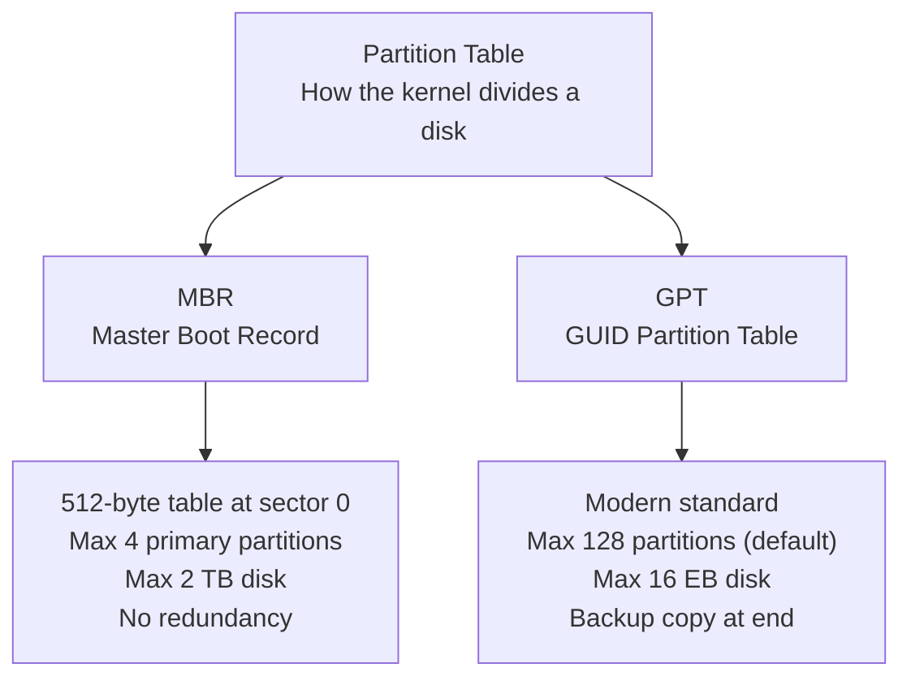
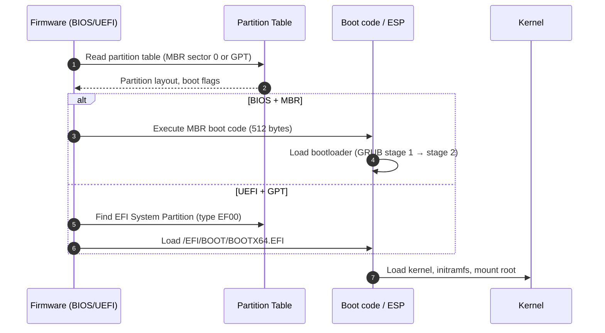
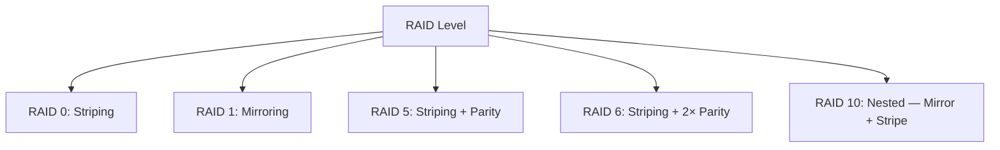
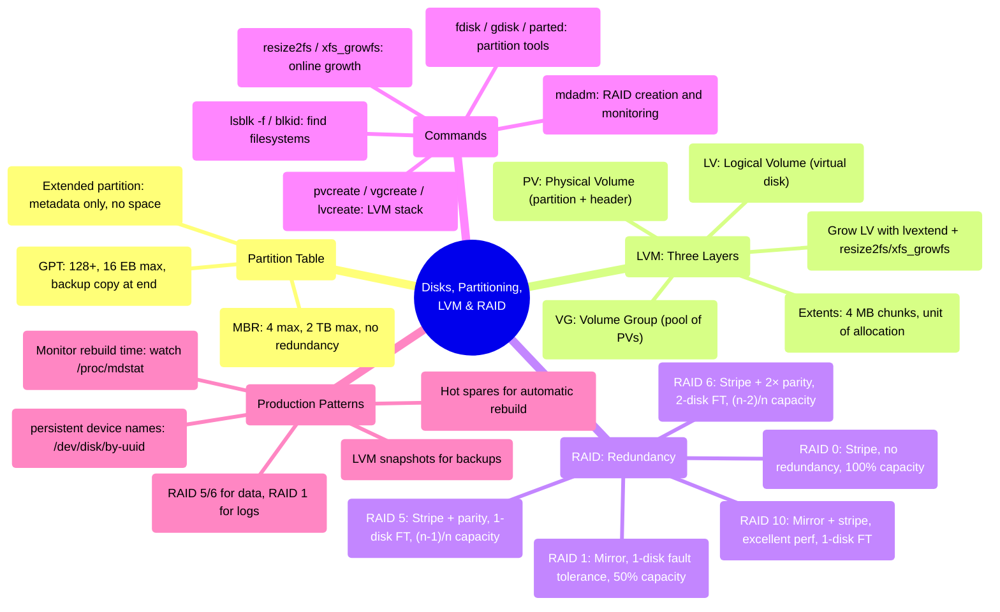

## 1 · The Big Picture

### Why this topic exists

You have a physical disk, and you want to turn it into something useful. That journey involves five decisions, each solving a real problem:

1. **How do I divide the disk into chunks?** — Partitioning, with a partition table.
2. **How do I protect against disk failure?** — RAID, distributing data across drives.
3. **How do I resize filesystems without rebuilding them?** — LVM, a logical layer between partitions and filesystems.
4. **How do I handle I/O errors or disk degradation?** — Hot spares, rebuild algorithms, monitoring.
5. **How do I grow a system after it is running?** — Online growth with `lvextend` and `resize2fs`.

Without these layers, an administrator could partition a 2 TB disk, fill it, and then be stuck: the filesystem is full, the partition cannot be resized without destroying data, and adding a second disk requires LVM or manual migration.

### Where you will encounter it

| Context | What happens here |
|---|---|
| **Any cloud VM** (AWS EBS, Google Persistent Disk) | You get one volume; if you need to grow it, you resize the volume in the console, then run `growpart` and `resize2fs` |
| **Database servers** | Multiple physical disks, RAID 5 or 6 for data, RAID 1 for logs, LVM to allocate space to data and backup snapshots |
| **Storage appliances** | RAID 10 or RAID 50, hot spares, predictive failure detection, automatic rebuild |
| **DevOps / Infrastructure as Code** | Cloud images define volume size at launch; on-prem VMs use LVM snapshots for backup |
| **Legacy monoliths** | Partitioning decisions made 10 years ago are still there; you grow by adding drives and extending VGs |

### Why companies care

- **Cost** — RAID 5 sacrifices 1 in 5 disk capacity for redundancy; RAID 6 is 2 in 6, but both are cheaper than taking downtime.
- **Flexibility** — LVM means you do not have to plan disk layout perfectly at install time; grow on demand.
- **Disaster recovery** — Snapshots (`lvcreate -s`) and cold backups are industry standard.
- **Predictability** — You can model "I have 3 drives, each will last 5 years, RAID 5 gives me 40 TB usable" and plan the replacement schedule.

---

## 2 · Intuition First

### The storage stack: layers

Think of storage as a building with five floors. Each floor solves one problem:

```diagram title="The storage stack — physical to logical"
┌─────────────────────────────────────┐
│  Files / Data (what you care about) │  5. Mount point: /data, /home, /var
├─────────────────────────────────────┤
│  Filesystem (ext4, XFS, Btrfs)      │  4. Allocates inodes, blocks
├─────────────────────────────────────┤
│  LVM / LUKS (logical volumes)       │  3. Logical abstraction; online grow
├─────────────────────────────────────┤
│  RAID (mirroring, striping)         │  2. Redundancy; rebuild on failure
├─────────────────────────────────────┤
│  Partitions (partition table)       │  1. Divide disks into chunks
├─────────────────────────────────────┤
│  Physical block device (/dev/sda)   │  0. Raw hardware
└─────────────────────────────────────┘
```

**Why each layer exists:**

- **Partition table** — tells the kernel "this disk has 3 chunks starting at byte X, Y, Z"
- **RAID** — combines multiple disks so one can fail
- **LVM** — gives you logical volumes that can span multiple partitions and be resized without unmounting
- **LUKS** — (optional) encrypts; it is transparent to the filesystem
- **Filesystem** — turns raw blocks into files and directories
- **Mount** — hangs a filesystem into the directory tree

### Analogy: apartment blocks vs office suites

A physical disk is a building. A **partition** is an apartment — you own 1C, it has walls, a specific size. If you want to expand, the building is full, too bad. You own it, but you cannot resize it.

**LVM** is like having adjustable walls: you can shrink 1C and grow 1D without anyone moving. Your actual data is in an office suite that hangs off the logical space. If 1C fails (disk dies), **RAID 1** means 2C is an exact copy, so you do not lose anything.

---

## 3 · Technical Definitions

### Device naming: where disks live

Linux presents storage as special files in `/dev`:

| Device | Meaning | Stability |
|---|---|---|
| `/dev/sda` | SATA/SAS disk 0 | ⚠ kernel enumeration order is not guaranteed |
| `/dev/sdb` | SATA/SAS disk 1 | ⚠ same problem |
| `/dev/nvme0n1` | NVMe disk 0 | ⚠ same problem |
| `/dev/vda` | Virtio block device (KVM/cloud) | ⚠ same problem |
| `/dev/sda1` | First partition of `/dev/sda` | ⚠ depends on `/dev/sda` |
| `/dev/sda-part1` | Same (alternate naming) | ⚠ rare |
| `/dev/md0` | RAID device (mdadm) | ⚠ depends on `/etc/mdadm.conf` |
| `/dev/mapper/vg0-lv_data` | LVM logical volume | ✔ stable if VG/LV names do not change |
| `/dev/loop0` | Loop device (file-backed) | ⚠ dynamically assigned |
| `/dev/disk/by-id/ata-QEMU-...` | By serial number (persistent) | ✔ **use this in configs** |
| `/dev/disk/by-path/pci-0000:01:01.0-...` | By PCI/SAS path | ⚠ changes if you move the disk to another slot |
| `/dev/disk/by-uuid/a1b2c3d4-...` | By filesystem UUID | ✔ **use this for `/etc/fstab`** |
| `/dev/disk/by-partuuid/...` | By partition UUID (GPT) | ✔ **use this for boot/EFI partitions** |

> [!EXAM]
> **Why `/dev/sda` numbering is unstable:** The kernel discovers disks at boot time in an order that depends on which driver initializes first, which PCI slots are scanned first, etc. A reboot can reshuffle them. Always use `/dev/disk/by-id` in configs, not `/dev/sda*`.

### Partition tables: MBR vs GPT



| Dimension | MBR | GPT |
|---|---|---|
| **Table location** | First 512 bytes (sector 0) | Sectors 0–33 (primary) + copy at end |
| **Partition entries** | 4 primary | 128 by default, up to 216 |
| **Max disk size** | 2.2 TB (32-bit LBA limit) | 16 EB (theoretically unlimited) |
| **Max partition size** | 2.2 TB | 16 EB |
| **Redundancy** | None — if sector 0 is corrupted, disk is unreadable | Backup GPT at end of disk |
| **Boot mechanism** | BIOS + MBR boot code | UEFI (EFI System Partition) + GPT |
| **Pairing** | BIOS reads MBR boot code | UEFI reads ESP (FAT32 at part type `EF00`) |
| **Extended partitions** | Yes (metadata pointing to logical partitions) | No (not needed — just make more primary partitions) |
| **Hybrid MBR** | — | Possible: protective MBR + GPT for compatibility |
| **Boot area** | 512 bytes of executable code | None in GPT; code is in ESP (`/boot/efi`) |

> [!MEMORY]
> **MBR = 1980s BIOS, GPT = 2000s UEFI.** If the server is more than 10 years old and has "legacy BIOS," use MBR. If it says "UEFI" anywhere, use GPT. When in doubt, use **GPT** — every modern system supports it.

### Extended partitions: metadata, no overhead

An **extended partition** is a partition table entry (16 bytes in MBR) that points to a chain of **logical partitions**. It consumes **no physical space** — it is pure metadata. You can have at most 4 entries in an MBR partition table, but with one extended partition, you can have unlimited logical partitions inside it.

Example MBR layout:

```
Entry 1: /dev/sda1 — primary, 1 GB
Entry 2: /dev/sda2 — primary, 2 GB
Entry 3: /dev/sda3 — extended (metadata only), 10 GB total
  → /dev/sda5 — logical, 3 GB (inside extended)
  → /dev/sda6 — logical, 3 GB (inside extended)
  → /dev/sda7 — logical, 4 GB (inside extended)
Entry 4: (unused)
```

The extended partition itself is not mounted; it is just a container. **GPT has no extended partition concept** because it allows 128+ primary partitions directly.

---

## 4 · Internal Working

### The boot process and partition tables

When a machine boots, the firmware reads the partition table to find the bootable system:



### Device-mapper and LVM: the layer

LVM sits between partitions and filesystems. A simplified flow:

```
/dev/sda1 ──┐
            ├─→ [PV: Physical Volume] ──→ [VG: Volume Group] ──→ [LV: Logical Volume] ──→ Filesystem
/dev/sdb1 ──┘
```

**PV (Physical Volume):** A partition or whole disk marked as LVM. It has a header with metadata.

**VG (Volume Group):** Combines one or more PVs into a pool. The pool is divided into **extents** (default 4 MB each).

**LV (Logical Volume):** A logical disk carved from the VG. Made of extents. Can be resized online.

---

## 5 · Real Examples

### Example 1: Beginner — single disk, one partition, no RAID

```bash
# Discover the disk
lsblk
# Output:
# NAME   MAJ:MIN RM  SIZE RO TYPE MOUNTPOINTS
# sda      8:0    0  100G  0 disk
# └─sda1   8:1    0  100G  0 part /

# Use the entire disk for root (already done on most installs)
```

### Example 2: Intermediate — RAID 1 for redundancy

Two 2 TB disks, mirrored:

```bash
mdadm --create /dev/md0 --level=1 --raid-devices=2 /dev/sda /dev/sdb
# All data on /dev/sda is mirrored to /dev/sdb
# If /dev/sda fails, /dev/sdb has a full copy
mkfs.ext4 /dev/md0
mount /dev/md0 /data
```

### Example 3: Production — RAID 5 with hot spare

Three 4 TB data disks + one 4 TB hot spare:

```bash
mdadm --create /dev/md0 --level=5 --raid-devices=3 --spare-devices=1 \
  /dev/sda /dev/sdb /dev/sdc /dev/sdd

# md0 is 8 TB usable (3 × 4 TB − 1 for parity)
# /dev/sdd waits; if any data disk fails, /dev/sdd is automatically added
# Rebuild takes hours on 4 TB disks — the spare allows work to continue at reduced performance
```

### Example 4: Cloud — on-demand resize

AWS scenario: EC2 instance with a 100 GB root volume.

```bash
# In AWS console: resize volume to 200 GB
# Reboot or wait for reshape to complete

# On the instance:
growpart /dev/xvda 1      # grow the partition
resize2fs /dev/xvda1      # grow the filesystem
df -h                      # confirm
```

---

## 6 · Practical Demonstration

### 6.1 · Tools: `fdisk`, `gdisk`, `parted`

#### `fdisk` — MBR/GPT editor (works both)

```bash
# Interactive mode
fdisk /dev/sda

# Flags to use:
# m = menu
# p = print partition table
# n = new partition
# d = delete partition
# t = set partition type (e.g., type 82 for swap)
# w = write table to disk

# Common one-liner to see table without entering interactive mode
fdisk -l /dev/sda    # list only
```

```console
$ fdisk -l /dev/sda
Disk /dev/sda: 100 GiB, 107374182400 bytes, 209715200 sectors
Units: sectors of 1 * 512 = 512 bytes
Sector size (logical/physical): 512 bytes / 512 bytes
I/O size (minimum/optimal): 512 bytes / 512 bytes
Disklabel type: dos
Disk identifier: 0x00042a4e

Device     Boot   Start       End   Sectors  Size Id Type
/dev/sda1  *       2048   1050623   1048576  512M 83 Linux
/dev/sda2      1050624 209715199 208664576 99.5G 8e Linux LVM
```

Field-by-field breakdown:

- `Device` — partition name
- `Boot` — `*` = boot flag set
- `Start` / `End` — sector numbers (multiply by 512 to get bytes)
- `Sectors` — count
- `Size` — human-readable
- `Id` — partition type (83 = Linux, 8e = Linux LVM, 82 = Linux Swap, ef = EFI)
- `Type` — name of the type

#### `gdisk` — GPT editor (recommended for modern systems)

```bash
gdisk /dev/sda       # interactive
# Commands: p (print), n (new), d (delete), t (change type), w (write)

# List in human format:
gdisk -l /dev/sda
```

```console
$ gdisk -l /dev/sda
GPT fdisk (gdisk) version 1.0.9
...
Number  Start (sector)    End (sector)  Size       Code  Name
   1            2048     1050623       512.0 MiB   EF00  EFI System Partition
   2         1050624   209715166      99.5 GiB    8E00  Linux LVM
```

#### `parted` — high-level tool (user-friendly)

```bash
parted /dev/sda print
# Output:
# Model: QEMU HARDDISK (scsi)
# Disk /dev/sda: 107GB
# Sector size (logical/physical): 512B/512B
# Partition Table: gpt
# Disk Flags:
#
# Number  Start   End     Size    File system  Name                  Flags
#  1      1049kB  1050MB  1049MB  fat32        EFI System Partition  boot, esp
#  2      1050MB  107GB   106GB   ext4         Linux LVM             lvm

# Resize partition 2 to 50 GB:
parted -s /dev/sda resizepart 2 50GB

# Alignment warning?
parted -a optimal /dev/sda mkpart primary 0% 100%
```

> [!TIP]
> **`parted` vs `fdisk` vs `gdisk`**: Use `parted` for one-liners and scripting (it can be non-interactive). Use `gdisk` for GPT systems with full control. Use `fdisk` for MBR systems or when you need absolute compatibility. Modern systems should all use GPT + `gdisk`.

### 6.2 · After partition table changes: `partprobe` and `blockdev`

After editing a partition table on a running system, the kernel's in-memory copy is stale. Refresh it:

```bash
# Inform the kernel of partition table changes
partprobe /dev/sda

# or
blockdev --rereadpt /dev/sda

# Then verify:
lsblk /dev/sda
```

### 6.3 · Alignment: why it matters

Modern SSDs and large disks use 4 KB physical blocks (4096 bytes). If your partition starts at sector 63 (512-byte sectors), it will be misaligned:

```
Sectors:  0 ─ 63 ─ 64 ─ ... ─ 4096 ─ 4097 ─ ...
Blocks:   [────── Block 0 ──────][────── Block 1 ──────]
Partition:          [misaligned!]
```

Every write crosses block boundaries, cutting performance in half.

**Solution:** Use `parted -a optimal` or `gdisk` (which aligns by default), or ensure partitions start at multiples of 2048 sectors (1 MB):

```bash
# Good starting point for first partition: 1 MiB
fdisk -u=sectors /dev/sda
# n (new) → +0 → enter (starts at 2048 sectors = 1 MB)
```

### 6.4 · View device info: `lsblk -f`, `blkid`

```console
$ lsblk -f
NAME        FSTYPE    LABEL UUID
sda
├─sda1      vfat            1234-5678
└─sda2      LVM2_member     xyz-abc-def
  └─vg0-lv_root ext4        a1b2c3d4-e5f6-...
```

```console
$ blkid
/dev/sda1: UUID="1234-5678" TYPE="vfat"
/dev/sda2: UUID="xyz-abc-def" TYPE="LVM2_member"
/dev/mapper/vg0-lv_root: UUID="a1b2c3d4-e5f6-..." TYPE="ext4"
```

Use these to identify filesystems and their UUIDs for `/etc/fstab`.

---

## 7 · LVM — Logical Volume Manager (extensive section)

### Three layers: PV, VG, LV

```diagram title="LVM architecture"
┌─────────────────────────────┐
│ /dev/mapper/vg0-lv_data     │  LV (Logical Volume)
│ Presented as a block device │  Size: 50 GB
│ Can be resized online       │
├─────────────────────────────┤
│ vg0 (Volume Group)          │  Combines PVs into one pool
│ Total extents: 12800        │  Each extent = 4 MB
│ Allocates extents to LVs    │
├──────────────────┬──────────┤
│ PV: /dev/sda1    │ PV: /dev/sdb1 │  Physical Volumes
│ Size: 50 GB      │ Size: 50 GB   │  Metadata at the start
│ Extents: 6400    │ Extents: 6400 │  (< 1 MB)
└──────────────────┴──────────┘
```

#### Physical Volume (PV)

**What:** A partition or whole disk marked as LVM. Has a small metadata header (< 1 MB at the start).

```bash
# Initialize a partition as a PV
pvcreate /dev/sda1

# View PVs
pvs              # short form
pvdisplay        # long form

# Example output:
# PV         VG    Fmt  Attr PSize  PFree
# /dev/sda1  vg0   lvm2 a--  50.00g 5.00g
# /dev/sdb1  vg0   lvm2 a--  50.00g 10.00g
```

**Key data:**

- **PE (Physical Extent)** — the unit of allocation, default 4 MB
- **PV header** — where LVM stores metadata (about 1 MB, at start of partition)

#### Volume Group (VG)

**What:** A pool combining multiple PVs. All extents are available to any LV.

```bash
# Create a VG from one or more PVs
vgcreate vg0 /dev/sda1 /dev/sdb1

# View VGs
vgs                  # short
vgdisplay            # long

# Example:
# VG Name               vg0
# Total PE              25600       # 50 GB / 4 MB = 12800 from each disk
# Alloc PE / Size       1280 / 5.00 GiB
# Free  PE / Size       24320 / 95.00 GiB
```

**Key data:**

- **Total PE** — total extents available
- **Alloc PE** — extents allocated to LVs
- **Free PE** — extents available for new LVs

#### Logical Volume (LV)

**What:** A virtual disk, allocated from the VG's free extents. Can be resized online.

```bash
# Create an LV
lvcreate -L 10G -n lv_data vg0
# Allocate 10 GB, name it "lv_data", in VG "vg0"
# Device: /dev/vg0/lv_data or /dev/mapper/vg0-lv_data

# View LVs
lvs                  # short
lvdisplay            # long
```

### The workflow: from empty disks to mounted filesystem

Step-by-step:

```bash
# 1. Create partition(s) or use whole disk
fdisk /dev/sda    # sda1: 50 GB
fdisk /dev/sdb    # sdb1: 50 GB

# 2. Initialize as PVs
pvcreate /dev/sda1 /dev/sdb1
pvs

# 3. Create a VG from those PVs
vgcreate vg0 /dev/sda1 /dev/sdb1
vgs

# 4. Create LVs from the VG
lvcreate -L 30G -n lv_root vg0
lvcreate -L 40G -n lv_data vg0
lvcreate -L 20G -n lv_backup vg0
lvs

# 5. Create filesystems
mkfs.ext4 /dev/vg0/lv_root
mkfs.ext4 /dev/vg0/lv_data
mkfs.ext4 /dev/vg0/lv_backup

# 6. Mount
mkdir -p /data /backup
mount /dev/vg0/lv_root /
mount /dev/vg0/lv_data /data
mount /dev/vg0/lv_backup /backup

# 7. Add to /etc/fstab for persistence
UUID=$(blkid -s UUID -o value /dev/vg0/lv_root)
echo "UUID=$UUID / ext4 defaults 0 1" >> /etc/fstab
```

### Online growth (no unmount, no data loss)

This is the superpower of LVM.

```bash
# Check free space
vgs vg0
# VG Size: 100 GB, Alloc: 90 GB, Free: 10 GB

# Extend LV by 10 GB
lvextend -L +10G /dev/vg0/lv_data

# Grow the filesystem (ext4 — *cannot shrink* after this)
resize2fs /dev/vg0/lv_data

# Or do both in one command
lvextend -L +10G -r /dev/vg0/lv_data   # -r resizes the FS too

# For XFS (cannot shrink, but no issue)
xfs_growfs /data

# Verify
df -h /data
```

> [!WARNING]
> **ext4 can be shrunk; XFS cannot.** If you grow an ext4 filesystem, you can later shrink it (unmount first). XFS grows but never shrinks. Plan accordingly.

### Snapshots: point-in-time copies

```bash
# Create a snapshot
lvcreate -L 5G -s -n lv_data_backup /dev/vg0/lv_data
# Snapshot name: /dev/vg0/lv_data_backup
# Size: 5 GB (change log only; actual data is shared with the original)

# Mount the snapshot (read-only recommended)
mount -o ro /dev/vg0/lv_data_backup /mnt/snapshot

# Back it up
tar czf /backup/data-$(date +%Y%m%d).tar.gz -C /mnt/snapshot .

# Remove snapshot when done
umount /mnt/snapshot
lvremove /dev/vg0/lv_data_backup
```

> [!PROD]
> Snapshots are the standard way to back up running databases without taking a lock. Create a snapshot, mount it separately, run `mysqldump` or `pg_dump`, then remove the snapshot. The original database is unaffected.

### Removal order (critical)

**Unmount → remove LV → remove VG → remove PV**

If you do it wrong, you corrupt the VG:

```bash
# WRONG
pvremove /dev/sda1    # LVM metadata is lost; cannot recover LVs

# CORRECT
umount /data
lvremove /dev/vg0/lv_data   # remove the LV
vgremove vg0                 # remove the VG (all LVs must be gone)
pvremove /dev/sda1          # now safe
```

---

## 8 · RAID — Redundant Array of Independent Disks

### The five main levels



| Level | Capacity | Fault tolerance | Read perf | Write perf | When to use | Rebuild risk |
|---|---|---|---|---|---|---|
| **0** | 100% | None — one disk fails, all data lost | Excellent | Excellent | Non-critical scratch; DEV only | All data lost |
| **1** | 50% | 1 disk | Excellent | Good | Database logs; boot drive | Low — fast rebuild |
| **5** | (n-1)/n (e.g. 66% for 3 disks) | 1 disk | Good | Fair (parity write) | General-purpose; most common in production | Medium — hours on large drives |
| **6** | (n-2)/n (e.g. 50% for 3 disks) | 2 disks | Good | Fair | Data centres, large drives (4+ TB) | Lower — two failures tolerated during rebuild |
| **10** | 50% | 1 disk per mirror; multiple mirrors | Excellent | Excellent | High-throughput databases; expensive | Low — rebuild one mirror only |

### Visualizing stripe and parity

**RAID 0 (striping):** Data is divided across disks in blocks.

```
Data: ABCDEFGHIJKLMNOP
Disk 0: ACEGIKMO
Disk 1: BDFHJLNP

One disk fails → ACEGIKMO is gone, BDFHJLNP is gone (cannot reconstruct either)
```

**RAID 1 (mirroring):** Exact copy on two disks.

```
Disk 0: ABCDEFGHIJKLMNOP
Disk 1: ABCDEFGHIJKLMNOP (identical)

One disk fails → the other has the full data
```

**RAID 5 (striping + parity):** Data + parity distributed across 3+ disks.

```
Block 1: Data D1, D2 on disks 0,1, parity P1 on disk 2
Block 2: Data D3, D4 on disks 1,2, parity P2 on disk 0
Block 3: Data D5, D6 on disks 2,0, parity P3 on disk 1

One disk fails → reconstruct its blocks using D + P − D = P formula
Three disks fail → data is unrecoverable
```

### Creating and managing RAID with `mdadm`

#### Create a RAID 5 array

```bash
# Three 1 TB disks, one spare
mdadm --create /dev/md0 --level=5 --raid-devices=3 --spare-devices=1 \
  /dev/sda /dev/sdb /dev/sdc /dev/sdd

# Output:
# mdadm: Defaulting to version 1.2 metadata and 0.90 bitmap
# mdadm: array /dev/md0 started with 3 active, 0 spare, 1 working devices.

# Usable capacity: 2 TB (3 × 1 TB − 1 TB for parity)
```

#### View array status

```console
$ cat /proc/mdstat
Personalities : [raid1] [raid6] [raid0] [raid5] [raid4]
md0 : active raid5 sdd[3](S) sdc[2] sdb[1] sda[0]
      2097152 blocks super 1.2 level 5, 64k chunk, algorithm 2 [3/3] [UUU_]
      [===============>....................] recovery = 34.5% (721920/2097152) finish=0.2min speed=180410K/sec
```

- `[UUU_]` — all 3 disks up, 1 spare (the `S` next to sdd)
- `recovery = 34.5%` — initial sync is 34% done

#### Detail view

```bash
mdadm --detail /dev/md0
```

```console
        Version : 1.2
  Creation Time : Wed Aug  2 15:30:00 2026
     Raid Level : raid5
     Array UUID : 12345678:90abcdef:...
       MD Major Version : 1
    MD Minor Version : 2
  Device Md0...
     State : clean
    Active Devices : 3
   Working Devices : 4
    Failed Devices : 0
     Spare Devices : 1

    Name : web-prod-01:0
    UUID : 12345678:90abcdef:...
    Events : 42

    Number   Major   Minor   RaidDevice State
       0       8        0        0      active sync   /dev/sda
       1       8       16        1      active sync   /dev/sdb
       2       8       32        2      active sync   /dev/sdc
       3       8       48        -      spare        /dev/sdd
```

#### Simulate a disk failure

```bash
# Mark a disk as failed (does not physically remove it)
mdadm /dev/md0 --fail /dev/sda

# Watch it rebuild to the spare
watch cat /proc/mdstat
```

```console
md0 : active raid5 sdd[3] sdc[2] sdb[1] sda[0](F)
      2097152 blocks super 1.2 level 5, 64k chunk, algorithm 2 [3/3] [_UUU]
      [===============>....................] recovery = 45.2% (947456/2097152) finish=0.1min speed=189491K/sec
```

- `(F)` — failed
- `[_UUU]` — one slot degraded, three active

When rebuild completes:

```bash
mdadm /dev/md0 --remove /dev/sda    # remove the failed disk
mdadm /dev/md0 --add /dev/sda       # add it back when replaced
```

#### Persistent config: `/etc/mdadm.conf`

```bash
# Scan arrays and generate config
mdadm --detail --scan >> /etc/mdadm.conf

# Example entry:
# ARRAY /dev/md0 metadata=1.2 name=web-prod-01:0 UUID=12345678:90abcdef:...
```

On boot, `mdadm` reassembles the arrays listed here.

#### Monitoring and hot spares

```bash
# Start monitoring daemon (one instance, runs in background)
mdadm --monitor --daemonise --mail=root /etc/mdadm.conf

# It watches `/proc/mdstat` and emails root on failures
```

### RAID 5 advantages (why it is standard)

- **Capacity:** 66% usable on 3 disks (much better than RAID 1's 50%)
- **Redundancy:** 1 disk can fail; rebuild from parity
- **Cost:** Good balance of drives and redundancy
- **Performance:** Read speed is N (all disks read in parallel); write is slower (parity calculation), but acceptable

### When to avoid RAID 5

- **Rebuild time is too long:** A 16 TB drive takes 20+ hours to rebuild. If a second disk fails during rebuild, all data is lost. **RAID 6** fixes this.
- **You need 99.999% uptime:** RAID 6 or RAID 10.
- **Single points of failure:** RAID controller, power supply, cooling. Mitigation: redundant controllers, UPS, monitoring.

---

## 9 · Also Essential

### Cloud volume growth: `growpart` and `resize2fs`

```bash
# VM in AWS: resize EBS volume to 200 GB in console
# Then on the instance:

growpart /dev/nvme0n1 1    # grow partition 1 to fill the disk
resize2fs /dev/nvme0n1p1   # grow ext4 filesystem
df -h /                     # verify

# For XFS:
xfs_growfs /
```

### Disk destruction: `dd` and `wipefs`

> [!DANGER]
> `dd` is the most dangerous command on Linux. It will destroy data without confirmation.

```bash
# Wipe a disk completely (fills with zeros)
dd if=/dev/zero of=/dev/sda bs=1M

# Wipe the partition table only
wipefs -a /dev/sda

# Securely erase (writes random data 3 times — slow)
dd if=/dev/urandom of=/dev/sda bs=1M
```

**Never** run these on the wrong disk.

### Disk I/O: TRIM and `fstrim`

SSDs need **TRIM** to mark blocks as reusable after deletion. Most filesystems send TRIM automatically; you can force it:

```bash
# Manually trim all mounted filesystems
fstrim -v /
fstrim -v /data
```

### Disk health: `hdparm`, `nvme`

```bash
# SATA/SAS disk information
hdparm -I /dev/sda

# NVMe disk information
nvme id-ctrl /dev/nvme0n1

# Read temperature
nvme smart-log /dev/nvme0n1 | grep -i temperature
```

### `/etc/fstab` with UUIDs (not device names)

```bash
# BAD (device names can change)
/dev/sda1 / ext4 defaults 0 1

# GOOD (persistent)
UUID=a1b2c3d4-e5f6-4g5h-8i9j-0k1l2m3n4o5p / ext4 defaults 0 1
```

Discover UUIDs:

```bash
blkid                    # all filesystems
lsblk -f                 # human-readable
cat /proc/cmdline        # kernel boot params (includes root UUID)
```

---

## 10 · Memory Tricks

> [!MEMORY]
> **PV = Physical Volume.** The P stands for "Physical" — it is the bottom layer. PV is what holds the actual storage.

> [!MEMORY]
> **VG = Volume Group.** The G stands for "Group" — multiple PVs are grouped into a pool.

> [!MEMORY]
> **LV = Logical Volume.** The L stands for "Logical" — it is what you see; the abstraction. Mount an LV, not a VG or PV.

> [!MEMORY]
> **RAID 5 = 1 parity.** RAID 6 = 2 parity. Remember: "6 is safer" (two failures tolerated).

> [!MEMORY]
> **Rebuild vs grow.** Rebuild = after a failure, from parity. Grow = adding more drives to a VG and expanding an LV. Different operations, often confused.

---

## 11 · Interview Corner

<details>
<summary><strong>Beginner</strong> — What is the purpose of a partition table?</summary>

A partition table is metadata at the beginning of a disk (or at the end, for GPT) that tells the kernel how to divide the disk into chunks. Each chunk (partition) can hold a filesystem, RAID array, or LVM volume. Without a partition table, the kernel sees the entire disk as one object.
</details>

<details>
<summary><strong>Beginner</strong> — What is the difference between MBR and GPT?</summary>

MBR (Master Boot Record) is an old standard: 4 partitions max, 2.2 TB max disk size, 512-byte table at the start, no redundancy. GPT (GUID Partition Table) is modern: 128+ partitions, 16 EB max disk size, partition table in sectors 0–33 plus a backup copy at the end, full redundancy. **Use GPT for any new system.**
</details>

<details>
<summary><strong>Beginner</strong> — What is a Physical Volume in LVM?</summary>

A Physical Volume (PV) is a partition or whole disk initialized for LVM. It has a small metadata header (< 1 MB) at the start that identifies it as LVM and holds configuration. Multiple PVs can be combined into a Volume Group (VG).
</details>

<details>
<summary><strong>Intermediate</strong> — Explain the three layers of LVM.</summary>

Physical Volume (PV) is the raw partition or disk. Multiple PVs are grouped into a Volume Group (VG), which is a pool of storage. Logical Volumes (LVs) are virtual disks carved from the VG and allocated in chunks called extents (default 4 MB). You format and mount LVs as filesystems, never PVs or VGs.
</details>

<details>
<summary><strong>Intermediate</strong> — What is the main advantage of RAID 5 in production?</summary>

RAID 5 balances three factors: capacity (66% on 3 disks, much better than RAID 1's 50%), fault tolerance (one disk can fail), and cost (only 3 disks needed). It is the standard for general-purpose storage. Its weakness is rebuild time: a 16 TB drive takes 20+ hours, during which a second failure means data loss — **RAID 6** solves this at the cost of 2 parity disks.
</details>

<details>
<summary><strong>Intermediate</strong> — How do you grow a logical volume without downtime?</summary>

Use `lvextend -L +10G -r /dev/vg0/lv_data` to add 10 GB to the LV and resize the filesystem in one command. The `-r` flag automatically calls `resize2fs` (ext4) or `xfs_growfs` (XFS). No unmount needed. This is why LVM is standard in production — you can grow running systems.
</details>

<details>
<summary><strong>Advanced</strong> — An MBR partition table has an extended partition entry. Does this consume disk space?</summary>

No. An extended partition is 16 bytes in the partition table — pure metadata. It points to a chain of logical partitions. The extended entry itself has no data area; the logical partitions inside it contain the actual data. GPT avoids this by simply allowing 128+ primary partitions, so extended partitions do not exist in GPT.
</details>

<details>
<summary><strong>Advanced</strong> — A RAID 5 array with 4 data disks is rebuilding after a failure. A second disk fails. What happens?</summary>

**Data is lost.** RAID 5 tolerates one failure; parity is calculated as D1 XOR D2 XOR D3 XOR P = 0. To recover a failed disk, you need all other disks intact. If two fail during a rebuild, you have lost information and cannot reconstruct either disk. **RAID 6** adds a second parity, tolerating two failures. This is why RAID 6 is standard for large drives (> 4 TB).
</details>

<details>
<summary><strong>Advanced</strong> — Why should you use `/dev/disk/by-uuid` in `/etc/fstab` instead of `/dev/sda1`?</summary>

Device names like `/dev/sda` are assigned by the kernel at boot based on enumeration order, which can change if you move drives to different SATA ports, add new disks, or the driver initializes in a different order. `/dev/disk/by-uuid` (or `/dev/disk/by-id`) is persistent — it stays the same even if `/dev/sda` becomes `/dev/sdb`. Without this, a reboot could cause the wrong filesystem to mount as root, breaking the boot.
</details>

<details>
<summary><strong>Advanced</strong> — Describe the full command to create a RAID 5 array, initialize it as a PV, create a VG and LV, format it, and mount it.</summary>

```bash
# RAID 5: 3 drives
mdadm --create /dev/md0 --level=5 --raid-devices=3 /dev/sda /dev/sdb /dev/sdc

# Initialize as PV
pvcreate /dev/md0

# Create VG
vgcreate vg_raid /dev/md0

# Create LV
lvcreate -L 100G -n lv_data vg_raid

# Format
mkfs.ext4 /dev/vg_raid/lv_data

# Mount
mount /dev/vg_raid/lv_data /data

# Persist in /etc/mdadm.conf and /etc/fstab
mdadm --detail --scan >> /etc/mdadm.conf
echo "/dev/vg_raid/lv_data /data ext4 defaults 0 2" >> /etc/fstab
```

This gives you a 2 TB RAID 5 array with online-growable LVM on top, so you can add drives and resize later.
</details>

<details>
<summary><strong>Scenario</strong> — A database server has a 2 TB `/var/lib/mysql` volume that is 95% full. Your company policy forbids downtime. How do you grow it?</summary>

1. Add a new physical disk to the server (or resize the virtual volume in the cloud console and run `growpart` on the instance).
2. `pvcreate` the new disk (or partition).
3. `vgextend vg0 /dev/sdd` (add it to the VG).
4. `lvextend -L +500G -r /dev/vg0/lv_mysql` (grow by 500 GB and resize the filesystem).
5. Monitor the resize: `watch df -h /var/lib/mysql`.

No downtime, the database keeps running, and the filesystem is now larger. This is the entire reason LVM exists.
</details>

<details>
<summary><strong>Scenario</strong> — A RAID 5 array is degraded (one disk failed). You replace the physical disk in the bay. What commands do you run to rebuild?</summary>

```bash
# Check status
mdadm --detail /dev/md0 | grep -A 10 "Number"

# The failed disk might still be listed. Add the new one:
mdadm /dev/md0 --add /dev/sda

# Watch rebuild
watch cat /proc/mdstat
```

It will automatically start rebuilding to parity. If the old disk is still present and marked failed:

```bash
mdadm /dev/md0 --fail /dev/sda_old
mdadm /dev/md0 --remove /dev/sda_old
mdadm /dev/md0 --add /dev/sda_new
```

No downtime if a hot spare was configured; the spare took over automatically.
</details>

<details>
<summary><strong>Company style</strong> — Why do cloud providers use thin provisioning and snapshots for their storage?</summary>

Thin provisioning means billing users for actual usage, not reserved capacity, which reduces their costs and increases density. Snapshots are cheap (copy-on-write) and enable instant backups without stopping the workload or doubling the storage. Together, they make it economically feasible to offer database backup and recovery as a service. On-prem operations use LVM snapshots for the same reason.
</details>

<details>
<summary><strong>HR style</strong> — Tell me about a time a disk or filesystem issue impacted a service.</summary>

A strong answer is specific and shows the recovery: "We had a 20 TB database volume that was growing faster than expected. A junior admin filled it completely at 2 a.m., and the database stopped accepting writes. We added a disk, extended the LVM volume with `lvextend -r`, and the service recovered in 3 minutes. Afterwards, we set up monitoring to alert at 80% and automated scaling to add disks on demand. Now it is largely self-healing."

This shows understanding of the tools, the impact of the failure, the recovery, and the systemic improvement.
</details>

---

## 12 · Common Mistakes

> [!MISTAKE]
> **Using `/dev/sda1` in `/etc/fstab` or RAID config.** Device names change. When you add a new disk or move a drive to another port, `/dev/sda` becomes `/dev/sdb`. Use `/dev/disk/by-uuid` or `/dev/disk/by-id` instead.

> [!MISTAKE]
> **Thinking an extended partition takes space.** It does not. It is metadata (16 bytes) pointing to a chain of logical partitions. GPT has no extended partition because it allows 128+ primary partitions.

> [!MISTAKE]
> **Removing LVs without unmounting.** If you run `lvremove` on a mounted LV, the data is lost immediately. Always `umount` first.

> [!MISTAKE]
> **Removing the VG when LVs exist.** `vgremove vg0` will fail if there are active LVs. Remove LVs first, then the VG.

> [!MISTAKE]
> **RAID 5 is safe for large drives.** It is not. On a 16 TB drive failure, the rebuild takes 20+ hours. If another drive fails during that window, all data is lost because RAID 5 has only one parity. Use **RAID 6** or **RAID 10** for drives > 4 TB.

> [!MISTAKE]
> **Creating a partition that starts at sector 63.** This is misaligned on modern disks with 4 KB physical blocks. Start at sector 2048 (1 MB) for alignment. `parted -a optimal` does this automatically.

> [!MISTAKE]
> **Growing a filesystem while it is full.** Ext4 has to allocate new blocks for metadata. If the filesystem is 100% full, the resize will fail. Always have at least 5% free before growing.

> [!DANGER]
> **`dd if=/dev/zero of=/dev/sda`.** This wipes the entire disk, forever. There is no undo. Check your device three times. Sysadmins have been fired for running this on the wrong disk.

> [!DANGER]
> **`lvremove /dev/vg0/lv_root` while it is mounted as `/`.** The system will become unbootable immediately.

---

## 13 · Summary & Mind Map



**Thirteen sentences that carry the chapter:**

1. A partition table divides a disk into chunks; MBR is legacy (max 2 TB, 4 partitions), GPT is modern (16 EB, 128+ partitions).
2. Device names like `/dev/sda` are unstable; use `/dev/disk/by-uuid` in configs for persistence.
3. Extended partitions in MBR are pure metadata (no disk space) that point to logical partitions inside.
4. A Physical Volume (PV) is a partition initialized for LVM with a small metadata header.
5. A Volume Group (VG) combines multiple PVs into a pool of extents (default 4 MB each).
6. A Logical Volume (LV) is a virtual disk, allocated from VG extents, that can be resized online without unmounting.
7. LVM's superpower is `lvextend -L +10G -r` — grow a running filesystem by adding extents and expanding the FS simultaneously.
8. RAID 0 is striping with no redundancy; one failure loses all data.
9. RAID 1 is mirroring; one disk can fail and the other has a full copy.
10. RAID 5 (one parity) is the production standard until drives exceed 4 TB; then use RAID 6 (two parity) to tolerate two failures during rebuild.
11. `mdadm --create` builds RAID; `cat /proc/mdstat` shows status; hot spares are automatic.
12. On cloud VMs, `growpart` expands the partition and `resize2fs` expands the filesystem when the provider resizes a volume.
13. Always mount LVs, never PVs; remove LVs before VGs; use `/etc/fstab` with UUIDs; back up with LVM snapshots.

---

## 14 · Cheat Sheet

```diagram title="Chapter 08 — Disks, Partitioning, LVM, RAID — one-page revision"
PARTITION TOOLS                          STORAGE STACK (bottom to top)
  fdisk -l          list MBR             Physical disk → Partition table → RAID
  gdisk -l          list GPT             → Partitions → RAID device → LVM PV
  parted -l         list both            → LVM VG → LVM LV → LUKS (optional)
  partprobe         refresh kernel       → Filesystem (ext4, XFS) → Mount → Files

MBR vs GPT TABLE         MBR: 4 max, 2.2 TB max, legacy   GPT: 128+, 16 EB, backup

LVM THREE LAYERS         PV (partition) → VG (pool) → LV (virtual disk)
  pvcreate           init partition      Extent unit = 4 MB (default)
  vgcreate vg0 /...  combine PVs         Growth: lvextend -L +10G -r /dev/vg0/lv_x
  lvcreate -L 10G    allocate from VG

RAID LEVELS              0: stripe, no redundancy    1: mirror, 50% cap, 1-FT
                         5: stripe + parity, (n-1)/n cap, 1-FT  [slower rebuild]
                         6: stripe + 2× parity, (n-2)/n, 2-FT   [large drives]
                         10: mirror + stripe, 50% cap, excellent perf

MDADM COMMANDS           Create:     mdadm --create /dev/md0 --level=5 --raid-devices=3 /dev/sd{a,b,c}
                         Detail:     mdadm --detail /dev/md0  |  cat /proc/mdstat
                         Fail/Add:   mdadm /dev/md0 --fail /dev/sda  →  --add /dev/sda_new
                         Persist:    mdadm --detail --scan >> /etc/mdadm.conf

GROW (NO DOWNTIME)       lvextend -L +10G -r /dev/vg0/lv_data   [resize FS too]
                         Cloud: growpart /dev/nvme0n1 1  →  resize2fs /dev/nvme0n1p1

PERSISTENT DEVICE NAMES  Never:  /dev/sda1
                         Do:     /dev/disk/by-uuid/a1b2c3d4-...  [in /etc/fstab]
                                 /dev/disk/by-id/ata-QEMU-...    [in mdadm.conf]

CRITICAL ORDERS          Remove LV (umount first) → VG → PV (never reverse)
                         RAID rebuild risk with drives > 4 TB — rebuild time 20+ hours
```

---

## 15 · Practice

### Flashcards

| Prompt | Answer |
|---|---|
| What is the max disk size for MBR? | 2.2 TB (32-bit LBA limit) |
| What is the max number of partitions in GPT? | 128 by default; up to 216 |
| Does an extended partition consume disk space? | No; it is metadata (16 bytes) pointing to logical partitions |
| What is a Physical Volume? | A partition or disk initialized for LVM with a metadata header |
| What is the default extent size in LVM? | 4 MB |
| How do you grow an LV online? | `lvextend -L +10G -r /dev/vg0/lv_x` (no unmount needed) |
| What is the difference between RAID 5 and RAID 6? | RAID 5 has 1 parity (1-disk fault tolerance); RAID 6 has 2 parity (2-disk FT) |
| What is RAID 0's fault tolerance? | None — one disk fails, all data lost |
| How much usable capacity does RAID 5 give with 4 disks? | 75% (4 − 1 = 3 TB usable per 4 TB) |
| Where should you store `/etc/fstab` entries: `/dev/sda1` or UUID? | UUID (`/dev/disk/by-uuid`) — device names are not stable |
| What command monitors RAID rebuild progress? | `cat /proc/mdstat` or `watch cat /proc/mdstat` |
| What do you run after changing a partition table on a running system? | `partprobe` or `blockdev --rereadpt` |
| When should you use RAID 6 instead of RAID 5? | For drives > 4 TB; rebuild time is too long for RAID 5 |
| How do you mount an LVM snapshot for backup? | `lvcreate -s -L 5G -n snap /dev/vg0/lv_data` then `mount -o ro /dev/vg0/snap /mnt` |

### Multiple choice

1. Which partition table supports disks larger than 2.2 TB? **(a)** MBR **(b)** GPT **(c)** Extended **(d)** RAID
2. How much usable space does RAID 5 provide with 3 × 4 TB disks? **(a)** 12 TB **(b)** 8 TB **(c)** 6 TB **(d)** 4 TB
3. A device name `/dev/sda1` is: **(a)** always stable **(b)** stable until a new disk is added **(c)** based on kernel enumeration order **(d)** unique to each machine
4. What is an LVM extent? **(a)** a physical disk **(b)** a partition **(c)** a 4 MB (default) allocation unit **(d)** a filesystem
5. RAID 1 gives redundancy but sacrifices: **(a)** speed **(b)** capacity (50% usable) **(c)** complexity **(d)** rebuild time
6. The command to resize an ext4 filesystem online is: **(a)** `fsck -f` **(b)** `resize2fs` **(c)** `e2fsck` **(d)** `tune2fs`
7. An extended partition in MBR: **(a)** is a 4th primary partition **(b)** takes space on disk **(c)** is metadata pointing to logical partitions **(d)** is obsolete in RAID
8. After editing a partition table with `fdisk` on a running system, you must: **(a)** reboot **(b)** run `partprobe` **(c)** recreate the VG **(d)** unmount the disk
9. RAID 6 tolerates: **(a)** 1 disk failure **(b)** 2 disk failures **(c)** 3 disk failures **(d)** any failure if a spare is configured
10. The correct device name for `/etc/fstab` is: **(a)** `/dev/sda1` **(b)** `/dev/disk/by-path/...` **(c)** `/dev/disk/by-uuid/...` **(d)** `/dev/md0`

<details>
<summary>Answers</summary>

1. (b) — GPT supports up to 16 EB
2. (b) — 8 TB usable; 1 TB is parity
3. (c) — enumeration order is not guaranteed
4. (c) — default 4 MB
5. (b) — 50% capacity for mirroring
6. (b) — `resize2fs`
7. (c) — metadata only
8. (b) — `partprobe` to refresh the kernel
9. (b) — two failures
10. (c) — `/dev/disk/by-uuid` is persistent; device names are not
</details>

### Fill in the blanks

1. MBR supports up to ______ primary partitions; GPT supports ______ by default.
2. A PV is initialized with ______ .
3. A VG combines multiple ______ into a pool.
4. An LV is allocated from the VG in chunks called ______ (default ______ MB).
5. To grow an LV and its filesystem online: ______ -L +10G -r /dev/vg0/lv_x
6. RAID ______ has zero fault tolerance; RAID ______ has one; RAID ______ has two.
7. The command to create a RAID 5 array with 4 devices (3 data + 1 spare) is: ______ --create /dev/md0 --level=5 --raid-devices=3 --spare-devices=1 /dev/sd{a,b,c,d}
8. After editing partitions with `fdisk`, refresh the kernel with ______ .

<details>
<summary>Answers</summary>

1. 4 ; 128 — 2. `pvcreate` — 3. PVs — 4. extents ; 4 — 5. `lvextend` — 6. 0 ; 1 ; 6 — 7. `mdadm` — 8. `partprobe`
</details>

### True or false

1. An extended partition consumes physical disk space.
2. GPT partitions are always more stable than MBR.
3. You should use `/dev/sda1` in `/etc/fstab` for permanent stability.
4. RAID 5 can survive two disk failures.
5. LVM can grow a filesystem without unmounting it.
6. A hot spare is automatically added to RAID when a disk fails.
7. `resize2fs` can grow ext4 while mounted and in use.
8. RAID 1 gives 100% capacity utilization.

<details>
<summary>Answers</summary>

1. **False** — it is metadata only.
2. **False** — stability depends on using persistent device names (UUIDs), not the table type.
3. **False** — device names are not stable; use `/dev/disk/by-uuid`.
4. **False** — RAID 5 tolerates one failure; RAID 6 tolerates two.
5. **True** — with `lvextend -L +10G -r`.
6. **True** — if configured; the spare is added and the array rebuilds automatically.
7. **True** — and it is safe.
8. **False** — RAID 1 is 50% usable (one copy for redundancy).
</details>

### Hands-on lab (essential)

Do these on a throwaway VM. The lab builds a complete RAID 5 + LVM stack.

**Goal:** Create two loop devices, build a RAID 5 array on them, add an LVM layer, create and grow a logical volume, and simulate a disk failure.

```bash
# 1. Create three 1 GB image files (simulate disks)
cd /tmp
fallocate -l 1G disk_a.img
fallocate -l 1G disk_b.img
fallocate -l 1G disk_c.img

# 2. Attach them as loop devices
losetup /dev/loop10 disk_a.img
losetup /dev/loop11 disk_b.img
losetup /dev/loop12 disk_c.img

# 3. Create RAID 5
mdadm --create /dev/md_test --level=5 --raid-devices=3 /dev/loop10 /dev/loop11 /dev/loop12

# 4. Watch initial sync
watch cat /proc/mdstat    # Press Ctrl+C after 10 seconds

# 5. Initialize as LVM
pvcreate /dev/md_test
vgcreate vg_test /dev/md_test
lvcreate -L 1.5G -n lv_test vg_test

# 6. Format and mount
mkfs.ext4 /dev/vg_test/lv_test
mkdir -p /mnt/test_lvm
mount /dev/vg_test/lv_test /mnt/test_lvm

# 7. Write test data
dd if=/dev/urandom of=/mnt/test_lvm/testfile.bin bs=1M count=100
md5sum /mnt/test_lvm/testfile.bin > /tmp/original_md5.txt

# 8. Grow the LV
lvextend -L +500M -r /dev/vg_test/lv_test
df -h /mnt/test_lvm    # should be larger

# 9. Simulate disk failure
mdadm /dev/md_test --fail /dev/loop10

# 10. Watch rebuild
watch cat /proc/mdstat    # RAID 5 rebuilds from parity; may take 30 seconds

# 11. Verify data integrity
md5sum -c /tmp/original_md5.txt    # should match

# 12. Cleanup
umount /mnt/test_lvm
lvremove /dev/vg_test/lv_test -y
vgremove vg_test -y
pvremove /dev/md_test -y
mdadm --stop /dev/md_test
losetup -d /dev/loop10 /dev/loop11 /dev/loop12
rm /tmp/disk_*.img
```

**Report in 5 lines when done:**

1. What was the initial RAID 5 capacity? (Should be 2 GB: 3 × 1 GB − 1 GB for parity)
2. What was the LV size after growing? (Should be 2 GB)
3. Did the data survive the simulated failure? (md5sum match: yes/no)
4. How long did rebuild take?
5. What did you learn about rebuild performance and redundancy?

---

> [!NOTE]
> **Where to go next.** Chapter 9 covers processes, signals and services — the runtime layer that uses these disks to store data, queue work, and communicate with the kernel.
