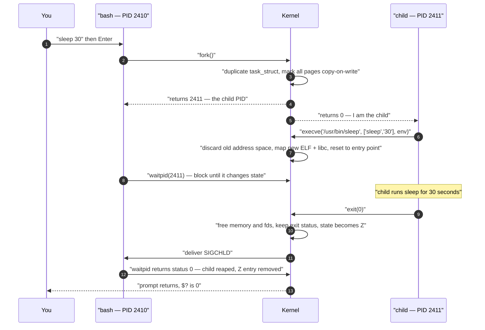
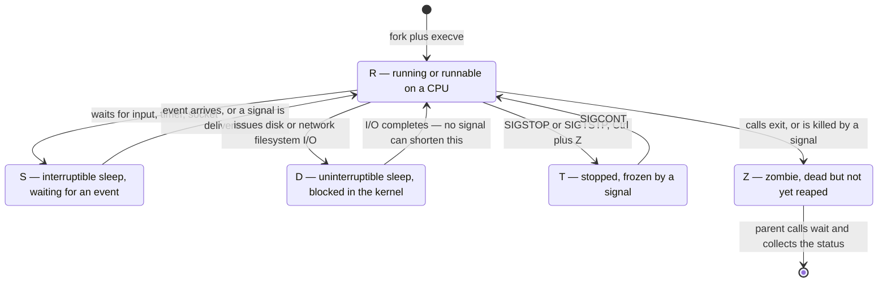

## 1 · The Big Picture

### Why this topic exists

A file on disk does nothing. `/usr/bin/nginx` is 1.4 MB of inert bytes until something asks the kernel to breathe life into it. The moment it runs, it becomes a **process**: it acquires an identity (a PID), an owner, a private address space, a set of open files, a parent, a priority, and a place in a queue where the scheduler decides how much CPU it deserves.

Almost everything you will ever do as a Linux or DevOps engineer is a statement about processes:

- The site is down → *which process died, and why?*
- The box is at 100% CPU → *which process, and can I deprioritise it instead of killing it?*
- The deploy hangs → *which process is stuck, and on what?*
- The container restarted with code 137 → *the kernel sent it SIGKILL because it exceeded its memory limit.*
- "Make this survive a reboot" → *stop writing `nohup ... &` and write a systemd unit.*

Chapter 1 gave you the mental model: the kernel abstracts hardware and arbitrates access to it. **Processes are the unit that arbitration acts on.** Signals are how you talk to them. systemd is how you make them somebody else's problem — reliably, at boot, with restarts and logs.

### The real problem it solves

Imagine a machine with one CPU and forty programs that all want it. You need answers to five questions, and the process subsystem exists to answer them:

```diagram title="The five questions the process subsystem answers"
  1. IDENTITY     Who is running?          → PID, PPID, UID, command line
  2. ISOLATION    Can A read B's memory?   → per-process virtual address space
  3. ARBITRATION  Who gets the CPU next?   → scheduler, nice, cgroups
  4. CONTROL      How do I talk to it?     → signals (kill, Ctrl+C, Ctrl+Z)
  5. LIFECYCLE    Who starts and restarts  → PID 1: init / systemd
                  it, and who buries it?     fork, exec, wait, reap
```

Every command in this chapter is a tool for one of those five columns. `ps` and `top` answer *identity*. `/proc` answers *isolation*. `nice`, `renice` and cgroups answer *arbitration*. `kill`, `pkill` and `killall` answer *control*. `systemctl` answers *lifecycle*.

### Where you will encounter it

| Context | What you are really doing with processes |
|---|---|
| Debugging a slow server over SSH | `top`, `ps aux --sort=-%cpu`, load average vs core count |
| A container that keeps restarting | Reading exit code 137 (SIGKILL, usually OOM) or 143 (SIGTERM) |
| Kubernetes pod termination | The kubelet sends SIGTERM, waits `terminationGracePeriodSeconds`, then SIGKILL |
| Writing a Dockerfile | Your entrypoint becomes **PID 1** — it must handle SIGTERM and reap children |
| Deploying an app to a VM | Writing a `.service` unit, `systemctl enable --now`, `journalctl -u` |
| Zero-downtime config reload | `systemctl reload nginx` — which sends **SIGHUP**, not a restart |
| A CI job that never finishes | `timeout`, orphaned background jobs, processes stuck in `D` state |
| Cost tuning a batch job | `nice`, `ionice`, `systemd-run -p CPUQuota=50%` |
| An interview, first ten minutes | "What is a zombie process?" "SIGTERM vs SIGKILL?" "What is PID 1?" |

### Why companies care

**Availability.** A service that dies at 03:00 and stays dead costs money. `Restart=on-failure` in a unit file is a one-line SLA improvement, and it is the difference between an outage and a blip.

**Cost.** Cloud bills are CPU and memory. Knowing which process is eating a core — and being able to cap it rather than remove it — turns a bigger-instance ticket into a config change.

**Graceful shutdown.** Rolling deploys, autoscaling and spot instances all depend on processes that clean up when asked politely. A team that reaches for `kill -9` habitually ships services that corrupt data under load.

**Debuggability.** `/proc`, `ps`, `strace` and `lsof` mean a Linux process is the most inspectable running thing in computing. Engineers who can read that state fix incidents in minutes instead of guessing.

> [!INFO]
> **Why `systemd` exists at all.** Until roughly 2014, Linux booted with **SysV init**: a set of numbered shell scripts in `/etc/rc3.d/` run strictly in sequence. Booting was slow because nothing ran in parallel, dependencies were expressed by renaming files (`S20apache2` runs after `S19mysql`), a crashed daemon stayed crashed, and tracking a service's real child processes was guesswork based on PID files. systemd replaced all of that with a declarative dependency graph, parallel startup, cgroup-based process tracking and a unified log. It was and remains controversial — it is large and it absorbed jobs that used to belong to separate tools — but every mainstream distribution now ships it, and every DevOps role assumes you know it.

---

## 2 · Intuition First

### Analogy 1: the recipe and the cooking

A **program** is a recipe printed in a book. It is bytes; it does nothing; ten people can read the same page.

A **process** is one person actually cooking that recipe in one kitchen: a specific pan on a specific hob, at a specific point in the instructions, with specific ingredients on the counter.

- Run `nginx` three times and you have **one program and three processes**. Same recipe, three kitchens.
- The **program counter** is the line of the recipe you are on.
- The **heap** is the counter space you keep grabbing more of as you go.
- The **stack** is the pile of "I was in the middle of the sauce when I started the roux" notes.
- A **thread** is a second pair of hands *in the same kitchen*: sharing the counter, the ingredients and the hob, but each following its own place in the instructions.

That last one is the whole process-versus-thread answer. Separate kitchens (processes) cannot knock each other's bowls over. Two pairs of hands in one kitchen (threads) are faster to coordinate and can absolutely knock each other's bowls over — which is why you need locks.

### Analogy 2: signals are taps on the shoulder

You cannot have a conversation with a running process from outside. What you *can* do is tap it on the shoulder in one of about sixty distinguishable ways. The process decides how to react — with two exceptions.

| Tap | What it conventionally means | Can the process ignore it? |
|---|---|---|
| SIGTERM (15) | "Please finish up and leave." | Yes — and it can clean up first |
| SIGHUP (1) | "Re-read your configuration." | Yes |
| SIGINT (2) | "The user pressed Ctrl+C." | Yes |
| SIGTSTP (20) | "The user pressed Ctrl+Z — pause." | Yes |
| **SIGSTOP (19)** | "Freeze. Now." | **No** |
| **SIGKILL (9)** | "You are dead. Now." | **No** |

SIGKILL and SIGSTOP are handled entirely by the kernel *on behalf of* the process. The process is never told. That is why they cannot be caught, blocked or ignored — and why `kill -9` guarantees death but also guarantees no cleanup.

### Analogy 3: systemd is a hospital, not a doctor

`nohup ./myapp &` is a patient who walked out of the building. Nobody is watching. If they collapse, nobody notices. If the building is evacuated (reboot), they do not come back.

A **systemd unit** is a patient admitted to a ward. There is a chart (the unit file), observations (`systemctl status`), notes (`journalctl -u`), a policy for what to do if they deteriorate (`Restart=on-failure`), a rule about who must be treated first (`After=network-online.target`), and a standing instruction to readmit them every morning (`enable`).

> [!MEMORY]
> **The four verbs of a process life.** `fork` → `exec` → `wait` → `exit`. *Split, become, watch, leave.* Every process on your machine got here that way, without exception, all the way back to PID 1.

### Analogy 4: the family tree

Every process except PID 1 has exactly one parent. Run `pstree` and you are looking at a genealogy that starts with `systemd` and ends with the shell you are typing in. When a parent dies before its child, the child is **orphaned** and immediately adopted by PID 1. When a child dies before its parent collects the death certificate, the child is a **zombie** — a name on a register with no body attached.

---

## 3 · Technical Definitions

Now the precise versions.

<dl>
<dt>Program</dt>
<dd>A passive, executable file on disk — typically ELF format on Linux — containing machine code, data and metadata. It has no state and consumes no CPU.</dd>

<dt>Process</dt>
<dd>A running instance of a program: an execution context consisting of a virtual address space, at least one thread of execution, a file-descriptor table, credentials, a scheduling state and a unique <strong>PID</strong>. The kernel represents it internally as a <code>task_struct</code>.</dd>

<dt>Thread</dt>
<dd>A schedulable flow of execution <em>within</em> a process. Threads of one process share the address space (code, heap, globals), open file descriptors, signal dispositions and working directory; each has its own stack, registers, program counter and kernel-visible ID. On Linux a thread is a task that shares those resources — which is why the kernel scheduler treats threads and processes almost identically, and why <code>ps -eLf</code> can list them.</dd>

<dt>PID — Process ID</dt>
<dd>A positive integer uniquely identifying a process on a running system. Allocated sequentially and wrapped at <code>/proc/sys/kernel/pid_max</code> (32768 by default; up to 4194304 on 64-bit systems).</dd>

<dt>PPID — Parent Process ID</dt>
<dd>The PID of the process that created this one. If the parent exits first, the PPID is re-set to <strong>1</strong>.</dd>

<dt>TGID / thread group</dt>
<dd>The <em>thread group ID</em> is what userspace calls "the PID". All threads of a process share a TGID; each has its own kernel task ID (shown as <code>LWP</code> or <code>SPID</code> in <code>ps</code>).</dd>

<dt>UID / EUID</dt>
<dd>The <strong>real</strong> user ID is who launched the process; the <strong>effective</strong> user ID is whose privileges it currently acts with. <code>sudo</code> and setuid binaries such as <code>passwd</code> are exactly the case where they differ.</dd>

<dt>Daemon</dt>
<dd>A background service process with no controlling terminal, normally started at boot and running for the life of the system. Conventionally named with a trailing <code>d</code> — <code>sshd</code>, <code>crond</code>, <code>systemd</code>, <code>rsyslogd</code>. Classically a daemon <code>fork</code>ed twice, called <code>setsid()</code> and closed its inherited file descriptors; under systemd that dance is unnecessary because systemd supervises the process directly.</dd>

<dt>Signal</dt>
<dd>An asynchronous software interrupt delivered to a process or thread, identified by a small integer, used to notify it of an event or to request a state change. The kernel delivers it by running the process's <em>handler</em>, or its <em>default action</em> if there is none.</dd>

<dt>Zombie (defunct) process</dt>
<dd>A process that has terminated but whose exit status has not yet been read by its parent via <code>wait()</code>. Its memory, files and address space are already gone; only the entry in the process table remains, so that the parent can still learn how it died. Shown as state <code>Z</code> and <code>&lt;defunct&gt;</code> in <code>ps</code>.</dd>

<dt>Orphan process</dt>
<dd>A running process whose parent has terminated. The kernel immediately re-parents it to PID 1 (or to the nearest ancestor marked as a subreaper), which will reap it when it eventually exits.</dd>

<dt>init system</dt>
<dd>The userspace program the kernel starts as <strong>PID 1</strong> after mounting the root filesystem. It brings up the rest of userspace, supervises services and reaps orphans. On modern distributions it is <strong>systemd</strong>; historically <strong>SysV init</strong>, and <strong>Upstart</strong> on Ubuntu between roughly 2006 and 2014.</dd>
</dl>

### Anatomy of a process, term by term

Everything the kernel tracks about a running program, and where you can see it:

| Attribute | What it is | Where to look |
|---|---|---|
| PID | Unique identity | `ps -o pid`, `$$` in a shell |
| PPID | Parent's PID | `ps -o ppid`, `/proc/<pid>/status` |
| UID / GID, EUID / EGID | Real and effective credentials | `ps -o uid,euid,user`, `/proc/<pid>/status` |
| State | R, S, D, T, t, Z, X | `ps -o stat`, `/proc/<pid>/stat` |
| Address space | text, data, bss, heap, mmap, stack | `/proc/<pid>/maps`, `pmap <pid>` |
| File descriptor table | Every open file, socket, pipe | `ls -l /proc/<pid>/fd`, `lsof -p <pid>` |
| Environment | The `KEY=value` block inherited at exec | `/proc/<pid>/environ` |
| Working directory | Where relative paths resolve from | `ls -l /proc/<pid>/cwd`, `pwdx <pid>` |
| Root directory | Its view of `/` — differs in a chroot/container | `ls -l /proc/<pid>/root` |
| Priority | `NI` nice value and `PR` kernel priority | `ps -o ni,pri`, `top` |
| Resource limits | Open files, memory, processes | `/proc/<pid>/limits`, `ulimit -a` |
| Signal masks | Blocked, ignored, caught signals | `SigBlk`/`SigIgn`/`SigCgt` in `/proc/<pid>/status` |
| cgroup | Which resource-control group it belongs to | `/proc/<pid>/cgroup` |
| Namespaces | Its view of PIDs, network, mounts | `ls -l /proc/<pid>/ns/` |
| Exit status | How it died — collected by the parent | `$?` after `wait` |

### `/proc/<pid>/` — the live view

`/proc` is a virtual filesystem generated by the kernel on read (Chapter 1 proved this with `cat /proc/uptime`). Every running process gets a directory, and reading it is the single most useful debugging skill in this chapter, because it needs no tools you might not have installed.

```console
$ ls /proc/1842/
attr       cgroup    cmdline  cwd      environ  exe   fd      fdinfo  io
limits     maps      mounts   net      ns       oom_score  oom_score_adj
root       sched     smaps    stack    stat     status  syscall  task  wchan
```

Walk the six that matter.

**`cmdline` — the exact argument vector.** NUL-separated, so translate it:

```console
$ tr '\0' ' ' < /proc/1842/cmdline; echo
/usr/sbin/nginx -g daemon off; master_process on;
```

This is how you find out what flags a mystery process was actually started with, even when `ps` truncates the line.

**`status` — the human-readable summary.** This is where interview answers live:

```console
$ grep -E '^(Name|State|Tgid|Pid|PPid|Uid|Threads|VmSize|VmRSS|SigCgt)' /proc/1842/status
Name:	nginx
State:	S (sleeping)
Tgid:	1842
Pid:	1842
PPid:	1839
Uid:	33	33	33	33
VmSize:	512340 kB
VmRSS:	 84120 kB
Threads:	1
SigCgt:	0000000198016a07
```

`Uid` lists four values: real, effective, saved-set and filesystem UID. `VmSize` is virtual (address space reserved), `VmRSS` is resident (physical RAM actually occupied) — hold that distinction, you will need it again for `ps aux`. `SigCgt` is a bitmask of caught signals; note that bits 9 and 19 are *always* clear, because SIGKILL and SIGSTOP can never be caught.

**`fd/` — every open file.** Symlinks, one per descriptor:

```console
$ sudo ls -l /proc/1842/fd
lrwx------ 1 root root 64 Jul 31 14:02 0 -> /dev/null
lrwx------ 1 root root 64 Jul 31 14:02 1 -> /dev/null
lrwx------ 1 root root 64 Jul 31 14:02 2 -> /var/log/nginx/error.log
lrwx------ 1 root root 64 Jul 31 14:02 6 -> 'socket:[28841]'
lrwx------ 1 root root 64 Jul 31 14:02 8 -> '/var/log/nginx/access.log.1 (deleted)'
```

That last line is a production classic: a log file was rotated or `rm`'d while the process still held it open. The disk space is **not** freed until the descriptor closes, which is why `df` says the disk is full and `du` says it is not. The fix is to make the process reopen its logs — usually `systemctl reload`, i.e. SIGHUP.

**`environ` — the environment at exec time.** Also NUL-separated, and only readable by the owner or root:

```console
$ sudo tr '\0' '\n' < /proc/1842/environ | head -3
LANG=C.UTF-8
PATH=/usr/local/sbin:/usr/local/bin:/usr/sbin:/usr/bin:/sbin:/bin
NGINX_VERSION=1.24.0
```

> [!DANGER]
> `/proc/<pid>/environ` is how secrets leak. If you pass a database password as an environment variable, any process running as the same user — and root, always — can read it out of this file. This is the technical reason production systems prefer `EnvironmentFile=` with mode `0600`, or a secrets manager, over `docker run -e PASSWORD=...`.

**`maps` — the memory map.** Every mapped region, with permissions and backing file:

```console
$ cat /proc/1842/maps | head -6
55a1c0a00000-55a1c0a7c000 r--p 00000000 08:01 1179825   /usr/sbin/nginx
55a1c0a7c000-55a1c0c1e000 r-xp 0007c000 08:01 1179825   /usr/sbin/nginx
55a1c0c1e000-55a1c0ca4000 r--p 0021e000 08:01 1179825   /usr/sbin/nginx
55a1c1f4c000-55a1c2211000 rw-p 00000000 00:00 0         [heap]
7f3a4c1e2000-7f3a4c20a000 r--p 00000000 08:01 1180422   /usr/lib/x86_64-linux-gnu/libc.so.6
7ffd8a3e1000-7ffd8a402000 rw-p 00000000 00:00 0         [stack]
```

Read the permission column: `r-xp` is code (readable, executable, **not** writable — this is why you cannot overwrite your own instructions), `rw-p` is data and heap, `p` means private (copy-on-write) rather than shared.

**`limits` — the resource ceilings this process actually has.** Not what `ulimit -a` in *your* shell says — what *it* got:

```console
$ cat /proc/1842/limits | head -4
Limit                     Soft Limit  Hard Limit  Units
Max cpu time              unlimited   unlimited   seconds
Max file size             unlimited   unlimited   bytes
Max open files            1024        1048576     files
```

`Max open files` at 1024 on a web server is a bug waiting for traffic. Fix it in the unit file with `LimitNOFILE=65535`, not in your interactive shell.

> [!EXAM]
> **One-mark answers to memorise.** A process is a *running instance of a program*. **PID** = Process ID, the unique numeric identifier. **PPID** = Parent Process ID. The first process at boot has **PID 1** and is called **`systemd`** on modern distributions (`init` historically). A **daemon** is a background service process with no controlling terminal. A **zombie** is a terminated process whose parent has not yet read its exit status.

---

## 4 · Internal Working

### How a process is born: fork, exec, wait, exit

Linux does not have a "run this program" system call. It has two calls that compose: one that **duplicates** the caller, and one that **replaces** a process's program image. Everything else falls out of that design.



Step by step, with the reasoning:

**1. `fork()`** creates a near-identical copy of the calling process. Both continue from the same line. The *only* difference is the return value: the parent gets the child's PID, the child gets `0`, and `-1` means the fork failed (usually `EAGAIN` — you hit `RLIMIT_NPROC` or `pid_max`).

**2. Copy-on-write** makes this cheap. `fork()` does not copy the parent's memory; it copies the *page tables* and marks every writable page read-only in both processes. The first write to a page traps into the kernel, which copies just that 4 KB page and lets the write proceed. So forking a 4 GB process costs kilobytes, not gigabytes — and the child that immediately calls `execve()` throws the whole map away anyway.

**3. `execve()`** replaces the process's program: the kernel tears down the address space, maps the new ELF binary and its interpreter (`ld-linux.so`), resets the stack with `argv` and `envp`, and jumps to the entry point. **The PID does not change.** Same identity, new program. That is why `exec` in a shell script replaces the shell instead of spawning a child, and why `ExecStart` with `Type=simple` gives systemd a stable PID to watch.

**4. `wait()` / `waitpid()`** lets the parent collect the child's exit status. Until it does, the dead child stays in the process table as a zombie. `waitpid()` adds targeting and options (`WNOHANG` to poll without blocking); `waitid()` is the modern superset.

**5. `exit()`** ends the process: descriptors close, memory is freed, children are re-parented to PID 1, and `SIGCHLD` goes to the parent.

### Why the shell forks before exec'ing

If `bash` called `execve()` directly, `bash` would *become* `ls` — and when `ls` finished, your shell would be gone. Forking first means the child is the disposable one. It also gives the shell a window between `fork` and `exec`, running in the child, to set up everything the new program should inherit:

```diagram title="What the child does between fork and exec"
  fork()  ─┬─ parent: record job, waitpid() or return prompt if "&"
           │
           └─ child:  setpgid()         put me in my own process group
                      dup2(fd, 1)       apply  > out.txt
                      dup2(pipe[1], 1)  apply  | next-command
                      close(pipe[0])    tidy inherited descriptors
                      setuid()/nice()   drop privileges, adjust priority
                      signal(SIGINT, SIG_DFL)  restore default handlers
                      execve("/usr/bin/ls", ...)   ← only now become ls
```

Redirection and pipes are therefore not features of `ls` — they are things the shell arranges *about* file descriptors 0, 1 and 2 in the fraction of a millisecond before `ls` exists. This is the deepest thing to take from this chapter.

### The memory layout of a process

```diagram title="Virtual address space of one 64-bit Linux process"
  0x7fff_ffff_ffff  high addresses
   ┌──────────────────────────────────────┐
   │  kernel mappings (not accessible;    │  a jump here → SIGSEGV
   │  isolated from user page tables)     │
   ├──────────────────────────────────────┤
   │  [stack]                    grows ↓  │  local variables, call frames,
   │       │                              │  return addresses, argv/envp
   │       ↓                              │  8 MB default → RLIMIT_STACK
   ├──────────────────────────────────────┤
   │        unmapped guard region         │  runaway recursion lands here
   ├──────────────────────────────────────┤
   │  mmap region                grows ↓  │  shared libraries libc.so,
   │                                      │  mmap'd files, large mallocs,
   │                                      │  each thread's own stack
   ├──────────────────────────────────────┤
   │       ↑                              │
   │  [heap]                     grows ↑  │  malloc / brk — dynamic memory
   ├──────────────────────────────────────┤
   │  .bss    uninitialised statics       │  rw-  zero-filled at load
   │  .data   initialised statics         │  rw-  static int x = 5;
   ├──────────────────────────────────────┤
   │  .rodata string literals, consts     │  r--
   │  .text   the machine code            │  r-x  executable, NOT writable
   ├──────────────────────────────────────┤
   │  page 0 deliberately unmapped        │  *NULL dereference → SIGSEGV
   └──────────────────────────────────────┘
  0x0000_0000_0000  low addresses

  THREADS share: text, rodata, data, bss, heap, mmap, fds, cwd, PID
  THREADS own:   stack, registers, program counter, kernel task id, errno
```

Two facts from that diagram earn interview marks. First, `.text` being read-only and executable while the heap and stack are writable-and-not-executable (NX bit) is the hardware defence against classic code injection. Second, addresses shift on every run because of **ASLR** (Address Space Layout Randomisation) — which is why two runs of `cat /proc/self/maps` never match.

### Exit codes and `$?`

When a process ends, it hands the kernel an 8-bit status that its parent collects. The shell puts it in `$?`.

```console
$ ls /etc/hostname; echo "exit=$?"
/etc/hostname
exit=0

$ ls /etc/nope; echo "exit=$?"
ls: cannot access '/etc/nope': No such file or directory
exit=2

$ sleep 60          # then press Ctrl+C
^C
$ echo $?
130
```

| Code | Convention | Typical cause |
|---|---|---|
| `0` | **Success.** The only success value | Anything that worked |
| `1` | General error | Catch-all failure; `grep` found no match |
| `2` | Misuse of shell builtin / bad usage | Wrong flags, missing operand; `ls` on a missing file |
| `126` | Command found but **not executable** | Missing `+x`, or a directory, or `noexec` mount |
| `127` | **Command not found** | Typo, not installed, not on `$PATH` |
| `128+N` | **Killed by signal N** | See below |
| `130` | 128+2 = SIGINT | You pressed Ctrl+C |
| `137` | 128+9 = **SIGKILL** | OOM killer, `kill -9`, container memory limit |
| `143` | 128+15 = SIGTERM | Normal `systemctl stop`, `docker stop`, k8s eviction |
| `255` | Out of range / generic fatal | `exit -1`, SSH connection failure |

The `128+N` encoding matters more than it looks. In the shell, `$?` is 8 bits, so death-by-signal is encoded by adding 128 to the signal number. Under the covers the kernel status word keeps the "exited normally" and "died by signal" cases separate (`WIFEXITED` vs `WIFSIGNALED`); the shell flattens them, and the flattening is *the* everyday diagnostic.

> [!PROD]
> **Exit code 137 is the most valuable number in this chapter.** When a Kubernetes pod shows `Reason: OOMKilled` and `Exit Code: 137`, the arithmetic tells you the whole story: 137 − 128 = 9 = SIGKILL, and the only thing that routinely SIGKILLs a container is the cgroup memory limit being exceeded. Nothing in your application logs will explain it, because SIGKILL cannot be caught — there is no handler to write a final log line. The fix is `resources.limits.memory`, a memory leak hunt, or `MemoryMax=` on a VM. By contrast **143** means somebody asked politely (`SIGTERM`) and your app either exited or ran out of grace period.

### The process tree and PID 1

The kernel starts exactly one userspace process directly. Everything else descends from it.

```console
$ pstree -p | head -12
systemd(1)─┬─agetty(712)
           ├─cron(688)
           ├─dbus-daemon(671)
           ├─nginx(1839)─┬─nginx(1842)
           │             └─nginx(1843)
           ├─postgres(2019)─┬─postgres(2044)
           │                ├─postgres(2045)
           │                └─postgres(2046)
           ├─sshd(921)───sshd(9822)───sshd(9840)───bash(9841)───pstree(9931)
           └─systemd-journald(324)
```

Read that bottom line as a lineage: the SSH listener forked a per-connection child, which forked the session process, which exec'd your `bash`, which forked `pstree`. Your shell prompt is four generations from PID 1.

**PID 1 is special in three specific ways:**

1. **It is the universal ancestor and reaper.** When any process dies leaving children, those children's PPID becomes 1, and PID 1 must call `wait()` on them when they exit. Without that, orphaned zombies would accumulate forever.
2. **The kernel ignores signals it has no handler for.** Signals sent to PID 1 with the default action are silently discarded, including SIGKILL. `sudo kill -9 1` does nothing at all. This is deliberate: if PID 1 dies, the kernel panics with `Attempted to kill init!`.
3. **It owns the boot and shutdown sequence.** `systemctl reboot` is a request *to PID 1*, which stops units in dependency order and then asks the kernel to reboot.

Which program is PID 1 depends on the distribution's era:

| Era | PID 1 | Configuration | Notes |
|---|---|---|---|
| 1983–2010s | `init` (**SysV init**) | `/etc/inittab`, `/etc/rc?.d/S*` scripts | Strictly sequential, runlevels, PID files |
| 2006–2014 (Ubuntu) | `upstart` | `/etc/init/*.conf` | Event-driven; the step between the two |
| ~2011– (RHEL 7+, Ubuntu 15.04+, Debian 8+) | **`systemd`** | `/etc/systemd/system/*.unit` | Parallel, dependency graph, cgroups |
| Containers | **your entrypoint** | the image's `CMD`/`ENTRYPOINT` | See the warning below |
| Alpine / embedded | `busybox init`, `runit`, `s6` | varies | Small-footprint alternatives |

```console
$ ps -p 1 -o pid,comm,args
    PID COMMAND         COMMAND
      1 systemd         /sbin/init splash
```

Note the trap in that output: `/sbin/init` is a **symlink to systemd** on Debian and Ubuntu, kept for compatibility. The `comm` field tells the truth.

> [!WARNING]
> **Inside a container, *your* process is PID 1 — and that changes its obligations.** The kernel's "ignore unhandled signals for PID 1" rule applies inside the container's PID namespace too. So if your entrypoint is a shell script or an app with no SIGTERM handler, `docker stop` sends SIGTERM, nothing happens, and ten seconds later Docker escalates to SIGKILL. Your container appears to take exactly ten seconds to stop, every time, and never shuts down cleanly. Second problem: as PID 1 your app inherits reaping duty, and if it never calls `wait()`, zombies pile up inside the container. The standard fixes are `docker run --init` (which inserts **tini** as PID 1) or a proper init in the image. Chapter 19 covers this in full.

### Process states

`ps` prints a one-or-more-character `STAT` field. The first character is the state; the rest are modifiers.

| Code | State | What it means | Can you kill it? |
|---|---|---|---|
| **R** | Running / runnable | On a CPU right now, or queued and ready to run | Yes |
| **S** | Interruptible sleep | Waiting for an event — input, a timer, a socket. **Most processes, most of the time** | Yes |
| **D** | Uninterruptible sleep | Blocked inside the kernel on I/O that must not be interrupted | **No** — not even with `kill -9` |
| **T** | Stopped | Suspended by SIGSTOP or SIGTSTP (Ctrl+Z) | Yes |
| **t** | Stopped by debugger | Traced and stopped — `gdb`, `strace` | Yes |
| **Z** | Zombie / defunct | Terminated, awaiting reaping by its parent | It is already dead |
| **X** | Dead | Being torn down; you should never see this | n/a |
| **I** | Idle kernel thread | A kernel thread doing nothing (a variant of `D` that is not counted in load) | n/a |

The modifier characters after the state:

| Modifier | Meaning |
|---|---|
| `<` | High priority — a *negative* nice value |
| `N` | Low priority — a *positive* nice value |
| `L` | Has pages locked into memory (real-time, or `mlock`) |
| `s` | **Session leader** — the top of a terminal session |
| `l` | Multi-threaded |
| `+` | In the **foreground process group** of its terminal |

So `Ss` is a sleeping session leader (typical for a daemon or your login shell), `R+` is running in the foreground (typical for the `ps` command you just typed), `S<` is a sleeping high-priority process, and `Z` alone is a corpse.



**Why a `D`-state process cannot be killed.** It is executing kernel code, inside a call that deliberately declined to be woken by signals — because being interrupted halfway would corrupt kernel data structures. The signal is *recorded as pending* and delivered the instant the I/O returns. If the I/O never returns, the process is unkillable, forever. The overwhelmingly common causes:

- A **hung NFS mount** (a `hard` mount whose server disappeared — the definitive real-world case).
- A **dying disk** taking tens of seconds per request, or a stuck iSCSI/SAN path.
- A misbehaving device driver or a stuck FUSE filesystem whose userspace daemon died.

Diagnosis and remedy:

```console
$ ps -eo pid,stat,wchan:24,comm | awk '$2 ~ /^D/'
  4412 D    nfs_wait_bit_killable   rsync
  4413 D    io_schedule             dd

$ sudo cat /proc/4412/stack | head -4
[<0>] nfs_wait_client_init_complete+0x54/0xd0 [nfs]
[<0>] nfs4_discover_server_trunking+0x8a/0x2f0 [nfs]
```

`wchan` names the kernel function it is waiting in — `nfs_wait_*` is a diagnosis on its own. Your options are to fix the underlying I/O (restore the NFS server, `umount -f -l` the mount, restore the SAN path) or to reboot. There is no signal that helps. On a modern kernel some paths are `D` *killable* (`TASK_KILLABLE`), so `kill -9` occasionally works — but never rely on it.

### Zombies and orphans, properly

These two are the most-asked interview pair in this chapter, and they are opposites.

```diagram title="Orphan vs zombie"
   ORPHAN                                  ZOMBIE  (defunct)
   ──────                                  ────────────────
   child is ALIVE                          child is DEAD
   parent is DEAD                          parent is ALIVE but negligent

   parent exits first                      child exits first
        ↓                                       ↓
   kernel re-parents child to PID 1        exit status kept in process table
        ↓                                       ↓
   PID 1 will reap it later                parent never calls wait()
        ↓                                       ↓
   HARMLESS — self-healing                 entry leaks — Z in ps

   Fix: nothing to fix                     Fix: signal or restart the PARENT
                                                 kill -9 on the zombie does NOTHING
```

**What creates a zombie.** A parent forks a child, the child exits, and the parent carries on without ever calling `wait()`/`waitpid()` — usually because the author never installed a `SIGCHLD` handler, or the parent is stuck in a loop, or it is a container entrypoint that was never designed to be PID 1.

**Why you cannot kill a zombie.** There is nothing left to kill. Its memory, file descriptors and threads were freed at exit. All that remains is a row in the kernel's process table holding the exit status, kept alive *for the parent's benefit*. Signals are delivered to running code, and a zombie has none, so `kill -9 <zombie-pid>` is a no-op. Interviewers love this because so many candidates answer "kill -9 it".

**Why a few zombies are harmless and thousands are fatal.** One zombie costs a few hundred bytes and a PID. But PIDs are a finite, wrapping resource:

```console
$ cat /proc/sys/kernel/pid_max
32768
```

Leak 32,768 of them and the machine cannot fork at all. `fork()` returns `EAGAIN`, and then nothing works — you cannot even run `ps` to investigate, because running `ps` requires a fork. The symptom is `bash: fork: retry: Resource temporarily unavailable`.

**Finding zombies and their offending parent:**

```console
$ ps -eo pid,ppid,stat,comm | awk '$3 ~ /^Z/'
  8871  8830 Z    worker
  8872  8830 Z    worker
  8873  8830 Z    worker

$ ps -p 8830 -o pid,ppid,user,comm,args
    PID    PPID USER     COMMAND         COMMAND
   8830       1 deploy   job-runner      /opt/app/job-runner --queue=email
```

The zombies all share PPID 8830. **That** is the broken process. Escalate in order:

```bash
kill -CHLD 8830      # nudge it: maybe its SIGCHLD handler just needs waking
systemctl restart job-runner   # the real fix: restart the parent
# if the parent dies, its zombies are re-parented to PID 1, which reaps them instantly
```

And the count, at a glance — `top`'s second header line reports zombies directly:

```console
$ ps -eo stat | grep -c '^Z'
3
$ top -bn1 | grep '^Tasks'
Tasks: 312 total,   2 running, 306 sleeping,   0 stopped,   3 zombie
```

> [!MISTAKE]
> **"There is a zombie process, so I will kill it."** You cannot. A zombie is already dead; it holds no code, no memory and no CPU. Kill or fix the **parent** (the PPID column), or accept that when the parent exits, PID 1 adopts and reaps the corpses immediately. The correct interview answer is: *"You do not kill a zombie. You make its parent call `wait()`, usually by restarting the parent."*

---

## 5 · Signals

### The idea

A signal is the kernel's tiny, fixed-vocabulary messaging system. You cannot send data, only a number. When a signal is delivered, the kernel interrupts the target wherever it is and does one of three things:

1. runs the **handler** the process registered for that signal, then resumes it;
2. performs the **default action** if there is no handler — terminate, terminate-with-core-dump, stop, continue, or ignore;
3. does nothing, because the process **blocked** or **ignored** that signal.

Two signals bypass all of that, always: **SIGKILL (9)** and **SIGSTOP (19)** are enforced by the kernel and never reach the process at all.

### The signals that matter

| № | Name | Default action | Catch / block / ignore? | Keyboard | Meaning in practice |
|---|---|---|---|---|---|
| 1 | **SIGHUP** | Terminate | Yes | — | Terminal hung up. **By convention: reload your configuration** |
| 2 | **SIGINT** | Terminate | Yes | **Ctrl+C** | User interrupt — "stop what you are doing" |
| 3 | **SIGQUIT** | Terminate + **core dump** | Yes | **Ctrl+\\** | Quit and dump state. Java prints a full thread dump |
| 4 | SIGILL | Terminate + core | Yes | — | Illegal instruction — wrong CPU arch, corrupt binary |
| 6 | **SIGABRT** | Terminate + core | Yes | — | `abort()`; failed `assert()`; glibc heap corruption detected |
| 8 | SIGFPE | Terminate + core | Yes | — | Arithmetic fault — integer divide by zero |
| **9** | **SIGKILL** | **Terminate immediately** | **NO — never** | — | Kernel destroys the process. No cleanup, no handler, no logs |
| 10 | SIGUSR1 | Terminate | Yes | — | **Application-defined.** nginx: reopen log files |
| 11 | **SIGSEGV** | Terminate + core | Yes | — | Segmentation fault — invalid memory access |
| 12 | SIGUSR2 | Terminate | Yes | — | **Application-defined.** nginx: upgrade binary on the fly |
| 13 | **SIGPIPE** | Terminate | Yes | — | Wrote to a pipe with no reader. Why `head` ends a pipeline quietly |
| 14 | SIGALRM | Terminate | Yes | — | `alarm()` timer expired — used to implement timeouts |
| **15** | **SIGTERM** | Terminate | Yes | — | **The polite default.** "Finish up and exit" — allows cleanup |
| 17 | SIGCHLD | **Ignore** | Yes | — | A child stopped or exited. The reaping trigger |
| **18** | **SIGCONT** | **Continue** | Yes (but always resumes) | — | **Resume a stopped process** |
| **19** | **SIGSTOP** | **Stop** | **NO — never** | — | **Freeze the process, resumably** |
| 20 | **SIGTSTP** | Stop | Yes | **Ctrl+Z** | Terminal stop request — the catchable Ctrl+Z version |
| 21/22 | SIGTTIN / SIGTTOU | Stop | Yes | — | A background job tried to read from / write to the terminal |
| 28 | SIGWINCH | Ignore | Yes | — | Terminal window resized — how `top` and `vim` redraw |

Get the authoritative list on any machine — this is also the correct use of `kill`'s real `-l` option:

```console
$ kill -l
 1) SIGHUP	 2) SIGINT	 3) SIGQUIT	 4) SIGILL	 5) SIGTRAP
 6) SIGABRT	 7) SIGBUS	 8) SIGFPE	 9) SIGKILL	10) SIGUSR1
11) SIGSEGV	12) SIGUSR2	13) SIGPIPE	14) SIGALRM	15) SIGTERM
16) SIGSTKFLT	17) SIGCHLD	18) SIGCONT	19) SIGSTOP	20) SIGTSTP
21) SIGTTIN	22) SIGTTOU	23) SIGURG	24) SIGXCPU	25) SIGXFSZ
26) SIGVTALRM	27) SIGPROF	28) SIGWINCH	29) SIGIO	30) SIGPWR
31) SIGSYS	34) SIGRTMIN	...	64) SIGRTMAX

$ kill -l 9
KILL

$ /bin/kill -L        # procps-ng: the same list as a readable table
```

> [!WARNING]
> **A correction to the source PDF.** The PDF lists `-15` and `-9` under "Common options" for `kill`. They are **not options** — they are **signal numbers**. `kill`'s syntax is `kill [-signal] PID...`, where `-9` is shorthand for "send signal number 9". `kill`'s actual options are:
>
> | Real option | Meaning |
> |---|---|
> | `-s SIGNAL` | Specify the signal by name or number — `kill -s TERM 1234` |
> | `-n NUMBER` | Specify the signal by number (bash builtin) |
> | `-l [N]` | **List** signal names; with a number, translate that number to a name |
> | `-L` | List signals in a formatted table (`/bin/kill` from procps-ng) |
>
> So `kill -9 1234`, `kill -s KILL 1234`, `kill -s 9 1234` and `kill -SIGKILL 1234` are four spellings of one thing, and only the middle two use an actual option. The PDF also lists `-l` correctly, which makes the mislabelling of `-9` and `-15` more confusing, not less. Say "signal 9", never "option 9", in an interview.

### Signal numbers are not fully portable

The numbers 1–15 above are stable across essentially every Unix, and 9/15/2 are burned into muscle memory everywhere. Above that they drift: SIGUSR1 is 10 on Linux/x86 but 30 on some other Unixes and 16 on MIPS Linux. **In scripts, always use names** — `kill -TERM`, not `kill -15`.

### SIGTERM versus SIGKILL: the escalation ladder

This is the single most important operational habit in the chapter.

```diagram title="The professional way to stop a process"
  1. ASK NICELY            kill 4821            (SIGTERM, signal 15 — the default)
                              │                 process runs its handler:
                              │                   flush buffers to disk
                              │                   commit or roll back the transaction
                              │                   close sockets, tell the load balancer
                              │                   remove its PID / lock files
                              ↓
  2. WAIT                  a few seconds        give it a real chance
                           check: kill -0 4821  → still alive?
                              │
                              ↓
  3. ASK FIRMLY            kill -QUIT 4821      (optional: dump state for the postmortem)
                              │
                              ↓
  4. COMPEL                kill -9 4821         (SIGKILL — kernel destroys it)
                                                 NO handler runs. NO cleanup.
                                                 Locks, temp files, half-written
                                                 records and unflushed buffers stay.
```

As a one-liner you can actually use:

```bash
kill 4821                            # SIGTERM
for i in $(seq 10); do kill -0 4821 2>/dev/null || break; sleep 1; done
kill -0 4821 2>/dev/null && kill -9 4821    # only if it refused to go
```

**Why reaching for `kill -9` first is the mark of an amateur.** SIGTERM is catchable *specifically so that* well-written software can shut down safely. Skip it and you skip:

- **Unflushed buffers.** Data your app had accepted but not yet written is silently lost. A database mid-checkpoint can require crash recovery on restart.
- **Corrupt state.** A file being rewritten is left half-written; a rebuilt index is left inconsistent.
- **Orphaned lock files.** `/var/run/app.pid`, `.lock` files and advisory locks are removed *by the handler*. Skip it and the next start refuses with "another instance is already running".
- **Child processes.** The handler is what tells the workers to stop. SIGKILL the master and the workers become orphans that keep holding port 80.
- **Coordination.** The handler is where a service deregisters from a load balancer or consumer group. Skip it and traffic keeps arriving at a dead address for the length of a health-check interval.
- **No logs.** SIGKILL cannot be logged by the victim. You lose the only record of what it was doing.

`kill -9` is the right answer in exactly one situation: you already sent SIGTERM, you waited, and the process is still there.

> [!MEMORY]
> **"15 asks, 9 takes."** Or: *TERM is a request, KILL is a fact.* And the pair that cannot be argued with — **9 and 19, KILL and STOP** — are the two the kernel handles itself. Remember them as "the two the process never hears about".

### SIGHUP: from hung-up modems to `systemctl reload`

SIGHUP is signal 1 for a historical reason. On a serial terminal, when the line dropped — the modem *hung up* — the kernel sent SIGHUP to every process in that terminal's session so they would not linger on a connection that no longer existed. That behaviour is alive and well today: **when your SSH session ends, the kernel sends SIGHUP to the foreground process group of that terminal**, which is why your long-running job dies when you close the laptop lid. The command `nohup` exists literally to say "no hangup" — run this immune to SIGHUP.

Because daemons have no terminal, SIGHUP was free for reuse, and Unix convention gave it a second meaning: **re-read your configuration files without restarting**. This is why:

```bash
sudo systemctl reload nginx     # sends SIGHUP to the nginx master process
sudo kill -HUP $(cat /run/nginx.pid)   # exactly the same thing, done manually
```

A reload keeps the process alive, keeps listening sockets open, and drops no connections — a restart does not. When an interviewer asks "how do you apply an nginx config change with zero downtime", `reload`/SIGHUP is the answer, and `nginx -t` first is the answer that gets you hired.

> [!EXAM]
> **The four signal facts that come up constantly.** (1) **Ctrl+C sends SIGINT (2)**. (2) **Ctrl+Z sends SIGTSTP (20)** and puts the job in the background, stopped. (3) **SIGKILL (9) cannot be caught, blocked or ignored** — and neither can **SIGSTOP (19)**. (4) **SIGSTOP (19) pauses a process resumably; SIGCONT (18) resumes it.** The default signal `kill` sends with no arguments is **SIGTERM (15)**.

---

## 6 · Real Examples

### Beginner — watch a process live through its whole life

```console
$ sleep 300 &
[1] 5120

$ ps -o pid,ppid,stat,ni,comm -p 5120
    PID    PPID STAT  NI COMMAND
   5120    9841 S      0 sleep

$ kill -STOP 5120 ; ps -o pid,stat,comm -p 5120
    PID STAT COMMAND
   5120 T    sleep

$ kill -CONT 5120 ; ps -o pid,stat,comm -p 5120
    PID STAT COMMAND
   5120 S    sleep

$ kill 5120 ; sleep 1 ; ps -p 5120
[1]+  Terminated              sleep 300
```

Five states, five commands, ninety seconds. `S` → `T` → `S` → gone, driven entirely by signals.

### Intermediate — find and tame a CPU hog

```console
$ ps aux --sort=-%cpu | head -4
USER         PID %CPU %MEM    VSZ   RSS TTY      STAT START   TIME COMMAND
batch      7712 98.7  0.4 128440 34120 ?        RN   09:14  42:18 /opt/report/generate.py --full
postgres   2019  9.3  4.9 1284512 402336 ?      Ss   Jun18  88:12 postgres: primary
www-data   1842  4.1  1.0 512340 84120 ?        S    Jul02  12:41 nginx: worker process

$ sudo renice -n 15 -p 7712
7712 (process ID) old priority 0, new priority 15
```

Nothing was killed. The report still runs; it now yields to the database and the web server whenever they want CPU. That is the professional move — and the `N` in `RN` on the first line confirms it is now low priority.

### Production — graceful restart with verification

```console
$ sudo nginx -t
nginx: configuration file /etc/nginx/nginx.conf test is successful

$ sudo systemctl reload nginx
$ systemctl is-active nginx
active

$ ps -eo pid,etimes,comm | grep nginx
   1839  2489341 nginx        ← master untouched, uptime unchanged
  14022        3 nginx        ← workers replaced 3 seconds ago
  14023        3 nginx
```

`etimes` is elapsed seconds. The master process survived; only the workers were recycled. Zero dropped connections.

### Cloud / DevOps — decode a pod that keeps restarting

```console
$ kubectl describe pod api-7f9c4-x2klm | sed -n '/Last State/,/Restart Count/p'
    Last State:     Terminated
      Reason:       OOMKilled
      Exit Code:    137
      Started:      Fri, 31 Jul 2026 13:58:02 +0000
      Finished:     Fri, 31 Jul 2026 14:06:44 +0000
    Restart Count:  6
```

137 − 128 = 9 = SIGKILL. Nothing in the application log will mention it, because SIGKILL runs no handler. Confirm from the node:

```console
$ dmesg -T | grep -i -m2 'killed process'
[Fri Jul 31 14:06:44 2026] Memory cgroup out of memory: Killed process 20144 (node) total-vm:2894112kB, anon-rss:1048180kB
```

`Memory cgroup out of memory` names the culprit precisely: the container exceeded its cgroup limit, not the host's RAM. Raise `limits.memory`, or fix the leak.

---

## 7 · Practical Demonstration — Sending Signals

### `kill` — send a signal to a process

`kill` is badly named. It does not kill; it **sends a signal**, and terminating happens to be the default action of the default signal.

**Syntax**

```bash
kill [-signal | -s SIGNAL | -n NUMBER] PID...
kill -l [N]
```

| Form | Effect |
|---|---|
| `kill 1234` | Send **SIGTERM (15)** — the default. Polite request to exit |
| `kill -9 1234` | Send SIGKILL by number |
| `kill -KILL 1234` | Same, by name (preferred in scripts) |
| `kill -s SIGKILL 1234` | Same, using the real `-s` option |
| `kill -HUP 1234` | Reload config / hangup |
| `kill -STOP 1234` / `kill -CONT 1234` | Freeze / resume |
| `kill 1234 5678 9012` | One signal, several PIDs |
| `kill %1` | Signal **job** 1 of this shell (a shell-builtin feature) |
| `kill -TERM -4821` | **Negative PID** = signal the whole **process group** 4821 |
| `kill -TERM -1` | Every process you are permitted to signal. Do not do this casually |
| `kill -0 1234` | **Send nothing.** Only check "does it exist and may I signal it?" |
| `kill -l` | List all signal names |

**`kill -0` is the existence test.** Signal 0 is not a real signal; the kernel performs the permission and existence checks and then delivers nothing. Exit status 0 means "alive and signalable", non-zero means gone (or not yours). It is the correct way to write a wait loop:

```console
$ sleep 200 & echo "started $!"
[1] 6301
started 6301
$ kill -0 6301 && echo alive
alive
$ kill 6301; sleep 1; kill -0 6301 2>/dev/null || echo "gone"
gone
```

**Signalling a process group.** A pipeline is one process group. Killing the group gets every stage at once:

```console
$ ps -eo pid,pgid,comm | grep -E 'tail|grep|awk'
  7301  7301 tail
  7302  7301 grep
  7303  7301 awk

$ kill -TERM -7301      # note the minus: the whole group, all three
```

This is exactly what the terminal driver does when you press Ctrl+C — it sends SIGINT to the foreground *process group*, which is why Ctrl+C kills every stage of a pipeline rather than just the first.

> [!MISTAKE]
> **`kill 9 1234` (missing the dash).** That is not "send signal 9 to 1234". Without the hyphen, `9` is parsed as a PID, so bash tries to send SIGTERM to *both* PID 9 and PID 1234. PID 9 is a kernel thread, so you get `kill: (9) - Operation not permitted` and — worse — 1234 gets a SIGTERM you may not have intended yet. Write `kill -9 1234`, or better `kill -s KILL 1234`.

> [!MISTAKE]
> **Killing the wrong thing because the PID was recycled.** PIDs wrap. If you read a PID from a stale file or an old terminal scrollback and the original process has exited, that number now belongs to something else — possibly something important. Always re-resolve the PID immediately before signalling: `pgrep -f`, `systemctl show -p MainPID`, or `pkill`.

### `killall` — signal processes by exact name

```bash
killall [options] [-signal] name...
```

| Option | Meaning |
|---|---|
| `-i`, `--interactive` | **Ask for confirmation** before each kill. The safe default habit |
| `-u USER` | Only processes owned by USER |
| `-r`, `--regexp` | Treat the name as an extended regular expression |
| `-e` | Require an **exact** match on long names (>15 chars) |
| `-I` | Case-insensitive match |
| `-w`, `--wait` | Wait until the processes actually die |
| `-s SIG`, `-SIG` | Which signal to send (default SIGTERM) |
| `-v` | Report what was signalled |
| `-o`/`-y TIME` | Only processes older/younger than TIME (`30m`, `2h`) |

```console
$ killall firefox
$ killall -i chrome
Kill chrome(8102) ? (y/N) y
Kill chrome(8140) ? (y/N) N

$ sudo killall -u jenkins -TERM java
$ killall -r '^php-fpm[0-9.]*$'
$ killall -v -w -s TERM node
Killed node(9111) with signal 15
Killed node(9112) with signal 15
```

The p257 quiz question — *"How do you terminate all processes named firefox?"* — is answered by `killall firefox` (or `pkill firefox`).

> [!DANGER]
> **`killall` means something catastrophically different on some other Unixes.** On Linux (from psmisc) `killall NAME` kills processes matching NAME. On **Solaris**, and historically on some System V systems, `killall` with no arguments kills **every process on the system** — it is part of the shutdown sequence. If you administer a mixed fleet, use `pkill` instead: it means the same thing everywhere. On Linux, plain `killall` with no argument merely prints usage, but do not train the habit.

### `pgrep` and `pkill` — find and signal by pattern

`pgrep` prints PIDs matching a pattern; `pkill` signals them. Same options, same matching rules, so you can always test with `pgrep` before acting with `pkill`. That test-first habit is the single most useful thing in this section.

```bash
pgrep [options] pattern
pkill [options] [-signal] pattern
```

| Option | Applies to | Meaning |
|---|---|---|
| `-f` | both | Match against the **full command line**, not just the process name |
| `-x` | both | Require an **exact** match of the whole name (no substring) |
| `-u USER` | both | Match by **effective** UID |
| `-U USER` | both | Match by **real** UID |
| `-l` | `pgrep` | List the process **name** beside the PID |
| `-a` | `pgrep` | List the **full command line** beside the PID |
| `-c` | `pgrep` | Print only the **count** of matches |
| `-n` | both | Only the **newest** (most recently started) match |
| `-o` | both | Only the **oldest** match |
| `-P PPID` | both | Only children of this parent |
| `-t TTY` | both | Only processes on that terminal |
| `-g PGID` / `-s SID` | both | By process group / session |
| `-v` | both | **Invert** the match |
| `--signal SIG`, `-SIG` | `pkill` | Which signal to send (default SIGTERM) |
| `-e` | `pkill` | Echo what was signalled |
| `--older N` | both | Only processes older than N seconds |

```console
$ pgrep nginx
1839
1842
1843

$ pgrep -a -u www-data nginx
1842 nginx: worker process
1843 nginx: worker process

$ pgrep -c chrome
27

$ pgrep -f 'python3 .*manage.py runserver'
11204

$ pgrep -n sshd          # the newest sshd = most likely your own connection
9840

$ pkill -HUP -x nginx    # reload only the process named exactly "nginx"
$ pkill -u deploy -f 'celery worker'
$ pkill --signal SIGUSR1 -x nginx
```

The p299 quiz question — *"How do you search for processes containing nginx using pgrep?"* — is `pgrep nginx`, and `pgrep -a nginx` if you want to see what you matched.

**The 15-character trap.** Without `-f`, `pgrep`/`pkill`/`killall` match against the kernel's `comm` field, which is **truncated to 15 characters**. A process actually named `my-long-service-worker` appears as `my-long-service`, so `pgrep my-long-service-worker` finds nothing at all while `pgrep -f my-long-service-worker` finds it. This wastes an astonishing amount of people's time.

> [!DANGER]
> **`pkill -f` matches far more than you intend.** `-f` searches the entire command line of every process — *including the command lines of things that merely mention your pattern*. Consider:
>
> ```bash
> pkill -f java        # kills your app server AND Jenkins AND Elasticsearch
> pkill -f config      # kills any editor with a config file open, and your own ssh
> pkill -f '9.2'       # matches "postgres 9.2" and "--timeout=9.2" and a version string
> ```
>
> Three rules that prevent the incident:
>
> 1. **Always run `pgrep -af PATTERN` first** and read every line it returns.
> 2. **Anchor the pattern** — `pkill -f '^/opt/app/bin/worker '` — and remember `-f` patterns are extended regexes, so `.` matches anything.
> 3. **Prefer the supervisor.** `systemctl stop myapp` targets exactly the cgroup that belongs to that unit and cannot possibly hit a bystander. On a production host, that is almost always the right command instead.
>
> A special mention for `pkill -f ssh` and `pkill -u $USER`: both will terminate the SSH session you are typing into, and `pkill -9 -u root` on a running server is indistinguishable from pulling the power cable.

---

## 8 · Practical Demonstration — Inspecting Processes

### `ps` — a snapshot of running processes

`ps` prints **one still photograph** of the process table at the instant you run it. It does not refresh; that is `top`'s job. The PDF gives `ps -A`, `-u` and `-r`; the reality is that `ps` has three complete, overlapping option syntaxes, and knowing which is which is what separates confident users from people who copy incantations.

#### The three syntaxes — the confusing dual heritage

| Style | Form | Example | Origin |
|---|---|---|---|
| **BSD** | options **without** a dash, grouped | `ps aux`, `ps ax`, `ps j` | Berkeley Unix |
| **UNIX / POSIX** | options **with** a single dash | `ps -ef`, `ps -A`, `ps -u root` | AT&T System V |
| **GNU long** | double dash | `ps --sort=-%cpu`, `ps --forest` | GNU extensions |

`ps` on Linux (from procps-ng) accepts all three and tries to guess which you meant. The rule is: **the dash changes the meaning of the letters.**

| Looks similar | Actually means |
|---|---|
| `ps u` (BSD) | User-oriented output format for *your* processes |
| `ps -u root` (UNIX) | Processes whose **effective user** is `root` |
| `ps a` (BSD) | All processes **with a terminal**, including other users' |
| `ps -a` (UNIX) | All processes **except session leaders and processes without a terminal** |
| `ps -A` / `ps -e` (UNIX) | **Every** process on the system |
| `ps x` (BSD) | Your processes **including** those without a terminal |

Hence the two canonical incantations, which are near-equivalents:

```bash
ps aux      # BSD:  a = other users' processes, u = user format, x = no-tty ones too
ps -ef      # UNIX: -e = every process, -f = full format (includes PPID and start time)
```

`ps aux` gives you `%CPU`, `%MEM`, `VSZ` and `RSS`. `ps -ef` gives you `PPID` and `C`. **Use `aux` for resource questions, `-ef` for parentage questions.**

#### Every option worth knowing

| Option | Meaning |
|---|---|
| `-e`, `-A`, `ax` | Every process on the system |
| `-f` | Full format: UID, PID, PPID, C, STIME, TTY, TIME, CMD |
| `u` (BSD) | User format: adds `%CPU`, `%MEM`, `VSZ`, `RSS`, `STAT` |
| `-l` | Long format: adds `F`, `S`, `PRI`, `NI`, `WCHAN` |
| `-p PID[,PID]` | Only these PIDs — `ps -p 1842` |
| `-u USER` | By effective user; `-U USER` by real user |
| `-C NAME` | **By command name** — `ps -C nginx`, cleaner than `ps aux \| grep` |
| `-r` | Only **running** processes (state R) |
| `-H` | Hierarchy: indent children under parents |
| `--forest`, `f` | Draw the tree with ASCII branches |
| `-L` | Show **threads**; `-eLf` is the standard thread listing |
| `-T` | Show threads with an `SPID` column |
| `-o FMT` | **Custom columns** — the most useful option in `ps` |
| `-O FMT` | Default columns plus yours |
| `--sort=SPEC` | Sort; prefix `-` for descending — `--sort=-%mem` |
| `-w`, `-ww` | Do not truncate the command line at terminal width |
| `--no-headers` | Omit the header row — for scripting |
| `-q PID` | Quick mode: fastest possible lookup of specific PIDs |
| `-ejH` | Every process, job-control format, hierarchical — the classic tree |
| `-N`, `--deselect` | Negate the selection |

#### `ps -A` — the PDF's example, explained

```console
$ ps -A | head -8
    PID TTY          TIME CMD
      1 ?        00:03:22 systemd
      2 ?        00:00:00 kthreadd
    324 ?        00:00:51 systemd-journald
    921 ?        00:00:02 sshd
   1839 ?        00:00:00 nginx
   1842 ?        00:12:41 nginx
   9841 pts/1    00:00:00 bash
   9931 pts/1    00:00:00 ps
```

Four columns only: PID, controlling terminal (`?` means none — the signature of a daemon or a kernel thread), cumulative CPU **TIME** consumed (not wall-clock), and the command. `ps -A` answers "what exists"; it is deliberately terse. Note PID 2, `kthreadd` — the parent of all *kernel* threads, which appear in brackets like `[kworker/0:1]` and are not real userspace processes at all.

#### A complete field-by-field reading of one `ps aux` line

This is the exam question. Learn to narrate this output.

```console
$ ps aux | head -4
USER         PID %CPU %MEM    VSZ   RSS TTY      STAT START   TIME COMMAND
root           1  0.0  0.1 168420 13284 ?       Ss   Jun18   3:22 /sbin/init splash
www-data    1842 18.6  1.0 512340 84120 ?       S    Jul02  12:41 nginx: worker process
deploy      9931  0.0  0.0  12148  4020 pts/1   R+   14:22   0:00 ps aux
```

Take the middle line, `nginx`, one field at a time:

| Field | Value | What it means |
|---|---|---|
| `USER` | `www-data` | The **effective** user the process runs as. Not who started it — nginx starts as root to bind port 80 then drops to `www-data` |
| `PID` | `1842` | Process ID. The handle you pass to `kill`, `strace`, `renice`, `/proc` |
| `%CPU` | `18.6` | CPU time used divided by wall-clock time the process has existed, as a percentage. **Can exceed 100%** on multiple cores — 350% means it is saturating three and a half cores. Under `ps` this is a *lifetime average*, so a process that hammered the CPU an hour ago still shows high; `top` shows the recent interval instead |
| `%MEM` | `1.0` | `RSS` as a percentage of physical RAM |
| `VSZ` | `512340` | **Virtual Set Size in KiB** (≈500 MiB): every byte of address space the process has *mapped* — code, libraries, heap, stack, memory-mapped files, and reservations it has never touched |
| `RSS` | `84120` | **Resident Set Size in KiB** (≈82 MiB): the pages actually present in physical RAM right now. Excludes anything swapped out |
| `TTY` | `?` | Controlling terminal. `?` = none, so it is a daemon. `pts/1` = pseudo-terminal 1 (an SSH or terminal-emulator session); `tty1` = a physical console |
| `STAT` | `S` | State plus modifiers. `S` = interruptible sleep (waiting for a request). Compare `Ss` on `init` (sleeping **session leader**) and `R+` on `ps` itself (running, in the **foreground** group) |
| `START` | `Jul02` | When it started. A time (`14:22`) if today, a date if older |
| `TIME` | `12:41` | **Cumulative CPU time consumed** — 12 minutes 41 seconds of actual CPU, across a month of wall-clock uptime |
| `COMMAND` | `nginx: worker process` | The command line, as the process rewrote it. nginx edits its own `argv` to be self-documenting; most programs show their real `argv`. Bracketed names like `[kworker/1:2]` are kernel threads |

**VSZ versus RSS — the distinction that matters.** VSZ is a *promise*; RSS is a *bill*.

```diagram title="Why VSZ is almost never the number you want"
  A Java process:  VSZ 12.4 GB      RSS 1.8 GB
                      │                 │
                      │                 └─ actually occupying 1.8 GB of RAM
                      │
                      └─ the JVM reserved a huge address space for the heap,
                         mapped every .so it might need, and mmap'd its jars.
                         Reserved-but-untouched pages cost NOTHING in RAM.

  Virtual address space on 64-bit is ~128 TiB. Reserving it is free.
  → Capacity-plan with RSS.  Alert on RSS.  Ignore VSZ unless you are
    debugging address-space exhaustion or a 32-bit process.
```

**Why `%MEM` and `RSS` double-count.** RSS includes **shared** pages — and a page shared by ten processes is counted in full by all ten. Three `nginx` workers each showing 82 MiB RSS are *not* using 246 MiB; they share the code, `libc`, `libssl` and the copy-on-write parent memory. Summing `%MEM` across a process tree therefore routinely exceeds 100%. When you need honest per-process numbers, use **PSS** (proportional set size, which divides each shared page by the number of sharers):

```console
$ sudo smem -k -c 'pid user command uss pss rss' -P nginx
  PID User     Command                     USS      PSS      RSS
 1842 www-data nginx: worker process     18.4M    31.2M    82.1M
 1843 www-data nginx: worker process     17.9M    30.7M    81.4M

$ sudo awk '/^Pss:/ {s+=$2} END {print s" kB PSS"}' /proc/1842/smaps
31948 kB PSS
```

`USS` is memory unique to that process — what you would actually get back by killing it. `PSS` is the fair-share figure that *does* sum meaningfully.

#### `ps -ef` and the parentage view

```console
$ ps -ef | head -5
UID          PID    PPID  C STIME TTY          TIME CMD
root           1       0  0 Jun18 ?        00:03:22 /sbin/init splash
root           2       0  0 Jun18 ?        00:00:00 [kthreadd]
root         921       1  0 Jun18 ?        00:00:02 sshd: /usr/sbin/sshd -D
www-data    1842    1839  0 Jul02 ?        00:12:41 nginx: worker process
```

New here: **`PPID`** (note PID 1's parent is `0`, the kernel's notional swapper task) and **`C`**, a crude integer CPU-utilisation figure used by the scheduler. The p259 and p265 quiz questions — *"What is the PPID of a process?"* and *"Which command displays the PPID?"* — are answered by `ps -ef`, `ps -o ppid= -p PID`, or `grep PPid /proc/<pid>/status`.

#### Custom columns with `-o`: where `ps` becomes a tool

```console
$ ps -eo pid,ppid,user,ni,pri,stat,%cpu,rss,etimes,wchan:16,comm --sort=-rss | head -5
    PID    PPID USER      NI PRI STAT %CPU   RSS ETIMES WCHAN            COMMAND
   2019       1 postgres   0  19 Ss    9.3 402336 3712008 ep_poll        postgres
   1842    1839 www-data   0  19 S    18.6  84120 2489341 ep_poll        nginx
   7712    9841 batch     15   4 RN   98.7  34120     412 -              generate.py
      1       0 root       0  19 Ss    0.0  13284 3712011 ep_poll        systemd
```

Useful format specifiers:

| Specifier | Shows |
|---|---|
| `pid,ppid,pgid,sid` | Identity and grouping |
| `user,ruser,uid,euid` | Credentials, effective and real |
| `ni,pri,cls,rtprio` | Nice, priority, scheduling class, real-time priority |
| `%cpu,%mem,rss,vsz,sz` | Resource usage |
| `stat,wchan` | State and the kernel function it is sleeping in |
| `etime,etimes` | Elapsed wall-clock time — formatted, and in seconds |
| `time,cputime` | Cumulative CPU time |
| `lstart` | Exact absolute start timestamp — invaluable for incident timelines |
| `comm,args,cmd` | Short name (15 chars), full argument vector |
| `nlwp` | Number of threads |
| `cgroup` | Which cgroup / systemd unit it belongs to |

The everyday one-liners:

```bash
ps aux --sort=-%cpu | head -11        # top 10 CPU consumers
ps aux --sort=-%mem | head -11        # top 10 memory consumers
ps -eo pid,ppid,stat,comm | awk '$3 ~ /^Z/'    # zombies and their parents
ps -eLf | wc -l                       # total thread count on the box
ps -o lstart= -p 1842                 # exactly when did this start?
ps -eo pid,cgroup,comm | grep myapp   # which unit owns this process?
ps -C nginx -o pid,rss,etimes         # by name, no grep needed
```

> [!TIP]
> **Stop writing `ps aux | grep foo`.** It always matches the `grep` itself, producing a phantom extra line that has confused every beginner in history. The three correct replacements: `pgrep -a foo`, `ps -C foo -o pid,args`, or — if you insist on grep — the bracket trick `ps aux | grep '[f]oo'`, which works because the regex `[f]oo` does not match the literal string `[f]oo` in grep's own command line.

#### Threads

```console
$ ps -eLf | awk 'NR==1 || /postgres/' | head -4
UID          PID    PPID     LWP  C NLWP STIME TTY          TIME CMD
postgres    2019       1    2019  0    4 Jun18 ?        00:88:12 postgres: primary
postgres    2019       1    2101  0    4 Jun18 ?        00:04:11 postgres: primary
postgres    2019       1    2102  0    4 Jun18 ?        00:03:58 postgres: primary
```

`PID` is the same on every row — one process. `LWP` (lightweight process) is the per-thread kernel ID and `NLWP` the thread count. This is the observable proof of the process/thread definition: one address space, several schedulable flows.

### `top` — the real-time view

The PDF gives `top -p`, `-d` and `-u`, with the example `top -u root`. Here is the full treatment.

**Syntax**

```bash
top [options]
```

| Option | Meaning |
|---|---|
| `-p PID[,PID]` | **Monitor only these PIDs** (up to 20). `top -p 1842` |
| `-d SECONDS` | **Delay** between refreshes. Default 3.0; `-d 0.5` accepts fractions |
| `-u USER` | Only this user's processes (effective UID); `-U` for real UID |
| `-b` | **Batch mode** — plain text, no cursor control. Essential for scripts and logs |
| `-n COUNT` | Exit after COUNT refreshes. `top -bn1` is the standard one-shot snapshot |
| `-o FIELD` | Sort by a field at startup — `top -o %MEM` |
| `-c` | Show the full command line instead of just the program name |
| `-H` | Show individual **threads** instead of processes |
| `-i` | Hide idle processes |
| `-e`/`-E` | Change memory scale units (k, m, g, t) |
| `-w [COLS]` | Wider output in batch mode, so command lines are not truncated |

```console
$ top -u root
```

The PDF's example: real-time resource usage for root-owned processes only. In practice, `top -bn1 -o -%CPU | head -20` (batch, one iteration, sorted by CPU) is what you paste into a ticket, and interactive `top` is what you watch during an incident.

#### Reading the five header lines

```console
$ top
top - 14:22:07 up 43 days,  2:11,  3 users,  load average: 2.41, 1.87, 1.52
Tasks: 312 total,   2 running, 306 sleeping,   0 stopped,   3 zombie
%Cpu(s): 24.3 us,  4.1 sy,  0.0 ni, 68.9 id,  2.0 wa,  0.0 hi,  0.4 si,  0.3 st
MiB Mem :   7936.4 total,    412.8 free,   3120.6 used,   4403.0 buff/cache
MiB Swap:   2048.0 total,   2048.0 free,      0.0 used.   4512.1 avail Mem

    PID USER      PR  NI    VIRT    RES    SHR S  %CPU  %MEM     TIME+ COMMAND
   7712 batch     35  15  128440  34120   4408 R  98.7   0.4  42:18.12 generate.py
   1842 www-data  20   0  512340  84120  12044 S  18.6   1.0  12:41.03 nginx
   2019 postgres  20   0 1284512 402336 388120 S   9.3   4.9  88:12.77 postgres
      1 root      20   0  168420  13284   8320 S   0.0   0.2   3:22.41 systemd
```

**Line 1 — uptime and load average.** Same content as the `uptime` command. The three load numbers are the average number of tasks **runnable or waiting on uninterruptible I/O**, over the last **1, 5 and 15 minutes**. Read them as a trend: `2.41, 1.87, 1.52` is rising, `0.4, 1.9, 2.6` is recovering. And read them **against your core count**:

```console
$ nproc
4
$ cat /proc/loadavg
2.41 1.87 1.52 3/1284 9931
```

Load 2.41 on 4 cores is roughly 60% busy — healthy. Load 2.41 on 1 core means a queue. The extra fields in `/proc/loadavg` are: running/total tasks, and the last PID allocated. Crucially, Linux load average includes `D`-state tasks, so a machine with an idle CPU and a stuck NFS mount can show a load of 30 while doing nothing at all.

**Line 2 — Tasks by state.** `312 total, 2 running, 306 sleeping, 0 stopped, 3 zombie`. This is your zombie counter and your first check for "is anything actually running or is everything blocked?"

**Line 3 — the CPU line.** Eight percentages, and two of them are the reason to read this line at all:

| Field | Name | Meaning |
|---|---|---|
| `us` | user | Running **user-space** code — your application. Where you *want* time to go |
| `sy` | system | Running **kernel** code on behalf of processes — syscalls, I/O, networking. Persistently high `sy` suggests syscall churn or context-switch storms |
| `ni` | nice | User time spent on processes with a **positive nice** value |
| `id` | idle | Doing nothing |
| **`wa`** | **iowait** | **Idle, but with outstanding disk I/O.** The CPU has nothing to run because tasks are blocked on storage. High `wa` = **the disk is the bottleneck, not the CPU.** Buying more CPU will not help |
| `hi` | hardware irq | Servicing hardware interrupts |
| `si` | software irq | Servicing softirqs — mostly the network stack. High `si` on one core is a classic sign of unbalanced NIC interrupts at high packet rates |
| **`st`** | **steal** | **Time the hypervisor gave to somebody else while your vCPU wanted to run.** Only meaningful on a VM |

**Why `st` (steal) matters more than any other field on a cloud VM.** Your guest kernel thinks it has a CPU. The hypervisor knows it is timesharing that physical core with other tenants. `st` is the percentage of time your vCPU was *ready to run* and was not given a core. Non-zero steal means:

- a **noisy neighbour** on shared/burstable instance types (AWS `t3`, GCP `e2`), or
- you have exhausted a **CPU credit balance** and are being throttled, or
- the host is genuinely oversubscribed.

The tell is that your application is slow, your own `%us` is modest, and `%st` is 10–30%. No amount of application tuning fixes it. The fix is a dedicated/compute-optimised instance type, or moving the workload. This is the single most valuable "reading `top`" insight for cloud work, and it comes up in interviews as "how would you detect a noisy neighbour?"

**Lines 4 and 5 — memory.** As in Chapter 1: `free` is nearly meaningless because Linux deliberately uses spare RAM as `buff/cache`, and **`avail Mem`** is the number that matters — how much a new process could get without swapping. Watch `Swap used` climbing over time as your real memory-pressure alarm.

#### The process table columns

`PR` is the kernel's priority (lower = more favourable; `rt` for real-time), `NI` is the nice value, `VIRT` = VSZ, `RES` = RSS, `SHR` is the shared portion of RES, `S` is the state, `TIME+` is cumulative CPU time to hundredths.

#### Interactive keys — the reason to use `top` at all

| Key | Effect |
|---|---|
| `h` or `?` | **Help** — the built-in list of every key. Learn this one and you need no others |
| `M` | Sort by **memory** (`%MEM`) descending |
| `P` | Sort by **CPU** (`%CPU`) descending — the default |
| `T` | Sort by cumulative **TIME+** — finds the process that has burned the most CPU *in total*, which a spot-check misses |
| `N` | Sort by PID |
| `c` | Toggle the **full command line** vs the short name. Instantly distinguishes three `python3` processes |
| `k` | **Kill**: prompts for a PID, then for a signal (default 15). Sending 9 here needs no separate command |
| `r` | **Renice**: prompts for a PID, then a new nice value |
| `1` | Toggle **per-CPU** rows instead of one aggregate line — reveals one saturated core out of sixteen, which the average hides |
| `u` | Filter by **user** — prompts for a username; empty to clear |
| `f` | **Field management**: choose, order and sort columns interactively |
| `W` | **Write** the current configuration to `~/.toprc` so it starts this way next time |
| `q` | **Quit** |
| `H` | Toggle threads view |
| `V` | Forest/tree view of parents and children |
| `d` or `s` | Change the refresh delay |
| `z` / `x` / `b` | Colour; highlight the sort column; bold |
| `e` / `E` | Cycle memory units in the task list / the summary |
| `Space` | Refresh immediately |

> [!PROD]
> **The five-key incident routine.** `top`, then `1` (is it one core or all of them?), then `P` (who is using CPU?), then `M` (who is using memory?), then `c` (what *exactly* is that process?). Under a minute, and you can name the offender and its command line. For a ticket, capture it: `top -bn1 -w512 | head -25 > /tmp/top-$(date +%s).txt`.

### `htop` — the interactive one people actually prefer

```bash
htop [options]
```

| Option | Meaning |
|---|---|
| `-d SECONDS` | Update **delay** — in tenths of a second (`-d 10` = 1 second) |
| `-u USER` | Show only this user's processes |
| `--tree`, `-t` | Start in **tree view**, showing parent-child hierarchy |
| `-p PID[,PID]` | Show only these PIDs |
| `-s COLUMN` | Sort by a column at startup — `htop -s PERCENT_MEM` |
| `-C` | Monochrome |
| `-H` | Hide userland threads |

```console
$ htop
```

**Why people prefer it over `top`:**

- **Per-core bar graphs** at the top, with memory and swap meters — you see a single pegged core immediately.
- **Mouse support**: click a column header to sort, click a process to select.
- **Scrolling**, vertically and horizontally, so long command lines are readable without a flag.
- **Function keys instead of memorised letters**: `F3` search, `F4` filter (incremental, live), `F5` tree view, `F6` sort column, `F7`/`F8` nice down/up, **`F9` kill with a menu of signal names**, `F10` quit.
- **Multi-select with `Space`** then one action on all of them.
- Sensible defaults: colour, human-readable units, no flag needed for the full command line.
- `F9`'s signal menu is genuinely educational — it lists every signal by name and number.

The trade-off is that `htop` is not installed by default on minimal images and hardened production hosts, while `top` is always there. Learn `top` for reliability, use `htop` for comfort. The p261 quiz question — *"What does htop provide over top?"* — wants: an interactive, colour, scrollable, mouse-capable interface with per-core meters, tree view, incremental search/filter and easier signal sending.

### `pstree` — the family tree

```console
$ pstree -pau nginx
nginx(1839)─┬─nginx(1842,www-data)
            └─nginx(1843,www-data)

$ pstree -s 9931
systemd(1)───sshd(921)───sshd(9822)───sshd(9840)───bash(9841)───pstree(9931)
```

| Option | Meaning |
|---|---|
| `-p` | Show PIDs |
| `-a` | Show command-line arguments |
| `-u` | Show the user when it changes (uid transitions) |
| `-s PID` | Show only the **ancestors** of this PID — brilliant for "who started this?" |
| `-T` | Hide threads (they otherwise appear in `{braces}`) |
| `-h` | Highlight the current process's ancestry |
| `-n` | Sort by PID rather than name |
| `-c` | Do not compact identical subtrees |

The equivalent without `pstree` installed, and the answer to the p250/p264 quiz questions:

```bash
ps -ejH          # every process, job format, hierarchy — the classic
ps auxf          # BSD style with ASCII branches
ps -e --forest
systemctl status # systemd's own tree, grouped by unit
```

### `pidstat`, `lsof`, `strace`, `fuser` — the four diagnostic escalations

When `ps` and `top` have told you *which* process, these four tell you *what it is doing*.

**`pidstat` (from `sysstat`) — per-process resource rates over time.** `top` shows you a moment; `pidstat` shows you a series you can put in a report.

```console
$ pidstat -p 1842 -u -r 2 3
Linux 6.8.0-45-generic (web-prod-01)   31/07/2026   _x86_64_   (4 CPU)

14:31:02  UID  PID    %usr %system  %CPU   CPU  Command
14:31:04   33 1842   14.50    4.00 18.50     2  nginx
14:31:06   33 1842   15.00    3.50 18.50     0  nginx
14:31:08   33 1842   13.50    5.00 18.50     3  nginx
Average:   33 1842   14.33    4.17 18.50     -  nginx
```

Useful flags: `-u` CPU, `-r` memory, `-d` disk I/O, `-w` context switches, `-t` threads, `-p ALL` everything, `-C name` by command pattern. `pidstat -d 1` is the fastest way to find which process is writing to disk.

**`lsof -p` — every file, socket and pipe a process has open.**

```console
$ sudo lsof -p 1842 | head -8
COMMAND  PID     USER   FD   TYPE DEVICE SIZE/OFF   NODE NAME
nginx   1842 www-data  cwd    DIR    8,1     4096      2 /
nginx   1842 www-data  txt    REG    8,1  1289456 1179825 /usr/sbin/nginx
nginx   1842 www-data  mem    REG    8,1  2220400 1180422 /usr/lib/x86_64-linux-gnu/libc.so.6
nginx   1842 www-data    2w   REG    8,1   184203  267412 /var/log/nginx/error.log
nginx   1842 www-data    6u  IPv4  28841      0t0    TCP *:http (LISTEN)
nginx   1842 www-data    9u  IPv4  91204      0t0    TCP 10.0.1.5:http->203.0.113.7:51422 (ESTABLISHED)
```

`txt` is the executable, `mem` a mapped library, `cwd` the working directory, numbered rows are descriptors (`r`/`w`/`u` = read/write/both). Companion invocations: `lsof -i :80` (who owns port 80), `lsof /var/log/app.log` (who has this file open), `lsof +D /mnt/data` (everything under a directory — what to run before `umount` fails as "target is busy"), `lsof -u deploy`, and `lsof -nP | grep deleted` to find the deleted-but-open files that are eating your disk.

**`strace -p` — every system call the process makes, live.** This is the tool that answers "it is hung and I have no idea why".

```console
$ sudo strace -p 4412 -f -T -tt 2>&1 | head -5
14:33:01.221944 read(9, 0x7ffd8a3f1000, 4096) = ? ERESTARTSYS (To be restarted)
14:33:06.412887 futex(0x7f3a4c31a120, FUTEX_WAIT_PRIVATE, 2, NULL <unfinished ...>
14:33:11.550210 connect(12, {sa_family=AF_INET, sin_port=htons(5432), sin_addr=inet_addr("10.0.2.40")}, 16) = -1 ETIMEDOUT (Connection timed out) <5.001842>
```

That third line is a complete diagnosis: the app is trying to reach PostgreSQL on 10.0.2.40:5432 and timing out — a firewall or security-group problem, not an application bug. Key flags: `-p PID` attach, `-f` follow children/threads, `-T` time each call, `-tt` wall-clock timestamps, `-e trace=openat,connect` filter by call, `-c` summarise counts on exit, `-o file` write elsewhere, `-s 256` show longer strings, `-y` decode file descriptors to names.

> [!WARNING]
> **`strace` slows its target down by 10–100×**, because every syscall becomes two context switches. Attaching it to a busy production database can cause the incident you were investigating. Use it briefly, prefer `strace -c` for a summary, and on modern kernels reach for `perf trace` or `bpftrace` when you need low-overhead tracing. Note also that attaching needs privilege: `ptrace_scope` in `/proc/sys/kernel/yama/ptrace_scope` is `1` on Ubuntu, so you need `sudo` even for your own processes.

**`fuser` — which processes are using a file, directory, socket or mount.**

```console
$ fuser -v /var/log/nginx/access.log
                     USER        PID ACCESS COMMAND
/var/log/nginx/access.log:
                     www-data   1842 F.... nginx
                     www-data   1843 F.... nginx

$ fuser -v -m /mnt/data          # everything using this MOUNT POINT
                     USER        PID ACCESS COMMAND
/mnt/data:           deploy     8811 ..c.. bash
                     deploy     8902 F.... rsync

$ fuser -k -TERM /mnt/data       # SIGTERM everything holding it, so umount can work
$ fuser -n tcp 80                # who has TCP port 80
80/tcp:               1839  1842  1843
```

The access letters: `c` = current directory, `f` = open file, `F` = open for writing, `r` = root directory, `m` = mmap'd. `fuser -k` is the standard answer to `umount: /mnt/data: target is busy` — but read `fuser -v` first, because `-k` sends real signals.

---

## 9 · Priority and Scheduling

### Nice values: −20 to +19

Every normal process carries a **nice value** — a hint to the scheduler about how much CPU it deserves relative to its peers. The name is literal: a process with a *high* nice value is being *nice* to others by demanding less.

```diagram title="The nice scale"
   −20 ─────────────────── 0 ─────────────────── +19
    │                      │                      │
  HIGHEST priority      DEFAULT              LOWEST priority
  "get out of my way"   (everything you       "run me only when
                         start normally)       nothing else wants
                                               the CPU"

  LOWER NUMBER = MORE FAVOURABLE = MORE CPU
  40 distinct values.  Root only for negatives.
  top's PR column = 20 + NI  (so NI 0 → PR 20, NI −20 → PR 0, NI 19 → PR 39)
```

Two facts that are pure exam material:

1. **Lower is more favourable.** `-20` is the highest priority, `+19` the lowest. Beginners reliably get this backwards because "higher priority" and "higher number" feel like they should agree.
2. **Only root can *lower* a nice value.** An unprivileged user may raise their own process's nice value (be nicer) but can never lower it back — not even to undo their own change. This is a security property: otherwise every user would run everything at −20. Formally, decreasing nice requires the `CAP_SYS_NICE` capability, or headroom granted by `RLIMIT_NICE` in `/etc/security/limits.conf`.

### `nice` — start a command with a chosen priority

```bash
nice [-n ADJUST] command [args]
```

```console
$ nice -n 10 ./nightly-report.sh &
[1] 8420

$ nice -n 19 tar -czf /backup/all.tar.gz /srv     # only when the box is idle
$ sudo nice -n -5 ./latency-sensitive-daemon       # needs root
$ nice ./job.sh                                    # no -n: defaults to +10
$ nice                                             # with no arguments: print current nice value
0
```

> [!MISTAKE]
> **`nice -10 cmd` does not mean nice value −10.** The old syntax `nice -10` is parsed as `nice -n 10`, i.e. **+10**, the exact opposite of what the writer intended. To get a negative value you must write `nice -n -10` (or the archaic `nice --10`). Always use `-n` explicitly.

### `renice` — change the priority of a *running* process

```bash
renice [-n] PRIORITY [-p PID] [-g PGID] [-u USER]
```

```console
$ sudo renice -n 15 -p 7712
7712 (process ID) old priority 0, new priority 15

$ sudo renice -n -5 -p 2019
2019 (process ID) old priority 0, new priority -5

$ sudo renice -n 19 -u batchuser
1000 (user ID) old priority 0, new priority 19

$ renice -n 5 -g 7301            # a whole process group
```

| Target flag | Meaning |
|---|---|
| `-p PID` | A specific process (the default if you just give a number) |
| `-g PGID` | Every process in a process group |
| `-u USER` | Every process owned by a user |

`renice` on a running process is the humane alternative to killing it: the batch job still completes, it just stops competing with production traffic. The p265 quiz question — *"Which command changes the priority of a running process?"* — is `renice`. In `top`, the same thing is the `r` key.

### `ionice` — priority for *disk* I/O

Nice values only govern CPU. A `nice -n 19` backup can still saturate your disk queue and make the database crawl. `ionice` (which drives the CFQ/BFQ I/O scheduler classes) is the missing half.

```bash
ionice [-c CLASS] [-n LEVEL] [-p PID] [command]
```

| Class | Name | Behaviour |
|---|---|---|
| `1` | **Real-time** | Gets disk access first, always. Can starve everything else. Root only |
| `2` | **Best-effort** (default) | Round-robin within levels `0`–`7`, 0 highest |
| `3` | **Idle** | Only gets the disk when nothing else wants it |

```console
$ ionice -c 3 tar -czf /backup/all.tar.gz /srv       # backup that yields entirely
$ sudo ionice -c 2 -n 7 -p 7712                      # deprioritise a running process
$ ionice -p 1842
best-effort: prio 4
```

The combination `nice -n 19 ionice -c 3 <command>` is the standard "run this in the background and never let it hurt anything" wrapper for backups, `rsync` jobs, `updatedb` and `find /` sweeps.

### `chrt` — real-time scheduling policies

For the small class of work where a *late* answer is a *wrong* answer — audio, industrial control, packet processing — Linux offers real-time policies that pre-empt all normal tasks.

```console
$ chrt -m
SCHED_OTHER min/max priority	: 0/0
SCHED_FIFO min/max priority	: 1/99
SCHED_RR min/max priority	: 1/99
SCHED_BATCH min/max priority	: 0/0
SCHED_IDLE min/max priority	: 0/0
SCHED_DEADLINE min/max priority	: 0/0

$ chrt -p 1842
pid 1842's current scheduling policy: SCHED_OTHER
pid 1842's current scheduling priority: 0

$ sudo chrt -f 50 ./audio-engine        # SCHED_FIFO, priority 50
$ sudo chrt -r 20 -p 4100               # move a running PID to SCHED_RR
$ chrt -i 0 ./scavenger                 # SCHED_IDLE: only truly spare cycles
```

`SCHED_OTHER` (also called `SCHED_NORMAL`) is the fair-share scheduler that nice values apply to — CFS historically, **EEVDF** from kernel 6.6. `SCHED_FIFO` runs until it yields or blocks; `SCHED_RR` is the same with time slices; `SCHED_DEADLINE` schedules by explicit runtime/period guarantees. A `SCHED_FIFO` process at priority 99 that enters an infinite loop can lock a core so hard you cannot get a shell — which is why real-time scheduling needs root and a very good reason.

### cgroups: the modern answer

Nice values are *relative hints* with no hard ceiling. Modern Linux does resource control with **control groups (cgroup v2)**, which enforce absolute limits — and this is the mechanism containers and systemd both use.

```console
$ systemd-run --scope -p CPUQuota=50% -p MemoryMax=512M ./import.py
Running scope as unit: run-r8b21f4c.scope
```

That process now cannot exceed half a core or 512 MiB, enforced by the kernel — exceed the memory and it is SIGKILLed with exit 137, exactly as in a container. In a unit file the same directives are permanent:

```ini
[Service]
CPUQuota=50%          # never more than half of one core
CPUWeight=50          # relative share when contended (default 100)
MemoryMax=512M        # hard ceiling — OOM-kill beyond this
MemoryHigh=400M       # soft ceiling — throttle and reclaim first
IOWeight=20           # relative disk bandwidth share
TasksMax=256          # cap the number of processes/threads
```

Inspect live usage per unit with `systemd-cgtop`:

```console
$ systemd-cgtop -n1 --order=cpu | head -5
Control Group                    Tasks   %CPU   Memory  Input/s Output/s
/                                  312   38.4     3.1G        -        -
system.slice/postgresql.service      9    9.2   402.4M    1.2M    840.0K
system.slice/nginx.service           3    4.1    82.1M        -        -
user.slice                          22    1.8   248.6M        -        -
```

> [!TIP]
> **When to use which.** `nice`/`renice` for a one-off "this batch job is hurting production, calm it down". `ionice` when the contention is disk, not CPU. **cgroup limits (`CPUQuota`, `MemoryMax`) for anything permanent**, because they are declarative, enforced, and survive restarts. `chrt` almost never, unless you are writing real-time software.

---

## 10 · Jobs and Background Execution

### Job control: what the shell adds

The kernel knows about processes and process groups. **Jobs** are a *shell* concept layered on top: a job is one pipeline that the shell tracks with a small number so you can suspend, resume and background it.

```diagram title="Job control state machine"
                    ┌──────────────────────────────┐
     command &      │                              │  Ctrl+Z (SIGTSTP)
     ─────────────► │   BACKGROUND, RUNNING        │ ◄────────────┐
                    │   jobs shows "Running"       │              │
                    └──────┬───────────────────────┘              │
                       bg %1                                      │
                    ┌──────┴───────────────────────┐        ┌─────┴──────────┐
                    │   STOPPED  (state T)         │  bg %1 │  FOREGROUND    │
     Ctrl+Z ───────►│   jobs shows "Stopped"       │───────►│  RUNNING       │
                    └──────────────────────────────┘        │  owns the tty  │
                           ▲            │  fg %1            └────────────────┘
                           └────────────┴──────────────────────► fg %1
```

### `&` — start in the background

```console
$ ./long-import.sh > import.log 2>&1 &
[1] 8420
$ echo "the PID of the last background job is $!"
the PID of the last background job is 8420
```

`[1]` is the **job number** (shell-local, small, reusable); `8420` is the PID (system-wide). `$!` holds the PID of the most recent background job — the correct way to capture it in a script. The p266 quiz question — *"What does `&` at the end of a command do?"* — runs it in the background, returning the prompt immediately without waiting.

### Ctrl+Z — suspend the foreground job

Pressing **Ctrl+Z** sends **SIGTSTP (20)** to the foreground process group. The processes enter state `T` and stop consuming CPU entirely, but keep all their memory and open files. This is the p257 quiz answer for *"what suspends a foreground process and puts it in the background?"* — Ctrl+Z (and then `bg` if you want it to keep running).

### `jobs` — list the shell's jobs

```bash
jobs [options] [jobspec]
```

| Option | Meaning |
|---|---|
| `-l` | Show **PIDs** alongside job numbers |
| `-p` | Show **only PIDs** — perfect for `kill $(jobs -p)` |
| `-n` | Only jobs whose status **changed** since the last report |
| `-r` | Only **running** jobs |
| `-s` | Only **stopped** jobs |

The PDF's example, with real output:

```console
$ jobs -l
[1]-  8420 Running                 ./long-import.sh > import.log 2>&1 &
[2]+  8511 Stopped                 vim /etc/nginx/nginx.conf
[3]   8590 Running                 tail -f /var/log/syslog &
```

Read the markers, because this is a quiz question (p263):

| Marker | Meaning |
|---|---|
| **`+`** | The **current job** — the one `fg` and `bg` act on when you give no argument. `%%` and `%+` also name it |
| **`-`** | The **previous job** — `%-` names it |
| (nothing) | Any other job |

```console
$ jobs -p
8420
8511
8590
$ kill $(jobs -p)          # signal every job of this shell
$ jobs -s                  # what have I accidentally left suspended?
[2]+  Stopped                 vim /etc/nginx/nginx.conf
```

The p306 quiz question — *"What does the `jobs` command display?"* — the background and suspended jobs of the **current shell session**. Note the limitation implied by that phrasing: `jobs` is per-shell. A second SSH session sees nothing, and neither does a script. Jobs are not a system-wide facility.

### `fg` and `bg` — move jobs between states

```console
$ fg %1                # bring job 1 to the foreground (also: fg 1, or just fg)
./long-import.sh > import.log 2>&1

$ bg %2                # resume job 2 in the background — this sends SIGCONT
[2]+ vim /etc/nginx/nginx.conf &
```

`bg` literally sends **SIGCONT** to a stopped job and detaches it from terminal input. `fg` sends SIGCONT *and* hands the terminal back. Job specifications:

| Spec | Means |
|---|---|
| `%1`, `%2` | Job by number |
| `%+` or `%%` | The current job (the `+` in `jobs`) |
| `%-` | The previous job |
| `%vim` | The job whose command **starts with** `vim` |
| `%?nginx` | The job whose command **contains** `nginx` |

The p258 quiz questions: *"which command brings a background job to the foreground?"* → **`fg`**. *"How do you start a command in the background?"* → append **`&`** (or Ctrl+Z then `bg`).

> [!TIP]
> **`bg` will not work on an interactive program that reads input.** Background a `vim` or a `mysql` prompt and the moment it tries to read the terminal, the kernel sends it **SIGTTIN** and it stops again — you will see `[2]+ Stopped` immediately. Terminals have exactly one foreground group; only one program may read from them.

### `wait` — block until background jobs finish

```console
$ ./build-frontend.sh & ./build-backend.sh & ./build-docs.sh &
[1] 9101
[2] 9102
[3] 9103
$ wait
$ echo "all three finished"
all three finished
```

`wait` with no argument blocks until **every** background job of this shell has exited. `wait PID` or `wait %1` waits for one and — importantly — **returns that job's exit status**, which is how you write correct parallel shell scripts:

```bash
pids=()
for host in web1 web2 web3; do
  ssh "$host" 'sudo systemctl restart myapp' &
  pids+=("$!")
done
fail=0
for p in "${pids[@]}"; do wait "$p" || fail=1; done
[[ $fail -eq 0 ]] || { echo "at least one restart failed" >&2; exit 1; }
```

`wait -n` (bash 4.3+) returns as soon as *any one* job finishes, which lets you implement a worker pool. The p266 quiz question — *"What does `wait` do in shell scripting?"* — it suspends the script until the specified background job (or all of them) completes, and yields its exit status.

### Why a background job dies when you log out — and the three fixes

This is the most practically important paragraph in the section.

```diagram title="What SIGHUP does at logout"
   You close the SSH session / the network drops
                    │
   sshd notices the connection is gone, tears down the pseudo-terminal
                    │
   The kernel sends SIGHUP to the SESSION LEADER (your bash)
                    │
   bash, exiting, sends SIGHUP to every job in its job table
                    │
        ┌───────────┴────────────┐
   default action of SIGHUP = TERMINATE
        │                        │
   your background job dies      so does everything it started
```

`command &` is *not* detachment. The job is still your shell's child, in your shell's session, attached to a terminal that is about to disappear. Three fixes, in increasing order of quality:

**Fix 1 — `nohup`: start it immune to SIGHUP.**

```console
$ nohup ./long-import.sh &
[1] 8420
nohup: ignoring input and appending output to 'nohup.out'

$ nohup ./long-import.sh > import.log 2>&1 &     # better: name your own log
[1] 8421
```

`nohup` sets SIGHUP to *ignored* before exec'ing the command, and redirects stdout/stderr to `nohup.out` (or `$HOME/nohup.out` if the directory is not writable) because the terminal they pointed at will vanish. It also detaches stdin from the terminal. The p262 and p305 quiz answers: **`nohup` runs a command immune to hangups, so it keeps running after you log out, with output redirected to `nohup.out` by default.**

**Fix 2 — `disown`: retroactively remove a job from the shell's table.**

```console
$ ./long-import.sh &
[1] 8420
$ disown -h %1        # keep it in the job table but do not send it SIGHUP
$ disown %1           # remove it from the job table entirely
$ disown -a           # all jobs
$ disown -r           # only running jobs
```

Use this when you forgot `nohup` and the job has already been running for two hours. Caveat: `disown` does not redirect output, so if the job writes to the terminal it will get `SIGHUP`-adjacent I/O errors (`EIO`) once the tty is gone. The safe recovery sequence is Ctrl+Z, redirect is no longer possible — so in practice: `disown -h` and hope, or reach for fix 3 next time.

**Fix 3 — `setsid`: put it in a brand-new session with no terminal at all.**

```console
$ setsid ./long-import.sh > import.log 2>&1 < /dev/null &
$ ps -eo pid,ppid,sid,tty,comm | grep long-import
   8433      1  8433 ?        long-import.sh
```

Note `PPID 1` and `TTY ?` — it has been orphaned to systemd and has no controlling terminal, which is precisely what "daemon" means. No terminal means no SIGHUP is even possible.

**Fix 4 — and the actually correct one for interactive work: `tmux` or `screen`.**

```console
$ tmux new -s deploy
# ... run anything, watch it, interact with it ...
# press Ctrl+B then d to detach

$ ssh web-prod-01
$ tmux ls
deploy: 1 windows (created Fri Jul 31 14:40:11 2026)
$ tmux attach -t deploy
```

`tmux` runs a *server* process outside your session that owns the terminal, so your programs never notice the SSH connection coming and going. Unlike `nohup`, you can **reattach and interact** — scroll back, type input, watch progress. For any long interactive task over SSH (a database migration, a large `rsync`, a kernel upgrade) this is the professional default, because the alternative is losing a four-hour operation to a dropped Wi-Fi connection.

> [!PROD]
> **The rule: `nohup ... &` is for one-off tasks; a systemd unit is for anything that should exist tomorrow.**
>
> | Question | `nohup cmd &` | systemd unit |
> |---|---|---|
> | Survives your logout? | ✔ | ✔ |
> | Survives a **reboot**? | ✘ | ✔ with `enable` |
> | **Restarts** if it crashes? | ✘ | ✔ `Restart=on-failure` |
> | Waits for the network/database first? | ✘ | ✔ `After=`, `Requires=` |
> | Runs as a dedicated unprivileged user? | ✘ manual | ✔ `User=` |
> | Logs collected, rotated, searchable? | ✘ `nohup.out` grows forever | ✔ `journalctl -u` |
> | Memory/CPU capped? | ✘ | ✔ `MemoryMax=`, `CPUQuota=` |
> | Stopped cleanly and verifiably? | ✘ `pkill -f` and hope | ✔ `systemctl stop` targets its cgroup |
> | Someone else can find and manage it? | ✘ tribal knowledge | ✔ `systemctl status` |
>
> If you find `nohup java -jar app.jar &` in a production runbook, replacing it with a twenty-line unit file is one of the highest-value changes you can make in an afternoon.

---

## 11 · Comparison Tables

### Process States: Transitions and Effects

| State | Code | Meaning | Can move to | How |
|---|---|---|---|---|
| **Running** | **R** | On a CPU or queued to run | S, D, T, Z | I/O wait, signal, termination |
| **Interruptible Sleep** | **S** | Waiting for an event (input, timer, socket) | R, T, Z | Event arrives, signal, or exit |
| **Uninterruptible Sleep** | **D** | Blocked in kernel I/O that must not be interrupted | R, Z | I/O completes (signal recorded, delivered after) |
| **Stopped** | **T** | Frozen by SIGSTOP or SIGTSTP | R, Z | SIGCONT or termination |
| **Stopped (debugged)** | **t** | Frozen by a debugger | R, Z | Debugger continues or termination |
| **Zombie** | **Z** | Terminated, exit status waiting for parent to `wait()` | *(nothing)* | Parent calls `wait()`, removes entry |
| **Dead** | **X** | Being torn down (rarely visible) | *(nothing)* | Process cleanup completes |
| **Idle** | **I** | Kernel thread doing nothing | *(nothing)* | Part of background work |

**Key transitions:**
- **R → S**: Process yields CPU, waits for something
- **S → R**: Event arrives (socket readable, timer expired, user input)
- **R ↔ D**: Issue disk/network I/O (D cannot be interrupted by signals)
- **R → T**: SIGSTOP (kernel enforced, cannot be caught) or SIGTSTP (can be caught, e.g., Ctrl+Z)
- **T → R**: SIGCONT resumes it
- **R/S/D/T → Z**: Process calls `exit()` or is killed by signal; remains until parent calls `wait()`

### Signal Types: Classification and Effects

| Signal | Num | Default Action | Catchable? | Keyboard | Use Case |
|---|---|---|---|---|---|
| **SIGHUP** | 1 | Terminate | Yes | — | Terminal closed OR config reload (by convention) |
| **SIGINT** | 2 | Terminate | Yes | Ctrl+C | User interrupt |
| **SIGQUIT** | 3 | Terminate + core | Yes | Ctrl+\\ | Dump core for debugging |
| **SIGABRT** | 6 | Terminate + core | Yes | — | Failed `assert()` or heap corruption |
| **SIGKILL** | **9** | **Terminate immediately** | **NO** | — | **Kernel-enforced kill (no cleanup)** |
| **SIGSEGV** | 11 | Terminate + core | Yes | — | Invalid memory access (segmentation fault) |
| **SIGTERM** | **15** | **Terminate** | **Yes** | — | **Graceful shutdown (process can clean up)** |
| **SIGCHLD** | 17 | Ignore | Yes | — | Child stopped or exited (reaping trigger) |
| **SIGCONT** | **18** | **Continue** | Yes (always resumes) | — | **Resume a stopped process** |
| **SIGSTOP** | **19** | **Stop** | **NO** | — | **Kernel-enforced pause (resumable)** |
| **SIGTSTP** | 20 | Stop | Yes | Ctrl+Z | Terminal stop request (catchable Ctrl+Z) |
| **SIGUSR1** | 10 | Terminate | Yes | — | Application-defined (e.g., nginx reopen logs) |
| **SIGUSR2** | 12 | Terminate | Yes | — | Application-defined (e.g., nginx binary upgrade) |
| **SIGPIPE** | 13 | Terminate | Yes | — | Wrote to pipe with no reader |

**Signal categories:**
- **Non-catchable (kernel enforces)**: SIGKILL (9), SIGSTOP (19) — process never sees them
- **Graceful termination**: SIGTERM (15) — process can catch, clean up, exit normally
- **Debugging**: SIGABRT (6), SIGQUIT (3), SIGSEGV (11) — often produce core dumps
- **Application-defined**: SIGUSR1 (10), SIGUSR2 (12) — meaning depends on program
- **Process control**: SIGTSTP (20), SIGCONT (18), SIGCHLD (17) — job control and reaping
- **Terminal**: SIGINT (2), SIGQUIT (3), SIGTSTP (20) — generated by the terminal driver

### systemd Service States vs SysV Init States

| **systemd State** | **Meaning** | **SysV Equivalent** | **How to check** |
|---|---|---|---|
| **enabled** | Unit starts at boot | S99 script in `/etc/rc3.d/` | `systemctl is-enabled unit` |
| **disabled** | Unit does not start at boot | No symlink or S script | `systemctl is-enabled unit` |
| **active (running)** | Service process running | `ps` shows `/etc/init.d/service` | `systemctl is-active unit` |
| **active (exited)** | One-shot unit completed | Service ran once in rc scripts | `systemctl is-active unit` |
| **inactive (dead)** | Not running, not started | Service not in job table | `systemctl is-active unit` |
| **failed** | Unit failed to start or exited with error | Daemon crashed; SysV had no equivalent | `systemctl status unit` |
| **activating** | Unit is in the process of starting | Not visible in SysV | `systemctl status unit` |
| **deactivating** | Unit is in the process of stopping | Not visible in SysV | `systemctl status unit` |

**Comparison details:**
- **systemd** tracks actual process state, dependencies, and cgroups; reports failures and dependencies
- **SysV init** runs scripts sequentially, relies on exit codes and PID files, no dependency graph
- **systemd `Restart=on-failure`** = SysV relied on supervisord or manual respawning
- **systemd `After=` / `Requires=`** = SysV used filename ordering (S20, S21, etc.)
- **systemd `journalctl -u unit`** = SysV required parsing syslog or separate log files

---

## 12 · Cheat Sheet

### `ps` Command Reference

| Task | Command | Notes |
|---|---|---|
| **All processes** | `ps aux` or `ps -ef` | `aux` for resources (`%CPU`, `%MEM`), `-ef` for lineage (`PPID`) |
| **By name** | `ps -C nginx` | No grep needed; cleaner than `ps aux \| grep` |
| **One process** | `ps -p 1842 -o pid,ppid,stat,comm` | Use `-o` for custom columns |
| **Full command line** | `ps aux -ww` or `ps -eo args` | Show untruncated argv |
| **Top CPU users** | `ps aux --sort=-%cpu \| head -11` | 10 heaviest consumers |
| **Top memory users** | `ps aux --sort=-%mem \| head -11` | 10 biggest memory hogs |
| **Zombies and parents** | `ps -eo pid,ppid,stat,comm \| awk '$3 ~ /^Z/'` | Identify zombie processes and their PPID |
| **Process tree** | `ps -ejH` or `ps auxf` | Hierarchical view of parent-child relationships |
| **Threads** | `ps -eLf` or `ps -eTH` | Show individual threads; `LWP` is the thread ID |
| **By user** | `ps -u root` | Effective UID; use `-U` for real UID |
| **Just PIDs** | `ps -C nginx -o pid=` | No header, just the PID(s) |
| **Elapsed time** | `ps -o lstart= -p 1842` | Exact start timestamp for incident timelines |
| **Custom columns** | `ps -eo pid,user,ni,pri,%cpu,rss,etimes,comm` | See full reference at line 1138+ |

### Signal Commands

| Task | Command | Signal | Notes |
|---|---|---|---|
| **Ask nicely** | `kill 1234` | SIGTERM (15) | Default; process can clean up |
| **Force kill** | `kill -9 1234` or `kill -KILL 1234` | SIGKILL (9) | No cleanup; use only after SIGTERM |
| **Pause/freeze** | `kill -STOP 1234` | SIGSTOP (19) | Kernel enforced; cannot be caught |
| **Resume** | `kill -CONT 1234` | SIGCONT (18) | Opposite of STOP |
| **Config reload** | `kill -HUP 1234` or `sudo systemctl reload nginx` | SIGHUP (1) | Daemon re-reads config without restart |
| **Check if alive** | `kill -0 1234` | Signal 0 (no-op) | Exit 0 = alive; non-zero = gone or not owned |
| **All by name** | `killall firefox` | SIGTERM (default) | Kill all processes matching name |
| **Confirm before kill** | `killall -i chrome` | SIGTERM (default) | Interactive; asks before each kill |
| **Find and kill** | `pgrep -af pattern` then `pkill -f pattern` | SIGTERM (default) | Always `pgrep` first to verify |
| **Signal a group** | `kill -TERM -1234` | SIGTERM | Negative PID = process group 1234 |

**Escalation sequence (the professional way):**
```bash
kill 1234                    # SIGTERM: ask politely
sleep 3; kill -0 1234 || echo "done"    # wait a few seconds
kill -0 1234 2>/dev/null && kill -9 1234  # only kill -9 if it refused
```

### systemctl Command Reference

| Task | Command | Effect |
|---|---|---|
| **Start now** | `sudo systemctl start nginx` | Start the unit; does not enable |
| **Stop now** | `sudo systemctl stop nginx` | Stop the unit immediately |
| **Restart** | `sudo systemctl restart nginx` | Stop and start (brief downtime) |
| **Reload config** | `sudo systemctl reload nginx` | Send SIGHUP; zero downtime |
| **Check status** | `sudo systemctl status nginx` | Show state, recent logs, PID |
| **Enable (auto-start)** | `sudo systemctl enable nginx` | Start at boot (creates symlink) |
| **Disable** | `sudo systemctl disable nginx` | Do not start at boot |
| **Mask** | `sudo systemctl mask nginx` | Prevent manual or automatic start (hard block) |
| **Unmask** | `sudo systemctl unmask nginx` | Undo mask; allow starting again |
| **Is active?** | `systemctl is-active nginx` | Quiet check: `active` or `inactive` |
| **Is enabled?** | `systemctl is-enabled nginx` | Quiet check: `enabled` or `disabled` |
| **Show file location** | `systemctl cat nginx` | Display the unit file content |
| **List all units** | `systemctl list-units --all` | Every unit on the system |
| **List by type** | `systemctl list-units --type=service` | Only services (or timer, target, socket, etc.) |
| **Show dependencies** | `systemctl list-dependencies nginx` | What this unit requires/requires-by |

### journalctl Filtering and Log Viewing

| Task | Command | Notes |
|---|---|---|
| **Recent logs for unit** | `journalctl -u nginx` | Last 10 screens of nginx logs |
| **Follow in real time** | `journalctl -u nginx -f` | Like `tail -f`; Ctrl+C to exit |
| **Last N lines** | `journalctl -u nginx -n 50` | Show last 50 entries |
| **Since/until times** | `journalctl -u nginx --since "2 hours ago"` | Filter by time range |
| **Since a boot** | `journalctl -u nginx -b` | Since the current boot; `-b -1` = last boot |
| **By severity** | `journalctl -u nginx -p err` | err, warning, info, debug |
| **Output format** | `journalctl -u nginx -o json-pretty` | json, json-pretty, short-precise, verbose, cat |
| **Show boot list** | `journalctl --list-boots` | Show all boots with dates and correlations |
| **Specific PID** | `journalctl _PID=1842` | Logs from that exact PID only |
| **Kernel messages** | `journalctl -k` or `dmesg` | Kernel log; see OOM kills here |
| **Disk usage** | `journalctl --disk-usage` | How much space journal occupies |
| **Vacuum old logs** | `journalctl --vacuum-time=30d` | Keep only last 30 days; also `--vacuum-size=500M` |

### Process Monitoring Tools

| Tool | Best for | Quick command |
|---|---|---|
| **`top`** | Real-time snapshot; incident response | `top -bn1 -o -%CPU \| head -20` |
| **`htop`** | Interactive, visual; per-core meters | `htop -t` (tree view) |
| **`ps`** | One-shot process table queries; scripting | `ps aux --sort=-%mem` |
| **`pgrep`** | Find processes by pattern | `pgrep -af "python.*worker"` |
| **`pidstat`** | Per-process CPU/memory rates over time | `pidstat -u -r 1 10` |
| **`lsof -p`** | What files/sockets a process holds open | `lsof -p 1842` |
| **`strace -p`** | Which syscall a process is stuck in | `sudo strace -p 1842 -f -T` |
| **`fuser`** | What process holds a file/mount | `fuser -v /mnt/data` |
| **`pstree`** | Parent-child hierarchy | `pstree -pau nginx` |
| **`systemd-cgtop`** | Resource usage per cgroup/unit | `systemd-cgtop -n1 --order=cpu` |

### Priority and Resource Limiting

| Task | Command | Notes |
|---|---|---|
| **Start at low priority** | `nice -n 10 backup-job.sh &` | +10 is nice; only root can go negative |
| **Change running process** | `sudo renice -n 15 -p 7712` | Move to lower priority after the fact |
| **Disk I/O priority** | `ionice -c 3 tar czf backup.tar.gz /` | `-c 3` = idle (only when nothing else wants disk) |
| **CPU cap** | `sudo systemd-run -p CPUQuota=50% myapp` | Process cannot exceed 50% of one core |
| **Memory cap** | `sudo systemd-run -p MemoryMax=512M myapp` | OOM-kill if exceeded |
| **Show cgroup usage** | `systemd-cgtop -n1` | Resource usage per unit; one-shot mode |
| **Real-time scheduling** | `sudo chrt -f 50 audio-engine` | `SCHED_FIFO` priority 50 (needs care!) |

### Job Control (Shell Built-ins)

| Action | Command | Signal sent | Result |
|---|---|---|---|
| **Start in background** | `command &` | None | Return prompt; job runs in background |
| **Suspend foreground** | Ctrl+Z | SIGTSTP (20) | Foreground job pauses; state T |
| **Resume in background** | `bg %1` | SIGCONT (18) | Stopped job resumes; stays backgrounded |
| **Bring to foreground** | `fg %1` | SIGCONT (18) | Background or stopped job takes terminal |
| **List jobs** | `jobs -l` | — | Show all background/stopped jobs with PIDs |
| **Wait for background** | `wait %1` | — | Block until job completes; get its exit status |
| **Remove from tracking** | `disown %1` | — | Shell stops tracking; job survives logout (partially) |
| **All background jobs** | `kill $(jobs -p)` | SIGTERM (default) | Signal every background job of this shell |

### Why Processes Die: Exit Codes

| Exit Code | Meaning | Cause |
|---|---|---|
| **0** | Success | Everything worked |
| **1** | General error | Catch-all failure |
| **2** | Misuse of shell/bad usage | Wrong flags, missing args |
| **126** | Command not executable | File exists but no execute permission |
| **127** | Command not found | Typo or not on `$PATH` |
| **128+N** | Killed by signal N | See table below |
| **130** | 128+2 = SIGINT | Ctrl+C |
| **137** | 128+9 = SIGKILL | OOM killer, `kill -9`, container memory limit |
| **143** | 128+15 = SIGTERM | Graceful `systemctl stop`, `docker stop` |
| **255** | Out of range | `exit -1` or fatal error |

**The most important: exit 137 is SIGKILL, usually OOM.** Check `dmesg` on the node, not the app logs.

### One-liner Recipes

```bash
# Find the top CPU consumer
ps aux --sort=-%cpu | head -2 | tail -1

# Find the top memory consumer
ps aux --sort=-%mem | head -2 | tail -1

# Show process tree for a specific PID and its children
pstree -p 1839

# Watch a process's resource usage every 5 seconds
watch -n 5 'ps aux | grep nginx | grep -v grep'

# Get the exact start time of a process (for timelines)
ps -o lstart= -p $(pgrep nginx | head -1)

# Find what's holding a file open and prevent umount
fuser -v /mnt/data

# Kill a batch of processes by pattern (always pgrep first!)
pgrep -f 'python.*worker' | xargs kill -TERM

# Reload nginx config without dropping connections
sudo systemctl reload nginx

# Check if a service will auto-start on next boot
systemctl is-enabled myapp

# Watch the system load, CPU cores, and top processes in one view
top

# See which process woke the CPU from sleep (on a laptop)
dmesg | grep -i wakeup

# Find processes stuck in D state (uninterruptible I/O)
ps aux | awk '$8 ~ /D/ {print $0}'

# Get the exit status of the last background job
wait; echo $?

# Run a background job that survives logout
nohup ./long-job.sh > job.log 2>&1 &

# Properly daemonize with no terminal
setsid ./daemon.sh > /var/log/daemon.log 2>&1 < /dev/null &

# Send SIGTERM to all processes matching a pattern, but only after verification
pgrep -af 'java.*myapp' && pkill -TERM -af 'java.*myapp'
```


