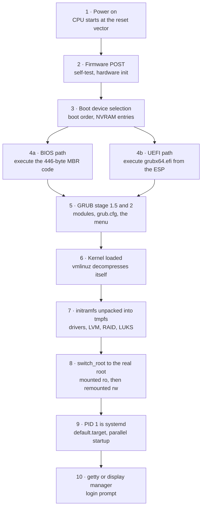
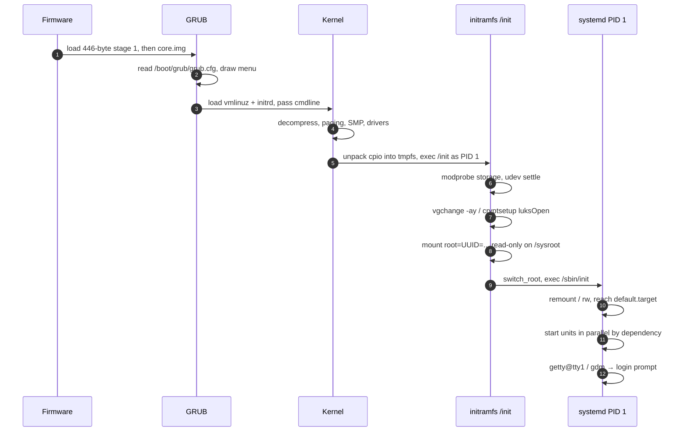

## 1 · The Big Picture

### Why this topic exists

Everything else in this handbook assumes a running system. You `ssh` in, and a shell is waiting. Processes exist. `/` is mounted. `sshd` is listening. Someone — something — arranged all of that before you arrived.

That arrangement is the **boot process**: a chain of roughly ten handovers, each one loading and starting the next, from a CPU that knows nothing to a machine running two hundred processes. It is the only part of Linux where the machine has *no* operating system yet and has to bootstrap one from raw sectors on a disk.

Two facts make this chapter disproportionately valuable.

First, **it is the single most-asked topic in Linux interviews.** "Walk me through the boot process" is asked in first-round screens, in system-administrator interviews, in SRE interviews and in cloud-engineer interviews. It is asked because it is a perfect probe: a candidate who can narrate it accurately has necessarily learned firmware, partitioning, the kernel, filesystems, init systems and logging, because the boot process touches all of them in order. A candidate who cannot has memorised commands.

Second, **it is where you are most alone.** When a web server returns 500, you have logs, metrics, a debugger and Google. When a machine does not boot, you have a black screen, possibly a serial console, and whatever you remember. There is no SSH into a machine that has not booted. Engineers who can recover an unbootable host are visibly more senior than engineers who cannot, and the gap is almost entirely knowledge — the actual commands are few.

### The real problem it solves

Think about the state of a machine one microsecond after you press the power button. RAM is uninitialised noise. No filesystem driver is loaded, so the disk is not a filesystem — it is a numbered array of 512-byte or 4096-byte sectors. There is no concept of a file, a process, a user or a network. The CPU has one instruction pointer and it must point at *something*.

The boot process is the answer to a bootstrapping paradox:

```diagram title="The bootstrapping paradox"
  To read a file from the disk you need a filesystem driver.
  The filesystem driver is a file on the disk.

  To decrypt the root filesystem you need the LUKS module.
  The LUKS module lives inside the root filesystem.

  To start services you need an init system.
  The init system is a program that something must execute.

  ┌────────────────────────────────────────────────────────────┐
  │  Every stage of boot exists to solve one instance of this  │
  │  problem: load just enough capability, from somewhere you  │
  │  can already reach, to reach the next thing.               │
  └────────────────────────────────────────────────────────────┘
```

The universal technique is **staged bootstrapping**: each stage is deliberately dumb and small, understands only how to find and load the next stage, and then hands over control and disappears. Firmware understands sectors but not filesystems. The bootloader's first stage understands one disk and one hard-coded sector list. The kernel understands hardware but not *your* disk layout. The initramfs understands your disk layout but is thrown away seconds later. Only at the end does a full, general-purpose system exist.

### Where you will encounter it

| Context | What the boot process means there |
|---|---|
| A cloud VM that never comes back after `reboot` | Almost always a bad `/etc/fstab`, a broken initramfs, or a full `/boot`. Read the serial console |
| Kernel upgrade in production | New `vmlinuz` + new initramfs + a GRUB config regeneration. Any of the three can fail |
| A bare-metal server in a rack | You will pick BIOS vs UEFI, MBR vs GPT, and Secure Boot on or off, and live with it for years |
| Forgotten root password | Recovered by editing the kernel command line at the GRUB menu. There is no other way without a live USB |
| Slow instance start-up in an autoscaling group | `systemd-analyze blame`; boot time is scaling latency, which is money |
| Golden AMI / image pipelines | Your image must boot unattended, first time, with `cloud-init` doing the personalisation |
| Encrypted laptops and compliance | LUKS unlock happens *inside* the initramfs, before the root filesystem exists |
| Debugging a container that exits immediately | Because containers do **not** boot — and knowing that is half the answer |
| Any CKA/RHCSA/LFCS exam | "Boot into rescue mode and reset the root password" is a standard exam task |

### Why companies care

- **Availability.** A host that reboots cleanly is a host you can patch. Teams that fear reboots stop patching, and unpatched kernels are how estates get compromised. Confidence in boot is confidence in your patch cycle.
- **Scaling latency and cost.** In an autoscaling group, boot time is the time between "we need capacity" and "we have capacity". Trimming 40 seconds off boot across a 500-instance fleet is real money and real headroom during a traffic spike.
- **Recovery time objective.** "How long to bring a dead host back?" is a number in a contract. It is dominated by whether the person on call knows how to `chroot` from a live image.
- **Security posture.** Secure Boot, signed kernel modules, GRUB passwords and full-disk encryption are all boot-stage controls. So is the uncomfortable fact that console access equals root access unless you have configured otherwise.
- **Immutability.** Modern infrastructure practice is to never repair a host — replace it. That only works if the replacement boots reliably and configures itself, which is exactly what `cloud-init` does.

> [!INFO]
> **Why "boot" at all?** From the phrase *to pull oneself up by one's own bootstraps* — a deliberately impossible image, chosen because a computer starting itself from nothing looked equally impossible. "Bootstrap" shortened to "boot" in the 1950s. The word carries the paradox in this chapter's opening: the machine really does have to lift itself.

---

## 2 · Intuition First

### Analogy 1: the relay race

Boot is a relay race in which each runner is faster and better equipped than the last, and each one *dies* after passing the baton.

- The **firmware** runner is ancient, lives in a chip on the motherboard, and can only run 50 metres. It knows how to read the very first sector of a disk and nothing more.
- The **stage 1 bootloader** runner has 446 bytes of instructions — about the length of a tweet. It knows one thing: the sector numbers of the next runner.
- The **stage 2 bootloader** runner is the first who understands what a *file* is. It can read `/boot`, draw a menu, and load two large files into memory.
- The **kernel** runner is enormously capable but arrives knowing nothing about *this* machine's storage layout.
- The **initramfs** runner is a temporary specialist, carried along precisely to find and open the real root filesystem, and is discarded the moment it succeeds.
- **systemd** is the anchor runner and never stops. It runs until you power off.

The relay framing predicts the failure modes correctly: if any runner cannot find the next, the race stops dead where it is. That is exactly what a boot failure looks like — the machine halts at a specific stage, and *which* stage tells you what is broken.

### Analogy 2: waking up

```diagram title="Boot as waking up"
  firmware POST    →  your eyes open; you check your limbs still work
  boot order       →  you decide which room you are in
  GRUB menu        →  you decide what kind of day this will be
                      (normal day / recovery day / yesterday's plan)
  kernel           →  your brain comes online; senses start reporting
  initramfs        →  you fumble for your glasses in the dark, because
                      you cannot find your glasses without your glasses
  switch_root      →  you can see; the temporary fumbling is forgotten
  systemd PID 1    →  you start your routine: kettle, shower, email,
                      several things at once, in dependency order
  login prompt     →  you are ready to be spoken to
```

The initramfs step is the one people find strange, and the glasses image is why: you genuinely need a small, pre-positioned capability to reach the large capability. That is not bad design, it is the *only* design.

### Analogy 3: the sealed envelope chain

Imagine a treasure hunt where clue 1 is engraved on the front door, because it must be somewhere you can read with no tools at all. It is short, so it can only say "look in the third drawer". The drawer holds a bigger note, which can afford to say "read the index on the bookshelf". Only the index is long enough to describe a whole library.

The engraving is the MBR — 446 bytes, because that is all the space the 1983 disk format left. The drawer is the **MBR gap**. The library is `/boot`. Every "why is the bootloader in stages?" answer is that engraving: the first stage is tiny because *physics and history made it tiny*, so its only job can be to point at something bigger.

> [!MEMORY]
> **Each stage knows less than you think and just enough to continue.** Firmware knows sectors. Stage 1 knows a sector list. Stage 2 knows files. The kernel knows hardware. The initramfs knows *your* storage. systemd knows services. Nobody knows everything.

---

## 3 · Technical Definitions

Now the precise versions.

**Booting.** The process by which a computer initialises its hardware and loads an operating system kernel into memory, transferring control to it, up to the point where the system is ready to accept user interaction. It is divided into a **firmware phase**, a **bootloader phase**, a **kernel phase** and an **init phase**.

**POST (Power-On Self-Test).** The firmware's first action: a self-test of the CPU, memory, and essential controllers, followed by enumeration and initialisation of attached hardware. Failures at this stage are reported by beep codes, POST codes on a two-digit display, or diagnostic LEDs — not by anything on screen, because the display may not be initialised yet.

**Firmware.** Software stored in non-volatile memory on the motherboard (an SPI flash chip) that runs before any operating system. The two families are **BIOS** (Basic Input/Output System, 1981, 16-bit real mode) and **UEFI** (Unified Extensible Firmware Interface, the successor, 32/64-bit, with its own executable format, filesystem driver and variable store).

**Bootloader.** A program whose sole purpose is to load an operating system kernel and its initial ramdisk into memory, supply the kernel a command line, and jump to the kernel's entry point. On Linux this is almost always **GRUB 2** (GRand Unified Bootloader, version 2). Alternatives you will meet: **systemd-boot** (UEFI only, minimal), **rEFInd**, **SYSLINUX/ISOLINUX** (live media), **U-Boot** (embedded and ARM boards), and **LILO** (historical).

**MBR (Master Boot Record).** The first 512-byte sector (LBA 0) of a disk using the 1983 DOS partitioning scheme. Its layout:

| Bytes | Contents | Notes |
|---|---|---|
| 0–445 | Bootstrap code | The **446-byte boot area**. Strictly, modern MBRs use 440 bytes of code, then 4 bytes of disk signature and 2 reserved bytes |
| 446–509 | Partition table | Four 16-byte entries — hence the famous **maximum of four primary partitions** |
| 510–511 | Boot signature `0x55AA` | Firmware refuses the disk as bootable without it |

**GPT (GUID Partition Table).** The UEFI-era replacement for MBR: a protective MBR for compatibility, a primary GPT header and partition array at the start of the disk, and a backup copy at the end. Typically 128 partition entries, 64-bit LBAs, and CRC32 checksums on the headers.

**EFI System Partition (ESP).** A FAT32 partition, usually 100–550 MB, flagged as ESP, containing UEFI executables (`.efi`) and their support files. On Linux it is conventionally mounted at **`/boot/efi`**.

**Kernel image (`vmlinuz`).** A compressed, self-extracting bootable kernel. The name is historic: `vmlinux` was the plain ELF kernel with virtual-memory support, and the trailing `z` marks it compressed. The bootloader loads it whole; it decompresses itself in place.

**initramfs (initial RAM filesystem).** A compressed **cpio archive** which the kernel unpacks into a `tmpfs` and uses as a temporary root filesystem. It contains just enough userspace — a shell, a handful of tools, and the kernel modules needed for *this* machine's storage — to locate, prepare and mount the real root filesystem.

**init / PID 1.** The first userspace process the kernel starts, conventionally `/sbin/init`. It is the ancestor of every other process, it adopts orphaned processes and reaps them, and **it cannot be killed** — if it exits, the kernel panics. On modern distributions `/sbin/init` is a symlink to `/lib/systemd/systemd`.

**systemd.** The init system and service manager used by essentially all mainstream distributions since 2014–2015. It starts services in parallel according to declared dependencies, tracks them in cgroups, and replaces the sequential shell scripts of SysV init.

**Target.** A systemd unit that groups other units and acts as a synchronisation point. Targets replaced SysV **runlevels**. The one reached by default is whatever `default.target` points to.

**Kernel command line.** The string of parameters the bootloader hands the kernel, readable afterwards at `/proc/cmdline`. It is the single most important lever you have during a boot failure, because you can edit it interactively at the GRUB menu.

Unpacking the dense phrase people get asked to explain:

| Term in "the kernel unpacks a compressed cpio archive into a tmpfs and executes `/init`" | What it means |
|---|---|
| compressed | gzip, or on modern distributions zstd, lz4 or xz — chosen for decompression speed |
| cpio archive | An old, extremely simple archive format: header, filename, data, repeat. Simple enough for the kernel itself to parse, unlike `tar` in practice |
| unpacks into a tmpfs | A RAM-backed filesystem. There is no disk involved, so no disk driver is required yet |
| executes `/init` | The kernel looks for `/init` in that tmpfs. On Debian it is a shell script; with dracut it may be systemd itself |

---

## 4 · Internal Working — The Ten Stages

This section is the spine of the chapter. Number the stages and learn them in order; when an interviewer says "walk me through the boot process", you are being asked to recite exactly this.

### The chain, at a glance



### Where each stage physically lives

The most useful mental upgrade in this chapter is knowing *what medium* each stage is stored on, because that tells you what tool can repair it.

```diagram title="Stage by stage, on the metal"
STAGE   WHAT RUNS                        WHERE IT PHYSICALLY LIVES
──────────────────────────────────────────────────────────────────────────────
  1   CPU reset vector              on-die microcode; a hard-wired address
  2   firmware / POST               SPI flash chip soldered to the board
  3   boot device selection         BIOS: CMOS/NVRAM settings
                                    UEFI: NVRAM boot variables (Boot0001…)
  4   bootloader stage 1
        BIOS   boot.img             LBA 0 — the first 446 bytes of the disk
        UEFI   shimx64.efi          ESP (FAT32): /EFI/ubuntu/shimx64.efi
                                    fallback: /EFI/BOOT/BOOTX64.EFI
  5   stage 1.5  core.img           the "MBR gap": LBA 1–62, ~31 KiB
                                    or, on GPT, the BIOS boot partition (ef02)
      stage 2  modules + config     /boot/grub/   grub.cfg, *.mod, fonts
  6   kernel                        /boot/vmlinuz-6.8.0-45-generic
  7   initramfs                     /boot/initrd.img-6.8.0-45-generic
                                    → unpacked into a tmpfs mounted at /
  8   real root filesystem          /dev/sda2, located via root=UUID=…
  9   PID 1                         /sbin/init → /lib/systemd/systemd
      unit files                    /etc/systemd/system   (admin — wins)
                                    /run/systemd/system   (runtime)
                                    /lib/systemd/system   (package defaults)
 10   login                         getty@tty1.service → /bin/login
                                    or gdm.service / sddm.service
──────────────────────────────────────────────────────────────────────────────
From stage 6 downwards, every stage is a FILE: you can list it, checksum it,
copy it, replace it from a rescue shell.
Above stage 6 it is firmware or raw sectors — no `ls` will show it to you.
```

### Stage 1 — Power on

The power supply asserts a "power good" signal. The CPU comes out of reset with a fixed, architecturally defined instruction pointer — the **reset vector**. On x86 this is `0xFFFFFFF0`, which the chipset maps to the firmware flash chip. The CPU is in 16-bit real mode with one core active; there is no RAM initialisation yet, so the earliest firmware code runs out of CPU cache used as memory.

You cannot influence this stage. You just need to know it exists, because "nothing at all happens, no fans, no logo" is a stage 1 or stage 2 problem — hardware, not Linux.

### Stage 2 — Firmware and POST

The firmware:

1. Runs the **POST**: verifies the CPU, initialises the memory controller and trains RAM, checks essential buses.
2. Initialises devices: PCIe enumeration, storage controllers, USB, and (importantly) the display, which is why a vendor logo is the first visible sign of life.
3. Reads its configuration — boot order, Secure Boot state, virtualisation flags — from CMOS (BIOS) or NVRAM (UEFI).
4. Presents its setup interface if you press the magic key (`Del`, `F2`, `F10`, `F12`, `Esc` — vendor-dependent).

Failure here produces **beep codes** or POST codes, never a Linux message. If you see nothing on screen and no beeps, suspect power, RAM seating or the GPU before you suspect anything in this handbook.

### Stage 3 — Boot device selection

The firmware walks its boot order looking for something bootable.

- **BIOS** tries each device in turn, reads LBA 0, and checks for the `0x55AA` signature at bytes 510–511. If present, it copies the 512 bytes to memory address `0x7C00` and jumps there. That is the entire BIOS contract: *one sector, one signature, one jump.*
- **UEFI** reads its own NVRAM boot variables, each of which names a disk, a partition and a path to a `.efi` file. It mounts the ESP itself — UEFI contains a FAT driver — and executes the named binary. If no variable matches, it falls back to the removable-media path `/EFI/BOOT/BOOTX64.EFI`, which is why a USB installer boots on machines that have never seen it.

The message **"No bootable device"** / **"Operating system not found"** is this stage failing: wrong boot order, wiped bootloader, dead disk, or a UEFI machine looking for an `.efi` file that a Windows installer overwrote.

### Stage 4 — Bootloader stage 1

446 bytes is not enough space for a filesystem driver. It is barely enough to set up a stack, reset the disk controller, and read a hard-coded list of sectors. So GRUB's `boot.img` does precisely that: it contains the LBA address of the next stage, blasted directly into it by `grub-install`, and loads it.

> [!INFO]
> **Why `grub-install` and not `cp`.** Stage 1 does not look up a *file*; it holds a *sector number*. That is why installing GRUB is a special command that writes raw sectors, and why moving or defragmenting `/boot` on an old system could break booting. It is also why `update-grub` (which only rewrites a text config file) and `grub-install` (which rewrites boot sectors) are different operations that people constantly confuse.

On UEFI there is no stage 1 in this sense: the firmware can read files from the ESP, so it loads a full bootloader binary immediately. That is the single biggest practical simplification UEFI brought.

### Stage 5 — Bootloader stage 1.5 and stage 2

**Stage 1.5** (`core.img`) lives in the ~31 KiB gap between the MBR and the first partition — historically sectors 1 to 62, because DOS aligned the first partition at sector 63. That is enough room for GRUB to embed the filesystem driver for whatever filesystem `/boot` uses. On GPT disks booted via BIOS there is no gap, so you must create a small **BIOS boot partition** (type `ef02`, ~1 MiB) to hold `core.img` — forgetting it is a classic manual-partitioning failure.

**Stage 2** is now a normal program reading normal files from `/boot/grub/`: it loads modules (`ext2.mod`, `lvm.mod`, `luks.mod`, `part_gpt.mod`), reads `grub.cfg`, draws the menu, and waits out `GRUB_TIMEOUT`. When the timeout expires or you press Enter, it:

1. Loads `/boot/vmlinuz-…` into memory.
2. Loads `/boot/initrd.img-…` into memory.
3. Hands the kernel its command line (`root=UUID=… ro quiet splash`).
4. Jumps to the kernel's entry point and ceases to exist.

### Stage 6 — Kernel load and decompression

`vmlinuz` begins with a small uncompressed **decompression stub**. It runs first, inflates the real kernel into memory, and jumps to it. From there the kernel:

- switches the CPU to long mode (64-bit) and enables paging,
- initialises the memory manager and builds the page tables,
- starts the scheduler and brings up the other CPU cores,
- initialises built-in drivers and the console,
- and writes its first log lines to the **kernel ring buffer** — the ones you later read with `dmesg`.

The very first line is always the kernel banner, and the line after the hardware probing is `Command line:` — worth knowing, because reading it confirms exactly which parameters GRUB actually passed.

```console
$ dmesg -T | head -8
[Thu Jul 31 09:14:02 2025] Linux version 6.8.0-45-generic (buildd@lcy02-amd64-089) (x86_64-linux-gnu-gcc-13 (Ubuntu 13.2.0-23ubuntu4) 13.2.0, GNU ld (GNU Binutils for Ubuntu) 2.42) #45-Ubuntu SMP PREEMPT_DYNAMIC Fri Aug 30 12:02:04 UTC 2024
[Thu Jul 31 09:14:02 2025] Command line: BOOT_IMAGE=/boot/vmlinuz-6.8.0-45-generic root=UUID=8f3a1c7e-2b4d-4e19-9a76-c5d0e8f21b43 ro quiet splash
[Thu Jul 31 09:14:02 2025] KERNEL supported cpus:
[Thu Jul 31 09:14:02 2025]   Intel GenuineIntel
[Thu Jul 31 09:14:02 2025]   AMD AuthenticAMD
[Thu Jul 31 09:14:02 2025] BIOS-provided physical RAM map:
[Thu Jul 31 09:14:02 2025] efi: EFI v2.7 by EDK II
[Thu Jul 31 09:14:02 2025] Memory: 8039488K/8388608K available
```

Two things are already visible: `efi: EFI v2.7` proves this machine booted via UEFI, and `Command line:` shows the root filesystem is identified by UUID and mounted read-only (`ro`) to begin with.

### Stage 7 — The initramfs as temporary root

The kernel unpacks the cpio archive into a `tmpfs`, makes it `/`, and executes `/init`. That `/init` is a userspace program running with a full kernel underneath it but almost no filesystem. Its job list:

1. Mount the pseudo-filesystems: `/proc`, `/sys`, `/dev` (`devtmpfs`), `/run`.
2. `modprobe` the storage drivers this machine needs — NVMe, AHCI, `virtio_blk`/`virtio_scsi` on a VM, megaraid on a server, plus the filesystem module for the root filesystem.
3. Run `udev` to settle device naming, so `/dev/disk/by-uuid/…` exists.
4. Assemble anything composite: `mdadm --assemble` for software RAID, `vgchange -ay` for LVM, `cryptsetup luksOpen` for encryption — **this is where the disk-password prompt comes from**.
5. Wait for the device named by `root=` to appear (with a timeout — the source of "Gave up waiting for root device").
6. Mount it, read-only, at `/root` (Debian) or `/sysroot` (dracut).
7. Hand over with `switch_root` (or `pivot_root`).

### Stage 8 — Pivot to the real root

`switch_root` moves the mount to `/`, deletes the entire tmpfs to reclaim its RAM, and `exec`s the real `/sbin/init`. Because it `exec`s rather than forks, **PID 1 stays PID 1** — the initramfs's `/init` was PID 1, and systemd inherits that number.

The root filesystem is still mounted **read-only** at this point. `systemd-remount-fs.service` runs `fsck` if needed and then remounts it read-write, honouring the options in `/etc/fstab`. This ordering is the reason a recovery shell so often lands you with a read-only `/` and why `mount -o remount,rw /` is the most-forgotten command in Linux recovery.



### Stage 9 — systemd as PID 1

systemd reads `default.target`, computes the transitive closure of its dependencies, and starts everything it can in parallel. Detail is in section 9 below and in Chapter 09.

### Stage 10 — Login

The last visible step. On a server, `getty@tty1.service` spawns `agetty`, which opens the terminal, prints `/etc/issue` and the `login:` prompt, and `exec`s `/bin/login`. On a desktop, `gdm.service` (GNOME), `sddm.service` (KDE) or `lightdm.service` draws a graphical greeter. On a cloud VM there may be no interactive login at all — you arrive over the network, via `sshd.service`, which is why "boots but I cannot SSH in" is a stage 10 problem with a stage 9 cause.

> [!EXAM]
> **The ten-stage recitation, compressed to one line each.** Power on → firmware POST → boot device selected → stage 1 bootloader from the MBR or ESP → GRUB stage 2 reads `grub.cfg` and shows the menu → kernel loaded and self-decompressed → initramfs unpacked as temporary root → real root found and pivoted into → `/sbin/init` = systemd as PID 1 → default target reached, services started, login prompt. Ten items, in order, is a complete answer.

---

## 5 · Firmware — BIOS versus UEFI

Every Linux machine you touch booted one of two ways, and the difference changes the partition scheme, the location of the bootloader, the recovery procedure and whether your NVIDIA driver loads.

### The comparison

| Dimension | BIOS (Legacy) | UEFI |
|---|---|---|
| Age and origin | IBM PC, 1981; effectively frozen by the mid-1990s | Intel EFI 1998, opened as UEFI 2005; universal on consumer hardware from ~2012 |
| CPU mode at handover | 16-bit real mode, 1 MB addressable | 32- or 64-bit protected/long mode, full RAM addressable |
| Firmware interface | Software interrupts (`INT 13h` for disk) | A defined C API — boot services and runtime services |
| Partition scheme it pairs with | **MBR** | **GPT** (it can read MBR, but GPT is the design pairing) |
| Where boot code lives | The **446-byte boot area** of LBA 0, plus the MBR gap | `.efi` binaries in a FAT32 **EFI System Partition**, mounted at `/boot/efi` |
| Max primary partitions | **4** (one may be an extended container) | 128 by default, and no primary/extended distinction |
| Max disk size it can boot | ~**2 TiB** with 512-byte sectors (32-bit LBA) | ~8 ZiB (64-bit LBA) — not a practical limit |
| Boot device selection | A fixed device order in CMOS | Named **NVRAM boot entries**, each pointing at a file; reorderable per entry |
| Built-in boot manager | None — you get one sector and one jump | Yes: a menu, multiple OS entries, one-shot next-boot selection |
| Filesystem support | None whatsoever | FAT12/16/32 mandatory; vendors may add more |
| Secure Boot | Not available | Yes — cryptographic signature verification of what it loads |
| Fast boot | No; POST is serial and slow | Yes — parallel initialisation, skippable device probing, and firmware that can cache hardware state |
| Legacy compatibility | n/a | **CSM** (Compatibility Support Module) emulates BIOS so old OSes boot. Being removed from new firmware |
| Diagnostics and pre-boot tools | Beep codes | Full applications: shells, firmware updaters, network boot, memory testers |
| Practical verdict | ⚠ Only for old hardware or deliberate legacy setups | ✔ The default; assume it unless proven otherwise |

### The one-command test

You will be asked "how do you tell which firmware a running machine booted with?" There is exactly one correct answer:

```bash
ls /sys/firmware/efi
```

```console
$ ls /sys/firmware/efi
config_table  efivars  fw_platform_size  fw_vendor  runtime  runtime-map  systab
```

If that directory **exists**, the kernel was handed control by UEFI. If you get `No such file or directory`, you booted in BIOS/CSM mode. The kernel only creates `/sys/firmware/efi` when EFI boot services were present at hand-over, so this is authoritative — unlike guessing from the partition table, because a GPT disk can perfectly well be booted by BIOS.

Two useful corroborations:

```console
$ [ -d /sys/firmware/efi ] && echo UEFI || echo BIOS
UEFI

$ dmesg | grep -i 'efi v'
[    0.000000] efi: EFI v2.7 by EDK II

$ lsblk -o NAME,SIZE,FSTYPE,PARTTYPENAME,MOUNTPOINT
NAME     SIZE FSTYPE PARTTYPENAME             MOUNTPOINT
sda       40G
├─sda1   512M vfat   EFI System               /boot/efi
├─sda2     1G ext4   Linux filesystem         /boot
└─sda3  38.5G LVM2_m Linux LVM
```

An `EFI System` partition mounted at `/boot/efi` is strong evidence, but the `/sys/firmware/efi` test is the proof.

### Managing UEFI boot entries: `efibootmgr`

UEFI keeps its boot menu in NVRAM, and Linux can read and edit it.

```console
$ sudo efibootmgr -v
BootCurrent: 0002
Timeout: 2 seconds
BootOrder: 0002,0001,0000,0003
Boot0000* Windows Boot Manager	HD(1,GPT,7f9e2c14-3b8a-4d61-9f22-1a0c7e5d3b88,0x800,0x100000)/File(\EFI\Microsoft\Boot\bootmgfw.efi)
Boot0001* UEFI: PXE IPv4 Intel(R) Ethernet	PciRoot(0x0)/Pci(0x1c,0x0)/Pci(0x0,0x0)/MAC(a4bb6d1f2e07,0)
Boot0002* ubuntu	HD(1,GPT,7f9e2c14-3b8a-4d61-9f22-1a0c7e5d3b88,0x800,0x100000)/File(\EFI\ubuntu\shimx64.efi)
Boot0003* UEFI: SanDisk Cruzer	PciRoot(0x0)/Pci(0x14,0x0)/USB(2,0)
```

| Field | Meaning |
|---|---|
| `BootCurrent: 0002` | The entry that booted *this* session — here, `ubuntu` |
| `Timeout: 2 seconds` | How long the firmware menu waits |
| `BootOrder: 0002,0001,...` | The order the firmware tries entries. Reordering this is how you make Linux boot first |
| `Boot0002* ubuntu` | Entry number, `*` = active, then the label shown in the firmware menu |
| `HD(1,GPT,7f9e...)` | Disk and partition — partition 1, GPT, with that partition GUID |
| `File(\EFI\ubuntu\shimx64.efi)` | The path *within the ESP* to the binary. Note backslashes: it is a FAT path |

Common operations:

| Command | Effect |
|---|---|
| `efibootmgr -v` | Show all entries verbosely — always start here |
| `efibootmgr -o 0002,0000,0001` | Set the boot order |
| `efibootmgr -n 0000` | Boot entry `0000` **once** on the next boot only (`BootNext`) |
| `efibootmgr -b 0003 -B` | Delete entry `0003` |
| `efibootmgr -c -d /dev/sda -p 1 -L "ubuntu" -l '\EFI\ubuntu\shimx64.efi'` | Create an entry — disk, partition, label, loader path |
| `efibootmgr -a 0002` / `-A 0002` | Activate / deactivate an entry |

> [!DANGER]
> `efibootmgr` writes to motherboard NVRAM. A handful of buggy firmwares (notoriously some 2012–2015 Samsung and Lenovo laptops) have been **bricked** by filling or corrupting their variable store; the kernel now refuses writes when free NVRAM space drops below about 5%. Deleting every entry, or `rm -rf /sys/firmware/efi/efivars/*`, can leave a machine that will not boot anything and cannot be fixed from software. Read with `-v` freely; write deliberately, one change at a time.

### Secure Boot, and the day your driver stops loading

**Secure Boot** makes the firmware verify a cryptographic signature on everything it loads. The chain on a typical Linux install:

```diagram title="The Secure Boot chain of trust"
  firmware (holds Microsoft's + OEM's public keys in the db)
        │  verifies signature
        ▼
  shimx64.efi   — a tiny loader signed by Microsoft, shipped by the distro,
                  which also carries the distro's own key and the MOK list
        │
        ▼
  grubx64.efi   — signed by the distribution
        │
        ▼
  vmlinuz       — signed by the distribution
        │
        ▼
  kernel modules — must ALSO be signed if the kernel enforces lockdown
```

That last line is where Secure Boot stops being an abstraction. A signed, locked-down kernel refuses to load unsigned modules, so out-of-tree drivers built on your machine by DKMS fail:

```console
$ sudo modprobe nvidia
modprobe: ERROR: could not insert 'nvidia': Key was rejected by service

$ sudo dmesg -l err | tail -3
[  312.884211] Loading of unsigned module is rejected
[  312.884219] nvidia: module verification failed: signature and/or required key missing - tainting kernel
[  312.884301] nvidia: Unknown symbol drm_gem_object_put (err -2)
```

The same failure hits **VirtualBox** (`vboxdrv`), **ZFS**, and many vendor storage and network drivers. Check the state first:

```console
$ mokutil --sb-state
SecureBoot enabled

$ sudo dmesg | grep -i 'secure boot'
[    0.000000] secureboot: Secure boot enabled
[    0.000000] Kernel is locked down from EFI Secure Boot mode; see man kernel_lockdown.7
```

Three ways out, in order of preference:

1. **Enrol your own key with MOK** — `sudo mokutil --import /var/lib/shim-signed/mok/MOK.der`, set a one-time password, reboot into the blue MokManager screen and enrol it. DKMS on Ubuntu and Debian signs modules with that key automatically. This keeps Secure Boot on. Correct answer in an interview.
2. **Use a signed, in-tree driver** — the distribution's own packaged NVIDIA driver, or `nouveau`, is already signed.
3. **Disable Secure Boot in firmware setup**, or `sudo mokutil --disable-validation`. Fast, and it is what most people actually do on a laptop, but it removes the protection and may violate a corporate baseline. Say so if you offer it.

> [!WARNING]
> Secure Boot is not full-disk encryption and it does not protect data at rest. It protects the *boot chain* from bootkits and unsigned kernel tampering. An attacker with the disk in their hands still reads everything unless the filesystem is encrypted with LUKS. Interviewers like separating these two, because candidates conflate them.

> [!PROD]
> On cloud you rarely choose. AWS Nitro instances present UEFI or BIOS depending on the AMI's `boot_mode` (`uefi`, `legacy-bios` or `uefi-preferred`); Graviton is UEFI only. GCE Shielded VMs enable Secure Boot, vTPM and integrity monitoring — and Shielded VMs are exactly where third-party kernel modules unexpectedly stop loading. Azure Generation 2 VMs are UEFI, Generation 1 are BIOS, and you cannot convert a running VM between them.

---

## 6 · GRUB 2, the Bootloader

### What a bootloader is actually for

The firmware can load exactly one thing, from exactly one place, with no choices. Real systems need choices:

- **Which kernel?** After an upgrade you have two or three installed, and if the new one panics you need the old one.
- **Which operating system?** Dual boot with Windows, or several Linux installs.
- **Which parameters?** `nomodeset` for a broken GPU, `single` for recovery, `console=ttyS0` for a serial console.
- **Which root filesystem?** Found by UUID, possibly inside LVM, possibly encrypted.

A bootloader is the layer that turns "load these 512 bytes" into "present a menu, read a config file, accept keyboard input, and load an arbitrary kernel with an arbitrary command line". GRUB 2 is a small operating system in its own right: it has modules, a scripting language, filesystem drivers, a font renderer and a rescue shell.

### Why it needs stages — the MBR gap problem

GRUB is roughly 200 KB of code plus modules. It must be started by 446 bytes. That gap is bridged in three hops:

```diagram title="The three GRUB stages and why they exist"
 ┌──────────────────────────────────────────────────────────────────────┐
 │ STAGE 1   boot.img            446 bytes, LBA 0                       │
 │           Contains: the LBA of core.img, hard-coded at install time. │
 │           Can do: reset the disk, read sectors via INT 13h, jump.    │
 │           Cannot do: understand a filesystem, read a config file.    │
 └───────────────────────────────┬──────────────────────────────────────┘
                                 ▼
 ┌──────────────────────────────────────────────────────────────────────┐
 │ STAGE 1.5 core.img            ~25-30 KiB, LBA 1-62 (the "MBR gap"),  │
 │                               or the BIOS boot partition on GPT      │
 │           Contains: a minimal kernel plus the ONE filesystem driver  │
 │           needed to read /boot. Now it can open files by name.       │
 └───────────────────────────────┬──────────────────────────────────────┘
                                 ▼
 ┌──────────────────────────────────────────────────────────────────────┐
 │ STAGE 2   /boot/grub/*        Unlimited size, ordinary files         │
 │           grub.cfg, *.mod, fonts, themes, locale.                    │
 │           Draws the menu, edits command lines, loads the kernel.     │
 └──────────────────────────────────────────────────────────────────────┘

 UEFI collapses stages 1 and 1.5: firmware reads FAT itself, so it can
 load the whole grubx64.efi in one step. No gap, no embedded sector list.
```

The MBR gap is also a security footnote: it is unpartitioned, unmonitored space on the disk that malware has historically used to hide bootkits. Secure Boot exists partly to close that door.

### The configuration files, and which one you edit

This is the highest-yield practical knowledge in the section, because getting it backwards wastes an afternoon.

| Path | What it is | Do you edit it? |
|---|---|---|
| `/boot/grub/grub.cfg` (Debian/Ubuntu) | The **generated** menu. Hundreds of lines of GRUB script | ✘ **Never.** Regenerated on every kernel update; your edits vanish |
| `/boot/grub2/grub.cfg` (RHEL/Fedora/SUSE) | The same file, different path | ✘ Never |
| `/etc/default/grub` | Human-facing settings: timeout, default entry, kernel parameters | ✔ **Yes — this is the file you edit** |
| `/etc/grub.d/` | Executable snippets that *produce* `grub.cfg` | ✔ For advanced work; add custom entries to `40_custom` |
| `/boot/grub/grubenv`, `/boot/grub2/grubenv` | Saved state: last-booted entry, `next_entry` | ✔ Via `grub-editenv` / `grub2-editenv`, not by hand |
| `/etc/grub.d/40_custom` | Your own menu entries, preserved across regeneration | ✔ Yes |

```console
$ head -6 /boot/grub/grub.cfg
#
# DO NOT EDIT THIS FILE
#
# It is automatically generated by grub-mkconfig using templates
# from /etc/grub.d and settings from /etc/default/grub
#
```

The file tells you itself. Believe it.

### `/etc/default/grub` line by line

```ini title="/etc/default/grub — a realistic server configuration"
GRUB_DEFAULT=0
GRUB_TIMEOUT_STYLE=menu
GRUB_TIMEOUT=5
GRUB_DISTRIBUTOR=`lsb_release -i -s 2> /dev/null || echo Debian`
GRUB_CMDLINE_LINUX_DEFAULT="quiet splash"
GRUB_CMDLINE_LINUX="console=tty0 console=ttyS0,115200n8"
GRUB_DISABLE_RECOVERY="false"
GRUB_DISABLE_OS_PROBER="false"
GRUB_TERMINAL=console
```

| Setting | Meaning | Values worth knowing |
|---|---|---|
| `GRUB_DEFAULT` | Which entry boots by default | `0` = first entry; `saved` = whatever booted last (pair with `grub-set-default`); or an exact entry name or `1>2` for a submenu item |
| `GRUB_TIMEOUT` | Seconds the menu waits | `5` is sane. `0` = boot instantly with no menu — **do not do this on a remote server**. `-1` = wait forever, which hangs an unattended reboot |
| `GRUB_TIMEOUT_STYLE` | Whether the menu is drawn | `menu` (always show), `hidden` (show only if a key is held), `countdown` |
| `GRUB_CMDLINE_LINUX_DEFAULT` | Parameters for the **normal** entries only | Where `quiet splash` lives. Remove them to watch the kernel boot |
| `GRUB_CMDLINE_LINUX` | Parameters for **every** entry, recovery included | Put `console=ttyS0` and permanent tunables here |
| `GRUB_DISABLE_RECOVERY` | Whether to generate the "recovery mode" entries | Keep `false`; those entries are free insurance |
| `GRUB_DISABLE_OS_PROBER` | Whether to scan for other OSes | Set `false` if dual-booting and Windows disappeared from the menu |
| `GRUB_TERMINAL` | Where GRUB draws its menu | `console` for the screen; `serial` to put the **menu itself** on a serial line — essential on headless hardware |
| `GRUB_GFXMODE` | Menu resolution | `1024x768`, `auto` |
| `GRUB_ENABLE_BLSCFG` | RHEL 8+/Fedora: entries come from `/boot/loader/entries/*.conf` (BootLoaderSpec) instead of `grub.cfg` | `true` on RHEL 8+ — this is why `grubby` is the RHEL tool |

### Applying changes — the distribution split

Editing `/etc/default/grub` changes nothing until you regenerate. **This is the step people forget, and then conclude the setting does not work.**

```bash
# Debian, Ubuntu — the wrapper everyone uses
sudo update-grub

# ...which is exactly this underneath
sudo grub-mkconfig -o /boot/grub/grub.cfg

# RHEL, CentOS, Rocky, Alma, Fedora — note "grub2", and the path differs
sudo grub2-mkconfig -o /boot/grub2/grub.cfg

# openSUSE
sudo grub2-mkconfig -o /boot/grub2/grub.cfg
```

```console
$ sudo update-grub
Sourcing file `/etc/default/grub'
Sourcing file `/etc/default/grub.d/init-select.cfg'
Generating grub configuration file ...
Found linux image: /boot/vmlinuz-6.8.0-45-generic
Found initrd image: /boot/initrd.img-6.8.0-45-generic
Found linux image: /boot/vmlinuz-6.8.0-40-generic
Found initrd image: /boot/initrd.img-6.8.0-40-generic
Found memtest86+x64 image: /boot/memtest86+x64.bin
Warning: os-prober will not be executed to detect other bootable partitions.
done
```

Read that output as a checklist: it found two kernels and their matching initrds. If a kernel is listed with **no** matching initrd line, that machine will panic when you select it.

> [!WARNING]
> **The Debian/RHEL path difference is a favourite exam trap.** Debian family: command `update-grub` (or `grub-mkconfig`), output `/boot/grub/grub.cfg`. RHEL family: command `grub2-mkconfig`, output `/boot/grub2/grub.cfg`, and on RHEL 8+ the kernel arguments are better managed with `grubby --update-kernel=ALL --args="..."` because BootLoaderSpec entries live in `/boot/loader/entries/`. Older RHEL 7 UEFI systems used `/boot/efi/EFI/redhat/grub.cfg`; RHEL 9 unified on `/boot/grub2/grub.cfg`. When you are unsure on a live system, `ls /boot/grub*` answers it in one command.

### `/etc/grub.d/` — the snippets that build the menu

```console
$ ls -l /etc/grub.d/
-rwxr-xr-x 1 root root 10046 Mar 26 09:12 00_header
-rwxr-xr-x 1 root root  6260 Mar 26 09:12 05_debian_theme
-rwxr-xr-x 1 root root 18150 Mar 26 09:12 10_linux
-rwxr-xr-x 1 root root 42990 Mar 26 09:12 10_linux_zfs
-rwxr-xr-x 1 root root 14180 Mar 26 09:12 20_linux_xen
-rwxr-xr-x 1 root root  1414 Mar 26 09:12 25_bli
-rwxr-xr-x 1 root root 12894 Mar 26 09:12 30_os-prober
-rwxr-xr-x 1 root root  1372 Mar 26 09:12 30_uefi-firmware
-rwxr-xr-x 1 root root   214 Mar 26 09:12 40_custom
-rwxr-xr-x 1 root root   216 Mar 26 09:12 41_custom
```

They run in numeric order and their combined stdout *is* `grub.cfg`. `00_header` emits settings, `10_linux` scans `/boot` for kernels, `30_os-prober` looks for Windows and other Linuxes, `40_custom` is copied through verbatim for your own entries. Making a snippet non-executable (`chmod -x /etc/grub.d/30_os-prober`) is how you disable it.

```bash title="/etc/grub.d/40_custom — a memtest entry that survives updates"
#!/bin/sh
exec tail -n +3 $0
# Lines below are copied verbatim into grub.cfg.
menuentry "Boot with serial console and no graphics" {
    linux /boot/vmlinuz-6.8.0-45-generic root=UUID=8f3a1c7e-2b4d-4e19-9a76-c5d0e8f21b43 ro console=ttyS0,115200n8 nomodeset
    initrd /boot/initrd.img-6.8.0-45-generic
}
```

### Installing GRUB to a disk: `grub-install`

`update-grub` rewrites a *file*. `grub-install` rewrites *boot sectors and/or the ESP*. You need it after replacing a disk, cloning a system, restoring from backup, or when Windows has overwritten your bootloader.

```bash
# BIOS/MBR — note the DISK, not a partition. /dev/sda, never /dev/sda1
sudo grub-install /dev/sda

# UEFI — writes to the ESP and creates an NVRAM entry
sudo grub-install --target=x86_64-efi --efi-directory=/boot/efi --bootloader-id=ubuntu

# UEFI, also writing the removable fallback path /EFI/BOOT/BOOTX64.EFI
sudo grub-install --target=x86_64-efi --efi-directory=/boot/efi \
     --bootloader-id=ubuntu --removable

# RHEL family
sudo grub2-install /dev/sda
```

> [!MISTAKE]
> **`sudo grub-install /dev/sda1`.** Pointing `grub-install` at a *partition* rather than the whole disk installs to the partition boot sector, which BIOS never reads. The machine appears to install GRUB successfully and then will not boot. The rule: MBR boot code goes on the **disk**; on UEFI you do not name a disk at all, you name the `--efi-directory`.

### The GRUB rescue shell

Two prompts, and the difference tells you how much is broken:

- `grub>` — the **normal shell**. Stage 2 loaded, modules are available, but `grub.cfg` was missing or broken.
- `grub rescue>` — the **rescue shell**. Stage 1.5 ran but could not find its module directory (`prefix` is wrong, `/boot` moved, or a partition number changed). Very few commands work: `ls`, `set`, `unset`, `insmod`.

Recovering from `grub rescue>`:

```console
grub rescue> ls
(hd0) (hd0,gpt1) (hd0,gpt2) (hd0,gpt3) (hd1) (hd1,msdos1)

grub rescue> ls (hd0,gpt2)/
lost+found/ boot/ etc/ usr/ var/ home/ bin/ sbin/ lib/ tmp/ root/

grub rescue> ls (hd0,gpt2)/boot/grub
i386-pc/ x86_64-efi/ grub.cfg grubenv fonts/ locale/

grub rescue> set root=(hd0,gpt2)
grub rescue> set prefix=(hd0,gpt2)/boot/grub
grub rescue> insmod normal
grub rescue> normal
```

`ls` with no argument lists devices; `ls (hd0,gpt2)/` lists that partition's root, which is how you *identify* which partition holds your system — look for `etc/` and `usr/`. Setting `prefix` tells GRUB where its modules are; `insmod normal` loads the module that implements the menu; `normal` starts it.

If `grub.cfg` itself is gone, boot the kernel by hand from the `grub>` prompt:

```console
grub> set root=(hd0,gpt2)
grub> linux /boot/vmlinuz-6.8.0-45-generic root=/dev/sda2 ro
grub> initrd /boot/initrd.img-6.8.0-45-generic
grub> boot
```

Four commands, in that order: **set root, linux, initrd, boot**. Memorise them; they are worth more in an outage than any other four commands in this chapter. Note the two different meanings of "root": `set root=` tells *GRUB* where to read files from, while `root=` on the `linux` line tells the *kernel* which filesystem to mount. They are usually the same partition and always confuse people. GRUB's tab-completion works, so you can type `linux /boot/vmli` and press Tab.

Once booted, make it permanent from inside the running system:

```bash
sudo update-grub
sudo grub-install /dev/sda      # or the UEFI form above
```

### Editing the kernel command line at the menu — the most useful skill in this chapter

Everything above is preparation for this. If you learn one practical technique from this chapter, learn this one.

**Getting the menu to appear.** On a machine with a hidden menu, hold **Shift** during boot (BIOS) or tap **Esc** repeatedly (UEFI). On a VM, start pressing before the firmware logo clears. In VirtualBox and VMware you may need to click into the window first; on a cloud VM, use the provider's console and increase `GRUB_TIMEOUT` beforehand.

**Editing an entry.**

```diagram title="Interrupting GRUB and editing the command line"
 1. Boot. Hold Shift (BIOS) or tap Esc (UEFI).
 2. The menu appears:
      ┌────────────────────────────────────────────────────┐
      │ *Ubuntu                                            │
      │  Advanced options for Ubuntu                       │
      │  Memory test (memtest86+)                          │
      └────────────────────────────────────────────────────┘
 3. Highlight the entry with ↑ ↓ — do NOT press Enter.
 4. Press  e  to edit it. You get the entry's script.
 5. Find the line beginning with  linux  (may be wrapped):
      linux /boot/vmlinuz-6.8.0-45-generic \
            root=UUID=8f3a1c7e-... ro quiet splash
 6. Move to the END of that line with ↓ and End.
 7. Append what you need (see the table below).
 8. Press  Ctrl+X  or  F10  to boot with the edit.
 9. Press  Esc  to abandon the edit and return to the menu.

 The edit is IN MEMORY ONLY. Nothing on disk changes. The next
 boot is unaffected — which is exactly what makes this safe.
```

That last point is the reason this technique is so good: it is a completely non-destructive experiment. You can try five different parameter sets in five reboots and leave no trace.

**What to append, and what each one gives you:**

| Append | Effect | Use when |
|---|---|---|
| `single` or `1` | systemd maps this to `rescue.target`: single-user, root filesystem mounted, minimal services | Standard recovery. Filesystems are available |
| `systemd.unit=rescue.target` | The explicit, modern form of the same thing | You want to be unambiguous, or `single` was ignored |
| `systemd.unit=emergency.target` or `emergency` | Almost nothing started; `/` read-only; a bare root shell | `rescue` itself fails, e.g. a broken `/etc/fstab` |
| `systemd.unit=multi-user.target` | Boot without the graphical layer | The display manager crashes or a GPU driver hangs boot |
| `init=/bin/bash` | Replace init entirely with a shell as PID 1. **No** services, no fstab processing, no password | Lost root password; systemd itself is broken |
| `rd.break` (dracut/RHEL) | Drop to a shell *inside the initramfs*, before the real root is mounted | RHEL root password reset; debugging LVM/LUKS |
| `nomodeset` | Do not load kernel-mode-setting graphics drivers | Boot ends at a black screen after the kernel starts |
| Remove `quiet splash` | Show every kernel message on screen instead of a logo | You need to see *where* it hangs. Do this first, always |
| `systemd.log_level=debug` | Verbose systemd logging | A unit hangs and you need to see the ordering |
| `console=ttyS0,115200n8` | Send kernel output to the first serial port | Headless server, or a cloud console |

> [!TIP]
> **Before you try anything clever, remove `quiet splash` and reboot.** More than half of "it just hangs" reports resolve immediately, because the last kernel message on screen names the failing device, filesystem or module. You cannot debug what a splash screen is hiding.

### Resetting a forgotten root password

The canonical exam and interview task. Two routes; know both.

**Route A — `init=/bin/bash` (Debian, Ubuntu, and anything systemd).**

```diagram title="Root password reset via init=/bin/bash"
 1. Reboot; hold Shift / tap Esc to reach the GRUB menu.
 2. Highlight the normal entry; press  e .
 3. On the  linux  line:
      · change   ro   to   rw           (optional but convenient)
      · append   init=/bin/bash
 4. Ctrl+X to boot. You land at:
      bash-5.2#
    with NO password asked — you are root, PID 1.
 5. THE STEP EVERYONE FORGETS — make / writable:
      mount -o remount,rw /
    (skip only if you changed ro→rw in step 3; do it anyway, it is harmless)
 6. Set the password:
      passwd root
 7. RHEL / any SELinux system — schedule a relabel, or you will not
    log in afterwards because /etc/shadow's context is now wrong:
      touch /.autorelabel
 8. Flush and restart. Do NOT just power-cycle — buffers are unwritten:
      sync
      exec /sbin/init          ← continues a normal boot, cleanest
    or
      mount -o remount,ro /
      reboot -f
```

```console
bash-5.2# mount -o remount,rw /
bash-5.2# passwd root
New password:
Retype new password:
passwd: password updated successfully
bash-5.2# sync
bash-5.2# exec /sbin/init
```

Why `mount -o remount,rw /` matters: at that moment `/` is mounted read-only, because the remount to read-write is done by `systemd-remount-fs.service`, which never ran — you replaced systemd with bash. Without it, `passwd` fails with `Authentication token manipulation error`, which reads like a permissions problem and is actually a read-only filesystem. This single line is the most commonly missed step in the whole procedure.

Why `exec /sbin/init` rather than `reboot`: `reboot` needs to talk to systemd over D-Bus, and systemd is not running. `exec` replaces bash with systemd *in place*, keeping PID 1 valid, and the boot continues normally.

**Route B — `rd.break` (RHEL, CentOS, Rocky, Fedora).**

```console
# Append rd.break to the linux line, Ctrl+X, then:
switch_root:/# mount -o remount,rw /sysroot
switch_root:/# chroot /sysroot
sh-5.1# passwd root
Changing password for user root.
New password:
passwd: all authentication tokens updated successfully.
sh-5.1# touch /.autorelabel
sh-5.1# exit
switch_root:/# exit
```

Here you are still inside the initramfs, so the real root is at `/sysroot` and you must `chroot` into it. `touch /.autorelabel` makes SELinux relabel the whole filesystem on the next boot, which takes a few minutes and is not optional on an enforcing system.

> [!DANGER]
> **What you have just proved: physical or console access is root access.** Anyone who can reach the GRUB menu owns the machine, no password required. That includes anyone with the cloud console, anyone in the data centre, and anyone who picks up the laptop. The mitigations, in increasing strength:
>
> - **Password-protect GRUB** — `grub-mkpasswd-pbkdf2`, then `set superusers="admin"` and `password_pbkdf2 admin grub.pbkdf2.sha512...` in `/etc/grub.d/40_custom`. Stops menu editing.
> - **Lock firmware setup** with a BIOS/UEFI password and disable USB and network booting, or the attacker simply boots a live image instead.
> - **Encrypt the disk with LUKS.** This is the only control that actually protects the data — everything above only protects the boot path. An attacker can still remove the disk.
> - **Restrict console access** in your cloud IAM policy; `ec2:GetPasswordData`, serial-console and screenshot permissions are effectively root on the instance.

### Kernel parameters worth knowing

The full list is enormous (`/usr/share/doc/linux-doc/Documentation/admin-guide/kernel-parameters.txt`). These are the ones that come up.

| Parameter | Meaning |
|---|---|
| `root=UUID=8f3a1c7e-…` | Which filesystem to mount as `/`. **UUID, not `/dev/sda2`**, because device names are not stable across reboots or hardware changes. Also `root=/dev/mapper/vg0-root` for LVM, or `LABEL=` |
| `ro` | Mount the root filesystem read-only initially, so `fsck` can run safely. systemd remounts it `rw` |
| `rw` | Mount root read-write immediately — useful in recovery, wrong for normal boots |
| `quiet` | Suppress most kernel messages during boot |
| `splash` | Show the graphical boot animation (Plymouth) |
| `nomodeset` | Skip kernel mode setting; the GPU stays in basic mode. The standard fix for a black screen after the kernel loads |
| `systemd.unit=…` | Which target to boot into; overrides `default.target` |
| `single`, `1`, `emergency` | SysV-era shorthands that systemd maps to `rescue.target` / `emergency.target` |
| `init=/bin/bash` | Which program becomes PID 1 |
| `mem=2G` | Limit the RAM the kernel will use. Genuinely useful for reproducing out-of-memory conditions, and for working around firmware that misreports memory |
| `console=tty0 console=ttyS0,115200n8` | Where kernel messages go. Multiple `console=` are allowed; the **last** one also receives `/dev/console`, so order matters |
| `panic=10` | Reboot automatically 10 seconds after a panic instead of hanging. Standard on unattended servers |
| `resume=UUID=…` | The swap device to resume hibernation from |
| `crashkernel=256M` | Reserve memory for `kdump` to capture a crash dump |
| `ipv6.disable=1` | Disable IPv6 in the kernel |
| `intel_iommu=on` | Enable the IOMMU — required for PCI passthrough to VMs |
| `elevator=none` | Legacy I/O scheduler selection (superseded by `/sys/block/*/queue/scheduler`) |

Check what actually took effect:

```console
$ cat /proc/cmdline
BOOT_IMAGE=/boot/vmlinuz-6.8.0-45-generic root=UUID=8f3a1c7e-2b4d-4e19-9a76-c5d0e8f21b43 ro console=tty0 console=ttyS0,115200n8 panic=10
```

> [!PROD]
> **Why every cloud image sets `console=ttyS0`.** A cloud VM has no monitor and no keyboard. If it fails before the network stack comes up, the *only* evidence is what the kernel wrote to the emulated serial port, which the hypervisor captures. That is precisely what you read in AWS "Get system log" / EC2 serial console, GCP's serial port output, Azure boot diagnostics, and `virsh console` on KVM. Cloud images therefore ship `console=tty0 console=ttyS0,115200n8` in `GRUB_CMDLINE_LINUX` by default. If you build a custom image and drop that parameter, you will lose the ability to debug your own boot failures — and you will not discover it until the day you need it. Keep it, and keep `GRUB_TERMINAL=serial` in mind for bare-metal servers so the *menu* is reachable too.

## 11 · Summary & Mind Map

### The boot sequence at a glance

```
                          ┏━━━━━━━━━━━━━━━━━━━━━━━━━━━━━━━━━━━━━━━━━━━━━━━━━━┓
                          ┃  Press Power Button                                ┃
                          ┗━━━━━━━━━━━━━━━━━━━━━━━━━━━━━━━━━━━━━━━━━━━━━━━━━━┛
                                            ↓
                          ┌─────────────────────────────────┐
                          │ 1. CPU Reset Vector             │
                          │    (Firmware entry point)       │
                          └──────────────┬──────────────────┘
                                        ↓
                          ┌─────────────────────────────────┐
                          │ 2. Firmware POST & HW Init      │
                          │    (BIOS/UEFI self-test)       │
                          └──────────────┬──────────────────┘
                                        ↓
                          ┌─────────────────────────────────┐
                          │ 3. Boot Device Selection        │
                          │    (Read CMOS/NVRAM boot order) │
                          └──────────────┬──────────────────┘
                                        ↓
                    ┌───────────────────┴───────────────────┐
                    ↓                                       ↓
        ┌──────────────────────┐          ┌──────────────────────┐
        │ BIOS Path            │          │ UEFI Path            │
        │ Read MBR (446 bytes) │          │ Load .efi from ESP   │
        └──────────────┬───────┘          └──────────────┬───────┘
                       ↓                                 ↓
        ┌──────────────────────┐          ┌──────────────────────┐
        │ 4. Stage 1 Loader    │          │ 4. EFI Loader        │
        │ (boot.img)           │          │ (shimx64.efi)        │
        └──────────────┬───────┘          └──────────────┬───────┘
                       └────────────────┬─────────────────┘
                                        ↓
                          ┌─────────────────────────────────┐
                          │ 5. Stage 1.5 & 2 (GRUB)         │
                          │    core.img → grub.cfg → menu   │
                          └──────────────┬──────────────────┘
                                        ↓
                          ┌─────────────────────────────────┐
                          │ 6. Kernel Load & Decompress     │
                          │    vmlinuz self-extracts        │
                          └──────────────┬──────────────────┘
                                        ↓
                          ┌─────────────────────────────────┐
                          │ 7. initramfs Unpacked           │
                          │    Temporary root in tmpfs      │
                          └──────────────┬──────────────────┘
                                        ↓
                          ┌─────────────────────────────────┐
                          │ 8. switch_root to Real Root     │
                          │    Mounted from /dev/sdXY       │
                          └──────────────┬──────────────────┘
                                        ↓
                          ┌─────────────────────────────────┐
                          │ 9. systemd as PID 1             │
                          │    Read default.target          │
                          └──────────────┬──────────────────┘
                                        ↓
                          ┌─────────────────────────────────┐
                          │ 10. Login Prompt                │
                          │     getty@tty1 or gdm           │
                          └─────────────────────────────────┘
```

### The complete boot chain

The Linux boot process is one of the most critical sequences in a system administrator's toolkit because it is simultaneously:

1. **Completely deterministic** — the same sequence, in the same order, every time. This makes boot failures diagnosable: if a specific stage fails, you know exactly what was running, where it lived on disk, and what tool can fix it.

2. **A chain of handovers** — each stage is a relay runner that loads the next, verifies it can run, and then steps aside. No stage is rebooted into; each one forks the CPU over to the next. This is why failures are total — if the kernel cannot load, nothing after it runs at all.

3. **Stagewise bootstrapping** — each stage is deliberately small and specialized. The firmware knows sectors but not filesystems. The bootloader knows files but not your disk layout. The initramfs knows *your* storage but is thrown away as soon as the real root mounts. systemd knows services. Nobody knows everything, which is the entire reason the chain works at all: every stage only solves the bootstrapping problem for *itself* and the next stage.

The reliability of this process is why you can patch and reboot machines in production, why autoscaling groups can spin up new instances in seconds, and why a lost root password does not require a data recovery service — you can always reach the GRUB menu and edit the kernel command line. Conversely, it is why a broken `/etc/fstab` or a missing initramfs module breaks the entire machine with no recovery path except a live image: you cannot SSH in, you cannot log in locally, and the system will not reach the point where sysadmin tools are available. Understanding this chain is the difference between "the server is broken" and "here is exactly what failed and how to fix it".

---

## 12 · Cheat Sheet

### GRUB commands and configuration

**Testing the GRUB environment:**

```bash
# See the current GRUB config
cat /boot/grub/grub.cfg       # Debian/Ubuntu
cat /boot/grub2/grub.cfg      # RHEL/Fedora/SUSE

# The file you actually edit
cat /etc/default/grub
cat /etc/grub.d/40_custom     # Custom entries that survive updates

# Regenerate grub.cfg after editing /etc/default/grub
sudo update-grub              # Debian/Ubuntu
sudo grub2-mkconfig -o /boot/grub2/grub.cfg  # RHEL

# Install GRUB to a disk (MBR or UEFI)
sudo grub-install /dev/sda    # BIOS/MBR — the disk, not a partition
sudo grub-install --target=x86_64-efi --efi-directory=/boot/efi --bootloader-id=ubuntu  # UEFI
```

**Emergency GRUB operations at the boot menu:**

```bash
# Boot manually from grub> prompt (when grub.cfg is missing)
set root=(hd0,gpt2)
linux /boot/vmlinuz-6.8.0-45-generic root=/dev/sda2 ro
initrd /boot/initrd.img-6.8.0-45-generic
boot

# From grub rescue> prompt (when modules are missing)
ls                           # list devices
ls (hd0,gpt2)/              # list partition contents to find root
set root=(hd0,gpt2)
set prefix=(hd0,gpt2)/boot/grub
insmod normal
normal
```

**Changing GRUB settings:**

```ini
# /etc/default/grub — key settings to know
GRUB_DEFAULT=0                           # 0=first entry, saved=use last booted
GRUB_TIMEOUT=5                           # Seconds to wait. Never set to 0 on remote servers
GRUB_TIMEOUT_STYLE=menu                  # menu, hidden, countdown
GRUB_CMDLINE_LINUX_DEFAULT="quiet splash"    # Normal boot parameters only
GRUB_CMDLINE_LINUX="console=ttyS0,115200n8"  # Every entry (normal + recovery)
GRUB_DISABLE_RECOVERY="false"            # Keep recovery entries (safety net)
GRUB_TERMINAL=console                    # serial for headless servers
```

**Editing the kernel command line at boot (the single most useful skill):**

```
1. Hold Shift during boot (BIOS) or tap Esc repeatedly (UEFI)
2. Highlight an entry; press  e  to edit
3. Find the line beginning with  linux  (may be wrapped)
4. Move to the end; append what you need (see table below)
5. Ctrl+X to boot with the edit
6. Esc to abandon and return to menu
```

---

### Kernel boot parameters (common ones)

| Parameter | Effect |
|---|---|
| `root=UUID=8f3a1c7e-…` or `root=/dev/sda2` | Which filesystem becomes `/`. Always use UUID, never `/dev/sda2` |
| `ro` | Mount root read-only (allows fsck to run safely) |
| `rw` | Mount root read-write immediately (recovery only; wrong for normal) |
| `quiet` | Suppress kernel messages during boot |
| `splash` | Show graphical boot animation |
| `nomodeset` | Skip kernel-mode-setting GPU drivers; standard fix for black screen |
| `single` or `1` | Boot to single-user mode (mapped to `rescue.target` by systemd) |
| `systemd.unit=rescue.target` | Explicit single-user mode (more reliable than `single`) |
| `systemd.unit=emergency.target` or `emergency` | Bare shell, read-only root, almost no services (use if `rescue` fails) |
| `init=/bin/bash` | Replace systemd entirely with a shell as PID 1; no services, no fstab (root password reset) |
| `rd.break` (RHEL/dracut) | Drop to shell inside initramfs before root mounts; must `chroot /sysroot` |
| `console=ttyS0,115200n8` | Send kernel messages and root login to serial port (cloud VMs, headless servers) |
| `systemd.log_level=debug` | Verbose systemd output; for debugging hung boot |
| `mem=2G` | Limit available RAM (useful for reproducing OOM conditions) |
| `panic=10` | Reboot automatically 10 seconds after kernel panic (standard on servers) |
| `intel_iommu=on` | Enable IOMMU; required for PCI passthrough to VMs |
| `ipv6.disable=1` | Disable IPv6 |
| `resume=UUID=…` | Which swap device to resume hibernation from |
| `crashkernel=256M` | Reserve memory for kdump crash dumps |

**Verify what actually took effect:**

```bash
cat /proc/cmdline
```

---

### initramfs inspection and rebuilding

**Check the initramfs contents:**

```bash
# List files in the initramfs
lsinitramfs /boot/initrd.img-6.8.0-45-generic | head -20

# Extract for manual inspection
cd /tmp
unmkinitramfs /boot/initrd.img-6.8.0-45-generic initrd_extract
ls initrd_extract/
```

**Rebuild the initramfs** (after changing modules or drivers):

```bash
# Debian/Ubuntu
sudo update-initramfs -u -k all              # Regenerate all
sudo update-initramfs -u -k 6.8.0-45-generic # Regenerate one version

# RHEL/CentOS/Fedora
sudo dracut -f                    # Force regenerate current kernel
sudo dracut -f /boot/initramfs-6.8.0-45-generic.img 6.8.0-45-generic  # Force specific version
```

**When to rebuild: after installing a driver needed to boot, e.g.:**

```bash
sudo apt install linux-modules-extra-6.8.0-45-generic
sudo update-initramfs -u -k 6.8.0-45-generic
```

---

### systemd targets and switching between them

**Common targets:**

| Target | Use | Equivalent to |
|---|---|---|
| `multi-user.target` | Normal system; CLI login only | SysV runlevel 3 |
| `graphical.target` | Normal system with display manager | SysV runlevel 5 |
| `rescue.target` | Single-user recovery mode; root mounted rw | `single` / runlevel 1 |
| `emergency.target` | Bare shell; root read-only; almost nothing started | SysV runlevel s |
| `poweroff.target` | Shut down |
| `reboot.target` | Reboot |
| `default.target` | Whatever the distribution chose (usually `multi-user.target` or `graphical.target`) |

**Check current target:**

```bash
systemctl get-default              # Shows which target boots by default
systemctl status                   # Shows current target
```

**Switch targets (running system):**

```bash
# Boot into rescue (single-user) mode — root mounted rw
sudo systemctl isolate rescue.target

# Boot into emergency (bare shell) mode — root read-only
sudo systemctl isolate emergency.target

# Switch to multi-user (text-only)
sudo systemctl isolate multi-user.target

# Switch to graphical (with display manager)
sudo systemctl isolate graphical.target
```

**Change what boots by default:**

```bash
# Show options
ls /lib/systemd/system/*.target

# Set graphical as default
sudo systemctl set-default graphical.target

# Set multi-user (text) as default
sudo systemctl set-default multi-user.target
```

---

### Common boot issues and recovery

| Problem | Likely cause | Recovery |
|---|---|---|
| **"No bootable device"** | BIOS can't find MBR, UEFI can't find ESP | Check boot order in firmware; `grub-install /dev/sda` from live image |
| **GRUB rescue> prompt** | Stage 1.5 can't find `core.img`; `/boot` moved or partition renumbered | Boot from live image; `grub-install` and `update-grub` |
| **"Gave up waiting for root device"** | Kernel can't find the root filesystem (LVM, LUKS, wrong UUID) | Boot live image; check `/proc/cmdline`; if LUKS/LVM missing, rebuild initramfs |
| **Kernel panic immediately after starting** | Usually a broken initramfs or missing driver | From GRUB menu: remove `quiet splash`, press Ctrl+X to see error messages |
| **Black screen after kernel starts** | GPU driver hangs; kernel mode setting failed | From GRUB menu: append `nomodeset`, press Ctrl+X |
| **Read-only root filesystem** | Boot cut off before `systemd-remount-fs.service` ran (crashed, manual boot) | `mount -o remount,rw /` **— this single line is the most-missed step** |
| **"Authentication token manipulation error"** | Trying to `passwd` on read-only root | `mount -o remount,rw /` first |
| **Stuck at "Started /init systemd as PID 1"** | systemd hung; a unit deadlocked | Try appending `systemd.log_level=debug` to watch what units start |
| **"Failed to open /dev/initctl"** | initrd didn't mount `/dev` correctly | Boot live image; check `/proc/cmdline` and initramfs contents |
| **Secure Boot: "Key was rejected by service"** | Unsigned kernel module loading on locked-down kernel | Enrol MOK: `sudo mokutil --import /var/lib/shim-signed/mok/MOK.der`, reboot, enrol in MokManager screen. Or disable Secure Boot. |

---

### Resetting a forgotten root password

**Method A: `init=/bin/bash` (Debian/Ubuntu; systemd systems)** — fastest and most common:

```bash
# At GRUB menu: highlight entry, press e, append init=/bin/bash to the linux line, Ctrl+X
# You land at a bash shell, PID 1, no password. Then:

mount -o remount,rw /     # CRITICAL — this line alone stops 90% of failures
passwd root
sync
exec /sbin/init            # Continue normal boot

# On RHEL with SELinux: before exec /sbin/init
touch /.autorelabel        # Schedule SELinux relabel on next boot
```

**Method B: `rd.break` (RHEL/CentOS/Fedora)** — for dracut-based systems:

```bash
# At GRUB menu: append rd.break to the linux line, Ctrl+X
# You land at initramfs shell, with real root at /sysroot. Then:

mount -o remount,rw /sysroot
chroot /sysroot
passwd root
touch /.autorelabel        # Schedule SELinux relabel
exit
exit
```

**Critical reminders:**

- Do not just reboot without `sync` — kernel hasn't flushed buffers yet; shadow file is corrupt.
- `mount -o remount,rw /` is required in method A because you skipped systemd, which normally remounts `/`.
- On SELinux systems (`/.autorelabel`), wait 5–10 minutes on next boot for relabel to finish; it is not optional.
- This proves that **console access equals root access**. The only true protection is full-disk encryption (LUKS) and firmware/GRUB passwords.

---

### Quick diagnostics from a running system

```bash
# What bootloader and firmware?
[ -d /sys/firmware/efi ] && echo UEFI || echo BIOS
ls /boot/grub*             # BIOS: /boot/grub; UEFI: may also have /boot/efi

# What did the kernel receive?
cat /proc/cmdline

# What did the kernel output during boot?
dmesg | head -20           # First lines show boot parameters, hardware
dmesg | grep -i error      # Errors during boot
systemd-analyze            # Boot time by stage

# Current systemd target
systemctl get-default
systemctl status

# Initramfs details
lsinitramfs /boot/initrd.img-$(uname -r) | grep -E '^lib|^bin' | head -10
```

---

### One-line reminders (for quick reference when on call)

```bash
# "Is this UEFI?"
ls /sys/firmware/efi

# "What's on the kernel command line?"
cat /proc/cmdline

# "Can I write to /?
touch /.test && rm /.test && echo writable || echo readonly

# "Can I boot?"
sudo update-grub && echo OK

# "Rebuild initramfs"
sudo update-initramfs -u -k $(uname -r)

# "Watch the boot live"
# (append to linux line at GRUB menu) remove quiet splash

# "Root password reset"
# (append to linux line at GRUB menu) init=/bin/bash
# then: mount -o remount,rw / && passwd root && sync && exec /sbin/init
```
