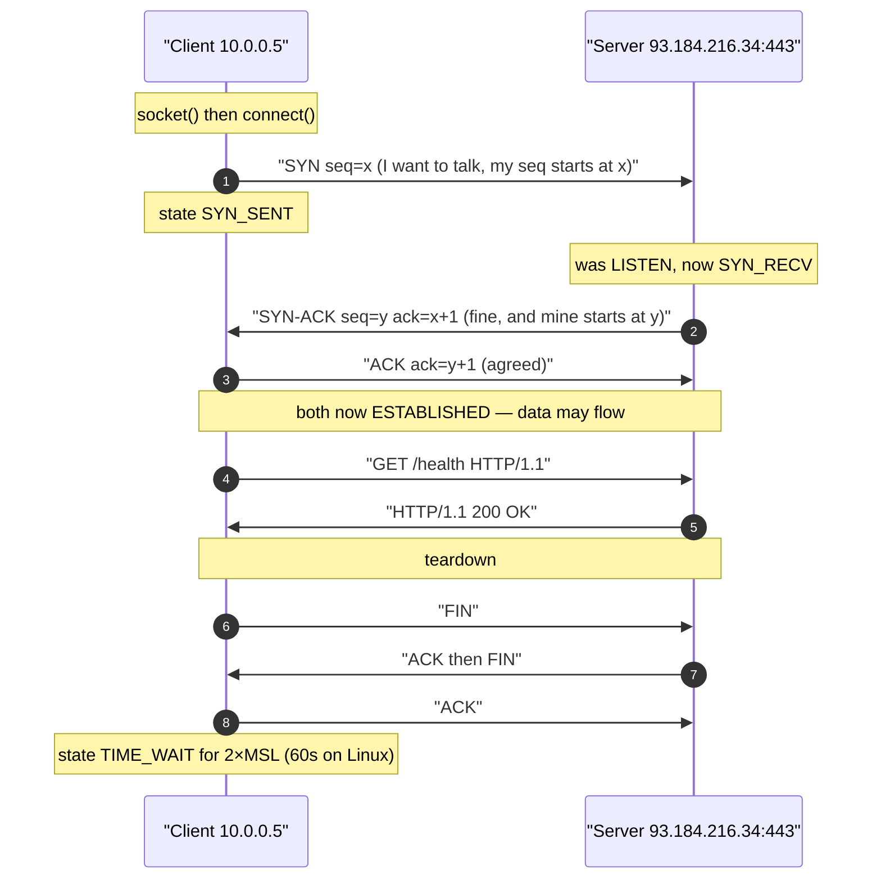
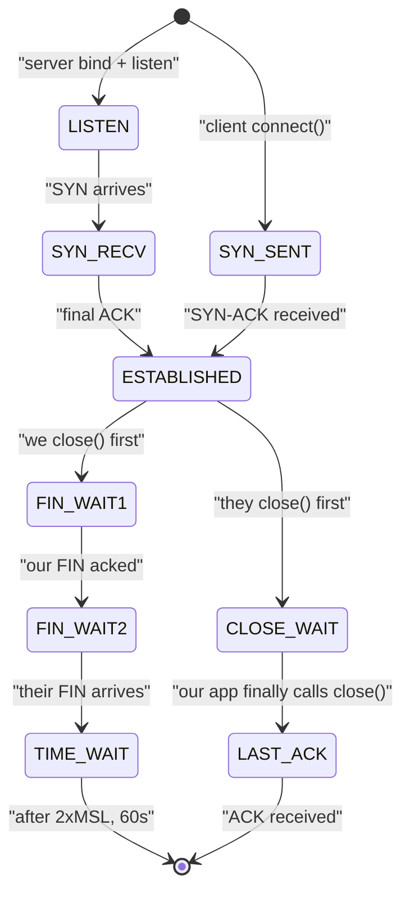

## 1 · The Big Picture

### Why this topic exists

Almost nothing you will ever debug in production is a computation problem. The CPU is fine. The code is fine. The disk is fine. What is broken is that **two machines cannot talk to each other**, and the failure gives you nothing but a timeout.

`Connection refused`. `Connection timed out`. `Name or service not known`. `502 Bad Gateway`. `curl: (7) Failed to connect`. `dial tcp 10.0.2.15:5432: i/o timeout`. Every one of those is a networking failure wearing a different costume, and each one points to a different layer of the stack. A junior engineer treats them as one undifferentiated fog and starts restarting things. A senior engineer reads the exact wording, knows which of six layers it implicates, and runs three commands.

This chapter is about becoming the second person.

### The real problem it solves

Two processes on the same machine can talk trivially — they share memory, a filesystem, a kernel. Two processes on *different* machines share nothing at all. To get a byte from one to the other, something has to solve, simultaneously:

- **Naming** — you know the name `api.example.com`, but wires only understand numbers.
- **Addressing** — of the four billion possible IPv4 addresses, which one, and how does anyone find it?
- **Routing** — your packet must cross a dozen networks owned by a dozen companies, none of which know your destination personally. Each only knows a next step.
- **Multiplexing** — one machine, one address, but hundreds of programs. Which one gets this packet?
- **Reliability** — the wire drops, duplicates and reorders. Somebody must fix that, or decide not to.
- **Framing** — a network moves fixed-size chunks. Your 8 MB upload does not fit in one.

The answer the industry settled on is **layering**: solve each problem once, in its own layer, and let each layer treat the one below it as a dumb pipe. That single design decision is why the tools in this chapter come in a stack, and why *diagnosing in layer order* is the entire professional method.

```diagram title="The same failure, six different causes"
  You run:  curl https://api.example.com/health     →  it hangs, then fails

  Which layer?
  ┌────────────────────────────────────────────────────────────────────────┐
  │ L1/L2  cable unplugged, NIC down          → ip link   (state DOWN)     │
  │ L3     no IP address, no route, no gw     → ip addr / ip route         │
  │ L3     gateway unreachable                → ping <gateway>             │
  │ Naming DNS broken but network fine        → dig api.example.com        │
  │ L4     port closed / firewall dropping    → nc -zv host 443            │
  │ L7     app listening on wrong address     → ss -tulpn (127.0.0.1 vs 0) │
  │ Cloud  security group never let it in     → console, not the OS at all │
  └────────────────────────────────────────────────────────────────────────┘
  Six causes. One error message. This is why you diagnose bottom-up.
```

### Where you will encounter it

| Context | What Linux networking is doing there |
|---|---|
| Any cloud VM | `ip addr` shows a DHCP-leased private address; the public one is NAT-ed by the provider and never appears in the OS |
| Docker / containers | `docker0` bridge, `veth` pairs, iptables NAT rules generated behind your back (Chapter 19) |
| Kubernetes | A CNI plugin programming routes and iptables/eBPF on every node; `Service` = virtual IP + DNAT |
| A `502` from nginx | Upstream refused or timed out — an L4 problem dressed as an L7 one |
| CI pipelines | Proxy variables, DNS inside the runner, egress firewalls blocking package mirrors |
| Terraform / cloud IaC | You are *writing* subnets, CIDRs, route tables and security groups by hand. `/26` had better mean something to you |
| Database "connection pool exhausted" | `ss -tan state time-wait` and `CLOSE_WAIT` counts tell you which side is leaking |
| Any on-call page | The first five minutes are always `ping`, `dig`, `ss`, `curl -v` |

### Why companies care

- **Every outage is a network outage eventually.** Latency, packet loss, DNS TTLs and MTU mismatches cause the failures that no amount of application testing catches.
- **Cloud networking is charged and audited.** Subnets, CIDR allocations, NAT gateways and cross-AZ traffic are line items on the bill and entries in a compliance report.
- **Security is network-shaped.** Firewalls, security groups, zero-trust, mTLS, egress filtering — you cannot reason about any of it without knowing what a port and a route are.
- **The skill does not go stale.** IPv4 subnetting has been the same since 1993. `dig` output looks the same as it did in 1999. This is the highest-durability knowledge in the handbook.

> [!INFO]
> **Why the source PDF is thin here, and what this chapter does about it.** The trainer PDF gives eight networking commands — `ping`, `wget`, `curl`, `ip`, `netstat`, `traceroute`, `nslookup`, `dig` — as a flat list of three flags each, with no networking theory whatsoever. Its own quiz bank then asks about subnet masks, CIDR, ARP, NAT, VLANs, DHCP, `iptables -j DROP`, MTU, network namespaces and `ip netns`. That gap is unfair to a learner, so this chapter teaches the theory from zero *before* the commands, and covers every tool the quiz assumes.

---

## 2 · Intuition First

### Analogy 1: the postal system

Forget protocols for a moment. Think about posting a letter.

You write a letter (**your data**). You put it in an envelope with a street address (**the IP packet**). You hand it to your local post office (**your default gateway**). The post office does not know where "14 Rue de Rivoli, Paris" is. It knows one thing: *anything foreign goes to the international sorting hub*. The hub knows: *anything for France goes to Paris*. Paris knows the arrondissement. The arrondissement knows the street.

That is routing. **No single node knows the whole path.** Each node knows only the next hop, and the letter still arrives. This is the deepest idea in networking and the reason the internet scales.

Extend the analogy and it keeps paying:

- The **flat number** on the envelope, after the street address, is the **port**. The building is the machine; the flat is the process.
- **Recorded delivery with signature** is TCP. **Dropping a postcard in the box and hoping** is UDP.
- **The phone book** you use to look up an address from a name is DNS.
- **A PO box that forwards to your real address** is NAT.
- **The security guard who opens some letters and bins others** is the firewall.
- **`traceroute`** is sending a series of letters marked "return to sender after 1 sorting office", then "after 2", then "after 3" — and writing down who sends each one back. That is *literally* how it works.

### Analogy 2: the layered envelope

When you send an HTTP request, nothing rewrites it. It gets **wrapped**, like a present in four boxes.

```diagram title="Encapsulation — nothing is rewritten, everything is wrapped"
  What your program hands to the kernel:

     ┌──────────────────────────────────────────────┐
     │ GET /health HTTP/1.1                         │   L7  application data
     │ Host: api.example.com                        │       (your bytes, untouched)
     └──────────────────────────────────────────────┘

  Kernel adds a TCP header (20 bytes: src port, dst port, seq, ack, flags):

     ┌──────────┬──────────────────────────────────┐
     │ TCP hdr  │ GET /health HTTP/1.1 ...          │   L4  segment
     │ 20 bytes │                                   │
     └──────────┴──────────────────────────────────┘

  Kernel adds an IP header (20 bytes: src IP, dst IP, TTL, protocol=6):

     ┌──────────┬──────────┬────────────────────────┐
     │ IP hdr   │ TCP hdr  │ GET /health ...        │   L3  packet
     │ 20 bytes │ 20 bytes │                        │
     └──────────┴──────────┴────────────────────────┘
     └──────────── must fit inside the MTU: 1500 ────┘

  NIC driver adds an Ethernet header (14 bytes: dst MAC, src MAC, type=0x0800):

     ┌────────┬──────────┬──────────┬───────────────┬─────┐
     │ Eth    │ IP hdr   │ TCP hdr  │ payload       │ FCS │   L2  frame
     │ 14 B   │ 20 B     │ 20 B     │ ≤ 1460 B      │ 4 B │
     └────────┴──────────┴──────────┴───────────────┴─────┘
     └──────────── 1514 bytes on the wire (+4 FCS) ─────────┘

  Then: voltage / light / radio on the medium.                    L1
```

Read that diagram twice. Three consequences fall straight out of it:

1. **MTU** (Maximum Transmission Unit) is the largest **IP packet** a link will carry — classically **1500** bytes on Ethernet. Subtract 20 for IP and 20 for TCP and you get **MSS = 1460**: the most application data one segment can hold.
2. **Fragmentation** is what happens when a packet larger than the next link's MTU must cross it. The router (IPv4) splits it into fragments that are reassembled at the destination. It is slow, it hurts, and losing one fragment loses the whole packet. IPv6 forbids routers from fragmenting — the *sender* must discover the path MTU instead.
3. **Every header is overhead.** A VPN or an overlay network adds another IP header inside your IP header, so the usable MTU drops (typically to 1450, 1420 or 1380). This is the cause of the classic "SSH connects but `ls` of a big directory hangs" bug — small packets get through, big ones are silently dropped.

> [!MEMORY]
> **"Please Do Not Throw Sausage Pizza Away"** — Physical, Data link, Network, Transport, Session, Presentation, Application: OSI layers 1 to 7, bottom to top. Reversed ("All People Seem To Need Data Processing") gives 7 down to 1.

### Analogy 3: the office building

One more, because it makes ARP and switching click.

A **switch** is the person pushing the internal mail trolley on one floor. They know every desk on that floor by *name badge* (MAC address) and nothing else. Hand them mail for someone on their floor and it arrives. Hand them mail for another company and they are useless.

A **router** is the mail room in the lobby. It knows nothing about desks. It knows *buildings and streets* (IP networks), and which door to send things out of.

**ARP** is shouting "WHO IS SITTING AT 192.168.1.1?" across the floor and waiting for someone to raise a hand and tell you their badge number. That shout only reaches your floor — which is exactly why ARP works only inside one broadcast domain, and why you never ARP for a machine on the internet. You ARP for your **gateway**, and let the gateway worry about the rest.

---

## 3 · Technical Definitions

### The layered model, mapped to things you can actually type

OSI is a teaching model, not an implementation. Linux implements **TCP/IP**. The reason to know OSI at all is that engineers say "that's a layer 3 problem" and "we need an L7 load balancer" and you must know what they mean.

| OSI layer | TCP/IP layer | What it does | Concrete Linux artefact | Tool that shows it |
|---|---|---|---|---|
| **7 Application** | Application | The actual protocol: HTTP, SSH, DNS, SMTP | nginx, `sshd`, HTTP headers | `curl -v`, `dig` |
| **6 Presentation** | Application | Encoding, serialisation, TLS sits about here | TLS certificates, JSON, UTF-8 | `openssl s_client` |
| **5 Session** | Application | Sessions, dialogue control | HTTP keep-alive, SSH channels | — |
| **4 Transport** | Transport | Ports, reliability, ordering | TCP / UDP, port numbers, sockets | `ss -tuln`, `nc` |
| **3 Network** | Internet | Global addressing, routing between networks | IP address, netmask, routing table, ICMP | `ip addr`, `ip route`, `ping`, `traceroute` |
| **2 Data link** | Link | Local delivery on one physical segment | MAC address, ARP, VLAN tag, switch, `eth0` | `ip link`, `ip neigh` |
| **1 Physical** | Link | Volts, photons, radio | Cable, NIC, SFP, `LOWER_UP` flag, link speed | `ip link`, `ethtool eth0` |

Two rows of that table are worth memorising in isolation, because interviewers use them as shibboleths:

- **Layer 3 devices route; layer 2 devices switch.** A router looks at the destination *IP* and picks an outgoing interface. A switch looks at the destination *MAC* and picks a port.
- **A "layer 4 load balancer" forwards TCP connections without reading them; a "layer 7 load balancer" terminates the connection and reads the HTTP request** — which is how it can route on URL path or `Host` header, but also why it must hold the TLS certificate.

> [!EXAM]
> Precise one-mark definitions to memorise:
>
> - **IP address** — a layer 3 logical identifier for an interface on a network, assignable and changeable.
> - **MAC address** — a layer 2 physical identifier burned into (or set on) a NIC, 48 bits, unique per segment.
> - **Port** — a 16-bit layer 4 number identifying an endpoint *within* a host, so one IP can serve many services.
> - **Subnet mask** — the value that divides an IP address into its **network** portion and its **host** portion, so a host can tell which destinations are local and which need a router.
> - **Default gateway** — the router a host sends packets to when the destination is not on any directly connected network. In the routing table it is the entry for destination `default` (or `0.0.0.0/0`).
> - **DNS** — **Domain Name System**, the distributed hierarchical database that maps names to IP addresses (and back).
> - **ARP** — **Address Resolution Protocol**, which resolves a known IPv4 address to the MAC address on the local segment.
> - **NAT** — **Network Address Translation**, rewriting addresses (and usually ports) in packet headers so many private hosts can share one public address.
> - **DHCP** — **Dynamic Host Configuration Protocol**, which automatically hands a client an address, mask, gateway and DNS servers.
> - **VLAN** — a **Virtual LAN**: a logically separate layer 2 broadcast domain carried over shared physical switches, identified by an 802.1Q tag (12 bits, IDs 1–4094).

### Protocols you must be able to name

| Protocol | Layer | Purpose | Where you meet it |
|---|---|---|---|
| **Ethernet / 802.3** | 2 | Framing and local delivery by MAC | Every wired NIC |
| **ARP** | 2/3 boundary | IPv4 → MAC on the local segment | `ip neigh`, silent until it fails |
| **IPv4 / IPv6** | 3 | Addressing and routing | Everything |
| **ICMP** | 3 | Control and error messages | `ping`, `traceroute`, "fragmentation needed" |
| **TCP** | 4 | Reliable, ordered, connection-oriented byte stream | HTTP, SSH, SQL |
| **UDP** | 4 | Unreliable, connectionless datagrams | DNS, DHCP, NTP, QUIC, VoIP |
| **DHCP** | 7 (over UDP 67/68) | Automatic address configuration | Every cloud VM and office laptop |
| **DNS** | 7 (over UDP/TCP 53) | Name resolution | Everything, and it is always DNS |
| **HTTP/HTTPS** | 7 | The web, and every REST API | `curl` |
| **TLS** | ~6 | Encryption and identity | `https://`, port 443 |

---

## 4 · IPv4 Addressing and Subnetting — Properly

This is the single highest-value section in the chapter for exams, and the one most people fudge. Do it once, carefully, and it is yours for life.

### An address is 32 bits wearing a disguise

An IPv4 address is a **32-bit unsigned integer**. Nobody can read 3232238117, so it is written as four 8-bit chunks in decimal, separated by dots — **dotted-quad** notation. Each chunk (an *octet*) is 0–255.

```diagram title="One address, three views"
  Decimal    192   .   168   .   10    .   37
  Binary  11000000 . 10101000 . 00001010 . 00100101
  Hex        C0    .   A8    .   0A    .   25
             ↑         ↑         ↑         ↑
           8 bits    8 bits    8 bits    8 bits   =  32 bits total

  Powers of two per octet position:
    128   64   32   16    8    4    2    1
     1     0    1    0    1    0    0    1   = 128+32+8+1 = 169
```

Learn the eight column values — `128 64 32 16 8 4 2 1` — and you can convert any octet in your head in under five seconds. That is the whole trick.

### The address has two halves: network and host

An address on its own is meaningless. `192.168.10.37` tells you nothing until you know **where the boundary is** between the part that identifies the *network* and the part that identifies the *host on that network*.

The **subnet mask** draws that line. It is another 32-bit number, and its rule is absolute: **a 1 bit means "this bit is network", a 0 bit means "this bit is host", and the 1s always come first.**

```diagram title="The mask draws the line"
  Address  192.168.10.37   11000000 10101000 00001010 00100101
  Mask     255.255.255.0   11111111 11111111 11111111 00000000
                           └────── network (24) ─────┘└ host (8)┘

  Written together:  192.168.10.37/24        ← CIDR notation
                     "the first 24 bits are the network"
```

**CIDR** (Classless Inter-Domain Routing, pronounced "cider") notation replaces the dotted mask with a slash and a count of network bits. `/24` means 24 one-bits, which is `255.255.255.0`. They are the same statement.

> [!EXAM]
> **"In CIDR notation `192.168.1.0/24`, what does the `/24` represent?"** The number of bits in the network prefix — the leftmost 24 bits identify the network, leaving 8 bits for hosts. Equivalent to the subnet mask `255.255.255.0`, giving 256 addresses of which 254 are usable hosts.
>
> **"What is the purpose of a subnet mask?"** To divide an IP address into its network and host portions, so a host can decide whether a destination is on its own local network (deliver directly via ARP) or on a remote one (send to the default gateway).

### Four addresses in every subnet have jobs

| Address | How to compute it | Can a host use it? |
|---|---|---|
| **Network address** | address `AND` mask — all host bits set to **0** | ✘ Names the subnet itself |
| **First usable host** | network address + 1 | ✔ Conventionally the gateway |
| **Last usable host** | broadcast − 1 | ✔ |
| **Broadcast address** | address `OR` inverse-mask — all host bits set to **1** | ✘ Reaches every host at once |

Usable host count is therefore **2^h − 2**, where `h` is the number of host bits: you lose one address for the network and one for the broadcast.

> [!WARNING]
> **The `− 2` is not universal, and cloud providers make it worse.** IPv6 has no broadcast address, so a `/64` does not lose two. A `/31` point-to-point link (RFC 3021) deliberately uses both addresses. And AWS reserves **five** addresses in every subnet — network, VPC router, DNS, a future-use address, and broadcast — so an AWS `/24` gives you **251** usable hosts, not 254. Say "2^h − 2 on a classic Ethernet subnet" and you will never be wrong.

### Worked example: `192.168.10.37/26`, step by step in binary

This is exactly the shape of question you will be asked. Do it mechanically and it cannot go wrong.

**Step 1 — write the mask.** `/26` = 26 one-bits, then 6 zero-bits.

```diagram title="Step 1: the mask"
  /26  =  11111111 11111111 11111111 11000000
             255      255      255      192
  → subnet mask 255.255.255.192
  → host bits h = 32 − 26 = 6
```

The last octet `11000000` = 128 + 64 = **192**. That is the only interesting octet; the first three are all-ones.

**Step 2 — write the address in binary.**

```diagram title="Step 2: the address"
  192      168      10       37
  11000000 10101000 00001010 00100101
                             └┬┘└──┬─┘
                        network   host
                        bits 25-26  bits 27-32
```

The last octet, 37, is `00100101` (32 + 4 + 1). Its first two bits belong to the network; its last six are host bits.

**Step 3 — network address: AND the two, i.e. zero every host bit.**

```diagram title="Step 3: network address"
  address  11000000 10101000 00001010 00100101
  mask     11111111 11111111 11111111 11000000
  AND      ────────────────────────────────────
           11000000 10101000 00001010 00000000
              192      168      10        0

  → network address = 192.168.10.0/26
```

**Step 4 — broadcast address: set every host bit to 1.**

```diagram title="Step 4: broadcast address"
  network  11000000 10101000 00001010 00000000
  host=1s                             ..111111
  OR       ────────────────────────────────────
           11000000 10101000 00001010 00111111
              192      168      10       63

  → broadcast address = 192.168.10.63
```

**Step 5 — usable range and count.**

```diagram title="Step 5: the answer"
  Network address ....... 192.168.10.0     (not usable)
  First usable host ..... 192.168.10.1     ← usually the gateway
  Last usable host ...... 192.168.10.62
  Broadcast address ..... 192.168.10.63    (not usable)
  Usable hosts .......... 2^6 − 2 = 64 − 2 = 62
  Total addresses ....... 64
```

**The shortcut, once you trust the long way.** For any mask, the **block size** in the interesting octet is `256 − mask_octet`. Here `256 − 192 = 64`. Subnets therefore begin at multiples of 64: `.0`, `.64`, `.128`, `.192`. Your address `.37` sits in the block starting at `.0`, which runs to `.63`. Done in five seconds.

> [!MEMORY]
> **Block size = 256 − the interesting mask octet.** `/26`→192→block 64. `/27`→224→block 32. `/28`→240→block 16. `/29`→248→block 8. `/30`→252→block 4. Subnet boundaries are always multiples of the block size, so `192.168.10.37/26` lives in `192.168.10.0–63` and there is nothing to compute.

### CIDR reference table — memorise this

| CIDR | Subnet mask | Host bits | Total addresses | Usable hosts | Block size | Typical use |
|---|---|---|---|---|---|---|
| `/24` | 255.255.255.0 | 8 | 256 | **254** | 256 | The classic LAN, one office floor |
| `/25` | 255.255.255.128 | 7 | 128 | **126** | 128 | Splitting a /24 in half |
| `/26` | 255.255.255.192 | 6 | 64 | **62** | 64 | A cloud subnet per AZ |
| `/27` | 255.255.255.224 | 5 | 32 | **30** | 32 | A rack, a small DMZ |
| `/28` | 255.255.255.240 | 4 | 16 | **14** | 16 | A handful of servers |
| `/29` | 255.255.255.248 | 3 | 8 | **6** | 8 | An ISP-assigned public block |
| `/30` | 255.255.255.252 | 2 | 4 | **2** | 4 | A point-to-point router link |
| `/31` | 255.255.255.254 | 1 | 2 | 2 (RFC 3021) | 2 | Modern point-to-point |
| `/32` | 255.255.255.255 | 0 | 1 | 1 | 1 | A single host — routes, ACLs, `ip route add ... /32` |

Two more you will meet constantly, in the other direction:

| CIDR | Mask | Addresses | Where |
|---|---|---|---|
| `/16` | 255.255.0.0 | 65,536 | A whole VPC, or `192.168.0.0/16` |
| `/8` | 255.0.0.0 | 16,777,216 | `10.0.0.0/8`, the biggest private block |

### Reserved and special ranges you must recognise on sight

| Range | CIDR | Name | What it means when you see it |
|---|---|---|---|
| 10.0.0.0 – 10.255.255.255 | `10.0.0.0/8` | **Private** (RFC 1918) | Not routable on the internet. The default for large VPCs |
| 172.16.0.0 – 172.31.255.255 | `172.16.0.0/12` | **Private** (RFC 1918) | Docker's default pool lives here (`172.17.0.0/16`) |
| 192.168.0.0 – 192.168.255.255 | `192.168.0.0/16` | **Private** (RFC 1918) | Home routers, VirtualBox host-only networks |
| 127.0.0.0 – 127.255.255.255 | `127.0.0.0/8` | **Loopback** | Traffic that never leaves the host. `127.0.0.1` is `localhost` |
| 169.254.0.0 – 169.254.255.255 | `169.254.0.0/16` | **Link-local (APIPA)** | **A diagnosis, not a config**: the host asked DHCP and got no answer. Also `169.254.169.254` = cloud instance metadata |
| 100.64.0.0 – 100.127.255.255 | `100.64.0.0/10` | **CGNAT** (RFC 6598) | Carrier-grade NAT. Your mobile ISP put you behind a second NAT. Tailscale also uses it |
| 224.0.0.0 – 239.255.255.255 | `224.0.0.0/4` | **Multicast** | One-to-many. `224.0.0.251` = mDNS |
| 0.0.0.0 | `0.0.0.0/32` | **Unspecified / any** | As a *bind* address: "all interfaces". As a *route*: "everywhere", i.e. the default route |
| 255.255.255.255 | — | **Limited broadcast** | DHCP discover packets, before you have an address |

> [!PROD]
> **`169.254.x.x` in `ip addr` output is one of the fastest diagnoses in Linux.** It means the interface came up, tried DHCP, timed out, and self-assigned a link-local address. So: the cable and NIC are fine (layer 1 and 2 work), and the DHCP server is unreachable or dead. You have skipped four troubleshooting steps just by reading one octet.

> [!EXAM]
> **"What is the loopback IP address?"** `127.0.0.1` (the whole `127.0.0.0/8` block is reserved; `::1` in IPv6). **"What is the purpose of the loopback interface `lo`?"** It lets processes on the same host communicate over TCP/IP without any physical hardware, and it always exists and is always up — so services can bind to it, and you can test the local stack even with every cable unplugged.

### IPv6, briefly — because it is no longer optional

IPv4 has 4.3 billion addresses and the last unallocated blocks were handed out in 2011. **IPv6** uses **128 bits**, written as eight groups of four hex digits separated by colons.

```diagram title="IPv6 notation and compression"
  Full:        2001:0db8:0000:0000:0000:ff00:0042:8329
  Drop leading zeros in each group:
               2001:db8:0:0:0:ff00:42:8329
  Replace ONE run of all-zero groups with "::" :
               2001:db8::ff00:42:8329

  Rule: "::" may appear at most ONCE in an address, or it would be ambiguous.

  Loopback     ::1                  (the IPv6 127.0.0.1)
  Unspecified  ::                   (the IPv6 0.0.0.0)
  Link-local   fe80::/10            auto-configured on every interface, always present
  Unique local fc00::/7             the IPv6 "private" range (RFC 1918 equivalent)
  Documentation 2001:db8::/32       safe to use in examples, like example.com
```

Three facts that cover most IPv6 questions:

- **A `/64` is the standard subnet size**, always. The first 64 bits are the network, the last 64 identify the interface. Yes, that is 18 quintillion hosts per subnet, and yes, that is deliberate — it makes stateless autoconfiguration (SLAAC) possible.
- **Every interface gets an `fe80::` link-local address automatically**, whether you configured IPv6 or not. Run `ip -6 addr show` on any modern machine and you will see one. It is used for neighbour discovery and router advertisements.
- **There is no ARP and no broadcast in IPv6.** Both are replaced by **NDP** (Neighbour Discovery Protocol) over ICMPv6 multicast. `ip neigh` still shows you the table.

> [!MISTAKE]
> **Disabling IPv6 "to simplify things".** Widely done, and it breaks more than it fixes: some cloud metadata services, container runtimes, `systemd-resolved` and Kubernetes CNIs assume it. Modern applications also prefer IPv6 when DNS returns an `AAAA` record — so a *half*-configured IPv6 stack (address present, routing broken) causes the maddening "every connection takes exactly 5 seconds then works" symptom, as the client tries IPv6 first and falls back. Either configure it or disable it completely; never leave it half-done.

### MAC addresses, switching and ARP

An **IP address** is where you are. A **MAC address** is who you are. You need both, and you need them for different distances.

A **MAC address** (Media Access Control) is 48 bits, written as six hex bytes: `08:00:27:4e:8b:2a`. The first three bytes are the **OUI** — the vendor. `08:00:27` is VirtualBox; `52:54:00` is QEMU/KVM; `02:42:ac` prefixes are Docker. Seeing a MAC and recognising the vendor is a genuinely useful party trick when reading `tcpdump` output.

```diagram title="Switch vs router — the one diagram that fixes ARP"
   ┌──────────────────── ONE BROADCAST DOMAIN (one subnet) ────────────────────┐
   │                                                                           │
   │   hostA                        SWITCH  (layer 2)                   hostB   │
   │   192.168.1.10 ───────────┐   forwards by MAC        ┌─────── 192.168.1.20 │
   │   aa:bb:cc:00:00:01       │   learns MACs per port   │      aa:bb:cc:00:00:02
   │                           ├──────────────────────────┤                     │
   │   ARP works here: "who has 192.168.1.20?" is BROADCAST to this domain only │
   │                           │                          │                     │
   └───────────────────────────┼──────────────────────────┘                     
                               │
                        ┌──────┴───────┐
                        │   ROUTER     │  layer 3 — forwards by IP
                        │ 192.168.1.1  │  ← hostA's default gateway
                        │  (gateway)   │     STRIPS and REBUILDS the Eth header
                        └──────┬───────┘
                               │
                        the internet — ARP is meaningless out here

  To reach 8.8.8.8, hostA does NOT arp for 8.8.8.8. It:
    1. masks 8.8.8.8 with its own /24 → not local
    2. therefore sends to the default gateway
    3. ARPs for 192.168.1.1 (local!) to get the router's MAC
    4. builds a frame:  dst MAC = router,  dst IP = 8.8.8.8
```

That last block is the single most important mechanical fact in this chapter. **The destination IP stays the same across the entire journey; the destination MAC changes at every hop.** Every router rewrites the layer 2 header and leaves the layer 3 header alone (except decrementing TTL).

Inspect the ARP table — the cache of IP→MAC mappings the kernel has learned:

```console
$ ip neigh show
192.168.1.1 dev enp0s3 lladdr 04:d4:c4:5f:11:a0 REACHABLE
192.168.1.20 dev enp0s3 lladdr aa:bb:cc:00:00:02 STALE
192.168.1.77 dev enp0s3  FAILED
fe80::1 dev enp0s3 lladdr 04:d4:c4:5f:11:a0 router STALE
```

| Field | Meaning |
|---|---|
| `192.168.1.1` | The IP address that was resolved |
| `dev enp0s3` | Which interface learned it — the same IP can exist on two segments |
| `lladdr 04:d4:...` | The link-layer (MAC) address it maps to |
| `REACHABLE` | Confirmed within the last few seconds. Good |
| `STALE` | Cached but unverified; the kernel will re-probe before relying on it. Normal |
| `FAILED` | ARP was sent and nobody answered — **that host is not on this segment, or is off** |
| `router` | This neighbour advertised itself as a router (IPv6 NDP) |

```bash
ip neigh show                        # the modern command
ip neigh show dev enp0s3             # one interface only
ip neigh flush all                   # clear the whole cache — forces re-ARP
ip neigh add 192.168.1.50 lladdr aa:bb:cc:dd:ee:ff dev enp0s3   # static entry
arp -n                               # legacy net-tools equivalent (still on exams)
arp -a                               # legacy, BSD-style output
```

> [!PROD]
> **`FAILED` in `ip neigh` versus a timeout is a real diagnostic split.** A `FAILED` neighbour entry for an address in your own subnet means layer 2 is not working — wrong VLAN, wrong subnet mask, host genuinely down, or port-security dropping you. If ARP *succeeds* but traffic still fails, layer 2 is fine and the problem is higher up. Duplicate IPs show as an ARP entry that keeps flapping between two MAC addresses.

### NAT — why your VM has an address nobody else can see

There are not enough IPv4 addresses. **NAT** (Network Address Translation) is the workaround that made the internet last thirty years past its expiry date: a router rewrites the source address of outgoing packets to its own public address, remembers the mapping, and rewrites the replies on the way back.

```diagram title="NAT / masquerading, with the mapping table"
  PRIVATE SIDE (RFC 1918)              NAT ROUTER                PUBLIC INTERNET
                                  public IP 203.0.113.9

  laptop  192.168.1.10:51000 ──┐
  phone   192.168.1.11:44230 ──┼──►  rewrites SOURCE addr+port  ──► 93.184.216.34:443
  VM      192.168.1.12:38102 ──┘

  Translation table the router keeps:
   ┌────────────────────────┬──────────────────────────┬─────────────────────┐
   │ inside (private)       │ outside (public)         │ destination         │
   ├────────────────────────┼──────────────────────────┼─────────────────────┤
   │ 192.168.1.10:51000     │ 203.0.113.9:51000        │ 93.184.216.34:443   │
   │ 192.168.1.11:44230     │ 203.0.113.9:44231        │ 93.184.216.34:443   │
   │ 192.168.1.12:38102     │ 203.0.113.9:38102        │ 1.1.1.1:53          │
   └────────────────────────┴──────────────────────────┴─────────────────────┘
  Replies arrive at 203.0.113.9:51000 → table lookup → forwarded to 192.168.1.10:51000

  Consequence: the outside world cannot START a connection inwards.
               That is a security side-effect, not a security design.
```

Three flavours, and the exam wants the names:

| Kind | What is rewritten | Direction | Typical use |
|---|---|---|---|
| **SNAT** (Source NAT) | Source address of outbound packets | Inside → out | A fixed, known public IP for a server farm |
| **Masquerading** | Source address, taken *dynamically* from the outgoing interface | Inside → out | Home routers, laptops sharing a connection, Docker. Use when the public IP can change |
| **DNAT** (Destination NAT) | Destination address of inbound packets | Outside → in | **Port forwarding**: publish an internal service |

**Port forwarding** is just DNAT with a port change: "anything arriving on my public IP port 2222, send to 192.168.1.12 port 22." In `iptables` terms:

```bash
# SNAT/masquerade: let a private LAN out through this box (needs ip_forward=1)
sudo iptables -t nat -A POSTROUTING -s 192.168.1.0/24 -o eth0 -j MASQUERADE

# DNAT: forward public :2222 to the VM's SSH
sudo iptables -t nat -A PREROUTING -i eth0 -p tcp --dport 2222 \
  -j DNAT --to-destination 192.168.1.12:22
```

> [!NOTE]
> **This is exactly Chapter 02's VirtualBox NAT mode.** When you chose **NAT** for your VM's adapter, VirtualBox became the NAT router in the diagram above: your VM got `10.0.2.15`, the gateway was `10.0.2.2`, the VM could reach the internet, and **nothing on your LAN could reach the VM** — because no inbound connection can traverse NAT without an explicit rule. The "port forwarding" table in the VirtualBox network settings, where you mapped host `2222` to guest `22` so `ssh -p 2222 localhost` worked, *is* the DNAT rule above. **Bridged** mode skipped NAT entirely and put the VM directly on your LAN with its own address; **host-only** gave you a private segment with no route out. Same three concepts, one GUI checkbox each.
>
> Cloud providers do the same thing at scale: an EC2 instance's "public IP" is **never** visible inside the OS. `ip addr` shows only the private address; the public address is a 1:1 NAT the provider performs at the edge. This surprises people constantly.

### Ports — the flat number on the envelope

One host, one IP, hundreds of programs. A **port** is a 16-bit number (1–65535) that says which program. The combination that uniquely identifies one end of a conversation is the **socket**: `protocol + IP + port`. A full connection is a **4-tuple**: source IP, source port, destination IP, destination port.

| Range | Name | Who uses it | Notes |
|---|---|---|---|
| **0–1023** | Well-known / system | Standard services | **Binding these requires root** (or `CAP_NET_BIND_SERVICE`) |
| **1024–49151** | Registered | Applications, databases | 3306, 5432, 8080 live here |
| **49152–65535** | Dynamic / ephemeral | Client source ports, picked by the kernel | Linux actually uses `32768–60999` by default — see `sysctl net.ipv4.ip_local_port_range` |

**The ports a Linux engineer knows cold.** Interviewers ask these as rapid-fire; there is no clever way to learn them, so learn them.

| Port | Protocol | Service | Note |
|---|---|---|---|
| **20 / 21** | TCP | **FTP** | 21 = control, 20 = data (active mode) |
| **22** | TCP | **SSH** | Also SCP and SFTP. Chapter 12 |
| **23** | TCP | **Telnet** | Plaintext, obsolete — but a superb TCP test tool |
| **25** | TCP | **SMTP** | Mail submission between servers; often blocked by cloud providers |
| **53** | **UDP** + TCP | **DNS** | UDP for normal queries, TCP for large responses and zone transfers |
| **67 / 68** | UDP | **DHCP** | 67 = server, 68 = client |
| **69** | UDP | **TFTP** | Trivial FTP — PXE boot, switch firmware |
| **80** | TCP | **HTTP** | |
| **110** | TCP | **POP3** | 995 with TLS |
| **123** | UDP | **NTP** | Time sync. Broken time breaks TLS and Kerberos |
| **143** | TCP | **IMAP** | 993 with TLS |
| **161 / 162** | UDP | **SNMP** | 161 queries, 162 traps. Network monitoring |
| **389** | TCP | **LDAP** | Directory. Chapter on LDAP covers it |
| **443** | TCP (+UDP for QUIC) | **HTTPS** | HTTP over TLS |
| **445** | TCP | **SMB / CIFS** | Windows file sharing, Samba |
| **514** | UDP | **syslog** | Remote logging |
| **587** | TCP | **SMTP submission** | The port mail *clients* should use |
| **636** | TCP | **LDAPS** | LDAP over SSL/TLS |
| **993** | TCP | **IMAPS** | IMAP over TLS |
| **995** | TCP | **POP3S** | POP3 over TLS |
| **2049** | TCP/UDP | **NFS** | Network File System |
| **3306** | TCP | **MySQL / MariaDB** | |
| **3389** | TCP | **RDP** | Windows remote desktop |
| **5432** | TCP | **PostgreSQL** | |
| **6379** | TCP | **Redis** | Famously exposed to the internet by accident |
| **8080** | TCP | **HTTP alternate** | Tomcat, dev servers, proxies. Unprivileged, so no root needed |
| **9090 / 9100** | TCP | Prometheus / node_exporter | Modern ops |
| **27017** | TCP | **MongoDB** | Also famously exposed by accident |

The canonical list on your own machine is `/etc/services`:

```console
$ grep -wE '^(ssh|http|https|domain|postgresql)' /etc/services
ssh             22/tcp
domain          53/tcp
domain          53/udp
http            80/tcp
https           443/tcp
postgresql      5432/tcp
```

> [!MEMORY]
> **The TLS pairs are all "add a secure twin".** 80→443 (HTTP), 21→990 (FTPS), 25→465, 110→**995**, 143→**993**, 389→**636**, 23→22 (telnet→SSH, the one that changed protocol rather than adding TLS). And the low trio to never forget: **22 SSH, 53 DNS, 80/443 web.**

---

## 5 · TCP versus UDP, and What Socket States Tell You

### The comparison

| Dimension | **TCP** | **UDP** |
|---|---|---|
| Connection | Connection-oriented — handshake first | Connectionless — just send |
| Reliability | Guaranteed delivery: sequence numbers, ACKs, retransmission | None. Lost is lost |
| Ordering | Bytes arrive in order | Datagrams may arrive out of order, or twice |
| Header size | 20 bytes minimum | **8 bytes** |
| Flow / congestion control | Yes — sliding window, slow start, congestion avoidance | No. You can flood a link |
| Boundaries | A **byte stream** — no message boundaries preserved | **Datagrams** — one send = one receive |
| Speed / overhead | Slower to start, higher overhead | Minimal latency, no setup |
| Broadcast/multicast | No | Yes |
| Verdict for | HTTP, SSH, SQL, email, file transfer — anything where a missing byte is fatal | DNS, DHCP, NTP, SNMP, VoIP, games, video, QUIC — anything where *late* is worse than *missing* |

The one-sentence version worth memorising: **TCP is a phone call — you dial, they answer, you both confirm you can hear each other, and you notice immediately if the line drops. UDP is shouting across a room — fast, cheap, and you will never know if they heard you.**

> [!INFO]
> **Why DNS uses UDP.** A DNS query and its answer both fit in one small datagram. Doing a three-way handshake to exchange 60 bytes would triple the latency and quadruple the server's memory cost. If the answer is too big for one datagram, the server sets the truncated (`TC`) flag and the client retries **over TCP on the same port 53**. Zone transfers (`AXFR`) always use TCP. This is why "which protocol does `dig` primarily use?" has the answer **UDP**, with TCP as the documented fallback.

### The three-way handshake



Three packets before a single byte of your request moves. On a 100 ms round-trip link that is 100 ms of handshake, plus another 100–200 ms for the TLS handshake on top. **This is why connection reuse — HTTP keep-alive, database connection pools, `curl` sending several URLs in one invocation — is such a large performance win**, and why QUIC moved the web to UDP to collapse the handshakes together.

### The socket states you actually see, and what each one tells you

You will meet these in every `ss` and `netstat` output. Knowing what they *imply* is the difference between reading and diagnosing.



| State | Literal meaning | What it tells you when debugging |
|---|---|---|
| **LISTEN** | A server socket is bound and accepting | The service is up. **Check the address it is bound to**, not just the port |
| **SYN_SENT** | We sent SYN, nothing came back yet | Piling up = the destination is unreachable or a **firewall is silently dropping** (a refusal would give you RST immediately). Classic security-group symptom |
| **SYN_RECV** | We received SYN, awaiting the final ACK | Thousands of these = a **SYN flood**, or clients dying mid-handshake |
| **ESTABLISHED** | Data can flow both ways | Healthy. Count them to see real concurrency |
| **FIN_WAIT1 / FIN_WAIT2** | We initiated close, waiting on the peer | Many `FIN_WAIT2` = the **remote** app is not closing its end |
| **CLOSE_WAIT** | **The peer closed; we have not called `close()`** | **Always an application bug on *this* machine.** Your code is leaking file descriptors. It will never time out on its own — it clears only when the process closes the fd or dies. Ends in `EMFILE: too many open files` |
| **TIME_WAIT** | We closed, and are waiting 2×MSL (60 s on Linux) before reusing the 4-tuple | **Normal and healthy.** Present in thousands on any busy client or proxy. Do *not* "fix" it by enabling `tcp_tw_recycle` (removed in kernel 4.12 for good reason) |
| **LAST_ACK** | We sent the final FIN, awaiting its ACK | Transient; nothing to see |
| **CLOSED** | No socket | — |

> [!PROD]
> **The two states that pay your salary.** `CLOSE_WAIT` climbing means *your* application is not closing sockets — a missing `close()`, a leaked HTTP response body, a connection pool with no eviction. Restarting clears it and it comes back. `TIME_WAIT` in the tens of thousands on a load balancer or a busy client is normal TCP hygiene protecting you from a delayed duplicate packet landing in a new connection; the correct responses are connection reuse (keep-alive) and, if genuinely exhausting ports, widening `net.ipv4.ip_local_port_range` — never `tcp_tw_recycle`.

```console
$ ss -s
Total: 412
TCP:   289 (estab 61, closed 194, orphaned 0, timewait 193)

Transport Total     IP        IPv6
RAW       1         0         1
UDP       9         6         3
TCP       95        88        7
INET      105       94        11
FRAG      0         0         0

$ ss -tan state close-wait | wc -l
147
```

That second command is the one-liner to memorise. `147` sockets stuck in `CLOSE_WAIT` is a bug report, not a network problem.

---

## 6 · The Essential Tools

### ip — the Swiss Army knife

`ip` is the modern unified tool for all network configuration. It replaces `ifconfig`, `route`, `arp`, and `netstat` (though `ss` is still needed for socket inspection). Learn the structure: `ip [object] [command] [arguments]`.

```bash
# Interfaces (formerly ifconfig)
ip link show                                    # all interfaces and their state
ip -c link show eth0                            # colour output for one interface
ip link set eth0 up                             # bring up an interface
ip link set eth0 down                           # bring it down
ip link set eth0 mtu 1450                       # change MTU on this link

# Addresses (formerly ifconfig with numbers)
ip addr show                                    # all addresses on all interfaces
ip addr show dev eth0                           # one interface
ip addr add 192.168.1.50/24 dev eth0            # assign an address
ip addr del 192.168.1.50/24 dev eth0            # remove an address

# Routes (formerly route)
ip route show                                   # routing table
ip route add default via 192.168.1.1 dev eth0  # set default gateway
ip route add 10.0.0.0/8 via 192.168.1.254      # route a subnet via a gateway
ip route del 10.0.0.0/8                         # remove a route

# Neighbours (ARP, formerly arp command)
ip neigh show                                   # ARP cache
ip neigh flush all                              # clear ARP cache
```

### ss — socket statistics (modern netstat)

`ss` is faster and more informative than `netstat`. The syntax is similar but the flags are cryptic until memorised.

```bash
# The pattern: ss [flags] [filter]
# Flags: -t(TCP) -u(UDP) -a(all) -l(listening) -n(numeric) -p(processes) -i(info)

ss -tuln                                        # TCP and UDP, listening, numeric
ss -tan                                         # TCP, all, numeric (ESTABLISHED + TIME_WAIT)
ss -tan state CLOSE_WAIT                        # filter by state
ss -tulpn                                       # with process names/pids
ss -tunp sport = :22                            # connections on port 22
ss -tunp dport = :443                           # destination port 443
ss -s                                           # summary (total connections, by state)
```

### ping — ICMP echo, the layer 3 health check

```bash
ping -c 4 8.8.8.8                               # send 4 pings
ping -i 0.5 8.8.8.8                             # one ping per 500ms
ping -W 2 8.8.8.8                               # 2 second timeout per ping
ping -M do 8.8.8.8                              # don't fragment (path MTU discovery)
```

### traceroute / mtr — see the hops

```bash
traceroute -m 20 example.com                    # max 20 hops (default 30)
traceroute -I example.com                       # ICMP instead of UDP (try if UDP blocked)
mtr -r example.com                              # continuous monitoring, report mode
mtr --report-cycles 10 example.com              # 10 probes then exit
```

### dig / nslookup — DNS queries

```bash
dig example.com                                 # full output
dig example.com +short                          # just the answer
dig example.com MX                              # mail exchange records
dig example.com CNAME                           # canonical name
dig -x 8.8.8.8                                  # reverse DNS
dig @8.8.8.8 example.com                        # query a specific nameserver
nslookup example.com                            # legacy tool, simpler output
```

### curl / wget — HTTP clients

```bash
# curl shows headers and can use multiple protocols
curl -v https://example.com                     # verbose (headers visible)
curl -I https://example.com                     # headers only (HEAD request)
curl -w "%{http_code}\n" https://example.com    # just the HTTP status
curl --resolve example.com:443:192.168.1.1 https://example.com  # force IP
curl --connect-timeout 5 https://example.com    # timeout after 5 seconds
curl -o /dev/null -s -w "%{time_connect}:%{time_starttransfer}:%{time_total}\n" https://example.com  # timing

# wget is a full downloader
wget -q -O- https://example.com                 # download to stdout, quiet
wget --timeout=5 https://example.com            # timeout
```

### tcpdump — packet capture

```bash
# Syntax: tcpdump [options] [filter]
# Without root or CAP_NET_RAW it cannot run

sudo tcpdump -i eth0 -n 'tcp port 443'          # capture TLS traffic, no DNS
sudo tcpdump -i eth0 -n 'icmp'                  # just ping packets
sudo tcpdump -i eth0 -n 'dst 8.8.8.8'           # traffic destined for 8.8.8.8
sudo tcpdump -i eth0 -w /tmp/capture.pcap -n   # write to file for Wireshark
sudo tcpdump -i eth0 -c 10 -n                   # capture 10 packets then exit
```

---

## 7 · Routing and Firewalls

### Static routing — the three-line config

The Linux kernel's routing table is the decision engine. When a packet arrives, the kernel matches its destination IP against the table in longest-prefix order and picks an action.

```bash
# The default setup on most machines
ip route show
# default via 192.168.1.1 dev eth0  ← everything not local goes to the gateway
# 192.168.1.0/24 dev eth0 scope link  ← local subnet, no gateway needed

# Add a static route
sudo ip route add 10.0.0.0/8 via 192.168.1.254 dev eth0
# Any packet destined for 10.0.0.0/8 will be sent to 192.168.1.254

# Delete it
sudo ip route del 10.0.0.0/8
```

Three patterns to know:

| Pattern | Command | Meaning |
|---|---|---|
| Default gateway | `ip route add default via X.X.X.X dev ethN` | *Everything* not matched goes here |
| Subnet route | `ip route add 10.0.0.0/8 via X.X.X.X dev ethN` | Specific subnet via specific gateway |
| Point-to-point | `ip route add 192.168.2.1/32 via 192.168.1.254` | A single host, useful for VPNs |

### Firewalls and netfilter

Linux firewalls are built on `netfilter`, a kernel subsystem that hooks into the packet processing pipeline. The user-space tool is `iptables` (IPv4) or `ip6tables` (IPv6). Modern distributions also use `nftables` as a replacement.

```bash
# DANGER: opening all ports is trivial
sudo iptables -P INPUT ACCEPT
sudo iptables -P OUTPUT ACCEPT
sudo iptables -P FORWARD ACCEPT

# Sane defaults: drop by default, allow SSH
sudo iptables -P INPUT DROP
sudo iptables -P OUTPUT ACCEPT
sudo iptables -P FORWARD DROP
sudo iptables -A INPUT -i lo -j ACCEPT          # allow loopback
sudo iptables -A INPUT -m state --state ESTABLISHED,RELATED -j ACCEPT
sudo iptables -A INPUT -p tcp --dport 22 -j ACCEPT

# Inspect rules
sudo iptables -L -n                             # list rules
sudo iptables -L -n -v                          # verbose, with packet counts
sudo iptables -L -n -t nat                      # NAT table rules

# Save and restore
sudo iptables-save > /tmp/firewall.txt           # back up
sudo iptables-restore < /tmp/firewall.txt
```

A rule flows through three tables (`filter`, `nat`, `mangle`) in sequence:

1. **filter** — the main table, decides ACCEPT/DROP/REJECT
2. **nat** — address translation; NAT rules must be explicit
3. **mangle** — packet modification (TOS bits, TTL)

Each table has chains: **PREROUTING**, **INPUT**, **FORWARD**, **OUTPUT**, **POSTROUTING**.

> [!WARNING]
> **Lock yourself out is trivial.** A wrong firewall rule and the machine is unreachable. Never apply firewall rules to a remote machine without a second path in (or use `at` to schedule a rollback). Test locally first.

---

## 8 · Network Namespaces and Multi-Homing

### Network namespaces — isolated network stacks

A **network namespace** is a complete, isolated copy of the network stack: interfaces, routing tables, ARP tables, iptables rules, all private to that namespace. This is how containers isolate their networking.

```bash
# Create a new namespace called "test"
sudo ip netns add test
sudo ip netns list

# Run a command inside it
sudo ip netns exec test ip addr show
# (you will see only a loopback interface)

# Add a virtual interface to it
sudo ip link add veth-test type veth peer name veth-test-peer
sudo ip link set veth-test netns test
sudo ip -n test addr add 192.168.100.10/24 dev veth-test
sudo ip -n test link set veth-test up

# Clean up
sudo ip netns delete test
```

### Multi-homing — multiple interfaces on one machine

A single machine with multiple interfaces can reach different networks. This is common in routers, firewalls, and multi-homed servers.

```bash
# Add a second IP on the same interface
sudo ip addr add 192.168.2.50/24 dev eth0

# Or add a virtual interface (alias)
sudo ip link add vlan100 type vlan id 100 link eth0
sudo ip addr add 192.168.10.1/24 dev vlan100
sudo ip link set vlan100 up
```

---

## 9 · Practical Demonstration

### Lab 1: Setting up a test network and assigning addresses

**Objective:** Understand interface configuration from first principles.

**Setup:**
```bash
# Create two virtual network namespaces
sudo ip netns add host1
sudo ip netns add host2

# Create a virtual Ethernet pair (veth) connecting them
sudo ip link add veth1 type veth peer name veth2

# Move each end to its namespace
sudo ip link set veth1 netns host1
sudo ip link set veth2 netns host2

# Assign addresses
sudo ip -n host1 addr add 192.168.10.10/24 dev veth1
sudo ip -n host2 addr add 192.168.10.20/24 dev veth2

# Bring up the interfaces
sudo ip -n host1 link set veth1 up
sudo ip -n host2 link set veth2 up

# Verify connectivity
sudo ip -n host1 ping 192.168.10.20         # should succeed
```

**Expected output:**
```
PING 192.168.10.20 (192.168.10.20) 56(84) bytes of data.
64 bytes from 192.168.10.20: icmp_seq=1 ttl=64 time=0.123 ms
```

**Why it works:** The two namespaces are directly connected via a veth pair. No routing or gateway needed — they are on the same `/24` subnet, so ARP finds the MAC address directly.

**Cleanup:**
```bash
sudo ip netns delete host1
sudo ip netns delete host2
```

---

### Lab 2: Static IP configuration and DNS testing

**Objective:** Configure an interface with a static IP and validate DNS resolution.

**Setup (on your actual machine or in a VM):**
```bash
# List current interfaces
ip link show

# Assume eth0 is your test interface; bring it down first
sudo ip link set eth0 down

# Assign a static IP
sudo ip addr flush dev eth0                 # remove all addresses
sudo ip addr add 10.0.0.100/24 dev eth0
sudo ip link set eth0 up

# Set a default gateway
sudo ip route add default via 10.0.0.1 dev eth0

# Verify
ip addr show eth0
ip route show
```

**Testing DNS:**
```bash
# Query your local resolver
dig example.com

# Test a different nameserver
dig @8.8.8.8 example.com

# Check what nameservers the system uses
cat /etc/resolv.conf
```

**Troubleshooting:**
- `ping 10.0.0.1` → tests layer 3 (routing)
- `dig +trace example.com` → shows the full DNS hierarchy
- `tcpdump -i eth0 -n 'udp port 53'` → watch DNS queries in real time

---

### Lab 3: HTTP requests and response headers with curl

**Objective:** Understand HTTP layers and use curl for debugging.

**Fetch a real page with full tracing:**
```bash
curl -v https://httpbin.org/get 2>&1 | head -50
```

**Expected output (abbreviated):**
```
> GET /get HTTP/1.1
> Host: httpbin.org
> User-Agent: curl/7.68.0
> Accept: */*

< HTTP/1.1 200 OK
< Date: Thu, 02 Aug 2024 12:34:56 GMT
< Content-Type: application/json
```

**Measure response times:**
```bash
curl -w "time_total: %{time_total}s, time_connect: %{time_connect}s\n" \
  -o /dev/null -s https://httpbin.org/get
```

**Simulate a specific client IP (with a local server):**
```bash
# Start a simple server in one terminal
python3 -m http.server 8000

# Connect from another, specifying a source IP
curl -v --local-port 8000 http://localhost:8000
```

---

### Lab 4: Packet capture with tcpdump

**Objective:** Observe network frames at layer 2 and 3.

**Capture DNS queries:**
```bash
# In one terminal
sudo tcpdump -i any -n 'udp port 53' -c 5

# In another, trigger a DNS query
dig google.com
```

**Expected tcpdump output:**
```
12:34:56.123456 IP 192.168.1.10.52123 > 8.8.8.8.53: 12345 [1au] A? google.com. (32)
12:34:56.234567 IP 8.8.8.8.53 > 192.168.1.10.52123: 12345 1/0/1 A 142.251.32.46 (48)
```

**Capture a full HTTP session:**
```bash
# Listen for traffic to port 80
sudo tcpdump -i any -n 'tcp port 80' -A -c 50 | grep -A 2 'GET\|POST'
```

The `-A` flag shows ASCII payload, so you see HTTP requests and responses in plain text.

---

### Lab 5: Tracing hops with traceroute

**Objective:** Understand routing and see each hop.

**Basic trace:**
```bash
traceroute -m 30 8.8.8.8
```

**Expected pattern:**
```
traceroute to 8.8.8.8 (8.8.8.8), 30 hops max, 60 byte packets
 1  192.168.1.1 (192.168.1.1)  1.234 ms
 2  10.0.0.1 (10.0.0.1)  5.123 ms
 3  * * * (timeout)
 ...
15  8.8.8.8 (8.8.8.8)  25.456 ms
```

**Reading the output:**
- Hops that return `* * *` are firewalled (ICMP blocked) — normal and does not mean unreachable
- Each hop shows three measurements (three probe packets per hop)
- The final hop is the destination

**Using traceroute to diagnose network splits:**
```bash
# If a path stops responding mid-route, that router or its link is broken
traceroute -I 8.8.8.8                       # use ICMP instead of UDP (try if UDP blocked)
```

---

## 10 · Common Mistakes

### Mistake 1: Misconfiguring DNS

**The symptom:** "DNS is slow" or "DNS works sometimes."

**Common causes:**
- **Wrong nameserver in `/etc/resolv.conf`** — if the IP listed is not reachable, every query times out
- **Localhost 127.0.0.1 without a caching resolver** — if a process tries to reach a resolver on `127.0.0.1` and none is running, timeouts on every query
- **Search domains causing NXDOMAIN for short names** — if `/etc/resolv.conf` has `search example.com`, a query for `host` becomes `host.example.com?`, and if that doesn't exist, fails even if `host.another.com` would work
- **TTL too low or nonexistent** — each query re-queries the root nameservers instead of caching

**Fix:**
```bash
# Check current resolver
cat /etc/resolv.conf
resolvectl status                           # systemd-resolved status

# Test against a known-good resolver
dig @8.8.8.8 example.com                    # bypasses your configured servers
```

### Mistake 2: Wrong default gateway or routing table

**The symptom:** "I can ping the gateway but not anything beyond it."

**Common causes:**
- **No default route** — `ip route show` does not list `default via ...`
- **Multiple default routes** — the kernel picks one (usually the first) and traffic to other subnets is lost
- **Destination unreachable despite the route existing** — the return path is broken (asymmetric routing)

**Fix:**
```bash
# Check your routing table
ip route show

# If there is no default gateway
sudo ip route add default via 192.168.1.1

# If there are multiple defaults, delete the wrong one
sudo ip route del default via 192.168.1.254
```

### Mistake 3: Firewall silently blocking traffic

**The symptom:** Connection hangs, then times out (no "connection refused" error).

**Why:** `iptables -P INPUT DROP` with no allow rules means every incoming packet is silently dropped. The client waits for a response and never gets one.

**Fix:**
```bash
# Check the firewall policy
sudo iptables -L -n | head -5

# If it says "policy DROP", you need rules
sudo iptables -A INPUT -m state --state ESTABLISHED,RELATED -j ACCEPT
sudo iptables -A INPUT -p tcp --dport 22 -j ACCEPT

# Make sure the rules are persistent
sudo apt install iptables-persistent
sudo iptables-save | sudo tee /etc/iptables/rules.v4
```

### Mistake 4: MTU mismatch causing silent packet loss

**The symptom:** "SSH works but `ls` of a large directory hangs; small files transfer fine but large ones fail."

**Why:** A path carries MTU 1500, but your end is sending 1500 (or more with VPN overhead). The packet is silently dropped by a router that cannot fragment it. **The source never learns the packet was dropped** — TCP eventually times out.

**Fix:**
```bash
# Check your interface MTU
ip link show eth0 | grep mtu

# Test path MTU discovery
ping -M do -s 1472 8.8.8.8                  # 1472 data + 8 ICMP + 20 IP = 1500
ping -M do -s 1473 8.8.8.8                  # should fail if MTU is 1500

# Reduce MTU if VPN is in use
sudo ip link set eth0 mtu 1450              # common for VPN tunnels
```

### Mistake 5: ARP issues — duplicate IPs or VLAN mismatches

**The symptom:** "Traffic works for a few seconds then stops; `ip neigh` shows FAILED for the gateway."

**Common causes:**
- **Duplicate IP addresses** — two machines answered the ARP request; the kernel's cached MAC flaps
- **Wrong VLAN** — the host and gateway are on different VLANs; ARP broadcast does not cross
- **Stale ARP entry** — the MAC changed but the kernel still has the old one cached

**Fix:**
```bash
# Inspect the ARP cache
ip neigh show

# Force re-ARP
sudo ip neigh flush all

# Manually set a static entry if the gateway's MAC is known
sudo ip neigh add 192.168.1.1 lladdr aa:bb:cc:dd:ee:ff dev eth0

# Check VLAN membership
ip -d link show eth0
```

### Mistake 6: Listening on 127.0.0.1 instead of 0.0.0.0

**The symptom:** "curl localhost:8080 works but curl from another machine times out."

**Why:** The service is bound to `127.0.0.1` (loopback), so only local connections reach it. Remote traffic reaches `0.0.0.0` (all interfaces) and is dropped or refused.

**Fix:**
```bash
# Check what a service is bound to
sudo ss -tulpn | grep 8080

# Output showing the problem:
# LISTEN 0 128 127.0.0.1:8080 0.0.0.0:* users:(("python3",pid=1234,fd=3))
# ↑ only local

# Reconfigure the service to bind to 0.0.0.0 or a specific interface IP
```

---

## 11 · Summary & Mind Map

### ASCII diagram: the layers and tools

```
                         Linux Networking at a Glance
                                    │
                ┌───────────────────┼───────────────────┐
                │                   │                   │
            TCP/IP STACK        SUBNETTING & ROUTING   APPLICATIONS
                │                   │                   │
    ┌───────────┴───────────┐   ┌───┴────────┐     ┌───┴─────────┐
    │                       │   │            │     │             │
  L3/L4              L2 (ARP & MAC)     Routing &   DNS & HTTP
  (IP + Ports)       Switching       Firewalls   (curl, dig)
    │                       │            │         │
    ├─ TCP          ├─ ARP       ├─ ip route      ├─ dig
    │   ├─ LISTEN   │   └─ IP    │   ├─ default   │ └─ @8.8.8.8
    │   ├─ SYN_SENT │     neigh  │   │   gateway  │
    │   ├─ CLOSE_WAIT  └─ Switches    ├─ CIDR    ├─ nslookup
    │   └─ TIME_WAIT       & MACs  │   │          │
    │                               │   ├─ Subnet │
    ├─ UDP          Interfaces      │   │   mask  ├─ curl -v
    │   └─ no state  └─ ip addr     │   │         │
    │                ip link show   ├─ Firewalls
    ├─ Ports                        │   ├─ iptables
    │   ├─ 22 SSH                   │   └─ nftables
    │   ├─ 53 DNS      Diagnostics:│
    │   ├─ 80/443                   ├─ ping (ICMP)
    │   └─ 3306+ apps  ├─ ip addr  ├─ traceroute
    │                  ├─ ip route ├─ tcpdump
    └─ ss / netstat   ├─ ss / netstat
       (socket state)  └─ arp -n
```

### The professional debugging flow

1. **Layer 1/2: Is the link up?**
   ```
   ip link show → LOWER_UP? YES → continue
   ```

2. **Layer 3: Do we have an address and a gateway?**
   ```
   ip addr show → have an address? YES → continue
   ip route show → have a default route? YES → continue
   ```

3. **Layer 3 routing: Is the gateway reachable?**
   ```
   ping <gateway> → success? YES → continue
   ```

4. **DNS: Can we resolve names?**
   ```
   dig example.com → answer section populated? YES → continue
   ```

5. **Layer 4: Is the port open?**
   ```
   nc -zv host 443 → success? YES → continue
   ```

6. **Layer 7: Is the application responding?**
   ```
   curl -v https://host → HTTP 200? YES → working
   ```

### Summary

Linux networking is a layered stack, and almost every production failure is a networking failure. Mastery means:

- **Understanding the model** — OSI layers, TCP/IP stack, encapsulation, why MTU matters
- **Knowing the tools** — `ip`, `ss`, `ping`, `traceroute`, `dig`, `curl`, `tcpdump` and their exact output
- **Diagnosing bottom-up** — layer 1 cable, layer 2 ARP, layer 3 routing, layer 4 ports, layer 7 application
- **Recognizing patterns** — `CLOSE_WAIT` means your app leaked a socket; `TIME_WAIT` in thousands is normal; `169.254.x.x` means DHCP failed
- **Avoiding classic mistakes** — MTU mismatches, firewall misconfiguration, DNS timeouts, duplicate IPs, wrong gateway

The skills in this chapter do not go stale. They are the same tools and concepts used by every production engineer, from small startups to the largest cloud providers. Spend time with them until the commands are muscle memory.

---

## 12 · Cheat Sheet

### Quick reference — commands you need muscle memory for

**Interface and addressing:**
```bash
ip link show                                # all interfaces and state
ip addr show                                # all addresses
ip addr add 192.168.1.50/24 dev eth0        # add an IP
ip addr del 192.168.1.50/24 dev eth0        # remove an IP
ip link set eth0 up/down                    # up or down
ip link set eth0 mtu 1450                   # change MTU
```

**Routing:**
```bash
ip route show                               # current routing table
ip route add default via 192.168.1.1        # set default gateway
ip route add 10.0.0.0/8 via 192.168.1.254   # route to a subnet
ip route del 10.0.0.0/8                     # remove a route
```

**ARP / neighbours:**
```bash
ip neigh show                               # ARP cache
ip neigh flush all                          # clear ARP
ip neigh add 192.168.1.1 lladdr aa:bb:cc:dd:ee:ff dev eth0  # static ARP
arp -n                                      # legacy ARP list
```

**Sockets and listening ports:**
```bash
ss -tuln                                    # listening sockets, numeric, TCP/UDP
ss -tan                                     # all TCP, numeric
ss -tan state CLOSE_WAIT                    # filter by state
ss -tulpn                                   # with process names/pids
ss -s                                       # summary by state
netstat -tulpn                              # legacy equivalent
```

**Connectivity:**
```bash
ping -c 4 8.8.8.8                           # 4 pings
ping -M do 8.8.8.8                          # path MTU discovery
traceroute 8.8.8.8                          # hops to destination
mtr 8.8.8.8                                 # continuous traceroute
```

**DNS:**
```bash
dig example.com                             # full output
dig example.com +short                      # just IPs
dig @8.8.8.8 example.com                    # query a nameserver
dig -x 8.8.8.8                              # reverse DNS
dig example.com MX                          # mail records
dig +trace example.com                      # full hierarchy
nslookup example.com                        # simpler output
```

**HTTP / REST:**
```bash
curl -v https://example.com                 # verbose (headers + response)
curl -I https://example.com                 # headers only
curl -w "%{http_code}\n" https://example.com  # just status
curl --resolve example.com:443:1.2.3.4 https://example.com  # force IP
curl -m 5 https://example.com               # 5 second timeout
```

**Packet capture:**
```bash
sudo tcpdump -i eth0 -n 'tcp port 443'      # TLS traffic
sudo tcpdump -i eth0 -n 'icmp'              # ping
sudo tcpdump -i eth0 -n 'dst 8.8.8.8'       # to a specific IP
sudo tcpdump -i eth0 -A 'tcp port 80'       # HTTP, show ASCII
sudo tcpdump -i eth0 -w /tmp/capture.pcap   # save to file
```

**Packet analysis:**
```bash
ip addr show                                # your IPs and masks
ip route show                               # where packets go
iptables -L -n                              # firewall rules
iptables -L -n -t nat                       # NAT rules
```

**One-liners for diagnosis:**
```bash
# Find what port a process is listening on
sudo ss -tulpn | grep python

# Check for CLOSE_WAIT (app leaking sockets)
sudo ss -tan state close-wait | wc -l

# Check for TIME_WAIT (normal on busy clients)
sudo ss -tan state time-wait | wc -l

# Show all connections to/from a single host
sudo ss -tan | grep 192.168.1.1

# Test connectivity to a port
nc -zv 192.168.1.10 443; echo $?

# Show only established connections with timing
sudo ss -tano | awk 'NR>1 && $6=="ESTAB" {print}'
```

---

## 13 · Practice

### 10 hands-on problems for mastery

**Problem 1: Subnetting from first principles**

You are given a `/22` network `172.16.0.0/22`. Divide it into four equal subnets and list:
- The CIDR notation for each
- The network address of the third subnet
- The usable host range in the third subnet
- The broadcast address of the third subnet

**Solution:**
```
/22 = 2 host bits, so 4 addresses per "chunk"
Block size = 256 - 192 = 64 at the interesting octet

Subnets:
172.16.0.0/24     (0–255)
172.16.1.0/24     (256–511)
172.16.2.0/24     (512–767)  ← third subnet
172.16.3.0/24     (768–1023)

Network address: 172.16.2.0
First usable: 172.16.2.1
Last usable: 172.16.2.254
Broadcast: 172.16.2.255
```

**Problem 2: Reading a routing table**

You run `ip route show` and see:
```
default via 192.168.1.1 dev eth0
192.168.1.0/24 dev eth0 scope link
10.0.0.0/8 via 192.168.1.254 dev eth0
```

A packet destined for:
- `8.8.8.8` — which route? Which interface?
- `192.168.1.50` — which route?
- `10.5.6.7` — which route?

**Solution:**
```
8.8.8.8        → default via 192.168.1.1 dev eth0
192.168.1.50   → 192.168.1.0/24 dev eth0 (direct, no gateway)
10.5.6.7       → 10.0.0.0/8 via 192.168.1.254 dev eth0
```

**Problem 3: Diagnosing port binding**

You start a service on port 8080, but it does not answer from another machine. Run the commands to:
- Check what port it is actually listening on
- Verify if it is listening on all interfaces or just loopback
- Capture evidence of the mistake

**Solution:**
```bash
sudo ss -tulpn | grep 8080          # see if it is listening
# If output shows 127.0.0.1:8080, it is only local

# Reconfigure service to bind to 0.0.0.0:8080
# Then verify:
curl http://localhost:8080          # works
curl http://192.168.1.50:8080       # now works from other machines
```

**Problem 4: TCP state diagnosis**

You see the output of `ss -tan`:
```
LISTEN 0 128 0.0.0.0:443 0.0.0.0:*
ESTAB  0 1   10.0.1.5:51234 93.184.216.34:443
CLOSE_WAIT 1 1   10.0.1.5:50000 203.0.113.5:443
TIME_WAIT  0 0   10.0.1.5:49999 93.184.216.34:443
```

Interpret each line and identify any problems.

**Solution:**
```
Line 1: LISTEN → service is up and accepting connections ✓
Line 2: ESTAB → a normal active connection ✓
Line 3: CLOSE_WAIT → BUG: remote closed, but your app did not call close()
        → memory leak, file descriptor leak, restart the app
Line 4: TIME_WAIT → normal, connection closed cleanly, waiting 60s
```

**Problem 5: DNS resolution troubleshooting**

`dig google.com` times out. Use three independent methods to isolate whether the problem is:
1. Your machine's DNS configuration
2. The configured nameserver itself
3. Internet connectivity

**Solution:**
```bash
# Method 1: check local config
cat /etc/resolv.conf              # is nameserver reachable?
ping 8.8.8.8                      # can you reach the nameserver IP?

# Method 2: bypass local config
dig @8.8.8.8 google.com           # use Google's public DNS directly
# If this works, your nameserver is the problem

# Method 3: check internet connectivity
ping 8.8.8.8                      # can you reach the internet at all?
# If this fails, you have no gateway/route
```

**Problem 6: MTU discovery and fragmentation**

You have a VPN tunnel with MTU 1400. The VPN runs over ethernet. Explain why `scp` hangs on large files when `ssh` works fine.

**Solution:**
```
SSH sends small requests/responses → fits in 1400 byte tunnel
scp sends large file chunks → exceeds 1400
Router cannot fragment (IPv6) or fragments then reassembles (IPv4)
Fragmentation overhead + reassembly timeout → hang

Fix: set MTU to 1400 on the interface, or use -P 32768 (smaller packets)
```

**Problem 7: Firewall rule interpretation**

You see this iptables rule:
```bash
iptables -A INPUT -p tcp --dport 22 -j ACCEPT
```

But SSH still times out from another machine. What might be missing?

**Solution:**
```
The rule allows TCP port 22 in, but does not allow ESTABLISHED,RELATED
Also need:
iptables -A INPUT -m state --state ESTABLISHED,RELATED -j ACCEPT

And the INPUT policy must not be DROP by default
```

**Problem 8: ARP cache mystery**

A host at 192.168.1.10 suddenly stops responding. `ip neigh show` shows:
```
192.168.1.10 dev eth0 FAILED
```

Name two reasons this could happen and one fix for each.

**Solution:**
```
Reason 1: The host is powered off or unplugged
Fix: Power it on or check the cable

Reason 2: The host has a new MAC address (replaced NIC, duplicate IP)
Fix: Clear ARP cache (ip neigh flush all) and re-ARP

Reason 3: The host is on a different VLAN than you
Fix: Check VLAN configuration on the switch port
```

**Problem 9: Layered diagnosis — the full stack**

You try to reach a database at `db.internal:5432` and get `dial tcp db.internal:5432: i/o timeout`. Walk through all seven layers (starting at L1) and name one command for each that would help isolate the problem.

**Solution:**
```
L1: Cable up?           ip link show            → LOWER_UP?
L2: MAC reachable?      ip neigh show           → REACHABLE or STALE?
L3: Route to host?      ip route show           → is there a route?
L3: Ping it?            ping db.internal        → success?
DNS: Name resolves?     dig db.internal         → answer section?
L4: Port open?          nc -zv db.internal 5432 → success or refused?
L7: App listening?      ss -tulpn | grep 5432  → port bound to the right address?
```

**Problem 10: Container networking — bring it together**

A Docker container with address `172.17.0.5` cannot reach the host at `192.168.1.100`. The container can reach other containers. Explain the problem and propose two fixes.

**Solution:**
```
Problem: The container is on 172.17.0.0/16 (Docker's default), the host is on 192.168.1.0/24
ARP only works locally, routing is needed

Fix 1: Add a route inside the container
  docker exec <container> ip route add 192.168.1.0/24 via 172.17.0.1

Fix 2: Bridge the container network to the host
  docker network create --driver bridge --subnet 192.168.1.0/24 mynet
  docker run --net mynet --ip 192.168.1.100 <image>

Fix 3: Use host networking (simplest, least isolation)
  docker run --net host <image>
```

---

## References and Further Reading

- **Kernel Networking Documentation:** `/usr/share/doc/linux-doc/` or https://www.kernel.org/doc/html/latest/networking/
- **RFC 791** — IPv4 (the canonical definition)
- **RFC 793** — TCP (the canonical definition)
- **RFC 1918** — Private Address Space (10.0.0.0/8, 172.16.0.0/12, 192.168.0.0/16)
- **RFC 3021** — Using 31-bit Prefix Lengths on IPv4 Point-to-Point Links
- **Linux man pages:** `man 7 ip`, `man 8 ip`, `man 8 ss`, `man 8 tcpdump`, `man 1 dig`
- **The Linux Networking Toolkit** (older but timeless): Stevens & Fenner, _Unix Network Programming_
- **Practical Linux Networking:** real production troubleshooting over theory

---
