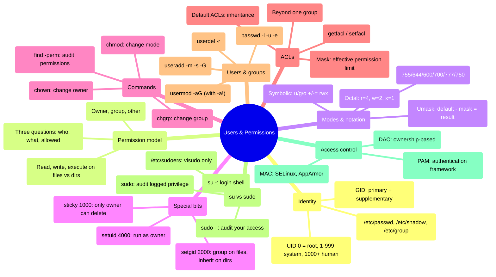

## 1 · The Big Picture

### Why this topic exists

You are not the only user on a Linux system. Even on a laptop you control completely, there is `root`, system daemons running as unprivileged users, maybe a development user and a production user. When three users exist on one machine, three questions become urgent:

- **Who** is trying to do this? (Identity)
- **What** are they trying to do? (Action)
- **What does the target resource allow?** (Permission)

The answers to these three questions make the difference between a system that isolates work (a web server cannot read your SSH keys; a compromised service cannot become root) and a system where one vulnerability spreads everywhere. Permissions are not a security feature that companies *choose* to use — they are infrastructure, like power distribution. Get them wrong and the system does not work.

### The real problem it solves

Imagine two users, Alice and Bob, on a machine with a single shared disk and no permission system. Alice writes a file. Bob can read it, modify it, or delete it. If Bob runs a buggy script that runs `rm -rf /home`, Alice's data is gone and Alice cannot stop him. If a web server Alice runs gets compromised by a remote attacker, the attacker has all of Alice's privileges and can read Bob's documents and SSH keys.

A permission system solves this by answering three questions at the kernel level:

```diagram title="Permission checking — the kernel's three questions"
  User alice requests: open("/home/bob/secret", O_RDONLY)
                                │
                    ┌───────────┴───────────┐
                    │                       │
         1. WHO?              2. WHAT?      3. WHAT'S ALLOWED?
     UID 1000 = alice    read from file    file owner: bob
                                               mode: 600 (rw-------)
                                            UID 1000 vs owner UID 1001
                    │                       │
                    └───────────┬───────────┘
                                │
                           KERNEL DECISION
                                │
                    ┌───────────┴───────────┐
                    │                       │
                  DENY                     ALLOW
              return -EACCES            fd = open()
```

Every file on a Linux system is protected by this three-question gate.

### Where you will encounter it

| Context | What permissions are doing there |
|---|---|
| **SSH key security** | Only the owner can read `~/.ssh/id_ed25519` (mode 600). SSH will refuse to use a key with wrong permissions. Bad permissions = lockout |
| **Web server isolation** | nginx runs as the `www-data` user, can read `/var/www` but not `/root`. A remote exploit cannot become root or read admin SSH keys |
| **Container images** | A Dockerfile specifies which user the app runs as (`USER 1000`), and volumes mount with restricted ownership to prevent privilege escalation |
| **CI/CD pipelines** | A build runner runs as an unprivileged user; it can read source but not write to `/etc` or package repos. Secrets are injected at runtime as files only that user can read |
| **Sudo audit trail** | Every `sudo` invocation is logged by UID, command, and outcome; it is the entire audit model for who did what as root |
| **Kubernetes RBAC** | Role-based access control for who can run `kubectl` and what they can do — built directly on the same "who/what/allowed" model |

### Why companies care

- **Compliance** — SOC 2, PCI, HIPAA all require "strong access controls". Permissions are the first line.
- **Incident response** — when a web server is compromised, logs show what the attacker read and wrote, and the permission system contained them to that user's files, limiting exposure.
- **Team isolation** — developers, DBA, infra teams can share a machine with zero visibility into each other's work.
- **DevOps automation** — infrastructure code runs with minimal permissions; if it is compromised, the blast radius is bounded.

---

## 2 · Intuition First

### Analogy 1: permissions as a physical building

Imagine an office building with five floors and 20 employees.

- **User (UID)** — each employee has a unique ID badge
- **Group (GID)** — marketing team, engineering team, executive team — some people belong to multiple groups
- **File mode** — a door has three locks:
  - *owner lock* — only the key owner carries
  - *group lock* — only members of that group's team carry
  - *other lock* — a generic lock anyone can use
- **Read** — you can go through the door and see the office
- **Write** — you can move furniture, write on the whiteboard, throw things away
- **Execute** — on a file, it means "run this code"; on a directory, it means "walk through and access files inside"

If you are the owner and the owner lock is off, you enter. If you are not the owner but in the group and the group lock is off, you enter. Otherwise you check the "other" lock. If none apply, the door stays locked.

> [!TIP]
> On a file, `w` (write) permission does **not** mean "delete this file." On a *directory*, `w` (write) means "create, delete or rename entries inside."  This is the most misunderstood rule in Unix permissions. Write permission on the file would let you modify its *contents*; write permission on the directory lets you destroy it entirely. That is why `/tmp` has `1777` (everyone can write, but only the owner or root can delete an entry). This one distinction explains half the confusion students have.

### Analogy 2: `sudo` as a written permission slip

In the building analogy, employees are not allowed to enter the executive floor. But sometimes an employee must, and they carry a permission slip signed by a manager:

> "This employee, Alice, has permission to:
> - Restart the web server"

Alice shows the slip to the security guard (the kernel). If her name is on it and it is signed, she gets in.

`sudo` works the same way. It is not a command that runs as root; it is a **permission check**. If your name is in `/etc/sudoers`, you *can* ask to become root (or another user) to run a specific command, and the kernel enforces it.

### Analogy 3: ACLs as a more expressive permission slip

A standard UNIX permission is: owner, *one* group, and others.

ACLs say: "This file is readable by Alice, Bob, and the marketing group, writable by Alice only, executable by no one." That is more granular than a single group.

---

## 3 · Technical Definitions

**User (UID — User ID).** A number between 0 and 4,294,967,295 that uniquely identifies a user on the system.

| UID range | Meaning | Example |
|---|---|---|
| `0` | root — full kernel privilege | The superuser |
| `1–999` | System/service users — reserved for daemons | `www-data` (nginx), `mysql`, `postgres` |
| `1000+` | Regular/human users | `alice`, `bob`, on a fresh install `1000` is the first interactive user |

**Primary group and supplementary groups.** Every user has a **primary group** (one GID) set at account creation. Additionally, a user can be a member of any number of **supplementary groups**.

```console
$ id alice
uid=1000(alice) gid=1000(alice) groups=1000(alice),27(sudo),4(adm)
```

Alice's primary group is `1000` (alice). She is also a member of `sudo` (GID 4) and `adm` (GID 27). If a file is owned by group `sudo`, Alice can access it because she is in that group.

**Special case: the `root` user.** UID 0 is root. Running as root bypasses all permission checks. Never run as root unless a specific command requires it.

### The user database: `/etc/passwd`, `/etc/shadow`, `/etc/group`, `/etc/gshadow`

**`/etc/passwd`** — the public user database. Readable by everyone. Format:

```
name:x:UID:GID:GECOS:home_directory:shell
```

Field breakdown:

| Field | Meaning | Example |
|---|---|---|
| **name** | Login name (1–32 chars, alphanumeric + underscore) | `alice` |
| **x** | Historically the password hash; now always `x` — hash moved to `/etc/shadow` for security | `x` |
| **UID** | Numeric user ID (0 = root, 1–999 = system, 1000+ = human) | `1000` |
| **GID** | Numeric primary group ID | `1000` |
| **GECOS** | Full name, office, phone — arbitrary comment field (originally "General Electric Comprehensive Operating System") | `Alice Smith,Room 42,555-1234` |
| **home_directory** | Path to user's home; shell scripts and apps use `$HOME` | `/home/alice` |
| **shell** | Login shell — the program the user gets after SSH or `login` | `/bin/bash`, `/bin/sh`, `/usr/sbin/nologin` |

Real example:

```console
$ head -1 /etc/passwd
root:x:0:0:root:/root:/bin/bash
$ grep alice /etc/passwd
alice:x:1000:1000:Alice Smith:/home/alice:/bin/bash
```

**`/etc/shadow`** — the secret password database. Readable only by root (mode `640`). Format:

```
name:password_hash:lastchange:min:max:warn:inactive:expire:reserved
```

| Field | Meaning | Example |
|---|---|---|
| **name** | Must match an `/etc/passwd` entry | `alice` |
| **password_hash** | Hashed password, or special markers | `$6$...` or `!` or `*` |
| **lastchange** | Days since 1970-01-01 when password was last changed | `20000` |
| **min** | Minimum days between password changes | `0` |
| **max** | Maximum days before password expires (0 = never) | `99999` |
| **warn** | Days before expiry to warn user | `7` |
| **inactive** | Days of inactivity before account disables | `0` (disabled) |
| **expire** | Days since 1970-01-01 when account expires (0 = never) | `0` |
| **reserved** | Reserved, always empty | — |

Hash format:

```
$algorithm$salt$hash
```

Common algorithms:

| Algorithm | Code | Notes |
|---|---|---|
| MD5 | `$1` | Deprecated, weak |
| Blowfish | `$2a` | OK; still used on older systems |
| SHA-256 | `$5` | Standard on modern systems |
| SHA-512 | `$6` | Standard on modern systems |

Locked passwords:

| Marker | Meaning |
|---|---|
| `!` | Account disabled (login impossible) |
| `*` | No password set (login impossible) |
| `!!` | Password expired |

Example:

```console
$ grep alice /etc/shadow
alice:$6$abcdef123456$TkJYsZ....:20000:0:99999:7:0:0:
```

**`/etc/group`** — the group database. Format:

```
groupname:x:GID:member_list
```

| Field | Meaning |
|---|---|
| **groupname** | 1–32 chars, alphanumeric + underscore |
| **x** | Historically the group password; now always `x` |
| **GID** | Numeric group ID |
| **member_list** | Comma-separated supplementary members (primary group members are *not* listed here) |

Example:

```console
$ grep sudo /etc/group
sudo:x:27:alice,bob
```

Alice and Bob are supplementary members of `sudo`. If Alice's primary group is also `sudo`, she would still see GID 27 in both places.

**`/etc/gshadow`** — group password database (rarely used). Format: `groupname:password:admins:members`. Read-only by root.

---

## 4 · The rwx Model — Precise Specification

### The 10-character mode string

Every file and directory is described by a 10-character mode string visible in `ls -l`:

```console
$ ls -l /etc/passwd
-rw-r--r-- 1 root root 2156 Sep  2 15:42 /etc/passwd

$ ls -l /bin/bash
-rwxr-xr-x 1 root root 1568216 Nov 14  2024 /bin/bash

$ ls -ld /tmp
drwxrwxrwt 1 root root 4096 Feb  1 13:45 /tmp
```

Breakdown:

```
-rw-r--r-- 
│ ││ ││ ││
│ ││ ││ └┴─ others (anyone else):  r (read),  - (no write),  - (no execute)
│ ││ └┴──── group (root group):    r (read),  - (no write),  - (no execute)
│ └┴─────── owner (root):          rw (read + write),  - (no execute)
└────────── file type: - = regular file
```

File types:

| Character | Type | Meaning |
|---|---|---|
| `-` | Regular file | Data, scripts, binaries |
| `d` | Directory | Can contain files |
| `l` | Symbolic link | Pointer to another file |
| `b` | Block device | Disk, USB drive (`/dev/sda`) |
| `c` | Character device | Terminal, serial port, random (`/dev/tty`, `/dev/urandom`) |
| `s` | Socket | Inter-process communication endpoint |
| `p` | Named pipe (FIFO) | Data pipe between processes |

### What r, w, x mean on files vs directories

This is the critical distinction — it explains why you cannot delete a read-only file in a directory you own.

#### On a regular file

| Permission | Meaning |
|---|---|
| **r** (read) | You can read the file's contents (`cat`, `less`, copy it) |
| **w** (write) | You can modify the file's contents (`echo >> file`, editors) |
| **x** (execute) | You can run the file as a program (if it is a binary or script) |

Crucially: **write on the file does not let you delete it.**

#### On a directory

| Permission | Meaning |
|---|---|
| **r** (read) | You can list entries: `ls dir` works, you see filenames |
| **w** (write) | You can create, delete, or rename entries *inside* — `touch dir/newfile`, `rm dir/oldfile`, `mv dir/a dir/b` all require write permission on the *directory*, not the file |
| **x** (execute) | You can traverse the directory — `cd dir` and access `dir/file` if you have permission on the file. Without `x`, you cannot enter, even with `r` |

**Example: why you can delete a read-only file in a directory you own**

```console
$ mkdir testdir
$ touch testdir/readonlyfile
$ chmod 000 testdir/readonlyfile       # file is unreadable, unwritable
$ rm testdir/readonlyfile               # succeeds!
$ echo $?
0
```

Why? Because `rm` checks permission on the *directory* (`testdir`), not the file. You own the directory and have write permission, so you can delete entries in it. The file being read-only is irrelevant. This is deliberate: it prevents a user from hostaging a directory by creating undeletereable files.

**Example: why you cannot access a file in a directory without execute on the directory**

```console
$ mkdir noexec
$ touch noexec/file
$ chmod 755 noexec                     # owner rwx, group r, other r — but no x
$ cat noexec/file
cat: noexec/file: Permission denied
```

Why? Because you need `x` on the directory to traverse into it. With only `r`, you can see the filename but not access the inode.

### Octal notation

Each permission is a number:

```
r (read)    = 4
w (write)   = 2
x (execute) = 1
```

Each triad sums these: `rwx = 4+2+1 = 7`, `rw- = 4+2 = 6`, `r-- = 4`.

A mode is four octal digits: `SUID GUID STICKY` then `owner group others`.

```
0755
│││└── others: r-x (5)
││└─── group:  r-x (5)
│└──── owner:  rwx (7)
└───── special bits (0 = none)
```

Common modes:

| Mode | Meaning | Typical use |
|---|---|---|
| `755` | `rwxr-xr-x` | Executable, readable by all | Binaries, directories |
| `644` | `rw-r--r--` | Readable by all | Config files, docs |
| `600` | `rw-------` | Owner only | SSH keys, secrets |
| `700` | `rwx------` | Owner only | Private directories |
| `777` | `rwxrwxrwx` | Anyone can do anything | Dangerous; rarely justified |
| `750` | `rwxr-x---` | Owner full, group read/execute | Shared directories |
| `440` | `r--r-----` | Owner and group read only | Read-only configs |

> [!MEMORY]
> **Octal mental model:** Think `r = 4, w = 2, x = 1`. For `755`: owner gets 7 (wants rwx, all there), group gets 5 (wants rwx but loses w), other gets 5 (same as group). Reading `0644`: owner 6 (rw), group 4 (r only), other 4 (r only). Most files are 644 or 755.

### Symbolic notation

Instead of octal, you can use:

```
chmod [ugoa][+-=]rwx
```

Where:

| Letter | Meaning |
|---|---|
| `u` | user (owner) |
| `g` | group |
| `o` | other |
| `a` | all (shorthand for `ugo`) |
| `+` | add permission |
| `-` | remove permission |
| `=` | set exactly (remove all others) |

Examples:

```bash
chmod u=rwx,go=rx dir           # owner rwx, group r-x, other r-x (same as 755)
chmod go-w file                 # remove write from group and other
chmod a-x script                # remove execute from everyone
chmod +x /usr/local/bin/myscript  # add execute for owner (if not set), group (if set), other (if set) — varies
chmod u=rw,g=r,o= file         # owner rw, group r, other nothing
```

**Capital `X` (smart execute):**

```bash
chmod -R +X dir   # add execute only to directories, not files
```

This is useful: you want `755` on directories (so users can enter) but `644` on files (executable only if already marked as such). `+X` does this in one pass.

### Umask: removing permissions by default

When you create a file, the system uses a **umask** to decide which permissions to *remove*. It is a mask of bits to *subtract* from the default.

Default permissions before umask:
- Files: `666` (rw-rw-rw- — historically, x is dangerous by default)
- Directories: `777` (rwxrwxrwx)

Umask applied: `default_perms & ~umask`

If umask is `022`:

```
Files:       666 & ~022 = 666 & 755 = 644 (rw-r--r--)
Directories: 777 & ~022 = 777 & 755 = 755 (rwxr-xr-x)
```

If umask is `002` (common in team environments):

```
Files:       666 & ~002 = 666 & 775 = 664 (rw-rw-r--)
Directories: 777 & ~002 = 777 & 775 = 775 (rwxrwxr-x)
```

If umask is `077` (paranoid, private):

```
Files:       666 & ~077 = 666 & 700 = 600 (rw-------)
Directories: 777 & ~077 = 777 & 700 = 700 (rwx------)
```

View and set umask:

```bash
umask              # display current umask (usually 0022)
umask 002          # set to 002 (until logout)
```

Persistent umask: add to shell profile (`~/.bashrc`, `~/.profile`):

```bash
umask 002
```

Or system-wide in `/etc/profile` or PAM configuration.

---

## 5 · chmod, chown, chgrp: Practical Demonstration

### chmod: change mode

```bash
chmod [options] mode file
```

| Option | Meaning |
|---|---|
| `-R` | Recursive: apply to directory and all contents |
| `-v` | Verbose: print each change |
| `-c` | Changes only: print only if something changed |
| `-f` | Force: suppress error messages |
| `--reference=other` | Use permissions from `other` file instead of a mode |
| `--preserve-root` | Refuse to change `/` or `/` (default on `chmod -R`) |

Real examples:

```console
$ ls -l testfile
-rw-r--r-- 1 alice alice 0 Feb  1 12:00 testfile

$ chmod 755 testfile
$ ls -l testfile
-rwxr-xr-x 1 alice alice 0 Feb  1 12:00 testfile

$ chmod go-w testfile
$ ls -l testfile
-rwxr-xr-x 1 alice alice 0 Feb  1 12:00 testfile  # already removed

$ chmod u=rw,g=r,o= testfile
$ ls -l testfile
-rw-r----- 1 alice alice 0 Feb  1 12:00 testfile

$ chmod -v 644 testfile
mode of 'testfile' changed from 0640 to 0644 (rw-r--r--)
```

Recursive with verbose and changes:

```console
$ chmod -R -v -c 755 /tmp/test
mode of '/tmp/test' changed from 0755 to 0755
mode of '/tmp/test/dir1' changed from 0755 to 0755
mode of '/tmp/test/file1' changed from 0644 to 0755
'/' skipped (ELOOP)
```

The `-c` flag suppresses lines that did not change; `-v` shows all.

> [!DANGER]
> **`chmod -R 777 /` breaks your system.** This grants write to everyone on every file: SSH keys become world-readable, the `sshd` binary becomes writable (attackers can inject code), the `sudo` binary becomes modifiable (attackers can remove the permission check). SSH will refuse to use world-readable keys, sudo will refuse to run, and recovery requires single-user mode. **Never test this.** Instead, test `chmod -R 777` on a throwaway directory.

Recursive best practice: handle files and directories separately to avoid making files executable:

```bash
find /home/alice/project -type d -exec chmod 755 {} +
find /home/alice/project -type f -exec chmod 644 {} +
```

This sets all directories to `755` and all files to `644` — the standard mode. (The `+` is an optimization: it groups multiple files into one command instead of spawning `chmod` once per file.)

### chown: change owner

```bash
chown [options] owner[:group] file
```

| Option | Meaning |
|---|---|
| `-R` | Recursive |
| `-v` | Verbose |
| `-c` | Changes only |
| `-f` | Force |
| `--reference=other` | Use ownership from `other` file |
| `--preserve-root` | Refuse to change `/` (default on `-R`) |

Syntax for owner and group:

| Form | Meaning |
|---|---|
| `username` | Change owner to username; group unchanged |
| `username:groupname` | Change owner and group |
| `:groupname` | Change group only (equivalent to `chgrp`) |
| `username:` | Change owner to username; group to that user's primary group |

Real examples:

```console
$ ls -l testfile
-rw-r--r-- 1 alice alice 1024 Feb  1 testfile

$ chown root testfile
$ ls -l testfile
-rw-r--r-- 1 root alice 1024 Feb  1 testfile

$ chown bob:developers testfile
$ ls -l testfile
-rw-r--r-- 1 bob developers 1024 Feb  1 testfile

$ chown -v bob:developers /home/alice/project
ownership of '/home/alice/project' changed from alice:alice to bob:developers
```

Recursive: changing ownership of a shared project directory

```console
$ ls -ld /srv/project
drwxr-xr-x 1 admin admin 4096 Feb  1 /srv/project

$ chown -R -v -c admin:developers /srv/project
ownership of '/srv/project' changed from admin:admin to admin:developers
ownership of '/srv/project/src' changed from admin:admin to admin:developers
ownership of '/srv/project/src/main.py' changed from admin:admin to admin:developers
... (output continues)
```

> [!DANGER]
> **`chown -R` on `/usr` or `/` with wrong destination is catastrophic.** If you run `chown -R wronguser:wronggroup /usr`, the system will not boot — too many binaries and libraries have wrong ownership. The kernel cannot execute files it does not trust. Recovery requires restoration from backup or live boot.

**Important: only root can change ownership.** Even if you own a file, you cannot `chown` it to another user to prevent users hiding files from admins.

```console
$ chown alice testfile
chown: changing ownership of 'testfile': Operation not permitted
```

Exception: a user can change owner to themselves (that is, `chown alice:alice` when owner is already alice has no effect but no error).

### chgrp: change group

```bash
chgrp [options] group file
```

Same options as `chown`. This is equivalent to `chown :group`.

```console
$ chgrp developers testfile
$ ls -l testfile
-rw-r--r-- 1 alice developers 0 Feb  1 testfile
```

---

## 6 · Special Permission Bits: setuid, setgid, sticky

Beyond owner/group/other, three special bits modify permission behavior:

```
4000 (setuid) — "set user ID"
2000 (setgid) — "set group ID"
1000 (sticky) — "sticky bit"
```

These appear in the first octal digit:

```
4755  (setuid + rwxr-xr-x)
2755  (setgid + rwxr-xr-x)
1755  (sticky + rwxr-xr-x)
```

Or in the mode string:

```
-rwsr-xr-x    (setuid + executable)
-rwSr-xr-x    (setuid, NOT executable — capital S)
-rwxr-sr-x    (setgid + executable)
-rwxr-Sr-x    (setgid, NOT executable)
-rwxrwxrwt    (sticky + rwxrwxrwx)
-rwxrwxrwT    (sticky, NOT executable on others)
```

### setuid (4000): run as the file owner

When you run a setuid binary, the process runs with the UID of the file owner, not your UID.

**Use case: `passwd` command**

Users must change their own password, but passwords are stored in `/etc/shadow` which is readable/writable only by root. How can a non-root user write their password?

```console
$ ls -l /usr/bin/passwd
-rwsr-xr-x 1 root root 68208 Nov 14  2024 /usr/bin/passwd
          ↑↑
       setuid + executable
```

When alice runs `passwd`:

1. alice calls `/usr/bin/passwd`
2. The kernel sees the setuid bit and the owner is root
3. The kernel starts the process with UID 0 (root) instead of UID 1000 (alice)
4. `passwd` reads alice's name, prompts for a new password, updates `/etc/shadow`
5. Process exits; alice is alice again

Without setuid, alice could not write to `/etc/shadow` and could not change her password.

**Security implications of setuid:**

Setuid is powerful and dangerous. If a setuid binary has a security hole, an attacker can become the owner (usually root) instantly. For this reason:

- Setuid binaries are rare and carefully audited
- The filesystem must prevent certain directories from having setuid files (often `/tmp`, `/home` with `nosuid` mount option)
- Find all setuid binaries on a system for audit:

```bash
find / -perm -4000 -type f
```

Example output:

```console
$ find / -perm -4000 -type f 2>/dev/null
/usr/bin/passwd
/usr/bin/sudo
/usr/bin/newgrp
/usr/bin/chfn
/usr/bin/chsh
/usr/lib/openssh/ssh-keysign
/usr/lib/dbus-1.0/dbus-daemon-launch-helper
```

Each of these is a critical system function that *must* run as root. Fewer is better.

### setgid (2000): run as the file owner's group (files) or inherit directory group (directories)

#### On a file

When you run a setgid binary, the process runs with the GID of the file's group owner, not your GID.

This is less common than setuid. It is used for utilities that need group-level privilege (e.g., `staprun` in SystemTap, which needs kernel access).

#### On a directory (more important)

When setgid is set on a directory, **new files created inside inherit the directory's group**, not the creator's primary group.

**Use case: shared project directory**

A team wants to share code in `/srv/project` where anyone in the `developers` group can create and edit files, and all files belong to the `developers` group.

Setup:

```bash
groupadd developers
usermod -aG developers alice
usermod -aG developers bob

mkdir -p /srv/project
chgrp developers /srv/project
chmod 2775 /srv/project
umask 002                          # or set in a .bashrc for developers
```

What this does:

- `groupadd developers` — create the group
- `usermod -aG developers alice` — add alice to the developers group (as a supplementary member; `-a` means append, not replace)
- `mkdir -p /srv/project` — create the directory
- `chgrp developers /srv/project` — set the group owner
- `chmod 2775 /srv/project` — set mode and **setgid**:
  - Owner (admin): `rwx`
  - Group (developers): `rwx`
  - Other: `r-x`
  - Setgid: `2`
- `umask 002` — remove write from "other", keeping `group` writable

Now alice creates a file:

```console
$ cd /srv/project
$ touch myfile
$ ls -l myfile
-rw-rw-r-- 1 alice developers 0 Feb  1 myfile
           ↑
        group is "developers", not "alice"
```

Why? Because:

1. alice has write on the directory (passes permission check)
2. The directory has setgid, so the new file gets the directory's group (`developers`)
3. The umask `002` leaves group write, so file is `664` (rw-rw-r--)

Without setgid, the file would be:

```
-rw-r--r-- 1 alice alice 0 Feb  1 myfile
```

Bob also in the group can now edit alice's file:

```console
$ bob@host:/srv/project$ echo "new content" >> myfile
$ ls -l myfile
-rw-rw-r-- 1 alice developers 0 Feb  1 myfile
```

This is the standard shared project recipe: setgid + umask 002 + supplementary groups.

**On a directory, setgid is visible in `ls -l`:**

```console
$ ls -ld /srv/project
drwxrwsr-x 1 admin developers 4096 Feb  1 /srv/project
       ↑↑
    setgid + executable
```

Capital `S` means setgid without execute (unusual; usually means a bug).

### sticky bit (1000): only owner/directory owner/root can delete

The sticky bit restricts deletion. Normally, anyone with write on a directory can delete files in it. Sticky bit says: only the file owner, the directory owner, or root can delete an entry.

**Use case: shared `/tmp`**

`/tmp` must be writable by everyone. But you do not want alice to delete bob's temporary files, or vice versa. Solution: setgid + sticky.

```console
$ ls -ld /tmp
drwxrwxrwt 15 root root 4096 Feb  1 17:31 /tmp
     ↑↑↑
 setgid + sticky + rwx all
```

Mode `1777`:

```
1  = sticky
7  = owner rwx
7  = group rwx
7  = other rwx
```

Now alice creates `/tmp/file1`:

```console
$ alice@host:/tmp$ touch file1
$ ls -l file1
-rw-r--r-- 1 alice alice 0 Feb  1 file1
```

Bob tries to delete it:

```console
$ bob@host:/tmp$ rm file1
rm: cannot remove 'file1': Operation not permitted
```

Why? Bob has write on `/tmp` (group and other get rwx), but bob is neither the file owner, the directory owner (root), nor root himself, so deletion fails.

Alice can delete her own file:

```console
$ alice@host:/tmp$ rm file1
```

Root can delete anyone's file:

```console
$ sudo rm file1
```

**Table: special bits at a glance**

| Bit | Octal | On file | On directory | Symbol |
|---|---|---|---|---|
| **setuid** | 4000 | Process runs as file owner (e.g., `passwd`, `sudo`) | Ignored | `s` or `S` in owner execute |
| **setgid** | 2000 | Process runs as file's group | New files inherit directory's group | `s` or `S` in group execute |
| **sticky** | 1000 | Ignored | Only owner/dir owner/root can delete entries | `t` or `T` in other execute |

Setting special bits:

```bash
chmod u+s file              # add setuid
chmod g+s dir               # add setgid
chmod o+t dir               # add sticky
chmod 4755 file             # setuid + rwxr-xr-x
chmod 2775 dir              # setgid + rwxrwxr-x
chmod 1777 dir              # sticky + rwxrwxrwx
```

---

## 7 · ACLs: Access Control Lists

### Why ACLs exist

Standard UNIX permissions are constrained: owner, one group, others. What if you need:

- alice (owner) to have rwx
- the `marketing` group to have rw
- the `developers` group to have rx
- bob (not in any of those groups) to have r only

With standard permissions, you cannot express this. With ACLs, you can.

### getfacl: display ACLs

```bash
getfacl file
```

Output, line by line:

```console
$ getfacl /etc/hosts
# file: /etc/hosts
# owner: root
# group: root
user::rw-                    # owner (user::) has rw-
group::r--                   # group owner (group::) has r--
other::r--                   # others (other::) have r--
```

If ACLs have been set:

```console
$ getfacl /tmp/project
# file: /tmp/project
# owner: alice
# group: developers
user::rwx                    # owner alice has rwx
user:bob:r--                 # user bob (bob::rw) has rw  ← named user entry
group::rwx                   # group developers (group::) has rwx
group:marketing:r--          # group marketing (group:marketing:) has r  ← named group entry
mask::rwx                    # effective mask (silently limits perms) ← mask
other::---                   # others have nothing
```

**`mask::`** — the effective permissions mask. If you set a specific permission, the mask is updated to the logical OR of all non-owning entries. The mask silently limits effective permissions. `#effective:` annotations show what actually takes effect:

```console
$ getfacl /tmp/project2
# file: /tmp/project2
# owner: alice
# group: developers
user::rwx
user:bob:rw-               #effective:rw-   (would be rwx but mask limits to rw)
group::rwx
mask::rw-                  # ← mask is rw-, so bob cannot execute
other::---
```

**Default ACLs** on directories — these are inherited by new files:

```console
$ getfacl /srv/project
# file: /srv/project
# owner: admin
# group: developers
user::rwx
group::rwx
other::r-x
default:user::rwx          # ← default: new files will have owner rwx
default:group::rwx         #   new files will have group rwx
default:other::r--         #   new files will have other r--
```

### setfacl: set ACLs

```bash
setfacl [options] -m ACL_ENTRY file
```

| Option | Meaning |
|---|---|
| `-m` | Modify ACL (add or replace entry) |
| `-x` | Remove ACL entry |
| `-b` | Remove all ACL entries (revert to mode) |
| `-d` | Set default ACL on a directory |
| `-R` | Recursive |
| `-k` | Remove default ACL |

Set an ACL for a specific user:

```bash
setfacl -m u:bob:rw file
setfacl -m u:bob:rwx dir
```

Set an ACL for a group:

```bash
setfacl -m g:developers:rx file
```

Set default ACL on a directory (new files inherit this):

```bash
setfacl -d -m g:developers:rwx /srv/project
```

Real example: shared project directory with ACLs

```console
$ mkdir /srv/shared
$ setfacl -m u:alice:rwx /srv/shared
$ setfacl -m u:bob:rwx /srv/shared
$ setfacl -m g:devs:rx /srv/shared
$ setfacl -d -m g:devs:rwx /srv/shared        # default: new files get devs:rwx

$ getfacl /srv/shared
# file: /srv/shared
# owner: root
# group: root
user::rwx
user:alice:rwx
user:bob:rwx
group::---
group:devs:rwx
mask::rwx
other::---
default:user::rwx
default:group:devs:rwx
default:mask::rwx
default:other::---
```

Remove a specific ACL entry:

```bash
setfacl -x u:bob /srv/shared
```

Remove all ACL entries from a file:

```bash
setfacl -b /srv/shared
```

Remove default ACLs:

```bash
setfacl -k /srv/shared
```

### ACL survival: how ACLs are preserved with copy and archive

ACLs are **not** preserved by default `cp`, only by `cp -a --preserve=all`:

```bash
cp file file.copy                    # ACL lost
cp -a --preserve=all file file.copy  # ACL preserved
cp -p file file.copy                 # mode preserved, ACL lost
```

When using `tar` and `rsync`:

```bash
tar --acls -cf archive.tar /src      # preserve ACLs
tar --acls -xf archive.tar           # extract with ACLs

rsync -A /src /dest                  # -A preserves ACLs
```

This is critical: if you back up to tape without ACLs, you lose them. Use `--preserve=all` and `--acls` flags.

### Filesystem support

ACLs require filesystem support. Check:

```console
$ mount | grep /srv/shared
/dev/mapper/data on /srv/shared type ext4 (rw,acl)
                                            ↑
                                    acl option present
```

If not present, mount with acl:

```bash
mount -o acl /dev/mapper/data /srv/shared
```

To make it persistent, edit `/etc/fstab`:

```
/dev/mapper/data  /srv/shared  ext4  defaults,acl  0  2
```

Modern filesystems (ext4, XFS, Btrfs) support ACLs by default.

### Extended attributes and immutability

**`getfattr` / `setfattr`** — extended attributes (xattr). These are arbitrary key-value pairs on files:

```bash
setfattr -n user.mykey -v "myvalue" file
getfattr -d file
```

Rarely used in practice, but worth knowing.

**`chattr +i`** — make a file immutable (cannot be modified or deleted, even by root):

```bash
sudo chattr +i /etc/important-config
ls -l /etc/important-config
```

Output shows `i`:

```
----i----------- 1 root root 0 Feb  1 config
```

Useful for protecting config files from accidents:

```bash
sudo chattr +i /etc/fstab           # prevent accidental mount changes
sudo chattr +i /etc/sudoers.d/*     # prevent sudoers corruption
sudo chattr +a /var/log/secure      # append-only (for logs)
```

Remove with `-i`:

```bash
sudo chattr -i /etc/important-config
```

---

## 8 · User and Group Management

### useradd: add a user

```bash
useradd [options] username
```

| Option | Meaning |
|---|---|
| `-m` | Create home directory |
| `-d /path` | Specify home directory path (default `/home/username`) |
| `-s /path/shell` | Specify login shell (default from `/etc/default/useradd`) |
| `-g groupname` | Specify primary group (default: create group with same name as user) |
| `-G group1,group2` | Add to supplementary groups |
| `-u UID` | Specify UID (default: auto-assign) |
| `-c "Full name"` | Set GECOS comment field |
| `-e YYYY-MM-DD` | Account expiry date |
| `-k /dir` | Skeleton directory for home (default `/etc/skel`) |
| `-r` | Create system user (UID < 1000) |
| `-N` | Do not create primary group |

Typical invocation:

```bash
useradd -m -s /bin/bash alice
```

This creates:
- User `alice` with a new group `alice`
- Home directory `/home/alice` (from `/etc/skel` skeleton)
- Login shell `/bin/bash`

Verify:

```console
$ getent passwd alice
alice:x:1000:1000::/home/alice:/bin/bash

$ ls -ld /home/alice
drwx------ 1 alice alice 4096 Feb  1 12:00 /home/alice
```

Real example: provisioning a development user with supplementary groups

```bash
useradd -m -s /bin/bash -G sudo,docker,developers alice
```

This adds alice to `sudo` (can use `sudo`), `docker` (can run Docker), and `developers` (can access `/srv/project`).

Verify:

```console
$ id alice
uid=1000(alice) gid=1000(alice) groups=1000(alice),4(adm),27(sudo),999(docker),1001(developers)
```

### passwd: set or change a password

```bash
passwd [options] username
```

| Option | Meaning |
|---|---|
| `-l` | Lock the account (prepend `!` to hash) |
| `-u` | Unlock the account |
| `-d` | Delete password (login via password is impossible; SSH keys only) |
| `-e` | Expire password (force change at next login) |
| `-S` | Show password status |
| `--stdin` | Read password from stdin (for scripts) |

Interactive:

```bash
passwd alice
```

Output:

```
Changing password for user alice.
Current password:
New password:
Retype new password:
passwd: all authentication tokens updated successfully.
```

Bulk password setting (scripting):

```bash
echo "alice:NewPassword123" | chpasswd
```

Force password change at next login:

```bash
passwd -e alice
```

Lock an account:

```bash
passwd -l alice
```

View status:

```bash
passwd -S alice
```

Output:

```
alice L 02/01/2025 0 99999 7 -1
```

Fields: name, status (L = locked, P = has password, NP = no password), last change, min, max, warn, inactive.

### userdel: delete a user

```bash
userdel [options] username
```

| Option | Meaning |
|---|---|
| `-r` | Remove home directory and mail spool |
| `-f` | Force removal (even if user logged in) |

```bash
userdel -r alice
```

This removes:
- User entry from `/etc/passwd` and `/etc/shadow`
- Primary group (if it matches the username)
- Home directory `/home/alice`
- Mail spool `/var/mail/alice`

Without `-r`, only the user entry is removed; the home directory remains orphaned (owned by the deleted UID).

### Example: provisioning two users with shared directory

```bash
# Create the group
groupadd developers

# Create two users
useradd -m -s /bin/bash -G developers alice
useradd -m -s /bin/bash -G developers bob

# Set passwords
passwd alice
passwd bob

# Create shared directory
mkdir -p /srv/project
chgrp developers /srv/project
chmod 2775 /srv/project
setfacl -d -m g:developers:rwx /srv/project
umask 002

# Verify
ls -ld /srv/project
getfacl /srv/project
id alice
id bob
```

Now alice and bob can create and edit files together.

### Other user management commands

**`usermod`** — modify a user account:

```bash
usermod -aG newgroup alice          # add alice to newgroup (-a = append, critical!)
usermod -l newname alice             # rename alice to newname
usermod -d /new/home alice           # change home directory
usermod -s /bin/sh alice             # change shell
usermod -e 2026-12-31 alice          # set expiry date
usermod -L alice                     # lock account (same as passwd -l)
usermod -U alice                     # unlock
```

> [!DANGER]
> **Forgetting `-a` in `usermod -G`** is catastrophic. This command *replaces* all supplementary groups:
>
> ```bash
> usermod -G docker alice      # alice loses ALL other groups, including sudo!
> ```
>
> Then alice cannot use `sudo` or access any project directories. Always use `-a`:
>
> ```bash
> usermod -aG docker alice     # alice KEEPS existing groups, ADDS docker
> ```
>
> This is a classic incident: someone tries to add a user to docker and accidentally locks them out of everything else.

**`groupadd` / `groupdel` / `groupmod`** — manage groups:

```bash
groupadd developers              # create group with auto-assigned GID
groupadd -g 1500 infra           # create group with specific GID

groupdel developers              # delete group (fails if users have it as primary)

groupmod -g 1600 infra           # change group GID
groupmod -n newinf infra         # rename group
```

**`gpasswd`** — manage group membership:

```bash
gpasswd -a alice developers      # add alice (same as usermod -aG)
gpasswd -d alice developers      # remove alice
gpasswd -M alice,bob developers  # set members (replaces all)
```

**`newgrp`** — switch primary group in current shell:

```bash
newgrp developers
```

Then files created have `developers` as primary group (and alice:developers ownership in `ls -l`).

---

## 9 · su vs sudo: Privilege Escalation

### su: switch user (login shell)

```bash
su [options] username
```

| Option | Meaning |
|---|---|
| `-` | Start a login shell (load full environment, correct PATH, home) |
| `-c command` | Execute one command as the user, then exit |

**Without `-`:**

```console
$ echo $PATH
/usr/local/bin:/usr/bin:/bin
$ su root
Password:
# echo $PATH
/usr/local/bin:/usr/bin:/bin
# exit
```

You are root, but `$PATH` and other environment variables are wrong (you have alice's PATH, not root's). This is dangerous — `which vi` might find alice's vi (which could be malicious).

**With `-` (almost always use this):**

```console
$ su - root
Password:
# echo $PATH
/usr/local/bin:/usr/sbin:/usr/bin:/sbin:/bin
# echo $HOME
/root
# exit
```

Full login shell: correct PATH, home, shell, timezone, etc.

**Run one command:**

```bash
su - root -c "apt update"
```

Returns to alice after the command.

**`su alice`** — switch to alice (does not require alice's password if run as root):

```bash
su - alice
# no password prompt
$ whoami
alice
```

**Special case: `whoami` vs `logname`:**

```console
$ logname
alice
$ sudo su
# whoami
root
# logname
alice        # still reports the original login shell user!
```

`whoami` shows your current UID; `logname` shows the original login. Also:

```bash
echo $USER              # shell variable, may be stale
echo $SUDO_USER         # set by sudo, shows who invoked sudo
id                      # most reliable: shows all IDs
```

### sudo: execute a command as another user (default root)

```bash
sudo [options] command
```

| Option | Meaning |
|---|---|
| `-u user` | Run as `user` (default: root) |
| `-g group` | Run with `group` as primary group |
| `-i` | Start interactive login shell as root (like `su -`) |
| `-s` | Start interactive shell as root (like `su` without `-`) |
| `-l` | List what this user may run (**critical for auditing**) |
| `-v` | Validate credentials (refresh sudo timeout) |
| `-k` | Invalidate credentials (require password on next `sudo`) |
| `-K` | Invalidate all cached credentials |
| `-E` | Preserve environment variables (`$HOME`, `$USER`, etc.) |
| `-b` | Run in background (does not wait for completion) |
| `-n` | Non-interactive (fail if password required; useful for scripts) |

**`sudo -l` — list what you may run**

```console
$ sudo -l
User alice may run the following commands on this host:
    (root) NOPASSWD: /usr/bin/systemctl restart nginx
    (root) /usr/sbin/useradd
    (ALL) ALL
```

This shows:
- alice may restart nginx without a password
- alice may run useradd with a password prompt
- alice may run any command as any user (full sudo access)

If sudo is not configured for you:

```console
$ sudo -l
Sorry, user alice is not allowed to run sudo on this host.
```

**`sudo -i` vs `sudo -s`:**

```bash
sudo -i        # full login shell (load /root/.profile, set $HOME=/root, etc.)
sudo -s        # shell without login (simpler environment)
```

**Examples:**

```bash
sudo apt update                    # update package list as root
sudo -u www-data whoami            # run as www-data (output: www-data)
sudo -u alice su - bob             # run as alice, inside become bob (nested)
sudo -l                            # show permissions
sudo !!                            # rerun previous command as root
```

### `/etc/sudoers`: the configuration file

**ALWAYS edit with `visudo`, never directly.**

```bash
sudo visudo
```

This opens the file in `$EDITOR`, validates the syntax before saving, and locks `/etc/sudoers.d` during editing to prevent corruption.

> [!DANGER]
> **A broken `/etc/sudoers` locks all admins out.** If the syntax is wrong, `sudo` refuses to work and the system is inaccessible (except via direct console or single-user mode). Always use `visudo`, which validates before saving.

**Rule grammar:**

```
who host=(runas:group) NOPASSWD: commands
```

| Field | Meaning |
|---|---|
| `who` | User or group (prefix groups with `%`) |
| `host` | Hostname (default `ALL`) |
| `runas` | User to run as (default `root`) |
| `group` | Group to run as (rarely used) |
| `NOPASSWD:` | Run without password prompt (optional) |
| `commands` | Command(s) to allow (glob patterns, `ALL`) |

**Examples:**

Full admin access:

```
alice ALL=(ALL) ALL
```

Alice can run any command as any user on any host.

Single command without password (for scripts/monitoring):

```
nagios ALL=(ALL) NOPASSWD: /usr/lib/nagios/plugins/check_*.sh
```

Group access (Debian/Ubuntu):

```
%sudo ALL=(ALL) ALL
```

Members of the `sudo` group can run any command.

Red Hat-style (group `wheel`):

```
%wheel ALL=(ALL) ALL
```

Specific command with password:

```
alice ALL=(root) /usr/sbin/useradd
```

Alice must run `useradd` as root with a password prompt.

Multiple users:

```
alice,bob ALL=(root) /usr/bin/systemctl restart nginx
```

Aliases (for large configurations):

```
User_Alias ADMINS = alice, bob, charlie
Cmnd_Alias SERVICES = /usr/bin/systemctl *, /usr/sbin/service *
Cmnd_Alias USERS = /usr/sbin/useradd, /usr/sbin/userdel

ADMINS ALL=(ALL) SERVICES
ADMINS ALL=(root) USERS
```

Defaults (apply to all rules unless overridden):

```
Defaults timestamp_timeout=30      # sudo password cache lasts 30 min
Defaults requiretty                # require a TTY (prevents scripts)
Defaults env_reset                 # reset environment variables
Defaults secure_path="/usr/local/sbin:/usr/local/bin:/usr/sbin:/usr/bin:/sbin:/bin"
Defaults logfile="/var/log/sudo.log"
```

**Drop-ins: `/etc/sudoers.d/`**

Instead of editing `/etc/sudoers` directly, create separate files:

```bash
cat > /etc/sudoers.d/nagios << EOF
nagios ALL=(ALL) NOPASSWD: /usr/lib/nagios/plugins/*.sh
EOF

chmod 440 /etc/sudoers.d/nagios
```

Each file is validated; if one is broken, only that file is skipped. This is safer than one monolithic `/etc/sudoers`.

### sudo audit trail

Every `sudo` invocation is logged:

```bash
grep sudo /var/log/auth.log
```

Or with journalctl:

```bash
journalctl _COMM=sudo
```

Output:

```
Feb  1 12:34:56 host sudo: alice : TTY=pts/0 ; PWD=/home/alice ; USER=root ; COMMAND=/usr/bin/apt update
Feb  1 12:35:10 host sudo: alice : TTY=pts/0 ; PWD=/home/alice ; USER=root ; COMMAND=/usr/sbin/useradd bob
```

This shows:
- Who ran `sudo` (alice)
- When
- From where (TTY, working directory)
- Which user they became (USER=root)
- Which command they ran

This is the entire audit model for sensitive operations on production systems.

---

## 10 · PAM, SELinux, AppArmor

### PAM: Pluggable Authentication Modules

PAM is a framework that handles authentication, account management, password policy, and sessions.

Configuration in `/etc/pam.d/`:

```bash
ls /etc/pam.d/
```

Output:

```
common-account     common-auth        common-password    common-session
common-session-noninteractive
login              sshd               sudo               ...
```

Each service (sshd, sudo, login) has a file.

**Four management groups:**

| Group | Purpose |
|---|---|
| **auth** | Check credentials (password, SSH key, MFA) |
| **account** | Check account validity (expired, locked, time-based) |
| **password** | Check password quality, update password |
| **session** | Setup/teardown when user logs in/out |

Example `/etc/pam.d/sshd`:

```
auth       required     pam_sepermit.so
auth       required     pam_unix.so       nullok try_first_pass yesno_prompt_try_first_pass
auth       optional     pam_permit.so
account    required     pam_nologin.so
account    required     pam_unix.so
session    required     pam_lastlog.so    showfailed
session    optional     pam_systemd.so    c group_target=session
```

Common PAM modules:

| Module | Purpose |
|---|---|
| `pam_unix.so` | Traditional `/etc/passwd` and `/etc/shadow` authentication |
| `pam_pwquality.so` / `pam_cracklib.so` | Check password strength (length, digits, special chars) |
| `pam_tally2.so` / `pam_faillock.so` | Rate-limit failed logins (lock account after N attempts) |
| `pam_limits.so` | Enforce resource limits (`ulimit`) |
| `pam_systemd.so` | Systemd session integration |
| `pam_mkhomedir.so` | Auto-create home directory on first login |

Example: enforce strong passwords via `pam_pwquality`:

```
password requisite pam_pwquality.so retry=3 minlen=12 dcredit=-1 ucredit=-1 ocredit=-1 lcredit=-1
```

This requires:
- Minimum 12 characters
- At least 1 digit (`dcredit=-1`)
- At least 1 uppercase (`ucredit=-1`)
- At least 1 lowercase (`lcredit=-1`)
- At least 1 special character (`ocredit=-1`)
- 3 retries if weak

### SELinux: Mandatory Access Control

SELinux adds a **mandatory access control (MAC)** layer on top of the standard discretionary access control (DAC) we have covered.

DAC (traditional): "do these permissions say yes?" — if yes, allow.

MAC (SELinux): "does the security policy say yes?" — even if DAC says yes, MAC can say no.

Check SELinux status:

```bash
getenforce
```

Output:

```
Enforcing      # SELinux denials are enforced; denied actions fail
Permissive     # SELinux logs denials but does not block them
Disabled       # SELinux is off
```

View SELinux context of a file:

```bash
ls -Z /var/www/html
```

Output:

```
unconfined_u:object_r:httpd_sys_rw_content_t:s0 index.html
                                  ↑
                           SELinux type (security context)
```

Search for SELinux denials:

```bash
ausearch -m avc
```

Relabel filesystem (apply SELinux contexts):

```bash
sudo restorecon -Rv /var/www
```

SELinux is powerful but steep — not detailed further here.

### AppArmor: Profile-based MAC

AppArmor is a simpler alternative to SELinux, using profiles instead of a system-wide policy.

Check status:

```bash
sudo aa-status
```

Output:

```
apparmor module is loaded.
28 profiles are in enforce mode.
0 profiles are in complain mode.
9 processes have profiles defined.
28 processes are in enforce mode.
0 processes are unconfined but have a profile defined.
```

Each profile restricts what a program can do (which files it can read, which network ports, etc.).

AppArmor is also deeper, and is not detailed further here.

---

## 11 · Interview Corner

<details>
<summary><strong>Beginner</strong> — What are the three questions the kernel asks when checking file permissions?</summary>

Who (what UID), what (read/write/execute), and what does the resource (mode) allow. The kernel checks in order: is the accessor the owner? Is the accessor in the group? Is the accessor "other"? At each step, it checks the relevant permission bits and allows or denies.

</details>

<details>
<summary><strong>Beginner</strong> — What does write permission on a directory mean?</summary>

Write permission on a directory means you can create, rename, or delete files *inside* it. It does *not* mean you can write to files in the directory — that requires write on the *file*. This is why you can delete a read-only file from a directory you own; the delete is a directory operation, not a file operation.

</details>

<details>
<summary><strong>Beginner</strong> — What is the difference between `su` and `su -`?</summary>

`su` switches to another user but keeps the current environment (`$PATH`, `$HOME`, shell variables). `su -` starts a login shell, loading the target user's profile, home, and correct PATH. Always use `su -` to avoid surprises.

</details>

<details>
<summary><strong>Beginner</strong> — What does `sudo -l` do?</summary>

It lists what commands the invoking user is allowed to run with `sudo`. This is the first debugging step if `sudo` refuses a command, and it is the way to audit what privileges users have.

</details>

<details>
<summary><strong>Intermediate</strong> — Explain setuid on the `passwd` command. Why does `passwd` need it, and what is the security risk?</summary>

`passwd` is a setuid binary owned by root. When a user runs `passwd`, the process runs as UID 0 (root) instead of the user's UID, so it can write to `/etc/shadow`. Without setuid, non-root users could not change their own password. The risk is: if `passwd` has a security hole, an attacker can escalate to root instantly. This is why setuid binaries are rare and carefully audited — every one is a potential privilege escalation.

</details>

<details>
<summary><strong>Intermediate</strong> — A user is in three groups: `users`, `developers`, and `sudo`. One file is owned by the `developers` group with mode `750`. Can the user access it?</summary>

Yes. Mode 750 means owner has rwx, group has rx, other has nothing. The user is in the `developers` group, so they get the group permission (rx). They can read and enter the file (or directory), but not modify it (no write on group).

</details>

<details>
<summary><strong>Intermediate</strong> — What is the difference between `usermod -G developers alice` and `usermod -aG developers alice`?</summary>

`-G` without `-a` *replaces* all supplementary groups with `developers`, destroying membership in any other groups (like `sudo` or `docker`). `usermod -aG` *appends* `developers` to the existing groups. Always use `-aG`. Forgetting `-a` has locked many users out of systems.

</details>

<details>
<summary><strong>Intermediate</strong> — What is the umask, and how does it work?</summary>

Umask is a mask of bits to *remove* from the default permissions when creating files. Default is 666 for files and 777 for directories. If umask is 022, new files get 644 (666 & ~022) and directories get 755 (777 & ~022). Umask 002 (common in teams) produces 664 and 775, allowing group write by default.

</details>

<details>
<summary><strong>Intermediate</strong> — What does the sticky bit do on `/tmp`, and why is it there?</summary>

The sticky bit (mode 1000) restricts deletion: only the file owner, the directory owner, or root can delete files. On `/tmp` (mode 1777), everyone can create files and read/write everyone else's files, but they cannot delete someone else's temporary file. Without it, alice could delete bob's `/tmp/` files, which is undesirable.

</details>

<details>
<summary><strong>Intermediate</strong> — How do ACLs extend UNIX permissions, and what problem do they solve?</summary>

UNIX permissions are owner, one group, and others. ACLs allow per-user and per-group entries: file can be readable by alice, writable by alice and bob, executable by the `developers` group, and unreadable by everyone else. This solves the "one group limitation" — you can express complex permission schemes without creating dozens of groups.

</details>

<details>
<summary><strong>Intermediate</strong> — What is the mask in an ACL, and when does it matter?</summary>

The ACL mask silently limits the effective permissions of all non-owning entries (users, groups, and group permissions). If you set an ACL entry to `rwx` but the mask is `rw-`, the effective permission is `rw-` (no execute). When you `chmod g+w` on an ACL'd file, it modifies the mask, not individual entries. This can be surprising and is a common source of confusion.

</details>

<details>
<summary><strong>Intermediate</strong> — What does `NOPASSWD` in `/etc/sudoers` do, and when should it be used?</summary>

`NOPASSWD` allows a user to run specific commands via `sudo` without entering a password. This is useful for automated systems (monitoring scripts, backup tasks) that need to run privileged commands. However, overusing it defeats the purpose of `sudo` — which is to log and require authentication for privileged actions. Use it sparingly, and only for specific, well-scoped commands.

</details>

<details>
<summary><strong>Advanced</strong> — A file is mode 644, owned by alice:developers, with ACL `user:bob:rw-`. Bob tries to edit the file. Will he succeed?</summary>

No. Permissions are checked by the AND of ownership. Bob is neither the owner nor the group, so he gets "other" permissions: `---`. Even though there is an ACL entry for bob, it is shadowed by the "other" entry. The fix: change the mode to at least `664` or `754` so "other" has read/write, or set a mask that makes the ACL effective. Actually, wait — ACLs take precedence over mode. Let me reconsider: if an ACL entry exists for bob with rw-, bob gets rw on the file, regardless of mode. The mode is consulted only if there is no ACL entry for that user. So yes, bob succeeds. (The mode acts as a fallback, not an upper limit.)

</details>

<details>
<summary><strong>Advanced</strong> — You are setting up a secure web server. The admin user is alice, the web app runs as `www-data`, and you need to manage updates via git pull. Design a directory structure with permissions for `/var/www/app` such that alice can manage it via git and www-data can only read files and serve them.

</summary>

```
/var/www/app                          # owner: alice, group: www-data, mode: 750
├── .git/                             # owner: alice, group: alice, mode: 700 (secret)
├── public/                           # owner: alice, group: www-data, mode: 755
│   └── *.html, *.js                  # owner: alice, group: www-data, mode: 644
├── config/                           # owner: alice, group: alice, mode: 700 (secret)
└── src/                              # owner: alice, group: www-data, mode: 755
    └── *.php                         # owner: alice, group: www-data, mode: 644
```

Alice can `cd` into `/var/www/app` (owner rwx), edit and git pull (she owns the files). www-data can `cd` and read files (group rx on directories, group r on files), but cannot write or delete anything (no write on group). `.git` and `config` are 700 alice:alice, so www-data cannot even list them. This is standard for web applications.

</details>

<details>
<summary><strong>Advanced</strong> — You run `sudo useradd -m bob`, and now `bob` has UID 1000 but `alice` (who was the first user) also has UID 1000. How did this happen, and what is the risk?</summary>

The system auto-assigned UID 1000 to bob because the admin did not check what UIDs were already in use. Now alice and bob have the same UID; they can read and modify each other's files (the kernel sees them as the same user). This breaks all permission isolation between them. Fix: delete bob (`userdel -r bob`) and recreate with an explicit UID (`useradd -m -u 1001 bob`). Prevention: check `/etc/passwd` and use explicit UIDs in automation.

</details>

<details>
<summary><strong>Advanced</strong> — A developer needs to run `docker` commands but should not have full `sudo` access. Write a sudoers rule that grants this and explain the security trade-off.

</summary>

```
alice ALL=(ALL) NOPASSWD: /usr/bin/docker
```

This allows alice to run any docker command without a password. The trade-off: `docker run --rm -v /:/mnt ubuntu cat /mnt/etc/shadow` mounts the entire filesystem inside a container and reads secrets. Docker access is nearly equivalent to full `sudo` access. Better alternatives: (1) add alice to the `docker` group (`usermod -aG docker alice`), which gives the same privilege without sudo, or (2) use a Docker-level security policy (signing, only certain images allowed). The lesson: granting docker to a user is granting root; do it deliberately, not as a convenience.

</details>

<details>
<summary><strong>Scenario</strong> — You SSH into a production server and notice a file `/var/www/app/config.php` is owned by `www-data:www-data`. The web server should not be able to modify it, but it currently can (mode 644). What is the vulnerability, and how would you fix it?</summary>

The vulnerability: if the web app is compromised by a remote attacker, they can modify `config.php` (write permission) and potentially inject code, read API keys, or change database connection strings. Fix: change the owner to the admin user and remove group write:

```bash
sudo chown alice:www-data /var/www/app/config.php
sudo chmod 640 /var/www/app/config.php
```

Now the web server can only read (necessary to run), and cannot modify (attack surface reduced). If the app needs to write config at runtime, use a separate writable directory and keep the main config read-only, or use immutable ACLs.

</details>

<details>
<summary><strong>Company style</strong> — How do you approach auditing user permissions on a Linux system?</summary>

Three steps: (1) **User enumeration:** `getent passwd | grep -E ':[0-9]{4}:' | wc -l` — how many users? Check UIDs < 1000 (system) vs >= 1000 (human). (2) **Privilege audit:** `sudo -l` for each user; list all entries in `/etc/sudoers.d/`; check setuid binaries (`find / -perm -4000 -type f`). (3) **File permissions:** sample `/etc/shadow`, `/etc/ssh`, `/var/log` — are permissions 600 (user only)? Check SSH keys: `find / -name id_\* -exec ls -l {} \;` — all 600? Look for world-readable secrets, overly permissive directories. Automate with tools like `lynis` or a custom Ansible playbook.

</details>

<details>
<summary><strong>Company style</strong> — What is your strategy for managing sudo access in a team of 50 developers?</summary>

Centralize: `/etc/sudoers.d/` with one file per role, not per user. Example:

```
/etc/sudoers.d/developers   # all developers can restart services, no password
/etc/sudoers.d/ops          # ops can run any command with password
/etc/sudoers.d/ci           # CI runner can update app, no password
```

Use groups (`%developers`, `%ops`) instead of individual users — add/remove users via `usermod -aG` without touching sudoers. Log to a centralized syslog server. Audit monthly: `sudo grep "sudo:" /var/log/auth.log | wc -l` — how many sudo commands? Are there any unexpected ones?

</details>

---

## 12 · Common Mistakes

> [!MISTAKE]
> **Thinking mode 777 is ever the right answer.** `chmod 777` means anyone can read, write, and execute. If applied to a file, a script vulnerability lets attackers modify it. If applied to a directory, anyone can delete its contents. The correct approach: owner rwx, group rwx if needed, others nothing. Start restrictive (`700`, `600`) and loosen only when you have a reason.

> [!MISTAKE]
> **Confusing write on a file with write on a directory.** New admin: "I made `myfile` mode 000 (no permissions), now I can't read it... but I also can't delete it!" Wrong — you can delete it from the directory if you own the directory. Write on a *directory* governs deletion, not write on the *file*. This is the single most misunderstood rule.

> [!MISTAKE]
> **Forgetting `-a` in `usermod -G` and locking people out.** `usermod -G docker alice` replaces all supplementary groups; now alice is not in `sudo` anymore and cannot escalate. Always use `-aG`: `usermod -aG docker alice`.

> [!MISTAKE]
> **Using `su` instead of `su -` and inheriting the wrong PATH.** `su root` gives you root as the user but alice's PATH. Then `which vi` might find alice's vi (malicious), or important tools are not in PATH. Always use `su -`.

> [!MISTAKE]
> **Editing `/etc/sudoers` directly instead of with `visudo`.** If you introduce a syntax error, `sudo` becomes unusable and the system is locked (except via direct console). `visudo` validates before saving — it is not optional.

> [!MISTAKE]
> **Setting `umask 077` system-wide.** This makes all files 600 and directories 700 (owner only). Then config files in `/etc` are unreadable by non-root, packages cannot install, and the system breaks. The default `022` or `002` (team) is almost always correct.

> [!MISTAKE]
> **Granting `NOPASSWD: ALL` to a user.** This is "I trust them to run anything without logging in." It defeats the *entire* purpose of `sudo` — the audit trail. Use it only for specific, scoped commands (e.g., `NOPASSWD: /usr/bin/systemctl restart nginx`).

> [!DANGER]
> **`chmod -R` on critical directories.** `chmod -R 777 /` breaks SSH (keys must be 600), breaks `sudo` (binary must not be world-writable), breaks authentication. `chmod -R 644 /usr` makes all binaries non-executable. Always test on a safe directory first, or use `find` with `-type` to distinguish files and directories. Know what you are changing before `-R`.

> [!DANGER]
> **`chown -R` with the wrong user.** `chown -R wronguser /home/alice` makes alice's files inaccessible to alice and owned by someone else. If it is `/usr`, binaries become owned by the wrong user, and the system may not boot. Recovery requires live boot or console. Use `--reference` to copy ownership from a known good file, or double-check the target first.

> [!DANGER]
> **Using `sudo` as `root` inside scripts.** `sudo` caches credentials for 15 minutes (default). Inside a script, `sudo command1` and `sudo command2` both execute if the first succeeded and < 15 min passed. Use `sudo -k` between sensitive commands, or run the entire script as root (`sudo bash myscript.sh`) instead of individual `sudo` calls in a normal script.

---

## 13 · Summary & Mind Map



**Thirteen sentences that carry the chapter.**

1. The kernel enforces permissions by answering three questions: who (UID), what (action), what does the resource (mode) allow.
2. User identities are stored in `/etc/passwd` (public) and `/etc/shadow` (secret 640); GID defines membership.
3. A 10-char mode string describes file type, owner/group/other rwx, and special bits (setuid, setgid, sticky).
4. Write on a *file* lets you modify contents; write on a *directory* lets you create, delete, or rename entries inside — deletion depends on directory perms, not file perms.
5. Octal modes (`644`, `755`, `600`) combine permission bits (`r=4, w=2, x=1`); umask removes bits from defaults (`666` for files, `777` for dirs).
6. `chmod`, `chown`, and `chgrp` are the tools; `-R` for recursion, but always distinguish files and directories to avoid making files executable.
7. setuid (4000) makes binaries run as their owner (e.g., `passwd` as root); setgid (2000) makes new files inherit directory's group; sticky (1000) restricts deletion to owner/root.
8. ACLs extend ownership to per-user and per-group entries, solving the "one group limitation" and supporting default inheritance.
9. Users and groups are managed via `useradd`, `passwd`, `userdel`, and `usermod` — always use `usermod -aG` (with `-a`), not `-G` alone.
10. `su -` starts a login shell (correct environment); `sudo` logs privilege escalation and requires authentication (audit trail).
11. `/etc/sudoers` is edited only via `visudo` (validates syntax); a broken file locks admins out; use `/etc/sudoers.d/` for drop-ins.
12. PAM handles authentication, account checks, password policy, and sessions via `/etc/pam.d/` modules.
13. SELinux and AppArmor add MAC (mandatory access control) on top of DAC (discretionary), further restricting what programs can do even if permissions allow it.

---

## 14 · Cheat Sheet

```diagram title="Chapter 13 — one-page revision"
PERMISSION MODEL                       "Who? What? Allowed?"
  -rw-r--r--  = owner rw, group r,    Three questions, always in order:
              other r  (mode 644)      1. What UID is acting?
                                       2. What action (r/w/x)?
  Four digits: SUID GUID STICKY        3. Does the target (mode) allow it?
               then O G O              Answer yes to first match.

OCTAL                                  r=4  w=2  x=1  total per triad
  755 = rwxr-xr-x (owner 7, group 5,  Example: 644 = 6(rw) 4(r) 4(r)
  other 5)                             Umask: 022 removes those bits from
  Default files: 666, dirs: 777        default 666/777, so files → 644,
                                       dirs → 755

SPECIAL BITS                           setuid 4000 (run as owner, e.g. passwd)
                                       setgid 2000 (inherit group on dir)
                                       sticky 1000 (only owner/root delete)
  Look for s/S in owner/group/other    Mode 4755 = setuid+rwxr-xr-x
  spot in ls -l                        find / -perm -4000 -type f to audit

KEY COMMANDS                           chmod u=rwx,g=rx,o= file  (symbolic)
  chmod 755 dir                        chmod -R +X dir            (smart execute)
  chmod u+s /usr/bin/passwd            chown alice:developers file
  chown -R owner:group /path           chgrp group file
  WARNING: chmod -R 777 breaks SSH/sudo/everything

USERS                                  useradd -m -s /bin/bash -G docker alice
  /etc/passwd: name:x:UID:GID:GECOS   passwd alice               (set password)
               :home:shell             usermod -aG newgrp alice   (ALWAYS -aG!)
  /etc/shadow: name:hash:...          userdel -r alice           (delete + home)
               (600 perms)
  id alice, whoami, groups alice

SU VS SUDO                             su - user                  (login shell)
  su              (not recommended)    sudo -i                    (interactive root)
  su -            (login shell)        sudo -l                    (what can I run?)
  sudo -u user    (run as user)        sudo -k                    (forget password)

SUDOERS                                /etc/sudoers (edit with visudo!)
  alice ALL=(ALL) ALL                  alice can run anything as root
  %wheel ALL=(ALL) ALL                 wheel group can run anything
  nagios ALL=NOPASSWD: /usr/bin/check* nagios: specific command, no password
  Defaults secure_path=...
  Use /etc/sudoers.d/ for drop-ins

ACL                                    getfacl file               (read)
  setfacl -m u:bob:rw file             setfacl -d -m g:devs:rwx /  (default)
  setfacl -x u:bob file                setfacl -b file            (remove all)
  + in ls -l means ACL present         cp --preserve=all preserves ACL
  Shared project: 2775 + setfacl -d + umask 002

UMASK                                  022 → files 644, dirs 755
  002 → files 664, dirs 775            077 → files 600, dirs 700
  umask 002 in ~/.bashrc for team env. DO NOT set 077 system-wide
```

---

## 15 · Practice

### Flashcards

| Prompt | Answer |
|---|---|
| What does write permission on a directory allow? | Creating, renaming, deleting entries inside — not modifying file contents |
| Can you delete a read-only file from a directory you own? | Yes — deletion is a directory operation; file permissions are irrelevant |
| What UID range is reserved for system/service users? | 1-999 |
| What is the default umask, and what permissions does it produce? | 022: files → 644, directories → 755 |
| What does `usermod -G developers alice` do that is dangerous? | Replaces all supplementary groups; alice loses `sudo`, `docker`, etc. Use `-aG` instead |
| Which file stores password hashes, and what are its permissions? | `/etc/shadow`, mode 640 (root:shadow, readable only by root + shadow group) |
| What is the difference between `su -root` and `su root`? | `su -` loads a login shell (correct PATH, home, etc.); `su` keeps your environment |
| What does `sudo -l` show? | Which commands the invoking user is allowed to run with `sudo` |
| Which tool must you use to edit `/etc/sudoers`, and why? | `visudo` — it validates syntax before saving; a broken file locks admins out |
| What does the sticky bit (1000) on `/tmp` do? | Only the file owner, directory owner (root), or root can delete files |
| What is setuid (4000), and which command is a classic example? | Process runs as the file owner; `passwd` is setuid root so users can change their own password |
| What does `setgid` on a directory do? | New files created inside inherit the directory's group (instead of creator's primary group) |
| What does the ACL mask do? | Silently limits effective permissions of all non-owning entries (users, groups) |
| How do you preserve ACLs when copying a file? | `cp --preserve=all file dest` or `cp -a` |
| What is the difference between `chmod u+s` and `chmod 4755`? | Both add setuid; the first is symbolic (add), the second is octal (set exactly) |

### Multiple choice

1. Mode 755 in octal is: **(a)** rwxrwxrwx **(b)** rwxr-xr-x **(c)** rw-r--r-- **(d)** rw-rw-rwx
2. Which statement about write permission on directories is **true**? **(a)** Write on a file lets you delete it **(b)** Write on a directory lets you create files inside **(c)** Write lets you modify the directory's name **(d)** Write is never needed on directories
3. A user is in groups `sudo` (GID 4) and `developers` (GID 1001), but not in the file's owning group. Which permission set applies to the file? **(a)** owner's permission **(b)** group's permission **(c)** other's permission **(d)** depends on the file type
4. UID 0 is: **(a)** the first regular user **(b)** root **(c)** always a system service **(d)** undefined
5. The primary purpose of `umask` is to: **(a)** hide files **(b)** remove permission bits from defaults when creating files **(c)** encrypt permissions **(d)** restrict access to `/dev` devices
6. `usermod -G developers alice` is dangerous because: **(a)** it adds alice to developers **(b)** it removes alice from all other groups, including sudo **(c)** it requires alice's password **(d)** it creates a new group
7. What does `/etc/shadow` require to read? **(a)** Any user can read it **(b)** Only root **(c)** Only root and users in the shadow group (typically) **(d)** The file owner
8. `sudo -l` shows: **(a)** all users on the system **(b)** what this user may run with sudo **(c)** the sudo command line history **(d)** the last time sudo was used
9. setuid on a file means: **(a)** the file is secret **(b)** only the owner can run it **(c)** the process runs as the file's owner, not the invoker **(d)** setuid is a deprecated feature
10. Which is the correct way to add a user to a group without losing existing groups? **(a)** `usermod -G newgroup alice` **(b)** `usermod -aG newgroup alice` **(c)** `gpasswd -M alice groupname` **(d)** `groupadd alice`

<details>
<summary>Answers</summary>

1. (b) — 7 = rwx, 5 = r-x
2. (b) — write on the *directory* allows create/delete/rename inside
3. (c) — if the user is not in the group, the "other" permission applies
4. (b)
5. (b) — umask is a mask of bits to *remove* from defaults
6. (b) — `-G` without `-a` replaces all groups
7. (c) — typically mode 640, readable by root and the shadow group
8. (b) — lists what the invoking user may run
9. (c)
10. (b) — `-a` = append, `-G` alone = replace
</details>

### Fill in the blanks

1. Mode `____` gives read-write-execute for owner, read-execute for group, nothing for others.
2. A process that runs with setuid behaves as if it were run by the file's ______, not the invoker.
3. Write permission on a _______ (not file) allows creating and deleting entries.
4. The `/etc/shadow` file stores __________ hashes and is readable only by ________.
5. `usermod -aG` (with the `-a` flag) __________ groups without removing existing ones.
6. The __________ command must be used to edit `/etc/sudoers` to prevent syntax errors.
7. ACL mask silently __________ the effective permissions of non-owning entries.
8. On a directory, __________ (bit 2000) causes new files to inherit the directory's group.

<details>
<summary>Answers</summary>

1. 750 — 2. owner — 3. directory — 4. password ; root (or root and shadow group) — 5. appends (keeps existing) — 6. visudo — 7. limits — 8. setgid
</details>

### True or false

1. You can delete a read-only file from a directory you own.
2. Mode 777 is a secure choice for shared project directories.
3. `su - root` and `su root` produce the same environment.
4. A user can run `sudo` commands without being in `/etc/sudoers`.
5. The sticky bit on `/tmp` prevents non-owners from reading files.
6. `/etc/passwd` is world-readable; `/etc/shadow` is not.
7. `usermod -G developers alice` safely adds alice to the developers group.
8. All Linux filesystems support ACLs.
9. The UID range 1000+ is reserved for system services.
10. `sudo -l` requires a password to view permissions.

<details>
<summary>Answers</summary>

1. **True** — deletion is a directory operation, not a file operation.
2. **False** — 777 is dangerous; owner rwx, group rwx, others nothing is better (750).
3. **False** — `su -` loads a login shell and environment; `su` keeps yours.
4. **False** — they must be explicitly allowed in `/etc/sudoers`.
5. **False** — sticky (1000) restricts *deletion*, not reading.
6. **True** — world-readable password file is a security hole; shadow is 640.
7. **False** — forgetting `-a` replaces all groups and locks users out. Use `-aG`.
8. **False** — older filesystems or unmounted with `-o noacl` do not support them.
9. **False** — UID 1-999 is system/service; 1000+ is regular/human users.
10. **False** — `sudo -l` typically requires a password (first time), then caches for 15 min.
</details>

### Hands-on lab

Do these on a VM you can reset. Create a sandboxed user account to practice safely.

1. **Permission basics.** Create a file, change its mode to 644, then to 755. Use `chmod` with both octal and symbolic notation. `ls -l` to verify after each change.

2. **Directory permissions.** Create a directory, set mode 700. Verify you can enter it. Then remove all permissions (`chmod 000`). Can you still `ls` its contents? Can you `cd` into it? Why? (Test: `cd dir; pwd` — does it work?)

3. **The write-on-directory rule.** In a directory you own, create a read-only file (`chmod 000 file`). Verify you can delete it (`rm file` succeeds). Now create a directory you *don't* own (sudo helps), add it to a group, and try to delete a file inside — it should fail.

4. **umask in action.** Create two files with different umasks:
   ```bash
   umask 022; touch file1; umask 002; touch file2; umask 077; touch file3
   ls -l file*
   ```
   Observe the different modes (644 vs 664 vs 600).

5. **User and group creation.** Create three users (alice, bob, charlie), a shared group (developers), and add alice and bob to it:
   ```bash
   groupadd developers
   useradd -m -G developers alice
   useradd -m -G developers bob
   id alice; id bob; id charlie
   ```
   Verify their groups.

6. **Shared project directory.** Create `/tmp/project`, owned by root:developers, mode 2775. Have alice and bob create files in it. Verify files are owned by them but group is developers (not alice/bob). Try to delete alice's file as bob — should fail (sticky bit).

7. **ACLs.** Set up a file with mixed permissions:
   - Owner: rw
   - Alice: rw
   - Bob: r only
   - Others: nothing
   ```bash
   touch file; chmod 600 file
   setfacl -m u:alice:rw file
   setfacl -m u:bob:r file
   getfacl file
   ```

8. **Sudo audit.** Add yourself to sudoers (dangerous — use in a VM only): `echo "$USER ALL=(ALL) NOPASSWD: ALL" | sudo tee /etc/sudoers.d/$USER`. Then run `sudo whoami` and search the audit log: `sudo grep "sudo:" /var/log/auth.log | tail` — see your entry?

9. **Find setuid binaries.** On a clean system (important!):
   ```bash
   find / -perm -4000 -type f 2>/dev/null
   ```
   Examine a few: `ls -l /usr/bin/passwd`, `ls -l /usr/bin/sudo`. Understand why each is setuid.

10. **Umask + setgid + ACL: the full recipe.** Replicate a real team project setup:
    ```bash
    groupadd devs
    usermod -aG devs alice
    usermod -aG devs bob
    mkdir /tmp/collab
    chown alice:devs /tmp/collab
    chmod 2775 /tmp/collab
    setfacl -d -m g:devs:rwx /tmp/collab
    echo "umask 002" >> /home/alice/.bashrc
    echo "umask 002" >> /home/bob/.bashrc
    # Now alice and bob create files; verify they're group-writable
    ```

### Challenge problems

1. **Explain the three-question permission model:** Design a scenario where a user is not the owner, not in the owning group, and explain which permissions apply and why.
2. **Design a secure web directory:** A website runs as `www-data`, the admin is alice, and the site must be updateable by git. Design directory structure, ownership, and permissions.
3. **ACL real-world use:** A marketing database must be readable/writable by 3 users (alice, bob, charlie) and readable-only by 10 others (read team). Design this with standard perms vs. ACLs — why are ACLs better?
4. **Setuid audit:** Find all setuid binaries on your system. Explain why each one (pick 5) needs setuid. What is the blast radius if each one is compromised?
5. **Umask in context:** Explain umask values 022, 002, and 077 — when would you use each, and what breaks if you use the wrong one?
6. **Group membership crisis:** A developer alice was using `sudo`, you run `usermod -G docker alice` to grant Docker access, and now alice cannot use `sudo`. Explain what happened and how to recover without losing docker access.
7. **Sticky bit behaviour:** On `/tmp` with sticky bit, alice can delete her own files but not bob's. Explain the permission checks the kernel makes, and how the sticky bit changes the outcome.
8. **PAM + sudo:** Explain how PAM's four management groups (auth, account, password, session) interact with `sudo`. When does PAM run, and what does it check?
9. **ACL mask confusion:** A file has `user:bob:rwx` in the ACL, but bob can only read it. Investigate: what might the mask be, and how do you diagnose this?
10. **Recursive permission disasters:** You have a directory `/var/data` with critical backups. Write a safe recursive permission change that sets directories to 750 and files to 640, without accidentally making files executable or directories untraversable. Test it.

> [!NOTE]
> **Where to go next.** Chapter 14 covers the sudo ecosystem in production — audit trails, centralized auth (LDAP, Active Directory), role-based access control for teams, and security incident response: who changed what, when did they change it, and how do you recover.

---

## 16 · Internal Working

### How the kernel checks permissions (UID/GID matching algorithm)

When a process attempts an operation on a file, the kernel executes the following algorithm:

1. **Fetch process metadata:** Get the process's UID and all GIDs (primary + supplementary).
2. **Fetch file metadata:** Get the file's owner UID, owner GID, and mode bits.
3. **Three-question decision tree:**
   - **Is process UID == file owner UID?** If yes, apply owner permissions (bits 6-8) and stop.
   - **Is any process GID == file owner GID?** If yes, apply group permissions (bits 3-5) and stop.
   - **Otherwise:** Apply other permissions (bits 0-2) and stop.
4. **Check if required permission bit is set:** If the relevant triad (owner/group/other) has the required bit (r/w/x), allow. Else, deny with `EACCES`.

**Code-level pseudocode:**
```c
struct inode *file = lookup_inode(path);
struct task_struct *process = current_task();

if (process->uid == file->uid) {
    // Check owner permission bits
    mode = (file->mode >> 6) & 0o7;  // bits 6-8
} else if (process_in_gid(process->gid, file->gid)) {
    // Check group permission bits
    mode = (file->mode >> 3) & 0o7;  // bits 3-5
} else {
    // Check other permission bits
    mode = file->mode & 0o7;          // bits 0-2
}

if (!(mode & required_bit)) {
    return -EACCES;  // permission denied
}
```

**Key insight:** The kernel stops at the *first match*. If you are the owner, your UID match takes precedence — the kernel never checks group membership. This is why a file owned by alice:developers with mode 700 cannot be read by alice if she is running in a different process context (e.g., via `su alice` from a different user).

### Setuid/setgid bit internals

**Setuid (4000):**

When a process executes a file with setuid set:

1. The kernel reads the file's inode, sees the setuid bit (04xxx mode).
2. Instead of setting the process's UID to the calling user's UID, the kernel sets it to the *file's owner UID*.
3. The process runs with the elevated UID for the *duration of the program*. When the program exits, the kernel returns the original UID.
4. The process's GID remains unchanged (set by the caller).

**Example: `passwd` execution**

```
User alice (UID 1000) runs /usr/bin/passwd

Inode of /usr/bin/passwd:
  owner: root (UID 0)
  mode:  04755 (setuid + rwxr-xr-x)

Kernel executes:
  1. Recognizes setuid bit
  2. Creates process with UID=0, GID=1000 (alice's gid)
  3. Process can write /etc/shadow (owner: root, mode 640)
  4. Process exits, shell restores UID=1000
```

**Setgid (2000):**

**On a file:** When a process executes a setgid file, the process's effective GID becomes the file's owner GID. This is rare for files; more common on directories.

**On a directory:** When a file is created inside a setgid directory:

1. The directory's inode has mode bit 02xxx (setgid set).
2. The kernel bypasses the creator's primary GID and assigns the file's group to the *directory's owning group*.
3. The file inherits the group even though the creator's primary group differs.

**Example: shared project directory setup**

```
Directory /srv/project:
  owner: admin (UID 100)
  group: developers (GID 1001)
  mode:  02775 (setgid + rwxrwxr-x)

User alice (UID 1000, primary GID 1000) creates file:
  touch /srv/project/myfile

Kernel executes:
  1. alice's gid is 1000 (from her /etc/passwd primary)
  2. Directory has setgid bit, so IGNORE alice's gid
  3. Use directory's group: 1001 (developers)
  4. File created with owner=alice, group=developers (GID 1001)

Result:
  -rw-rw-r-- 1 alice developers 0 Feb  1 myfile
              ↑
          group is developers, not alice
```

### ACL evaluation order (standard perms vs ACL mask)

When a file has ACL entries, the kernel evaluates permissions differently from standard Unix permissions.

**Standard permissions only (no ACL):**
1. Check if UID matches owner → use owner bits
2. Else check if GID matches → use group bits
3. Else use other bits

**With ACL entries:**
1. Check if UID matches owner UID → use owner bits
2. **Check if UID is in an ACL user entry** → use ACL bits AND mask (effective permission)
3. Check if GID matches owner GID → use group bits AND mask
4. **Check if GID is in an ACL group entry** → use ACL bits AND mask
5. Else use other bits

**Critical: the mask**

The mask (```mask::rwx```) is an **upper bound** on the effective permission for all non-owning entries (named users, named groups, group owner). Even if an ACL entry is set to `rwx`, if the mask is only `rw-`, the effective permission is `rw-` (no execute).

**Example ACL evaluation:**

```
File: shared.txt
  owner: alice (UID 1000)
  group: editors (GID 2001)
  mode:  644
  
ACL entries:
  user::rw-               (owner alice)
  user:bob:rwx            (named user bob)
  group::r--              (group editors)
  group:readers:rwx       (named group readers)
  mask::rw-               ← CRITICAL
  other::r--

Scenario 1: alice accesses the file
  → UID matches owner → use owner bits (rw-) → allow read, write

Scenario 2: bob accesses the file
  → UID matches ACL user entry for bob
  → ACL says rwx, but mask is rw-
  → Effective permission: rw- (read+write only; no execute)
  → bob can read and write, but not execute

Scenario 3: charlie (in readers group) accesses the file
  → UID doesn't match any user entry
  → GID matches ACL group entry (readers)
  → ACL says rwx, but mask is rw-
  → Effective permission: rw-
  → charlie can read and write, but not execute

Scenario 4: david (in editors group, but not readers) accesses the file
  → UID doesn't match any user entry
  → GID doesn't match any ACL group entry (not in readers)
  → GID matches file's group (editors)
  → Group bits are r--, mask is rw-
  → Effective: r-- ∩ rw- = r--
  → david can read only (limited by group bits, not mask in this case)
```

### How umask is applied during file creation

Umask is **not** a permission; it is a *mask of bits to remove* from the default permissions. The kernel applies umask when a process calls `open()`, `mkdir()`, `mknod()`, or similar.

**Default permissions before umask:**
- Regular files: `0666` (rw-rw-rw-)
- Directories: `0777` (rwxrwxrwx)

**Umask application:**
```
actual_permissions = default_permissions & ~umask
```

**Example: umask 022**

```
Default file:     0666
Umask:            0022
~Umask (bitwise NOT):  ...111 101 (inverted)
Result:           0644 = rw-r--r--
  owner: 6 (rw-)
  group: 4 (r--)
  other: 4 (r--)
```

**Example: umask 002 (team environment)**

```
Default file:     0666
Umask:            0002
~Umask:           ...111 110
Result:           0664 = rw-rw-r--
  owner: 6 (rw-)
  group: 6 (rw-)
  other: 4 (r--)
```

**Key insight:** Umask is a process attribute, set at login time via PAM or shell initialization. It affects that process and its children. When you run `touch file` in your shell, the shell's umask is applied, not a global system umask.

```bash
# Check current umask
umask              # output: 0022

# Set for this shell and children
umask 002

# Verify
umask              # output: 0002

# Create a file; observe permissions
touch testfile
ls -l testfile     # -rw-rw-r-- if umask is 002
```

### Permission checks for directory traversal vs listing

Directories require different permissions for different operations.

**Execute (x) on a directory: traversal permission**

To `cd` into a directory or access a file inside it (e.g., `cat dir/file`), you must have **execute** permission on the directory.

```bash
$ mkdir noexec
$ chmod 644 noexec          # rw-r--r-- (no x)
$ touch noexec/file
$ cat noexec/file
cat: noexec/file: Permission denied
```

Why? The kernel must walk the directory inode to reach the file inside. Without `x`, the lookup fails.

**However,** if you already know the inode number or the full path is cached, you might still access the file (this is an edge case and depends on kernel caching).

**Read (r) on a directory: listing permission**

To `ls` a directory's contents (list filenames), you need **read** permission.

```bash
$ mkdir noread
$ chmod 711 noread          # rwx--x--x (r removed)
$ touch noread/file
$ ls noread
ls: cannot open directory 'noread': Permission denied
$ cat noread/file           # This still works if you know the name!
(contents)
```

Why? To list filenames, the kernel reads the directory's name-to-inode mapping (stored in the directory block). You need `r` for that. But if you know the filename and have `x`, you can still access it directly.

**Write (w) on a directory: modification permission**

To `create`, `delete`, or `rename` entries in a directory, you need **write** permission.

```bash
$ mkdir readonly
$ chmod 555 readonly        # r-xr-xr-x (no w)
$ touch readonly/file       # Works at creation time (I own it)
$ rm readonly/file
rm: cannot remove 'readonly/file': Permission denied
```

Why? Even though I own the file, deletion is a directory operation (modifying the directory's inode and block to remove the entry). I need `w` on the directory.

**Summary table: directory permission semantics**

| Permission | Operation | Example |
|---|---|---|
| **x** | Traverse | `cd dir`, `cat dir/file`, `stat dir/file` |
| **r** | List | `ls dir`, see filenames |
| **w** | Modify entries | `touch dir/newfile`, `rm dir/oldfile`, `mv dir/a dir/b` |

**Typical directory modes:**
- `755` (rwxr-xr-x) — owner full, group/other can enter and list
- `750` (rwxr-x---) — owner full, group can enter and list, other cannot
- `700` (rwx------) — owner only
- `711` (rwx--x--x) — owner full, others can only enter (if they know the name)

---

## 17 · Comparison Tables

### rwx vs ACL: when to use each

| Aspect | Standard rwx | ACL |
|---|---|---|
| **Complexity** | Simple: owner, group, others | Complex: per-user and per-group entries |
| **Number of groups** | One group per file | Unlimited named users and groups |
| **Typical use** | Single group shared resources | Multiple teams or mixed permissions |
| **Performance** | Minimal overhead | Slightly slower (more entries to check) |
| **Default inheritance** | None (umask only) | Can set default ACL on directories |
| **Portability** | Works on all filesystems | Requires filesystem support (ext4, XFS, Btrfs, …) |
| **Maintenance** | Easy to audit with `ls -l` | Requires `getfacl` or `setfacl` |
| **Example scenario** | Project shared by one team | File readable by alice+bob, writable by alice only, executable by developers group |
| **Mask complexity** | None | Mask can silently limit permissions; surprising if not understood |
| **When to choose** | Most cases; default Linux model | When one group is insufficient |

**Decision tree:**
```
Do you need MORE than one group to have
different permissions on the same file?
  ├─ NO  → Use standard rwx (simpler)
  └─ YES → Use ACL (more flexible)

Do you need per-user permissions?
  ├─ NO  → Use standard rwx or groups
  └─ YES → Use ACL (ACL can do per-user)
```

### Standard umask values and their effects

| Umask | Files (default 666) | Directories (default 777) | Use case |
|---|---|---|---|
| **022** | 644 (rw-r--r--) | 755 (rwxr-xr-x) | **Default on most systems**. Owner read/write; group and others read-only |
| **002** | 664 (rw-rw-r--) | 775 (rwxrwxr-x) | **Team environment**. Owner and group can read/write; others read-only. Requires coordinated group membership |
| **077** | 600 (rw-------) | 700 (rwx------) | **Paranoid**. Only owner can access. Do not set system-wide; breaks package managers and config sharing |
| **007** | 660 (rw-rw----) | 770 (rwxrwxr-x) | Group full access, others none. Rare in practice |
| **033** | 644 (rw-r--r--) | 744 (rwxr--r--) | Directories are restrictive; files are standard. Unusual mix |

**Real examples:**

```bash
# Standard developer workstation (022)
$ umask
0022
$ touch file; mkdir dir
$ ls -l file dir
-rw-r--r-- alice alice file
drwxr-xr-x alice alice dir

# Team project (002)
$ umask 002
$ touch file; mkdir dir
$ ls -l file dir
-rw-rw-r-- alice developers file  # (if group set to developers)
drwxrwxr-x alice developers dir

# Locked-down (077)
$ umask 077
$ touch file; mkdir dir
$ ls -l file dir
-rw------- alice alice file
drwx------ alice alice dir
# This is too restrictive — system breaks if set globally
```

**Why NOT to use 077 system-wide:**
- `/etc/` config files become unreadable by non-root (packages fail)
- `/usr/share/` documentation becomes inaccessible
- `/tmp` becomes per-user isolated (breaks shared temp workflows)

### Setuid/setgid/sticky bit side-by-side

| Bit | Octal | On regular file | On directory | Symbol in ls | Use case |
|---|---|---|---|---|---|
| **setuid** | 4000 | Process runs as file owner (e.g., root) | Ignored (no effect) | `s` (owner execute) or `S` (no execute) | `passwd`, `sudo` — elevate UID |
| **setgid** | 2000 | Process runs as file's group | New files inherit directory's group | `s` (group execute) or `S` (no execute) | Shared project: all files group-writable |
| **sticky** | 1000 | Ignored (no effect) | Only file owner, dir owner, or root can delete | `t` (other execute) or `T` (no execute) | `/tmp` — shared directory, prevent deletion of others' files |

**Examples:**

```bash
# setuid binary
$ ls -l /usr/bin/passwd
-rwsr-xr-x 1 root root 68208 Nov 14 2024 /usr/bin/passwd
      ↑ setuid + execute

# setgid directory
$ ls -ld /srv/project
drwxrwsr-x 1 admin developers 4096 Feb  1 /srv/project
    ↑ setgid + execute

# sticky directory
$ ls -ld /tmp
drwxrwxrwt 1 root root 4096 Feb  1 /tmp
       ↑ sticky + execute
```

**Permission matrix:**

| Bit | File | Directory | Critical | Risk |
|---|---|---|---|---|
| setuid | POWERFUL | ignored | Every setuid binary is a privilege escalation risk | High: if binary is compromised, attacker becomes owner |
| setgid | Rare | COMMON | Enables shared project workflows | Medium: files inherit group, can be shadowed by standard perms |
| sticky | Ignored | COMMON | Protects shared `/tmp` | Low: restricts deletion, no elevation |

**Audit setuid binaries:**

```bash
find / -perm -4000 -type f 2>/dev/null
```

Expected on a clean system: `passwd`, `sudo`, `chfn`, `chsh`, `ssh-keysign`. Anything else is suspicious.

### sudo vs su vs su -: differences

| Command | Syntax | User stays | Environment | Password | Audit | Use case |
|---|---|---|---|---|---|---|
| **su** | `su user` | No; becomes user | Inherits caller's $PATH, $HOME, etc. (DANGEROUS) | Requires target user's password | Minimal | Rare; usually a mistake |
| **su -** | `su - user` | No; becomes user | Login shell: loads target's `/etc/profile`, sets correct $PATH, $HOME | Requires target user's password (root can skip) | Minimal | Manual privilege escalation; dangerous |
| **sudo** | `sudo command` | Yes; stays caller | Executes command as root (or other user via `-u`); can preserve env with `-E` | Cached (default 15 min); only first invocation | **Full audit trail:** UID, command, timestamp, TTY | Temporary privilege for a single command |
| **sudo -i** | `sudo -i` | No; interactive | Full login shell as root; loads `/root/.profile` | Cached (default 15 min) | Full audit trail | Interactive root shell; rare in scripts |
| **sudo -s** | `sudo -s` | No; interactive | Non-login shell as root (simpler environment) | Cached (default 15 min) | Full audit trail | Interactive shell without full profile load |

**Detailed comparison:**

```bash
# su (not recommended)
$ su root
Password: ← requires root's password
# echo $PATH
/usr/local/bin:/usr/bin:/bin  ← ALICE'S PATH! Dangerous.
# which vi
/home/alice/bin/vi            ← Could be malicious
# exit

# su - (manual escalation, dangerous)
$ su - root
Password: ← requires root's password
# echo $PATH
/usr/local/sbin:/usr/local/bin:/usr/sbin:/usr/bin:/sbin:/bin  ← ROOT'S PATH
# exit

# sudo (privilege logging)
$ sudo apt update
[sudo] password for alice: ← alice's password, cached
... updates happen ...
# exit (still alice)
$ sudo -l
User alice may run the following commands...
# Audit log shows: alice ran sudo apt update at [timestamp]

# sudo -i (interactive root, full environment)
$ sudo -i
[sudo] password for alice: ← cached
root@host:~# echo $PATH
/usr/local/sbin:/usr/local/bin:/usr/sbin:/usr/bin:/sbin:/bin
root@host:~# echo $HOME
/root
root@host:~# exit

# sudo -s (interactive root, minimal environment)
$ sudo -s
[sudo] password for alice:
root@host:/home/alice# ← Still in alice's directory
# echo $HOME
/home/alice  ← Not root's home
```

**Security implications:**

| Command | Trust required | Audit trail | Recovery |
|---|---|---|---|
| `su` / `su -` | Must share root password with users | None; no logging | None; whoever knows root password can escalate |
| `sudo` | Trusts user individually (via sudoers) | Full: UID, command, timestamp | Clear audit trail; can track who did what |

### File vs directory permissions: differences in meaning

| Permission | On regular file | On directory |
|---|---|---|
| **r (read)** | Read file contents (`cat`, `less`, copy) | List directory contents (`ls`); see filenames |
| **w (write)** | Modify file contents (`echo >>`, editors, `truncate`) | Create, delete, rename entries inside (`touch`, `rm`, `mv dir/a dir/b`) |
| **x (execute)** | Run file as program (if binary or script with shebang) | Traverse into directory (`cd`, access `dir/file` if you know the name) |

**Critical misunderstandings:**

```
❌ "I made the file read-only, so I can't delete it."
✓ Deletion is a directory operation. Write on the DIRECTORY determines deletion.

❌ "I can't list a directory because I don't have execute."
✓ You need READ to list. You need EXECUTE to enter.

❌ "I set 777 on a directory so everyone can do everything."
✓ 777 on a directory means everyone can create/delete files (w).
   Without EXECUTE (x), they cannot traverse into it.
   Result: everyone can write there but not enter (weird edge case).

❌ "Write on a file means I can delete it."
✓ Write on a file means you can modify its contents.
   Deletion always requires write on the parent DIRECTORY.
```

**Practical table: what permission do I need?**

| Operation | Permission required | On what |
|---|---|---|
| Read file contents | r | file |
| Modify file contents | w | file |
| Run executable file | x | file |
| List directory contents | r | directory |
| Create file in directory | w | directory |
| Delete file in directory | w | directory |
| Rename file in directory | w | directory |
| Enter directory (cd) | x | directory |
| Access file inside (cat dir/file) | x | directory + r (if listing needed) or x (if direct access) |

**Example scenario: shared project directory**

```
/srv/project          ← owner: alice, mode: 750 (rwxr-x---)
├── README.md         ← owner: alice, mode: 644 (rw-r--r--)
└── data/             ← owner: alice, mode: 750

What can bob do if bob is in the project group?

Try: cat /srv/project/README.md
  1. Traverse /srv/project → need x on /srv/project → bob has it (group x)
  2. Read README.md → need r on README.md → bob has it (other r)
  3. SUCCESS

Try: rm /srv/project/README.md
  1. Traverse /srv/project → need x → bob has it
  2. Delete entry → need w on /srv/project → bob DOES NOT (group: r-x, no w)
  3. FAIL: Permission denied

Try: cd /srv/project
  1. Traverse (cd) → need x on /srv/project → bob has it
  2. SUCCESS: bob can cd

Try: ls /srv/project
  1. Traverse → need x → bob has it
  2. List contents → need r on /srv/project → bob DOES NOT (group: r-x)
  3. FAIL: Permission denied (but bob could still access files if he knew the names)
```

**Key distinctions:**

- **r on a directory** ≠ **x on a directory**
  - `r` allows listing (seeing names)
  - `x` allows traversal (accessing known entries)
  - Both are often needed together, but they are separate
  - Edge case: `--x` (execute only) means "I can access files inside if I know their names, but I cannot list"

- **w on a file** ≠ **w on a directory**
  - `w` on file = modify contents
  - `w` on directory = create/delete/rename entries
  - Deletion never depends on file permissions, only directory

---

