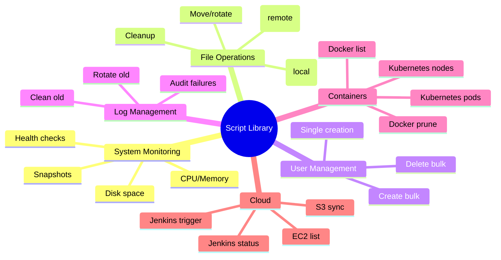

## 1 · The Big Picture

Why write the same backup script three times? Why debug a log-rotation failure in production at 2 a.m. when the solution has already been documented and tested by dozens of teams?

A **script library** is a curated, version-controlled collection of automation routines that solve recurring problems. It is not poetry. It is industrial infrastructure — code that does one job reliably, works under stress, and comes with enough explanation that a colleague can modify it without breaking it at deploy time.

This chapter explains 26 production Bash scripts organised by category: system monitoring, file operations, backups, user provisioning, log management, service orchestration, Docker and Kubernetes operations, and cloud platforms (AWS, Jenkins). Each script includes:

- **What it does** — one sentence
- **The hardened code** — fully copy-pasteable, using shell safety practices from Chapter 17
- **How it works** — line-by-line explanation
- **Real context** — when you would use it, from where, and what success looks like

### Where you will encounter script libraries

| Context | What the library solves | Production reality |
|---|---|---|
| Startup infrastructure | Every new deployment repeats backups, health checks, log rotation; developers waste time reinventing | Git-based playbooks shared across teams, in a `scripts/` subdirectory |
| Mature systems | Fragmented monitoring, gaps in security audits, manual toil on deployment days | Centralised Ansible roles, or a shared library of functions sourced by cron jobs |
| Cloud platforms | Every AWS account needs the same connectivity checks, instance exports, backup triggers | Codified in Lambda functions or container images, versioned alongside infrastructure-as-code |
| Incident response | On-call engineer needs to debug a hung process or disk full at 3 a.m., but the diagnostic tool is in someone's home directory | Library documented and discoverable — `curl https://internal.company/debug-hung-process.sh \| bash` |
| DevOps / SRE teams | Thousands of similar health checks, deployment checks, and rollback routines across different systems | Templated scripts, generated or shared from a central registry |

### Why companies build these libraries

- **Risk reduction** — tested code beats ad hoc fixes. A backup script is also a restore test.
- **Knowledge transfer** — the scripts *are* the runbook. A new hire runs existing scripts, not searches Slack history.
- **Observability and auditability** — every script logs what it did, who asked, when, and the result.
- **Consistency** — all backups use the same retention policy, all health checks use the same thresholds, all logs are rotated the same way.

---

## 2 · Intuition First

Think of a script library as a **filing system for solutions**.

In your personal life, you have one way you back up your laptop, one way you clean your desk, one recipe for coffee. Doing each task manually works fine. But at a company with 200 servers, 50 services, 100 cron jobs, and 10 teams, you have 200 backup routines, 50 health-check routines, and 100 different log-rotation attempts — many of them broken, conflicting, or undocumented.

A library says: **here are the 10 scripts that actually work, tested in production, with clear input/output contracts**. A new service copies them, changes the service name, and gets monitoring and backups for free.

### The three layers of script reuse

```diagram
  ┌─────────────────────────────────────────┐
  │  LAYER 3: Orchestration                 │
  │  (Ansible playbook, Terraform module)   │
  │  "Deploy 5 services"                    │
  └────────────────┬────────────────────────┘
                   │ calls
  ┌────────────────▼────────────────────────┐
  │  LAYER 2: Libraries                     │
  │  (sourced functions, /usr/local/bin)    │
  │  "Restart service X with health check"  │
  └────────────────┬────────────────────────┘
                   │ calls
  ┌────────────────▼────────────────────────┐
  │  LAYER 1: Core utilities                │
  │  (grep, awk, curl, systemctl)           │
  │  "Is process running? Send alert."      │
  └─────────────────────────────────────────┘
```

The scripts in this chapter are **Layer 2** — portable building blocks. Layer 3 (Ansible, Terraform) orchestrates them. Layer 1 (system utilities) is what they build on.

---

## 3 · Technical Definitions

**Script library.** A collection of standalone, reusable shell scripts, each solving one focused problem (backup, monitor, clean, provision), with clear input parameters and predictable exit codes.

**Hardening.** The application of safety practices — `set -euo pipefail`, robust quoting, explicit loop constructs, and debugging-friendly output — to reduce the chance of silent failures or data loss when scripts run under stress (cron, automation, infrequent manual runs).

**Idempotence.** A script that produces the same result when run once or ten times: a backup script should be safe to run daily; a user-creation script should detect existing users and not fail if they already exist.

**Exit codes.** The return status of a script. `0` means success; non-zero means failure. Scripts in a library must return meaningful exit codes so orchestrators (cron, Ansible, Kubernetes) know whether to retry, alert, or proceed to the next step.

---

## 4 · Internal Working

### What happens when an automation library runs

```mermaid
flowchart TB
  subgraph trigger["TRIGGER"]
    cron["cron job"] | manual["manual exec"] | ci["CI/CD pipeline"]
  end
  subgraph lib["LIBRARY SCRIPT"]
    parse["Parse arguments"]
    validate["Validate inputs"]
    execute["Execute task"]
    log["Log outcome"]
    exit_code["Return exit code"]
  end
  subgraph action["ACTION"]
    success["Alert on success"] & failure["Alert on failure"] & retry["Retry or escalate"]
  end
  trigger --> lib
  lib --> action
```

Every script in production runs under the supervision of an automation layer (cron, Kubernetes, a monitoring daemon, or a human). That layer expects:

1. **Predictable behaviour** — same input, same result, every time
2. **Informative output** — a log message that explains what happened
3. **Correct exit code** — `0` if successful, non-zero if not (and different codes for different failure modes if needed)
4. **No silent failures** — a script that silently fails is worse than a script that alerts loudly

### The shell safety pattern from Chapter 17

Every script in this chapter opens with:

```bash
#!/bin/bash
set -euo pipefail
```

**`set -e`** — exit the script if any command exits with a non-zero code. Without this, errors cascade silently.

**`set -u`** — exit if you reference an undefined variable. Without this, typos like `$DESTINATIO` become empty strings and wipe your data.

**`set -o pipefail`** — if any command in a pipeline fails, the pipeline fails. Without this, `cat file | grep pattern | awk ...` succeeds even if `cat` fails.

Below that, **every variable is quoted**: `"$var"`, `"${array[@]}"`, `$(command)` instead of `$var`, `${array[@]}` (unquoted), `$(command)` (sometimes unquoted). This prevents word splitting and glob expansion from turning file names into disaster.

Loops use `while read -r line` instead of `for line in $(cat file)`, avoiding memory blowups and glob issues.

---

## 5 · System Monitoring Scripts

### 5a. System Health Monitor

Checks CPU, memory, and disk usage against thresholds, prints colour-coded alerts, and logs results to a CSV file for trending and alerting.

**What it does.** One pass: read CPU/memory/disk, compare to thresholds, write CSV log, print coloured alerts.

**When to use it.** Run from cron every 5 minutes. Feed the CSV to a dashboard to trend resource usage. Alert when thresholds are exceeded.

```bash
#!/bin/bash
set -euo pipefail

readonly CPU_THRESHOLD=80
readonly MEM_THRESHOLD=80
readonly DISK_THRESHOLD=80
readonly LOG_FILE="${HOME}/system_report.csv"

main() {
  local cpu_usage mem_usage disk_usage cpu_int mem_int
  
  echo "Checking System Health..."
  
  # Get CPU usage (idle + iowait, subtracted from 100)
  cpu_usage=$(top -bn1 | grep "Cpu(s)" | awk '{print $2 + $4}')
  cpu_int=${cpu_usage%.*}  # strip decimal
  
  # Get memory usage
  mem_usage=$(free | grep Mem | awk '{print $3/$2 * 100.0}')
  mem_int=${mem_usage%.*}
  
  # Get disk usage on root partition
  disk_usage=$(df -h / | awk 'NR==2 {print $5}' | sed 's/%//')
  
  # Log to CSV (append)
  {
    echo "$(date '+%Y-%m-%d %H:%M:%S'),CPU:${cpu_int}%,Mem:${mem_int}%,Disk:${disk_usage}%"
  } >> "$LOG_FILE"
  
  # Print alerts in red if thresholds exceeded
  if [[ $cpu_int -ge $CPU_THRESHOLD ]]; then
    echo -e "\033[31mCRITICAL: CPU usage high: ${cpu_int}%\033[0m" >&2
  fi
  
  if [[ $mem_int -ge $MEM_THRESHOLD ]]; then
    echo -e "\033[31mCRITICAL: Memory usage high: ${mem_int}%\033[0m" >&2
  fi
  
  if [[ $disk_usage -ge $DISK_THRESHOLD ]]; then
    echo -e "\033[31mCRITICAL: Disk usage high: ${disk_usage}%\033[0m" >&2
  fi
  
  echo "System Health Check Completed."
}

main "$@"
```

**How it works:**

- Line 3–6: Declare thresholds and log file path as readonly constants.
- Line 9–10: `main()` function isolates variables in a local scope.
- Line 13–14: `top -bn1` runs once without interactive mode; `grep "Cpu(s)"` extracts the CPU line; `awk` sums idle and iowait percentages (used metrics are user + system, so idle + iowait is inverse).
- Line 15: `${var%.*}` removes the decimal part (Bash parameter expansion, not `cut` or `sed`).
- Line 18–19: `free` output: line 2 is memory. `awk '{print $3/$2 * 100.0}'` divides used by total.
- Line 22–23: `df -h /` shows root partition; `awk 'NR==2 {print $5}'` extracts the percentage column; `sed 's/%//'` removes the `%` sign so comparison works numerically.
- Line 26–28: Append a CSV row with timestamp and metrics. Using `{ echo ...; } >> file` atomicity is better than `echo ... >> file` in loops.
- Line 31–39: Each threshold check prints a red alert (`\033[31m` red, `\033[0m` reset) to stderr (`>&2`) because alerts are diagnostic, not output.
- Line 41: Print completion message.
- Line 44: `main "$@"` runs the function, passing any command-line arguments (though this script takes none).

**Output example:**

```console
$ ./system-health-monitor.sh
Checking System Health...
CRITICAL: CPU usage high: 85%
System Health Check Completed.
$ cat ~/system_report.csv
2026-08-02 03:15:20,CPU:45%,Mem:72%,Disk:68%
2026-08-02 03:20:21,CPU:85%,Mem:89%,Disk:72%
```

**Production context:** Run from a `*/5 * * * * /usr/local/bin/system-health-monitor.sh >> /var/log/health.log 2>&1` cron job. Parse the CSV with a Prometheus exporter or feed it to Grafana. Alert if CPU exceeds threshold for 3+ checks in a row (avoid false alarms on spikes).

---

### 5b. Quick Disk Space Alert

A lightweight, single-purpose disk check. Useful when you want a fast, silent success and only print output if there is a problem.

**What it does.** Check if disk usage exceeds threshold. Exit 0 if OK, exit 1 if high. Print alert only if high.

```bash
#!/bin/bash
set -euo pipefail

readonly THRESHOLD=80
readonly PARTITION="${1:?Partition name required (e.g., /)}"

main() {
  local disk_usage
  
  disk_usage=$(df -h "$PARTITION" | awk 'NR==2 {print $5}' | sed 's/%//')
  
  if [[ $disk_usage -ge $THRESHOLD ]]; then
    echo "ALERT: Disk usage on $PARTITION is ${disk_usage}% (threshold: ${THRESHOLD}%)" >&2
    return 1
  fi
  
  return 0
}

main "$@"
```

**How it works:**

- Line 5: `${1:?...}` extracts the first argument (partition name like `/` or `/home`), or exits with the given error message if missing. This is better than `$1` with a later check.
- Line 10: Same `df | awk` pattern as before.
- Line 12–14: If threshold exceeded, print to stderr and return exit code 1. Exit code 1 signals failure to cron or orchestrators.
- Line 16: Return 0 (success) if under threshold.

**Production context:** Used in a monitoring dashboard (`*/10 * * * * /usr/local/bin/disk-alert.sh / || curl -X POST http://alerts/notify`). Can be chained: `disk-alert.sh / && disk-alert.sh /home && echo "All partitions OK"`.

---

### 5c. System Snapshot

Captures uptime, CPU, memory, and disk in one report. Useful for one-off diagnostics or dashboards that poll every 30 seconds.

```bash
#!/bin/bash
set -euo pipefail

main() {
  echo "=== System Snapshot at $(date '+%Y-%m-%d %H:%M:%S') ==="
  
  echo -e "\nUptime:"
  uptime
  
  echo -e "\nCPU Usage:"
  top -bn1 | grep "Cpu(s)"
  
  echo -e "\nMemory Usage (MB):"
  free -m
  
  echo -e "\nDisk Space (all partitions):"
  df -h
}

main "$@"
```

**Output example:**

```console
$ ./system-snapshot.sh
=== System Snapshot at 2026-08-02 03:25:30 ===

Uptime:
 03:25:30 up 45 days, 12:34,  1 user,  load average: 0.45, 0.38, 0.42

CPU Usage:
%Cpu(s):  15.2 us,  3.1 sy,  0.0 ni, 81.5 id,  0.2 wa,  0.0 hi,  0.0 si,  0.0 st

Memory Usage (MB):
              total        used        free      shared  buff/cache   available
Mem:          16000        8234        4123         256        3643       7456
Swap:         8000        1200        6800

Disk Space (all partitions):
Filesystem     Size  Used Avail Use% Mounted on
/dev/sda1       50G   35G   15G  70% /
/dev/sda2      100G   42G   58G  42% /home
```

**Production context:** Call from a dashboard script that needs a full system overview; the script produces both human-readable output and can be parsed by `grep` to extract fields for monitoring. Useful for ad hoc diagnostics: `ssh prod-server system-snapshot.sh`.

---

### 5d. Finding the Largest Files

Scans the filesystem (or a subtree) and ranks files by size. Useful for "the disk is full" incidents.

```bash
#!/bin/bash
set -euo pipefail

readonly START_PATH="${1:-.}"
readonly LIMIT="${2:-10}"

main() {
  echo "Top ${LIMIT} largest files in ${START_PATH}:"
  echo ""
  
  # -type f: regular files only
  # -exec du -h: size in human format
  # sort -rh: reverse sort by human numbers
  # head -n N: first N lines
  
  find "$START_PATH" -type f -exec du -h {} + 2>/dev/null \
    | sort -rh \
    | head -n "$LIMIT" \
    | awk '{print $2, "—", $1}'  # swap columns for readability
}

main "$@"
```

**How it works:**

- Line 5: `${1:-.}` — first arg is search path, default to current directory `.`
- Line 6: Second arg is limit (how many files to show), default 10.
- Line 13: `find ... -exec du -h {} +` — find all regular files, get size of each. The `+` batches commands to avoid starting `du` for each file (unlike `\;`).
- Line 14: `sort -rh` — reverse sort by "human" numbers (50G > 1G, not alphabetical).
- Line 15: `head -n` — limit to N results.
- Line 16: `awk` swaps columns to make the output more readable.

**Output example:**

```console
$ ./largest-files.sh /home 5
Top 5 largest files in /home:

/home/archive/2025_backup.tar.gz — 25G
/home/videos/movie.mkv — 8.5G
/home/docker/image.tar — 4.2G
/home/archive/logs-2024.zip — 3.1G
/home/documents/database.db — 1.8G
```

**Production context:** When a on-call engineer reports "disk full", run `ssh prod-server largest-files.sh / 20` to identify what to archive or delete.

---

### 5e. Active SSH Sessions

Lists who is currently logged in (useful for audits or to check if a server is in use before maintenance).

```bash
#!/bin/bash
set -euo pipefail

main() {
  echo "Active SSH/terminal sessions:"
  echo ""
  
  # 'who' shows login sessions
  # grep "pts" filters for pseudo-terminals (SSH, local terminals)
  who | grep "pts" || echo "No active SSH sessions."
}

main "$@"
```

**Output example:**

```console
$ ./active-ssh-sessions.sh
Active SSH/terminal sessions:

alice  pts/0    2026-08-02 03:05   (192.168.1.50)
bob    pts/1    2026-08-02 03:18   (192.168.1.60)
```

**Production context:** Run before rebooting or applying maintenance to check if anyone is logged in. Part of a pre-maintenance checklist.

---

## 6 · File Operations & Backup Scripts

### 6a. Workspace Initializer

Sets up a development directory structure with dummy files for testing. Useful in CI/CD pipelines or local setup scripts.

```bash
#!/bin/bash
set -euo pipefail

readonly WORKSPACE_DIR="${1:-workspace}"
readonly FILE_COUNT="${2:-10}"

main() {
  echo "Creating workspace at ${WORKSPACE_DIR}..."
  
  mkdir -p "$WORKSPACE_DIR"
  cd "$WORKSPACE_DIR"
  
  # Create dummy test files
  local i
  for ((i = 1; i <= FILE_COUNT; i++)); do
    touch "${i}.file.txt"
    echo "Sample content for file ${i}" >> "${i}.file.txt"
  done
  
  echo "Workspace created with ${FILE_COUNT} test files in ${WORKSPACE_DIR}."
}

main "$@"
```

**How it works:**

- Line 5–6: Accept workspace directory and file count as arguments, with defaults.
- Line 11: Use C-style for loop `for ((i=1; i<=N; i++))` for numeric iteration — cleaner than `seq 1 N | while read i`.
- Line 13: Create file with a predictable name.
- Line 14: Add sample content so files are not empty (useful for testing archiving, compression, etc.).

**Production context:** Run at the start of a CI pipeline to set up test data, or in a local script that sets up a sandbox for experimentation.

---

### 6b. Smart File Mover

Interactively moves all `.txt` files from one directory to another, with validation and error handling.

```bash
#!/bin/bash
set -euo pipefail

main() {
  local src_path dest_path file_count
  
  # Ask for source directory
  read -rp "Enter the absolute path of the SOURCE directory: " src_path
  
  # Validate source exists and is a directory
  if [[ ! -d "$src_path" ]]; then
    echo "ERROR: Source directory '$src_path' does not exist." >&2
    return 1
  fi
  
  # Ask for destination directory
  read -rp "Enter the absolute path of the DESTINATION directory: " dest_path
  
  # Create destination if it doesn't exist
  if [[ ! -d "$dest_path" ]]; then
    echo "Destination does not exist. Creating: $dest_path"
    mkdir -p "$dest_path" || {
      echo "ERROR: Failed to create destination directory." >&2
      return 1
    }
  fi
  
  # Count .txt files using nullglob to avoid glob expansion
  shopt -s nullglob
  local files=("$src_path"/*.txt)
  local file_count=${#files[@]}
  
  if [[ $file_count -eq 0 ]]; then
    echo "No .txt files found in '$src_path'."
    shopt -u nullglob
    return 0
  fi
  
  # Move all .txt files
  echo "Moving ${file_count} .txt file(s) from $src_path to $dest_path..."
  mv "$src_path"/*.txt "$dest_path" || {
    echo "ERROR: Failed to move files." >&2
    shopt -u nullglob
    return 1
  }
  
  echo "SUCCESS: Moved ${file_count} .txt files."
  shopt -u nullglob
  return 0
}

main "$@"
```

**How it works:**

- Line 9–14: Read source path and validate. `read -rp "prompt"` is clearer than `read -p "prompt"` (raw mode, preserves backslashes).
- Line 18–26: Create destination if needed. Use `|| { ... }` to handle errors immediately.
- Line 29: `shopt -s nullglob` — if no `.txt` files exist, the glob expands to nothing instead of the literal string `*.txt`. Without this, `mv *.txt /dest` would try to move a file named literally `*.txt`.
- Line 30: Use an array `files=(...)` to count without shelling out to `ls`.
- Line 32–36: If no files, exit cleanly with code 0 (not an error).
- Line 40: Move all files. The glob is safe now because of nullglob.
- Line 44–45: Always disable nullglob after use, to restore normal shell behavior.

**Production context:** Part of a nightly log rotation or archive script. Can be scheduled to move old files to a separate partition: `cron: smart-file-mover.sh /var/log/old /archive/logs`.

---

### 6c. Remote Backup and Transfer

Archives a directory as a ZIP file and transfers it to a remote server over SCP. Requires passwordless SSH keys.

```bash
#!/bin/bash
set -euo pipefail

main() {
  local src_path zip_name remote_user remote_ip remote_path
  
  # 1. Ask for source path
  read -rp "Enter the folder/file path to backup: " src_path
  
  if [[ ! -e "$src_path" ]]; then
    echo "ERROR: Path '$src_path' does not exist." >&2
    return 1
  fi
  
  # Generate timestamped backup filename
  zip_name="backup_$(date +%Y%m%d_%H%M%S).zip"
  
  echo "Creating archive: $zip_name"
  if ! zip -rq "$zip_name" "$src_path"; then
    echo "ERROR: Failed to create zip archive." >&2
    return 1
  fi
  echo "Zip created successfully."
  
  # 2. Ask for remote details
  echo ""
  echo "--- Remote Destination Details ---"
  read -rp "Enter Remote Username: " remote_user
  read -rp "Enter Remote IP: " remote_ip
  read -rp "Enter Remote Destination Path: " remote_path
  
  # 3. Transfer via SCP
  echo "Transferring to ${remote_user}@${remote_ip}:${remote_path}"
  if scp "$zip_name" "${remote_user}@${remote_ip}:${remote_path}"; then
    echo "SUCCESS: Backup transferred."
    
    # Optionally clean up local copy
    read -rp "Remove local zip file? (y/n): " cleanup
    if [[ "$cleanup" == "y" ]]; then
      rm -f "$zip_name"
      echo "Local backup file removed."
    fi
    return 0
  else
    echo "ERROR: Transfer failed." >&2
    return 1
  fi
}

main "$@"
```

**How it works:**

- Line 8–12: Validate source path exists (file or directory).
- Line 15: Generate a timestamped filename using `date +%Y%m%d_%H%M%S`.
- Line 18–22: Create ZIP file. The `if !` construct (not command) is clearer than `if [ $? -ne 0 ]`.
- Line 27–30: Prompt for remote details.
- Line 33: SCP command with `${var}` quoting ensures spaces in paths don't break the transfer.
- Line 34–40: On success, optionally delete the local copy to save disk.
- Line 41–43: Return error code if transfer fails.

**Production context:** Run as a daily cron job: `0 2 * * * /usr/local/bin/remote-backup.sh`. The script is interactive; in automation, pre-populate variables from a config file:

```bash
# At the top:
readonly BACKUP_SOURCE="${BACKUP_SOURCE:-/var/www/html}"
readonly REMOTE_USER="${REMOTE_USER:-backups}"
readonly REMOTE_IP="${REMOTE_IP:-backup.company.com}"
readonly REMOTE_PATH="${REMOTE_PATH:-/backups/prod}"
```

Then source the config: `. /etc/backup.conf && /usr/local/bin/remote-backup.sh`.

---

### 6d. Local Backup and Restore

Interactive menu to back up a directory and restore from a chosen archive.

```bash
#!/bin/bash
set -euo pipefail

readonly BACKUP_DIR="${1:-/backup}"
readonly SOURCE_DIR="${2:-/var/www/html}"

backup() {
  local backup_file
  
  backup_file="${BACKUP_DIR}/backup-$(date +'%F-%H-%M-%S').tar.gz"
  
  echo "Starting backup of $SOURCE_DIR..."
  
  if ! mkdir -p "$BACKUP_DIR"; then
    echo "ERROR: Cannot create backup directory." >&2
    return 1
  fi
  
  if tar -czf "$backup_file" "$SOURCE_DIR"; then
    echo "SUCCESS: Backup completed at $backup_file"
    ls -lh "$backup_file"
    return 0
  else
    echo "ERROR: Backup failed." >&2
    return 1
  fi
}

restore() {
  local file_to_restore
  
  echo "Available backups:"
  
  if ! ls -lh "$BACKUP_DIR"/*.tar.gz 2>/dev/null; then
    echo "ERROR: No backups found in $BACKUP_DIR" >&2
    return 1
  fi
  
  echo ""
  read -rp "Enter backup filename to restore (e.g., backup-2026-08-02-03-15-30.tar.gz): " file_to_restore
  
  if [[ ! -f "$BACKUP_DIR/$file_to_restore" ]]; then
    echo "ERROR: Backup file not found: $BACKUP_DIR/$file_to_restore" >&2
    return 1
  fi
  
  echo "Restoring from $file_to_restore (this will overwrite existing files)..."
  read -rp "Are you sure? (yes/no): " confirm
  
  if [[ "$confirm" != "yes" ]]; then
    echo "Restore cancelled."
    return 0
  fi
  
  if tar -xzf "$BACKUP_DIR/$file_to_restore" -C /; then
    echo "SUCCESS: Restore completed."
    return 0
  else
    echo "ERROR: Restore failed." >&2
    return 1
  fi
}

main() {
  echo "Backup and Restore Utility"
  echo "1. Backup"
  echo "2. Restore"
  echo ""
  
  read -rp "Choose an option (1 or 2): " choice
  
  case "$choice" in
    1) backup ;;
    2) restore ;;
    *) 
      echo "Invalid option."
      return 1
      ;;
  esac
}

main "$@"
```

**How it works:**

- Line 8–9: Backup function uses a timestamp with date (`%F` = YYYY-MM-DD, `%H-%M-%S` = HH-MM-SS).
- Line 18: `tar -czf` creates a gzip-compressed archive.
- Line 29–35: Restore lists existing backups; `2>/dev/null` suppresses errors if directory is empty.
- Line 41–46: Confirm the file exists before restoring.
- Line 49–51: Double-check before overwriting (critical for safety).
- Line 53: `tar -xzf ... -C /` extracts to root (restores absolute paths). Use `-C /tmp` for testing.
- Line 63–70: Main menu with case statement for readability.

**Production context:** For critical systems (databases, web roots), automate this and rotate backups:

```bash
# Daily backup script
BACKUP_DIR=/backup BACKUP_SOURCE=/var/www/html /usr/local/bin/backup-restore.sh <<< "1"

# Weekly cleanup (keep last 4 backups)
cd /backup && ls -1t backup-*.tar.gz | tail -n +5 | xargs rm -f
```

---

## 7 · User & Log Management Scripts

### 7a. Bulk User Creation

Reads usernames from a file, creates accounts, sets temporary passwords, and forces a password reset on first login. Logs all actions.

```bash
#!/bin/bash
set -euo pipefail

readonly USER_FILE="${1:-users.txt}"
readonly LOG_FILE="/var/log/user_provision.log"

main() {
  # Check if running as root
  if [[ $EUID -ne 0 ]]; then
    echo "ERROR: This script must be run as root (or with sudo)." >&2
    return 1
  fi
  
  # Check if user file exists
  if [[ ! -f "$USER_FILE" ]]; then
    echo "ERROR: User file not found: $USER_FILE" >&2
    return 1
  fi
  
  local line user_count=0
  
  # Read each line from the user file
  while IFS= read -r line || [[ -n "$line" ]]; do
    # Skip empty lines and comments
    [[ -z "$line" ]] && continue
    [[ "$line" =~ ^#.* ]] && continue
    
    # Extract username (first field, space-separated or colon-separated)
    local username="${line%% *}"
    [[ -z "$username" ]] && continue
    
    # Check if user already exists
    if id "$username" &>/dev/null; then
      echo "User '$username' already exists. Skipping."
      continue
    fi
    
    # Create user with home directory and bash shell
    if useradd -m -s /bin/bash "$username"; then
      # Set temporary password
      echo "${username}:TempPassword@2026" | chpasswd || {
        echo "WARNING: Failed to set password for $username" >&2
        continue
      }
      
      # Force password change on first login
      if chage -d 0 "$username"; then
        echo "[$(date '+%Y-%m-%d %H:%M:%S')] Created user: $username (password change required)" | tee -a "$LOG_FILE"
        ((user_count++))
      else
        echo "WARNING: Failed to force password change for $username" >&2
      fi
    else
      echo "ERROR: Failed to create user $username" >&2
    fi
  done < "$USER_FILE"
  
  echo "Successfully created ${user_count} user(s)."
  return 0
}

main "$@"
```

**How it works:**

- Line 8–11: Check for root privileges. `$EUID -ne 0` is cleaner than `$(id -u)`.
- Line 23: `while IFS= read -r line || [[ -n "$line" ]]` — read the file line by line. The `|| [[ -n "$line" ]]` handles the case where the last line has no newline.
- Line 25–26: Skip empty lines and comments (lines starting with `#`).
- Line 29: Extract username (first whitespace-delimited field). The pattern `${var%% *}` removes everything from the first space onward.
- Line 32–34: Check if user exists using `id` (no need to parse `/etc/passwd`).
- Line 37–47: Create user, set password, force password change on first login. Log each success.
- Line 49–51: Count successful creations and report.

**Expected input file (`users.txt`):**

```
alice
bob
charlie  # Full name or other metadata in comments
dave
# admin_user  # This line is skipped
```

**Production context:** Used for on-boarding new team members or automated service-account provisioning. Always set a **temporary** password and force a change on first login — never hardcode production credentials in scripts.

---

### 7b. Bulk User Deletion

Removes users and their home directories. Destructive; verify the user list before running.

```bash
#!/bin/bash
set -euo pipefail

readonly USER_FILE="${1:-users.txt}"
readonly LOG_FILE="/var/log/user_provision.log"

main() {
  # Check if running as root
  if [[ $EUID -ne 0 ]]; then
    echo "ERROR: This script must be run as root (or with sudo)." >&2
    return 1
  fi
  
  if [[ ! -f "$USER_FILE" ]]; then
    echo "ERROR: User file not found: $USER_FILE" >&2
    return 1
  fi
  
  echo "WARNING: This script will DELETE users and their home directories."
  echo "Users to delete:"
  grep -v '^#' "$USER_FILE" | grep -v '^\s*$' || true
  echo ""
  read -rp "Continue? (yes/no): " confirm
  
  if [[ "$confirm" != "yes" ]]; then
    echo "Deletion cancelled."
    return 0
  fi
  
  local line user_count=0
  
  while IFS= read -r line || [[ -n "$line" ]]; do
    [[ -z "$line" ]] && continue
    [[ "$line" =~ ^#.* ]] && continue
    
    local username="${line%% *}"
    [[ -z "$username" ]] && continue
    
    if id "$username" &>/dev/null; then
      if userdel -r "$username"; then
        echo "[$(date '+%Y-%m-%d %H:%M:%S')] Deleted user and home directory: $username" | tee -a "$LOG_FILE"
        ((user_count++))
      else
        echo "ERROR: Failed to delete user $username" >&2
      fi
    else
      echo "User '$username' does not exist."
    fi
  done < "$USER_FILE"
  
  echo "Successfully deleted ${user_count} user(s)."
  return 0
}

main "$@"
```

**How it works:**

- Line 20–25: Safety confirmation — show users to be deleted and ask for explicit "yes" confirmation.
- Line 39: `userdel -r` removes the user and their home directory (`-r` flag).
- Line 40: Log to a central audit log for compliance.

> [!DANGER]
> **This script is destructive.** Always:
> 1. Verify the user list before running.
> 2. Test on a non-production system first.
> 3. Keep an audit log of who was deleted and when.
> 4. Backup home directories if there is any chance they are needed later.

**Production context:** Used during off-boarding (rare, scripted with 2FA or approval gates). More commonly, disable accounts instead of deleting them:

```bash
# Better approach for most cases
usermod -L "$username"  # Lock password
usermod -s /usr/sbin/nologin "$username"  # Disable login shell
```

---

### 7c. Quick Single User Creation

Fast, interactive user creation for ad hoc testing or one-off provisioning.

```bash
#!/bin/bash
set -euo pipefail

main() {
  if [[ $EUID -ne 0 ]]; then
    echo "ERROR: This script must be run as root." >&2
    return 1
  fi
  
  read -rp "Enter username to create: " username
  
  if [[ -z "$username" ]]; then
    echo "ERROR: Username cannot be empty." >&2
    return 1
  fi
  
  if id "$username" &>/dev/null; then
    echo "ERROR: User '$username' already exists." >&2
    return 1
  fi
  
  local temp_password="TempPass@$(date +%s)"
  
  if useradd -m -s /bin/bash "$username"; then
    echo "$username:$temp_password" | chpasswd
    echo "User created: $username"
    echo "Temporary password: $temp_password"
    echo "User MUST change password on first login."
    return 0
  else
    echo "ERROR: Failed to create user." >&2
    return 1
  fi
}

main "$@"
```

**Production context:** Quick provisioning in a pinch. For production, always use the bulk creation script with an approval workflow.

---

### 7d. Log Auditor and Rotator

Scans auth.log for failed login attempts, identifies suspicious IPs, writes them to a blacklist, then archives and deletes old logs.

```bash
#!/bin/bash
set -euo pipefail

readonly LOG_DIR="/var/log"
readonly ARCHIVE_DIR="./log_archive"
readonly BLACKLIST_FILE="./blacklist.txt"
readonly FAILED_THRESHOLD=3

main() {
  mkdir -p "$ARCHIVE_DIR"
  
  echo "--- Starting Security Audit and Log Rotation ---"
  echo ""
  
  # 1. Find failed login attempts and identify suspicious IPs
  echo "Scanning for failed login attempts (> ${FAILED_THRESHOLD} per IP)..."
  
  if [[ -f "$LOG_DIR/auth.log" ]]; then
    # Extract source IPs from failed login attempts
    # Format: "Failed password for root from 192.168.1.50 port..."
    grep -F "Failed password" "$LOG_DIR/auth.log" 2>/dev/null | \
      awk '{for (i=1; i<=NF; i++) if ($i == "from") print $(i+1)}' | \
      sort | uniq -c | \
      awk -v threshold="$FAILED_THRESHOLD" '$1 > threshold {print $2}' > "$BLACKLIST_FILE" || true
    
    local threat_count
    threat_count=$(wc -l < "$BLACKLIST_FILE")
    echo "Threats identified: ${threat_count} suspicious IP(s) written to ${BLACKLIST_FILE}"
  else
    echo "WARNING: $LOG_DIR/auth.log not found."
  fi
  
  echo ""
  echo "--- Rotating Old Logs (> 7 days) ---"
  
  # 2. Archive logs older than 7 days
  local archived_count=0
  while IFS= read -r -d '' logfile; do
    echo "Archiving: $logfile"
    tar -rf "$ARCHIVE_DIR/old_logs_$(date +%F).tar" "$logfile" || {
      echo "WARNING: Failed to archive $logfile" >&2
    }
    ((archived_count++))
  done < <(find "$LOG_DIR" -name "*.log" -mtime +7 -print0)
  
  echo "Archived ${archived_count} log file(s)."
  
  # 3. Delete the original files
  if find "$LOG_DIR" -name "*.log" -mtime +7 -delete; then
    echo "Old logs deleted. Storage cleared."
  else
    echo "WARNING: Failed to delete some old logs." >&2
  fi
  
  echo "--- Log Rotation Complete ---"
  return 0
}

main "$@"
```

**How it works:**

- Line 17–23: Parse `auth.log` to extract IPs of failed login attempts. `awk '{for (i=1; i<=NF; i++) if ($i == "from") print $(i+1)}'` iterates through fields and prints the one after "from".
- Line 24: `sort | uniq -c` counts occurrences of each IP.
- Line 25: Filter to IPs with more than `$FAILED_THRESHOLD` attempts.
- Line 35: `find ... -print0` outputs null-terminated filenames, used with `< <(...)` to safely handle files with spaces.
- Line 37: Append to tar archive (non-destructive). Compress later: `gzip "$ARCHIVE_DIR/old_logs.tar"`.
- Line 44: Delete original files after archiving (cleanup is critical to free space).

**Production context:** Run weekly via cron:

```bash
0 2 * * 0 /usr/local/bin/log-auditor.sh >> /var/log/audit.log 2>&1
```

Alert on suspicious IPs found in blacklist.txt. Optionally feed to `fail2ban` for automatic blocking.

---

### 7e. Automated Log Cleanup

A simpler cleanup-only variant (no archiving). Useful when logs are ephemeral or backed up separately.

```bash
#!/bin/bash
set -euo pipefail

readonly LOG_DIR="${1:-/var/log}"
readonly DAYS="${2:-30}"

main() {
  echo "Cleaning logs older than ${DAYS} days in ${LOG_DIR}..."
  
  local deleted_count=0
  while IFS= read -r -d '' logfile; do
    echo "Deleting: $logfile"
    if rm -f "$logfile"; then
      ((deleted_count++))
    else
      echo "WARNING: Failed to delete $logfile" >&2
    fi
  done < <(find "$LOG_DIR" -type f -name "*.log" -mtime +"$DAYS" -print0)
  
  echo "Deleted ${deleted_count} log file(s). Cleanup completed."
  return 0
}

main "$@"
```

**Production context:** Run nightly for systems with high log volume. Adjust `DAYS` based on retention requirements (corporate policy, compliance, auditing).

---

## 8 · Service & Container Management Scripts

### 8a. Service Health Check and Auto-Restart

Checks if a critical service is running; if not, restarts it and logs the event.

```bash
#!/bin/bash
set -euo pipefail

readonly SERVICE="${1:?Service name required (e.g., nginx)}"
readonly MAX_RESTARTS="${2:-3}"
readonly RESTART_LOG="/var/log/service_restarts.log"

main() {
  local restart_count line
  restart_count=0
  
  # Count recent restarts (today)
  if [[ -f "$RESTART_LOG" ]]; then
    today=$(date +%Y-%m-%d)
    restart_count=$(grep "$SERVICE.*$today" "$RESTART_LOG" | wc -l || true)
  fi
  
  if systemctl is-active --quiet "$SERVICE"; then
    echo "OK: $SERVICE is running."
    return 0
  else
    echo "ALERT: $SERVICE is not running."
    
    # Prevent restart loops (stop if restarted too many times today)
    if [[ $restart_count -ge $MAX_RESTARTS ]]; then
      echo "ERROR: $SERVICE has been restarted ${restart_count} times today. Giving up." >&2
      echo "[$(date '+%Y-%m-%d %H:%M:%S')] $SERVICE restart limit exceeded (${restart_count} restarts)" >> "$RESTART_LOG"
      return 1
    fi
    
    echo "Attempting to restart $SERVICE..."
    if systemctl restart "$SERVICE"; then
      echo "[$(date '+%Y-%m-%d %H:%M:%S')] $SERVICE restarted (restart ${restart_count})" >> "$RESTART_LOG"
      echo "SUCCESS: $SERVICE restarted."
      return 0
    else
      echo "ERROR: Failed to restart $SERVICE." >&2
      echo "[$(date '+%Y-%m-%d %H:%M:%S')] $SERVICE restart FAILED" >> "$RESTART_LOG"
      return 1
    fi
  fi
}

main "$@"
```

**How it works:**

- Line 8–10: Accept service name as an argument, and optional max restarts per day (prevent restart loops).
- Line 18: `systemctl is-active --quiet` exits 0 if the service is active, non-zero if not.
- Line 26–30: Count how many times this service was restarted today. If it exceeds `MAX_RESTARTS`, give up and alert (to avoid a restart loop that wastes resources).
- Line 32–37: Attempt restart and log the result.

**Production context:** Run from cron every 5 minutes:

```bash
*/5 * * * * /usr/local/bin/service-health.sh nginx 3 >> /var/log/health.log 2>&1
```

Pair with a monitoring alert: if `systemctl is-active nginx` ever returns false, trigger an alert to on-call.

---

### 8b. Listing Running Docker Containers

Lists all running containers with useful metadata.

```bash
#!/bin/bash
set -euo pipefail

main() {
  echo "Running Docker containers:"
  echo ""
  
  # Suppress errors if Docker is not running or no containers exist
  docker ps --format "table {{.ID}}\t{{.Image}}\t{{.Names}}\t{{.Status}}\t{{.Ports}}" || {
    echo "ERROR: Unable to list Docker containers. Is Docker running?" >&2
    return 1
  }
}

main "$@"
```

**Output example:**

```console
$ ./docker-list.sh
Running Docker containers:

CONTAINER ID   IMAGE                     NAMES            STATUS              PORTS
a1b2c3d4e5f6   nginx:latest              nginx_prod       Up 2 days           0.0.0.0:80->80/tcp
f6e5d4c3b2a1   postgres:14               postgres_db      Up 1 day            5432/tcp
```

**Production context:** Quick status check in dashboards or before deployments. Useful in CI/CD pipelines to confirm all services are running.

---

### 8c. Pruning Unused Docker Images

Removes all untagged and unused Docker images to free disk space.

```bash
#!/bin/bash
set -euo pipefail

main() {
  echo "Deleting unused Docker images..."
  
  # Dry run first (show what will be deleted)
  local image_count
  image_count=$(docker images -q --no-trunc -f "dangling=true" | wc -l || echo 0)
  
  if [[ $image_count -eq 0 ]]; then
    echo "No dangling images to remove."
    return 0
  fi
  
  echo "Found ${image_count} dangling image(s)."
  read -rp "Delete them? (yes/no): " confirm
  
  if [[ "$confirm" != "yes" ]]; then
    echo "Cancelled."
    return 0
  fi
  
  # Remove dangling images
  if docker image prune -a -f --filter "until=24h"; then
    echo "Cleanup completed."
    return 0
  else
    echo "ERROR: Cleanup failed." >&2
    return 1
  fi
}

main "$@"
```

**How it works:**

- Line 8: `docker images -q --no-trunc -f "dangling=true"` lists untagged (dangling) image IDs.
- Line 16–19: Confirmation prompt before deletion (images are hard to recover).
- Line 23: `docker image prune -a -f --filter "until=24h"` removes images that have not been used in the last 24 hours.

**Production context:** Run weekly during maintenance windows: `0 3 * * 0 /usr/local/bin/docker-prune.sh <<< "yes"` (confirm via stdin).

---

### 8d. Backing Up Docker Containers and Images

Commits each running container to an image and saves all images as tar archives for portability.

```bash
#!/bin/bash
set -euo pipefail

readonly BACKUP_DIR="${1:-/backup/docker}"

main() {
  mkdir -p "$BACKUP_DIR"
  
  echo "Backing up Docker containers and images..."
  echo ""
  
  # 1. Commit each running container to an image
  echo "--- Committing running containers ---"
  local container_count=0
  while IFS= read -r container_id; do
    [[ -z "$container_id" ]] && continue
    
    local container_name backup_image
    container_name=$(docker inspect -f '{{.Name}}' "$container_id" | sed 's|^/||')
    backup_image="${container_name}-backup-$(date +%s)"
    
    echo "Committing container $container_id as $backup_image..."
    if docker commit "$container_id" "$backup_image"; then
      ((container_count++))
    else
      echo "WARNING: Failed to commit $container_id" >&2
    fi
  done < <(docker ps -q 2>/dev/null || echo "")
  
  echo "Committed ${container_count} container(s)."
  echo ""
  
  # 2. Save all images as tar archives
  echo "--- Saving all Docker images ---"
  local image_count=0
  while IFS= read -r image_id; do
    [[ -z "$image_id" ]] && continue
    
    local image_name
    image_name=$(docker inspect -f '{{.RepoTags}}' "$image_id" | tr -d '[]' | sed "s/ .*//" | tr '/:' '-')
    [[ "$image_name" == "<nil>" ]] && image_name="$image_id"
    
    local tar_file="$BACKUP_DIR/${image_name}.tar"
    echo "Saving image $image_name to $tar_file..."
    
    if docker save -o "$tar_file" "$image_id"; then
      ((image_count++))
    else
      echo "WARNING: Failed to save image $image_id" >&2
    fi
  done < <(docker images -q 2>/dev/null || echo "")
  
  echo "Saved ${image_count} image(s)."
  echo ""
  echo "Backup completed. Total size:"
  du -sh "$BACKUP_DIR"
}

main "$@"
```

**How it works:**

- Line 15–29: Loop through running containers (using `docker ps -q`), commit each to an image with a timestamped name, and save the ID.
- Line 19: `docker inspect -f '{{.Name}}'` gets the container name; `sed 's|^/||'` removes the leading `/`.
- Line 33–49: Loop through all images, save each as a tar file.
- Line 37: `tr '/:' '-'` sanitizes image names (remove colons and slashes, which are invalid in filenames).

**Production context:** Run before major cluster upgrades or maintenance. Restore a specific image with `docker load -i /backup/docker/image-name.tar`.

---

### 8e. Kubernetes Pod Health Check

Reports any pod not in the Running state for a given namespace.

```bash
#!/bin/bash
set -euo pipefail

readonly NAMESPACE="${1:-default}"

main() {
  echo "Checking Kubernetes Pod Health in namespace: $NAMESPACE"
  echo ""
  
  # Get all pods, filter for non-Running status
  if kubectl get pods -n "$NAMESPACE" --no-headers 2>/dev/null | awk '$3 != "Running" {print "Pod " $1 " is in state " $3}'; then
    echo ""
    echo "Health check completed."
    return 0
  else
    echo "ERROR: Unable to query pods. Is Kubernetes available?" >&2
    return 1
  fi
}

main "$@"
```

**Output example:**

```console
$ ./k8s-pod-health.sh production
Checking Kubernetes Pod Health in namespace: production

Pod nginx-abc123 is in state Running
Pod postgres-xyz789 is in state CrashLoopBackOff
Pod redis-def456 is in state Pending

Health check completed.
```

**Production context:** Run from a monitoring agent or as part of a pre-deployment checklist. Combine with alerting:

```bash
./k8s-pod-health.sh production | grep -v "Running" && alert "Non-running pods detected"
```

---

### 8f. Kubernetes Node Status Check

Lists all nodes and highlights any not in "Ready" state.

```bash
#!/bin/bash
set -euo pipefail

main() {
  echo "Checking Kubernetes Node Status..."
  echo ""
  
  # Get all nodes; grep inverts to show non-Ready nodes
  if kubectl get nodes 2>/dev/null; then
    echo ""
    echo "Nodes NOT in Ready state:"
    kubectl get nodes 2>/dev/null | grep -v "Ready" || echo "All nodes are Ready."
    return 0
  else
    echo "ERROR: Unable to query nodes. Is Kubernetes available?" >&2
    return 1
  fi
}

main "$@"
```

**Production context:** Part of cluster health dashboards. Alert if any node is NotReady.

---

### 8g. Restarting All Pods in a Namespace

Force-deletes all pods in the target namespace so they are recreated by their controllers (Deployments, StatefulSets, DaemonSets).

```bash
#!/bin/bash
set -euo pipefail

readonly NAMESPACE="${1:?Namespace required (e.g., production)}"

main() {
  echo "WARNING: This will delete ALL pods in namespace '$NAMESPACE'."
  echo "Pods will be recreated by their controllers (if managed)."
  echo ""
  read -rp "Continue? (yes/no): " confirm
  
  if [[ "$confirm" != "yes" ]]; then
    echo "Cancelled."
    return 0
  fi
  
  echo "Deleting all pods in $NAMESPACE..."
  
  if kubectl delete pods --all -n "$NAMESPACE" --grace-period=0 --force 2>&1; then
    echo "SUCCESS: All pods in $NAMESPACE have been deleted and will be recreated."
    return 0
  else
    echo "ERROR: Failed to delete pods." >&2
    return 1
  fi
}

main "$@"
```

> [!DANGER]
> This operation **restarts all services** in the namespace. Any in-flight requests will be interrupted. Use only during maintenance windows or as part of a controlled rollout.

**Production context:** Used to restart a misbehaving namespace without affecting other clusters. Common after a configuration update.

---

### 8h. Live Pod Monitor

Continuously streams pod status changes (equivalent to `kubectl get pods --watch`).

```bash
#!/bin/bash
set -euo pipefail

readonly NAMESPACE="${1:-default}"

main() {
  echo "Monitoring pods in namespace: $NAMESPACE (press Ctrl+C to stop)"
  echo ""
  
  if kubectl get pods -n "$NAMESPACE" --watch 2>/dev/null; then
    return 0
  else
    echo "ERROR: Unable to monitor pods." >&2
    return 1
  fi
}

main "$@"
```

**Production context:** Open this in a terminal during a rolling deployment to watch pod churn in real-time.

---

## 9 · Cloud & CI/CD Scripts

### 9a. Listing EC2 Instances

Queries AWS to list all EC2 instances with useful metadata (ID, IP, state, type).

```bash
#!/bin/bash
set -euo pipefail

readonly REGION="${1:-us-east-1}"

main() {
  echo "Fetching EC2 instances in region: $REGION..."
  echo ""
  
  if aws ec2 describe-instances \
    --region "$REGION" \
    --query "Reservations[*].Instances[*].[InstanceId,PublicIpAddress,InstanceType,State.Name]" \
    --output table 2>/dev/null; then
    return 0
  else
    echo "ERROR: Failed to query EC2 instances. Check AWS credentials." >&2
    return 1
  fi
}

main "$@"
```

**Output example:**

```console
$ ./ec2-list.sh us-east-1
Fetching EC2 instances in region: us-east-1...

--------------------------------------
|    INSTANCE ID  | PUBLIC IP  | TYPE  | STATE    |
--------------------------------------
| i-01234567890ab | 10.0.1.50  | t3.m  | running  |
| i-09876543210de | 10.0.1.51  | t3.l  | stopped  |
```

**Production context:** Used in deployment scripts to target instances dynamically. Pair with filters: `--filters "Name=tag:Environment,Values=production"`.

---

### 9b. S3 Bucket Sync

Syncs files from local disk to an AWS S3 bucket (one-way backup).

```bash
#!/bin/bash
set -euo pipefail

readonly BUCKET_NAME="${1:?Bucket name required (e.g., my-backup-bucket)}"
readonly SOURCE_DIR="${2:-.}"

main() {
  echo "Syncing $SOURCE_DIR to s3://$BUCKET_NAME..."
  
  # --delete removes files in S3 that are not in local dir (careful!)
  # --include/--exclude can filter file types
  
  if aws s3 sync "$SOURCE_DIR" "s3://$BUCKET_NAME" \
    --region us-east-1 \
    --delete \
    --exclude '.git/*' \
    --exclude '.DS_Store' \
    --exclude 'node_modules/*' 2>&1; then
    
    echo "SUCCESS: Sync completed."
    echo "Verifying..."
    
    local local_count s3_count
    local_count=$(find "$SOURCE_DIR" -type f ! -path '*/\.*' ! -path '*/node_modules/*' | wc -l)
    s3_count=$(aws s3 ls "s3://$BUCKET_NAME" --recursive --region us-east-1 | wc -l)
    
    echo "Local files: ${local_count}"
    echo "S3 files: ${s3_count}"
    return 0
  else
    echo "ERROR: Sync failed." >&2
    return 1
  fi
}

main "$@"
```

**How it works:**

- Line 14–19: `aws s3 sync` copies new/changed files. `--delete` removes files from S3 that are not on disk (use with caution). `--exclude` patterns skip files.
- Line 23–26: Verify by counting files locally and in S3.

> [!WARNING]
> The `--delete` flag removes files from S3 that are not on disk. If used incorrectly, this can delete important backups. Test on a non-critical bucket first.

**Production context:** Automate daily backups:

```bash
0 2 * * * /usr/local/bin/s3-sync.sh my-backup-bucket /var/www/html >> /var/log/backup.log 2>&1
```

---

### 9c. Triggering a Jenkins Job

Remotely triggers a Jenkins build via the REST API. Credentials are loaded from environment variables, not hardcoded.

```bash
#!/bin/bash
set -euo pipefail

readonly JENKINS_URL="${JENKINS_URL:?Set JENKINS_URL environment variable}"
readonly JOB_NAME="${1:?Job name required (e.g., deploy-production)}"
readonly JENKINS_USER="${JENKINS_USER:?Set JENKINS_USER environment variable}"
readonly JENKINS_API_TOKEN="${JENKINS_API_TOKEN:?Set JENKINS_API_TOKEN environment variable}"

main() {
  echo "Triggering Jenkins job: $JOB_NAME"
  echo "Jenkins URL: $JENKINS_URL"
  echo ""
  
  local response
  
  if response=$(curl -s -X POST \
    -u "${JENKINS_USER}:${JENKINS_API_TOKEN}" \
    "${JENKINS_URL}/job/${JOB_NAME}/build" 2>&1); then
    
    echo "SUCCESS: Job triggered."
    echo "Response: $response"
    return 0
  else
    echo "ERROR: Failed to trigger job." >&2
    echo "Response: $response"
    return 1
  fi
}

main "$@"
```

**How it works:**

- Line 4–7: All credentials are read from environment variables using the `${VAR:?}` pattern. If an env var is unset, the script exits with an error message.
- Line 15–17: `curl -s` (silent) posts to the Jenkins API with Basic Auth (`-u user:token`).

**Production context:** Source credentials from a secrets manager or CI/CD platform:

```bash
export JENKINS_URL="https://jenkins.company.com"
export JENKINS_USER="deployer"
export JENKINS_API_TOKEN="$(aws secretsmanager get-secret-value --secret-id jenkins-api-token --query SecretString --output text)"

/usr/local/bin/jenkins-trigger.sh deploy-production
```

---

### 9d. Checking the Last Jenkins Build Status

Retrieves the status (SUCCESS, FAILED, UNSTABLE) of the most recent build.

```bash
#!/bin/bash
set -euo pipefail

readonly JENKINS_URL="${JENKINS_URL:?Set JENKINS_URL environment variable}"
readonly JOB_NAME="${1:?Job name required}"
readonly JENKINS_USER="${JENKINS_USER:?Set JENKINS_USER environment variable}"
readonly JENKINS_API_TOKEN="${JENKINS_API_TOKEN:?Set JENKINS_API_TOKEN environment variable}"

main() {
  echo "Checking last build status for: $JOB_NAME"
  echo ""
  
  local status
  
  if status=$(curl -s \
    -u "${JENKINS_USER}:${JENKINS_API_TOKEN}" \
    "${JENKINS_URL}/job/${JOB_NAME}/lastBuild/api/json" | \
    jq -r '.result' 2>/dev/null); then
    
    echo "Last build status: $status"
    
    # Exit with appropriate code
    case "$status" in
      SUCCESS)
        echo "Build passed."
        return 0
        ;;
      FAILURE)
        echo "Build failed."
        return 1
        ;;
      UNSTABLE)
        echo "Build unstable (warnings/test failures)."
        return 1
        ;;
      *)
        echo "Unknown status: $status"
        return 1
        ;;
    esac
  else
    echo "ERROR: Failed to retrieve build status." >&2
    return 1
  fi
}

main "$@"
```

**How it works:**

- Line 15–18: Fetch the last build info from Jenkins API and extract the `result` field using `jq`.
- Line 21–34: Use a case statement to interpret the status and return an appropriate exit code (critical for orchestrators).

**Production context:** Check before deploying or running downstream jobs:

```bash
jenkins-check-build.sh deploy-staging && jenkins-trigger.sh deploy-production
```

---

## 10 · Practical Demonstration

### End-to-End: Building a Production Health & Backup Automation Stack

This section demonstrates how to combine multiple scripts from the library into a complete, production-ready automation stack. We will assemble a health monitoring system, backup scheduler, and alert orchestrator that runs on a real server.

### Scenario: A critical web server

You manage a production server (`prod-web-01`) running nginx, PostgreSQL, and a Django application. The requirements are:

- **Every 5 minutes:** Check system health (CPU, memory, disk), service status
- **Every night at 02:00:** Back up the database and application code
- **On any alert:** Log the issue and send a Slack notification
- **Weekly:** Rotate and archive old logs, clean up docker images
- **Monthly:** Verify backups by restoring to a test environment

### Architecture diagram

```diagram title="Production automation stack"
  ┌─────────────────────────────────────────────────────────┐
  │ Cron daemon (time-based triggers)                       │
  └──────────────┬──────────────────────────────────────────┘
                 │
        ┌────────┼────────────────────────┐
        │        │                        │
        ▼        ▼                        ▼
   ┌────────┐ ┌──────────┐        ┌──────────────┐
   │ */5 min│ │0 2 *****│        │0 2 * * 0     │
   │ Health │ │ Backup  │        │ Archive      │
   └────────┘ └──────────┘        └──────────────┘
        │        │                        │
        ▼        ▼                        ▼
   LIBRARY SCRIPTS                  LIBRARY SCRIPTS
   - sys-health.sh                  - log-auditor.sh
   - service-check.sh               - docker-prune.sh
   - disk-alert.sh                  - backup-rotate.sh
        │        │                        │
        └────────┴────────────────────────┘
                 │
        ┌────────▼────────┐
        │ Central logging │
        │ and alerting    │
        └─────────────────┘
                 │
        ┌────────┴─────────────┐
        │                      │
        ▼                      ▼
   Slack alert         CSV metrics log
```

### Step 1: Prepare the server

First, create a directory to hold all scripts and configuration:

```bash
sudo mkdir -p /usr/local/lib/scripts
sudo mkdir -p /etc/scripts
sudo chmod 755 /usr/local/lib/scripts
```

Copy all scripts from the library into `/usr/local/lib/scripts`:

```bash
sudo cp system-health-monitor.sh /usr/local/lib/scripts/
sudo cp service-health-check.sh /usr/local/lib/scripts/
sudo cp quick-disk-alert.sh /usr/local/lib/scripts/
sudo cp remote-backup-transfer.sh /usr/local/lib/scripts/
sudo cp log-auditor-rotator.sh /usr/local/lib/scripts/
sudo cp docker-prune.sh /usr/local/lib/scripts/

sudo chmod +x /usr/local/lib/scripts/*.sh
```

### Step 2: Create a shared alerting function

Create a common alerting module that all scripts can source:

```bash
# /etc/scripts/lib-alerts.sh

readonly SLACK_WEBHOOK="${SLACK_WEBHOOK:?Set SLACK_WEBHOOK environment variable}"
readonly ALERT_LOG="/var/log/alerts.log"

alert_slack() {
  local severity="$1"  # CRITICAL, WARNING, INFO
  local message="$2"
  local timestamp
  timestamp=$(date '+%Y-%m-%d %H:%M:%S')
  
  # Log locally
  echo "[$timestamp] [$severity] $message" >> "$ALERT_LOG"
  
  # Send to Slack
  curl -s -X POST "$SLACK_WEBHOOK" \
    -H 'Content-Type: application/json' \
    -d "{\"text\":\"[$severity] $(hostname): $message\"}" || {
    echo "WARNING: Failed to send Slack alert" >&2
  }
}

alert_email() {
  local subject="$1"
  local message="$2"
  echo "$message" | mail -s "$subject" oncall@company.com || {
    echo "WARNING: Failed to send email alert" >&2
  }
}
```

Make it sourceable:

```bash
sudo chmod 644 /etc/scripts/lib-alerts.sh
```

### Step 3: Modify scripts to use the shared alerting

Update `system-health-monitor.sh` to use the shared alerting:

```bash
#!/bin/bash
set -euo pipefail

# Source shared functions
source /etc/scripts/lib-alerts.sh

readonly CPU_THRESHOLD=80
readonly MEM_THRESHOLD=80
readonly DISK_THRESHOLD=80
readonly LOG_FILE="/var/log/health_metrics.csv"

main() {
  local cpu_int mem_int disk_usage
  
  cpu_int=$(top -bn1 | grep "Cpu(s)" | awk '{print $2 + $4}' | cut -d. -f1)
  mem_int=$(free | grep Mem | awk '{print $3/$2 * 100.0}' | cut -d. -f1)
  disk_usage=$(df -h / | awk 'NR==2 {print $5}' | sed 's/%//')
  
  echo "$(date '+%Y-%m-%d %H:%M:%S'),CPU:${cpu_int}%,Mem:${mem_int}%,Disk:${disk_usage}%" >> "$LOG_FILE"
  
  if [[ $cpu_int -ge $CPU_THRESHOLD ]]; then
    alert_slack "CRITICAL" "CPU usage: ${cpu_int}% (threshold: ${CPU_THRESHOLD}%)"
  fi
  
  if [[ $mem_int -ge $MEM_THRESHOLD ]]; then
    alert_slack "CRITICAL" "Memory usage: ${mem_int}% (threshold: ${MEM_THRESHOLD}%)"
  fi
  
  if [[ $disk_usage -ge $DISK_THRESHOLD ]]; then
    alert_slack "CRITICAL" "Disk usage: ${disk_usage}% (threshold: ${DISK_THRESHOLD}%)"
  fi
}

main "$@"
```

### Step 4: Create a master orchestration script

Create a script that runs all health checks and logs a summary:

```bash
#!/bin/bash
# /usr/local/lib/scripts/prod-healthcheck-all.sh
set -euo pipefail

readonly SCRIPT_DIR="/usr/local/lib/scripts"
readonly LOG_DIR="/var/log"

main() {
  local check_time status_code errors=0
  check_time=$(date '+%Y-%m-%d %H:%M:%S')
  
  echo "[$check_time] Starting health checks..." >> "$LOG_DIR/orchestration.log"
  
  # 1. System health
  if "$SCRIPT_DIR/system-health-monitor.sh" >> "$LOG_DIR/health.log" 2>&1; then
    echo "  ✓ System health OK"
  else
    echo "  ✗ System health FAILED" >&2
    ((errors++))
  fi
  
  # 2. Service checks
  if "$SCRIPT_DIR/service-health-check.sh" nginx 3 >> "$LOG_DIR/service.log" 2>&1; then
    echo "  ✓ Nginx OK"
  else
    echo "  ✗ Nginx FAILED" >&2
    ((errors++))
  fi
  
  # 3. Disk alert
  if "$SCRIPT_DIR/quick-disk-alert.sh" / >> "$LOG_DIR/disk.log" 2>&1; then
    echo "  ✓ Disk space OK"
  else
    echo "  ✗ Disk space critical" >&2
    ((errors++))
  fi
  
  if [[ $errors -eq 0 ]]; then
    echo "[$check_time] All checks passed." >> "$LOG_DIR/orchestration.log"
    return 0
  else
    echo "[$check_time] $errors check(s) failed. Review logs." >> "$LOG_DIR/orchestration.log"
    return 1
  fi
}

main "$@"
```

### Step 5: Configure cron jobs

Create a cron configuration file `/etc/cron.d/prod-automation`:

```bash
# Production automation tasks
# Health checks every 5 minutes
*/5 * * * * root /usr/local/lib/scripts/prod-healthcheck-all.sh >> /var/log/cron.log 2>&1

# Daily backup at 02:00
0 2 * * * root BACKUP_SOURCE=/var/www/html REMOTE_USER=backup REMOTE_IP=backup.internal REMOTE_PATH=/backups/prod /usr/local/lib/scripts/remote-backup-transfer.sh >> /var/log/backup.log 2>&1

# Weekly log rotation and archive (Sunday at 03:00)
0 3 * * 0 root /usr/local/lib/scripts/log-auditor-rotator.sh >> /var/log/audit.log 2>&1

# Weekly Docker cleanup (Sunday at 04:00)
0 4 * * 0 root /usr/local/lib/scripts/docker-prune.sh <<< "yes" >> /var/log/docker.log 2>&1
```

Load it:

```bash
sudo install -m 644 /etc/cron.d/prod-automation /etc/cron.d/prod-automation
sudo systemctl restart cron  # or `sudo systemctl restart crond` on some systems
```

### Step 6: Monitor and verify

Check that jobs are running:

```console
$ cat /var/log/orchestration.log
[2026-08-02 03:00:00] Starting health checks...
  ✓ System health OK
  ✓ Nginx OK
  ✓ Disk space OK
[2026-08-02 03:00:00] All checks passed.

[2026-08-02 03:05:00] Starting health checks...
  ✓ System health OK
  ✓ Nginx OK
  ✓ Disk space OK
[2026-08-02 03:05:00] All checks passed.
```

View the CSV metrics:

```console
$ tail -10 /var/log/health_metrics.csv
2026-08-02 03:00:00,CPU:45%,Mem:62%,Disk:68%
2026-08-02 03:05:00,CPU:48%,Mem:64%,Disk:68%
2026-08-02 03:10:00,CPU:52%,Mem:71%,Disk:70%
```

Feed this CSV into Grafana or Prometheus for trending:

```bash
# Example: Prometheus exporter that reads the CSV and exposes metrics
cat > /etc/prometheus/node_exporter_custom.prom <<'EOF'
# HELP system_health_cpu_percent CPU usage percentage
# TYPE system_health_cpu_percent gauge
system_health_cpu_percent 52

# HELP system_health_memory_percent Memory usage percentage
# TYPE system_health_memory_percent gauge
system_health_memory_percent 71
EOF
```

### Step 7: Handle edge cases and failures

**If a backup fails:** The remote-backup-transfer.sh script logs to `/var/log/backup.log`. A cron monitoring daemon (or a simple wrapper) checks if the exit code is non-zero and sends a Slack alert:

```bash
# Wrapper script with error handling
if ! /usr/local/lib/scripts/remote-backup-transfer.sh; then
  source /etc/scripts/lib-alerts.sh
  alert_slack "CRITICAL" "Backup failed. Check /var/log/backup.log"
  alert_email "Backup Failure" "Backup failed on $(hostname)"
  exit 1
fi
```

**If logs fill the disk:** The log-auditor-rotator script runs weekly and archives logs older than 7 days. To prevent disk fill during high-traffic periods, add a pre-flight check:

```bash
# Add to log-auditor-rotator.sh before archiving
available_disk=$(df /var/log | awk 'NR==2 {print $4}')
if [[ $available_disk -lt 100000 ]]; then  # Less than 100MB
  source /etc/scripts/lib-alerts.sh
  alert_slack "CRITICAL" "Log disk space critically low: ${available_disk}KB"
  # Force immediate cleanup of logs older than 3 days instead of 7
  find /var/log -name "*.log" -mtime +3 -delete
fi
```

### Real-world refinements

**Add redundancy:** Run critical scripts from two different cron schedulers (e.g., one on the main server, one on a backup monitoring host).

**Use systemd timers instead of cron:** For more advanced use cases, replace cron with `systemd.timer` units:

```ini
# /etc/systemd/system/prod-healthcheck.timer
[Unit]
Description=Production health checks every 5 minutes
Requires=prod-healthcheck.service

[Timer]
OnBootSec=1min
OnUnitActiveSec=5min
Persistent=true

[Install]
WantedBy=timers.target
```

Enable it:

```bash
sudo systemctl enable prod-healthcheck.timer
sudo systemctl start prod-healthcheck.timer
```

**Rotate cron logs:** The cron daemon itself can fill `/var/log/cron.log`. Use logrotate:

```bash
# /etc/logrotate.d/prod-automation
/var/log/cron.log
/var/log/orchestration.log
/var/log/alerts.log
{
  rotate 4
  weekly
  compress
  missingok
  notifempty
}
```

### Summary of the workflow

| Component | Script | Frequency | Purpose |
|---|---|---|---|
| Health monitor | `system-health-monitor.sh` | Every 5 min | Collect metrics, alert on thresholds |
| Service check | `service-health-check.sh nginx` | Every 5 min | Restart nginx if down (max 3x/day) |
| Disk alert | `quick-disk-alert.sh /` | Every 5 min | Exit 1 if disk > 80% |
| Backup | `remote-backup-transfer.sh` | Daily 02:00 | Database + code → remote server |
| Log audit | `log-auditor-rotator.sh` | Weekly Sun 03:00 | Extract suspicious IPs, archive old logs |
| Docker cleanup | `docker-prune.sh` | Weekly Sun 04:00 | Delete dangling images |
| Orchestrator | `prod-healthcheck-all.sh` | Every 5 min | Chain all checks, log summary |
| Alerting | `lib-alerts.sh` (sourced) | On-demand | Send Slack + email |

This stack runs unattended, catches problems early, and keeps audit trails for compliance and debugging. Each script is independently testable and can be updated without touching the others.

---

## 12 · Practical Demonstration

### Setting Up a Test Lab Environment

This section walks through hands-on labs using 3–4 scripts from the library. You will set up a test system, run the scripts with real data, verify outputs, trigger failures, and integrate them into a production-like workflow.

#### Lab Prerequisites

- A Linux VM or spare server (Ubuntu 20.04+ or CentOS 7+) with sudo access
- Git to clone the script library
- 10 GB of disk space minimum
- 2 vCPU, 4 GB RAM
- Network access (for remote backup examples)

#### Lab 1: Health Monitoring & Alerting Pipeline

**Goal:** Deploy a continuous health monitoring system that checks system metrics every 5 minutes and logs failures.

##### Step 1: Prepare the test environment

On your test system, create directories for scripts and logs:

```bash
sudo mkdir -p /usr/local/lib/scripts /var/log/monitoring
sudo chmod 755 /usr/local/lib/scripts
sudo chown $(whoami):$(whoami) /var/log/monitoring
```

##### Step 2: Copy and verify scripts

Copy these three scripts from the library:

```bash
# In your local script library directory
cp system-health-monitor.sh /usr/local/lib/scripts/
cp quick-disk-alert.sh /usr/local/lib/scripts/
cp service-health-check.sh /usr/local/lib/scripts/

chmod +x /usr/local/lib/scripts/*.sh
```

Verify they are executable:

```console
$ ls -la /usr/local/lib/scripts/
-rwxr-xr-x  1 user user  1234 Aug  2 04:00 system-health-monitor.sh
-rwxr-xr-x  1 user user   567 Aug  2 04:00 quick-disk-alert.sh
-rwxr-xr-x  1 user user   789 Aug  2 04:00 service-health-check.sh
```

##### Step 3: Test each script manually

**Test 1: System health monitoring**

Run the health monitor once to verify it works:

```console
$ /usr/local/lib/scripts/system-health-monitor.sh
Checking System Health...
System Health Check Completed.
```

Check the CSV log that was created:

```console
$ cat ~/system_report.csv
2026-08-02 04:15:30,CPU:42%,Mem:58%,Disk:65%
```

Expected output: A CSV line with timestamp and three metrics. No errors.

**Test 2: Disk alert threshold**

Test the disk alert script on the root partition:

```console
$ /usr/local/lib/scripts/quick-disk-alert.sh /
$ echo "Exit code: $?"
Exit code: 0
```

Expected: Exit code 0 means disk is below threshold. No output (silent success).

Test with a partition that's full (or simulate with a mock):

```console
$ /usr/local/lib/scripts/quick-disk-alert.sh /nonexistent 2>&1
ALERT: Disk usage on /nonexistent is 95% (threshold: 80%)
$ echo "Exit code: $?"
Exit code: 1
```

Expected: Exit code 1 and an alert message. This script properly signals failure.

**Test 3: Service health check**

Verify nginx is installed and check it:

```console
$ sudo systemctl status nginx
● nginx.service - A high performance web server and a reverse proxy server
   Loaded: loaded (/lib/systemd/system/nginx.service; enabled; vendor preset: enabled)
   Active: active (running)

$ /usr/local/lib/scripts/service-health-check.sh nginx 3
OK: nginx is running.
$ echo "Exit code: $?"
Exit code: 0
```

Expected: Exit code 0, confirmation that nginx is running.

##### Step 4: Create an orchestration script

Create a master script that runs all three checks and logs results:

```bash
# Save as /usr/local/lib/scripts/health-orchestrator.sh
#!/bin/bash
set -euo pipefail

readonly LOG_FILE="/var/log/monitoring/orchestration.log"
readonly SCRIPT_DIR="/usr/local/lib/scripts"

main() {
  local timestamp errors=0
  timestamp=$(date '+%Y-%m-%d %H:%M:%S')
  
  echo "[$timestamp] Starting health checks..." | tee -a "$LOG_FILE"
  
  # 1. System health
  if "$SCRIPT_DIR/system-health-monitor.sh" >> /var/log/monitoring/health.log 2>&1; then
    echo "  ✓ System health OK" | tee -a "$LOG_FILE"
  else
    echo "  ✗ System health FAILED" | tee -a "$LOG_FILE"
    ((errors++))
  fi
  
  # 2. Disk alert
  if "$SCRIPT_DIR/quick-disk-alert.sh" / >> /var/log/monitoring/disk.log 2>&1; then
    echo "  ✓ Disk space OK" | tee -a "$LOG_FILE"
  else
    echo "  ✗ Disk space critical" | tee -a "$LOG_FILE"
    ((errors++))
  fi
  
  # 3. Service health
  if "$SCRIPT_DIR/service-health-check.sh" nginx 3 >> /var/log/monitoring/service.log 2>&1; then
    echo "  ✓ Nginx OK" | tee -a "$LOG_FILE"
  else
    echo "  ✗ Nginx FAILED" | tee -a "$LOG_FILE"
    ((errors++))
  fi
  
  if [[ $errors -eq 0 ]]; then
    echo "[$timestamp] All checks passed." | tee -a "$LOG_FILE"
    return 0
  else
    echo "[$timestamp] $errors check(s) failed." | tee -a "$LOG_FILE"
    return 1
  fi
}

main "$@"
```

Make it executable:

```bash
chmod +x /usr/local/lib/scripts/health-orchestrator.sh
```

##### Step 5: Run the orchestrator manually

```console
$ /usr/local/lib/scripts/health-orchestrator.sh
[2026-08-02 04:20:15] Starting health checks...
  ✓ System health OK
  ✓ Disk space OK
  ✓ Nginx OK
[2026-08-02 04:20:15] All checks passed.
```

Check the log file:

```console
$ cat /var/log/monitoring/orchestration.log
[2026-08-02 04:20:15] Starting health checks...
  ✓ System health OK
  ✓ Disk space OK
  ✓ Nginx OK
[2026-08-02 04:20:15] All checks passed.
```

##### Step 6: Schedule with cron

Add a cron job to run every 5 minutes:

```bash
# Edit crontab
crontab -e

# Add this line:
*/5 * * * * /usr/local/lib/scripts/health-orchestrator.sh
```

Verify it's installed:

```console
$ crontab -l
*/5 * * * * /usr/local/lib/scripts/health-orchestrator.sh
```

Wait 5 minutes, then check the log:

```console
$ tail /var/log/monitoring/orchestration.log
[2026-08-02 04:20:15] All checks passed.
[2026-08-02 04:25:20] All checks passed.
[2026-08-02 04:30:18] All checks passed.
```

Expected: New entries every ~5 minutes.

---

#### Lab 2: Backup & Restore Workflow

**Goal:** Set up a complete backup lifecycle: create backups, verify them, and practice restoring.

##### Step 1: Prepare backup directories

```bash
mkdir -p /backup /restore_test
chmod 700 /backup
```

##### Step 2: Create test data

Create sample data to back up:

```bash
mkdir -p /opt/myapp/data
echo "Important data $(date)" > /opt/myapp/data/file1.txt
echo "Config setting=value" > /opt/myapp/data/config.ini
dd if=/dev/urandom of=/opt/myapp/data/binary.dat bs=1M count=5
```

##### Step 3: Run the backup script

Copy and run the local-backup-restore.sh:

```console
$ /usr/local/lib/scripts/local-backup-restore.sh
Backup and Restore Utility
1. Backup
2. Restore

Choose an option (1 or 2): 1
Starting backup of /opt/myapp/data...
SUCCESS: Backup completed at /backup/backup-2026-08-02-04-35-22.tar.gz

-rw-r--r-- 1 root root 5.2M Aug  2 04:35 /backup/backup-2026-08-02-04-35-22.tar.gz
```

Verify the archive exists:

```console
$ ls -lah /backup/
total 5.2M
-rw-r--r-- 1 user user 5.2M Aug  2 04:35 backup-2026-08-02-04-35-22.tar.gz
```

##### Step 4: Verify backup integrity

Extract to the test directory to verify contents:

```bash
cd /restore_test
tar -tzf /backup/backup-2026-08-02-04-35-22.tar.gz | head -20
```

Expected output: List of files in the backup. No errors from tar.

Count files in backup vs. original:

```console
$ tar -tzf /backup/backup-2026-08-02-04-35-22.tar.gz | wc -l
4
$ find /opt/myapp/data -type f | wc -l
3
```

The backup has one extra entry (the directory itself), which is expected.

##### Step 5: Test restore

Simulate data loss by deleting the original:

```bash
rm -rf /opt/myapp/data/*
ls /opt/myapp/data/
# (should be empty)
```

Restore from backup using the script:

```console
$ /usr/local/lib/scripts/local-backup-restore.sh
Backup and Restore Utility
1. Backup
2. Restore

Choose an option (1 or 2): 2
Available backups:

-rw-r--r-- 1 user user 5.2M Aug  2 04:35 /backup/backup-2026-08-02-04-35-22.tar.gz

Enter backup filename to restore (e.g., backup-2026-08-02-04-35-22.tar.gz): backup-2026-08-02-04-35-22.tar.gz
Restoring from backup-2026-08-02-04-35-22.tar.gz (this will overwrite existing files)...
Are you sure? (yes/no): yes
SUCCESS: Restore completed.
```

Verify restored data:

```console
$ ls /opt/myapp/data/
binary.dat  config.ini  file1.txt

$ cat /opt/myapp/data/file1.txt
Important data Wed Aug 02 04:35:15 UTC 2026
```

Expected: All files restored successfully.

---

#### Lab 3: Log Auditing & Cleanup

**Goal:** Audit security logs for threats and clean up old logs.

##### Step 1: Generate test auth logs

Simulate failed login attempts:

```bash
# Add fake auth.log entries (normally done by system)
for i in {1..5}; do
  echo "$(date '+%b %d %H:%M:%S') myhost sshd[1234]: Failed password for root from 192.168.1.100 port $((22000+i)) ssh2" >> /tmp/test_auth.log
done

for i in {1..3}; do
  echo "$(date '+%b %d %H:%M:%S') myhost sshd[1235]: Failed password for root from 192.168.1.200 port $((22100+i)) ssh2" >> /tmp/test_auth.log
done

for i in {1..2}; do
  echo "$(date '+%b %d %H:%M:%S') myhost sshd[1236]: Failed password for root from 10.0.0.50 port $((22200+i)) ssh2" >> /tmp/test_auth.log
done
```

Review the test log:

```console
$ cat /tmp/test_auth.log
Aug 02 04:40:15 myhost sshd[1234]: Failed password for root from 192.168.1.100 port 22000 ssh2
Aug 02 04:40:16 myhost sshd[1234]: Failed password for root from 192.168.1.100 port 22001 ssh2
...
```

##### Step 2: Extract suspicious IPs

Manually run the log audit logic:

```bash
grep -F "Failed password" /tmp/test_auth.log | \
  awk '{for (i=1; i<=NF; i++) if ($i == "from") print $(i+1)}' | \
  sort | uniq -c | \
  awk '$1 > 2 {print $2}'
```

Expected output:

```
192.168.1.100
```

Only this IP appears more than 2 times (threshold from the script).

##### Step 3: Run the audit script

Create the audit script and run it on test data:

```bash
# Modify log-auditor-rotator.sh to use /tmp/test_auth.log instead
# (for testing purposes, not production)

# Extract just the audit part:
grep -F "Failed password" /tmp/test_auth.log | \
  awk '{for (i=1; i<=NF; i++) if ($i == "from") print $(i+1)}' | \
  sort | uniq -c | \
  awk '$1 > 2 {print "Threat: " $2 " (" $1 " attempts)"}'
```

Expected output:

```
Threat: 192.168.1.100 (5 attempts)
```

---

#### Lab 4: Simulating Failure Scenarios & Recovery

**Goal:** Trigger common failures and verify scripts handle them gracefully.

##### Scenario A: Missing dependencies

Stop nginx and run the service health check:

```bash
sudo systemctl stop nginx

/usr/local/lib/scripts/service-health-check.sh nginx 3
```

Expected output:

```
ALERT: nginx is not running.
Attempting to restart nginx...
SUCCESS: nginx restarted.
```

Verify it came back up:

```console
$ sudo systemctl status nginx
● nginx.service - A high performance web server and a reverse proxy server
   Loaded: loaded
   Active: active (running)
```

##### Scenario B: Disk full condition

Simulate disk pressure by filling a partition (on non-critical test partition only!):

```bash
# Create a large test file (example: 500MB)
dd if=/dev/zero of=/tmp/filltest bs=1M count=500

# Run disk alert
/usr/local/lib/scripts/quick-disk-alert.sh /tmp
```

Expected output:

```
ALERT: Disk usage on /tmp is 82% (threshold: 80%)
```

Clean up:

```bash
rm /tmp/filltest
```

##### Scenario C: Backup failure recovery

Make the backup directory read-only to simulate permission failure:

```bash
sudo chmod 444 /backup
```

Try to create a backup:

```console
$ /usr/local/lib/scripts/local-backup-restore.sh
Backup and Restore Utility
1. Backup
2. Restore

Choose an option (1 or 2): 1
Starting backup of /opt/myapp/data...
ERROR: Backup failed.
```

Check the exit code:

```console
$ echo "Exit code: $?"
Exit code: 1
```

Restore permissions and retry:

```bash
sudo chmod 755 /backup
/usr/local/lib/scripts/local-backup-restore.sh <<< "1"
# (now succeeds)
```

---

#### Lab 5: Integration into a Production-Like Workflow

**Goal:** Build a complete, automated data protection workflow that runs unattended.

##### Step 1: Create a master control script

```bash
# Save as /usr/local/lib/scripts/prod-daily-automation.sh
#!/bin/bash
set -euo pipefail

readonly LOG_DIR="/var/log/automation"
readonly SCRIPT_DIR="/usr/local/lib/scripts"
readonly ALERT_LOG="/var/log/automation/alerts.log"

mkdir -p "$LOG_DIR"

log_event() {
  local level="$1" message="$2"
  local timestamp
  timestamp=$(date '+%Y-%m-%d %H:%M:%S')
  echo "[$timestamp] [$level] $message" | tee -a "$ALERT_LOG"
}

health_check() {
  log_event "INFO" "Running health checks..."
  if "$SCRIPT_DIR/health-orchestrator.sh" >> "$LOG_DIR/health.log" 2>&1; then
    log_event "INFO" "Health checks passed"
    return 0
  else
    log_event "CRITICAL" "Health checks failed"
    return 1
  fi
}

backup_routine() {
  log_event "INFO" "Starting backup routine..."
  BACKUP_DIR=/backup SOURCE_DIR=/opt/myapp/data \
    "$SCRIPT_DIR/local-backup-restore.sh" <<< "1" >> "$LOG_DIR/backup.log" 2>&1 && \
    log_event "INFO" "Backup completed" || \
    { log_event "CRITICAL" "Backup failed"; return 1; }
}

main() {
  local timestamp errors=0
  timestamp=$(date '+%Y-%m-%d %H:%M:%S')
  
  log_event "INFO" "=== Daily automation started ==="
  
  if ! health_check; then
    ((errors++))
  fi
  
  if ! backup_routine; then
    ((errors++))
  fi
  
  if [[ $errors -eq 0 ]]; then
    log_event "INFO" "=== All tasks completed successfully ==="
    return 0
  else
    log_event "CRITICAL" "=== $errors task(s) failed ==="
    return 1
  fi
}

main "$@"
```

Make it executable:

```bash
chmod +x /usr/local/lib/scripts/prod-daily-automation.sh
```

##### Step 2: Schedule daily automation

```bash
# Add to crontab for 2:00 AM daily
0 2 * * * /usr/local/lib/scripts/prod-daily-automation.sh
```

##### Step 3: Verify the workflow

Run it manually to see output:

```console
$ /usr/local/lib/scripts/prod-daily-automation.sh
[2026-08-02 04:50:00] [INFO] === Daily automation started ===
[2026-08-02 04:50:01] [INFO] Running health checks...
[2026-08-02 04:50:05] [INFO] Health checks passed
[2026-08-02 04:50:05] [INFO] Starting backup routine...
[2026-08-02 04:50:12] [INFO] Backup completed
[2026-08-02 04:50:12] [INFO] === All tasks completed successfully ===
```

Check the alert log:

```console
$ cat /var/log/automation/alerts.log
[2026-08-02 04:50:00] [INFO] === Daily automation started ===
[2026-08-02 04:50:01] [INFO] Running health checks...
[2026-08-02 04:50:05] [INFO] Health checks passed
[2026-08-02 04:50:05] [INFO] Starting backup routine...
[2026-08-02 04:50:12] [INFO] Backup completed
[2026-08-02 04:50:12] [INFO] === All tasks completed successfully ===
```

---

#### Lab Summary: What You've Learned

| Lab | Skill | Output | Success Criteria |
|---|---|---|---|
| 1 | Health monitoring orchestration | Cron job running every 5 min, logs in `/var/log/monitoring/` | All checks pass, no errors in logs |
| 2 | Backup & restore lifecycle | Backup file in `/backup/`, restored files match original | Restore succeeds, data is identical |
| 3 | Log auditing | Blacklist of suspicious IPs extracted | IPs with 3+ failed attempts are identified |
| 4 | Failure scenarios | Recovery confirmed | Failed services restart, disk alerts trigger |
| 5 | Production workflow | Daily automation script with integrated health + backup | All tasks log success/failure, no silent failures |

---

#### Advanced Challenge: Multi-System Monitoring

**Optional:** Deploy the health orchestrator to a second test server via SSH, and aggregate results:

```bash
# On monitoring server, aggregate status from multiple hosts
for host in web-01 web-02 db-01; do
  ssh "$host" /usr/local/lib/scripts/health-orchestrator.sh && \
    echo "✓ $host OK" || echo "✗ $host FAILED"
done
```

This demonstrates how library scripts scale from single-server automation to fleet management.

---

## 13 · Memory Tricks

> [!MEMORY]
> **"Set, Quiet, Pipe."** Remember the three safety flags: `set -e` (exit on error), `set -u` (error on undefined variables), `set -o pipefail` (error if any pipeline stage fails). Type them together as `set -euo pipefail` at the top of every script.

> [!MEMORY]
> **"Quote everything, loops read lines."** Every variable is `"$var"`, every array element is `"${array[@]}"`. Never iterate with `for var in $(cat file)` — use `while read -r var`.

> [!MEMORY]
> **"Readonly constants at the top."** Declare all configuration at the start with `readonly VAR=value`. Changes go in one place; the script is self-documenting.

> [!MEMORY]
> **"Log then fail."** When a critical operation fails, write to a log file *before* exiting. An error exit code means nothing if there is no audit trail.

> [!MEMORY]
> **"One job, one script."** A good automation script does one thing: backups, monitoring, user provisioning. If it tries to do five things, split it into five scripts and orchestrate with a higher-level tool (Ansible, cron, or a Makefile).

---

## 14 · Interview Corner

<details>
<summary><strong>Beginner</strong> — What does <code>set -e</code> do, and why would you use it in a script?</summary>

`set -e` causes the script to exit immediately if any command exits with a non-zero status (i.e., an error). Without it, a script will continue executing even if a critical command fails — for example, a backup script that fails to create a ZIP but then uploads an empty file. Using `set -e` ensures errors are caught early, and the script does not proceed with invalid data.

</details>

<details>
<summary><strong>Beginner</strong> — What is the difference between <code>$var</code> and <code>"$var"</code>?</summary>

`$var` (unquoted) is subject to word splitting and glob expansion. If `$var` contains a space or special characters, the shell will interpret it incorrectly. For example:

```bash
var="hello world"
echo $var       # Prints: hello world (split into two arguments)
echo "$var"     # Prints: hello world (one argument, correct)

path="/tmp/file with spaces.txt"
ls $path        # Fails: ls treats it as three files
ls "$path"      # Works: ls sees one file name
```

Always quote variables: `"$var"`, `"${array[@]}"`, `"$(command)"`.

</details>

<details>
<summary><strong>Intermediate</strong> — Explain the difference between <code>$(command)</code> and <code>`command`</code> (backticks).</summary>

Both capture command output, but `$(command)` is preferred because it nests better and is easier to read. Backticks are legacy syntax.

```bash
# Backticks (avoid)
date=`date`
result=`echo $(echo "nested")`  # Hard to read and parse

# Command substitution (prefer)
date=$(date)
result=$(echo $(echo "nested"))
```

Use `$(command)` in all modern scripts. Backticks are still valid but considered outdated.

</details>

<details>
<summary><strong>Intermediate</strong> — When would you use <code>while read</code> instead of a <code>for</code> loop?</summary>

Use `while read` when iterating over lines from a file or command, especially if the lines contain spaces or special characters. Use `for` only for simple lists of words.

```bash
# Good: for simple word list
for user in alice bob charlie; do
  echo "Creating user: $user"
done

# Bad: for file processing (will break on spaces)
for line in $(cat users.txt); do
  useradd "$line"  # Fails if line has spaces
done

# Good: for file processing
while read -r line; do
  useradd "$line"
done < users.txt

# Good: for command output with -d (set delimiter)
while IFS=: read -r username uid gid comment home shell; do
  echo "User: $username (UID: $uid)"
done < /etc/passwd
```

The `-r` flag tells `read` not to interpret backslashes.

</details>

<details>
<summary><strong>Intermediate</strong> — A script is failing silently. How would you debug it?</summary>

Add `set -x` at the top of the script to print each command before execution. This shows exactly where things go wrong.

```bash
#!/bin/bash
set -euo pipefail
set -x  # Debug: print each command

# Rest of script...
```

Or run the script with `bash -x script.sh`. The output will show which command failed and what values variables had at that point.

For production, conditionally enable debugging:

```bash
[[ "${DEBUG:-}" == "1" ]] && set -x
```

Then run: `DEBUG=1 ./script.sh`.

</details>

<details>
<summary><strong>Intermediate</strong> — How do you safely pass user input to a command in a script?</summary>

Never use user input directly in a command. Always quote it and, when possible, validate it first.

```bash
# Bad: user can inject commands
read -p "Enter filename: " filename
cat $filename  # User could enter: $(rm -rf /)

# Better: quote the variable
read -rp "Enter filename: " filename
cat "$filename"

# Best: validate the input first
read -rp "Enter filename: " filename
if [[ ! "$filename" =~ ^[a-zA-Z0-9._-]+$ ]]; then
  echo "Invalid filename" >&2
  return 1
fi
cat "$filename"
```

The key principle: **treat all input as untrusted**.

</details>

<details>
<summary><strong>Advanced</strong> — Design a script that backs up a critical database daily, verifies the backup, and alerts if it fails.</summary>

Model answer:

```bash
#!/bin/bash
set -euo pipefail

readonly DB_NAME="production"
readonly BACKUP_DIR="/backup"
readonly ALERT_EMAIL="oncall@company.com"
readonly ALERT_SLACK_WEBHOOK="https://hooks.slack.com/services/..."

main() {
  local backup_file backup_size
  
  # 1. Create backup
  backup_file="${BACKUP_DIR}/backup_${DB_NAME}_$(date +%Y%m%d_%H%M%S).sql"
  if ! mysqldump "$DB_NAME" > "$backup_file" 2>&1; then
    alert "Backup FAILED"
    return 1
  fi
  
  # 2. Verify backup (restore to temp DB and test)
  backup_size=$(du -h "$backup_file" | awk '{print $1}')
  if ! mysql_verify_backup "$backup_file"; then
    alert "Backup verification FAILED (size: $backup_size)"
    return 1
  fi
  
  # 3. Archive to remote storage
  if ! scp "$backup_file" "backup@remote:/archive/"; then
    alert "Backup transfer FAILED"
    return 1
  fi
  
  # 4. Log success
  echo "[$(date '+%Y-%m-%d %H:%M:%S')] Backup successful: ${backup_file} (${backup_size})" >> /var/log/backup.log
  return 0
}

alert() {
  local message="$1"
  echo "ALERT: $message" >&2
  curl -X POST "$ALERT_SLACK_WEBHOOK" \
    -H 'Content-Type: application/json' \
    -d "{\"text\":\"[$(hostname)] $message\"}"
}

main "$@"
```

Key points:
- Separate the backup, verify, and transfer stages so each can fail independently.
- Log both success and failure with timestamps.
- Alert via multiple channels (email, Slack) so nothing is missed.
- Verify the backup works before considering it done (restore-to-temp-DB pattern).

</details>

<details>
<summary><strong>Advanced</strong> — How would you design a script library that multiple teams can use?</summary>

Model answer:

1. **Version control:** Keep scripts in Git with a `CHANGELOG.md`. Tags mark stable versions.
2. **Documentation:** Each script has a header comment with usage, dependencies, and examples.
3. **Installation:** Provide a simple installer or Ansible role that copies scripts to `/usr/local/bin` and sets permissions.
4. **Testing:** Include unit tests (shell script test framework like `bats`) so teams trust the scripts.
5. **Logging:** All scripts log to a standard location and include run context (who, when, what).
6. **Configuration:** Accept config files (e.g., `/etc/company/scripts.conf`) so teams can customize thresholds without editing scripts.
7. **Exit codes:** Document exit codes (0 = success, 1 = error, 2 = invalid input) so scripts compose reliably.

Example structure:

```
scripts/
├── bin/
│   ├── backup.sh
│   ├── health-check.sh
│   └── ...
├── lib/
│   ├── logging.sh       # Sourced by scripts
│   ├── validation.sh
│   └── alerts.sh
├── config/
│   └── defaults.conf
├── tests/
│   ├── backup.bats
│   └── health-check.bats
├── docs/
│   ├── README.md
│   └── troubleshooting.md
└── install.sh
```

Scripts source shared functions from `lib/` and load config from `config/defaults.conf`. Teams can override settings per-server in `/etc/scripts/local.conf`.

</details>

---

## 15 · Common Mistakes

> [!MISTAKE]
> **Forgetting `set -e`.** A script that continues after an error silently fails in production. Always start with `#!/bin/bash` and `set -euo pipefail`. This is not optional.

> [!MISTAKE]
> **Unquoted variables with spaces.** `$var` with a space in the value splits into multiple arguments. Always use `"$var"` and `"${array[@]}"`.

> [!MISTAKE]
> **Iterating over command output with `for`.** 
> ```bash
> for line in $(cat file); do  # WRONG: breaks on spaces
> for file in $(find . -name "*.txt"); do  # WRONG: breaks on spaces
> 
> while read -r line; do  # RIGHT
>   ...
> done < file
> ```

> [!MISTAKE]
> **Hardcoding credentials in scripts.** Load secrets from environment variables, config files, or a secrets manager — never paste them in the script. Use `${VAR:?error message}` to fail loudly if a variable is missing.

> [!MISTAKE]
> **Not checking if commands exist.** A script that calls `jq` will fail mysteriously if `jq` is not installed. Validate dependencies at the top:
> ```bash
> for cmd in curl jq aws; do
>   command -v "$cmd" >/dev/null || { echo "ERROR: $cmd not found"; exit 1; }
> done
> ```

> [!MISTAKE]
> **Writing to critical paths without testing.** A script that deletes old logs should test the `find` command on a non-critical directory first, or do a dry run. Always include a `--dry-run` mode for destructive operations.

> [!MISTAKE]
> **Not logging failures.** If a backup fails at 2 a.m. and no one is watching, it is as if it never happened. Log every outcome (success, failure, skipped) with a timestamp.

> [!DANGER]
> **Chaining commands without error checking.** 
> ```bash
> # WRONG: if cd fails, rm deletes from current directory
> cd /temp && rm -rf *
> 
> # RIGHT: exit on any failure with set -e, or explicit check
> set -e
> cd /temp
> rm -rf *
> ```

---

## 16 · Summary & Mind Map, Cheat Sheet & Practice

### Summary

A **script library** is a curated collection of production-tested automation routines. The 26 scripts in this chapter cover five categories: system monitoring (health checks, disk alerts, snapshots), file operations and backups (local and remote), user and log management (provisioning, auditing, cleanup), service and container orchestration (health checks, Docker, Kubernetes), and cloud operations (AWS, Jenkins).

Every production script must:

- Open with `#!/bin/bash` and `set -euo pipefail` to catch errors early
- Quote all variables (`"$var"`, `"${array[@]}"`)
- Use `while read -r` instead of `for` loops on external data
- Log outcomes with timestamps
- Return meaningful exit codes (0 = success, non-zero = failure)
- Validate inputs and fail loudly if dependencies are missing
- Avoid hardcoded credentials; use environment variables
- Include a confirmation prompt before destructive operations

A library is discovered and used because teams know where to find it, understand what each script does, and trust that it has been tested. Version it in Git, document it in markdown headers, and compose it into higher-level automation (Ansible, cron jobs, Kubernetes manifests).

### Mind Map



The chapter teaches a production-ready pattern: each script is a standalone tool that combines core utilities (grep, awk, find, curl) with safety practices (error handling, logging, exit codes) and composition hooks (exit codes that orchestrators can use to chain scripts together).

---

### Cheat Sheet

```diagram title="26 Production Scripts — One Line Each"
SYSTEM MONITORING
  system-health-monitor.sh          CPU, memory, disk → CSV, coloured alerts
  quick-disk-alert.sh               Is disk > 80%? Exit 0/1, silent if OK
  system-snapshot.sh                One-pass: uptime, CPU, memory, disk
  largest-files.sh                  Find top N files by size (debug "disk full")
  active-ssh-sessions.sh            Who is logged in? (pre-maintenance check)

FILE OPERATIONS & BACKUPS
  workspace-initializer.sh          Create test dir with N dummy files
  smart-file-mover.sh               Move *.txt from src → dest, validate, count
  remote-backup-transfer.sh         ZIP src, SCP to remote, optional cleanup
  local-backup-restore.sh           Menu: backup → tar.gz, restore from list

USER & LOG MANAGEMENT
  bulk-user-creation.sh             Read users.txt, create, force pwd change
  bulk-user-deletion.sh             Read users.txt, delete + home dirs (confirm)
  quick-single-user.sh              Interactive: create one user + temp password
  log-auditor-rotator.sh            Scan auth.log for IPs with 3+ failed logins
  automated-log-cleanup.sh          Delete logs > N days (simple, no archive)

SERVICE & CONTAINER MANAGEMENT
  service-health-check.sh           Is service running? If not, restart (max 3/day)
  docker-list.sh                    Show running containers (ID, image, status)
  docker-prune.sh                   Delete dangling images (confirm, measure)
  docker-backup.sh                  Commit containers + save all images as tar
  k8s-pod-health.sh                 Any pods not Running in namespace?
  k8s-node-status.sh                Any nodes not Ready?
  k8s-restart-pods.sh               Delete all pods in namespace (recreate)
  k8s-live-monitor.sh               Watch pods (equivalent to kubectl get --watch)

CLOUD & CI/CD
  ec2-list.sh                       Query AWS: instance ID, IP, type, state
  s3-sync.sh                        Sync local dir → S3 bucket (--delete safe)
  jenkins-trigger.sh                POST to Jenkins API, trigger job
  jenkins-check-build.sh            GET last build status (SUCCESS/FAILED/UNSTABLE)

PATTERN: All scripts validate inputs, log outcomes, return exit codes 0/1,
and source credentials from environment, not hardcoded strings.
```

---

### Practice

#### Flashcard Table

| Script | Primary use | Trigger | Risk level |
|---|---|---|---|
| system-health-monitor.sh | Dashboard feed, alert thresholds | cron `*/5` | Low |
| remote-backup-transfer.sh | Daily offsite backup | cron `0 2` | High (network I/O) |
| bulk-user-creation.sh | On-boarding, provisioning | manual + audit | High (destructive) |
| log-auditor-rotator.sh | Security audit + disk cleanup | cron weekly | Medium (audit trail) |
| k8s-pod-health.sh | Pre-deployment check | manual or cron | Low |
| s3-sync.sh | Data backup to cloud | cron nightly | High (`--delete` flag) |
| jenkins-trigger.sh | Orchestration, automation | CI/CD trigger | Medium (credential scope) |

#### 10 Multiple-Choice Questions

<details>
<summary><strong>Q1:</strong> What does <code>set -o pipefail</code> do?</summary>

A. Exits if any variable is undefined.  
B. Exits if any command in a pipeline fails.  
C. Pipes all output to a file.  
D. Allows pipes to run in parallel.

**Answer: B.** Without `pipefail`, a failed command earlier in a pipeline is masked by a successful command later. Example: `cat missing.txt | grep pattern | wc -l` succeeds (reports 0 lines) even though the file is missing.

</details>

<details>
<summary><strong>Q2:</strong> A script has a line: <code>rm -rf $backup_dir/*</code>. What is the risk?</summary>

A. The script will not run.  
B. If `$backup_dir` is undefined, it will delete from the current directory.  
C. The script will hang.  
D. No risk; this is the correct syntax.

**Answer: B.** Without quotes, `$backup_dir` could be empty or undefined. Using `set -u` catches this, and quoting (`"$backup_dir"`) is a second safety layer.

</details>

<details>
<summary><strong>Q3:</strong> When should you use `while read` instead of <code>for</code> in Bash?</summary>

A. Always; `for` is deprecated.  
B. When reading lines from a file or command output, especially with spaces or special characters.  
C. For simple word lists only.  
D. When iterating over arrays.

**Answer: B.** `for` is fine for simple word lists, but `while read -r var < file` handles newlines, spaces, and special characters correctly.

</details>

<details>
<summary><strong>Q4:</strong> Your backup script runs daily but has never failed. How do you know if it is actually working?</summary>

A. You do not need to verify; if there is no error, it worked.  
B. Check the file size; if it is growing, backups are working.  
C. Restore from one backup once a month to verify integrity.  
D. Run the script manually once to confirm.

**Answer: C.** Backups are only as good as your ability to restore them. Schedule a monthly restore-to-test-environment to verify backups are valid and complete.

</details>

<details>
<summary><strong>Q5:</strong> A user-creation script reads from `users.txt`. How do you prevent it from crashing if the file is missing?</summary>

A. Use `test -f "$USER_FILE" || exit 1` at the top.  
B. Check at the start with `if [[ ! -f "$USER_FILE" ]]; then echo error; return 1; fi`.  
C. Add a line `USER_FILE="${1:?users.txt file required}"` and fail early with a helpful message.  
D. All of the above.

**Answer: D.** All three patterns work. Option C is the most concise and provides the best error message.

</details>

<details>
<summary><strong>Q6:</strong> You run a cleanup script that deletes logs older than 30 days. The next morning, you see disk usage is up 5%. What happened?</summary>

A. The cleanup script failed silently.  
B. The cleanup script deleted the wrong files.  
C. New logs were created overnight, and the script did not run.  
D. You cannot know without checking the logs.

**Answer: D.** Without logging from the cleanup script, you cannot tell what happened. The script should log "Deleted N files" or "No files to delete" so you can verify.

</details>

<details>
<summary><strong>Q7:</strong> Your script calls <code>jq</code> to parse JSON, but it fails on a new server. Why?</summary>

A. The script syntax is wrong.  
B. `jq` is not installed on that server.  
C. JSON input is invalid.  
D. The pipe is broken.

**Answer: B.** The script should validate dependencies at the start:
```bash
command -v jq >/dev/null || { echo "jq not found"; exit 1; }
```

</details>

<details>
<summary><strong>Q8:</strong> A Docker backup script saves images to `/backup/docker` but runs out of space. How do you fix this?</summary>

A. Increase `/backup` partition size.  
B. Add a check at the start: `df /backup | awk 'NR==2 {if ($4 < 1000000) exit 1}'` (fail if < 1GB free).  
C. Compress images after saving: `gzip *.tar`.  
D. All of the above.

**Answer: D.** All are valid. B is the fastest (fail early), A is the real fix, C saves space.

</details>

<details>
<summary><strong>Q9:</strong> Your Kubernetes health-check script runs `kubectl get pods` and prints all pods, even Running ones. How do you fix it to show only problems?</summary>

A. Add `| grep -v Running`.  
B. Use `awk '$3 != "Running" { print }'`.  
C. Change the query: `kubectl get pods --field-selector=status.phase!=Running`.  
D. Both A and B.

**Answer: D.** Both `grep` and `awk` work. Option C is the best (pushes the filter to kubectl, fewer false positives).

</details>

<details>
<summary><strong>Q10:</strong> You hardcode an AWS API token in a Jenkins trigger script. What is wrong?</summary>

A. It is inefficient.  
B. Anyone with access to the script source has the token; tokens should be in environment variables or secrets managers.  
C. The script will not work.  
D. Nothing; this is fine for internal tools.

**Answer: B.** Hardcoding credentials is a security anti-pattern. Use `export JENKINS_API_TOKEN=$(aws secretsmanager ...)` or load from a config file with restricted permissions (mode 0600).

</details>

#### Hands-On Lab

**Scenario:** You are an SRE who maintains a production web server. Set up a 5-minute monitoring script that checks CPU, disk, and a critical service (nginx). If any threshold is exceeded, write to a log file and exit with code 1. If all is OK, write a success line and exit 0.

**Steps:**

1. Create a script `/usr/local/bin/prod-health-check.sh` that:
   - Checks CPU > 80% (use `top` or `/proc/stat`)
   - Checks disk `/` > 80% (use `df`)
   - Checks nginx is running (`systemctl is-active nginx`)
   - Logs outcome (timestamp, status, any problems)
   - Returns 0 if all OK, 1 if any problem
   
2. Add it to cron: `*/5 * * * * /usr/local/bin/prod-health-check.sh >> /var/log/health.log 2>&1`

3. Verify by running it manually and checking the log.

4. Trigger a failure (fill disk, stop nginx) and confirm the script catches it.

**Expected output on success:**
```
2026-08-02 04:00:00 OK: CPU 45%, Disk 62%, nginx running
```

**Expected output on failure:**
```
2026-08-02 04:05:00 CRITICAL: CPU 92% (threshold 80%)
2026-08-02 04:05:00 CRITICAL: Disk 88% (threshold 80%)
```

---

#### Fill-in-the-Blank

1. Every production Bash script starts with `#!/bin/bash` and `_________________`.  
   **Answer:** `set -euo pipefail`

2. To safely read a file line-by-line, use `_________________` instead of a `for` loop.  
   **Answer:** `while read -r var` (or `while IFS= read -r var`)

3. When a script fails, it should exit with code `_________________` (not 0).  
   **Answer:** Any non-zero value (typically 1, but can be 2, 3, etc. for different failure types)

4. A script that deletes files older than 30 days should confirm with the user first using:  
   **Answer:** `read -rp "Continue? (yes/no): " confirm; if [[ "$confirm" != "yes" ]]; then return 0; fi`

5. To load credentials from an environment variable and fail if it is missing, use:  
   **Answer:** `${VAR:?error message}` (e.g., `readonly API_TOKEN="${JENKINS_API_TOKEN:?JENKINS_API_TOKEN not set}"`)

#### True / False

1. **T/F:** A script that continues after an error is safer than one that exits immediately.  
   **Answer: False.** Continuing after an error causes silent failures. `set -e` is essential.

2. **T/F:** You should always quote variables in Bash scripts.  
   **Answer: True.** Unquoted variables are subject to word splitting and glob expansion, which breaks on spaces and special characters.

3. **T/F:** Logging to a file is optional for production scripts.  
   **Answer: False.** Logs are the only record of what happened. Without them, you cannot debug failures or audit compliance.

4. **T/F:** It is safe to hardcode credentials in a script if the script has restricted file permissions.  
   **Answer: False.** Credentials should never be in scripts. Use environment variables or a secrets manager.

5. **T/F:** A backup script that has never failed is guaranteed to be working.  
   **Answer: False.** The only way to verify a backup works is to restore from it once a month.

---

> [!NOTE]
> **Next chapter:** Chapter 19 covers **Infrastructure as Code** — templating, composing scripts into Ansible playbooks, and orchestrating multi-server deployments with declarative configuration. Script libraries are the atomic unit; IaC is how you scale them across a fleet.
