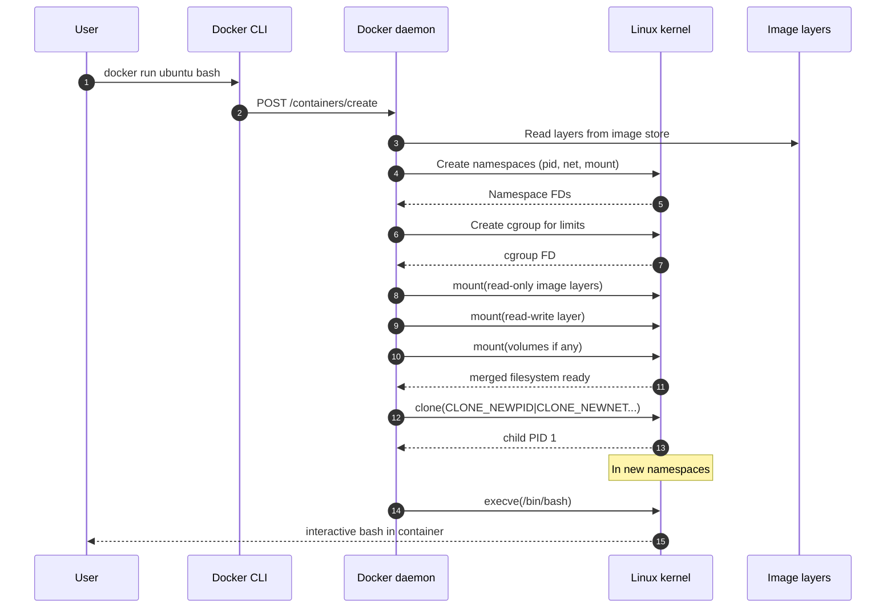
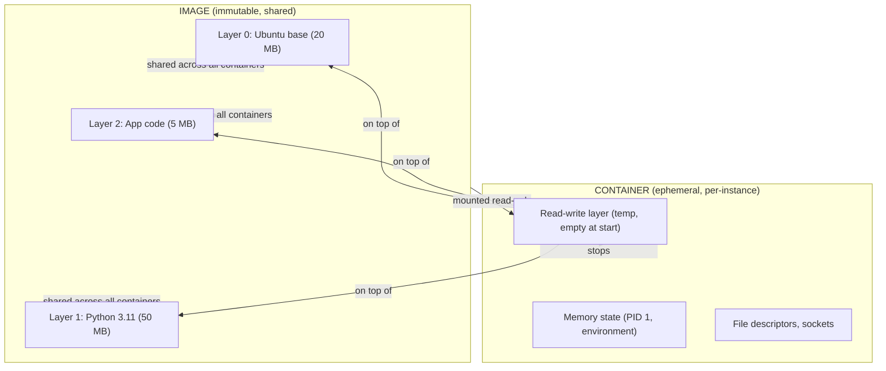
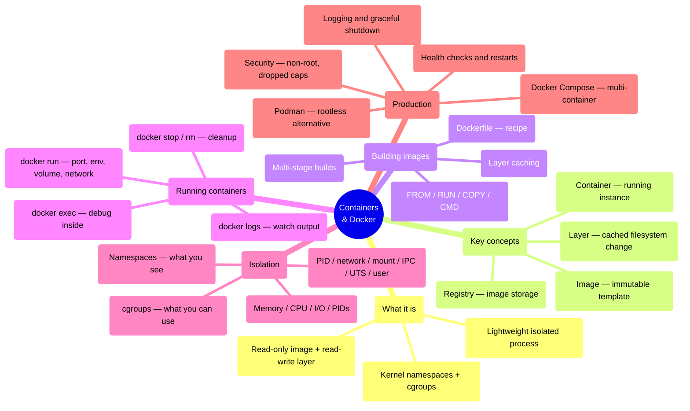

## 1 · The Big Picture

### Why this topic exists

You know how to write code. You can build an application that works perfectly on your laptop, commit it to Git, and push it to production. Then it breaks: a different Python version, a missing system library, an environment variable you forgot to document, a port already in use. The person on-call at 3 a.m. — who may be you in two years — will ask: *Was it installed differently? Is the OS different? Is the kernel different?* This is the problem Docker was built to solve.

**Docker is the answer to a simple question: How do you make "it works on my machine" true everywhere?** It captures your entire application — code, libraries, runtime, dependencies, environment — in a **container**, a lightweight box that runs identically on your laptop, a CI server, a cloud VM, and a Kubernetes cluster. To understand Docker, you need to know what it *is* (an application package), what it *does* (isolates processes with Linux kernel features), and how you *use* it (through commands, images and registries).

### The real problem it solves

Imagine deploying software without Docker:

1. You write a Node.js app that requires Node 18, PostgreSQL, Redis and three npm packages.
2. You send the code to Ops.
3. Ops tries to install it on a production server running Node 16, only the `pg` package, and no Redis.
4. It breaks. You ask them to upgrade. They ask you to support Node 16. You ask them to read the README.
5. Three days and one Slack escalation later, it works — on *that one machine*. But the next production server is slightly different.

Without containers, **every machine is a unique snowflake**, and deployment is archaeological: hunting down which specific versions are installed where, why they differ, and whether it is safe to upgrade.

Docker solves this with **containerisation**: you define your entire application environment in a `Dockerfile`, build it once into an **image**, and run that same image as a **container** on any Docker host. The image is immutable and portable. The container is the running instance.

### Where you will encounter it

| Context | Docker's role |
|---|---|
| **Development** | `docker build` and `docker run` replace "install the dev environment"; the whole team runs identical containers |
| **CI/CD pipelines** | GitHub Actions, GitLab CI, Jenkins all run jobs inside Docker containers; one `Dockerfile` defines the build environment for everyone |
| **Local testing** | `docker-compose up` brings up a full multi-service stack (app + database) without manual setup; `docker exec` debugs running containers |
| **Cloud deployment** | AWS ECS, Google Cloud Run, Azure Container Instances, and Kubernetes all accept Docker images |
| **Production orchestration** | Kubernetes, Docker Swarm, and cloud platforms run containers, auto-restart them, scale them, and manage their networking |
| **Microservices** | Each service is a separate container; orchestrators connect them and manage their lifecycle |

### Why companies care

- **Reproducibility** — the same image produces the same container behaviour on any host with Docker installed.
- **Portability** — develop on macOS, test on Linux in CI, deploy on cloud VMs, and run on Kubernetes — same image, zero changes.
- **Efficiency** — containers start in milliseconds and use only the OS resources they need; 50 containers on a host is unremarkable, whereas 50 VMs would be prohibitive.
- **Standardisation** — every team uses the same tool, format and workflow; Docker has become the lingua franca of application packaging.
- **Ecosystem** — registries (Docker Hub, ECR, GCR), orchestrators (Kubernetes), and CI/CD platforms are all built around Docker images.

> [!INFO]
> **Why containers now, why not before.** Application isolation is old (chroot, jails). But before Linux namespaces (2.6.23, 2008) and cgroups (2.6.24, 2008), you could not isolate resource use or process IDs without a full VM. Solomon Hykes's 2013 Docker announcement combined existing kernel features into one tool, one format and one registry, and the ease of use — not the technology — changed everything. Suddenly containers were easier than VMs for most use cases.

---

## 2 · Intuition First

### Analogy 1: containers vs VMs

**A VM is a full building. A container is a locked room inside one building.**

```diagram title="Separation of concerns"
  VirtualBox / VMware / KVM              Docker on one Linux host
  
  App 1 kernel    App 2 kernel           Shared Linux kernel
  OS image        OS image               ────────────────────
  (2 GB)          (2 GB)                 Isolated root   Isolated root
  Hypervisor      ←bootloader            filesystem      filesystem
  Hardware        ←privileged code       (container 1)   (container 2)
  
  Each VM is slow to boot, uses          Containers share the kernel,
  full OS stack, but breaks out          boot instantly, light weight,
  safely if something goes wrong.        but share the kernel's blast
                                         radius.
```

A **virtual machine** feels like a separate computer: it has its own kernel, own root filesystem, own boot sequence. To run it costs GB of RAM and minutes to start.

A **container** is a process on your Linux host, but with an isolated filesystem, isolated network interface, isolated process ID space, and limits on its memory and CPU. It shares the kernel with the host and every other container. The isolation is clever but *not absolute* — a kernel exploit affects all containers on that host.

This single difference drives everything else:
- Containers are fast (no bootloader, no kernel startup).
- Containers are efficient (shared kernel, shared libraries, only your app's unique layers use space).
- Containers are dangerous in one specific way (shared kernel) and safe in another (one compromised process is one process, isolated from others by namespaces).

### Analogy 2: images and containers

**An image is a blueprint. A container is the house built from it.**

```diagram title="Image vs container"
  IMAGE (read-only)              CONTAINER (running)
  ┌─────────────────────────┐    ┌──────────────────────────┐
  │ Base OS layer           │    │ Read-only layers (image) │
  │ (Ubuntu, Alpine)        │ →  │ Read-write layer (temp)  │
  │ Application layer       │    │ Memory (running process) │
  │ Configuration layer     │    │ Open file descriptors   │
  │ (all read-only, shared) │    │ (unique to this running  │
  │                         │    │  instance)               │
  └─────────────────────────┘    └──────────────────────────┘
  
  File: /app/data.txt           When container stops:
  Always contains "original"    Changes to /app/data.txt are
  because image is immutable.   LOST. The container is gone.
```

An **image** is a set of stacked, read-only filesystem layers. You build it once, and it never changes (unless you rebuild). Multiple containers can run from the same image.

A **container** is an image plus a read-write layer, running process state, and allocated resources. When you run a container, it adds a temporary filesystem layer on top of the read-only image layers. Any changes to files go into that temporary layer. When you stop the container, the temporary layer is gone and the changes are lost — unless you explicitly save them (via volumes).

This is why containers are **ephemeral** — they are meant to be replaced, not maintained.

### Analogy 3: Docker, Podman, and the OCI standard

**Docker is one implementation. The OCI (Open Container Initiative) is the blueprint everyone follows.**

When Docker was new, it was the only tool. Now **podman**, **containerd**, **LXC** and others implement the same OCI Image Format and OCI Runtime Specification, so a `Dockerfile` builds to a standard image, and any compliant runtime can run it.

Think of it like airlines: Docker is one airline with its own planes and rules, but the OCI is the international aviation standard that ensures a plane that lands in London also lands safely in Tokyo.

> [!MEMORY]
> **"Image is a blueprint, container is the running house, Docker is the construction company."** The OCI standard is the building code.

---

## 3 · Technical Definitions

### Docker, containers, and images

**Container.** A lightweight, isolated running environment for an application. It includes a filesystem (from an image), a process or group of processes, network interfaces, environment variables, and resource limits (memory, CPU). The isolation is achieved by Linux kernel features: namespaces (process, network, mount, IPC, UTS, user) and cgroups (resource limits). A container is *ephemeral* — it is meant to be replaced, not long-lived.

**Image.** An immutable, layered filesystem template for a container. An image is built from a `Dockerfile` and consists of stacked read-only layers — base OS (e.g. Ubuntu, Alpine), application binaries, libraries, and configuration. Multiple containers can be created from the same image, and each gets its own read-write layer for temporary changes. An image is identified by a name and tag (e.g. `nginx:latest`, `postgres:15-alpine`).

**Dockerfile.** A text file containing instructions to build an image. Each instruction (`FROM`, `RUN`, `COPY`, `CMD`) creates or modifies a layer. The Dockerfile is to containers what a recipe is to a meal — it defines the exact steps to prepare the environment.

**Registry.** A networked service that stores and distributes images. Docker Hub is the default public registry; AWS ECR, Google Artifact Registry, and others are private registries. Pushing an image to a registry makes it available to any host with credentials to pull it.

**Docker daemon.** A background process that builds images, runs containers, manages volumes and networks, and accepts commands from the Docker CLI. It typically runs as root on Linux or is managed by Docker Desktop on macOS/Windows.

### The six pieces you need to know

| Piece | What it is | Why it matters |
|---|---|---|
| **Namespace (Linux kernel)** | Per-process isolation of PID, network, mount, IPC, hostname, user. Two processes in different namespaces cannot see each other's processes, sockets, filesystems, or identities. | Containers live in separate namespaces so they cannot interfere with the host or each other. |
| **cgroup (Linux kernel)** | Control group; limits on a process's memory, CPU, disk I/O, and PIDs. A container's cgroup prevents it from consuming all the host's resources. | Resource limits are enforced by the kernel; a container cannot exceed them. |
| **Image layer** | A set of filesystem changes from the previous layer. Each `Dockerfile` instruction creates a layer. Layers are read-only and shared if identical. | Efficient storage: if 50 containers run the same base image, they share that layer on disk. Only their changes are separate. |
| **Container filesystem** | The image's layers mounted read-only, plus a container-specific read-write layer on top. Changes during runtime go into the read-write layer. | Containers are ephemeral; stopping a container discards the read-write layer. |
| **Volumes** | Named storage managed by Docker, or bind mounts (directories from the host mounted into the container). Volumes persist when the container stops. | Applications need persistent data (databases, logs, configs). Volumes decouple data from container lifecycle. |
| **Network** | Containers have isolated network namespaces; the host and other containers appear as separate machines. Docker manages bridges, overlay networks and DNS. | Containers must be able to communicate with the host and each other, but in a controlled, isolated way. |

---

## 4 · Internal Working

### How a container boots

When you run `docker run -it ubuntu bash`, the sequence is:



Each container thinks it is PID 1, sees its own network interface, and has its own `/` filesystem — all through namespaces and mount overlays, not VMs.

### The read-only + read-write layer architecture



The genius: if you run 100 containers from the same image, the read-only layers are shared (one copy on disk). Only the read-write layers are separate (100 small temporary directories). Pushing an image to a registry transmits only the *new* layers, not the whole application.

### Namespaces: how processes can be isolated

Linux namespaces make each container feel like its own machine. The key ones:

| Namespace | Isolates | Example |
|---|---|---|
| **PID** | Process IDs. Each container's PID 1 is a different process, invisible to other containers. | Two containers each have `/bin/bash` running as PID 1. They cannot signal each other. |
| **Network** | Network interfaces, IP addresses, routing table, sockets. A container gets its own virtual NIC and IP. | Container 1 binds to port 80; Container 2 can also bind to port 80 (different namespace). The host sees both via bridge. |
| **Mount** | Filesystems and mount points. A container's `/` is different from the host's `/`. | A container sees its image's `/etc/passwd`, not the host's. Mounts are scoped. |
| **IPC** | Message queues, semaphores, shared memory. Containers cannot access each other's IPC primitives. | One container's `shm_open()` call does not see another's. |
| **UTS** | Hostname and domain name. `hostname` in a container returns the container ID, not the host name. | `docker run --hostname myapp` sets the container's hostname. |
| **User** | UID/GID mappings. A UID inside a container can map to a different UID on the host. | A container running as UID 1000 inside can map to UID 100000 on the host (rootless containers). |

**Practical consequence:** `docker run --pid=host` runs a container *outside* the PID namespace, so it sees all the host's processes. This is dangerous and rarely used.

### cgroups: enforcing resource limits

```diagram title="cgroup hierarchy"
  / (root cgroup)
  ├── system.slice
  │   └── sshd.service
  │       max memory: unlimited
  │       max CPU: unlimited
  ├── docker (cgroup)
  │   ├── container_1
  │   │   max memory: 512 MB
  │   │   max CPU shares: 1024
  │   │   max PIDs: 50
  │   ├── container_2
  │   │   max memory: 1 GB
  │   │   max CPU shares: 2048
  │   │   max PIDs: 100
```

A **cgroup** is a kernel feature that limits resources for a set of processes. Docker creates a cgroup for each container:

```bash
docker run -m 512m -c 1024 --pids-limit 50 myapp
```

- `-m 512m` — max 512 MB RAM. If the container exceeds this, the kernel kills processes (OOMkilled).
- `-c 1024` — CPU shares. Default is 1024; higher numbers get more CPU time during contention.
- `--pids-limit 50` — the container cannot spawn more than 50 processes.

The kernel enforces these *hard*. A cgroup cannot request more memory; the kernel simply refuses.

### Image layers and how they stack

```bash
FROM ubuntu:22.04           # Layer 0: ~77 MB
RUN apt-get update && \
    apt-get install -y python3  # Layer 1: +120 MB
COPY app.py /app.py         # Layer 2: +5 KB
RUN pip install flask       # Layer 3: +10 MB
CMD ["python3", "/app.py"]  # Layer 4: metadata only
```

Each instruction creates a *new* layer. The final image is these layers stacked, each read-only. When you build again and only `app.py` changes, layers 0–2 are cached and reused; only layer 3 (the COPY) is rebuilt.

This is why build times matter: put statements that change frequently *late* in the Dockerfile.

---

## 5 · Real Examples

### Example 1: A Node.js application in Docker

**The application** (`app.js`):

```bash
const express = require('express');
const app = express();
app.get('/', (req, res) => res.send('Hello from Docker'));
app.listen(3000, () => console.log('Listening on port 3000'));
```

**The Dockerfile**:

```dockerfile
FROM node:18-alpine
WORKDIR /app
COPY package.json .
RUN npm install
COPY app.js .
EXPOSE 3000
ENV NODE_ENV=production
HEALTHCHECK --interval=10s --timeout=5s --start-period=5s \
  CMD node -e "require('http').get('http://localhost:3000', (r) => r.statusCode === 200 ? process.exit(0) : process.exit(1))"
CMD ["node", "app.js"]
```

**Build it**:

```bash
docker build -t myapp:1.0 .
```

**Run it**:

```bash
docker run -d -p 8000:3000 -e NODE_ENV=production myapp:1.0
```

This starts a container, maps port 8000 on the host to port 3000 inside, and sets the environment variable. The `HEALTHCHECK` allows Docker to detect if the app crashed.

### Example 2: Multi-stage build for efficiency

```dockerfile
# Stage 1: build
FROM node:18 as builder
WORKDIR /build
COPY package.json .
RUN npm install
COPY . .
RUN npm run build  # produces dist/

# Stage 2: runtime
FROM node:18-alpine
WORKDIR /app
COPY --from=builder /build/dist .
COPY --from=builder /build/node_modules ./node_modules
EXPOSE 3000
CMD ["node", "index.js"]
```

The final image contains only stage 2: the built output and production dependencies, not the build tools. This cuts image size dramatically (builder stage might be 500 MB; final image 80 MB).

### Example 3: Docker Compose with app and database

```yaml
version: '3.8'
services:
  web:
    build: .
    ports:
      - "8000:3000"
    environment:
      DATABASE_URL: "postgres://user:pass@db:5432/appdb"
      NODE_ENV: production
    depends_on:
      - db
    volumes:
      - ./logs:/app/logs
    restart: on-failure

  db:
    image: postgres:15-alpine
    environment:
      POSTGRES_USER: user
      POSTGRES_PASSWORD: pass
      POSTGRES_DB: appdb
    volumes:
      - db_data:/var/lib/postgresql/data
    ports:
      - "5432:5432"

volumes:
  db_data:

networks:
  default:
    name: app_network
```

This defines two services: a Node app built from the local `Dockerfile` and a PostgreSQL database. When you run `docker-compose up`, both containers start, are networked together (the web service can reach the database at hostname `db`), and volumes persist data.

---

## 6 · Practical Demonstration

Everything below assumes Docker is installed. Run each command; do not read passively.

### Build an image

```bash
# Create a simple Dockerfile
cat > Dockerfile <<'EOF'
FROM alpine:3.18
RUN apk add --no-cache curl
CMD ["curl", "--version"]
EOF

# Build it
docker build -t mycurl:1.0 .
```

```console
$ docker build -t mycurl:1.0 .
[+] Building 2.3s (5/5) FINISHED
 => [internal] load build definition from Dockerfile
 => [1/2] FROM alpine:3.18
 => [2/2] RUN apk add --no-cache curl
 => exporting to image
 => => naming to docker.io/library/mycurl:1.0
```

### List images

```bash
docker image ls
```

```console
$ docker image ls
REPOSITORY    TAG       IMAGE ID      CREATED       SIZE
mycurl        1.0       a1b2c3d4e5f6  4 seconds ago 45MB
ubuntu        22.04     b5c6d7e8f9a0  2 weeks ago   77MB
postgres      15        c7d8e9f0a1b2  2 weeks ago   370MB
```

| Field | Meaning |
|---|---|
| `REPOSITORY:TAG` | The image name; `ubuntu:22.04` means the `ubuntu` image tagged `22.04`. `latest` is the default tag. |
| `IMAGE ID` | The SHA256 hash of the image's configuration. |
| `CREATED` | How long ago this image was built or pulled. |
| `SIZE` | Total compressed size (image layers stacked). |

### Run a container

```bash
docker run -d --name myapp -p 8000:3000 -e APP_VERSION=1.0 myapp:latest
```

| Flag | Meaning |
|---|---|
| `-d` | Detach — run in background, print container ID. |
| `--name myapp` | Give the container a name (easier than remembering the ID). |
| `-p 8000:3000` | Publish port: forward host port 8000 to container port 3000. |
| `-e APP_VERSION=1.0` | Set environment variable `APP_VERSION`. |
| `myapp:latest` | Image name and tag. |

### Watch containers run

```bash
docker ps
```

```console
$ docker ps
CONTAINER ID   IMAGE        COMMAND           CREATED       STATUS       PORTS              NAMES
abc123def456   myapp:1.0    "node app.js"     2 minutes ago Up 2 minutes 0.0.0.0:8000->... myapp
xyz789uvw012   postgres:15  "postgres"        2 minutes ago Up 2 minutes 5432/tcp           db
```

| Field | Meaning |
|---|---|
| `CONTAINER ID` | Short hash of the running instance. |
| `IMAGE` | Which image this container was created from. |
| `COMMAND` | The command running inside (from `CMD` or `ENTRYPOINT`). |
| `STATUS` | Up/Exited and how long. |
| `PORTS` | Port mappings and protocol. |
| `NAMES` | Container name (or auto-generated if you didn't provide one). |

### Read logs

```bash
docker logs myapp
```

```console
$ docker logs myapp
Listening on port 3000
```

Tail continuously:

```bash
docker logs -f myapp
```

### Inspect a running container

```bash
docker inspect myapp
```

Returns a JSON blob with everything: image ID, environment variables, volumes, port mappings, resource limits, namespace information, and more.

One-liners to extract useful bits:

```bash
docker inspect -f '{{.State.Pid}}' myapp           # PID on the host
docker inspect -f '{{.HostConfig.Memory}}' myapp  # RAM limit in bytes
docker inspect -f '{{.Config.Env}}' myapp         # Environment variables
```

### Execute a command inside a running container

```bash
docker exec -it myapp bash
```

`-it` means interactive (`-i`) and allocate a terminal (`-t`). You now have a shell inside the running container. Type `exit` to leave.

This is how you debug: if an application is behaving oddly, `docker exec` into it and inspect files, logs, network connections, running processes.

```bash
docker exec myapp ps aux                   # Processes inside the container
docker exec myapp curl http://localhost:3000  # Test the app from inside
docker exec myapp cat /etc/os-release      # OS info
```

### Stop and restart containers

```bash
docker stop myapp          # Graceful SIGTERM, then SIGKILL after grace period
docker kill myapp          # Immediate SIGKILL
docker restart myapp       # Stop then start
```

### Remove containers and images

```bash
docker rm myapp            # Remove stopped container
docker rm -f myapp         # Force remove (stop first if running)
docker rmi myapp:1.0       # Remove image
docker image prune          # Remove dangling images (unused layers)
```

> [!DANGER]
> `docker rm -f` removes a running container immediately without graceful shutdown. The application has no time to flush buffers or clean up. Use `docker stop` first in production.

### Volume management

```bash
# Create a named volume
docker volume create mydata

# Mount it into a container
docker run -v mydata:/app/data myapp:1.0

# See where it lives on the host
docker volume inspect mydata
```

```console
$ docker volume inspect mydata
[
  {
    "Name": "mydata",
    "Driver": "local",
    "Mountpoint": "/var/lib/docker/volumes/mydata/_data",
    "Labels": {},
    "Scope": "local"
  }
]
```

Bind mount (mount a host directory):

```bash
docker run -v /home/user/data:/app/data myapp:1.0
```

Now `/app/data` inside the container is a live view of `/home/user/data` on the host.

### Network management

```bash
# Create a user-defined bridge network
docker network create mynet

# Run two containers on the network
docker run -d --network mynet --name web myapp:1.0
docker run -d --network mynet --name cache redis:7

# Inside 'web', you can reach 'cache' by hostname
docker exec web curl http://cache:6379
```

User-defined networks support DNS hostname resolution between containers. The default `bridge` network does not.

### Image history

```bash
docker history myapp:1.0
```

```console
$ docker history myapp:1.0
IMAGE          CREATED BY                                      SIZE
a1b2c3d4e5f6   /bin/sh -c npm start                           0B
b2c3d4e5f6a7   /bin/sh -c #(nop) CMD ["npm" "start"]          0B
c3d4e5f6a7b8   /bin/sh -c npm install                         45MB
d4e5f6a7b8c9   /bin/sh -c #(nop) COPY app.js /app.js          3KB
e5f6a7b8c9d0   /bin/sh -c #(nop) WORKDIR /app                 0B
f6a7b8c9d0e1   /bin/sh -c #(nop) FROM node:18-alpine          0B
```

Shows each layer and its size. This helps you find where the bloat is.

### Push to a registry

```bash
# Log in (prompts for username/token)
docker login docker.io

# Tag the image with a registry prefix
docker tag myapp:1.0 myusername/myapp:1.0

# Push it
docker push myusername/myapp:1.0

# Pull it elsewhere
docker pull myusername/myapp:1.0
```

### Docker Compose

```bash
# Start all services defined in docker-compose.yml
docker-compose up -d

# View logs
docker-compose logs -f web

# Stop and remove containers (keeps volumes)
docker-compose down

# Stop, remove, and remove volumes
docker-compose down -v
```

---

## 7 · Comparison Tables

### Docker vs VirtualBox / KVM

| Aspect | Docker containers | VirtualBox / KVM VMs |
|---|---|---|
| **Overhead** | Milliseconds to start, MB of RAM per container | Seconds to minutes, GB of RAM per VM |
| **Isolation** | Shared kernel; a kernel exploit affects all containers | Separate kernel; each VM is isolated |
| **Use case** | Applications, microservices, ephemeral workloads | Full OS environments, CI runners, legacy apps |
| **Image size** | 10–100 MB typical | 1–5 GB typical |
| **Density** | 100+ per host | 10–20 per host |
| **Portability** | OCI standard; any container runtime | Format-specific; VMware vs VirtualBox vs KVM differ |
| **Networking** | Docker manages; simple for single host | Hypervisor manages; more complex multi-host |

> [!TIP]
> **The right tool for the job.** Use containers for applications and microservices. Use VMs for CI/CD runners, testing full OS configurations, or when you need absolute isolation. Many teams run containers *on* VMs on cloud infrastructure — best of both.

### Image vs container

| | Image | Container |
|---|---|---|
| **State** | Immutable template | Running instance + ephemeral state |
| **How created** | Built from `Dockerfile` or pulled from registry | Created from image via `docker run` |
| **How deleted** | `docker rmi` | `docker rm` |
| **Persistence** | Data stored in image is permanent | Data written to container is lost when stopped (unless in a volume) |
| **Sharing** | One image → many containers | One container is one instance |
| **Size** | Fixed, compressed | Can grow via read-write layer |

### Dockerfile keywords

| Keyword | Purpose | Example | Notes |
|---|---|---|---|
| `FROM` | Base image | `FROM ubuntu:22.04` | Must be first. Sets the starting filesystem. |
| `RUN` | Execute a command during build | `RUN apt-get install -y curl` | Creates a layer. Run as early as possible if rarely changed. |
| `COPY` | Copy files from build context into image | `COPY app.py /app/` | Only copies; does not extract or follow symlinks. |
| `ADD` | Like `COPY`, but auto-extracts tarballs | `ADD app.tar.gz /app/` | Use `COPY` unless you need tarball extraction. |
| `WORKDIR` | Set working directory | `WORKDIR /app` | Creates the directory if it doesn't exist. |
| `ENV` | Set environment variable | `ENV NODE_ENV=production` | Available in container and during build. |
| `ARG` | Build-time variable | `ARG BASE_IMAGE=node:18` | Scoped to build; not in final image. |
| `EXPOSE` | Document which ports the app uses | `EXPOSE 3000` | Does not publish; `docker run -p` does. |
| `VOLUME` | Mark a path as a volume mount point | `VOLUME /data` | Documents intent; `docker run -v` actually mounts. |
| `USER` | Run subsequent commands as this UID | `USER appuser` | Prefer non-root for security. |
| `CMD` | Default command to run | `CMD ["node", "app.js"]` | Can be overridden at `docker run`. |
| `ENTRYPOINT` | Configure the image as executable | `ENTRYPOINT ["./startup.sh"]` | `CMD` becomes arguments to `ENTRYPOINT`. |
| `HEALTHCHECK` | Define a health probe | `HEALTHCHECK --interval=10s CMD curl ...` | Docker kills container if probe fails repeatedly. |

### cgroups vs namespaces

| | Namespace | cgroup |
|---|---|---|
| **What it does** | Isolates *visibility* — what a process can see | Limits *resource* use — how much a process can take |
| **Failure mode** | Can escape if namespace misconfigured; process sees host | Cannot exceed limits; kernel enforces hard boundary |
| **Examples** | PID, network, mount, IPC, UTS, user | Memory, CPU shares, I/O, PIDs |
| **Per container?** | Yes; each container is in separate namespaces | Yes; each container has its own cgroup |
| **Can be disabled?** | No; containers require namespaces to work | Yes; `--memory 0` means no limit |
| **Kernel feature since** | PID 2.4.18 (1999); network 2.4.19 (2000) | 2.6.24 (2008) — required for modern containers |

---

## 8 · Memory Tricks

> [!MEMORY]
> **"Dockerfile is a recipe; image is the cake; container is eating it."**
> Write a `Dockerfile` (recipe), build it into an image (cake), run containers from it (eating). Each container eats one "copy" of the cake without changing the original.

> [!MEMORY]
> **"Namespaces say 'you can't see that'; cgroups say 'you can't have that.'"**
> Namespaces isolate visibility (PID, network, mount). cgroups enforce resource limits (memory, CPU, I/O).

> [!MEMORY]
> **"Port mapping: host:container."** `docker run -p 8000:3000` means host port 8000 forward to container port 3000. Left = host, right = container.

> [!MEMORY]
> **"Volumes are for data that should survive the container."** Ephemeral containers have ephemeral filesystems. Volumes outlive them.

> [!MEMORY]
> **"OCI is the standard; Docker is one implementation."** `Dockerfile` → OCI image. Any OCI runtime (Docker, containerd, Podman, LXC) can run it.

---

## 9 · Interview Corner

<details>
<summary><strong>Beginner</strong> — What is a Docker container, in one sentence?</summary>

A lightweight, isolated running environment for an application — a process or group of processes running on the Linux host, isolated from others by kernel namespaces and constrained by cgroups, with its own view of the filesystem, network, and process tree.
</details>

<details>
<summary><strong>Beginner</strong> — What is the difference between a Docker image and a container?</summary>

An image is an immutable template: a set of stacked read-only filesystem layers built from a `Dockerfile`. A container is a running instance created from an image — it adds an ephemeral read-write layer and runs processes with allocated resources (CPU, memory). Many containers can run from the same image; each is a separate instance.
</details>

<details>
<summary><strong>Beginner</strong> — What does `docker run -p 8000:3000 myapp` do?</summary>

Starts a container from image `myapp` and publishes a port: traffic coming to port 8000 on the host machine is forwarded to port 3000 inside the container. The format is `host:container`.
</details>

<details>
<summary><strong>Beginner</strong> — What is the `CMD` vs `ENTRYPOINT` in a Dockerfile?</summary>

`CMD` specifies the default command to run when the container starts. `ENTRYPOINT` defines the executable, and `CMD` becomes its arguments. If you provide a command at `docker run`, it overrides `CMD` but not `ENTRYPOINT`. Best practice: use `ENTRYPOINT` for the main executable and `CMD` for default arguments.
</details>

<details>
<summary><strong>Intermediate</strong> — Explain Docker layers and why they matter.</summary>

Each instruction in a `Dockerfile` (`FROM`, `RUN`, `COPY`, etc.) creates a new layer — a set of filesystem changes on top of the previous layer. Layers are immutable and read-only in images. When you build, Docker caches layers; if you rebuild and only the last instruction changes, Docker reuses the cached earlier layers. This makes rebuilds fast. When you run a container, all image layers are mounted read-only, and a new read-write layer is added on top. Multiple containers from the same image share the image layers on disk; only the read-write layers are separate.
</details>

<details>
<summary><strong>Intermediate</strong> — What are Linux namespaces, and which ones does Docker use?</summary>

Namespaces are a kernel feature that isolate resource visibility: each namespace gives a process a private view of a resource (processes, network, filesystems, IPC, hostname, user IDs). Docker uses all six: PID (process isolation), network (separate IP, port space), mount (separate `/` filesystem), IPC (message queues, shared memory), UTS (hostname), and user (UID mapping for rootless containers). Two containers in different namespaces cannot see each other's processes, sockets, or files.
</details>

<details>
<summary><strong>Intermediate</strong> — What are cgroups, and how do they differ from namespaces?</summary>

cgroups (control groups) are a kernel feature that *limits resource usage*: memory, CPU, I/O, and PID count. Namespaces isolate visibility; cgroups enforce hard limits. A container with `-m 512m` cannot use more than 512 MB RAM — if it tries, the kernel kills processes (OOMkilled). Without cgroups, a misbehaving container could consume all the host's resources. Both are required for practical containerisation.
</details>

<details>
<summary><strong>Intermediate</strong> — What is a volume, and when would you use a bind mount instead?</summary>

A volume is persistent storage managed by Docker, stored in `/var/lib/docker/volumes/`. Volumes persist when the container stops, so they are for application data (databases, user uploads, configs). A bind mount is a host directory mounted into the container (`-v /host/path:/container/path`); it is useful for development (editing code on the host and seeing changes in the container) or sharing a host system directory. For production, volumes are cleaner; for development, bind mounts are more convenient.
</details>

<details>
<summary><strong>Advanced</strong> — Walk me through what happens when you run `docker run -it ubuntu bash`.</summary>

The Docker daemon reads the `ubuntu` image (or pulls it from the registry). It creates new Linux namespaces (PID, network, mount, IPC, UTS). It creates a cgroup to limit resources. It mounts the image's read-only layers and a read-write layer on top at the union mount point. It clones a new process in those namespaces (so the process is PID 1 in that namespace), which then runs `execve("/bin/bash")`. Inside the container, `bash` is PID 1, has its own network interface (visible via `eth0`), cannot see the host's processes, and any file it writes goes to the read-write layer. When you `exit` bash, the process exits, the namespaces are destroyed, and the read-write layer is discarded.
</details>

<details>
<summary><strong>Advanced</strong> — How does the read-only + read-write layer model enable efficiency?</summary>

Image layers are read-only and shared across containers. If you run 100 containers from the same image, they all share the same 100 MB of image layers on disk — layer data is stored once. Each container gets its own small read-write layer (typically empty unless the app writes files). This is why 100 containers run efficiently on one host, whereas 100 VMs would be prohibitive. When you push an image to a registry, Docker transmits only new layers; if a layer already exists in the registry, it is not uploaded again.
</details>

<details>
<summary><strong>Advanced</strong> — What is the difference between Docker and Podman, and why does the OCI standard matter?</summary>

Docker is the original container tool; Podman is a newer, rootless alternative developed by Red Hat. Both produce OCI-compliant images and can use OCI-compliant runtimes. The `Dockerfile` is the same, and a Docker image can be run by Podman and vice versa. The OCI (Open Container Initiative) standard defines the image format and runtime specification, so containers are not locked into one tool. This is important because if Docker becomes unsuitable or unavailable, your images are not stranded — any OCI runtime can use them.
</details>

<details>
<summary><strong>Advanced</strong> — How would you debug an application that works locally but fails in a container?</summary>

First, capture the container's logs: `docker logs myapp`. If that is not enough, `docker exec -it myapp bash` to get a shell inside and inspect `/app`, environment variables, running processes (`ps aux`), and network connectivity (`curl`, `netstat`). Check if the container is resource-constrained: `docker stats myapp` shows live memory/CPU. Use `docker inspect myapp` to verify environment variables and volume mounts. Compare the container's environment to your local machine: `docker exec myapp env`, `docker exec myapp uname -a`, `docker exec myapp cat /etc/os-release`. Often the problem is an environment variable, a missing file (check volume mount), or a port binding issue.
</details>

<details>
<summary><strong>Scenario</strong> — Your team's Python app works in development but crashes on startup in production (in a container). What are the first three things you check?</summary>

1. **Logs**: `docker logs myapp` to see what the error is. If the container exited immediately, `docker logs` still shows the output.
2. **Environment variables**: `docker inspect myapp | grep -A 50 '"Env"'` to see what was passed. The app might be looking for a `DATABASE_URL` that was not set.
3. **Filesystem**: `docker exec myapp ls -la /app` to verify all files are present and readable. A `COPY` in the `Dockerfile` might have failed silently, or permissions might be wrong.

If still stuck, run the image locally with the same environment (`docker run -e DATABASE_URL=... myapp`) to reproduce the failure locally.
</details>

<details>
<summary><strong>Scenario</strong> — You need to add a system dependency (e.g. `curl`) to an image. Where would you add it, and why?</summary>

Add it as early as possible in the `Dockerfile`, after `FROM`, to maximise cache hits:

```dockerfile
FROM ubuntu:22.04
RUN apt-get update && apt-get install -y curl  # Early
COPY app.py /app.py                            # Late
```

If you do it the other way and only `app.py` changes, rebuilding would re-run `apt-get`, wasting time. By putting `RUN` statements early, you cache the slow layer. Every rebuild only re-runs layers that changed or are after a changed layer.
</details>

<details>
<summary><strong>Company style</strong> — Why does your company standardise on Docker?</summary>

Docker ensures reproducibility: the same `Dockerfile` produces the same image everywhere, eliminating "it works on my machine" problems. It enables efficient deployment — containers start in milliseconds and are lightweight, so we can scale horizontally. It standardises our build and deployment pipeline — every service uses the same Dockerfile format, registry, and orchestration tool (Kubernetes). It integrates with our CI/CD: every commit builds an image, every image is tested, every image is versioned and can be rolled back. Docker is the lingua franca; every developer knows it, reducing context switching.
</details>

<details>
<summary><strong>Company style</strong> — What is the difference between our Docker images and our Kubernetes deployments?</summary>

A Docker image is the package — it defines what runs. A Kubernetes deployment is the orchestrator — it defines *how many* copies run, *where* they run, how they are networked, and how they recover if they crash. You build a Docker image locally, push it to a registry, and then write a Kubernetes deployment that says "run 3 replicas of this image, scale up if CPU > 70%, restart if unhealthy." Kubernetes watches the deployment and manages the containers.
</details>

<details>
<summary><strong>HR style</strong> — Tell me about a time you debugged a container issue in production.</summary>

A good answer: "Our payment service container was crashing intermittently. I started with `docker logs` to see OOMkilled errors. I checked `docker inspect` and found the memory limit was set too low (512 MB) for the JVM. I looked at the deployment manifest and realised the memory request was misconfigured. I increased it to 1 GB, redeployed, and the crashes stopped. I then set up alerts on OOMkilled events so we'd catch future memory issues sooner." This shows you know the debugging tools and think systematically about root cause.
</details>

---

## 10 · Common Mistakes

> [!MISTAKE]
> **Running containers as root.** Every container defaults to running as root inside its namespace. A container break-out still results in root access to the host (if the kernel exploit works). Always: `RUN useradd -m appuser`, then `USER appuser` before your app starts.

> [!MISTAKE]
> **Putting secrets in the `Dockerfile` or image.** `RUN curl https://api.example.com?key=SECRET` embeds the key in the image layers, where it is readable by anyone with image access. Use `ARG` for build-time secrets and environment variables for runtime secrets — both from a secrets manager, not hardcoded.

> [!MISTAKE]
> **Confusing `COPY` and `ADD`.** `COPY` copies files as-is. `ADD` also extracts tarballs and follows HTTP redirects. Use `COPY` unless you specifically need tarball extraction.

> [!MISTAKE]
> **Large image sizes.** Putting build tools in the final image bloats it. Use multi-stage builds: build in one stage (with gcc, pip, npm), copy only the output to a clean final stage. This cuts image size by 50–80%.

> [!MISTAKE]
> **Forgetting to use `.dockerignore`.** By default, `docker build` sends the *entire* build context to the daemon. Put large files, git history, and node_modules in `.dockerignore`:

```
.git
node_modules
.env
*.log
```

> [!MISTAKE]
> **Not setting `WORKDIR`.** Without `WORKDIR`, files are `COPY`'d to `/`, making the image messy and paths fragile. Always set `WORKDIR /app`.

> [!MISTAKE]
> **Relying on container IP addresses from outside Docker.** Container IPs are internal; `172.17.0.2` is not routable from your laptop. Use `docker run -p 8000:3000` to publish ports, or use Docker networks and hostnames if containers need to talk.

> [!MISTAKE]
> **Assuming data persists in containers.** If your container writes data to `/app/data` and the container stops, that data is gone. Use volumes: `docker run -v mydata:/app/data`. If you forget this and a production database container stops, you lose all data — permanently.

> [!DANGER]
> **Thinking containers are VMs.** Containers share the kernel, so a kernel privilege escalation affects *every* container on the host. A container is not a security boundary like a VM. Use containers for trusted workloads; use VMs when you need absolute isolation from untrusted code.

> [!DANGER]
> **Running containers with `--privileged`.** This disables namespaces and cgroups, giving the container full host access. `--privileged` containers are equivalent to processes running as root on the host. Only use this if absolutely necessary and trust the container image completely.

---

## 11 · Docker Compose, Podman, and Production Patterns

### Docker Compose: multi-container orchestration

For local development and testing, `docker-compose` brings up a full stack:

```bash
# Start all services
docker-compose up

# In background
docker-compose up -d

# View logs
docker-compose logs -f web

# Stop and remove containers (volumes persist)
docker-compose down

# Down and remove volumes
docker-compose down -v

# Restart services
docker-compose restart

# Run a one-off command in a service
docker-compose exec db psql -U user -d appdb
```

### Podman: the rootless alternative

**Podman** is Docker-compatible but runs rootless (non-root) by default, improving security. Commands are identical:

```bash
podman build -t myapp:1.0 .
podman run -d -p 8000:3000 myapp:1.0
podman ps
```

Podman also supports `podman-compose` for multi-container setups. The OCI standard means images and containers are interchangeable between Docker and Podman.

### Container security best practices

1. **Run as non-root**: `USER appuser` in the Dockerfile. If you must run as root, use `--read-only` to prevent filesystem writes.
2. **Drop capabilities**: `docker run --cap-drop=ALL --cap-add=NET_BIND_SERVICE myapp`. Most apps need only `NET_BIND_SERVICE` (for binding ports < 1024) or `CHOWN` (for file ownership).
3. **Use `--read-only` filesystem**: `docker run --read-only myapp`. If the image is read-only, attackers cannot write a persistence mechanism. Pair with `--tmpfs /tmp` if the app needs temp files.
4. **Scan images for vulnerabilities**: `docker scan myapp:1.0` or use Trivy to check for known CVEs in your base image and dependencies.
5. **Sign images**: Container image signing (via Notary or Cosign) cryptographically verifies the publisher.

### Production patterns

**Health checks**: Let orchestrators know if the app is healthy:

```dockerfile
HEALTHCHECK --interval=10s --timeout=3s --start-period=10s --retries=3 \
  CMD ["curl", "-f", "http://localhost:3000/health"] || exit 1
```

**Graceful shutdown**: Handle `SIGTERM` signals so the app can close connections and flush buffers:

```bash
# Bad: the container may still be receiving requests
CMD ["python", "app.py"]

# Good: shell traps SIGTERM and forwards it
CMD ["/bin/sh", "-c", "trap 'kill -TERM $PID' TERM; python app.py & wait $PID"]
```

**Resource limits**: Always set memory and CPU:

```bash
docker run -m 512m -c 1024 myapp
```

**Restart policy**: Handle crashes:

```bash
docker run --restart=on-failure:5 myapp
```

**Logging**: Configure where logs go:

```bash
docker run --log-driver json-file --log-opt max-size=10m --log-opt max-file=3 myapp
```

### Image registry and distribution

**Tag the image for a registry**:

```bash
docker tag myapp:1.0 myregistry.azurecr.io/myapp:1.0
docker push myregistry.azurecr.io/myapp:1.0
```

**Pull from a registry**:

```bash
docker pull myregistry.azurecr.io/myapp:1.0
docker run myregistry.azurecr.io/myapp:1.0
```

Common registries: Docker Hub (public), AWS ECR, Google Artifact Registry, Azure Container Registry, Quay (Red Hat).

---

## 12 · Summary & Mind Map



**Twelve sentences that carry the chapter.**

1. A container is an isolated process using Linux namespaces for visibility and cgroups for resource limits.
2. An image is immutable read-only layers; a container adds an ephemeral read-write layer and runs processes.
3. The Dockerfile is a recipe; `docker build` creates the image; `docker run` starts the container.
4. Namespaces isolate what a process sees (PID, network, mount, IPC, UTS, user); cgroups limit what it can use (memory, CPU, I/O).
5. Image layers are cached and shared; only the new layers are stored or transmitted.
6. Volumes persist data across container restarts; without them, data is lost when the container stops.
7. `docker run -p 8000:3000` forwards host port 8000 to container port 3000; `-e` sets environment variables.
8. `docker exec -it container bash` debugs by running a command (or shell) inside a running container.
9. Docker Compose orchestrates multiple containers locally with `docker-compose.yml` defining services, volumes and networks.
10. Container security requires running as non-root, dropping unnecessary capabilities, and scanning for vulnerabilities.
11. The OCI standard makes images portable; Docker, Podman, and other runtimes all run OCI images identically.
12. Containers are not VMs — they share the kernel, so they are efficient but have a shared blast radius.

---

## 13 · Cheat Sheet

```diagram title="Chapter 19 — one-page revision"
BUILD
  FROM image              base filesystem
  RUN cmd                 execute during build (creates layer)
  COPY host /image        copy files
  ADD tarball             COPY + auto-extract
  WORKDIR /path           set working dir
  ENV key=value           environment variable
  EXPOSE port             document (doesn't publish)
  USER appuser            run as this UID
  CMD ["cmd"]             default command
  ENTRYPOINT ["./app"]    make image executable
  HEALTHCHECK             probe for aliveness

RUN
  docker build -t name:tag .              build image
  docker run -d -p 8000:3000 myapp        run container
  docker run -e VAR=value myapp           set environment
  docker run -v data:/app/data myapp      mount volume
  docker run -m 512m -c 1024 myapp        resource limits
  docker exec -it myapp bash              shell inside
  docker logs -f myapp                    tail logs
  docker stop/kill/restart myapp          lifecycle
  docker ps / docker ps -a                list running/all
  docker inspect myapp                    full details
  docker history myapp                    layer breakdown
  docker rmi myapp:1.0                    remove image
  docker rm myapp                         remove container

ISOLATION
  Namespaces — PID, network, mount, IPC, UTS, user
  cgroups — memory (-m), CPU (-c), I/O, PIDs (--pids-limit)
  Read-only image layers (shared) + read-write layer (ephemeral)

COMPOSE
  docker-compose up -d                    start all services
  docker-compose down                     stop all
  docker-compose logs -f service          tail logs
  docker-compose exec db bash             shell in service

SECURITY
  Run as non-root: USER appuser
  Drop caps: --cap-drop=ALL --cap-add=NET_BIND_SERVICE
  Read-only: --read-only --tmpfs /tmp
  Health checks
  Resource limits (memory, CPU)

REGISTRY
  docker tag myapp:1.0 registry/myapp:1.0
  docker login registry
  docker push registry/myapp:1.0
  docker pull registry/myapp:1.0

OCI STANDARD
  Dockerfile → OCI image (portable format)
  Docker / Podman / containerd / LXC (any OCI runtime)
```

---

## 14 · Practice

### Flashcards

| Prompt | Answer |
|---|---|
| What is a Docker image? | An immutable, layered filesystem template. Multiple containers can run from the same image. |
| What is a Docker container? | A running instance of an image — a process or group of processes with isolated namespace and resource limits. |
| What does `docker run -p 8000:3000` do? | Forwards host port 8000 to container port 3000. Format: host:container. |
| What does `docker exec -it bash` do? | Runs a command (or interactive shell) inside a running container. |
| What is a Dockerfile? | A text file with instructions (`FROM`, `RUN`, `COPY`, `CMD`) that define how to build an image. |
| What is a layer in Docker? | A set of filesystem changes from the `Dockerfile`. Layers are cached, immutable and shared across images. |
| What do Linux namespaces do? | Isolate visibility of resources: PID (processes), network (IPs/ports), mount (filesystems), IPC (message queues), UTS (hostname), user (UIDs). |
| What do cgroups do? | Enforce resource limits: maximum memory, CPU shares, I/O bandwidth, PID count. The kernel blocks processes that exceed limits. |
| What is a volume in Docker? | Persistent storage managed by Docker. Volumes outlive containers; data written to volumes survives `docker stop`. |
| What is a bind mount? | A host directory mounted into a container. Changes on host appear in container and vice versa. Used for development. |
| What is the difference between `CMD` and `ENTRYPOINT`? | `ENTRYPOINT` defines the main executable; `CMD` provides default arguments. `CMD` can be overridden at `docker run`; `ENTRYPOINT` typically cannot. |
| What is a multi-stage build? | Build in one stage (with tools), copy only the output to a clean final stage. Reduces final image size. |
| What is Docker Compose? | A tool to define and run multi-container applications. `docker-compose.yml` defines services; `docker-compose up` starts them all. |
| What is Podman? | A rootless container runtime compatible with Docker. Commands are identical; images are interchangeable (OCI standard). |
| What is the OCI standard? | A specification for image format and container runtime, ensuring portability across Docker, Podman, containerd and other runtimes. |

### Multiple choice

1. A Docker image is: **(a)** a running process **(b)** an immutable template with read-only layers **(c)** a volume **(d)** a network bridge
2. Which instruction in a Dockerfile creates a layer? **(a)** `FROM` **(b)** `ENV` **(c)** `RUN` **(d)** `EXPOSE`
3. `docker run -p 8000:3000 myapp` means: **(a)** run myapp on port 3000 **(b)** expose port 8000 inside the container **(c)** map host port 8000 to container port 3000 **(d)** run myapp on port 8000
4. Linux namespaces isolate: **(a)** resource usage **(b)** visibility of processes, network, files **(c)** disk I/O **(d)** memory limits
5. cgroups enforce: **(a)** filesystem isolation **(b)** process visibility **(c)** resource limits **(d)** port mappings
6. A volume is used for: **(a)** temporary container-only storage **(b)** read-only image layers **(c)** persistent data that survives container restart **(d)** logging
7. The difference between `COPY` and `ADD` is: **(a)** no difference **(b)** `ADD` extracts tarballs automatically **(c)** `COPY` is used in `docker-compose` **(d)** `ADD` is more secure
8. `docker exec -it myapp bash` does: **(a)** build a new image from myapp **(b)** run a bash shell inside the running container myapp **(c)** start a new container named bash **(d)** SSH into myapp
9. Which is a rootless container runtime? **(a)** Docker **(b)** Podman **(c)** KVM **(d)** VirtualBox
10. The OCI standard ensures: **(a)** containers are faster **(b)** images are portable across container runtimes **(c)** Docker is the only runtime **(d)** containers use less memory

<details>
<summary>Answers</summary>

1. (b) — immutable template with read-only layers.
2. (c) — `RUN` executes a command and creates a layer.
3. (c) — left side is host, right side is container.
4. (b) — namespaces isolate visibility.
5. (c) — cgroups enforce resource limits.
6. (c) — volumes persist data.
7. (b) — `ADD` auto-extracts tarballs.
8. (b) — runs a command inside the running container.
9. (b) — Podman runs rootless by default.
10. (b) — OCI ensures portability.
</details>

### Fill in the blanks

1. A _______ is a running instance of an image; an _______ is the immutable template.
2. Each instruction in a `Dockerfile` creates a _______ in the image.
3. `docker run -p 8000:3000` forwards host port _______ to container port _______.
4. _______ isolate visibility; _______ enforce resource limits.
5. Data written inside a container is _______ when the container stops unless stored in a _______.
6. `docker _______ -it myapp bash` runs a shell inside a running container.
7. `RUN apt-get install curl` creates a _______, while `RUN apt-get update` should be placed _______ in the Dockerfile to maximise cache hits.
8. A multi-stage build uses two _______ instructions to reduce final image _______.

<details>
<summary>Answers</summary>

1. container; image — 2. layer — 3. 8000; 3000 — 4. Namespaces; cgroups — 5. lost; volume — 6. exec — 7. layer; early — 8. FROM; size
</details>

### True or false

1. A Docker container is a full operating system.
2. An image is mutable; you can edit it after building.
3. Multiple containers can run from the same image.
4. Volumes are deleted when a container stops.
5. Namespaces isolate resource usage.
6. cgroups enforce visibility isolation.
7. `docker exec -it bash` runs a new container.
8. The OCI standard ensures Docker is the only portable container runtime.
9. `EXPOSE 3000` in a `Dockerfile` makes port 3000 accessible from the host.
10. Podman and Docker produce the same OCI image format.

<details>
<summary>Answers</summary>

1. **False** — a container is a process with isolated namespace, not a full OS. It shares the kernel.
2. **False** — an image is immutable. Changes are made by editing the `Dockerfile` and rebuilding.
3. **True**.
4. **False** — volumes persist when the container stops. That is their purpose.
5. **False** — namespaces isolate visibility; cgroups limit resources.
6. **False** — namespaces isolate visibility; cgroups are about resources.
7. **False** — `docker exec` runs a command in an existing running container.
8. **False** — the OCI standard ensures *multiple* runtimes (Docker, Podman, containerd, LXC) can run images.
9. **False** — `EXPOSE` documents the port; `docker run -p 8000:3000` actually publishes it.
10. **True**.
</details>

### Hands-on lab

Do these on a host with Docker installed (Docker Desktop on macOS/Windows, or Docker daemon on Linux).

1. **Build a simple image.** Write a `Dockerfile` that starts from `ubuntu:22.04`, installs `curl`, and sets `CMD ["curl", "--version"]`. Build it: `docker build -t mycurl:1.0 .`. Run it: `docker run mycurl:1.0`. What is the output?

2. **Layer caching.** Rebuild the image without changes: `docker build -t mycurl:1.0 .`. How much faster is it the second time? Why? Now edit the `Dockerfile`, change the `apt-get install` line, and rebuild. What layers were rebuilt?

3. **Mount a volume.** Create a directory on your host: `mkdir /tmp/data`. Build an image that writes a file to `/app/data`. Run the container with `docker run -v /tmp/data:/app/data mycurl:1.0`. Did the file appear on your host? Restart the container — does the file still exist?

4. **Run a multi-container stack.** Write a `docker-compose.yml` with two services: a simple web app (build from your `Dockerfile`) and a Redis cache. Port-map the web app. Run `docker-compose up -d`. Can you curl the web app from your host? Use `docker-compose logs web` to view logs.

5. **Debug inside a running container.** Start a container: `docker run -d --name debug myimage`. Run `docker exec -it debug bash`. Inside the container, inspect `/proc/self`, the network interfaces (`ip addr`), and environment variables (`env`). What can you learn about the container's isolation?

6. **Push to a registry.** Create a free Docker Hub account. Tag your image: `docker tag mycurl:1.0 yourusername/mycurl:1.0`. Push it: `docker push yourusername/mycurl:1.0`. From another machine (or a fresh shell), pull and run it: `docker pull yourusername/mycurl:1.0`.

### Challenge problems

1. **Explain the container model end-to-end.** Describe what happens when you run `docker run -p 8000:3000 -e NODE_ENV=prod -v data:/app/data myapp:1.0`, from Docker daemon interactions, through namespace and cgroup creation, to the container starting. Where are the image layers, where is the read-write layer, and what happens when the container stops?

2. **Design a production Dockerfile.** Write a multi-stage Dockerfile for a Go application: build stage compiles the Go binary (with build tools), runtime stage copies only the binary to a `scratch` or `alpine` base. Measure the size difference between a single-stage and multi-stage build.

3. **Security audit.** Take any public image (e.g. `nginx:latest`) and check: what user does it run as? Which capabilities are granted? Write a hardened version that runs as non-root and drops unnecessary capabilities.

4. **Networking investigation.** Create three containers on a user-defined bridge network. Can they resolve each other by hostname? Can they resolve by IP? Compare to the default bridge network — why is the difference?

5. **Troubleshooting scenario.** A containerised app crashes on startup with no visible error. Walk through the debugging process: which commands would you run, in what order, and what would each tell you?

6. **Compare Docker vs VMs.** Start a container and a VM, measure startup time, RAM usage, and disk footprint. When would you choose each? When would you run containers *on* VMs?

7. **Learn Podman.** Install Podman and run the same `Dockerfile` and container commands. What is identical? What is different (e.g., networking, rootless mode)? Why does the OCI standard matter here?

8. **Docker Compose deep dive.** Write a realistic three-service stack: web app, PostgreSQL database, and Redis cache. Use health checks, volume mounts, and environment variables. Then: scale the web service to 3 replicas and observe what happens.

9. **Layer caching optimisation.** Take a complex `Dockerfile` (50+ lines) and reorder instructions to minimise rebuild time. Put slow, unchanging layers early and fast, frequently-changing layers late. Measure rebuild speed before and after.

10. **Rootless and security.** Set up rootless Docker or Podman. Build and run the same image. Compare the security model: what can an escaped container process do? Why is rootless better, and what are the trade-offs?

---

> [!NOTE]
> **Where to go next.** Chapter 20 covers Kubernetes — how to orchestrate and scale containers across multiple hosts, manage their networking, storage, and lifecycle automatically. This chapter is the prerequisite; Kubernetes assumes you understand containers, images, and the problems Compose solves for single hosts.
